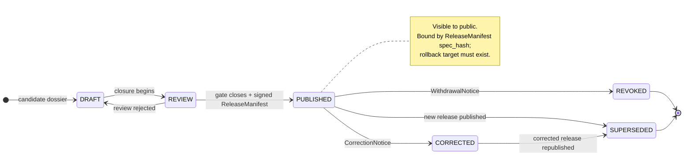
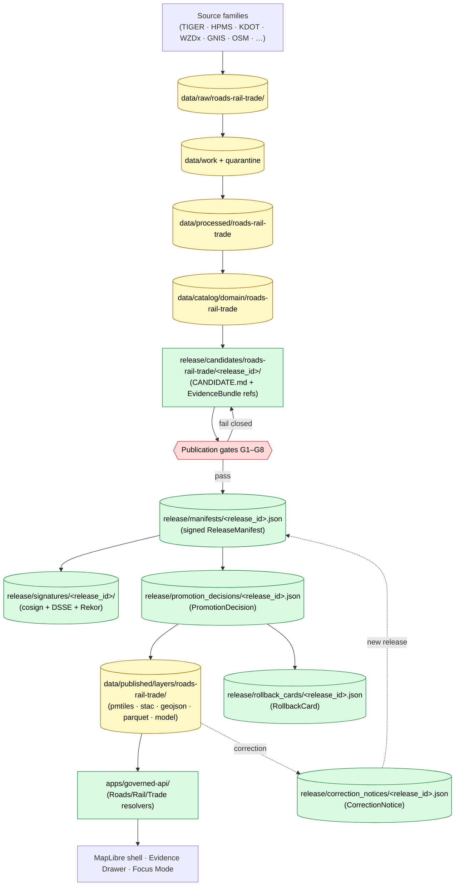

<!-- [KFM_META_BLOCK_V2]
doc_id: kfm://doc/docs-domains-roads-rail-trade-release-index
title: Roads, Rail, and Trade Routes Domain — Release Index
type: standard
version: v1.1-draft
status: draft
owners: TODO Roads/Rail/Trade domain steward + Docs steward + Release authority
created: 2026-05-19
updated: 2026-06-07
policy_label: public
related: [docs/domains/roads-rail-trade/README.md, docs/domains/roads-rail-trade/OBJECT_FAMILIES.md, docs/domains/roads-rail-trade/PIPELINE.md, docs/domains/roads-rail-trade/PRESERVATION_MATRIX.md, docs/doctrine/directory-rules.md, docs/standards/PROV.md, docs/standards/PMTILES.md, release/README.md, schemas/contracts/v1/release/release_manifest.schema.json, ai-build-operating-contract.md]
tags: [kfm, roads-rail-trade, release, governance, publication, rollback, correction]
notes: [
  "CONTRACT_VERSION = 3.0.0 pinned for this doctrine-adjacent doc.",
  "All per-domain repo-state claims are PROPOSED or NEEDS VERIFICATION; no mounted repo was inspected. The release/ ROOT LAYOUT itself is CONFIRMED doctrine (Directory Rules §9.2 / repo guiding doc §7).",
  "CORRECTION v1->v1.1: schema/contract homes are schemas/contracts/v1/transport/ and contracts/transport/ per Atlas Ch.24.13 row 13 + ENCY §7.11 - NOT domains/roads-rail-trade/. The transport/ slug applies to schemas+contracts; roads-rail-trade applies to docs/policy/tests/fixtures/data/pipelines/release. Documented divergence tracked as OQ-RRT-01 / Open Question #11.",
  "RouteUncertaintyProfile softened to anchored UncertaintySurface (doctrine-synthesis §16); reinstatement note retained in Open Question #5.",
  "release_state enum conflict (UPPERCASE schema form vs STAC-profile lowercase) is surfaced in §3 and Open Question #1.",
  "Register entries in §10 are illustrative TEMPLATE form. Suffix -template marks every row to prevent confusion with real releases.",
  "Sensitivity posture for Indigenous trade and mobility corridors defaults to steward review and generalized public geometry per Atlas §13.I."
]
[/KFM_META_BLOCK_V2] -->

# Roads, Rail, and Trade Routes domain — Release Index

> Human-facing index of every Roads/Rail/Trade release record, candidate, correction, and rollback — and the gates each one must close before public exposure.

<!-- badges -->


**Status:** draft · **Owners:** `TODO Roads/Rail/Trade domain steward + Docs steward + Release authority` · **Last updated:** 2026-06-07 · **Contract:** `CONTRACT_VERSION = "3.0.0"`

> [!IMPORTANT]
> **Schema & contract homes use the `transport/` segment, not `domains/roads-rail-trade/`.** Atlas Ch. 24.13 row 13 and Encyclopedia §7.11 assign Roads/Rail/Trade to `schemas/contracts/v1/transport/` and `contracts/transport/` ("Network identity governance"). The `roads-rail-trade` slug applies to `docs/`, `policy/`, `tests/`, `fixtures/`, `data/`, `pipelines/`, and `release/`. This documented divergence is tracked as **Open Question #11 (`OQ-RRT-01`)**.

---

## Table of contents

1. [Purpose and scope](#1-purpose-and-scope)
2. [Doctrine basis](#2-doctrine-basis)
3. [Release lifecycle states](#3-release-lifecycle-states)
4. [Release surface — layer families and artifact kinds](#4-release-surface--layer-families-and-artifact-kinds)
5. [Roads/Rail/Trade source-role discipline](#5-roadsrailtrade-source-role-discipline)
6. [Sensitivity, rights, and freshness posture](#6-sensitivity-rights-and-freshness-posture)
7. [Publication path (overview)](#7-publication-path-overview)
8. [Publication gates and required closure](#8-publication-gates-and-required-closure)
9. [Release-ID and naming conventions](#9-release-id-and-naming-conventions)
10. [Roads/Rail/Trade releases register (TEMPLATE form)](#10-roadsrailtrade-releases-register-template-form)
11. [Release entry template](#11-release-entry-template)
12. [Correction and rollback index](#12-correction-and-rollback-index)
13. [Roles and separation of duties](#13-roles-and-separation-of-duties)
14. [Roads/Rail/Trade-specific anti-patterns](#14-roadsrailtrade-specific-anti-patterns)
15. [Open questions and verification backlog](#15-open-questions-and-verification-backlog)
16. [Related docs](#16-related-docs)
17. [Glossary (appendix)](#17-glossary-appendix)

---

## 1. Purpose and scope

This document is the **human-facing index** for everything the Roads, Rail, and Trade Routes domain has published, is preparing to publish, has corrected, or has rolled back. It exists so a steward, reviewer, or maintainer can answer four questions at a glance:

1. *Which Roads/Rail/Trade releases exist or are pending?*
2. *What state is each release in, and what artifacts back it?*
3. *Where do its canonical decision records live in the repository?*
4. *What governance and posture applies to Roads/Rail/Trade publication?*

It does **not** decide releases. Release decisions live in `release/` (manifests, promotion decisions, rollback cards, correction notices, signatures) and conform to the `ReleaseManifest` schema. This index points to those records and explains them in prose.

> [!NOTE]
> **CONFIRMED doctrine** (Directory Rules §9.2). `ReleaseManifest` records live under `release/manifests/`. `PromotionDecision` records live under `release/promotion_decisions/`. `RollbackCard` records live under `release/rollback_cards/`. `CorrectionNotice` records live under `release/correction_notices/`. Withdrawn release records live under `release/withdrawal_notices/`. Released **artifacts** (PMTiles, STAC items, GeoJSON, Parquet, models) live under `data/published/layers/roads-rail-trade/`. **Mixing release decisions with released artifacts is one of the four named drift patterns** (Directory Rules §13.2). The `release/` root layout is **CONFIRMED root observed**; the per-domain *presence* of these lanes is NEEDS VERIFICATION.

**Scope (what this index covers):**

- All Roads/Rail/Trade `ReleaseManifest` entries — `DRAFT`, `REVIEW`, `PUBLISHED`, `REVOKED`, `SUPERSEDED`.
- All Roads/Rail/Trade **release candidates** (`release/candidates/roads-rail-trade/`).
- Cross-references to the `PromotionDecision`, `RollbackCard`, and `CorrectionNotice` records that bind each release.
- Roads/Rail/Trade-specific publication posture (source-role discipline, sensitivity tiers, freshness rules, graph-projection rollback).

**Out of scope (covered elsewhere):**

- Object families, ubiquitous language, pipeline shape, and cross-lane relations → see [`./README.md`](./README.md), [`./OBJECT_FAMILIES.md`](./OBJECT_FAMILIES.md), [`./PIPELINE.md`](./PIPELINE.md), and Atlas Chapter 13.
- Multi-axis preservation duties → see [`./PRESERVATION_MATRIX.md`](./PRESERVATION_MATRIX.md).
- Source descriptors, rights, cadence → see [`./SOURCE_INDEX.md`](./SOURCE_INDEX.md) *(PROPOSED neighbor doc)*.
- Catalog/STAC closure → see [`./CATALOG_INDEX.md`](./CATALOG_INDEX.md) *(PROPOSED neighbor doc)*.
- Operational refresh procedures → see [`docs/runbooks/`](../../runbooks/) (Roads/Rail/Trade runbook not yet authored; NEEDS VERIFICATION).

[⬆ Back to top](#roads-rail-and-trade-routes-domain--release-index)

---

## 2. Doctrine basis

The behavior of this index is governed by the following project-wide doctrine. Each row is a direct citation; KFM-specific terminology (`EvidenceBundle`, `EvidenceRef`, `SourceDescriptor`, `ReleaseManifest`, `PromotionDecision`, `RollbackCard`, `RunReceipt`, `AIReceipt`, `spec_hash`, `JCS+SHA-256`, *RAW → WORK/QUARANTINE → PROCESSED → CATALOG/TRIPLET → PUBLISHED*) is preserved verbatim.

| Anchor | Doctrine | Source |
|---|---|---|
| **D-1** Lifecycle invariant | `RAW → WORK/QUARANTINE → PROCESSED → CATALOG/TRIPLET → PUBLISHED`. Promotion is a **governed state transition**, not a file move. | Directory Rules §9 · Atlas §13.H |
| **D-2** Default-deny promotion | Unclear rights, unresolved source role, missing evidence, unresolved sensitivity, or absent release state **blocks public promotion**. | Atlas §13.I · §1 (operating-law invariant) |
| **D-3** ReleaseManifest as the publishable artifact | When the gate allows promotion to `PUBLISHED`, it emits a **`ReleaseManifest`**: a single, signed, hashable JSON object listing every dataset (by stable ID), every bundle (by `spec_hash`), every PMTiles archive (by `spec_hash`), and every layer manifest (by `spec_hash`). Consumers bind to the `ReleaseManifest` — never to floating "latest" pointers. | Atlas Pass 23/32 card KFM-P7-PROG-0003 (NI-425) |
| **D-4** Release index entry fields | Each release index entry carries `dataset_id`, `spec_hash`, `run_receipt`, `SPDX`, `timestamp`, and **evidence bundle digest**. | Atlas Pass 15 addendum (referenced from KFM-P7-PROG-0003) |
| **D-5** Artifact-kind enum | `ReleaseManifest` artifact-kind enum includes `pmtiles`, `stac`, `geojson`, `parquet`, `model`, `manifest`, `receipt`. | Master MapLibre Update Packet ML-058-044 |
| **D-6** Public path discipline | Public clients and normal UI surfaces use **governed APIs**, not canonical/internal stores. | Atlas operating-law invariant 2 · Directory Rules §6 |
| **D-7** Cite-or-abstain | Default truth posture: an answer is cited or it abstains. | Atlas §1 · Encyclopedia §2.1 |
| **D-8** Authenticated rollback | Rollback is modeled as an **authenticated, receipt-backed inverse-patch operation**, not an ad hoc file copy. | Atlas card KFM-P16-IDEA-0005 |
| **D-9** Separation of duties | Author ≠ release authority for material releases; sensitive-lane releases require author + sensitivity reviewer + release authority + rights-holder representative. | Atlas §24.7.2 separation-of-duties matrix |
| **D-10** Roads/Rail/Trade publication closure | Roads/Rail publication requires `ReleaseManifest`, `EvidenceBundle`, validation/policy support, review state where required, correction path, stale-state rule, and rollback target. | Atlas §13.M |
| **D-11** Drift pattern: release vs. published | `release/` owns release **decisions**; `data/published/` owns released **artifacts**. Mixing them is a named drift pattern. | Directory Rules §13.2 |
| **D-12** Source-role fixed at admission | Source role (`observed \| regulatory \| modeled \| aggregate \| administrative \| candidate \| synthetic`) is set in the `SourceDescriptor` at admission and **never upgraded by promotion**. | Atlas §24.1 (anti-collapse register) |

[⬆ Back to top](#roads-rail-and-trade-routes-domain--release-index)

---

## 3. Release lifecycle states

> [!IMPORTANT]
> **Two `release_state` vocabularies coexist in the project corpus.** The KFM schema-form uses **UPPERCASE** values; STAC-flavored release-state profiles use **lowercase**. This index renders both **side by side** and re-raises the choice as Open Question #1 in §15. **No state name is fabricated**; both forms are project-sourced.

| KFM schema form (PROPOSED canonical) | STAC-profile form (alternative) | Meaning | Visible to public? |
|---|---|---|---|
| `DRAFT` | `draft` | Candidate exists; not promoted. Manifest may not yet be signed. | No |
| `REVIEW` | `under-review` | Closure underway; required reviews open. | No |
| `PUBLISHED` | `published` | Promotion gate closed; `ReleaseManifest` signed; artifacts served via governed API. | Yes |
| `SUPERSEDED` | `superseded` | A newer release replaces this one; prior manifest retained for audit. | Indexed, marked stale |
| `REVOKED` | `revoked` | Publication withdrawn for cause; `WithdrawalNotice` issued. | Indexed, marked withdrawn |
| `CORRECTED` *(PROPOSED, NEEDS VERIFICATION)* | `corrected` | A `CorrectionNotice` amends the published claim without full revocation. | Yes, with correction badge |

**State transitions** (CONFIRMED doctrine where labeled):



[⬆ Back to top](#roads-rail-and-trade-routes-domain--release-index)

---

## 4. Release surface — layer families and artifact kinds

Roads/Rail/Trade releases cover the public-safe viewing surface defined in Atlas §13.G. Each layer family below maps to one or more `ReleaseManifest` entries.

| Layer family | One-line purpose | Object families involved | Sensitivity default | Status |
|---|---|---|---|---|
| **Modern roads layer** | Current Kansas road network (centerlines, classification, functional class). | `Road Segment`, `Network Node`, `Crossing` | T0 (public; legal-class evidence only) | PROPOSED |
| **Rail alignment layer** | Active and historic rail corridors and operator assignments. | `Rail Segment`, `Depot`, `Siding`, `Yard`, `OperatorAssignment` | T0; **critical transport facilities → review** | PROPOSED |
| **Facility / crossing view** | Bridges, ferries, river crossings, grade crossings. | `Bridge`, `Ferry`, `River Crossing`, `Crossing`, `TransportFacility` | T0 mostly; **T2/T4 infrastructure-critical → review** | PROPOSED |
| **Restriction / status timeline** | Time-aware access restrictions, work zones, closures. | `RestrictionEvent`, `StatusEvent`, `Route Event` | T0–T1; **WZDx = observed, not history** | PROPOSED |
| **Freight-corridor context** | National Highway Freight Network and freight corridor designations. | `Freight Corridor`, `Network Edge` | T0–T1; **regulatory/administrative role** | PROPOSED |
| **Historic route claim view** | Wagon, military, mail, emigrant, stage, cattle, and trade-route claims. | `Historic RouteClaim`, `CorridorRoute` | **T1 — steward review + uncertainty labeling**; precision generalized | PROPOSED |
| **Generalized trade-route corridor** | Indigenous trade and mobility corridors as **generalized polygons**, not lines. | `TradeRouteCorridor` | **T2/T4 — Indigenous / cultural → steward review; generalized public geometry** | PROPOSED |
| **Derived graph / connectivity view** | Transport graph projection for connectivity reasoning. | `Network Edge`, `Network Node` (graph derivative) | **Derivative, never canonical**; graph rollback required | PROPOSED |

**Artifact kinds packaged in each `ReleaseManifest`** (CONFIRMED enum per D-5):

`pmtiles` · `stac` · `geojson` · `parquet` · `model` · `manifest` · `receipt`

> [!NOTE]
> A `ReleaseManifest` for Roads/Rail/Trade typically includes **at least one `pmtiles` archive, at least one `stac` item, one or more `receipt` records (run, validation, AI, ingest, release), and exactly one signed `manifest` self-reference.** *(PROPOSED for this domain — verify against actual release manifests when they exist.)*

[⬆ Back to top](#roads-rail-and-trade-routes-domain--release-index)

---

## 5. Roads/Rail/Trade source-role discipline

> [!WARNING]
> **Source-role collapse is the highest-priority anti-pattern for this domain.** Every Roads/Rail/Trade source family must be admitted with an explicit role that **cannot be upgraded** by promotion (D-12; Atlas §24.1.2 names Roads at-risk for the *administrative-as-observed* collapse). Treating an observational feed (e.g., OpenStreetMap edits, WZDx work-zone events) as a `regulatory` or `authority` claim is a release-gate failure (reason: `ROLE_COLLAPSE` / `ROLE_DOWNCAST_FORBIDDEN`).

CONFIRMED source families (Atlas §13.D), mapped to the **seven canonical source-role classes** (Atlas §24.1). The role column is an **INFERRED** default mapping; the binding role is whatever the `SourceDescriptor` records per-record at admission. Atlas §13.D records the role as "as source role requires."

| Source family | Canonical role(s) — INFERRED default | Rights / sensitivity | Freshness cadence |
|---|---|---|---|
| Census TIGER/Line roads | `observed` / `administrative` | Public; **role as source descriptor declares** | Annual vintage |
| FHWA HPMS | `administrative` / `aggregate` | NEEDS VERIFICATION (terms) | Annual |
| FHWA National Highway Freight Network | `regulatory` / `administrative` | NEEDS VERIFICATION (terms) | Periodic |
| WZDx feeds | **`observed` only** (work-zone event stream) | NEEDS VERIFICATION (terms); **never a historical record by itself** | Near real-time |
| KDOT / KanPlan / KanDrive / Kansas GIS | `administrative` / `observed` (live conditions) | NEEDS VERIFICATION (terms) | Source-vintage or cadence specific |
| County / state bridge and restriction data | `administrative` / `observed` | NEEDS VERIFICATION; **infrastructure-critical joins fail closed** | Source-vintage |
| GNIS names | `administrative` for **naming only** — **not** for legal status, geometry, or designation | Public | Periodic |
| OpenStreetMap | **`observed` / `candidate`** — never `regulatory`/`authority` for legal class, designation, or restriction | Public (per OSM ODbL — verify) | Continuous |

> [!CAUTION]
> **GNIS is a naming authority, not a legal-status authority.** Treating a GNIS name match as proof of designation, classification, or restriction is a `ROLE_COLLAPSE` denial (validator PROPOSED: *"OSM/GNIS legal-status denial"*, Atlas §13.K).

> [!CAUTION]
> **OpenStreetMap is an observed/candidate source, not a regulatory source for legal class.** OSM tags reflect community editorial state; releases citing OSM may not present OSM-derived class, designation, restriction, or legal status as canonical. Promotion to a higher source role requires an explicit ADR; absent that, validators must deny.

[⬆ Back to top](#roads-rail-and-trade-routes-domain--release-index)

---

## 6. Sensitivity, rights, and freshness posture

CONFIRMED doctrine (Atlas §13.I): *"Indigenous trade and mobility corridors, oral history, treaty, cultural, and interpretive evidence default to steward review and generalized public geometry. Critical transport facilities require review."* The lane sensitivity baseline is **T1** (ENCY §7.11); core road/rail/corridor segments default to **T0** (Atlas §24.14), rising to **T4** for cultural corridors and critical-facility detail.

| Material | Default posture | Required reviewers (at material release) |
|---|---|---|
| Indigenous trade and mobility corridors | **T2/T4 — steward review + generalized geometry**; precise lines denied | Domain steward + sensitivity reviewer + **rights-holder representative** |
| Treaty corridors, oral history routes | **Steward review**; geometry uncertainty surfaced; cultural sensitivity flag | Domain steward + sensitivity reviewer + rights-holder representative |
| Historic route claims (wagon, military, mail, emigrant, stage, cattle, trade) | **T1 — steward review for overprecision**; uncertainty labels required | Domain steward + sensitivity reviewer |
| Critical transport facilities (bridges, sensitive crossings, key freight nodes) | **T4 restricted detail**; review before public exposure | Domain steward + sensitivity reviewer |
| Modern road centerlines and classifications (TIGER/Line, KDOT) | **T0 public** if rights resolved | Domain steward |
| Operator assignments, rail operator details | **Public-safe roll-up**; operator-sensitive specifics restricted | Domain steward |
| WZDx work-zone observations | **T0 public** as observed; never republished as historical record | Domain steward |
| Derived transport graph (connectivity projection) | **Public**, but always labeled as **derivative**; rollback required | Domain steward |

**Freshness rules:**

- **WZDx and KDOT/KanDrive live feeds:** stale-source badge when source cadence exceeds declared tolerance. UI must reflect freshness; release manifests pin a source snapshot, not a live feed.
- **TIGER/Line and HPMS:** annual vintage; releases name the vintage in the `dataset_version` field.
- **Historic route claims:** time-aware; *valid_time* and *observed_time* preserved distinctly (Atlas §13.E — *"source, observed, valid, retrieval, release, and correction times stay distinct where material"*).
- **Derived graph:** stale **whenever any input layer is stale**; staleness propagates through the projection.

> [!CAUTION]
> **KFM is never an alert authority.** Releases must not present restriction, closure, work-zone, or freight-corridor data as an emergency-routing source. Hazards owns hazard-event truth (Atlas §12 / §24.4). Roads/Rail/Trade publishes context, not instruction.

Per-object tier baselines and the full preservation duty set live in [`./PRESERVATION_MATRIX.md`](./PRESERVATION_MATRIX.md).

[⬆ Back to top](#roads-rail-and-trade-routes-domain--release-index)

---

## 7. Publication path (overview)

The diagram below shows where a Roads/Rail/Trade release decision sits in the broader lifecycle. The `release/` lanes are **CONFIRMED root layout** (Directory Rules §9.2); the `data/` lifecycle lanes follow the CONFIRMED lifecycle invariant. Per-domain *presence* of every lane is NEEDS VERIFICATION.



[⬆ Back to top](#roads-rail-and-trade-routes-domain--release-index)

---

## 8. Publication gates and required closure

> **CONFIRMED doctrine / PROPOSED implementation.** Roads/Rail/Trade publication requires complete closure across the gates below. Missing any required artifact means the transition **fails closed** and the prior state is preserved (Atlas §13.M; D-10). These domain gates G1–G8 map onto the universal Promotion Gates A–G (Build Manual §6.2); the universal letters may be finalized by ADR.

| ID *(PROPOSED label)* | Gate | Required artifact(s) | On fail (reason code) |
|---|---|---|---|
| **G1** | Source-role authority | `SourceDescriptor`; source-role registry entry; role-collapse validator pass | HOLD at RAW; `RIGHTS_UNKNOWN` or `ROLE_COLLAPSE` / `ROLE_DOWNCAST_FORBIDDEN` |
| **G2** | Rights & sensitivity resolution | Rights review; sensitivity classification; Indigenous-corridor sensitivity review where applicable | QUARANTINE; `SENSITIVITY_UNRESOLVED` |
| **G3** | Designation / route-membership separation | Designation evidence distinct from observation; *"Route membership and designation separation tests"* (PROPOSED, Atlas §13.K) | HOLD at WORK; `SCHEMA_MISMATCH` (designation) |
| **G4** | Historic overprecision check | Uncertainty profile; generalized geometry where required; *"historic overprecision denial"* test (PROPOSED, Atlas §13.K) | HOLD at PROCESSED; `OVERPRECISION_DENIED` *(PROPOSED reason)* |
| **G5** | Generalization receipt | `RedactionReceipt` for trade-route generalization; *"public generalization receipt tests"* (PROPOSED, Atlas §13.K) | HOLD at PROCESSED; `REDACTION_RECEIPT_MISSING` *(PROPOSED)* |
| **G6** | EvidenceBundle closure | `EvidenceBundle` resolves every `EvidenceRef`; digest closure; bundle digest captured in release index entry (D-4) | HOLD at CATALOG; `MISSING_EVIDENCE` |
| **G7** | Review state (where required) | `ReviewRecord` from independent reviewer for cultural / critical-facility lanes; separation of duties enforced (D-9) | HOLD; `REVIEW_NEEDED` / `REVIEW_INSUFFICIENT` |
| **G8** | Release manifest, signatures & rollback | Signed `ReleaseManifest` (cosign + DSSE + Rekor inclusion); rollback target present; graph-projection rollback test *(PROPOSED, Atlas §13.K)* passes for derived-graph layers | HOLD; `RELEASE_MANIFEST_INVALID` or `ROLLBACK_TARGET_MISSING` |

> [!NOTE]
> **Watcher-as-non-publisher invariant** *(CONFIRMED doctrine).* Roads/Rail/Trade source-drift detectors, KDOT/WZDx ingest watchers, and OSM diff watchers emit **candidate** records — they do **not** publish, mutate canonical truth, or expose `RAW`/`WORK`/`QUARANTINE` payloads to public surfaces. Watcher output enters the lifecycle on the WORK side (with an `EventRunReceipt`) and requires explicit promotion through G1–G8.

[⬆ Back to top](#roads-rail-and-trade-routes-domain--release-index)

---

## 9. Release-ID and naming conventions

`release_id` is the primary key of every Roads/Rail/Trade release. It appears in `ReleaseManifest`, `PromotionDecision`, `RollbackCard`, `CorrectionNotice`, `WithdrawalNotice`, and the register row in §10.

**PROPOSED convention** (pending ADR; see Open Question #2):

```text
rel-roads-<surface>-<scope>-<vN>
```

Where:

- `rel-` — fixed prefix marking the value as a release identifier (not a dataset id or bundle id).
- `roads` — domain prefix. The full directory name `roads-rail-trade` is **not** used in `release_id`; `roads` is the canonical short form used in the Atlas dossier short-name `[DOM-ROADS]`.
- `<surface>` — one of: `modern` · `rail` · `facility` · `restriction` · `freight` · `historic` · `corridor` · `graph`.
- `<scope>` — short slug for the scope of the release (e.g., `network`, `alignment`, `crossings`, `kansas-wide`, `trade-route-generalized`).
- `<vN>` — monotonic version segment (`v1`, `v2`, …). Re-releases that correct an earlier release **never** reuse a prior `release_id` (D-3 content-addressing invariant).

**Disallowed forms:**

- Reusing a prior `release_id` for a corrected release. Corrections create a **new** `release_id` and link back to the prior one via `SUPERSEDED`.
- Embedding a date in `release_id` (use the `timestamp` field instead).
- Embedding a `spec_hash` substring in `release_id` (the manifest carries `spec_hash`; `release_id` stays human-readable).

[⬆ Back to top](#roads-rail-and-trade-routes-domain--release-index)

---

## 10. Roads/Rail/Trade releases register (TEMPLATE form)

> [!NOTE]
> **No Roads/Rail/Trade release is CONFIRMED in this session.** The rows below are **illustrative TEMPLATE form** to show the expected shape of the register. The `-template` suffix on every `release_id` makes their illustrative status unmissable. Real entries replace these only once `release/manifests/` evidence exists and an ADR has frozen the `release_state` enum (see §15 Open Question #1).

| `release_id` *(template)* | Title | State *(PROPOSED enum)* | Created | Spec hash | Manifest | Evidence bundle | Rollback target | Notes |
|---|---|---|---|---|---|---|---|---|
| `rel-roads-modern-network-v1-template` | *(template)* Kansas modern roads network — public layer | `DRAFT` | `YYYY-MM-DDTHH:MM:SSZ` | `jcs:sha256:…` | `release/manifests/rel-roads-modern-network-v1-template.json` | `data/proofs/evidence_bundle/<bundle_id>.json` | `null` *(initial)* | NEEDS VERIFICATION — rights confirmation for TIGER/Line + KDOT |
| `rel-roads-rail-alignment-v1-template` | *(template)* Rail alignment & depot layer | `DRAFT` | `YYYY-MM-DDTHH:MM:SSZ` | `jcs:sha256:…` | `release/manifests/rel-roads-rail-alignment-v1-template.json` | `data/proofs/evidence_bundle/<bundle_id>.json` | `null` *(initial)* | NEEDS VERIFICATION — operator sensitivity review |
| `rel-roads-historic-claim-v1-template` | *(template)* Historic route claims — generalized public view | `DRAFT` | `YYYY-MM-DDTHH:MM:SSZ` | `jcs:sha256:…` | `release/manifests/rel-roads-historic-claim-v1-template.json` | `data/proofs/evidence_bundle/<bundle_id>.json` | `null` *(initial)* | NEEDS VERIFICATION — overprecision denial test + uncertainty labels |
| `rel-roads-corridor-trade-v1-template` | *(template)* Indigenous trade & mobility corridors — generalized polygons | `DRAFT` | `YYYY-MM-DDTHH:MM:SSZ` | `jcs:sha256:…` | `release/manifests/rel-roads-corridor-trade-v1-template.json` | `data/proofs/evidence_bundle/<bundle_id>.json` | `null` *(initial)* | NEEDS VERIFICATION — **rights-holder representative review required**; `RedactionReceipt` required |
| `rel-roads-graph-connectivity-v1-template` | *(template)* Transport graph — derived connectivity projection | `DRAFT` | `YYYY-MM-DDTHH:MM:SSZ` | `jcs:sha256:…` | `release/manifests/rel-roads-graph-connectivity-v1-template.json` | `data/proofs/evidence_bundle/<bundle_id>.json` | `null` *(initial)* | NEEDS VERIFICATION — graph-projection rollback test (Atlas §13.K) required; **graph is derivative, not canonical** |

> **Append-only invariant.** The register MUST be **append-only** with respect to `release_id`. Corrections create a **new** `release_id` and append a row, then mark the prior row `SUPERSEDED` (or `REVOKED`) with a forward link. **Never silently edit** a prior released row.

[⬆ Back to top](#roads-rail-and-trade-routes-domain--release-index)

---

## 11. Release entry template

When adding a new entry, fill out the block below in the release candidate dossier (`release/candidates/roads-rail-trade/<release_id>/CANDIDATE.md`) first, then mirror the summary row into §10.

```yaml
# release/candidates/roads-rail-trade/<release_id>/CANDIDATE.md
# PROPOSED candidate-dossier shape; not a substitute for the signed ReleaseManifest.

release_id: rel-roads-<surface>-<scope>-vN
title: Human-readable title
state: DRAFT          # PROPOSED enum; see §3 and Open Question #1
created: 2026-MM-DDTHH:MM:SSZ
updated: 2026-MM-DDTHH:MM:SSZ

surface: modern | rail | facility | restriction | freight | historic | corridor | graph
scope:   short slug

# D-3 / D-4: content-addressed binding
spec_hash:            jcs:sha256:<hex>      # JCS (RFC 8785) + SHA-256 of the ReleaseManifest body
dataset_id:           <stable id from the source registry>
dataset_version:      <vintage / version string>

# D-4 required release-index fields
run_receipt:          path or kfm:// id of the canonical RunReceipt
spdx:                 <SPDX license expression, e.g. CC0-1.0, CC-BY-4.0>
timestamp:            2026-MM-DDTHH:MM:SSZ
evidence_bundle_digest: jcs:sha256:<hex>

# D-5 artifact-kind enum: pmtiles · stac · geojson · parquet · model · manifest · receipt
artifacts:
  - kind: pmtiles
    path: data/published/layers/roads-rail-trade/<release_id>/<name>.pmtiles
    digest: jcs:sha256:<hex>
  - kind: stac
    path: data/published/layers/roads-rail-trade/<release_id>/stac/item.json
    digest: jcs:sha256:<hex>
  - kind: manifest
    path: release/manifests/<release_id>.json
    digest: jcs:sha256:<hex>
  - kind: receipt
    path: data/receipts/release/<release_id>.json
    digest: jcs:sha256:<hex>

# Gate closure (§8). Mark each gate ✅ passed, ⏳ pending, ❌ failed.
gates:
  G1_source_role:               ⏳
  G2_rights_sensitivity:        ⏳
  G3_designation_separation:    ⏳
  G4_historic_overprecision:    ⏳
  G5_generalization_receipt:    ⏳
  G6_evidence_bundle_closure:   ⏳
  G7_review_state:              ⏳
  G8_manifest_signatures_rollback: ⏳

reviewers:
  domain_steward:           "TODO"
  sensitivity_reviewer:     "TODO (required for historic / corridor / facility surfaces)"
  rights_holder_rep:        "TODO (required for trade-route-corridor lanes)"
  release_authority:        "TODO (≠ author when materiality applies)"

rollback_target: null    # set to prior release_id on first re-release
correction_links: []

# Cross-lane impact (Atlas §13.F)
crosses_lanes:
  - lane: settlements-infrastructure
    relation: depots, crossings, facilities, dependencies
  - lane: hydrology
    relation: bridge/ferry/ford/river crossing
  - lane: hazards
    relation: closure, detour, exposure (context only — KFM is not an alert authority)
  - lane: archaeology-cultural-heritage
    relation: historic routes, Indigenous corridors, forts, missions

notes: |
  Free-form. State assumptions, label PROPOSED items, link evidence.
```

[⬆ Back to top](#roads-rail-and-trade-routes-domain--release-index)

---

## 12. Correction and rollback index

CONFIRMED doctrine (Unified Implementation Architecture Build Manual §20; Atlas §13.M; D-8): **correction and rollback are publication requirements, not afterthoughts.** A released Roads/Rail/Trade claim, layer, catalog record, or artifact must have a **visible correction path and rollback target** before it is treated as safely publishable.

| Defect class | Correction posture | Rollback posture | Reason code (PROPOSED) |
|---|---|---|---|
| Evidence gap | `ABSTAIN` or withdraw unsupported claim | Restore prior evidence-supported release | `MISSING_EVIDENCE` |
| Source-role collapse | Reissue with corrected role; deny upcast | Restore prior release that respected the role | `ROLE_COLLAPSE` |
| Rights / sovereignty | Withdraw until resolved | Restore prior compliant release | `RIGHTS_UNKNOWN` |
| Sensitivity (cultural / critical facility) | Re-redact, re-generalize; rights-holder rep re-review | Restore prior compliant release | `SENSITIVITY_UNRESOLVED` |
| Historic overprecision | Re-publish with uncertainty profile and generalized geometry | Roll back to prior generalized release | `OVERPRECISION_DENIED` |
| Geometry / topology defect | New release with topology fix; superseded forward-link | Restore prior topology-correct release | `GEOMETRY_INVALID` *(PROPOSED)* |
| Temporal / status defect | New release with corrected event times | Restore prior temporally consistent release | `TEMPORAL_INCONSISTENT` *(PROPOSED)* |
| **Graph projection drift** | New release with rebuilt graph and replay-verification receipt | **Authenticated graph rollback** to prior root-hash (Atlas §13.K *"transport graph projection rollback tests"*) | `GRAPH_ROLLBACK_REQUIRED` *(PROPOSED)* |
| API / rendering defect | Re-render and re-publish; correct UI marker | Restore prior render | `RENDER_DEFECT` *(PROPOSED)* |

> [!IMPORTANT]
> **Graph projection rollback is a Roads/Rail/Trade-specific correction class.** The derived transport graph is a public-facing layer that depends on every upstream Road / Rail / Crossing / Facility release. A defect in any upstream release **may force a graph rollback** even if the upstream release itself does not need correction. The graph's `rollback_target` must always resolve to a prior root-hash with a passing replay-verification receipt. A `CorrectionNotice` must list invalidated derivatives **before** the rollback repoints current state.

[⬆ Back to top](#roads-rail-and-trade-routes-domain--release-index)

---

## 13. Roles and separation of duties

CONFIRMED doctrine (Atlas §24.7; D-9): release-time separation of duties is **maturity-dependent** and **enforced through tooling** as the public trust surface expands. The roles below are the minimum set Roads/Rail/Trade releases will use; named individuals are deliberately not fabricated.

| Role | Scope for Roads/Rail/Trade | Required separation |
|---|---|---|
| **Domain steward** | Owns contracts, validators, register integrity. | May author + approve **non-material**, **non-sensitive** routine; otherwise no. |
| **Sensitivity reviewer** | Reviews redaction, generalization, withholding, and tier decisions for cultural-corridor and infrastructure-critical lanes. | **Always distinct from author** for sensitive-lane releases. |
| **Rights-holder representative** | Confirms sovereignty / cultural-heritage decisions for Indigenous trade and mobility corridors and treaty-corridor evidence. | **Always distinct from author and steward** for any release citing Indigenous, treaty, oral-history, or cultural-corridor evidence. |
| **Release authority** | Issues `ReleaseManifest`; authorizes `PUBLISHED` transitions; authorizes rollback. | **Distinct from author** when materiality applies. |
| **Correction reviewer** | Reviews `CorrectionNotice` / `RollbackCard` before they amend a `PUBLISHED` claim. | **Distinct from detector / author** when correction is steward-significant. |
| **AI surface steward** | Reviews Focus Mode templates and `AIReceipt` patterns bound to Roads/Rail/Trade evidence. | Distinct from domain steward for template approval. |
| **Docs steward** | Owns this index and the related governance documentation. | Standard PR review. |

> [!NOTE]
> **Author ≠ release authority** is the single most-cited release-time separation in the doctrine (Atlas §24.7). For Roads/Rail/Trade lanes that touch Indigenous corridors, the additional **rights-holder representative** role is non-optional regardless of materiality. `ReviewRecord` is a cross-cutting §24.2 receipt, not a Roads/Rail-owned object.

[⬆ Back to top](#roads-rail-and-trade-routes-domain--release-index)

---

## 14. Roads/Rail/Trade-specific anti-patterns

| Anti-pattern | What goes wrong | Counter-rule |
|---|---|---|
| **OSM as authority for legal class or designation** | Source-role collapse; community editorial state cited as canonical. | OSM is `observed`/`candidate`. Use TIGER/Line, FHWA, or KDOT for authoritative class. (Atlas §13.K validator *"OSM/GNIS legal-status denial"*.) |
| **GNIS name match as proof of designation** | Naming authority used as legal-status authority. | GNIS is `administrative` for names **only**. |
| **WZDx feed cited as historical record** | Live observed stream republished as the historical truth of restriction or closure. | WZDx is `observed`. Historical restriction history requires a distinct authority source and source-role admission. |
| **Administrative roster cited as observed event timeline** | Source-role collapse: a facility roster or right-of-way index presented as an observed-event history. | Preserve the `administrative` role tag; use named event types (`RestrictionEvent`, `StatusEvent`). (Atlas §24.1.2 — Roads named at-risk.) |
| **Indigenous trade corridor published at precise geometry** | Sensitivity-default bypass; rights-holder review skipped. | Generalize geometry. Require rights-holder representative review. (Atlas §13.I.) |
| **Historic route claim published without uncertainty label** | Overprecision presented as evidence-grade. | Apply uncertainty profile; anchored `UncertaintySurface` object (doctrine-synthesis §16). |
| **Transport graph treated as canonical record** | Derived layer becomes the source of truth; canonical edges bypassed. | Graph is **derivative**. Canonical record remains the `Road Segment` / `Rail Segment` / `Network Edge` per Atlas §13.E. |
| **Release without rollback target on the graph projection** | Cannot roll back a graph defect without re-running every upstream pipeline. | `RollbackCard` MUST exist; graph `rollback_target` MUST resolve to a prior signed root-hash. |
| **Routing or detour treated as instruction** | KFM positioned as alert / routing authority. | KFM is **not** an alert authority. Hazards owns hazard-event truth; Roads/Rail/Trade publishes context, not instruction. |
| **Operator-sensitive rail details surfaced in public roll-up** | Operator-private information leaked through public layer. | Public-safe operator roll-up only; operator-sensitive specifics restricted. |
| **Critical-facility geometry published without review** | Infrastructure-critical exposure without sensitivity review. | Sensitivity reviewer required before publication. |
| **Schema authored under `domains/roads-rail-trade/`** | Parallel schema home; contradicts the Ch.24.13 crosswalk. | Schemas/contracts use the `transport/` segment (Atlas Ch.24.13; ENCY §7.11). |

[⬆ Back to top](#roads-rail-and-trade-routes-domain--release-index)

---

## 15. Open questions and verification backlog

Each item below is **checkable** but **not yet checked** strongly enough in this session to act as fact. Items map to entries in `docs/registers/VERIFICATION_BACKLOG.md` *(PROPOSED location; NEEDS VERIFICATION)*.

| # | Open question / verification item | Why it matters | What would settle it |
|---|---|---|---|
| 1 | **`release_state` enum reconciliation.** UPPERCASE schema form vs. STAC-profile lowercase form coexist in the corpus. | The register in §10 cannot be canonicalized without one chosen form. | ADR; schema freeze under `schemas/contracts/v1/release/release_state.schema.json` *(PROPOSED path)*. |
| 2 | **`release_id` naming convention freeze.** §9 proposes `rel-roads-<surface>-<scope>-vN`. | Once written, IDs are immutable; the form must be stable. | ADR with examples and a regex. |
| 3 | **Indigenous / cultural corridor policy.** Atlas §13.N verification item *"Verify Indigenous/cultural corridor policy."* | Rights-holder representative role at release time depends on this policy being explicit. | Policy bundle under `policy/sensitivity/transport/` or `policy/domains/roads-rail-trade/` *(PROPOSED)*; rights-holder consultation log. |
| 4 | **KDOT / FHWA / FRA / WZDx source terms.** Atlas §13.N verification item. | Rights resolution is a G2 gate input. | Source rights review captured in `data/registry/sources/roads-rail-trade/` *(PROPOSED)*. |
| 5 | **`UncertaintySurface` realization for historic routes.** Atlas §13.N verification item. | G4 overprecision check depends on this profile object. *(Anchored from the earlier-draft `RouteUncertaintyProfile`, which is not a corpus term — doctrine-synthesis §16 names `UncertaintySurface`.)* | Contract Markdown + JSON Schema + fixtures + validator under `schemas/contracts/v1/transport/` *(PROPOSED)*. |
| 6 | **Transport graph and MapLibre integration.** Atlas §13.N verification item. | Graph rollback class (§12) and G8 graph-rollback test depend on this. | Integration evidence; replay-verification receipt fixture. |
| 7 | **`release/` per-domain lane presence in the mounted repo.** The `release/` root layout is CONFIRMED doctrine (Directory Rules §9.2); per-domain candidate/manifest presence is NEEDS VERIFICATION. | Every per-domain path in this index resolves through `release/`. | `git ls-tree`-equivalent inspection. |
| 8 | **`release_manifest.schema.json` home.** ADR-0001 defaults to `schemas/contracts/v1/release/`; alternative `contracts/release/` is lineage. | Schema citation in §11 depends on this resolution. | ADR-0001 check; current repo inspection. |
| 9 | **`WithdrawalNotice` vs. `CorrectionNotice` partitioning.** Directory Rules §9.2 lists both; their boundary is not fully resolved. | §3 state diagram needs this boundary to be canonical. | ADR; example fixtures of each. |
| 10 | **Anchor stability for `[⬆ Back to top]` links.** GitHub anchor generation for the H1 *"Roads, Rail, and Trade Routes domain — Release Index"* is **assumed** to produce `#roads-rail-and-trade-routes-domain--release-index`. | Broken back-to-top links degrade navigation. | Render on GitHub and verify; rewrite if GitHub generates a different anchor. |
| 11 | **`OQ-RRT-01` — schema/contract slug.** `transport/` (schemas+contracts, per Atlas Ch.24.13 / ENCY §7.11) vs `roads-rail-trade/` (all other roots). | Authoring a schema under the wrong slug creates a parallel definition home (Directory Rules §13.1). | ADR ratifying or unifying the two-slug pattern + drift register entry. |

[⬆ Back to top](#roads-rail-and-trade-routes-domain--release-index)

---

## 16. Related docs

> [!NOTE]
> Targets marked **PROPOSED** or **NEEDS VERIFICATION** are doctrine-anchored placement targets per Directory Rules §6.1, §9.2, and §12. Their presence in the mounted repo is not confirmed in this session.

- [`./README.md`](./README.md) — Roads/Rail/Trade domain dossier README
- [`./OBJECT_FAMILIES.md`](./OBJECT_FAMILIES.md) — object-family identity & temporal handling
- [`./PIPELINE.md`](./PIPELINE.md) — RAW → PUBLISHED lifecycle, gates A–G, receipts by phase
- [`./PRESERVATION_MATRIX.md`](./PRESERVATION_MATRIX.md) — multi-axis preservation duties
- [`./SOURCE_INDEX.md`](./SOURCE_INDEX.md) — Roads/Rail/Trade source registry index *(PROPOSED neighbor doc)*
- [`./CATALOG_INDEX.md`](./CATALOG_INDEX.md) — catalog / STAC closure index *(PROPOSED neighbor doc)*
- [`../../doctrine/directory-rules.md`](../../doctrine/directory-rules.md) — Directory Rules *(CONFIRMED authored)*
- [`../../adr/`](../../adr/) — ADR index *(NEEDS VERIFICATION)*; relevant: ADR-0001 (schema home), Open Questions #1, #2, #9, #11
- [`../../standards/PROV.md`](../../standards/PROV.md) — W3C PROV profile *(CONFIRMED authored prior session; mounted-repo presence NEEDS VERIFICATION)*
- [`../../standards/PMTILES.md`](../../standards/PMTILES.md) — PMTiles profile *(CONFIRMED authored prior session; mounted-repo presence NEEDS VERIFICATION)*
- [`../../standards/OGC-API-TILES.md`](../../standards/OGC-API-TILES.md) — OGC API — Tiles profile *(CONFIRMED authored prior session; NEEDS VERIFICATION)*
- [`../../runbooks/`](../../runbooks/) — Operational runbooks (Roads/Rail/Trade runbook not yet authored)
- [`../../registers/VERIFICATION_BACKLOG.md`](../../registers/VERIFICATION_BACKLOG.md) — Verification backlog register *(NEEDS VERIFICATION)*
- [`../../registers/DRIFT_REGISTER.md`](../../registers/DRIFT_REGISTER.md) — Drift register *(NEEDS VERIFICATION)*
- [`../../../ai-build-operating-contract.md`](../../../ai-build-operating-contract.md) — Operating contract, `CONTRACT_VERSION = "3.0.0"`
- Atlas: `Kansas_Frontier_Matrix_-_Domains_v1_1___Pass_23_32_Consolidated_Atlas` Chapter 13 (Roads, Rail, and Trade Routes) — *(CONFIRMED doctrinal source)*
- `release/README.md` — Release root README *(CONFIRMED layout per Directory Rules §9.2; per-domain presence NEEDS VERIFICATION)*
- `schemas/contracts/v1/release/release_manifest.schema.json` — `ReleaseManifest` schema *(PROPOSED; NEEDS VERIFICATION; see Open Question #8)*

[⬆ Back to top](#roads-rail-and-trade-routes-domain--release-index)

---

## 17. Glossary (appendix)

<details>
<summary><strong>Roads/Rail/Trade and release-doctrine terminology used in this index</strong> (click to expand)</summary>

| Term | Definition (with citation) |
|---|---|
| `Road Segment` | Domain object: a segment of road with source-role-bounded meaning. Atlas §13.C–E. |
| `Rail Segment` | Domain object: a segment of rail line; identity from source id + object role + temporal scope + normalized digest. Atlas §13.C–E. |
| `CorridorRoute` | Domain object: a corridor route claim with source-role-bounded meaning. Atlas §13.C. |
| `RouteMembership` | Domain object: association of a segment with a named route or designation. Atlas §13.C. |
| `Network Node` | Graph-derived node; canonical when minted at admission, derivative when projected. Atlas §13.C. |
| `Network Edge` | Graph-derived edge between nodes; derivative for the public graph layer. Atlas §13.E. |
| `Crossing` | Grade or non-grade intersection of transport ways (road × road, road × rail, road × water). Atlas §13.C. |
| `TransportFacility` | A facility node (depot, siding, yard, station). Atlas §13.C–E. |
| `RestrictionEvent` | A time-bounded restriction (closure, weight limit, work zone). Atlas §13.C. |
| `StatusEvent` | An operational status change. Atlas §13.C. |
| `OperatorAssignment` | Time-bounded operator assignment. Atlas §13.C. |
| `Historic RouteClaim` | A historic route assertion (wagon, mail, military, emigrant, stage, cattle, trade) with uncertainty. Atlas §13.C. |
| `TradeRouteCorridor` | A trade or mobility corridor; defaults to generalized polygon for public release. Atlas §13.C, §13.I. |
| `Freight Corridor` | Federally designated freight corridor (e.g., FHWA NHFN). Atlas §13.D, §13.G. |
| `UncertaintySurface` | Object pairing historic-claim geometry with uncertainty bounds; required gate artifact for T1 historic routes. Doctrine-synthesis §16. |
| `ReleaseManifest` | Signed, hashable JSON object listing every dataset, bundle, and tile archive in a release; consumers bind by `spec_hash`. CONFIRMED doctrine, Atlas card KFM-P7-PROG-0003. |
| `EvidenceBundle` | Admissible evidence object resolved from `EvidenceRef`; outranks maps, tiles, and generated text. Master MapLibre Components glossary. |
| `EvidenceRef` | A reference whose target spec_hash and expected bundle digest let consumers verify resolution. Atlas card KFM-P26-PROG-0005. |
| `RunReceipt` | Tamper-evident JSON receipt: `dataset_id`, `dataset_version`, `fetch_time`, `source_url`, `http_validators`, `spec_hash`, `run_id`, `orchestrator`, `transform_git_sha`, `artifacts[]`, `rights_spdx`, `attestations[]`. Pass-10 §6.1 / C1-01. |
| `PromotionDecision` | Promotion gate result with gate IDs, inputs, proofs, release target, and rollback target. Master MapLibre Components glossary. |
| `RollbackCard` | Pointer to a prior release manifest / root hash / tile checksum set with rollback drill and correction lineage. Master MapLibre Components glossary. |
| `CorrectionNotice` | Public correction record; lists invalidated derivatives; lives under `release/correction_notices/`. Directory Rules §9.2. |
| `WithdrawalNotice` | Record of a withdrawn release; lives under `release/withdrawal_notices/`. Directory Rules §9.2. |
| `EventRunReceipt` | Signed pre-RAW watcher-admission receipt. Build Manual §6.1/§7.1. |
| `RuntimeResponseEnvelope` | Finite-outcome envelope: `ANSWER` / `ABSTAIN` / `DENY` / `ERROR`. Master MapLibre Components glossary. |
| `LayerManifest` | Governed descriptor for a map layer + its evidence binding. Master MapLibre Components glossary. |
| `RedactionReceipt` | Record of public-safe field or geometry transformation; required for trade-route generalization. Master MapLibre Components glossary. |
| `spec_hash` | RFC 8785 JSON Canonicalization Scheme (JCS) + SHA-256 of a spec or contract; deterministic identity, recorded as `jcs:sha256:<hex>`. Pass-10 §6.1 / C1-02. |
| `cosign / DSSE / Rekor` | Keyless signing, DSSE envelope, and transparency-log inclusion used to bind a `ReleaseManifest` to its signer identity. Pass-10 §6.1 / C1-03. |
| `Trust membrane` | Doctrine boundary preventing raw / unreviewed / restricted / generated state from becoming public truth. Directory Rules §6, §13.2. |

</details>

[⬆ Back to top](#roads-rail-and-trade-routes-domain--release-index)

---

**Doc id:** `kfm://doc/docs-domains-roads-rail-trade-release-index` · **Atlas anchor:** `[DOM-ROADS]` Chapter 13 · **Doctrine anchors:** Directory Rules §6.1, §9.2, §12, §13.2 · Atlas §13, §24.1, §24.7 · Encyclopedia §7.11, Appendix E · `CONTRACT_VERSION = "3.0.0"`

**Last reviewed:** 2026-06-07 · **Next review trigger:** first real `ReleaseManifest` lands under `release/manifests/` for any Roads/Rail/Trade `release_id`, **or** Open Question #1 (`release_state` enum) or #11 (`OQ-RRT-01` slug) is resolved by ADR.

[⬆ Back to top](#roads-rail-and-trade-routes-domain--release-index)
