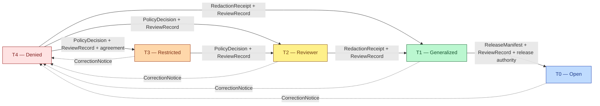

<!-- [KFM_META_BLOCK_V2]
doc_id: kfm://doc/docs-domains-roads-rail-trade-sensitivity
title: Roads, Rail & Trade Routes — Sensitivity, Rights & Publication Posture
type: standard
version: v1
status: draft
owners: TODO — Roads/Rail/Trade domain steward + sensitivity reviewer + rights-holder representative
created: 2026-06-07
updated: 2026-06-07
policy_label: public
related: [docs/domains/roads-rail-trade/README.md, docs/domains/roads-rail-trade/PRESERVATION_MATRIX.md, docs/domains/roads-rail-trade/PIPELINE.md, docs/domains/roads-rail-trade/OBJECT_FAMILIES.md, policy/sensitivity/transport/, ai-build-operating-contract.md, docs/standards/SENSITIVITY_RUBRIC.md]
tags: [kfm, domain, roads-rail-trade, sensitivity, rights, tiers, redaction, sovereignty]
notes:
  - "CONTRACT_VERSION = 3.0.0 pinned for this doctrine-adjacent doc."
  - "Disposition is NOT re-derived here: the operating contract §23.2 sensitive-domain decision matrix is the authoritative source; the most restrictive applicable row applies. This doc orients the Roads/Rail lane to that matrix."
  - "Tier scheme T0–T4 is PROPOSED per Atlas §24.5.1 (ADR-S-05). Lane baseline T1 (ENCY §7.11); core segments T0 (Atlas §24.14); cultural-corridor and critical-facility detail rise to T4."
  - "Policy home policy/sensitivity/transport/ uses the transport/ schema/policy segment (Atlas Ch.24.13 / ENCY §7.11), not domains/roads-rail-trade/ — documented divergence OQ-RRT-01."
  - "UncertaintySurface is the anchored gate object for T1 historic routes (doctrine-synthesis §16)."
[/KFM_META_BLOCK_V2] -->

# 🔒 Roads, Rail & Trade Routes — Sensitivity, Rights & Publication Posture

> What this lane may publish, what it must generalize, redact, restrict, or deny — and the reviewed, reversible transforms that move an object toward a public surface. The safest representation that still answers a reasonable need wins.

**Status:** `draft` · **Owners:** _TODO — domain steward + sensitivity reviewer + rights-holder rep_ · **Updated:** 2026-06-07 · **Contract:** `CONTRACT_VERSION = "3.0.0"`

> [!IMPORTANT]
> **Disposition is not decided here.** The authoritative source is the operating contract **§23.2 sensitive-domain decision matrix**. This document orients the Roads/Rail/Trade lane to that matrix and records lane-specific posture; where this doc and §23.2 appear to disagree, **§23.2 wins and the most restrictive applicable row applies**. Disposition defaults are `PROPOSED` until ratified (ADR-S-05).

---

## Quick jump

- [1. Scope & sensitivity classes in this lane](#1-scope--sensitivity-classes-in-this-lane)
- [2. The lane posture in one paragraph](#2-the-lane-posture-in-one-paragraph)
- [3. Tier scheme (T0–T4)](#3-tier-scheme-t0t4)
- [4. Per-object tier baseline](#4-per-object-tier-baseline)
- [5. §23.2 matrix rows that apply](#5-232-matrix-rows-that-apply)
- [6. Allowed tier motion & required receipts](#6-allowed-tier-motion--required-receipts)
- [7. The four high-risk cases](#7-the-four-high-risk-cases)
- [8. Source-rights & role discipline](#8-source-rights--role-discipline)
- [9. UI & AI negative states](#9-ui--ai-negative-states)
- [10. Policy home & where this binds](#10-policy-home--where-this-binds)
- [Open questions register](#open-questions-register)
- [Open verification backlog](#open-verification-backlog)
- [Changelog](#changelog-v0--v1)
- [Definition of done](#definition-of-done)
- [Related docs](#related-docs)

---

## 1. Scope & sensitivity classes in this lane

This document governs the **sensitivity, rights, and publication posture** for the Roads/Rail/Trade lane. Of the operating contract's sensitive-domain list (§23.1), the following classes are reachable through this lane's objects and joins:

- **Indigenous knowledge, treaty, oral-history, or steward-controlled records** — trade and mobility corridors, cultural routes.
- **Critical infrastructure** — bridges, key freight nodes, sensitive crossings, condition/vulnerability detail.
- **Exact coordinates that could enable harm** — precise alignment of sensitive facilities or culturally protected routes.
- **Restricted source terms** — source-rights-bound fields from TIGER/Line, FHWA, KDOT, WZDx, OSM/GNIS.
- **Archaeology / cultural heritage** *(by cross-lane citation)* — historic corridors that pass near sites; coordinates remain **Archaeology-owned and denied** at the Roads/Rail surface.

> [!NOTE]
> Living-person, DNA, rare-species, and hydrology-owned content are **not** Roads/Rail responsibilities; where a join touches them, the **owning lane's policy governs** and the most restrictive row applies. This lane preserves the citation, never the canonical claim.

[↑ Back to top](#top)

---

## 2. The lane posture in one paragraph

**CONFIRMED doctrine (Atlas §13.I; Build Manual §10.11):** *Indigenous trade and mobility corridors, oral history, treaty, cultural, and interpretive evidence default to steward review and generalized public geometry; critical transport facilities require review.* Historic and cultural routes are **generalized unless reviewed evidence supports precision**, and graph projections are **derived only** — never canonical. **CONFIRMED doctrine (deny-by-default):** unclear rights, unresolved source role, missing evidence, unresolved sensitivity, or absent release state **blocks public promotion**.

[↑ Back to top](#top)

---

## 3. Tier scheme (T0–T4)

**PROPOSED scheme (Atlas §24.5.1; ADR-S-05).** Tiers describe *who may receive an object and after what transform* — they are not a property of the geometry alone.

| Tier | Name | Definition | Default audience |
|---|---|---|---|
| **T0** | Open | Public-safe with no transform required beyond standard release. | Any public client via governed API |
| **T1** | Generalized | Public-safe only after generalization, fuzzing, aggregation, or redaction; transform reviewed and recorded. | Any public client via governed API |
| **T2** | Reviewer | Released only to authenticated reviewers or domain stewards; policy-bounded; correction path active. | Stewards, reviewers, named collaborators |
| **T3** | Restricted | Released only under named agreement (rights, sovereignty, consent) and recorded. | Named authorized parties only |
| **T4** | Denied | Not released to any audience; the *existence* of a record may be released only as steward review permits. | — |

> [!NOTE]
> **Lane baseline = T1** (ENCY §7.11). Core road, rail, and corridor *segments* default to **T0** (Atlas §24.14); the baseline rises to **T4** for cultural-corridor and critical-facility-detail cases. The tier is set by the object's sensitivity, not its family name.

[↑ Back to top](#top)

---

## 4. Per-object tier baseline

PROPOSED baselines, grounded in Atlas §24.14 (per-object), doctrine-synthesis §16 (per-domain), and §13.I. Rows beyond those sources are PROPOSED pending steward review.

| Object class | Default tier | Allowed transform → more public | Required gate artifacts | Downgrade-to-T4 trigger |
|---|---|---|---|---|
| `Road Segment` / `Rail Segment` — modern public | **T0** *(CONFIRMED, §24.14)* | None for authoritative public-roadway geometry. | `ReleaseManifest` + `ReviewRecord` per maturity. | Rights revocation; source withdrawal. |
| `CorridorRoute` / `Freight Corridor` — modern designation | **T0–T1** | Generalize where rights/precision require; freight context cite-only. | `RedactionReceipt` or `AggregationReceipt` + `ReviewRecord`. | Critical-corridor flag; agreement revocation. |
| `Historic RouteClaim` — non-sensitive | **T1** *(CONFIRMED, doctrine-synthesis §16)* | Generalized geometry with uncertainty surfaced. | `UncertaintySurface` + `RedactionReceipt` + `ReviewRecord`. | Overprecision detected; new cultural context. |
| **`TradeRouteCorridor` — Indigenous / cultural** | **T2 or T4** (per steward) | Coarse-cell generalization → T2/T1 only under explicit sovereignty review. | Sovereignty review + `ReviewRecord` + `PolicyDecision` + `RedactionReceipt`. | Any sovereignty/cultural objection. |
| **`Crossing` near archaeological site** | **T4** (defer to Archaeology) | Deny exact coords; corridor cited as context only. | Steward review + `RedactionReceipt` + `PolicyDecision`. | Join attempted that could re-identify a site. |
| **`Bridge` / `Ferry` / `Crossing` — vulnerability/condition** | **T4** (defer to Settlements) | T3 to named authorities only; never T0/T1. | Steward review + named-party agreement. | Any public surface attempting vulnerability detail. |
| `RestrictionEvent` / `StatusEvent` — public closure | **T0–T1** | Generalize timing where source cadence requires; cite the feed. | `ReleaseManifest`. | Operator deny; feed revocation. |
| `OperatorAssignment` — public service state | **T0–T1** | Generalized roll-up where operator policy requires. | `ReleaseManifest`; agreement check. | Operator agreement change. |
| `TransportFacility` — cited identity | **T0 mostly; T2/T4** for sensitive detail *(§24.14)* | Settlements owns identity; Roads/Rail preserves the citation. | Cross-lane cite preserved. | Settlements deny propagates. |

[↑ Back to top](#top)

---

## 5. §23.2 matrix rows that apply

The operating contract §23.2 rows reachable through this lane. **These are the authoritative dispositions — this table is a routing aid, not a re-derivation.**

| §23.2 domain row | Default disposition at public surface | Required transform | Reviewer beyond domain steward | Required receipts/manifests |
|---|---|---|---|---|
| Indigenous / cultural records | `DENY` unless steward-approved | None — steward gate | Tribal/cultural reviewer | `PolicyDecision`; `ReviewRecord` |
| Critical infrastructure | `DENY` or `RESTRICTED_ACCESS` | Coarse depiction only | Security reviewer | `PolicyDecision`; access log |
| Exact-harm coordinates | `DENY` | Generalize or full denial | Security reviewer | `RedactionReceipt` |
| Restricted source terms | `DENY` derivative public release | Strip restricted-source-derived fields | Rights reviewer | `PolicyDecision`; `SourceDescriptor` rights field |
| Archaeology — site locations *(cross-lane cite)* | `DENY` exact coordinates; generalize to county/region | Geometry generalization; redact precise UTM | Tribal/cultural reviewer; rights-holder rep | `RedactionReceipt`; `PolicyDecision`; `MapReleaseManifest` |

> [!CAUTION]
> Where more than one row applies to a single object (e.g., a culturally protected corridor that also passes a critical bridge), the **most restrictive row governs**. The §23.2 matrix is `PROPOSED` as of v3.0; domain stewards ratify or amend during v3.x adoption.

[↑ Back to top](#top)

---

## 6. Allowed tier motion & required receipts

**CONFIRMED doctrine (Atlas §24.5.3).** A tier *upgrade* (toward more public) always needs both a transform receipt and a review record. A tier *downgrade* (toward less public) needs only a `CorrectionNotice` and is always permitted; it precedes derivative invalidation.

| From → To | Required artifact | Required reviewer | Reversibility |
|---|---|---|---|
| T4 → T3 | `PolicyDecision` + `ReviewRecord` + agreement | Steward + rights-holder where applicable | Reversible: agreement revocation returns to T4 via `CorrectionNotice`. |
| T4 → T2 | `PolicyDecision` + `ReviewRecord` | Steward | Reversible: review revocation returns to T4. |
| T4 → T1 | `RedactionReceipt` + `ReviewRecord` | Steward | Reversible: redaction re-evaluable; correction may demote a published T1 to T4. |
| T3 → T2 | `PolicyDecision` + `ReviewRecord` | Steward | Reversible. |
| T2 → T1 | `RedactionReceipt` + `ReviewRecord` | Steward | Reversible. |
| T1 → T0 | `ReleaseManifest` + `ReviewRecord` | Steward + release authority | Reversible: rollback via `RollbackCard`. |
| Any → T4 (downgrade) | `CorrectionNotice` + `ReviewRecord` | Steward + rights-holder where applicable | Always permitted; precedes derivative invalidation. |

The `RedactionReceipt` records `policy_ref`, `redaction_method`, `kept_fields`, `removed_fields`, `geometry_transform`, and `reviewer` (Atlas §24.2.1).

[↑ Back to top](#top)

---

## 7. The four high-risk cases

> [!WARNING]
> These four cases are where this lane most easily causes harm. Each defaults to the restrictive end and requires the named reviewer **before** any public exposure.

**1 — Indigenous trade & mobility corridors.** Default `DENY` / T2–T4. Publish only as **generalized polygons** (never lines), and only after **sovereignty review** by a rights-holder representative distinct from author and steward. A precise corridor line is a sovereignty harm even when the underlying source is public. Apply CARE-aligned stewardship: the rights-holder, not the data's public availability, governs exposure.

**2 — Critical transport facilities.** Default `DENY` / T4 for condition or vulnerability detail; coarse footprint only to the public. Vulnerability detail reaches **T3 to named authorities only, never T0/T1**. Facility *identity* is Settlements-owned; this lane preserves the citation.

**3 — Historic-route overprecision.** A single coarse source must not become a confident public line. Default **T1** with an `UncertaintySurface` and a `RedactionReceipt`; the overprecision-denial validator (Atlas §13.K) blocks promotion at PROCESSED → CATALOG.

**4 — Archaeological-coordinate leakage via corridor reconstruction.** A historic-route or corridor projection **may not be used to derive an archaeological site coordinate** that Archaeology denies. Default `DENY`; corridor cites archaeology **as context only**, and cross-lane joins that could re-identify a site route to steward review.

> [!CAUTION]
> **KFM is never an alert authority.** Closures, detours, restrictions, and freight-corridor data are published as **context**, not life-safety instruction or routing guidance. Hazards owns hazard-event truth (Atlas §12).

[↑ Back to top](#top)

---

## 8. Source-rights & role discipline

Source rights and current terms are **NEEDS VERIFICATION** for every Roads/Rail family; **sensitive joins fail closed** (Atlas §13.D). Source role is set at admission and never upgraded (Atlas §24.1).

| Source | Rights posture | Sensitivity note |
|---|---|---|
| Census TIGER/Line, FHWA HPMS/NHFN | NEEDS VERIFICATION (terms) | Public roadway geometry generally T0; freight designation regulatory/administrative. |
| WZDx / KDOT / KanDrive live feeds | NEEDS VERIFICATION (terms) | `observed` only; never republished as a historical record; stale-state badge on cadence breach. |
| County/state bridge & restriction data | NEEDS VERIFICATION; **infrastructure-critical joins fail closed** | Condition/vulnerability detail defaults T4. |
| GNIS names | Public | `administrative` for naming only — not legal status. |
| OpenStreetMap | Public (ODbL — verify) | `observed`/`candidate`; legal-status denial test applies. |

> [!IMPORTANT]
> **Restricted-source-derived fields are stripped before public release** and the strip is recorded in a `RedactionReceipt`; the `SourceDescriptor` rights field carries the restriction (§23.2 restricted-source row).

[↑ Back to top](#top)

---

## 9. UI & AI negative states

Sensitivity is enforced through the trust membrane, not hidden by styling. **CONFIRMED doctrine (operating contract §22.3):** denied map behaviors include no public RAW/WORK/QUARANTINE fetch, no unreleased tile load, and **no style-only hiding of exact sensitive geometry** — generalization happens upstream in the lifecycle, not in the renderer.

The UI surfaces these negative states (§22.2) where they apply to this lane:

`DENIED_BY_POLICY` · `GENERALIZED_GEOMETRY` · `RESTRICTED_ACCESS` · `SOURCE_STALE` · `MISSING_EVIDENCE` · `CITATION_FAILED` · `RELEASE_WITHDRAWN`

Governed AI in this lane MUST `ABSTAIN` when evidence is insufficient and `DENY` where policy, rights, sensitivity, or release state blocks the request; every Focus Mode answer carries an `AIReceipt` and resolves to a released `EvidenceBundle`. AI never reads RAW/WORK content and never issues routing or alert guidance. [GAI] [DOM-ROADS §L]

[↑ Back to top](#top)

---

## 10. Policy home & where this binds

| Surface | Path | Status |
|---|---|---|
| Sensitivity policy (allow/deny/restrict/abstain) | `policy/sensitivity/transport/` | PROPOSED slug (by peer analogy to `policy/sensitivity/fauna/`; uses the `transport/` segment per ENCY §7.11) |
| Schema home for redaction/tier fields | `schemas/contracts/v1/transport/` | CONFIRMED slug (Atlas Ch.24.13); presence NEEDS VERIFICATION |
| Sensitivity rubric (cross-cutting) | `docs/standards/SENSITIVITY_RUBRIC.md` | PROPOSED (Pass-10 C6-01; not yet authored) |
| Transform receipt records | `data/receipts/` + `data/proofs/` | CONFIRMED layout (Directory Rules §9) |

> [!IMPORTANT]
> **Slug divergence (`OQ-RRT-01`).** Sensitivity *policy* and *schema* homes use the `transport/` segment (Atlas Ch.24.13 / ENCY §7.11), while docs/tests/fixtures/data use `roads-rail-trade/`. This documented split is an ADR candidate; do not silently rename `transport/` to `domains/roads-rail-trade/`.

[↑ Back to top](#top)

---

## Open questions register

| ID | Question | Owner role | Resolution path |
|---|---|---|---|
| `OQ-RRT-SEN-01` | Ratify the T0–T4 tier scheme as canonical for this lane. | Sensitivity reviewer + steward | ADR-S-05 |
| `OQ-RRT-SEN-02` | Indigenous/cultural corridor policy + rights-holder consultation workflow. | Rights-holder rep + steward | `policy/sensitivity/transport/` + consultation log |
| `OQ-RRT-SEN-03` | Confirm rights/terms for TIGER/Line, FHWA, KDOT, WZDx, OSM, GNIS. | Rights reviewer | `RightsReviewRecord` per source |
| `OQ-RRT-SEN-04` | `UncertaintySurface` schema realization for historic-route generalization. | Schema owner | `schemas/contracts/v1/transport/` |
| `OQ-RRT-01` | Reconcile `transport/` (policy/schema) vs `roads-rail-trade/` (docs/data) slug. | Directory steward | ADR / Directory Rules §12 |

## Open verification backlog

These items remain `NEEDS VERIFICATION` before promotion from `draft` to `published`:

1. `policy/sensitivity/transport/` entries exist for cultural corridors and critical facilities.
2. Source rights/terms confirmed for each source family (§8).
3. Overprecision-denial and public-generalization-receipt validators are wired (Atlas §13.K).
4. `RedactionReceipt` shape implemented per Atlas §24.2.1 for trade-route generalization.
5. §23.2 matrix ratified or amended by domain stewards (ADR-S-05).
6. Slug reconciliation (`OQ-RRT-01`).

## Changelog v0 → v1

| Change | Type (per contract §37) | Reason |
|---|---|---|
| Initial sensitivity posture doc authored | new | No prior `SENSITIVITY.md` for this lane. |
| Tier scheme, per-object baselines, tier-motion, and §23.2 routing consolidated | gap closure | Single sensitivity view from Atlas §13.I/§24.5/§24.14 + contract §23.2. |
| Disposition deferred to contract §23.2 (not re-derived) | reconciliation | §23.2 is the authoritative matrix; most-restrictive-row rule preserved. |
| Policy/schema home set to `transport/` slug | reconciliation | Atlas Ch.24.13 / ENCY §7.11; `OQ-RRT-01` documented divergence. |

> **Backward compatibility.** New file; no prior anchors to preserve. Heading IDs introduced here should be treated as stable on future revisions.

## Definition of done

This document is done enough to enter the repository when:

- it is placed according to Directory Rules (lane segment under `docs/`, not a root folder);
- the domain steward, a sensitivity reviewer, and (for cultural-corridor content) a rights-holder representative review it;
- it is linked from the lane README and the docs/doctrine index;
- it does not conflict with accepted ADRs (notably ADR-S-05 tier scheme and the `OQ-RRT-01` slug ADR);
- any conflict with current repo conventions is logged in `docs/registers/DRIFT_REGISTER.md`;
- the `GENERATED_RECEIPT.json` planned in Section 2 is wired into CI;
- future changes follow the operating contract's §37 lifecycle.

---

## Related docs

- [`docs/domains/roads-rail-trade/README.md`](./README.md) — lane dossier
- [`docs/domains/roads-rail-trade/PRESERVATION_MATRIX.md`](./PRESERVATION_MATRIX.md) — multi-axis preservation duties
- [`docs/domains/roads-rail-trade/PIPELINE.md`](./PIPELINE.md) — RAW → PUBLISHED lifecycle & gates
- [`docs/domains/roads-rail-trade/OBJECT_FAMILIES.md`](./OBJECT_FAMILIES.md) — object identity & roles
- [`policy/sensitivity/transport/`](../../../policy/sensitivity/transport/) — sensitivity policy home *(PROPOSED)*
- [`ai-build-operating-contract.md`](../../../ai-build-operating-contract.md) — §23 sensitive-domain matrix; `CONTRACT_VERSION = "3.0.0"`
- `docs/standards/SENSITIVITY_RUBRIC.md` — cross-cutting rubric *(PROPOSED; not yet authored)*

*Last updated: 2026-06-07 · [↑ Back to top](#top)*
