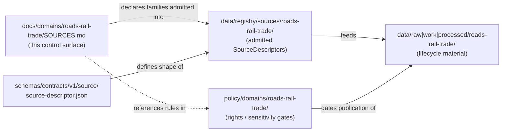
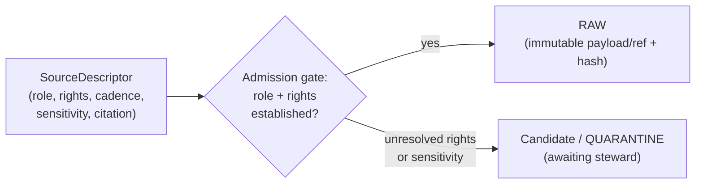
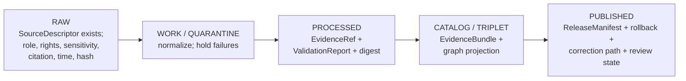

<!-- [KFM_META_BLOCK_V2]
doc_id: kfm://doc/roads-rail-trade-sources
title: Roads, Rail & Trade Routes — Source Catalog (SOURCES.md)
type: standard
version: v1
status: draft
owners: PLACEHOLDER-source-steward, PLACEHOLDER-roads-rail-domain-steward
created: 2026-06-07
updated: 2026-06-07
policy_label: public
related: [ai-build-operating-contract.md, directory-rules.md, docs/domains/roads-rail-trade/README.md, schemas/contracts/v1/source/source-descriptor.json, data/registry/sources/roads-rail-trade/, policy/domains/roads-rail-trade/]
tags: [kfm, roads-rail-trade, sources, source-role, sensitivity, provenance]
notes: [Doctrine-adjacent; CONTRACT_VERSION = "3.0.0" pinned. Source-family list is PROPOSED from the Roads/Rail dossier; rights, current terms, endpoints, and freshness are NEEDS VERIFICATION before admission/activation.]
[/KFM_META_BLOCK_V2] -->

<a id="top"></a>

# 🛤️ Roads, Rail & Trade Routes — Source Catalog

> Governance-first catalog of the source families that feed the **Roads/Rail** domain lane — what each source can support, the **source role** it is admitted under, its rights/sensitivity posture, and the gates it must clear before any public surface cites it.


**Status:** `draft` · **Owners:** source steward + Roads/Rail domain steward *(placeholders — verify)* · **Updated:** 2026-06-07
**Pinned:** `CONTRACT_VERSION = "3.0.0"` (`ai-build-operating-contract.md`)

> [!IMPORTANT]
> This file is a **control surface, not a bibliography**. Each row states what a source *can support* and what it *cannot prove*. A source dossier is evidence of doctrine, planning, and lineage — **not proof of current repository implementation**. Source role, rights, current terms, endpoints, and freshness windows are **NEEDS VERIFICATION** until confirmed against the mounted repo, the live source terms, and an admitted `SourceDescriptor`.

---

## Quick navigation

- [1. Scope](#1-scope)
- [2. Repo fit](#2-repo-fit)
- [3. What belongs here](#3-what-belongs-here-inputs)
- [4. What does not belong here](#4-what-does-not-belong-here-exclusions)
- [5. How a source is admitted](#5-how-a-source-is-admitted-source-role-first)
- [6. Source-role channels](#6-source-role-channels-anti-collapse)
- [7. Source families (catalog)](#7-source-families-catalog)
- [8. Sensitivity & publication posture](#8-sensitivity--publication-posture)
- [9. Admission lifecycle](#9-admission-lifecycle-ra--published)
- [10. Source registry record shape](#10-source-registry-record-shape-proposed)
- [Open questions register](#open-questions-register)
- [Open verification backlog](#open-verification-backlog)
- [Changelog](#changelog-v0--v1)
- [Definition of done](#definition-of-done)
- [Related docs](#related-docs)

---

## 1. Scope

This catalog governs the **source families** that the Roads/Rail domain lane is permitted to admit, normalize, and cite. The domain governs Kansas roads, rail, historic routes, trade and mobility corridors, restrictions, facilities, graph projections, and the catalog/proof/release objects built on top of them. *(CONFIRMED doctrine; PROPOSED lane application — `[DOM-ROADS] [ENCY]`)*

The catalog answers four questions for every source:

1. **What is it?** — the source family and its maintaining authority.
2. **What role is it admitted under?** — one of seven canonical source roles, fixed at admission.
3. **What may it support?** — and, just as importantly, what it must never be relabeled as.
4. **What gates must clear before publication?** — rights, sensitivity, evidence, review, release.

> [!NOTE]
> A source's **role is set at admission and preserved through every promotion**. Promotion does not upgrade an observation to a regulation, a model to an aggregate, or a candidate to a verified record. Those are separate governed transitions with their own evidence and review requirements. *(CONFIRMED doctrine — `[ENCY] [DIRRULES]`)*

[↑ Back to top](#top)

---

## 2. Repo fit

This file is a **domain lane segment** under the `docs/` responsibility root. Per Directory Rules §12 (Domain Placement Law), `roads-rail-trade` is a segment inside responsibility roots, **never a root folder**. *(CONFIRMED — `[DIRRULES]`)*

```text
docs/domains/roads-rail-trade/
├── README.md            # lane orientation               (PROPOSED neighbor)
├── SOURCES.md           # ← this file: source catalog / control surface
└── ...                  # other lane docs                 (PROPOSED neighbors)
```

**Upstream / downstream relationships** (placement targets — `PROPOSED` until repo-verified):



> [!WARNING]
> The paths above are **PROPOSED** placement targets derived from Directory Rules §12 and §4. Actual presence of these directories, the `SourceDescriptor` schema file, and the registry layout are **NEEDS VERIFICATION** against the mounted repository.

[↑ Back to top](#top)

---

## 3. What belongs here (inputs)

- Declarations of **source families** the Roads/Rail lane is permitted to draw from.
- The **source role** each family is admitted under and its allowed downstream role.
- A statement of **what each source can support** and **what it cannot prove**.
- **Rights / sensitivity posture** and the gates a source must clear before a public surface cites it.
- Pointers to the canonical `SourceDescriptor`, the source registry lane, and the policy lane.

## 4. What does not belong here (exclusions)

| Does not belong here | Belongs instead in |
|---|---|
| The admitted `SourceDescriptor` records themselves | `data/registry/sources/roads-rail-trade/` *(PROPOSED)* |
| The `SourceDescriptor` **schema** (field shapes) | `schemas/contracts/v1/source/source-descriptor.json` *(PROPOSED per ADR-0001 / §7.4)* |
| Rights / sensitivity **allow/deny rules** | `policy/domains/roads-rail-trade/` and `policy/sensitivity/...` *(PROPOSED)* |
| Lifecycle data (RAW/WORK/PROCESSED payloads) | `data/<phase>/roads-rail-trade/` *(PROPOSED)* |
| Release decisions, manifests, rollback cards | `release/...` |
| Object-meaning / ubiquitous-language definitions | `contracts/domains/roads-rail-trade/` and the lane `README.md` |

> [!IMPORTANT]
> Do **not** turn this catalog into a parallel registry or schema home. The canonical homes are the registry lane and `schemas/contracts/v1/source/...`. Creating a competing authority here would break the trust membrane by making admission, validation, and audit ambiguous. *(CONFIRMED — `[DIRRULES]` §13.1)*

[↑ Back to top](#top)

---

## 5. How a source is admitted (source-role first)

Every admitted source must have a **`SourceDescriptor`** recording identity, **role**, rights posture, update cadence, authority scope, sensitivity notes, and verification obligations. Descriptors should be validated **before fetch, before transformation, and before publication**, so source authority does not collapse into generic data availability. *(PROPOSED — `[ENCY]` KFM-P1-PROG-0007; CONFIRMED that source-role and rights must be known at admission — `[ENCY] [DIRRULES]`)*



> [!NOTE]
> Unclear rights, unresolved source role, missing evidence, unresolved sensitivity, or absent release state **blocks public promotion**. The system fails closed. *(CONFIRMED doctrine — `[ENCY] [DIRRULES] [DOM-ROADS]`)*

[↑ Back to top](#top)

---

## 6. Source-role channels (anti-collapse)

Source role is a **first-class identity attribute**. An observed reading is not interchangeable with a modeled estimate; a regulatory determination is not an administrative compilation; an aggregate is not a per-place record; synthetic content is never observed reality. The lifecycle and the governed API **fail closed** when these roles are conflated. *(CONFIRMED doctrine — `[ENCY]`)*

| Role | What it is | Allowed downstream role |
|---|---|---|
| `observed` | A direct reading or first-hand record tied to a place and time. | May feed modeled/aggregate products; never relabeled regulatory or administrative. |
| `regulatory` | An authoritative determination by a governing body with legal/administrative force. | Cite as regulatory context; never labeled observed or modeled. |
| `modeled` | A derived product from inputs/assumptions/fitted parameters; uncertainty preserved. | Cite with model identity + run receipt + bounds; never labeled observed. |
| `aggregate` | A published summary/total/average over a unit; individual fidelity lost. | Cite with aggregation receipt; never treated as a per-place record. |
| `administrative` | An agency compilation for administration/registration/accounting — not an observation or a regulation. | Cite as administrative context; never collapsed with observation or regulation. |
| `candidate` | A proposed record awaiting validation, dedup, or steward review. | May be cited in WORK/QUARANTINE; must not appear in PUBLISHED without promotion. |
| `synthetic` | Simulation/reconstruction/AI/interpolation with no first-hand observation. | Carries Reality Boundary Note + Representation Receipt; never queried as observed reality. |

*(CONFIRMED doctrine — `[ENCY] [DOM-ROADS] [DOM-SETTLE] [DOM-PEOPLE]`)*

> [!CAUTION]
> **Roads/Rail-specific collapse risk.** A **transport-facility roster** and similar agency compilations are `administrative` — they MUST NOT be cited as an observed event timeline. DENY publication of an administrative compilation as observed events. Guardrail: source-role tag preserved; named `RestrictionEvent` / `RouteEvent` / admin-record types kept distinct. *(CONFIRMED — `[ENCY]` §24.1.2, `[DOM-ROADS] [DOM-SETTLE]`)*

[↑ Back to top](#top)

---

## 7. Source families (catalog)

> [!WARNING]
> Every **Role**, **Rights / sensitivity**, and **Freshness** value below is **NEEDS VERIFICATION**. The Roads/Rail dossier admits each family under a role *as the source requires* and marks rights/current-terms as unverified, with sensitive joins failing closed. Confirm the actual role, current license/terms, endpoint, and cadence against the live source and an admitted `SourceDescriptor` **before** any fetch, activation, or release. *(`[DOM-ROADS] [ENCY]`)*

| Source family | Likely role(s) at admission | Can support | Cannot prove | Rights / sensitivity | Freshness | Status |
|---|---|---|---|---|---|---|
| **Census TIGER/Line roads** | `observed` / `administrative` (per source) | Modern road network geometry & names | Legal route designation; ownership/title | Rights & current terms `NEEDS VERIFICATION`; sensitive joins fail closed | Source-vintage / cadence specific | PROPOSED `[DOM-ROADS] [ENCY]` |
| **FHWA HPMS** | `administrative` / `aggregate` (per source) | Highway performance & inventory attributes | Per-place observed condition at a moment | Same posture | Source-vintage / cadence specific | PROPOSED `[DOM-ROADS] [ENCY]` |
| **FHWA National Highway Freight Network** | `regulatory` / `administrative` (per source) | Designated freight-corridor context | Observed traffic events | Same posture | Source-vintage / cadence specific | PROPOSED `[DOM-ROADS] [ENCY]` |
| **WZDx feeds** (work-zone data exchange) | `observed` / `administrative` (per source) | Work-zone / restriction status over time | Long-run historical truth; legal status | Same posture; operational/stale-state disclaimer | Operational / time-sensitive | PROPOSED `[DOM-ROADS] [ENCY]` |
| **KDOT / KanPlan / KanDrive / Kansas GIS** | `administrative` / `observed` / `regulatory` (per source) | State road inventory, plans, conditions, GIS layers | Title boundaries; uncited interpretation | Same posture | Source-vintage / cadence specific | PROPOSED `[DOM-ROADS] [ENCY]` |
| **County / state bridge & restriction data** | `administrative` / `observed` (per source) | Bridge inventory, weight/height restrictions | Real-time enforcement state | Same posture; some condition detail may be sensitive | Source-vintage / cadence specific | PROPOSED `[DOM-ROADS] [ENCY]` |
| **GNIS names** | `administrative` (per source) | Authoritative feature names | Legal status; precise historic alignment | Same posture | Source-vintage / cadence specific | PROPOSED `[DOM-ROADS] [ENCY]` |
| **OpenStreetMap** | `aggregate` / `candidate` (per source) | Community road/rail geometry & tags | Legal status; designation; ownership | Same posture; **OSM/GNIS legal-status denial** test applies | Continuous / community-edited | PROPOSED `[DOM-ROADS] [ENCY]` |

> [!CAUTION]
> **Historic & Indigenous routes are not in the table by design.** Historic uncertain routes, trade/mobility corridors, oral-history, treaty, cultural, and interpretive evidence are admitted under their own roles (commonly `candidate`, `modeled`, or `synthetic` for reconstructions) and default to **steward review and generalized public geometry**. They carry uncertainty surfaces and must not be published at false precision. See [§8](#8-sensitivity--publication-posture). *(CONFIRMED / PROPOSED — `[DOM-ROADS] [ENCY]`)*

[↑ Back to top](#top)

---

## 8. Sensitivity & publication posture

KFM publishes only the **safest representation that still answers the steward's and public's reasonable needs**, on the **T0–T4** tier scheme. *(PROPOSED tier scheme — `[ENCY]` §24.5; tier definitions PROPOSED)*

| Object class | Default tier | Allowed transforms | Required gates |
|---|---|---|---|
| Roads/Rail — modern public network (`RoadSegment` / `RailSegment` / `CorridorRoute`) | **T0** | None required | Standard Gates A–G |
| Roads/Rail — historic uncertain routes | **T1** | Generalization; uncertainty surface | `UncertaintySurface` |
| `TransportFacility` | **T0** mostly; **T2 / T4** for sensitive condition detail | Generalized footprint; suppressed condition detail | Steward review + `RedactionReceipt` where sensitive |
| Indigenous trade / mobility corridors, oral history, treaty, cultural, interpretive | **steward review** (commonly T1/T2) | Generalized public geometry; steward + rights-holder review | `ReviewRecord` + rights-holder where applicable |
| Critical transport facilities (cross-lane w/ Settlements/Infrastructure) | **T2 / T4** | Public summary only; precise locations & dependencies deny | `policy/sensitivity/...` + steward review |

*(Tiers & defaults PROPOSED per `[ENCY]` §24.5.2 and the per-domain sensitivity matrix; `[DOM-ROADS] [DOM-SETTLE]`)*

> [!CAUTION]
> **Tier scale (most public → least public):** `T0` Open · `T1` Generalized · `T2` Reviewer · `T3` Restricted · `T4` Denied. A tier **upgrade** toward more public always needs both a transform receipt and a `ReviewRecord`; a tier **downgrade** toward less public needs only a `CorrectionNotice`. *(PROPOSED — `[ENCY]` §24.5.3)*

<details>
<summary>Roads/Rail-specific denial conditions (anti-collapse + over-precision)</summary>

These mirror the dossier's proposed validator/denial set (`[DOM-ROADS] [ENCY]`, all PROPOSED):

- **OSM/GNIS legal-status denial** — community or naming sources may not assert legal route designation.
- **Historic over-precision denial** — reconstructed/uncertain historic routes may not publish at false precision.
- **Administrative-as-observed denial** — a transport-facility roster is `administrative`, never an observed event timeline.
- **Public generalization receipt** — sensitive geometry requires a `RedactionReceipt` before any public surface.
- **Route membership vs. designation separation** — membership in a network is not the same as legal designation.

</details>

[↑ Back to top](#top)

---

## 9. Admission lifecycle (RAW → PUBLISHED)

Roads/Rail follows the lifecycle invariant, with promotion as a **governed state transition, never a file move**. *(CONFIRMED doctrine / PROPOSED lane application — `[DIRRULES] [DOM-ROADS] [ENCY]`)*



| Stage | Gate (must clear) | Status |
|---|---|---|
| RAW | `SourceDescriptor` exists (role, rights, sensitivity, citation, time, hash) | PROPOSED |
| WORK / QUARANTINE | Validation + policy gate pass, or quarantine reason recorded | PROPOSED |
| PROCESSED | `EvidenceRef`, `ValidationReport`, digest closure exist | PROPOSED |
| CATALOG / TRIPLET | Catalog / proof closure passes; `EvidenceBundle` emitted | PROPOSED |
| PUBLISHED | `ReleaseManifest`, correction path, rollback target, review/policy state | PROPOSED |

*(All lane statuses PROPOSED — `[DOM-ROADS] [ENCY]`)*

[↑ Back to top](#top)

---

## 10. Source registry record shape (PROPOSED)

> [!NOTE]
> The canonical schema home for the source-role field is **`schemas/contracts/v1/source/source-descriptor.json`** per Directory Rules §7.4 and ADR-0001, unless an accepted ADR relocates it. Actual file presence and field names are **NEEDS VERIFICATION** — the shape below is illustrative, not authoritative. *(`[DIRRULES] [ENCY]` §24.1.3)*

```json
{
  "source_id": "PLACEHOLDER-kdot-road-inventory",
  "source_family": "KDOT / Kansas GIS",
  "source_role": "administrative",
  "role_authority": "Kansas Department of Transportation (NEEDS VERIFICATION)",
  "rights": "NEEDS VERIFICATION (license + current terms)",
  "sensitivity_tier_default": "T0",
  "update_cadence": "NEEDS VERIFICATION",
  "authority_scope": "Kansas state roads",
  "citation_policy": "NEEDS VERIFICATION",
  "verification_status": "NEEDS VERIFICATION",
  "stale_threshold": "NEEDS VERIFICATION"
}
```

A descriptor is **never edited in place**: corrections produce a **new descriptor** and a `CorrectionNotice`, with the old descriptor retained via a `superseded_by` link. *(CONFIRMED supersession doctrine — `[ENCY]` §24.8.2)*

[↑ Back to top](#top)

---

## Open questions register

| ID | Question | Owner role | Resolution path |
|---|---|---|---|
| OQ-ROADS-SRC-01 | What is the canonical role for each family (e.g., is TIGER/Line `observed` or `administrative` in this lane)? | Source steward | ADR-S-04 (source-role vocabulary) + admission review |
| OQ-ROADS-SRC-02 | What are the current license / terms / endpoints for each family? | Source steward | Live source-terms check + `SourceDescriptor` admission |
| OQ-ROADS-SRC-03 | Which freshness windows / stale thresholds apply per family? | Source steward | Source-watch registry entry; `[ENCY]` KFM-P4-PROG-0004 |
| OQ-ROADS-SRC-04 | Which transport-facility condition fields are T2/T4 sensitive? | Sensitivity reviewer | `policy/sensitivity/...` + steward review |
| OQ-ROADS-SRC-05 | Where does the source registry lane live, and does it exist? | Docs steward | Directory Rules §12 check against mounted repo |

## Open verification backlog

These remain `NEEDS VERIFICATION` before promotion from `draft` to `published`:

1. Presence of `docs/domains/roads-rail-trade/` lane and neighbor `README.md`.
2. Presence and field names of `schemas/contracts/v1/source/source-descriptor.json`.
3. Presence of `data/registry/sources/roads-rail-trade/` and admitted descriptors.
4. Current rights, terms, endpoints, and cadence for all eight source families.
5. Existence of the proposed Roads/Rail validators (legal-status denial, over-precision denial, generalization-receipt test).
6. Confirmation of per-family default sensitivity tiers against `policy/domains/roads-rail-trade/`.

## Changelog v0 → v1

| Change | Type (per contract §37) | Reason |
|---|---|---|
| Initial creation of Roads/Rail source catalog | new | No prior SOURCES.md evidenced for this lane |
| Source-family table seeded from Roads/Rail dossier §D | gap closure | Consolidate scattered source-family doctrine into a lane control surface |
| Source-role channels + anti-collapse table inlined | clarification | Make admission role explicit at the catalog level |

> **Backward compatibility.** New file; no prior anchors to preserve. Internal anchors (`#7-source-families-catalog`, etc.) are introduced here and SHOULD be kept stable.

## Definition of done

This document is done enough to enter the repository when:

- it is placed at `docs/domains/roads-rail-trade/SOURCES.md` per Directory Rules §12;
- a docs steward **and** the source steward review it;
- it is linked from the lane `README.md` and any docs/source index;
- it does not conflict with accepted ADRs (notably ADR-0001, ADR-S-04);
- any conflict with current repo conventions is logged in `docs/registers/DRIFT_REGISTER.md`;
- the `GENERATED_RECEIPT.json` planned in Notes is wired into CI;
- future changes follow the operating contract's §37 lifecycle.

---

## Related docs

- [`docs/domains/roads-rail-trade/README.md`](./README.md) *(PROPOSED neighbor — verify)*
- [`directory-rules.md`](../../../directory-rules.md) — Domain Placement Law §12, placement protocol §4
- [`ai-build-operating-contract.md`](../../../ai-build-operating-contract.md) — operating law; `CONTRACT_VERSION = "3.0.0"`
- `schemas/contracts/v1/source/source-descriptor.json` *(PROPOSED canonical schema home)*
- `data/registry/sources/roads-rail-trade/` *(PROPOSED registry lane)*
- `policy/domains/roads-rail-trade/` *(PROPOSED policy lane)*

---

*Last updated: 2026-06-07 · `CONTRACT_VERSION = "3.0.0"` · Status: `draft`*

[↑ Back to top](#top)
