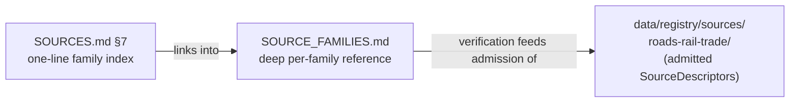

<!-- [KFM_META_BLOCK_V2]
doc_id: kfm://doc/roads-rail-trade-source-families
title: Roads, Rail & Trade Routes — Source Families (Deep Reference)
type: standard
version: v1
status: draft
owners: PLACEHOLDER-source-steward, PLACEHOLDER-roads-rail-domain-steward
created: 2026-06-07
updated: 2026-06-07
policy_label: public
related: [ai-build-operating-contract.md, directory-rules.md, docs/domains/roads-rail-trade/SOURCES.md, docs/domains/roads-rail-trade/README.md, schemas/contracts/v1/source/source-descriptor.json, data/registry/sources/roads-rail-trade/, policy/domains/roads-rail-trade/]
tags: [kfm, roads-rail-trade, source-families, source-role, rights, sensitivity, source-watch]
notes: [Doctrine-adjacent; CONTRACT_VERSION = "3.0.0" pinned. Deep per-family companion to SOURCES.md (Option A division of labor). SOURCES.md remains the lane Source Ledger / authoritative index; this file holds per-family verification detail. Roles, rights, terms, endpoints, cadence are NEEDS VERIFICATION until an admitted SourceDescriptor confirms them.]
[/KFM_META_BLOCK_V2] -->

<a id="top"></a>

# 🛤️ Roads, Rail & Trade Routes — Source Families (Deep Reference)

> Per-family verification reference for the **Roads/Rail** lane: admission role and rationale, what each family can support and cannot prove, the rights/terms checklist that must clear before fetch, freshness handling, and family-specific anti-collapse and denial notes.


**Status:** `draft` · **Owners:** source steward + Roads/Rail domain steward *(placeholders — verify)* · **Updated:** 2026-06-07
**Pinned:** `CONTRACT_VERSION = "3.0.0"` (`ai-build-operating-contract.md`)

> [!IMPORTANT]
> **Authority & division of labor (Option A).** The lane's authoritative **Source Ledger** is [`SOURCES.md`](./SOURCES.md); its §7 is the one-line-per-family **index**. *This* file is the **deep per-family reference** that the index links into. Neither file is a registry or a schema home — the admitted records live in `data/registry/sources/roads-rail-trade/` and their shape in `schemas/contracts/v1/source/source-descriptor.json` *(PROPOSED)*. If these two docs ever disagree, **`SOURCES.md` governs** and the conflict is logged in `docs/registers/DRIFT_REGISTER.md`. *(Directory Rules §13.1 — avoid parallel authorities.)*

> [!WARNING]
> This is a **control surface, not a bibliography**. It states what each source can support and what it cannot prove. Every **role**, **rights / current terms**, **endpoint**, and **freshness** value here is **NEEDS VERIFICATION** until confirmed against the live source and an admitted `SourceDescriptor`. Nothing here asserts current repository implementation. *(`[DOM-ROADS] [ENCY]`)*

---

## Quick navigation

- [1. How to read this file](#1-how-to-read-this-file)
- [2. Family index](#2-family-index)
- [3. Per-family reference](#3-per-family-reference)
  - [3.1 Census TIGER/Line roads](#31-census-tigerline-roads)
  - [3.2 FHWA HPMS](#32-fhwa-hpms)
  - [3.3 FHWA National Highway Freight Network](#33-fhwa-national-highway-freight-network)
  - [3.4 WZDx feeds](#34-wzdx-feeds)
  - [3.5 KDOT / KanPlan / KanDrive / Kansas GIS](#35-kdot--kanplan--kandrive--kansas-gis)
  - [3.6 County / state bridge & restriction data](#36-county--state-bridge--restriction-data)
  - [3.7 GNIS names](#37-gnis-names)
  - [3.8 OpenStreetMap](#38-openstreetmap)
  - [3.9 Historic, Indigenous & trade-route evidence](#39-historic-indigenous--trade-route-evidence)
- [4. Per-family verification checklist](#4-per-family-verification-checklist)
- [5. Source-watch fields](#5-source-watch-fields-proposed)
- [Open questions register](#open-questions-register)
- [Open verification backlog](#open-verification-backlog)
- [Changelog](#changelog-v0--v1)
- [Definition of done](#definition-of-done)
- [Related docs](#related-docs)

---

## 1. How to read this file

Each family entry below carries a fixed sub-structure so admission decisions are repeatable:

- **Admitted role(s) & rationale** — the canonical source role(s) the family is admitted under, and *why*. Role is fixed at admission and preserved through every promotion. *(CONFIRMED doctrine — `[ENCY] [DIRRULES]`)*
- **Can support / cannot prove** — the positive and the negative authority of the family. Recording the *cannot prove* side is what stops a source's authority from silently expanding. *(PROPOSED — `[ENCY]` KFM-P1-IDEA-0014)*
- **Rights & terms** — license/terms posture; all `NEEDS VERIFICATION` until checked against the live source.
- **Freshness** — cadence and stale-handling expectation.
- **Anti-collapse / denial notes** — the family-specific ways its role could be wrongly upgraded, and the guardrail.



[↑ Back to top](#top)

---

## 2. Family index

This mirrors [`SOURCES.md` §7](./SOURCES.md#7-source-families-catalog); roles are **PROPOSED / NEEDS VERIFICATION** and finalized at admission per source.

| # | Family | Likely admitted role(s) | Default tier | Detail |
|---|---|---|---|---|
| 3.1 | Census TIGER/Line roads | `observed` / `administrative` | T0 | [→](#31-census-tigerline-roads) |
| 3.2 | FHWA HPMS | `administrative` / `aggregate` | T0 | [→](#32-fhwa-hpms) |
| 3.3 | FHWA National Highway Freight Network | `regulatory` / `administrative` | T0 | [→](#33-fhwa-national-highway-freight-network) |
| 3.4 | WZDx feeds | `observed` / `administrative` | T0 (operational) | [→](#34-wzdx-feeds) |
| 3.5 | KDOT / KanPlan / KanDrive / Kansas GIS | `administrative` / `observed` / `regulatory` | T0 | [→](#35-kdot--kanplan--kandrive--kansas-gis) |
| 3.6 | County / state bridge & restriction data | `administrative` / `observed` | T0; T2/T4 for condition detail | [→](#36-county--state-bridge--restriction-data) |
| 3.7 | GNIS names | `administrative` | T0 | [→](#37-gnis-names) |
| 3.8 | OpenStreetMap | `aggregate` / `candidate` | T0 | [→](#38-openstreetmap) |
| 3.9 | Historic / Indigenous / trade-route evidence | `candidate` / `modeled` / `synthetic` | T1 + steward review | [→](#39-historic-indigenous--trade-route-evidence) |

*(All rows PROPOSED — `[DOM-ROADS] [ENCY]`. Tier defaults per `[ENCY]` §24.5.2.)*

[↑ Back to top](#top)

---

## 3. Per-family reference

### 3.1 Census TIGER/Line roads

- **Admitted role(s) & rationale:** `observed` *or* `administrative` per the source's character at admission. TIGER/Line is a compiled spatial product; treat geometry/attributes as an agency compilation unless a clearly observed survey component is identified. *(PROPOSED — `[DOM-ROADS]`)*
- **Can support:** modern road-network geometry, road names, and FIPS-linked context.
- **Cannot prove:** legal route designation; ownership or title; real-time condition.
- **Rights & terms:** `NEEDS VERIFICATION` (U.S. public-domain expectation does not substitute for a checked current-terms statement).
- **Freshness:** source-vintage / annual release cadence — `NEEDS VERIFICATION`.
- **Anti-collapse / denial:** must not be relabeled `regulatory`; a TIGER segment is not a legal designation.

### 3.2 FHWA HPMS

- **Admitted role(s) & rationale:** `administrative` / `aggregate` — HPMS is an inventory/performance compilation, much of it summarized to sample or section level. *(PROPOSED)*
- **Can support:** highway inventory attributes, functional classification context, performance summaries.
- **Cannot prove:** a per-place observed condition at a specific moment (aggregate fidelity loss).
- **Rights & terms:** `NEEDS VERIFICATION`.
- **Freshness:** annual submission cycle — `NEEDS VERIFICATION`.
- **Anti-collapse / denial:** **aggregate-as-per-place** collapse denied; cite with the aggregation unit, never joined down to a single record without a guard. *(`[ENCY]` §24.1.2)*

### 3.3 FHWA National Highway Freight Network

- **Admitted role(s) & rationale:** `regulatory` / `administrative` — the freight network is a *designation*. *(PROPOSED)*
- **Can support:** designated freight-corridor context and membership.
- **Cannot prove:** observed traffic, freight volume, or events on the corridor.
- **Rights & terms:** `NEEDS VERIFICATION`.
- **Freshness:** updated on designation cycles — `NEEDS VERIFICATION`.
- **Anti-collapse / denial:** a designation is `regulatory` context; **never** labeled an observed event or a modeled estimate. Route **membership ≠ legal designation** separation test applies. *(`[DOM-ROADS]` validators)*

### 3.4 WZDx feeds

> [!NOTE]
> WZDx (Work Zone Data Exchange) is **operational and time-sensitive**. Treat snapshot-vs-delta behavior and staleness as first-class; a stale feed must produce a stale-source badge / `ABSTAIN`, not a silent render. *(stale-source fixture doctrine — `[ENCY] [MAP-MASTER]`)*

- **Admitted role(s) & rationale:** `observed` / `administrative` per feed — work-zone records as reported by the operating agency. *(PROPOSED)*
- **Can support:** current work-zone and restriction status over a time window.
- **Cannot prove:** long-run historical truth; legal status; enforcement state.
- **Rights & terms:** `NEEDS VERIFICATION`; feed may be snapshot or delta and can be stale.
- **Freshness:** operational / near-real-time — define stale threshold before use.
- **Anti-collapse / denial:** operational status must not be cited as a permanent attribute; stale-state abstain required.

### 3.5 KDOT / KanPlan / KanDrive / Kansas GIS

- **Admitted role(s) & rationale:** `administrative` (inventory/plans), `observed` (conditions), or `regulatory` (designations) — **role assigned per dataset**, not per source-of-state. *(PROPOSED)*
- **Can support:** Kansas state road inventory, planning documents, conditions, and GIS layers.
- **Cannot prove:** title boundaries; uncited interpretation; private-land assertions.
- **Rights & terms:** `NEEDS VERIFICATION`.
- **Freshness:** dataset-specific — `NEEDS VERIFICATION`.
- **Anti-collapse / denial:** do not collapse a planning document (administrative) into an observed condition; keep KanDrive operational status in its own lane like WZDx.

### 3.6 County / state bridge & restriction data

> [!CAUTION]
> Some **bridge condition / vulnerability detail** is sensitivity-relevant. Route condition detail through steward review; default `TransportFacility` to **T0**, but **T2/T4** for sensitive condition fields, with a `RedactionReceipt` before any public surface. *(`[ENCY]` §24.5.2, `[DOM-ROADS] [DOM-SETTLE]`)*

- **Admitted role(s) & rationale:** `administrative` (inventory) / `observed` (inspection readings) per dataset. *(PROPOSED)*
- **Can support:** bridge inventory; weight/height/seasonal restrictions.
- **Cannot prove:** real-time enforcement; current passability without an operational feed.
- **Rights & terms:** `NEEDS VERIFICATION`.
- **Freshness:** inspection-cycle / source-vintage — `NEEDS VERIFICATION`.
- **Anti-collapse / denial:** an inspection record is not a continuous observation; condition detail gated by sensitivity review.

### 3.7 GNIS names

- **Admitted role(s) & rationale:** `administrative` — GNIS is a names authority/compilation. *(PROPOSED)*
- **Can support:** authoritative feature names and identifiers.
- **Cannot prove:** legal status; precise historic alignment; current geometry.
- **Rights & terms:** `NEEDS VERIFICATION`.
- **Freshness:** periodic — `NEEDS VERIFICATION`.
- **Anti-collapse / denial:** **GNIS legal-status denial** — a name record may not assert legal route designation. *(`[DOM-ROADS]` validators)*

### 3.8 OpenStreetMap

> [!CAUTION]
> OSM is community-edited. Admit as `aggregate` or `candidate`; it may **never** assert legal status, designation, or ownership. The **OSM/GNIS legal-status denial** test gates this family. *(`[DOM-ROADS]` validators)*

- **Admitted role(s) & rationale:** `aggregate` (community-merged geometry) / `candidate` (unverified contributions). *(PROPOSED)*
- **Can support:** community road/rail geometry and rich tags for corroboration.
- **Cannot prove:** legal designation; ownership/title; authoritative names.
- **Rights & terms:** `NEEDS VERIFICATION` — license attribution obligations apply (ODbL expectation; verify current terms).
- **Freshness:** continuous / community-edited.
- **Anti-collapse / denial:** candidate OSM data must not reach a `PUBLISHED` surface without promotion; no `PUBLISHED` edge to WORK/QUARANTINE. *(`[ENCY]` §24.1.2)*

### 3.9 Historic, Indigenous & trade-route evidence

> [!CAUTION]
> Indigenous trade and mobility corridors, oral history, treaty, cultural, and interpretive evidence default to **steward review and generalized public geometry**. Reconstructions are `synthetic` and carry a Reality Boundary Note + Representation Receipt; uncertain historic routes are published at **T1** with an uncertainty surface, never at false precision. *(CONFIRMED / PROPOSED — `[DOM-ROADS] [ENCY]`; §24.5.2)*

- **Admitted role(s) & rationale:** `candidate` (unresolved route claims), `modeled` (georeferenced reconstructions from inputs), or `synthetic` (generated/interpolated reconstructions).
- **Can support:** `HistoricRouteClaim`, `TradeRouteCorridor` evidence, cited and bounded.
- **Cannot prove:** precise modern coordinates; uncontested historical fact; observed presence.
- **Rights & terms:** `NEEDS VERIFICATION`; sovereignty/cultural rights may apply → rights-holder representative review.
- **Freshness:** scholarship-dependent; supersede on new evidence via `CorrectionNotice`.
- **Anti-collapse / denial:** **historic over-precision denial**; synthetic-as-observed denied; steward + rights-holder review precede any public geometry.

[↑ Back to top](#top)

---

## 4. Per-family verification checklist

Before a family is admitted (— → RAW) and before any public surface cites it, the source steward should clear:

- [ ] **Role assigned** and justified per dataset (one of the seven canonical roles).
- [ ] **Current license / terms** checked against the live source (no assumption from "public domain").
- [ ] **Endpoint / access method** recorded and reachable.
- [ ] **Cadence & stale threshold** defined; operational feeds (WZDx, KanDrive) flagged.
- [ ] **Sensitivity tier default** set; condition/critical detail routed to steward review.
- [ ] **Citation policy** recorded (attribution obligations, e.g., OSM).
- [ ] **`cannot prove` statement** written — the negative authority is explicit.
- [ ] **No-network fixture** exists proving fail-closed behavior before live fetch. *(`[ENCY]` KFM-P1-PROG-0024)*

> [!TIP]
> The safest first proof is **fixture-first**: deterministic local fixtures, deny-by-default validators, and a dry-run promotion *before* any live fetch or public release. Activate live sources only after rights and endpoint verification. *(CONFIRMED — `[ENCY]` KFM-P1-PROG-0024)*

[↑ Back to top](#top)

---

## 5. Source-watch fields (PROPOSED)

For families with changing content (notably WZDx and KanDrive), a **source-watch** record should track health without treating endpoint status as science or publication truth. Fields below follow `KFM-P4-PROG-0004` *(PROPOSED — `[ENCY]`)*:

```json
{
  "source_id": "PLACEHOLDER-wzdx-kansas",
  "verification_date": "NEEDS VERIFICATION",
  "source_head_policy": "NEEDS VERIFICATION",
  "cadence": "NEEDS VERIFICATION",
  "stale_threshold": "NEEDS VERIFICATION",
  "rights_credential_posture": "NEEDS VERIFICATION",
  "no_network_receipt_fixture": "PROPOSED"
}
```

> [!NOTE]
> A source-watch record is monitoring metadata, **not** reviewed evidence or a published claim. It never stands in for an `EvidenceBundle`. *(PROPOSED — `[ENCY]` KFM-P4-PROG-0004)*

[↑ Back to top](#top)

---

## Open questions register

| ID | Question | Owner role | Resolution path |
|---|---|---|---|
| OQ-ROADS-SF-01 | Per-dataset (not per-source) role assignment for multi-product families (KDOT, county data) — doctrine, policy, or steward call? | Source steward | ADR-S-04 + admission review |
| OQ-ROADS-SF-02 | Which families need a source-watch record vs. release-time check only? | Source steward | `[ENCY]` KFM-P4-PROG-0004 + cadence review |
| OQ-ROADS-SF-03 | OSM attribution/licensing obligations in the published citation surface? | Docs steward + source steward | Live OSM/ODbL terms check |
| OQ-ROADS-SF-04 | Which bridge/condition fields are T2/T4 sensitive? | Sensitivity reviewer | `policy/sensitivity/...` review |

## Open verification backlog

These remain `NEEDS VERIFICATION` before promotion from `draft` to `published`:

1. Role, rights, terms, endpoint, and cadence for all eight modern families (§3.1–3.8).
2. Sovereignty/cultural review path for §3.9 historic/Indigenous evidence.
3. Presence of `data/registry/sources/roads-rail-trade/` and the `SourceDescriptor` schema.
4. Existence of the proposed denial validators (legal-status, over-precision, generalization-receipt).
5. `make validate-source-ledger` coverage of this lane. *(CI check confirmed in doctrine — `[ENCY]` synthesis §27)*
6. Confirmation that `SOURCES.md` §7 has been reduced to an index that links here (Option A).

## Changelog v0 → v1

| Change | Type (per contract §37) | Reason |
|---|---|---|
| Initial creation as deep per-family reference | new | Option A division of labor with `SOURCES.md` |
| Per-family role rationale + cannot-prove statements added | gap closure | Make negative authority explicit per `KFM-P1-IDEA-0014` |
| Source-watch field block inlined | clarification | Govern operational-feed health (WZDx/KanDrive) |

> **Backward compatibility.** New file; no prior anchors. Pairs with `SOURCES.md`; if §7 there is reduced to an index (Option A), update its links to point here.

## Definition of done

This document is done enough to enter the repository when:

- it is placed at `docs/domains/roads-rail-trade/SOURCE_FAMILIES.md` per Directory Rules §12;
- a docs steward **and** the source steward review it;
- `SOURCES.md` §7 links into it and remains the authoritative ledger/index (Option A);
- it does not conflict with accepted ADRs (ADR-0001, ADR-S-04);
- any conflict with current repo conventions is logged in `docs/registers/DRIFT_REGISTER.md`;
- the `GENERATED_RECEIPT.json` planned in Notes is wired into CI;
- future changes follow the operating contract's §37 lifecycle.

---

## Related docs

- [`docs/domains/roads-rail-trade/SOURCES.md`](./SOURCES.md) — **authoritative lane Source Ledger / index** (this file is its deep companion)
- [`docs/domains/roads-rail-trade/README.md`](./README.md) *(PROPOSED neighbor — verify)*
- [`directory-rules.md`](../../../directory-rules.md) — Domain Placement Law §12; parallel-authority anti-pattern §13.1
- [`ai-build-operating-contract.md`](../../../ai-build-operating-contract.md) — operating law; `CONTRACT_VERSION = "3.0.0"`
- `schemas/contracts/v1/source/source-descriptor.json` *(PROPOSED canonical schema home)*
- `data/registry/sources/roads-rail-trade/` *(PROPOSED registry lane)*
- `policy/domains/roads-rail-trade/` *(PROPOSED policy lane)*

---

*Last updated: 2026-06-07 · `CONTRACT_VERSION = "3.0.0"` · Status: `draft` · Companion to `SOURCES.md`*

[↑ Back to top](#top)
