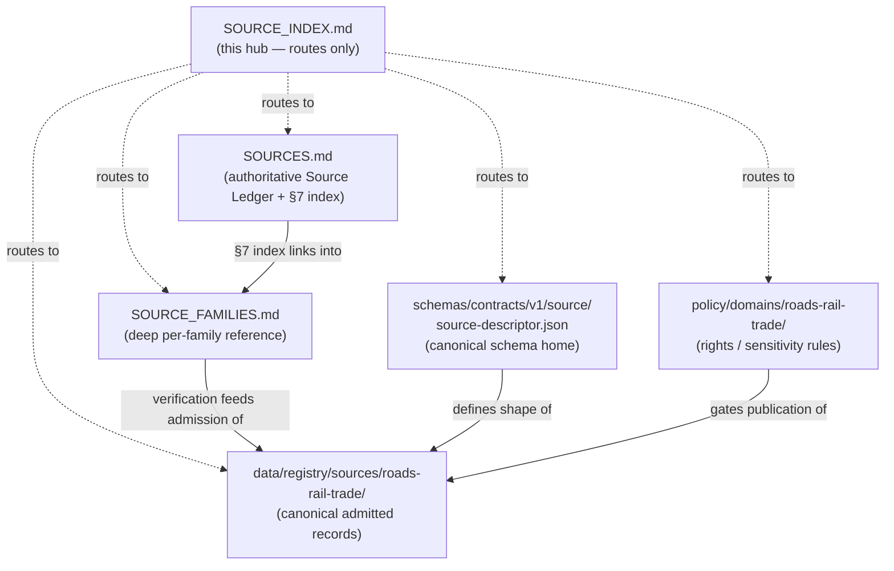

<!-- [KFM_META_BLOCK_V2]
doc_id: kfm://doc/roads-rail-trade-source-index
title: Roads, Rail & Trade Routes — Source Documentation Index (Hub)
type: standard
version: v1
status: draft
owners: PLACEHOLDER-source-steward, PLACEHOLDER-roads-rail-domain-steward
created: 2026-06-07
updated: 2026-06-07
policy_label: public
related: [ai-build-operating-contract.md, directory-rules.md, docs/domains/roads-rail-trade/SOURCES.md, docs/domains/roads-rail-trade/SOURCE_FAMILIES.md, docs/domains/roads-rail-trade/README.md, schemas/contracts/v1/source/source-descriptor.json, data/registry/sources/roads-rail-trade/, policy/domains/roads-rail-trade/]
tags: [kfm, roads-rail-trade, source-index, navigation, hub]
notes: [Doctrine-adjacent; CONTRACT_VERSION = "3.0.0" pinned. Option B navigation hub. NOT a catalog and NOT an authority — SOURCES.md is the authoritative lane Source Ledger; data/registry/sources/roads-rail-trade/ is the canonical registry. This file only routes.]
[/KFM_META_BLOCK_V2] -->

# 🧭 Roads, Rail & Trade Routes — Source Documentation Index

> Navigation hub for the Roads/Rail lane's **source documentation**. This page routes you to the right surface — it does **not** catalog sources and is **not** an authority.

**Status:** `draft` · **Owners:** source steward + Roads/Rail domain steward *(placeholders — verify)* · **Updated:** 2026-06-07
**Pinned:** `CONTRACT_VERSION = "3.0.0"` (`ai-build-operating-contract.md`)

> [!IMPORTANT]
> **This file is a hub, not an authority.** The authoritative lane **Source Ledger** is [`SOURCES.md`](./SOURCES.md). The canonical **registry** of admitted source records is `data/registry/sources/roads-rail-trade/` *(PROPOSED)*. The canonical **schema home** is `schemas/contracts/v1/source/source-descriptor.json` *(PROPOSED, per ADR-0001 / §7.4)*. If anything here disagrees with those, **they govern** and the conflict is logged in `docs/registers/DRIFT_REGISTER.md`. *(Directory Rules §13.1 — avoid parallel authorities.)*

---

## Where do I go?

| I want to… | Go to | Role of that surface |
|---|---|---|
| See the lane's **Source Ledger** (what each source supports / cannot prove) | [`SOURCES.md`](./SOURCES.md) | **Authoritative** control surface + family index (§7) |
| Read **deep per-family detail** (role rationale, rights/terms checklist, freshness, denial notes) | [`SOURCE_FAMILIES.md`](./SOURCE_FAMILIES.md) | Per-family reference; companion to the ledger |
| Find the **admitted source records** (`SourceDescriptor` instances) | `data/registry/sources/roads-rail-trade/` *(PROPOSED)* | **Canonical registry** — the records themselves |
| Check the **`SourceDescriptor` field shape** | `schemas/contracts/v1/source/source-descriptor.json` *(PROPOSED)* | **Canonical schema home** |
| See **rights / sensitivity allow-deny rules** | `policy/domains/roads-rail-trade/` and `policy/sensitivity/...` *(PROPOSED)* | Policy authority |
| Get **lane orientation** | [`README.md`](./README.md) *(PROPOSED neighbor)* | Lane landing page |

> [!NOTE]
> This table routes; it does not restate. Source roles, tiers, rights, and freshness live in `SOURCES.md` / `SOURCE_FAMILIES.md` — not here — so there is exactly one place to maintain each fact.

---

## How the surfaces relate

> [!WARNING]
> All paths above are **PROPOSED** placement targets from Directory Rules §12/§4. Presence of the registry lane, the schema file, the policy lane, and the neighbor `README.md` is **NEEDS VERIFICATION** against the mounted repository.

---

## Authority order (when surfaces disagree)

1. **`data/registry/sources/roads-rail-trade/`** — the admitted `SourceDescriptor` records (registry is canonical for *what was admitted*).
2. **`schemas/contracts/v1/source/source-descriptor.json`** — canonical for *field shape*.
3. **`policy/domains/roads-rail-trade/`** — canonical for *allow / deny / restrict*.
4. **[`SOURCES.md`](./SOURCES.md)** — authoritative lane prose ledger.
5. **[`SOURCE_FAMILIES.md`](./SOURCE_FAMILIES.md)** — deep reference; defers to the ledger.
6. **This hub** — routing only; never overrides any of the above.

*(Layering per Directory Rules; doctrine-adjacent. `[DIRRULES] [ENCY]`)*

---

## Open questions register

| ID | Question | Owner role | Resolution path |
|---|---|---|---|
| OQ-ROADS-SIDX-01 | Does the lane benefit from a hub, or is `SOURCES.md` §7 sufficient as the single entry point? | Docs steward | Lane navigation review |
| OQ-ROADS-SIDX-02 | Should the hub link be surfaced from the lane `README.md` or replace a section of it? | Docs steward | `README.md` structure review |

## Open verification backlog

These remain `NEEDS VERIFICATION` before promotion from `draft` to `published`:

1. Presence of `SOURCES.md`, `SOURCE_FAMILIES.md`, and `README.md` in the lane.
2. Presence of `data/registry/sources/roads-rail-trade/`, the `SourceDescriptor` schema, and `policy/domains/roads-rail-trade/`.
3. Confirmation that no third party treats this hub as a catalog/authority (drift watch).

## Changelog v0 → v1

| Change | Type (per contract §37) | Reason |
|---|---|---|
| Initial creation as navigation hub | new | Option B — give "SOURCE_INDEX" a non-redundant routing role |
| Authority-order section added | clarification | Prevent the hub from being read as an authority |

> **Backward compatibility.** New file; no prior anchors. Routes to existing lane docs; if those move, update this hub.

## Definition of done

This document is done enough to enter the repository when:

- it is placed at `docs/domains/roads-rail-trade/SOURCE_INDEX.md` per Directory Rules §12;
- a docs steward reviews it;
- it is linked from the lane `README.md` (or the README's source section points here);
- it adds **no** source facts that belong in `SOURCES.md` / the registry (hub-only discipline);
- it does not conflict with accepted ADRs (ADR-0001, ADR-S-04);
- any conflict with current repo conventions is logged in `docs/registers/DRIFT_REGISTER.md`;
- the `GENERATED_RECEIPT.json` planned in Notes is wired into CI;
- future changes follow the operating contract's §37 lifecycle.

---

## Related docs

- [`docs/domains/roads-rail-trade/SOURCES.md`](./SOURCES.md) — **authoritative** lane Source Ledger + family index
- [`docs/domains/roads-rail-trade/SOURCE_FAMILIES.md`](./SOURCE_FAMILIES.md) — deep per-family reference
- [`docs/domains/roads-rail-trade/README.md`](./README.md) *(PROPOSED neighbor — verify)*
- [`directory-rules.md`](../../../directory-rules.md) — Domain Placement Law §12; parallel-authority anti-pattern §13.1
- [`ai-build-operating-contract.md`](../../../ai-build-operating-contract.md) — operating law; `CONTRACT_VERSION = "3.0.0"`
- `data/registry/sources/roads-rail-trade/` *(PROPOSED canonical registry)*
- `schemas/contracts/v1/source/source-descriptor.json` *(PROPOSED canonical schema home)*

---

*Last updated: 2026-06-07 · `CONTRACT_VERSION = "3.0.0"` · Status: `draft` · Navigation hub — not an authority*

[↑ Back to top](#top)
