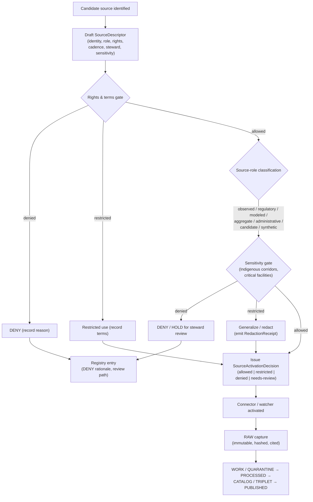
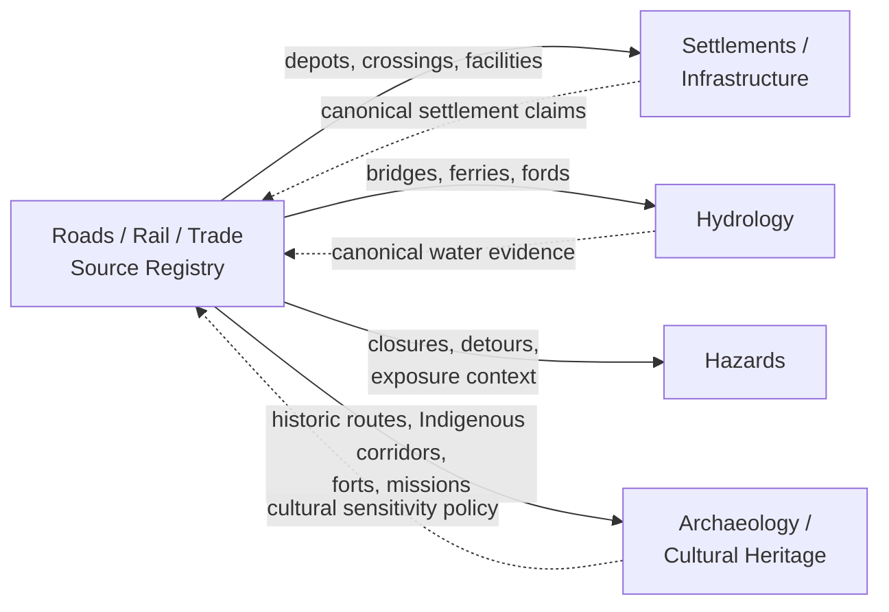

<!-- [KFM_META_BLOCK_V2]
doc_id: kfm://doc/roads-rail-trade-source-registry
title: Roads / Rail / Trade Routes — Source Registry Doctrine
type: standard
version: v1
status: draft
owners: PLACEHOLDER-roads-rail-trade-domain-steward, PLACEHOLDER-source-steward
created: 2026-05-19
updated: 2026-06-07
policy_label: public
related: [ai-build-operating-contract.md, directory-rules.md, docs/domains/roads-rail-trade/SOURCES.md, docs/domains/roads-rail-trade/SOURCE_FAMILIES.md, docs/domains/roads-rail-trade/SOURCE_INDEX.md, schemas/contracts/v1/source/source-descriptor.json, data/registry/sources/roads-rail-trade/, policy/domains/roads-rail-trade/]
tags: [kfm, roads-rail-trade, source-registry, governance, doctrine]
notes: [Doctrine-adjacent; CONTRACT_VERSION = "3.0.0" pinned. Governs the RULES the machine-readable registry must obey; the records live under data/registry/sources/roads-rail-trade/. SOURCES.md is the authoritative lane Source Ledger; this file is the admission-doctrine surface. All implementation-layer paths are PROPOSED until verified against a mounted repo. Directory Rules version is NEEDS VERIFICATION (corpus evidences v1.2/v1.3).]
[/KFM_META_BLOCK_V2] -->

<a id="top"></a>

# 🛤️ Roads / Rail / Trade Routes — Source Registry Doctrine

> Governed admission, role, rights, sensitivity, and freshness **doctrine** for every source that may enter the Roads / Rail / Trade Routes lane.


<!-- TODO: replace with real CI / release / freshness endpoints and confirmed Directory Rules version -->


**Status:** `draft` · **Owners:** Roads/Rail/Trade domain steward + source steward _(placeholders — verify)_ · **Last updated:** 2026-06-07
**Pinned:** `CONTRACT_VERSION = "3.0.0"` (`ai-build-operating-contract.md`)

> [!IMPORTANT]
> **Authority & division of labor (lane source docs).** This lane has four source-documentation surfaces; each has one job. If they disagree, the order below governs and the conflict is logged in `docs/registers/DRIFT_REGISTER.md`. *(Directory Rules §13.1 / §24.9.1 — avoid parallel authorities.)*
>
> 1. **`data/registry/sources/roads-rail-trade/`** — canonical for *what was actually admitted* (the `SourceDescriptor` records).
> 2. **`schemas/contracts/v1/source/source-descriptor.json`** — canonical for *descriptor field shape* (ADR-0001).
> 3. **`policy/domains/roads-rail-trade/`** — canonical for *allow / deny / restrict*.
> 4. **[`SOURCES.md`](./SOURCES.md)** — authoritative lane **Source Ledger** (what each source supports / cannot prove).
> 5. **This file (`SOURCE_REGISTRY.md`)** — the **admission doctrine** the registry data must obey. It explains the rules; it does not store records and does not restate the ledger.
> 6. **[`SOURCE_FAMILIES.md`](./SOURCE_FAMILIES.md)** (deep per-family detail) · **[`SOURCE_INDEX.md`](./SOURCE_INDEX.md)** (navigation hub).

---

## Contents

1. [Purpose](#1-purpose)
2. [Repo fit](#2-repo-fit)
3. [Authority and scope](#3-authority-and-scope)
4. [Source admission flow](#4-source-admission-flow)
5. [Source families (CONFIRMED dossier list)](#5-source-families-confirmed-dossier-list)
6. [Source-role taxonomy (cross-cutting doctrine)](#6-source-role-taxonomy-cross-cutting-doctrine)
7. [SourceDescriptor surface](#7-sourcedescriptor-surface)
8. [Sensitivity, rights, and publication posture](#8-sensitivity-rights-and-publication-posture)
9. [Anti-collapse rules for this domain](#9-anti-collapse-rules-for-this-domain)
10. [Pipeline shape (RAW → PUBLISHED)](#10-pipeline-shape-raw--published)
11. [Validators, tests, and fixtures (PROPOSED)](#11-validators-tests-and-fixtures-proposed)
12. [Cross-lane source impact](#12-cross-lane-source-impact)
13. [Registry directory layout (PROPOSED)](#13-registry-directory-layout-proposed)
14. [Open questions register](#14-open-questions-register)
15. [Open verification backlog](#15-open-verification-backlog)
16. [Changelog](#16-changelog-v0--v1)
17. [Definition of done](#17-definition-of-done)
18. [Related docs](#18-related-docs)
19. [Appendix — historic and trade-corridor sources](#19-appendix--historic-and-trade-corridor-sources)

---

## 1. Purpose

This document is the **human-facing source-registry doctrine** for the Roads / Rail / Trade Routes domain. It defines:

- **What** counts as a source for this lane.
- **How** a source is admitted, classified by role, rights-checked, sensitivity-checked, and either activated, restricted, quarantined, denied, or held for review.
- **Where** descriptors and registry entries live in the repository.
- **Which guardrails** prevent the role-collapse failure modes this lane is doctrinally at risk of (notably *administrative compilation cited as observation*).

> [!IMPORTANT]
> CONFIRMED doctrine: the KFM source registry is an **admission and authority-control surface, not a bibliography**. It governs whether material may shape public claims — not merely whether it can be cited. `[ENCY] [DIRRULES]`

The companion **machine-readable registry** for this lane lives at `data/registry/sources/roads-rail-trade/` *(PROPOSED home — see [OQ-RR-SR-08](#14-open-questions-register))*. This document does **not** replace that data; it explains the rules the data must obey.

[↑ Back to top](#top)

---

## 2. Repo fit

| Aspect | Value | Status |
|---|---|---|
| Responsibility root | `docs/` (human-facing control plane) | CONFIRMED rule `[DIRRULES §3, §5]` |
| Domain segment | `docs/domains/roads-rail-trade/` | CONFIRMED rule `[DIRRULES §12]` |
| File path | `docs/domains/roads-rail-trade/SOURCE_REGISTRY.md` | PROPOSED — NEEDS VERIFICATION |
| Machine-readable companion | `data/registry/sources/roads-rail-trade/` | PROPOSED `[DIRRULES §12]` |
| Canonical descriptor schema home | `schemas/contracts/v1/source/source-descriptor.json` (ADR-0001) | PROPOSED — NEEDS VERIFICATION |
| Sensitivity policy bundle | `policy/domains/roads-rail-trade/` | PROPOSED `[DIRRULES §12]` |
| Connector home | `connectors/` (output → `data/raw/roads-rail-trade/` or `data/quarantine/roads-rail-trade/`) | CONFIRMED rule `[DIRRULES §3]` |

**Upstream doctrine sources (CONFIRMED):**
- `directory-rules.md` — placement law. *(Project file is at repo root; a `docs/doctrine/` location is PROPOSED — NEEDS VERIFICATION.)*
- KFM Domains Atlas v1.1, ch. 13 (Roads / Rail / Trade Routes) — domain dossier `[DOM-ROADS]`.
- KFM Domains Atlas v1.1, §24.1 (Master Source-Role Anti-Collapse Register) — cross-cutting role taxonomy `[ENCY]`.
- KFM Unified Implementation Architecture Build Manual — source registry architecture.

**Downstream consumers (PROPOSED):**
- `connectors/` admitters for each source family.
- `pipelines/domains/roads-rail-trade/` normalization stages.
- `policy/domains/roads-rail-trade/` admission and publication gates.
- `data/published/layers/roads-rail-trade/` public-safe releases.
- `apps/governed-api/` Roads/Rail decision envelopes (route TBD; exact route UNKNOWN).

[↑ Back to top](#top)

---

## 3. Authority and scope

### 3.1 What this registry governs

CONFIRMED dossier scope: sources contributing evidence about Kansas **roads, rail, historic routes, trade and mobility corridors, restrictions, facilities, graph projections**, and the catalog / proof / release objects derived from them. `[DOM-ROADS] [ENCY]`

### 3.2 What this registry does NOT govern

CONFIRMED non-ownership (from the domain dossier):
- **Settlements / Infrastructure** owns settlement and infrastructure canonical claims (depots, yards, crossings cite Settlements where applicable).
- **Hydrology** owns water evidence (bridge / ferry / ford evidence cites Hydrology).
- **Archaeology / People / Land / Hazards** retain their truth and sensitivity policies. `[DOM-ROADS]`

> [!NOTE]
> A source that primarily evidences a settlement, watercourse, archaeological site, or person is admitted by the **owning lane**, not by Roads/Rail/Trade — even if it has incidental transport content. Roads/Rail/Trade then *cites* it through a governed join.

### 3.3 Conflict resolution

When this document and another source disagree, apply the Directory Rules authority order:

1. KFM core invariants and doctrine (lifecycle law, cite-or-abstain, trust membrane).
2. Accepted ADRs that explicitly amend Directory Rules.
3. `directory-rules.md`.
4. Per-root READMEs (refine, never contradict).
5. Domain dossiers and prior architecture reports (lineage / proposed).
6. Mounted-repo convention (raise via `docs/registers/DRIFT_REGISTER.md`, not new authority). `[DIRRULES §2.5]`

[↑ Back to top](#top)

---

## 4. Source admission flow

CONFIRMED doctrine + PROPOSED implementation: every Roads/Rail/Trade source passes the same governed admission pipeline. Connectors and watchers remain **inactive** until each gate has resolved. `[BLD-COMP] [IMPL-PIPE]`



> [!NOTE]
> **NEEDS VERIFICATION:** This flowchart reflects CONFIRMED doctrine. The actual gate identities, decision DTOs, and route names in a mounted repo remain PROPOSED until inspected.

### 4.1 Required outputs of admission (PROPOSED shape)

| Output | Purpose | Required content (PROPOSED) |
|---|---|---|
| `SourceDescriptor` | Anchors every downstream receipt. | `source_id`, `source_role`, `authority`, `rights`, `sensitivity`, `cadence`, ingest hash, time, citation. `[ENCY] [DIRRULES]` |
| `SourceActivationDecision` | Gate record. | Outcome ∈ { allowed, restricted, denied, needs-review }, rationale, reviewer, expiry. `[BLD-COMP]` |
| Drift / verification entry | Tracks open questions. | Entry in `docs/registers/DRIFT_REGISTER.md` or `docs/registers/VERIFICATION_BACKLOG.md`. `[DIRRULES §2.5]` |

[↑ Back to top](#top)

---

## 5. Source families (CONFIRMED dossier list)

CONFIRMED list (KFM Domains Atlas v1.1, ch. 13 §D). **Role**, **rights / sensitivity**, and **freshness** are intentionally generic in the dossier — they MUST be resolved per-source at admission, never assumed.

> [!NOTE]
> This table is the registry-doctrine view. The per-family **detail** (role rationale, cannot-prove statements, verification checklist) lives in [`SOURCE_FAMILIES.md`](./SOURCE_FAMILIES.md); the authoritative ledger index is [`SOURCES.md` §7](./SOURCES.md). Keep one fact in one place.

| # | Source family | Typical role(s) | Rights / sensitivity | Freshness | Status |
|---|---|---|---|---|---|
| 1 | **Census TIGER/Line — roads** | administrative / observation (geometry context); never observation of facility *condition* | Public-domain assumed; NEEDS VERIFICATION of current terms | Annual vintage | CONFIRMED family / PROPOSED admission |
| 2 | **FHWA HPMS** | administrative (network extent) / regulatory (functional class, NHS) | Federal release; NEEDS VERIFICATION of redistribution and detail tiers | Annual cycle (NEEDS VERIFICATION) | CONFIRMED family / PROPOSED admission |
| 3 | **FHWA National Highway Freight Network** | regulatory (designations); administrative (roster) | Federal release; NEEDS VERIFICATION of attribution | Periodic; NEEDS VERIFICATION | CONFIRMED family / PROPOSED admission |
| 4 | **WZDx feeds** (Work-Zone Data Exchange) | observation (active work-zone events) | Variable per producer; NEEDS VERIFICATION per feed | Near-real-time; per producer | CONFIRMED family / PROPOSED admission |
| 5 | **KDOT / KanPlan / KanDrive / Kansas GIS** | authority (state-route designation), observation (status), administrative (asset rosters) | State agency terms; NEEDS VERIFICATION per dataset | Mixed; NEEDS VERIFICATION | CONFIRMED family / PROPOSED admission |
| 6 | **County / state bridge & restriction data** | regulatory (posted restrictions) / administrative (inventories) | County / state; rights vary; NEEDS VERIFICATION | Mixed; NEEDS VERIFICATION | CONFIRMED family / PROPOSED admission |
| 7 | **GNIS names** | administrative (named features) | Public-domain assumed; NEEDS VERIFICATION | Periodic | CONFIRMED family / PROPOSED admission |
| 8 | **OpenStreetMap** | candidate / context (community-contributed) | ODbL — attribution & share-alike obligations; NEEDS VERIFICATION of joinability with non-ODbL outputs | Continuous; per importer | CONFIRMED family / PROPOSED admission; **never an authority** for legal status `[DOM-ROADS §K]` |

> [!CAUTION]
> **OSM / GNIS legal-status denial** is a PROPOSED test in the domain validator backlog. OSM and GNIS may evidence *presence and name* but MUST NOT be cited as authority for *legal designation* (route number, functional class, designated freight corridor, etc.). `[DOM-ROADS §K] [ENCY]`

### 5.1 Historic and trade-corridor sources (PROPOSED)

The dossier names historic and trade-corridor evidence (Santa Fe Trail, Pony Express, Butterfield/Smoky Hill, military / mail / emigrant / stage / cattle corridors) as in scope for this lane, and identifies a **PROPOSED** "Frontier routes FeatureCollection" deliverable (KFM-P20-PROG-0013, Pass 32). The source families that feed these — historic maps, GLO plats, military reports, archival narratives, Indigenous oral history — are not yet enumerated in the dossier as a single registry list and are tracked as **NEEDS VERIFICATION** in [§15](#15-open-verification-backlog). See [Appendix](#19-appendix--historic-and-trade-corridor-sources).

[↑ Back to top](#top)

---

## 6. Source-role taxonomy (cross-cutting doctrine)

CONFIRMED doctrine: KFM treats **source role as a first-class identity attribute** and fails closed when roles are conflated. Full doctrine lives in Atlas v1.1 §24.1. `[ENCY §24.1]`

| Role | One-line definition | Roads/Rail/Trade examples |
|---|---|---|
| **Observed** | First-hand reading / measurement / record tied to place and time. | A WZDx work-zone event message; a traffic-counter reading; a field bridge-inspection note. |
| **Regulatory** | Authoritative determination by a regulating body with legal/administrative force. | NHS designation; designated freight corridor; posted weight restriction; railroad operating rights. |
| **Modeled** | Derived from inputs, assumptions, fitted parameters. | Travel-time model output; derived transport graph; freight-flow estimate. |
| **Aggregate** | Published summary over a unit (county, year, corridor). | County VMT total; annual segment AADT (when only aggregate); freight-flow corridor totals. |
| **Administrative** | Compiled agency record for administration / registration / accounting. | TIGER/Line geometry; HPMS rows; county bridge inventory; **transport facility roster**. `[§24.1.1]` |
| **Candidate** | Awaiting validation / dedup / steward review. | Unmerged OSM way claim; unresolved historic-route alignment; quarantined connector output. |
| **Synthetic** | Generated by simulation, reconstruction, AI, interpolation. | Reconstructed historic alignment; AI-drafted summary of a corridor EvidenceBundle. |

> [!IMPORTANT]
> The dossier explicitly flags **Roads** as a domain at risk of the *"administrative compilation cited as observation"* collapse. TIGER/Line geometry, HPMS rows, and facility rosters are **administrative**; presenting them as an *observed event timeline* is **DENIED** at publication. `[Atlas v1.1 §24.1.2]`

[↑ Back to top](#top)

---

## 7. SourceDescriptor surface

PROPOSED descriptor shape (illustrative — the canonical schema is owned by `schemas/contracts/v1/source/source-descriptor.json` per ADR-0001; field names below are NEEDS VERIFICATION against the mounted schema). `[Atlas v1.1 §24.1.3]`

<details>
<summary>Field reference (click to expand)</summary>

| Field | Type / vocabulary | Required? | Notes |
|---|---|---|---|
| `source_id` | string (stable, opaque) | MUST | Never reused; corrections produce a new descriptor with `superseded_by`. |
| `source_role` | enum: observed \| regulatory \| modeled \| aggregate \| administrative \| candidate \| synthetic | MUST | Set at admission; never edited in place. `[§24.1.3]` |
| `role_authority` | string (issuing body / model identity / steward) | MUST when role ∈ {regulatory, modeled, aggregate} | Disambiguates downstream cite text. |
| `role_aggregation_unit` | geometry-scope token (county, HUC, corridor, year, decade, …) | MUST when `source_role = aggregate` | Prevents geometry-scope drift on join. |
| `role_model_run_ref` | EvidenceRef → ModelRunReceipt | MUST when `source_role = modeled` | Pins inputs, parameters, version. |
| `role_synthetic_basis` | `{ method, inputs, reality_boundary_note_ref }` | MUST when `source_role = synthetic` | Records what is / is not real. |
| `role_candidate_disposition` | enum: pending \| merged \| rejected \| quarantined | MUST when `source_role = candidate` | PUBLISHED edge forbidden until merged. |
| `authority` | string | MUST | Agency / project / community of record. |
| `rights` | structured `{ license, attribution, redistribution, endpoint_terms }` | MUST | Drives the rights-and-terms gate. |
| `sensitivity` | structured (tier + tags) | MUST | Resolves Indigenous-corridor, critical-facility, and other lane defaults. |
| `cadence` | structured `{ expected_period, freshness_tolerance }` | MUST | Feeds stale-state markers. `[Atlas §24.8.1]` |
| `access_method` | enum (api \| download \| feed \| archival \| derived) | MUST | Constrains connector design. |
| `steward` | string / kfm:// id | MUST | Named human / role for review. |
| `release_class` | enum (public \| restricted \| internal-only \| denied) | MUST | Anchors publication eligibility. |
| `ingest_hash` | digest | MUST | Pins the admitted payload. |
| `time` | structured (admitted, retrieved, valid-from, valid-to) | MUST | KFM's source / observed / valid / retrieval / release / correction distinction. |
| `citation` | string | MUST | Reader-facing attribution. |
| `superseded_by` | source_id \| null | OPTIONAL | Supersession lineage. |

</details>

[↑ Back to top](#top)

---

## 8. Sensitivity, rights, and publication posture

CONFIRMED / PROPOSED (from the domain dossier):

- **Indigenous trade and mobility corridors**, oral history, treaty, cultural, and interpretive evidence **default to steward review and generalized public geometry**. `[DOM-ROADS §I]`
- **Critical transport facilities** require steward review before any precise-geometry public release. `[DOM-ROADS §I]`
- **Unclear rights, unresolved source role, missing evidence, unresolved sensitivity, or absent release state blocks public promotion.** CONFIRMED operating invariant. `[ENCY] [DIRRULES]`

| Trigger | Default posture | Required artifact |
|---|---|---|
| Indigenous corridor or oral-history evidence | Steward review; geometry generalized for public surfaces | RedactionReceipt + ReviewRecord |
| Living-person operator data in a feed | Strip / quarantine living-person fields | RedactionReceipt |
| Precise critical-facility geometry (bridge load posting, tunnel detail, hazardous-route detail) | HOLD for steward review; release only generalized | ReviewRecord + RedactionReceipt |
| Historic alignment with uncertain provenance | Source role = `candidate` until steward review; never `observed` | SourceActivationDecision = needs-review |
| Rights terms ambiguous | DENY admission until resolved | DENY decision recorded; no connector activation |

> [!WARNING]
> **No PUBLISHED edge** is permitted from material that has not cleared the rights, sensitivity, and release-state gates — regardless of source family. This is enforced by the trust membrane, not by the connector author. `[ENCY] [DIRRULES]`

[↑ Back to top](#top)

---

## 9. Anti-collapse rules for this domain

CONFIRMED guardrails the Roads/Rail/Trade lane MUST observe (Atlas v1.1 §24.1.2):

| Collapse pattern | Denied outcome | Required guardrail |
|---|---|---|
| **Administrative compilation cited as observation** (TIGER/Line geometry treated as *"segment observed open on date X"*) | DENY publication of compilation as observed event timeline. | Source-role tag preserved through every promotion; named `RouteEvent` / `RestrictionEvent` / `OperatorAssignment` types distinct from base geometry. `[§24.1.2]` |
| **Regulatory designation treated as an observed event** (NHS designation treated as a *historic event timeline*) | DENY at publication. | Separate regulatory-state lane from observed-event lane. |
| **Modeled graph projection treated as canonical record** (a derived transport graph standing in for source segments) | DENY publication; ABSTAIN at AI surface. | Run receipt + role-preserving DTO; routing/traversal graphs MUST NOT replace canonical records. |
| **Aggregate cited as per-place truth** (a corridor-total cited as a per-segment fact) | DENY join from aggregate cell to single record. | AggregationReceipt; geometry-scope guard. |
| **Candidate exposed publicly** (OSM way exposed as authoritative legal status) | DENY at trust membrane; route to QUARANTINE. | Promotion gate; no PUBLISHED edge from WORK / QUARANTINE. |
| **AI text treated as evidence** (a Focus-Mode answer presented as the route's evidence) | DENY publication; ABSTAIN at Focus Mode. | AIReceipt mandatory; cite-or-abstain rule. `[GAI]` |

[↑ Back to top](#top)

---

## 10. Pipeline shape (RAW → PUBLISHED)

CONFIRMED doctrine / PROPOSED lane application — Roads/Rail/Trade observes the standard lifecycle invariant; promotion is a **governed state transition, not a file move**. `[DIRRULES] [DOM-ROADS §H]`

| Stage | Handling | Gate | Status |
|---|---|---|---|
| **RAW** | Capture immutable source payload/reference with source role, rights, sensitivity, citation, time, hash. | `SourceDescriptor` exists. | PROPOSED |
| **WORK / QUARANTINE** | Normalize schema, geometry, time, identity, evidence, rights, policy; hold failures. | Validation + policy gate pass, **or** quarantine reason recorded. | PROPOSED |
| **PROCESSED** | Emit validated normalized objects, receipts, public-safe candidates. | `EvidenceRef`, `ValidationReport`, digest closure. | PROPOSED |
| **CATALOG / TRIPLET** | Emit catalog records, EvidenceBundles, graph/triplet projections, release candidates. | Catalog / proof closure passes. | PROPOSED |
| **PUBLISHED** | Serve released public-safe artifacts through governed APIs and manifests. | `ReleaseManifest`, correction path, rollback target, review/policy state exist. | PROPOSED |

[↑ Back to top](#top)

---

## 11. Validators, tests, and fixtures (PROPOSED)

PROPOSED validator slate from the domain dossier `[DOM-ROADS §K]`:

- Route membership and designation separation tests.
- Operator / status temporal tests.
- **OSM / GNIS legal-status denial** test (see [§5](#5-source-families-confirmed-dossier-list)).
- Historic-route overprecision denial.
- Public generalization receipt tests.
- Transport graph projection rollback tests.

All PROPOSED until verified against `tests/domains/roads-rail-trade/` and `fixtures/domains/roads-rail-trade/` in a mounted repo. Cross-domain validators (e.g., source-role anti-collapse) live in **non-domain segments** per Directory Rules §12 "Multi-domain and cross-cutting files."

> [!TIP]
> Safest first proof is **fixture-first**: deterministic local fixtures + deny-by-default validators + a dry-run promotion *before* any live fetch or public release. `[ENCY KFM-P1-PROG-0024]`

[↑ Back to top](#top)

---

## 12. Cross-lane source impact

Sources admitted here can be **cited** by other lanes through governed joins, but **ownership** is preserved (a Roads source does not become a Hydrology source by touching a river crossing).



<sub>CONFIRMED relations from DOM-ROADS §F; each preserves ownership, source role, sensitivity, and EvidenceBundle support.</sub>

[↑ Back to top](#top)

---

## 13. Registry directory layout (PROPOSED)

Per Directory Rules §12 (Domain Placement Law), the Roads/Rail/Trade registry materializes across lanes — not as a root folder.

```text
docs/domains/roads-rail-trade/
├── SOURCES.md                   # authoritative Source Ledger + family index
├── SOURCE_FAMILIES.md           # deep per-family reference
├── SOURCE_INDEX.md              # navigation hub
└── SOURCE_REGISTRY.md           # this file (admission doctrine; human-facing)

data/registry/sources/roads-rail-trade/      # PROPOSED — see OQ-RR-SR-08
├── README.md                    # PROPOSED
├── <source_id>.json             # PROPOSED — one descriptor per admitted source
└── activations/
    └── <source_id>.<ts>.json    # PROPOSED — SourceActivationDecision records

schemas/contracts/v1/source/
└── source-descriptor.json       # canonical schema home (ADR-0001); NEEDS VERIFICATION

policy/domains/roads-rail-trade/
├── rights.rego                  # PROPOSED — rights-and-terms gate
├── sensitivity.rego             # PROPOSED — Indigenous-corridor, critical-facility rules
└── role-anti-collapse.rego      # PROPOSED — references cross-cutting policy

connectors/
└── <one folder per source family>   # output → data/raw/roads-rail-trade/ or data/quarantine/roads-rail-trade/

tests/domains/roads-rail-trade/
└── source-registry/             # PROPOSED — validator suite (see §11)
```

> [!NOTE]
> Every path above is **PROPOSED** until verified against a mounted repository. The **rule** (responsibility-rooted placement, domain as segment) is CONFIRMED; the **specific files** are not. `[DIRRULES §12]`

[↑ Back to top](#top)

---

## 14. Open questions register

| ID | Question | Owner role | Resolution path |
|---|---|---|---|
| OQ-RR-SR-08 | Is `data/registry/<domain>/` (Directory Rules §3 Step 3) or `data/registry/sources/<domain>/` (§12) the canonical home for source descriptors? Both phrasings appear in Directory Rules. | Docs steward | **ADR-class** per §2.4(5) (parallel registry home) OR per-root `data/registry/README.md`; log to `DRIFT_REGISTER.md` until resolved |
| OQ-RR-SR-09 | Should four lane source docs (`SOURCES`, `SOURCE_FAMILIES`, `SOURCE_INDEX`, `SOURCE_REGISTRY`) be consolidated, or is the current division of labor accepted? | Docs steward | Lane doc-set review; possible consolidation note |
| OQ-RR-SR-10 | Confirmed Directory Rules version (corpus shows v1.2/v1.3; badge currently a placeholder). | Docs steward | Inspect `directory-rules.md` header in mounted repo |

## 15. Open verification backlog

| # | Item | Evidence that would settle it | Status |
|---|---|---|---|
| OPEN-RR-SR-01 | Verify current terms / redistribution posture of all 8 CONFIRMED families (TIGER, HPMS, NHFN, WZDx, KDOT, county data, GNIS, OSM). | Source endpoint pages; license headers; agency comms. | NEEDS VERIFICATION `[DOM-ROADS §D]` |
| OPEN-RR-SR-02 | Enumerate historic / trade-corridor source families into descriptor entries with role, rights, sensitivity, steward. | A reviewed `data/registry/sources/roads-rail-trade/` listing. | NEEDS VERIFICATION `[KFM-P20-PROG-0013]` |
| OPEN-RR-SR-03 | Confirm canonical `SourceDescriptor` schema path and field names; surface drift. | Inspection of `schemas/contracts/v1/source/source-descriptor.json`. | NEEDS VERIFICATION `[DIRRULES §7.4 / ADR-0001]` |
| OPEN-RR-SR-04 | Confirm policy bundle home: `policy/domains/roads-rail-trade/` vs. compatibility `policies/`. | Inspection of `policy/` and `policies/`. | NEEDS VERIFICATION `[DIRRULES §5]` |
| OPEN-RR-SR-05 | Implement `SourceActivationDecision` records and link them from descriptors. | Sample activation files; tests asserting connector inactivation absent activation. | PROPOSED `[BLD-COMP]` |
| OPEN-RR-SR-06 | Implement OSM / GNIS legal-status denial test. | Failing fixture asserting deny; CI workflow citing the rule. | PROPOSED `[DOM-ROADS §K]` |
| OPEN-RR-SR-07 | Implement historic-overprecision denial test. | Fixture + receipt asserting generalization. | PROPOSED `[DOM-ROADS §K]` |

[↑ Back to top](#top)

---

## 16. Changelog v0 → v1

| Change | Type (per contract §37) | Reason |
|---|---|---|
| Added cross-file authority-order block (4 lane source docs) | reconciliation | Prevent parallel-authority drift `[DIRRULES §13.1 / §24.9.1]` |
| Reframed registry-home ambiguity as ADR-class (OQ-RR-SR-08) | clarification | §2.4(5) parallel-home trigger, not a mere drift note |
| Directory Rules version → labeled placeholder | gap closure | Corpus evidences v1.2/v1.3; v1.1 was stale |
| `related` paths softened to PROPOSED where repo location unverified | housekeeping | `directory-rules.md` is at repo root in project files |
| Added doctrine companion sections (Open Qs, Changelog, DoD) | new | Doctrine-adjacent doc requirement |
| Consolidated duplicate footer; quoted Mermaid special-char labels | housekeeping | Render safety + polish |

> **Backward compatibility.** Section numbering shifted (companion sections inserted): old §14 → §15, §15 → §18, §16 → §19. Anchor `#contents` replaced by `#top` for back-to-top links. Update any inbound links accordingly.

## 17. Definition of done

This document is done enough to enter the repository when:

- it is placed at `docs/domains/roads-rail-trade/SOURCE_REGISTRY.md` per Directory Rules §12;
- a docs steward **and** the source steward review it;
- the four-file division of labor is accepted (OQ-RR-SR-09) and `SOURCE_INDEX.md` links to it;
- it does not conflict with accepted ADRs (ADR-0001, ADR-S-04; the §2.4(5) registry-home question is resolved or logged);
- the registry-home ambiguity (OQ-RR-SR-08) is logged in `docs/registers/DRIFT_REGISTER.md`;
- the `GENERATED_RECEIPT.json` planned in Notes is wired into CI;
- future changes follow the operating contract's §37 lifecycle.

[↑ Back to top](#top)

---

## 18. Related docs

- [`docs/domains/roads-rail-trade/SOURCES.md`](./SOURCES.md) — **authoritative** lane Source Ledger + family index
- [`docs/domains/roads-rail-trade/SOURCE_FAMILIES.md`](./SOURCE_FAMILIES.md) — deep per-family reference
- [`docs/domains/roads-rail-trade/SOURCE_INDEX.md`](./SOURCE_INDEX.md) — navigation hub
- [`directory-rules.md`](../../../directory-rules.md) — placement law; §12 Domain Placement Law; §13.1/§24.9.1 parallel-authority anti-pattern *(repo-root location CONFIRMED in project files; `docs/doctrine/` variant PROPOSED)*
- [`ai-build-operating-contract.md`](../../../ai-build-operating-contract.md) — operating law; `CONTRACT_VERSION = "3.0.0"`
- `schemas/contracts/v1/source/source-descriptor.json` — canonical descriptor schema home (ADR-0001); NEEDS VERIFICATION
- `docs/standards/PROV.md` — provenance standard *(naming variance `PROV.md` vs `PROVENANCE.md`; NEEDS VERIFICATION)*
- `docs/runbooks/roads-rail-trade/SOURCE_REFRESH_RUNBOOK.md` — operational refresh procedure *(PROPOSED; runbook-subfolder convention pending verification)*

[↑ Back to top](#top)

---

## 19. Appendix — historic and trade-corridor sources

<details>
<summary>Provisional list (PROPOSED; not yet in the dossier source-family table)</summary>

The Atlas names — but does not enumerate as registry entries — the following historic and trade-corridor evidence streams. Listed here as PROPOSED candidates pending steward review (OPEN-RR-SR-02).

- **National Park Service** trail descriptions (Santa Fe NHT, Pony Express NHT, Oregon NHT segments through Kansas).
- **GLO (General Land Office) plats and field notes** — administrative geometry, NOT observed events.
- **State and county historical society holdings** — typically `candidate` or `administrative` until steward review.
- **Kansas Memory / Kansas Historical Society collections** — see Pass 18 `KFM-P18-PROG-0033`.
- **Military post and route reports** — `observed` (eyewitness narratives) or `administrative` (compilations), case-by-case.
- **Indigenous oral-history sources and tribal historic preservation offices** — **MUST** route through CARE / sovereignty review; **default to steward review and generalized geometry** per [§8](#8-sensitivity-rights-and-publication-posture).
- **Historic cartography** (Frémont, Pacific Railroad Surveys, Sanborn maps where transport-relevant) — typically `administrative` or `candidate`; never `observed` of present-day condition.
- **Cattle-trail historiography** (Chisholm, Western, Shawnee) — `candidate` until alignment evidence closes; corridor view is the public-safe form.

Each candidate must be drafted as a `SourceDescriptor` and passed through the admission flow in [§4](#4-source-admission-flow) before any data is fetched.

</details>

---

**Related:** [Source Ledger](./SOURCES.md) · [Source Families](./SOURCE_FAMILIES.md) · [Source Index](./SOURCE_INDEX.md) · [Directory Rules](../../../directory-rules.md)

*Last updated: 2026-06-07 · Doc version: v1 (draft) · `CONTRACT_VERSION = "3.0.0"`*

[↑ Back to top](#top)
