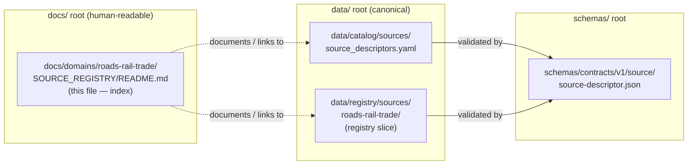
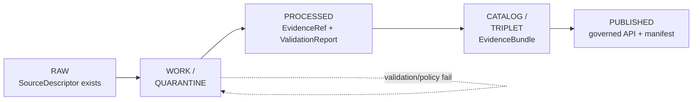

<!-- [KFM_META_BLOCK_V2]
doc_id: kfm://doc/roads-rail-trade-source-registry-readme
title: Roads, Rail & Trade Routes — Source Registry (Documentation Index)
type: standard
version: v1
status: draft
owners: TODO-roads-rail-trade-domain-steward, TODO-docs-steward
created: 2026-06-07
updated: 2026-06-07
policy_label: public
related: [
  ai-build-operating-contract.md,
  directory-rules.md,
  docs/domains/roads-rail-trade/README.md,
  data/registry/sources/roads-rail-trade/,
  data/catalog/sources/,
  schemas/contracts/v1/source/source-descriptor.json
]
tags: [kfm, roads-rail-trade, source-registry, provenance, source-role]
notes: [
  CONTRACT_VERSION = "3.0.0" pinned per ai-build-operating-contract.md,
  This README is a DOC-surface index; the canonical machine-readable registry is a data-root artifact (see Placement note),
  All repo-state claims are PROPOSED or NEEDS VERIFICATION; repo not mounted this session
]
[/KFM_META_BLOCK_V2] -->

<a id="top"></a>

# 🛤️ Roads, Rail & Trade Routes — Source Registry

> Documentation index of the source families admitted (or proposed for admission) into the **Roads / Rail / Trade Routes** domain lane, each carried with its source role, rights posture, sensitivity, and freshness expectation.


**Status:** `draft` · **Owners:** `TODO-roads-rail-trade-domain-steward`, `TODO-docs-steward` · **Updated:** `2026-06-07`

> [!IMPORTANT]
> **`CONTRACT_VERSION = "3.0.0"`** — this document operates under `ai-build-operating-contract.md` v3.0 and `directory-rules.md`. Truth labels (`CONFIRMED` / `PROPOSED` / `INFERRED` / `NEEDS VERIFICATION` / `CONFLICTED`) are load-bearing, not decoration.

---

## Quick jump

- [1. Scope](#1-scope)
- [2. Repo fit](#2-repo-fit)
- [3. Placement note — DOC index vs. canonical registry](#3-placement-note--doc-index-vs-canonical-registry)
- [4. Accepted inputs](#4-accepted-inputs)
- [5. Exclusions](#5-exclusions)
- [6. Source-role taxonomy](#6-source-role-taxonomy)
- [7. Source family register](#7-source-family-register)
- [8. SourceDescriptor surface](#8-sourcedescriptor-surface)
- [9. Admission lifecycle](#9-admission-lifecycle)
- [10. Sensitivity & rights posture](#10-sensitivity--rights-posture)
- [11. Directory tree](#11-directory-tree)
- [12. Validators & tests](#12-validators--tests)
- [13. FAQ](#13-faq)
- [14. Open questions register](#14-open-questions-register)
- [15. Open verification backlog](#15-open-verification-backlog)
- [16. Changelog](#16-changelog)
- [17. Definition of done](#17-definition-of-done)
- [18. Related docs](#18-related-docs)

---

## 1. Scope

This directory documents **which sources feed the Roads / Rail / Trade Routes domain**, what role each source is permitted to play, and the rights/sensitivity constraints that govern its use. It is the human-readable entry point a contributor reads before proposing a new source, joining a dataset, or asserting a road/rail/route claim.

> [!NOTE]
> A **source registry** in KFM answers four questions for every admitted dataset: *Who provides it? What role may it play (`observed` / `regulatory` / `modeled` / `aggregate` / `administrative` / `candidate` / `synthetic`)? What rights and sensitivity bind it? How fresh is it?* — `CONFIRMED doctrine` (`SourceDescriptor` + source-role controls).

A source can be admitted **only** when its role and rights are known or explicitly held — that is the first-proof expectation for `SourceDescriptor`. `CONFIRMED doctrine`.

[↑ Back to top](#top)

---

## 2. Repo fit

| Direction | Path | Relationship |
|---|---|---|
| **This doc** | `docs/domains/roads-rail-trade/SOURCE_REGISTRY/README.md` | Source index for the domain (`DOC` surface) |
| **Parent** | `docs/domains/roads-rail-trade/README.md` | Domain landing doc *(PROPOSED)* |
| **Canonical registry (data)** | `data/registry/sources/roads-rail-trade/` | Machine-readable source registry slice *(PROPOSED)* |
| **Catalog source descriptors** | `data/catalog/sources/` | `source_descriptors.yaml` home *(PROPOSED)* |
| **Schema home** | `schemas/contracts/v1/source/source-descriptor.json` | `SourceDescriptor` schema, per ADR-0001 *(PROPOSED; field presence NEEDS VERIFICATION)* |
| **Domain dossier** | Atlas §13 *Roads, Rail, and Trade Routes* | Doctrinal evidence `[DOM-ROADS] [ENCY]` |

> [!CAUTION]
> Several rows above are `PROPOSED`. The repository was **not mounted** this session; all paths, file presence, and field names are `NEEDS VERIFICATION` until checked against the live tree.

[↑ Back to top](#top)

---

## 3. Placement note — DOC index vs. canonical registry

> [!WARNING]
> **This README is a documentation surface, not the canonical registry.** Per Directory Rules, the canonical machine-readable source registry is a **`data/`-root artifact**, not a `docs/`-root artifact. The two must not diverge.

Directory Rules places domain documentation under `docs/domains/<domain>/` and the **source registry data** under `data/registry/sources/<domain>/`, with `SourceDescriptor` records under `data/catalog/sources/`. `CONFIRMED` (Directory Rules Step 3 lane pattern; §6.7 `data/registry/`/`data/catalog/` rows).



**Consequence for authors:** treat the entries in this README as a *view onto* the canonical registry, never as the registry of record. When the two disagree, the `data/`-root artifacts win and this index is the drift.

> [!NOTE]
> **`CONFLICTED` — ADR candidate.** The folder name `SOURCE_REGISTRY` (ALL-CAPS) was requested directly. Directory Rules uses **kebab-case** lane segments under `docs/` (e.g., `docs/focus-modes/ellsworth-county/`). An ALL-CAPS segment is unusual for a `docs/` lane and may read as a canonical-registry root rather than a doc index. Two reconciliations, pick one:
> - **Option A — keep `SOURCE_REGISTRY/`** as an intentional emphasis convention; record it in `docs/registers/DRIFT_REGISTER.md` and confirm via the domain README's local convention.
> - **Option B — rename to `source-registry/`** to match `docs/` kebab-case norm.
> Flagged as **`ADR-ROADS-SRCREG-01`** below. Awaiting your choice; this draft proceeds at the requested path.

[↑ Back to top](#top)

---

## 4. Accepted inputs

What belongs in this index:

- Entries describing **source families** that feed Roads / Rail / Trade Routes objects (Road Segment, Rail Segment, Depot, Siding, Yard, Crossing, Bridge, Ferry, River Crossing, Freight Corridor, Route Event, Operator Status, Access Restriction, Network Edge, Movement Story Node). `CONFIRMED / PROPOSED` `[DOM-ROADS]`.
- For each source: provider, intended source role, rights/terms posture, sensitivity notes, freshness/cadence, and a link to its `SourceDescriptor` in the canonical registry.
- Links to admission-decision artifacts (`SourceActivationDecision`) and any quarantine reasons.

[↑ Back to top](#top)

---

## 5. Exclusions

What does **not** belong here, and where it goes instead:

| Not this | Goes here instead |
|---|---|
| The canonical machine-readable registry records | `data/registry/sources/roads-rail-trade/`, `data/catalog/sources/` *(PROPOSED)* |
| `SourceDescriptor` JSON schema | `schemas/contracts/v1/source/source-descriptor.json` *(PROPOSED; ADR-0001)* |
| Settlement / infrastructure facility *identity* sources | Settlements/Infrastructure domain lane — facility identity is settlement-owned `[DOM-SETTLE]` |
| Water-evidence sources (rivers feeding fords/crossings) | Hydrology domain lane `[DOM-HYD]` |
| Archaeological site coordinates for historic corridors | Archaeology lane; exact coords **denied** here `[DOM-ARCH]` |
| Cross-domain shared source tooling | lowest common responsibility root, no domain segment (Directory Rules) |

> [!IMPORTANT]
> **Non-ownership is doctrine.** This domain consumes from Settlements, Hydrology, and Archaeology but does **not** own their canonical claims or sensitivity policies. `CONFIRMED / PROPOSED` `[DOM-ROADS]`.

[↑ Back to top](#top)

---

## 6. Source-role taxonomy

Every admitted source is fixed to exactly **one** of seven canonical roles **at admission**. Roles are never edited in place; a correction produces a new descriptor and a `CorrectionNotice`. `PROPOSED` field realization; `CONFIRMED` doctrine.

| Role | Meaning | Anti-collapse rule for Roads/Rail |
|---|---|---|
| `observed` | Direct measurement / observation | — |
| `regulatory` | Designation or legal status | A designation layer **MUST NOT** be published as an observed-event timeline |
| `modeled` | Model output | Pin `role_model_run_ref` → `ModelRunReceipt` |
| `aggregate` | Summary over a geometry/time unit | **DENY** join from aggregate cell to a single record |
| `administrative` | Compilation / record-keeping | **MUST NOT** be cited as observation; named `AdminEvent`, not event timeline `[DOM-PEOPLE][DOM-SETTLE][DOM-ROADS]` |
| `candidate` | Unpromoted intake | **No `PUBLISHED` edge** until promoted; route to `QUARANTINE` |
| `synthetic` | Generated/derived carrier | Reality-Boundary Note + Representation Receipt required |

> [!CAUTION]
> **Legal status ≠ observation.** OpenStreetMap and GNIS may name and locate a feature, but they **do not** establish legal road status or designation. A test must DENY publishing OSM/GNIS as legal status. `PROPOSED` `[DOM-ROADS]`.

[↑ Back to top](#top)

---

## 7. Source family register

> [!NOTE]
> Rows below are drawn from the Roads/Rail dossier source families. **Rights and current terms are `NEEDS VERIFICATION` for every row**; sensitive joins fail closed; freshness is source-vintage or cadence specific. `[DOM-ROADS] [ENCY]`.

| # | Source family | Typical role | Rights / sensitivity | Freshness | Status |
|---|---|---|---|---|---|
| 1 | Census **TIGER/Line** roads | `observed` / `context` | Terms `NEEDS VERIFICATION`; sensitive joins fail closed | source-vintage specific | `PROPOSED` |
| 2 | **FHWA HPMS** | `administrative` / `context` | Terms `NEEDS VERIFICATION` | cadence specific | `PROPOSED` |
| 3 | **FHWA National Highway Freight Network** | `regulatory` / `context` | Terms `NEEDS VERIFICATION` | cadence specific | `PROPOSED` |
| 4 | **WZDx** work-zone feeds | `observed` (event) | Terms `NEEDS VERIFICATION` | near-real-time / cadence | `PROPOSED` |
| 5 | **KDOT / KanPlan / KanDrive / Kansas GIS** | `authority` / `observed` | Terms `NEEDS VERIFICATION` | cadence specific | `PROPOSED` |
| 6 | County / state **bridge & restriction** data | `administrative` / `regulatory` | Terms `NEEDS VERIFICATION`; restriction detail may be sensitive | cadence specific | `PROPOSED` |
| 7 | **GNIS** names | `authority` (naming only) | Terms `NEEDS VERIFICATION`; **not** legal status | vintage specific | `PROPOSED` |
| 8 | **OpenStreetMap** | `context` / `candidate` | ODbL attribution/share-alike `NEEDS VERIFICATION`; **not** legal status | continuous | `PROPOSED` |

> Each cell's role is **illustrative** of the family's likely admission role, not a fixed assignment — role is set per-source at admission in the `SourceDescriptor`. `PROPOSED`.

<details>
<summary><strong>Per-source descriptor stub (copy when admitting a new source)</strong></summary>

```yaml
# data/catalog/sources/<...>/source_descriptors.yaml  (PROPOSED path)
- source_id: "TODO-stable-id"
  name: "TODO source family name"
  maintainer: "TODO issuing body / steward"
  source_role: "observed"        # one of: observed|regulatory|modeled|aggregate|administrative|candidate|synthetic
  role_authority: "TODO"         # MUST when role in {regulatory, modeled, aggregate}
  rights_posture: "NEEDS_VERIFICATION"
  access_class: "TODO"
  update_cadence: "TODO"
  sensitivity_notes: "sensitive joins fail closed"
  citation_policy: "TODO"
  verification_status: "NEEDS_VERIFICATION"
```

> Illustrative only; field names are `PROPOSED` and `NEEDS VERIFICATION` against the mounted `SourceDescriptor` schema.

</details>

[↑ Back to top](#top)

---

## 8. SourceDescriptor surface

The `SourceDescriptor` is the object that admits a source. Its canonical schema home defaults to `schemas/contracts/v1/source/source-descriptor.json` per Directory Rules §7.4 and ADR-0001, unless an accepted ADR relocates it. `PROPOSED` schema-home note; field presence `NEEDS VERIFICATION`. `[DIRRULES]`.

| Field | Type / vocabulary | Required when | Notes |
|---|---|---|---|
| `source_role` | enum (seven roles) | always (`MUST`) | Set at admission; never edited in place |
| `role_authority` | string | role ∈ {regulatory, modeled, aggregate} | Disambiguates authoring authority for cite text |
| `role_aggregation_unit` | geometry-scope token | role = aggregate | Prevents geometry-scope drift on join |
| `role_model_run_ref` | `EvidenceRef` → `ModelRunReceipt` | role = modeled | Pins inputs/params/version |
| `role_synthetic_basis` | `{ method, inputs, reality_boundary_note_ref }` | role = synthetic | Records what is / is not real |
| `role_candidate_disposition` | enum: pending\|merged\|rejected\|quarantined | role = candidate | `PUBLISHED` edge forbidden until merged |

> `PROPOSED` descriptor surface, illustrative and not authoritative; implementation of these fields in the mounted schema is `NEEDS VERIFICATION`. `[DIRRULES]`.

[↑ Back to top](#top)

---

## 9. Admission lifecycle

A source moves through the governed lifecycle; promotion is a **state transition, not a file move**. `CONFIRMED doctrine / PROPOSED lane application` `[DIRRULES] [DOM-ROADS] [ENCY]`.



| Stage | Gate |
|---|---|
| RAW | `SourceDescriptor` exists (role, rights, sensitivity, citation, time, hash) |
| WORK / QUARANTINE | Validation + policy pass, **or** quarantine reason recorded |
| PROCESSED | `EvidenceRef`, `ValidationReport`, digest closure exist |
| CATALOG / TRIPLET | Catalog/proof closure passes; `EvidenceBundle` formed |
| PUBLISHED | `ReleaseManifest`, correction path, rollback target, review/policy state exist |

All stage statuses are `PROPOSED` for this lane. `[DOM-ROADS]`.

[↑ Back to top](#top)

---

## 10. Sensitivity & rights posture

> [!CAUTION]
> **Sensitive-domain handling applies.** Indigenous trade and mobility corridors, oral history, treaty, cultural, and interpretive evidence default to **steward review and generalized public geometry**. Critical transport facilities require review. Exact archaeological coordinates for historic corridors are **denied**. `CONFIRMED / PROPOSED` `[DOM-ROADS] [ENCY] [DOM-ARCH]`.

Default disposition when no specific row matches (per operating contract §23.2):

```text
DENY public exact exposure
GENERALIZE before publication
REDACT when needed
QUARANTINE uncertain source material
REQUIRE steward review
REQUIRE transform receipt (RedactionReceipt)
ABSTAIN when support is inadequate
```

Unclear rights, unresolved source role, missing evidence, unresolved sensitivity, or absent release state **blocks public promotion**. `CONFIRMED doctrine` `[ENCY] [DIRRULES]`.

> [!IMPORTANT]
> Link each sensitive entry to its `policy/sensitivity/` record. If that record is missing, surface the gap rather than publishing. `policy/sensitivity/` link target is `TODO` / `NEEDS VERIFICATION`.

[↑ Back to top](#top)

---

## 11. Directory tree

> [!NOTE]
> `PROPOSED` tree. The repository was not mounted; this reflects the Directory Rules lane pattern for `roads-rail-trade`, not verified file presence.

```text
docs/domains/roads-rail-trade/
├── README.md                          # domain landing doc            (PROPOSED)
└── SOURCE_REGISTRY/
    └── README.md                      # ← this file (DOC index)

data/                                  # canonical registry artifacts  (PROPOSED)
├── registry/sources/roads-rail-trade/ # registry slice
└── catalog/sources/                   # source_descriptors.yaml home

schemas/contracts/v1/source/
└── source-descriptor.json             # SourceDescriptor schema  (PROPOSED; ADR-0001)

policy/sensitivity/                    # sensitivity records            (TODO link)
```

[↑ Back to top](#top)

---

## 12. Validators & tests

Proposed checks that protect this registry's integrity. All `PROPOSED` `[DOM-ROADS] [ENCY]`:

1. Route membership and designation separation tests.
2. Operator/status temporal tests.
3. OSM/GNIS legal-status **denial** test.
4. Historic over-precision **denial** test.
5. Public generalization **receipt** tests.
6. Transport-graph projection rollback tests.

[↑ Back to top](#top)

---

## 13. FAQ

<details>
<summary><strong>Is this README the source registry?</strong></summary>

No. It is a documentation **index**. The canonical, machine-readable registry lives under `data/registry/sources/roads-rail-trade/` and `data/catalog/sources/`. See [§3](#3-placement-note--doc-index-vs-canonical-registry).
</details>

<details>
<summary><strong>Can I add OpenStreetMap as the authority for road legal status?</strong></summary>

No. OSM may serve as `context` or `candidate` and can supply names/geometry, but it does **not** establish legal road status. A validator must DENY that publication path. `PROPOSED`.
</details>

<details>
<summary><strong>Where do bridge restriction details go if they're sensitive?</strong></summary>

Through steward review with generalization/redaction and a `RedactionReceipt`; link the `policy/sensitivity/` record. Exact restriction geometry that could enable harm defaults to DENY/GENERALIZE. `PROPOSED`.
</details>

[↑ Back to top](#top)

---

## 14. Open questions register

| ID | Question | Owner role | Resolution path |
|---|---|---|---|
| ADR-ROADS-SRCREG-01 | Keep ALL-CAPS `SOURCE_REGISTRY/` or rename to kebab-case `source-registry/`? | docs steward | ADR / Directory Rules §3 check / `DRIFT_REGISTER.md` |
| OQ-ROADS-SRC-01 | What schema home currently owns `SourceDescriptor` in the mounted repo? | schema steward | repo inspection / ADR-0001 |
| OQ-ROADS-SRC-02 | Are rights/terms cleared for each of the 8 source families? | domain steward | rights review per source |
| OQ-ROADS-SRC-03 | When does scraping an Ajax backing endpoint require its own `SourceDescriptor`? | data steward | source-admission review |
| OQ-ROADS-SRC-04 | Does a `data/registry/sources/roads-rail-trade/` slice exist, or is the full registry used? | data steward | repo inspection |

[↑ Back to top](#top)

---

## 15. Open verification backlog

These items remain `NEEDS VERIFICATION` before promotion from `draft` to `published`:

1. Confirm the canonical `SourceDescriptor` schema path and field names against the mounted repo.
2. Confirm `data/registry/sources/roads-rail-trade/` and `data/catalog/sources/` presence and shape.
3. Confirm rights/terms posture for TIGER/Line, HPMS, NHFN, WZDx, KDOT family, county bridge data, GNIS, OSM.
4. Confirm the `docs/domains/roads-rail-trade/README.md` parent exists and links to this index.
5. Confirm `policy/sensitivity/` records exist for Indigenous corridors and critical transport facilities.
6. Resolve the folder-casing question (`ADR-ROADS-SRCREG-01`).

[↑ Back to top](#top)

---

## 16. Changelog

| Change | Type (per contract §37) | Reason |
|---|---|---|
| Initial draft of Roads/Rail source-registry doc index | new | Stand up the domain source-admission entry point |

> **Backward compatibility.** New file; no anchors to preserve. Stable anchors introduced here (`#top`, section IDs) SHOULD be preserved on future revision.

[↑ Back to top](#top)

---

## 17. Definition of done

This document is done enough to enter the repository when:

- it is placed according to Directory Rules (and the casing question `ADR-ROADS-SRCREG-01` is resolved);
- a docs steward and the Roads/Rail domain steward review it;
- it is linked from `docs/domains/roads-rail-trade/README.md` and any docs/source index;
- it does not conflict with accepted ADRs (notably ADR-0001 schema home);
- the `docs/` index vs. `data/` canonical-registry distinction in §3 is logged in `docs/registers/DRIFT_REGISTER.md` if `SOURCE_REGISTRY/` is retained;
- the `GENERATED_RECEIPT.json` planned in Section 2 is wired into CI;
- future changes follow the operating contract's §37 lifecycle.

[↑ Back to top](#top)

---

## 18. Related docs

- `docs/domains/roads-rail-trade/README.md` — domain landing doc *(TODO / PROPOSED)*
- `data/registry/sources/roads-rail-trade/` — canonical registry slice *(TODO / PROPOSED)*
- `data/catalog/sources/` — `source_descriptors.yaml` home *(TODO / PROPOSED)*
- `schemas/contracts/v1/source/source-descriptor.json` — `SourceDescriptor` schema *(TODO / PROPOSED)*
- `directory-rules.md` — placement & lifecycle doctrine
- `ai-build-operating-contract.md` — operating law, `CONTRACT_VERSION = "3.0.0"`
- Atlas §13 *Roads, Rail, and Trade Routes* — domain dossier `[DOM-ROADS] [ENCY]`

---

_Last updated: 2026-06-07 · `CONTRACT_VERSION = "3.0.0"` · [↑ Back to top](#top)_
