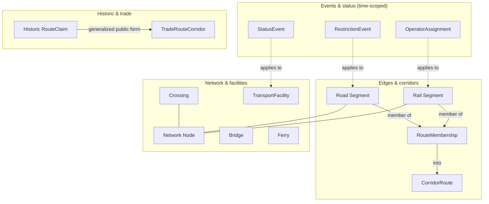

<!-- [KFM_META_BLOCK_V2]
doc_id: kfm://doc/roads-rail-trade-ubiquitous-language
title: Roads / Rail / Trade Routes — Ubiquitous Language
type: standard
version: v1
status: draft
owners: PLACEHOLDER-roads-rail-trade-domain-steward, PLACEHOLDER-docs-steward
created: 2026-06-07
updated: 2026-06-07
policy_label: public
related: [ai-build-operating-contract.md, directory-rules.md, DomainDriven_Design_Reference.pdf, docs/domains/roads-rail-trade/README.md, docs/domains/roads-rail-trade/SOURCES.md, contracts/domains/roads-rail-trade/, schemas/contracts/v1/domains/roads-rail-trade/]
tags: [kfm, roads-rail-trade, ubiquitous-language, ddd, glossary, bounded-context]
notes: [Doctrine-adjacent; CONTRACT_VERSION = "3.0.0" pinned. Bounded-context vocabulary for the Roads/Rail/Trade lane. Terms are CONFIRMED from Atlas v1.1 ch.13 §C; field realization is PROPOSED. CONFLICTED: dossier §B informal labels vs §C canonical compound forms — both preserved and mapped in §4.]
[/KFM_META_BLOCK_V2] -->

# 🛤️ Roads / Rail / Trade Routes — Ubiquitous Language

> The shared, authoritative vocabulary for the Roads / Rail / Trade Routes bounded context — every term used in this lane's contracts, schemas, code, tests, UI, and prose means exactly what this page says.

<!-- TODO: replace with real CI / glossary-lint endpoint once available -->

**Status:** `draft` · **Owners:** Roads/Rail/Trade domain steward + docs steward _(placeholders — verify)_ · **Updated:** 2026-06-07
**Pinned:** `CONTRACT_VERSION = "3.0.0"` (`ai-build-operating-contract.md`)

> [!IMPORTANT]
> A **ubiquitous language** is the vocabulary structured around the domain model and used by **all** team members within a bounded context, connecting every activity of the team with the software. Within this lane, a term here is the term everywhere — in `contracts/`, `schemas/`, connectors, validators, the governed API, the MapLibre UI, and review prose. Drift between this glossary and the code is a defect, not a style choice. *(CONFIRMED DDD doctrine — `[DDD]`; CONFIRMED KFM terminology-stability rule — `[ENCY] [DIRRULES]`)*

---

## Contents

1. [How to read this glossary](#1-how-to-read-this-glossary)
2. [Bounded context & ownership](#2-bounded-context--ownership)
3. [Cross-cutting terms (defined elsewhere)](#3-cross-cutting-terms-defined-elsewhere)
4. [Canonical term ↔ informal label map](#4-canonical-term--informal-label-map)
5. [Glossary — segments & corridors](#5-glossary--segments--corridors)
6. [Glossary — network & facilities](#6-glossary--network--facilities)
7. [Glossary — events & status](#7-glossary--events--status)
8. [Glossary — historic & trade-route terms](#8-glossary--historic--trade-route-terms)
9. [Term relationships](#9-term-relationships)
10. [Naming & casing rules](#10-naming--casing-rules)
11. [Open questions register](#11-open-questions-register)
12. [Open verification backlog](#12-open-verification-backlog)
13. [Changelog](#13-changelog-v0--v1)
14. [Definition of done](#14-definition-of-done)
15. [Related docs](#15-related-docs)

---

## 1. How to read this glossary

Each glossary entry carries:

- **Canonical name** — the exact casing/compound form used in code and contracts. Preserve it verbatim.
- **Definition** — what the term means *inside this bounded context*. The same English word may mean something different in another lane.
- **Source role note** — every Roads/Rail term's meaning is constrained by **source role, evidence, time, and release state**; a term names an *evidence-bearing object or released derivative*, not raw ground truth. *(CONFIRMED — `[DOM-ROADS] [ENCY]`)*
- **Status** — `CONFIRMED term` (named in Atlas v1.1 ch.13 §C / object-family spine) with `PROPOSED field realization` (field-level shape not yet verified against a mounted schema).

> [!NOTE]
> **Term, not implementation.** Every term below is a CONFIRMED part of the lane's vocabulary. The *fields, identity keys, and schema shapes* that realize each term are **PROPOSED** until verified against `schemas/contracts/v1/domains/roads-rail-trade/` in a mounted repo.

[↑ Back to top](#top)

---

## 2. Bounded context & ownership

CONFIRMED scope: this lane governs Kansas **roads, rail, historic routes, trade and mobility corridors, restrictions, facilities, graph projections**, and the catalog / proof / release objects derived from them. `[DOM-ROADS] [ENCY]`

**This context owns** (dossier §B): Road Segment · Historic Route · Rail Segment · Depot · Siding · Yard · Crossing · Bridge · Ferry · River Crossing · Freight Corridor · Route Event · Operator Status · Access Restriction · Network Edge · Movement Story Node. *(CONFIRMED / PROPOSED — `[DOM-ROADS]`)*

**This context explicitly does NOT own:**

| Concept | Owning lane | Roads/Rail relationship |
|---|---|---|
| Settlement & infrastructure canonical claims (depots, yards as assets) | Settlements / Infrastructure | cites via governed join |
| Water evidence (the river under a bridge/ford) | Hydrology | cites via governed join |
| Site / cultural truth & sensitivity | Archaeology / People / Land / Hazards | cites; defers to their sensitivity policy |

*(CONFIRMED non-ownership — `[DOM-ROADS]`)*

> [!CAUTION]
> A term defined here names the **transport** view of a thing. A `Depot` as a *settlement asset* belongs to Settlements; Roads/Rail references it. Do not redefine another lane's canonical object under a Roads/Rail name.

[↑ Back to top](#top)

---

## 3. Cross-cutting terms (defined elsewhere)

These appear constantly in this lane but are **owned by cross-cutting doctrine**, not redefined here. Use them exactly; follow the link for the authoritative definition.

| Term | Owning doctrine | One-line meaning in this lane |
|---|---|---|
| `SourceDescriptor` | source registry doctrine | The admission record (role, rights, sensitivity, cadence) for a Roads/Rail source. |
| `EvidenceRef` / `EvidenceBundle` | Evidence doctrine `[ENCY]` | The resolvable support behind any published Roads/Rail claim. |
| `source_role` (observed/regulatory/modeled/aggregate/administrative/candidate/synthetic) | §24.1 anti-collapse | Fixed at admission; constrains what every term below may assert. |
| `PolicyDecision` (ANSWER/ABSTAIN/DENY/ERROR) | Governed AI / policy `[GAI]` | The finite outcome when a Roads/Rail surface is queried. |
| `RedactionReceipt` / `ReviewRecord` | sensitivity doctrine | Required before sensitive corridor/facility geometry is published. |
| `ReleaseManifest` / `RollbackCard` | release doctrine | Anchor publication and reversibility of a Roads/Rail layer. |

*(CONFIRMED cross-cutting ownership — `[ENCY] [DIRRULES]`. See [`SOURCES.md`](./SOURCES.md) and [`SOURCE_REGISTRY.md`](./SOURCE_REGISTRY.md).)*

[↑ Back to top](#top)

---

## 4. Canonical term ↔ informal label map

> [!WARNING]
> **CONFLICTED (surfaced, not resolved).** The dossier's §B "owns" list uses informal labels; its §C ubiquitous-language table and the object-family spine use canonical compound forms. Both are CONFIRMED in the corpus. This table maps them; the **canonical compound form is preferred for code/contracts**. An ADR or drift-register entry should ratify one set. `[DOM-ROADS §B vs §C]`

| Informal label (§B) | Canonical compound form (§C / spine) | Preferred in code |
|---|---|---|
| Freight Corridor | `CorridorRoute` | `CorridorRoute` |
| Route Event | `RouteEvent` *(implied; see [OQ-RR-UL-02](#11-open-questions-register))* | NEEDS VERIFICATION |
| Operator Status | `OperatorAssignment` + `StatusEvent` | `OperatorAssignment` / `StatusEvent` |
| Access Restriction | `RestrictionEvent` | `RestrictionEvent` |
| Network Edge | `Road Segment` / `Rail Segment` (edges); `Network Node` (nodes) | segment + node forms |
| Historic Route | `Historic RouteClaim` | `Historic RouteClaim` |
| (trade corridor concept) | `TradeRouteCorridor` | `TradeRouteCorridor` |
| Movement Story Node | *(no §C canonical form found)* | NEEDS VERIFICATION `[OQ-RR-UL-03]` |
| Depot · Siding · Yard · River Crossing | *(named in §B; folded under `TransportFacility` / `Crossing` in §C spine)* | NEEDS VERIFICATION `[OQ-RR-UL-04]` |

[↑ Back to top](#top)

---

## 5. Glossary — segments & corridors

| Canonical name | Definition (this bounded context) | Status |
|---|---|---|
| **Road Segment** | A length of road as an evidence-bearing object or released derivative; meaning constrained by source role, evidence, time, and release state. A network **edge**. | CONFIRMED term / PROPOSED field |
| **Rail Segment** | A length of rail line as an evidence-bearing object or released derivative; a network **edge**. | CONFIRMED term / PROPOSED field |
| **CorridorRoute** | A named transport corridor (the canonical form of the dossier's "Freight Corridor"); an aggregation of segments under a corridor identity. | CONFIRMED term / PROPOSED field |
| **RouteMembership** | The relationship asserting that a segment belongs to a named route/corridor/designation, kept **distinct** from the segment's own geometry. | CONFIRMED term / PROPOSED field |

> [!IMPORTANT]
> **Membership ≠ designation.** `RouteMembership` records that a segment is *part of* a route; it does not by itself assert a legal designation (route number, functional class). Legal designation is a `regulatory`-role claim. Conflating them is the **route-membership / designation** collapse the lane's validators deny. `[DOM-ROADS §K]`

[↑ Back to top](#top)

---

## 6. Glossary — network & facilities

| Canonical name | Definition (this bounded context) | Status |
|---|---|---|
| **Network Node** | A node in the transport graph (junction, terminal, connection point); the **vertex** counterpart to segment **edges**. | CONFIRMED term / PROPOSED field |
| **Crossing** | A point where transport ways cross each other or another feature (rail/road crossing, grade crossing); river crossings cite Hydrology. | CONFIRMED term / PROPOSED field |
| **Bridge** | A structure carrying a way over an obstacle; the water beneath is Hydrology's evidence, the structure is Roads/Rail's. | CONFIRMED term / PROPOSED field |
| **Ferry** | A water-crossing transport service/point; historic ferries are often `candidate`/`administrative` until steward review. | CONFIRMED term / PROPOSED field |
| **TransportFacility** | A facility serving transport (depot, yard, siding, terminal); the canonical container under which §B's Depot/Siding/Yard fold. Condition detail may be T2/T4 sensitive. | CONFIRMED term / PROPOSED field |

> [!CAUTION]
> Per the source registry, a **`TransportFacility` roster is `administrative`** — it must never be cited as an *observed event timeline*. Facility condition/vulnerability detail routes through steward review before any precise-geometry public release. `[ENCY §24.1.2] [DOM-ROADS §I]`

[↑ Back to top](#top)

---

## 7. Glossary — events & status

These types exist precisely to keep **events** distinct from **base geometry** — the guardrail against the *administrative-compilation-as-observation* collapse.

| Canonical name | Definition (this bounded context) | Status |
|---|---|---|
| **RestrictionEvent** | A time-scoped restriction on a way (weight/height/seasonal/closure); the canonical form of "Access Restriction". Posted restrictions are `regulatory`. | CONFIRMED term / PROPOSED field |
| **StatusEvent** | A time-scoped change in operational status (open/closed/under-construction) on a segment, facility, or crossing. | CONFIRMED term / PROPOSED field |
| **OperatorAssignment** | A time-scoped assertion of which operator runs/owns a segment, facility, or service (e.g., a railroad's operating rights). | CONFIRMED term / PROPOSED field |

> [!IMPORTANT]
> Events carry their own **temporal scope** (source / observed / valid / retrieval / release / correction times stay distinct where material) and their own source role. A `RestrictionEvent` derived from a posted order is `regulatory`; one derived from a field observation is `observed`. The base `Road Segment` geometry (often `administrative`) is **not** the event. `[DOM-ROADS] [§24.1.2]`

[↑ Back to top](#top)

---

## 8. Glossary — historic & trade-route terms

| Canonical name | Definition (this bounded context) | Status |
|---|---|---|
| **Historic RouteClaim** | A claimed historic route alignment (Santa Fe Trail, Pony Express, military/mail/stage routes); admitted as `candidate`, `modeled`, or `synthetic` — never `observed` of present-day condition. Default to steward review + generalized public geometry. | CONFIRMED term / PROPOSED field |
| **TradeRouteCorridor** | A trade/mobility corridor as a generalized public-safe representation; the public form for uncertain historic alignments. | CONFIRMED term / PROPOSED field |

> [!CAUTION]
> **Indigenous trade and mobility corridors**, oral history, treaty, cultural, and interpretive evidence **default to steward review and generalized public geometry**, routed through CARE / sovereignty review. Historic alignments are published with an **uncertainty surface** at generalized precision — never at false precision (the *historic over-precision* denial). `[DOM-ROADS §I, §K] [ENCY]`

[↑ Back to top](#top)

---

## 9. Term relationships

CONFIRMED term set (Atlas v1.1 ch.13 §C / object-family spine); edge labels are INFERRED relationships and PROPOSED until contract-verified.

[↑ Back to top](#top)

---

## 10. Naming & casing rules

- **Preserve canonical compound forms verbatim** — `CorridorRoute`, `RouteMembership`, `RestrictionEvent`, `StatusEvent`, `OperatorAssignment`, `TransportFacility`, `Network Node`, `Historic RouteClaim`, `TradeRouteCorridor`. Do not silently generalize into industry terms. *(CONFIRMED terminology-stability rule — `[ENCY] [DIRRULES]`)*
- **Prefer the §C canonical form over the §B informal label** in code, contracts, and schemas; use the [map in §4](#4-canonical-term--informal-label-map) to translate.
- **One word, one meaning** within this context; if the same English word is needed for a different concept, qualify it or define a distinct term.
- **Events are nouns of record** (`RestrictionEvent`, not "restrict"); they carry temporal scope and source role.

> [!TIP]
> When you introduce a new term in a contract or schema for this lane, add it here in the same PR. A term that exists in code but not in this glossary is drift; log it in `docs/registers/DRIFT_REGISTER.md`.

[↑ Back to top](#top)

---

## 11. Open questions register

| ID | Question | Owner role | Resolution path |
|---|---|---|---|
| OQ-RR-UL-01 | Ratify the §B-informal vs §C-canonical term set as the single vocabulary. | Domain steward | ADR or `DRIFT_REGISTER.md` entry; update §4 |
| OQ-RR-UL-02 | Is `RouteEvent` a distinct canonical type, or is "Route Event" subsumed by `StatusEvent` / `RestrictionEvent`? | Domain steward | Contract inspection `contracts/domains/roads-rail-trade/` |
| OQ-RR-UL-03 | Does `Movement Story Node` have a canonical compound form / schema home? | Domain steward + docs steward | UI/story-node contract inspection |
| OQ-RR-UL-04 | Are Depot / Siding / Yard / River Crossing distinct types or `TransportFacility` / `Crossing` subtypes? | Domain steward | Contract + schema inspection |

## 12. Open verification backlog

These remain `NEEDS VERIFICATION` before promotion from `draft` to `published`:

1. Field-level realization of every term against `schemas/contracts/v1/domains/roads-rail-trade/`.
2. Semantic definitions against `contracts/domains/roads-rail-trade/` (this glossary should mirror, not invent).
3. The term-relationship edges in §9 against actual contract associations.
4. Resolution of the §B/§C term-set conflict (OQ-RR-UL-01).

## 13. Changelog v0 → v1

| Change | Type (per contract §37) | Reason |
|---|---|---|
| Initial creation of lane ubiquitous-language glossary | new | No prior UBIQUITOUS_LANGUAGE.md evidenced |
| Terms seeded from Atlas v1.1 ch.13 §C + object-family spine | gap closure | Consolidate scattered term definitions |
| §B-informal ↔ §C-canonical map added | reconciliation | Surface CONFLICTED term-set divergence |
| Cross-cutting terms separated from lane-owned terms | clarification | Avoid redefining cross-cutting doctrine |

> **Backward compatibility.** New file; no prior anchors. Term anchors (`#5-glossary--segments--corridors`, etc.) introduced here and SHOULD be kept stable; contracts/schemas may link to them.

## 14. Definition of done

This document is done enough to enter the repository when:

- it is placed at `docs/domains/roads-rail-trade/UBIQUITOUS_LANGUAGE.md` per Directory Rules §12;
- a domain steward **and** docs steward review it;
- it mirrors (does not contradict) `contracts/domains/roads-rail-trade/`;
- the §B/§C term-set conflict (OQ-RR-UL-01) is ratified or logged in `docs/registers/DRIFT_REGISTER.md`;
- it is linked from the lane `README.md` and the lane contracts;
- the `GENERATED_RECEIPT.json` planned in Notes is wired into CI;
- future changes follow the operating contract's §37 lifecycle.

[↑ Back to top](#top)

---

## 15. Related docs

- [`docs/domains/roads-rail-trade/README.md`](./README.md) *(PROPOSED neighbor — verify)*
- [`docs/domains/roads-rail-trade/SOURCES.md`](./SOURCES.md) — lane Source Ledger
- [`docs/domains/roads-rail-trade/SOURCE_REGISTRY.md`](./SOURCE_REGISTRY.md) — source admission doctrine
- `contracts/domains/roads-rail-trade/` — object-meaning home this glossary mirrors *(PROPOSED)*
- `schemas/contracts/v1/domains/roads-rail-trade/` — field-shape home *(PROPOSED)*
- [`directory-rules.md`](../../../directory-rules.md) — Domain Placement Law §12
- [`ai-build-operating-contract.md`](../../../ai-build-operating-contract.md) — operating law; `CONTRACT_VERSION = "3.0.0"`
- `DomainDriven_Design_Reference.pdf` — ubiquitous-language pattern `[DDD]`

---

*Last updated: 2026-06-07 · Doc version: v1 (draft) · `CONTRACT_VERSION = "3.0.0"`*

[↑ Back to top](#top)
