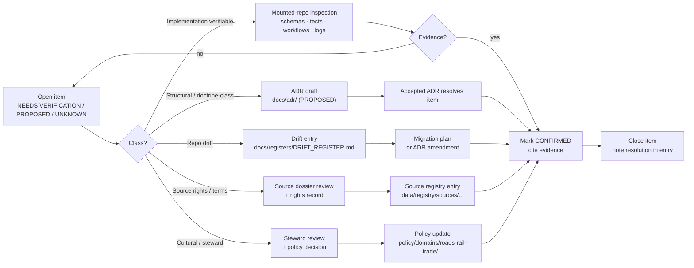

<!-- [KFM_META_BLOCK_V2]
doc_id: kfm://doc/roads-rail-trade-verification-backlog
title: Roads, Rail, and Trade Routes — Verification Backlog
type: register
version: v0.2
status: draft
owners: PLACEHOLDER-roads-rail-trade-domain-steward, PLACEHOLDER-docs-steward
created: 2026-05-19
updated: 2026-06-07
policy_label: public
related: [ai-build-operating-contract.md, directory-rules.md, docs/registers/VERIFICATION_BACKLOG.md, docs/registers/DRIFT_REGISTER.md, docs/adr/, docs/domains/roads-rail-trade/README.md, docs/domains/roads-rail-trade/SOURCES.md, docs/domains/roads-rail-trade/SOURCE_REGISTRY.md, docs/domains/roads-rail-trade/UBIQUITOUS_LANGUAGE.md]
tags: [kfm, register, roads-rail-trade, verification, governance]
notes: [Domain-scoped sub-register; CONTRACT_VERSION = "3.0.0" pinned. Roll-ups, cross-domain triage, and ADR-class questions flow to the repo-wide register and the Master Open-ADR Backlog. CONFLICTED: source-role enum — §D informal labels (authority/observation/context/model) vs canonical §24.1/ADR-S-04 seven roles; reconciled in §1 and §8. All implementation paths, route names, and schema homes remain PROPOSED until verified against mounted-repo evidence.]
[/KFM_META_BLOCK_V2] -->

# 🛤️ Roads, Rail, and Trade Routes — Verification Backlog

> Domain-scoped register of items that must be verified, decided, or implemented before Roads / Rail / Trade Routes claims, contracts, validators, APIs, and UI surfaces may be treated as repository fact.

| Field | Value (PROPOSED unless noted) |
|---|---|
| **Status** | `draft` — populated from Atlas Ch. 13.N + Ch. 24.12 |
| **Owners** | Domain steward · docs steward *(assign before review)* |
| **Last updated** | `2026-06-07` |
| **Source of authority** | Atlas v1.0 Ch. 13.N · Atlas v1.1 Ch. 24.12 · Directory Rules §12, §18 |
| **Rolls up to** | `docs/registers/VERIFICATION_BACKLOG.md` *(PROPOSED)* |
| **ADR home** | `docs/adr/` *(path PROPOSED)* |
| **Pinned** | `CONTRACT_VERSION = "3.0.0"` |

---

## Table of contents

- [Purpose and scope](#purpose-and-scope)
- [How to read this backlog](#how-to-read-this-backlog)
- [Verification lifecycle](#verification-lifecycle)
- [1. Source rights, terms, and freshness](#1-source-rights-terms-and-freshness)
- [2. Sensitivity, rights, and cultural-corridor policy](#2-sensitivity-rights-and-cultural-corridor-policy)
- [3. Identity, contract, and schema surfaces](#3-identity-contract-and-schema-surfaces)
- [4. Pipeline lane application (RAW → PUBLISHED)](#4-pipeline-lane-application-raw--published)
- [5. Validators, tests, and fixtures](#5-validators-tests-and-fixtures)
- [6. Governed API and Evidence Drawer surfaces](#6-governed-api-and-evidence-drawer-surfaces)
- [7. Cross-lane integration and viewing products](#7-cross-lane-integration-and-viewing-products)
- [8. ADR-class items (cross-reference)](#8-adr-class-items-cross-reference)
- [9. Open questions register](#9-open-questions-register)
- [Resolution workflow](#resolution-workflow)
- [Changelog](#changelog-v01--v02)
- [Definition of done](#definition-of-done)
- [Related docs](#related-docs)

---

## Purpose and scope

This file is the **domain-scoped verification backlog** for the Roads / Rail / Trade Routes lane. It enumerates the open items — sources, policies, schemas, validators, API and UI surfaces, and cross-lane couplings — that must be grounded in mounted-repo evidence, an accepted ADR, or a release artifact before any claim about the lane may be treated as repository fact.

**In scope**

- Items extracted from **Atlas v1.0 Ch. 13.N** (verification backlog and open questions).
- Implementation-layer items implied by **Ch. 13.D / E / H / J / K** (source families, object identity, pipeline lane, API surfaces, validators).
- ADR-class items from **Atlas v1.1 Ch. 24.12** (Master Open-ADR Backlog) that touch this lane.
- Domain-scoped open questions surfaced during authoring.

**Out of scope**

- Cross-domain or repo-wide questions → `docs/registers/VERIFICATION_BACKLOG.md` *(PROPOSED)* and the Master Open-ADR Backlog.
- Drift between the mounted repo and Directory Rules → `docs/registers/DRIFT_REGISTER.md` *(PROPOSED)* per Directory Rules §2.5.
- Settlements/Infrastructure, Hydrology, Archaeology, Hazards, and People/Land truth — owned by their respective lanes per Ch. 13.B.

> [!IMPORTANT]
> **Domain Placement Law (Directory Rules §12).** Roads / Rail / Trade Routes is a **lane inside responsibility roots**, not a root folder. Doctrine, dossiers, runbooks, and registers (including this one) belong under `docs/domains/roads-rail-trade/`. Schemas live under `schemas/contracts/v1/domains/roads-rail-trade/`. Data lives under `data/<phase>/roads-rail-trade/`. No path is **CONFIRMED** here until mounted-repo inspection has been performed.

[↑ Back to top](#top)

---

## How to read this backlog

Each entry carries a truth label, the evidence that would settle it, an owning surface (where the resolution will live), and a status.

| Label | Meaning |
|---|---|
| **CONFIRMED** | Verified in this session from attached docs, workspace evidence, tests, logs, or generated artifacts. |
| **PROPOSED** | Design, path, placement, or recommendation not yet verified in implementation. |
| **NEEDS VERIFICATION** | Checkable; not yet checked strongly enough to act as fact. |
| **UNKNOWN** | Not resolvable without more evidence. |
| **CONFLICTED** | Sources disagree; surfaced and flagged until an ADR or drift entry resolves it. |
| **ADR-class** | Resolution requires an accepted ADR per Directory Rules §2.4 before treatment as canonical. |

> [!NOTE]
> **Memory is not evidence.** Recollection, guessed paths, likely behavior, and generic best practice do not satisfy any verification item in this register. A doctrine quote alone is not enough to flip an implementation item to **CONFIRMED** — the implementation surface must be inspectable.

> [!CAUTION]
> **Source-role vocabulary is CONFLICTED in the corpus.** Atlas Ch. 13.D uses informal role labels (*authority / observation / context / model*). The canonical KFM source-role vocabulary (Atlas §24.1; ADR-S-04) is the **seven roles**: `observed | regulatory | modeled | aggregate | administrative | candidate | synthetic`. This register uses the **canonical seven-role** vocabulary and maps the §D labels to it; ADR-S-04 ratifies the canonical set. See [§8](#8-adr-class-items-cross-reference) and the lane's [`UBIQUITOUS_LANGUAGE.md`](./UBIQUITOUS_LANGUAGE.md) §4.

[↑ Back to top](#top)

---

## Verification lifecycle

*Diagram is doctrine-shaped, not implementation-shaped: each downstream artifact path (`docs/adr/`, `policy/domains/roads-rail-trade/`, `data/registry/sources/roads-rail-trade/`) is **PROPOSED** under Directory Rules §12 and **NEEDS VERIFICATION** against mounted-repo evidence.*

[↑ Back to top](#top)

---

## 1. Source rights, terms, and freshness

Atlas v1.0 Ch. 13.D names the source families. Their roles and freshness postures are doctrine; their **current rights, terms, and endpoint behaviour** are NEEDS VERIFICATION.

> [!CAUTION]
> Until a source's rights and terms are recorded in a current source-registry entry, that source may not be promoted past **WORK / QUARANTINE**. Sensitive joins fail closed by default. *(See the lane [`SOURCE_REGISTRY.md`](./SOURCE_REGISTRY.md) for admission doctrine and [`SOURCES.md`](./SOURCES.md) for the ledger.)*

| ID | Source family | What to verify | Evidence that would settle it | Status |
|---|---|---|---|---|
| `RR-VB-01` | Census TIGER/Line roads | Current rights, terms, vintage cadence, redistribution posture | Source dossier + registry entry under `data/registry/sources/...` | NEEDS VERIFICATION |
| `RR-VB-02` | FHWA HPMS | Current rights, terms, version, KDOT-relayed posture | Source dossier + registry entry | NEEDS VERIFICATION |
| `RR-VB-03` | FHWA National Highway Freight Network | Current rights, terms, designation update cadence | Source dossier + registry entry | NEEDS VERIFICATION |
| `RR-VB-04` | WZDx feeds | v4.x conformance, feed quality, rate limits, debounce window | Feed-quality dashboard + validator output (`KFM-P8-PROG-0025`) | NEEDS VERIFICATION |
| `RR-VB-05` | KDOT / KanPlan / KanDrive / Kansas GIS | Authority API stability, harvest cadence, terms | Source dossier + registry entry | NEEDS VERIFICATION |
| `RR-VB-06` | County / state bridge and restriction data | Per-county rights, restriction-data sensitivity tier | Source dossier + per-county notes | NEEDS VERIFICATION |
| `RR-VB-07` | GNIS names | Current export terms; legal-status denial posture for OSM/GNIS-joined records | Source dossier + denial-test fixture | NEEDS VERIFICATION |
| `RR-VB-08` | OpenStreetMap | ODbL attribution, redistribution constraints, source-role pinned to `candidate`/context | Source dossier + role enum (see `RR-VB-23`) | NEEDS VERIFICATION |

<strong>Why these are NEEDS VERIFICATION (Atlas v1.0 Ch. 13.D)</strong>

The Atlas records each of these source families with the same posture: *role requires rights and current terms NEEDS VERIFICATION; sensitive joins fail closed; source-vintage or cadence specific.* That posture remains unresolved until each source has a current registry entry documenting its role, rights, freshness, and sensitivity rules. Until then, the source is admissible only via **RAW** capture with full provenance, and is held at the **WORK / QUARANTINE** gate.

[↑ Back to top](#top)

---

## 2. Sensitivity, rights, and cultural-corridor policy

Atlas v1.0 Ch. 13.I records the cultural / Indigenous default posture; the Ch. 13.N item *"Verify Indigenous/cultural corridor policy"* is the parent verification.

| ID | Item | Evidence that would settle it | Status |
|---|---|---|---|
| `RR-VB-09` | **Indigenous trade and mobility corridor policy.** Steward review and generalized public geometry must be enforced. | Policy file under `policy/domains/roads-rail-trade/...` *(PROPOSED)*, OPA tests, denial fixtures, steward review record | NEEDS VERIFICATION |
| `RR-VB-10` | **Critical transport facility review.** Bridges, depots, yards, sidings flagged critical require review. | Sensitivity-tier mapping (ADR-S-05) + per-facility steward record | NEEDS VERIFICATION |
| `RR-VB-11` | **Historic over-precision denial.** Historic alignments must not publish coords beyond evidentiary support. | `tests/domains/roads-rail-trade/...` denial fixtures *(PROPOSED)*; generalization receipt schema | NEEDS VERIFICATION |
| `RR-VB-12` | **Public generalization receipt.** Every public-safe transform emits a Redaction / Generalization receipt. | Receipt schema + emitted receipt fixture + policy tie-in | NEEDS VERIFICATION |
| `RR-VB-13` | **OSM / GNIS legal-status denial.** OSM-/GNIS-asserted legal status must not pass the trust membrane. | Denial-fixture test + role-enum constraint (see `RR-VB-23`) | NEEDS VERIFICATION |

> [!WARNING]
> **Default-deny stands until policy is verified.** Per Directory Rules §3 and Atlas Ch. 13.I, unclear rights, unresolved source role, missing evidence, unresolved sensitivity, or absent release state **blocks public promotion.** A `NEEDS VERIFICATION` status on any item in this section is, in effect, a denial.

[↑ Back to top](#top)

---

## 3. Identity, contract, and schema surfaces

Atlas v1.0 Ch. 13.E states the proposed deterministic identity basis (source id + object role + temporal scope + normalized digest); Ch. 13.J points the schema home at `schemas/contracts/v1/` and notes the exact route names are UNKNOWN.

| ID | Item | Evidence that would settle it | Status |
|---|---|---|---|
| `RR-VB-14` | **Schema home for roads-rail-trade contracts** — `schemas/contracts/v1/domains/roads-rail-trade/` per §12. | Mounted-repo presence + ADR-0001 confirmation (**ADR-S-01**) | PROPOSED |
| `RR-VB-15` | **Object identity rule** — deterministic identity for Road / Rail Segment, Crossing, Bridge, Ferry, etc. | Schema with `identity` constraint + test covering source-id × role × temporal × digest | PROPOSED |
| `RR-VB-16` | **Temporal field model** — distinct source / observed / valid / retrieval / release / correction times. | Schema with separate temporal fields + validator | CONFIRMED doctrine / PROPOSED implementation |
| `RR-VB-17` | **`RouteUncertaintyProfile` design + implementation** — Atlas Ch. 13.N explicit item. | Contract under `contracts/domains/roads-rail-trade/...` + schema + tests covering historic-route uncertainty | NEEDS VERIFICATION |
| `RR-VB-18` | **Route membership ≠ designation** — a road may belong to multiple corridors without inheriting designation. | Schema separation + dedicated test (Ch. 13.K bullet 1) | PROPOSED |
| `RR-VB-19` | **`RoadsRailDecisionEnvelope` shape** — finite outcomes ANSWER / ABSTAIN / DENY / ERROR. | DTO under `contracts/` + schema + governed-API contract test | PROPOSED |

> [!NOTE]
> Term definitions for these objects are the lane's [`UBIQUITOUS_LANGUAGE.md`](./UBIQUITOUS_LANGUAGE.md); this register tracks their *implementation*, the glossary tracks their *meaning*.

[↑ Back to top](#top)

---

## 4. Pipeline lane application (RAW → PUBLISHED)

Atlas v1.0 Ch. 13.H confirms the doctrinal lane shape and marks **every** lane stage **PROPOSED** for this domain. The verification: does each gate exist, and does it actually enforce its stated invariant?

| ID | Stage | Gate to verify | Evidence that would settle it | Status |
|---|---|---|---|---|
| `RR-VB-20` | RAW | `SourceDescriptor` exists with role / rights / sensitivity / citation / time / hash. | Schema + fixture + connector emission | PROPOSED |
| `RR-VB-21` | WORK / QUARANTINE | Schema, geometry, time, identity, evidence, rights, policy normalization; failures held. | Pipeline-spec + quarantine-reason fixture | PROPOSED |
| `RR-VB-22` | PROCESSED | `EvidenceRef`, `ValidationReport`, and digest closure exist. | Emitted artifact fixture + validator output | PROPOSED |
| `RR-VB-23` | CATALOG / TRIPLET | Catalog records, `EvidenceBundle`s, graph/triplet projections, release candidates. | Catalog fixture + bundle reference verifier output | PROPOSED |
| `RR-VB-24` | PUBLISHED | `ReleaseManifest`, correction path, rollback target, review/policy state. | Release artifact under `release/...` + rollback drill record | PROPOSED |
| `RR-VB-25` | **Promotion is a governed state transition, not a file move.** No connector or watcher publishes. | OPA / promotion-controller test fixture | PROPOSED |

[↑ Back to top](#top)

---

## 5. Validators, tests, and fixtures

Atlas v1.0 Ch. 13.K enumerates six **PROPOSED** validator surfaces. Each must be authored, fixtured, and wired into the canonical `tools/validators/validate_all.py` entrypoint *(OPEN-DR-03, Directory Rules §18.b)*.

| ID | Validator / test | What it must prove | Evidence that would settle it | Status |
|---|---|---|---|---|
| `RR-VB-26` | Route membership / designation separation | A `RouteMembership` carries no designation-authority field. | Test under `tests/domains/roads-rail-trade/...` + invalid-input fixture | PROPOSED |
| `RR-VB-27` | Operator / status temporal test | `OperatorAssignment` and `StatusEvent` keep valid-time distinct from observed/retrieval. | Temporal-conformance test + fixture | PROPOSED |
| `RR-VB-28` | OSM / GNIS legal-status denial | Records sourced from OSM/GNIS cannot assert a `regulatory`-role legal status. | Denial-fixture test (paired with `RR-VB-13`) | PROPOSED |
| `RR-VB-29` | Historic over-precision denial | Historic alignment with thin support cannot publish high-precision geometry. | Denial-fixture test (paired with `RR-VB-11`) | PROPOSED |
| `RR-VB-30` | Public generalization receipt test | Every public geometry transform emits a generalization receipt; absent receipt → DENY. | Receipt-emission test + schema (paired with `RR-VB-12`) | PROPOSED |
| `RR-VB-31` | Transport graph projection rollback | Rolling back a graph projection restores upstream catalog state without orphan edges. | Rollback drill test + fixture | PROPOSED |

> [!TIP]
> Validators should be invoked through the single canonical entrypoint (`tools/validators/validate_all.py` — PROPOSED, card `KFM-P5-PROG-0009`). CI workflows calling individual validators directly should be migrated, per Directory Rules §18.b OPEN-DR-03 (ADR-class pending).

[↑ Back to top](#top)

---

## 6. Governed API and Evidence Drawer surfaces

Atlas v1.0 Ch. 13.J describes four PROPOSED API surfaces; **the exact route names are UNKNOWN.** Naming, parameter shape, and trust-membrane placement all need verification.

| ID | Surface | What to verify | Status |
|---|---|---|---|
| `RR-VB-32` | Roads/Rail feature/detail resolver | Route name, DTO (`RoadsRailDecisionEnvelope`), finite outcomes, EvidenceBundle attachment. | PROPOSED |
| `RR-VB-33` | Roads/Rail layer manifest resolver | Route name, public-safe `LayerManifest`, denial path for sensitive layers. | PROPOSED |
| `RR-VB-34` | Roads/Rail Evidence Drawer payload | `EvidenceDrawerPayload` shape, policy filtering, redaction-receipt linkage. | PROPOSED |
| `RR-VB-35` | Roads/Rail Focus Mode answer | Runtime Response Envelope + `AIReceipt`; ABSTAIN/DENY behavior; AI never root truth. | PROPOSED |
| `RR-VB-36` | **Trust-membrane placement.** Public clients consume only governed APIs. | `apps/explorer-web/` and any other consumer reads through `apps/governed-api/`, never canonical stores. | NEEDS VERIFICATION |

[↑ Back to top](#top)

---

## 7. Cross-lane integration and viewing products

Atlas v1.0 Ch. 13.F lists four cross-lane couplings; Ch. 13.N item *"Verify transport graph and MapLibre integration"* is the parent verification.

| ID | Coupling / surface | What to verify | Status |
|---|---|---|---|
| `RR-VB-37` | Roads/Rail ↔ Settlements/Infrastructure (depots, crossings, facilities, dependencies) | Ownership preserved; facility identity stays settlement-owned; cross-lane join policy (ADR-S-14). | PROPOSED |
| `RR-VB-38` | Roads/Rail ↔ Hydrology (bridge / ferry / ford / river crossing) | Source-role and sensitivity preserved across the join; bundle support intact. | PROPOSED |
| `RR-VB-39` | Roads/Rail ↔ Hazards (closure, detour, flood/fire/smoke exposure) | Hazard context cited, never authored by this lane; KFM is never an alert authority. | PROPOSED |
| `RR-VB-40` | Roads/Rail ↔ Archaeology / Cultural Heritage (historic routes, Indigenous corridors, forts, missions) | Exact archaeological coordinates denied; corridor reconstructions cited as context only. | PROPOSED |
| `RR-VB-41` | **Transport graph projection.** Derived graph never replaces canonical records; graph-derived label visible. | Graph projection contract + viewer label + rollback drill (`RR-VB-31`). | NEEDS VERIFICATION |
| `RR-VB-42` | **MapLibre integration.** Modern roads, rail alignment, facility/crossing, restriction timeline, freight corridor, historic claim, generalized trade corridor, derived graph view. | Layer manifests, style tokens, time-aware state, trust-badge wiring, sensitivity-redacted view, Focus Mode hooks. | NEEDS VERIFICATION |

[↑ Back to top](#top)

---

## 8. ADR-class items (cross-reference)

Per Directory Rules §2.4, some questions cannot be resolved by routine PR — they require an accepted ADR before the affected path, schema, policy, or release surface may be treated as canonical. Atlas v1.1 Ch. 24.12 maintains the Master Open-ADR Backlog (**ADR-S-01 … ADR-S-15**). The entries below touch Roads / Rail / Trade Routes.

| ADR-S | Question | Why ADR-class | Touches in this register |
|---|---|---|---|
| **ADR-S-01** | Confirm / amend ADR-0001 — canonical schema home `schemas/contracts/v1/…` | Schema home is ADR-required (DR §2.4(3)). | `RR-VB-14`, `RR-VB-15`, `RR-VB-17` |
| **ADR-S-04** | Source-role enum vocabulary v1 — canonical seven roles `observed \| regulatory \| modeled \| aggregate \| administrative \| candidate \| synthetic` (vs Ch. 13.D informal `authority / observation / context / model`). | Source-role anti-collapse is doctrine-significant; the §D/§24.1 divergence is **CONFLICTED** and must be ratified. | `RR-VB-01..08`, `RR-VB-13`, `RR-VB-28` |
| **ADR-S-05** | Sensitivity tier scheme T0–T4 — adopt or revise | Tier scheme governs public release directly. | `RR-VB-09`, `RR-VB-10` |
| **ADR-S-10** | Stale-state propagation across lanes | Cross-lane staleness is a correction-path question. | `RR-VB-37..40` |
| **ADR-S-12** | Connector cadence and quarantine recovery policy | Governs RAW admission cadence. | `RR-VB-04`, `RR-VB-20`, `RR-VB-21` |
| **ADR-S-14** | Cross-lane join policy — which joins require steward review, which are denied, which open | Cross-lane joins are inference-risk multipliers. | `RR-VB-37..40` |

ADR drafts for this lane SHOULD land under `docs/adr/` *(path PROPOSED)* and cross-reference this register by item ID.

[↑ Back to top](#top)

---

## 9. Open questions register

Open questions that are **not yet** ADR-class but require steward decision before the corresponding verification items above can advance.

- **OPEN-RR-01 — Domain folder name.** Directory Rules §12 lists `roads-rail-trade` as the canonical lane segment; the Atlas chapter title is *"Roads, Rail, and Trade Routes."* Per OPEN-DR-04 (§18.b), KFM-coined topical paths use lowercase-hyphen folders and `UPPERCASE_WITH_UNDERSCORES` filenames. **Recommendation:** keep `docs/domains/roads-rail-trade/`. *Status: PROPOSED.*
- **OPEN-RR-02 — Runbook subfolder vs flat.** Per OPEN-DR-02 (§18.b), Pattern A (subfolder) is recommended. **Recommendation:** `docs/runbooks/roads-rail-trade/<TOPIC>_RUNBOOK.md` *(paths PROPOSED)*. *Status: PROPOSED.*
- **OPEN-RR-03 — `RouteUncertaintyProfile` placement.** Whether the contract lives at `contracts/domains/roads-rail-trade/route_uncertainty_profile.md` with shape at `schemas/contracts/v1/domains/roads-rail-trade/route_uncertainty_profile.schema.json` *(both PROPOSED)*, or whether uncertainty modeling generalizes to a cross-lane contract. *Status: NEEDS VERIFICATION; possibly ADR-class.*
- **OPEN-RR-04 — Movement Story Node home.** Atlas Ch. 13.B lists *Movement Story Node* among owned objects; whether it is a Roads/Rail contract or a cross-lane narrative object remains unsettled. Tracked jointly with `UBIQUITOUS_LANGUAGE.md` OQ-RR-UL-03. *Status: UNKNOWN.*
- **OPEN-RR-05 — WZDx v4.x conformance reporting.** Card `KFM-P8-PROG-0025` proposes a single fail-closed WZDx validator emitting GeoParquet + PMTiles. How that validator's report surfaces in the domain dashboard (Atlas Ch. 24.11) is unsettled. *Status: PROPOSED.*

[↑ Back to top](#top)

---

## Resolution workflow

> [!NOTE]
> A backlog item is **closed** by evidence, not by argument. Closing an item requires a citable artifact — schema file, test, workflow, manifest, release record, ADR, or steward review record — not a doctrine quote.

1. **Pick an item** by ID (e.g. `RR-VB-17`).
2. **Classify** — implementation-verifiable, ADR-class, source-rights, cultural, or drift?
3. **Gather evidence** in doctrine order: attached docs → mounted-repo evidence → authoritative external sources (rights / standards only).
4. **Resolve:**
   - *Implementation* → mounted-repo inspection; cite file path, schema, or test.
   - *ADR-class* → draft ADR under `docs/adr/` *(PROPOSED)*; advance to `accepted` per Directory Rules §2.4.
   - *Drift* → open an entry under `docs/registers/DRIFT_REGISTER.md` *(PROPOSED)* per §2.5.
   - *Source rights* → land a source-registry entry under `data/registry/sources/roads-rail-trade/` *(PROPOSED)*.
   - *Cultural / steward* → land a steward review record and update `policy/domains/roads-rail-trade/` *(PROPOSED)*.
5. **Close** — update this register: status → **CONFIRMED**, cite the artifact, keep the closed entry visible in a `
` block for audit.
6. **Roll up** — mirror the change to `docs/registers/VERIFICATION_BACKLOG.md` *(PROPOSED)* if cross-cutting.

[↑ Back to top](#top)

---

## Changelog v0.1 → v0.2

| Change | Type (per contract §37) | Reason |
|---|---|---|
| Source-role enum reconciled to canonical seven roles (§24.1 / ADR-S-04); §D labels mapped | reconciliation | §D informal vs §24.1 canonical divergence is CONFLICTED; canonical set governs |
| Added CONFLICTED label to legend + a `[!CAUTION]` source-role note | clarification | Make the role-vocabulary conflict visible at point of use |
| `RR-VB-08`, `RR-VB-28` updated to reference `candidate` / `regulatory` canonical roles | reconciliation | Align with seven-role vocabulary |
| Cross-links added to lane siblings (`SOURCES.md`, `SOURCE_REGISTRY.md`, `UBIQUITOUS_LANGUAGE.md`) | housekeeping | Several items now have an authoring home to point at |
| Added Changelog + Definition of done; quoted Mermaid special-char labels; removed duplicate ASCII workflow diagram | housekeeping | Doctrine-register completeness + render safety |
| `related` paths reconciled (`directory-rules.md` at repo root) | housekeeping | Project files place it at root, not `docs/doctrine/` |

> **Backward compatibility.** Back-to-top anchor changed from `#table-of-contents` to `#top`. Item IDs (`RR-VB-NN`, `OPEN-RR-NN`) and section anchors are unchanged. Inbound links targeting `#table-of-contents` need updating.

## Definition of done

This register is healthy enough to enter the repository when:

- it is placed at `docs/domains/roads-rail-trade/VERIFICATION_BACKLOG.md` per Directory Rules §12;
- a domain steward **and** docs steward review it and assign owners;
- it rolls up to `docs/registers/VERIFICATION_BACKLOG.md` and cross-references the Master Open-ADR Backlog;
- the source-role conflict (ADR-S-04) is ratified or logged in `docs/registers/DRIFT_REGISTER.md`;
- it is linked from the lane `README.md`;
- the `GENERATED_RECEIPT.json` planned in Notes is wired into CI;
- closed items are retained in `
` for audit; future changes follow §37.

[↑ Back to top](#top)

---

## Related docs

> [!NOTE]
> The links below resolve **only after** the corresponding artifacts are authored under the paths Directory Rules §12 lays out for a domain lane. Each unauthored link is a verification candidate in its own right.

- **Doctrinal source** — Atlas v1.0 Ch. 13 *(Roads, Rail, and Trade Routes)*; local copy `Kansas_Frontier_Matrix_-_Domains_v1_1___Pass_23_32_Consolidated_Atlas.md`.
- **Open-ADR backlog (roll-up)** — Atlas v1.1 Ch. 24.12.
- **Placement authority** — [`directory-rules.md`](../../../directory-rules.md), §12 (Domain Placement Law), §18 (Open questions).
- **Operating law** — [`ai-build-operating-contract.md`](../../../ai-build-operating-contract.md); `CONTRACT_VERSION = "3.0.0"`.
- **Lane siblings** — [`SOURCES.md`](./SOURCES.md) · [`SOURCE_REGISTRY.md`](./SOURCE_REGISTRY.md) · [`UBIQUITOUS_LANGUAGE.md`](./UBIQUITOUS_LANGUAGE.md).
- **Repo-wide register (roll-up target)** — `docs/registers/VERIFICATION_BACKLOG.md` *(PROPOSED)*.
- **Drift register** — `docs/registers/DRIFT_REGISTER.md` *(PROPOSED)*.
- **ADR home** — `docs/adr/` *(PROPOSED)*.
- **Domain README** — `docs/domains/roads-rail-trade/README.md` *(PROPOSED — TODO)*.
- **Domain runbooks** — `docs/runbooks/roads-rail-trade/` *(PROPOSED — TODO)*.

---

<strong>Appendix A — Provenance of items in this register</strong>

| Item range | Source |
|---|---|
| `RR-VB-01..08` | Atlas v1.0 Ch. 13.D (source families). |
| `RR-VB-09..13` | Atlas v1.0 Ch. 13.I (sensitivity, rights, publication posture) + Ch. 13.K (denial tests). |
| `RR-VB-14..19` | Atlas v1.0 Ch. 13.E (object identity) + Ch. 13.J (API/contract surfaces) + Ch. 13.N *Implement RouteUncertaintyProfile*. |
| `RR-VB-20..25` | Atlas v1.0 Ch. 13.H (RAW → PUBLISHED lane). |
| `RR-VB-26..31` | Atlas v1.0 Ch. 13.K (validators, tests, fixtures). |
| `RR-VB-32..36` | Atlas v1.0 Ch. 13.J (API surfaces) + trust-membrane invariants from Directory Rules. |
| `RR-VB-37..42` | Atlas v1.0 Ch. 13.F (cross-lane relations) + Ch. 13.G (viewing products) + Ch. 13.N *Verify transport graph and MapLibre integration*. |
| `OPEN-RR-01..05` | Authored during drafting, grounded in Directory Rules §18.b and card `KFM-P8-PROG-0025`. |

<strong>Appendix B — Label legend (compact)</strong>

- **CONFIRMED** — present in attached doctrine or workspace evidence; cite the source.
- **PROPOSED** — design / placement / path; not yet present in mounted-repo evidence.
- **NEEDS VERIFICATION** — checkable item; settle by inspection or steward decision.
- **UNKNOWN** — not resolvable without more evidence.
- **CONFLICTED** — sources disagree; flagged until an ADR or drift entry resolves it.
- **ADR-class** — resolution requires an accepted ADR.

---

**Related:** [Atlas Ch. 13 (local copy)](../../../Kansas_Frontier_Matrix_-_Domains_v1_1___Pass_23_32_Consolidated_Atlas.md) · [Directory Rules](../../../directory-rules.md) · [Sources](./SOURCES.md) · [Source Registry](./SOURCE_REGISTRY.md) · [Ubiquitous Language](./UBIQUITOUS_LANGUAGE.md)

*Last updated: `2026-06-07` · Doc version: v0.2 (draft) · `CONTRACT_VERSION = "3.0.0"` · Maintainers: PLACEHOLDER domain steward · PLACEHOLDER docs steward*

[↑ Back to top](#top)
