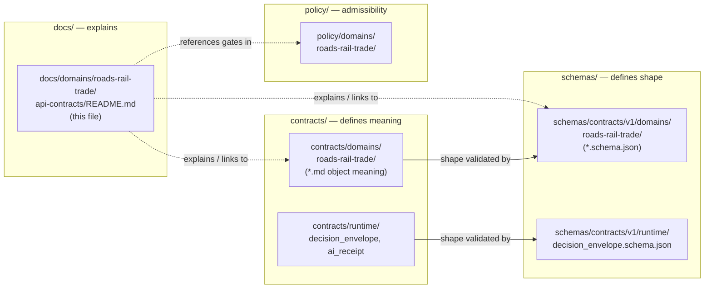
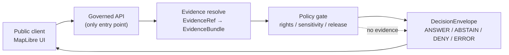

<!-- [KFM_META_BLOCK_V2]
doc_id: kfm://doc/roads-rail-trade-api-contracts-readme
title: Roads, Rail & Trade Routes — API & Contract Surfaces (Documentation Index)
type: standard
version: v1
status: draft
owners: TODO-roads-rail-trade-domain-steward, TODO-docs-steward, TODO-governed-api-owner
created: 2026-06-07
updated: 2026-06-07
policy_label: public
related: [
  ai-build-operating-contract.md,
  directory-rules.md,
  docs/domains/roads-rail-trade/README.md,
  docs/domains/roads-rail-trade/SOURCE_REGISTRY/README.md,
  contracts/domains/roads-rail-trade/,
  schemas/contracts/v1/domains/roads-rail-trade/,
  policy/domains/roads-rail-trade/,
  docs/architecture/governed-api.md
]
tags: [kfm, roads-rail-trade, api, contracts, governed-api, decision-envelope]
notes: [
  CONTRACT_VERSION = "3.0.0" pinned per ai-build-operating-contract.md,
  This README is a DOC-surface index; canonical object meaning lives in contracts/ and shape in schemas/ (see Layer-Separation note),
  All routes UNKNOWN; all repo-state claims PROPOSED or NEEDS VERIFICATION; repo not mounted this session
]
[/KFM_META_BLOCK_V2] -->

<a id="top"></a>

# 🛤️ Roads, Rail & Trade Routes — API & Contract Surfaces

> Documentation index of the governed API endpoints, response DTOs, and contract/schema homes that serve the **Roads / Rail / Trade Routes** domain — every surface gated by evidence, policy, and release state.


**Status:** `draft` · **Owners:** `TODO-roads-rail-trade-domain-steward`, `TODO-docs-steward`, `TODO-governed-api-owner` · **Updated:** `2026-06-07`

> [!IMPORTANT]
> **`CONTRACT_VERSION = "3.0.0"`** — this document operates under `ai-build-operating-contract.md` v3.0 and `directory-rules.md`. Every API surface here is **PROPOSED**; **no route name is asserted** as existing.

---

## Quick jump

- [1. Scope](#1-scope)
- [2. Layer-separation note — docs vs. contracts vs. schemas](#2-layer-separation-note--docs-vs-contracts-vs-schemas)
- [3. Repo fit](#3-repo-fit)
- [4. The four governed surfaces](#4-the-four-governed-surfaces)
- [5. Surface register](#5-surface-register)
- [6. Finite outcomes & the DecisionEnvelope](#6-finite-outcomes--the-decisionenvelope)
- [7. Response DTOs and their schema homes](#7-response-dtos-and-their-schema-homes)
- [8. Request flow (trust membrane)](#8-request-flow-trust-membrane)
- [9. Governed AI behavior](#9-governed-ai-behavior)
- [10. Sensitivity & publication gate](#10-sensitivity--publication-gate)
- [11. Directory tree](#11-directory-tree)
- [12. Validators & tests](#12-validators--tests)
- [13. FAQ](#13-faq)
- [14. Open questions register](#14-open-questions-register)
- [15. Open verification backlog](#15-open-verification-backlog)
- [16. Changelog](#16-changelog)
- [17. Definition of done](#17-definition-of-done)
- [18. Related docs](#18-related-docs)

---

## 1. Scope

This directory documents the **API and contract surfaces** through which the Roads / Rail / Trade Routes domain is served — the endpoints a public client may call, the DTOs those endpoints return, and where each DTO's *meaning* (`contracts/`) and *shape* (`schemas/`) live. It is the orientation doc a contributor reads before wiring a resolver, defining a payload, or asserting that a route exists.

> [!NOTE]
> All public access reaches governed Roads/Rail surfaces **only** through the governed API. No client touches canonical or internal stores directly. `CONFIRMED doctrine` — trust membrane. `[GAI] [DIRRULES]`.

[↑ Back to top](#top)

---

## 2. Layer-separation note — docs vs. contracts vs. schemas

> [!WARNING]
> **This README explains; it does not define.** Directory Rules is explicit: `docs/` **explains**, `contracts/` **defines meaning**, `schemas/` **defines shape**, and these layers **MUST NOT collapse** into one another. `CONFIRMED` (Directory Rules §6.1, §6.3, §6.4).

A folder named `api-contracts/` under `docs/` is a **documentation index** *about* the contracts. The contracts of record live elsewhere:



**Consequence for authors:** never place `.schema.json` files or normative object definitions in this `docs/` lane. When this index and the `contracts/`/`schemas/` artifacts disagree, the `contracts/`/`schemas/` artifacts win and this index is the drift.

[↑ Back to top](#top)

---

## 3. Repo fit

| Direction | Path | Relationship |
|---|---|---|
| **This doc** | `docs/domains/roads-rail-trade/api-contracts/README.md` | API/contract index (`DOC` surface) |
| **Parent** | `docs/domains/roads-rail-trade/README.md` | Domain landing doc *(PROPOSED)* |
| **Sibling** | `docs/domains/roads-rail-trade/SOURCE_REGISTRY/README.md` | Source index *(PROPOSED)* |
| **Object meaning** | `contracts/domains/roads-rail-trade/` | Domain DTO `.md` definitions *(PROPOSED)* |
| **Cross-cutting meaning** | `contracts/runtime/`, `contracts/release/`, `contracts/evidence/` | Envelope, receipt, manifest meaning *(PROPOSED)* |
| **Shape** | `schemas/contracts/v1/domains/roads-rail-trade/` | Domain `.schema.json` *(PROPOSED)* |
| **Admissibility** | `policy/domains/roads-rail-trade/` | Policy gates *(PROPOSED)* |
| **Architecture** | `docs/architecture/governed-api.md` | Governed-API doctrine *(PROPOSED)* |
| **Domain dossier** | Atlas §13.J | Doctrinal evidence `[DOM-ROADS] [ENCY]` |

> [!CAUTION]
> The repository was **not mounted** this session. All paths, file presence, route names, and field names are `PROPOSED` / `NEEDS VERIFICATION` until checked against the live tree.

[↑ Back to top](#top)

---

## 4. The four governed surfaces

The Roads/Rail dossier names four governed surfaces plus the schema responsibility root. `PROPOSED governed API surfaces; exact routes UNKNOWN` `[DOM-ROADS] [ENCY]`.

1. **Feature / detail resolver** — returns a `RoadsRailDecisionEnvelope` for a selected feature.
2. **Layer manifest resolver** — returns a `LayerManifest` / domain layer descriptor for public-safe rendering.
3. **Evidence Drawer payload** — returns an `EvidenceDrawerPayload` projected from an `EvidenceBundle`, evidence- and policy-filtered.
4. **Focus Mode answer** — returns a `RuntimeResponseEnvelope` + `AIReceipt`; AI is never root truth.

[↑ Back to top](#top)

---

## 5. Surface register

> [!NOTE]
> Every row is `PROPOSED`; **exact routes are `UNKNOWN`** and intentionally not invented. `[DOM-ROADS] [ENCY] [DIRRULES]`.

| Surface | Response DTO | Finite outcomes | Status |
|---|---|---|---|
| Feature / detail resolver | `RoadsRailDecisionEnvelope` | `ANSWER` / `ABSTAIN` / `DENY` / `ERROR` | `PROPOSED`; route `UNKNOWN` |
| Layer manifest resolver | `LayerManifest` / domain layer descriptor | `ANSWER` / `DENY` / `ERROR` | `PROPOSED`; public-safe release only |
| Evidence Drawer payload | `EvidenceDrawerPayload` + `EvidenceBundle` projection | `ANSWER` / `ABSTAIN` / `DENY` / `ERROR` | `PROPOSED`; evidence + policy filtered |
| Focus Mode answer | `RuntimeResponseEnvelope` + `AIReceipt` | `ANSWER` / `ABSTAIN` / `DENY` / `ERROR` | `PROPOSED`; AI never root truth |
| Schema responsibility root | `schemas/contracts/v1/` | finite validator outcomes | `PROPOSED`; verify with Directory Rules + ADR `[DIRRULES]` |

[↑ Back to top](#top)

---

## 6. Finite outcomes & the DecisionEnvelope

Every governed surface resolves to one of four finite outcomes; there is no fifth, fluent, ungoverned path. `CONFIRMED doctrine`.

| Outcome | Meaning |
|---|---|
| `ANSWER` | Evidence resolved, policy allowed, release state present |
| `ABSTAIN` | Support insufficient to answer (cite-or-abstain) |
| `DENY` | Policy, rights, sensitivity, or release state blocks the request |
| `ERROR` | Processing failure (not a content judgment) |

Policy modules normalize their output as a `DecisionEnvelope` so downstream consumers need no module-specific parsers. `PROPOSED` shape `[KFM-P5-PROG-0001]`:

```json
{
  "decision_id": "uuid",
  "outcome": "ANSWER | ABSTAIN | DENY | ERROR",
  "policy_family": "promotion | access | render | capability | consent | sensitivity",
  "reasons": ["missing_spec_hash", "..."],
  "obligations": [{ "type": "redact", "op": "generalize_geometry", "level": "coarse" }],
  "evaluated_at": "ISO-8601"
}
```

> [!NOTE]
> **`PROPOSED` schema home:** `schemas/contracts/v1/runtime/decision_envelope.schema.json`. The `RoadsRailDecisionEnvelope` named in the dossier is `INFERRED` to be a domain projection over this base envelope; that relationship is `NEEDS VERIFICATION`. `[DIRRULES]`.

[↑ Back to top](#top)

---

## 7. Response DTOs and their schema homes

DTO *shape* lives under the ADR-0001 schema home; DTO *meaning* lives under `contracts/`. All paths `PROPOSED` / `NEEDS VERIFICATION`.

| DTO | Meaning home (`contracts/`) | Shape home (`schemas/contracts/v1/`) |
|---|---|---|
| `RoadsRailDecisionEnvelope` | `contracts/domains/roads-rail-trade/` *(INFERRED)* | `…/domains/roads-rail-trade/` *(PROPOSED)* |
| `DecisionEnvelope` (base) | `contracts/runtime/` | `…/runtime/decision_envelope.schema.json` |
| `LayerManifest` | `contracts/release/` *(INFERRED)* | `…/release/` *(PROPOSED)* |
| `EvidenceDrawerPayload` | `contracts/evidence/` *(INFERRED)* | `…/evidence/` *(PROPOSED)* |
| `EvidenceBundle` | `contracts/evidence/evidence_bundle` | `…/evidence/` *(PROPOSED)* |
| `RuntimeResponseEnvelope` | `contracts/runtime/` | `…/runtime/` *(PROPOSED)* |
| `AIReceipt` | `contracts/runtime/ai_receipt` | `…/ai/ai_receipt.schema.json` *(per MapLibre master)* |

> [!CAUTION]
> The `ai_receipt` schema path appears as `schemas/contracts/v1/ai/...` in the MapLibre master and as a `contracts/runtime/` member in Directory Rules §6.3. Surfaced as a possible `ai/` vs. `runtime/` placement variance — `CONFLICTED`, see `OQ-ROADS-API-02`.

[↑ Back to top](#top)

---

## 8. Request flow (trust membrane)

A public Roads/Rail request crosses the trust membrane once and resolves to a finite outcome. `CONFIRMED doctrine / PROPOSED implementation`.



> [!IMPORTANT]
> **EvidenceRef must resolve to an EvidenceBundle before public claim authority.** A clicked feature or Focus answer resolves its bundle **before display**, or the surface `ABSTAIN`s. `CONFIRMED doctrine`.

[↑ Back to top](#top)

---

## 9. Governed AI behavior

For the Focus Mode answer surface specifically:

- AI **may** summarize released Roads/Rail `EvidenceBundle`s, compare evidence, explain limitations, and draft steward-review notes.
- AI **must** `ABSTAIN` when evidence is insufficient.
- AI **must** `DENY` where policy, rights, sensitivity, or release state blocks the request.
- AI text is **never** treated as evidence; an `AIReceipt` is mandatory; release state is required.

`CONFIRMED doctrine / PROPOSED implementation` `[GAI] [DOM-ROADS] [ENCY]`.

[↑ Back to top](#top)

---

## 10. Sensitivity & publication gate

> [!CAUTION]
> **Sensitive-domain handling applies to these surfaces.** Indigenous trade and mobility corridors default to steward review and **generalized** public geometry; critical transport facilities require review; exact archaeological coordinates for historic corridors are **denied**. `CONFIRMED / PROPOSED` `[DOM-ROADS] [ENCY] [DOM-ARCH]`.

Default disposition when no specific row matches (operating contract §23.2):

```text
DENY public exact exposure
GENERALIZE before publication
REDACT when needed (RedactionReceipt)
REQUIRE steward review
ABSTAIN when support is inadequate
```

Unclear rights, unresolved source role, missing evidence, unresolved sensitivity, or absent release state **blocks** an `ANSWER` and forces `DENY`/`ABSTAIN`. `CONFIRMED doctrine` `[ENCY] [DIRRULES]`.

[↑ Back to top](#top)

---

## 11. Directory tree

> [!NOTE]
> `PROPOSED` tree reflecting the Directory Rules lane pattern for `roads-rail-trade` — not verified file presence.

```text
docs/domains/roads-rail-trade/
├── README.md                          # domain landing doc          (PROPOSED)
├── SOURCE_REGISTRY/
│   └── README.md                      # source index                (PROPOSED)
└── api-contracts/
    └── README.md                      # ← this file (DOC index)

contracts/                             # object MEANING               (PROPOSED)
├── domains/roads-rail-trade/          # RoadsRailDecisionEnvelope, etc.
├── runtime/                           # decision_envelope, ai_receipt
├── evidence/                          # evidence_bundle, drawer payload
└── release/                           # layer_manifest

schemas/contracts/v1/                  # object SHAPE                 (PROPOSED)
├── domains/roads-rail-trade/
├── runtime/decision_envelope.schema.json
└── release/  evidence/  ai/

policy/domains/roads-rail-trade/       # admissibility gates          (PROPOSED)
```

[↑ Back to top](#top)

---

## 12. Validators & tests

Proposed checks protecting these surfaces. All `PROPOSED` `[DOM-ROADS] [ENCY]`:

1. Route membership and designation **separation** tests.
2. Operator/status **temporal** tests.
3. OSM/GNIS legal-status **denial** test.
4. Historic **over-precision** denial test.
5. Public generalization **receipt** tests.
6. Transport-graph projection **rollback** tests.
7. *(INFERRED)* Finite-outcome conformance: every surface returns exactly one of `ANSWER`/`ABSTAIN`/`DENY`/`ERROR`.
8. *(INFERRED)* Cite-or-abstain: no `ANSWER` without a resolved `EvidenceBundle`.

[↑ Back to top](#top)

---

## 13. FAQ

<details>
<summary><strong>What is the route for the feature resolver?</strong></summary>

`UNKNOWN`. The dossier marks every Roads/Rail route as TBD; this doc does not invent routes. Confirm against the mounted `apps/governed-api/` and `docs/architecture/governed-api.md`. `PROPOSED`.
</details>

<details>
<summary><strong>Do I put the .schema.json here?</strong></summary>

No. Schemas live under `schemas/contracts/v1/domains/roads-rail-trade/`; object meaning lives under `contracts/domains/roads-rail-trade/`. This `docs/` lane only explains them. See [§2](#2-layer-separation-note--docs-vs-contracts-vs-schemas).
</details>

<details>
<summary><strong>Is RoadsRailDecisionEnvelope a separate envelope from DecisionEnvelope?</strong></summary>

`INFERRED`: it is a domain projection over the base `DecisionEnvelope` (`{decision_id, outcome, policy_family, reasons[], obligations[], evaluated_at}`). The exact relationship is `NEEDS VERIFICATION`. See `OQ-ROADS-API-01`.
</details>

[↑ Back to top](#top)

---

## 14. Open questions register

| ID | Question | Owner role | Resolution path |
|---|---|---|---|
| OQ-ROADS-API-01 | Is `RoadsRailDecisionEnvelope` a projection over base `DecisionEnvelope`, or a distinct type? | governed-API owner | contract inspection / ADR |
| OQ-ROADS-API-02 | Does `ai_receipt` shape live under `schemas/contracts/v1/ai/` or `…/runtime/`? | schema steward | repo inspection / Directory Rules §6.3 |
| OQ-ROADS-API-03 | What are the actual route paths for the four surfaces? | governed-API owner | inspect `apps/governed-api/` |
| OQ-ROADS-API-04 | Should `obligations[]` be enforced before or after the envelope is emitted? | policy steward | ADR / governed-API design |

[↑ Back to top](#top)

---

## 15. Open verification backlog

These items remain `NEEDS VERIFICATION` before promotion from `draft` to `published`:

1. Confirm the four route paths against the mounted governed API.
2. Confirm `contracts/domains/roads-rail-trade/` and `schemas/contracts/v1/domains/roads-rail-trade/` presence and contents.
3. Confirm the `decision_envelope.schema.json` path and field set.
4. Resolve the `ai_receipt` `ai/` vs. `runtime/` placement variance (`OQ-ROADS-API-02`).
5. Confirm `policy/domains/roads-rail-trade/` gate coverage for these surfaces.
6. Confirm the parent and sibling READMEs exist and cross-link to this index.

[↑ Back to top](#top)

---

## 16. Changelog

| Change | Type (per contract §37) | Reason |
|---|---|---|
| Initial draft of Roads/Rail API & contract surfaces doc index | new | Stand up the domain API/contract orientation surface |

> **Backward compatibility.** New file; no prior anchors. Stable anchors introduced here SHOULD be preserved on future revision.

[↑ Back to top](#top)

---

## 17. Definition of done

This document is done enough to enter the repository when:

- it is placed according to Directory Rules (`docs/` lane, not `contracts/`/`schemas/`);
- a docs steward, the Roads/Rail domain steward, and the governed-API owner review it;
- it is linked from `docs/domains/roads-rail-trade/README.md` and the architecture governed-API doc;
- it does not conflict with accepted ADRs (notably ADR-0001 schema home);
- the layer-separation distinction in §2 holds against the actual `contracts/`/`schemas/` tree, with any divergence logged in `docs/registers/DRIFT_REGISTER.md`;
- the `GENERATED_RECEIPT.json` planned in Section 2 is wired into CI;
- future changes follow the operating contract's §37 lifecycle.

[↑ Back to top](#top)

---

## 18. Related docs

- `docs/domains/roads-rail-trade/README.md` — domain landing doc *(TODO / PROPOSED)*
- `docs/domains/roads-rail-trade/SOURCE_REGISTRY/README.md` — source index *(PROPOSED)*
- `contracts/domains/roads-rail-trade/` — object meaning *(TODO / PROPOSED)*
- `schemas/contracts/v1/domains/roads-rail-trade/` — object shape *(TODO / PROPOSED)*
- `schemas/contracts/v1/runtime/decision_envelope.schema.json` — base envelope *(TODO / PROPOSED)*
- `policy/domains/roads-rail-trade/` — admissibility gates *(TODO / PROPOSED)*
- `docs/architecture/governed-api.md` — governed-API doctrine *(TODO / PROPOSED)*
- `directory-rules.md` — placement & lifecycle doctrine
- `ai-build-operating-contract.md` — operating law, `CONTRACT_VERSION = "3.0.0"`
- Atlas §13.J *Roads, Rail, and Trade Routes — API, contract, and schema surfaces* `[DOM-ROADS] [ENCY]`

---

_Last updated: 2026-06-07 · `CONTRACT_VERSION = "3.0.0"` · [↑ Back to top](#top)_
