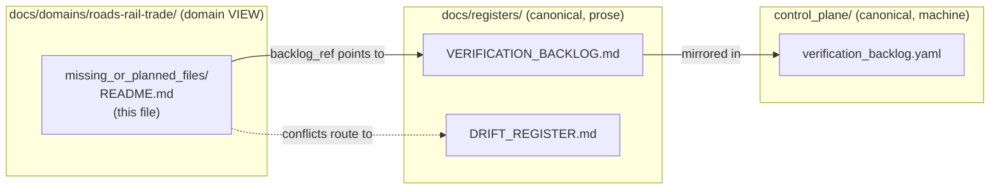
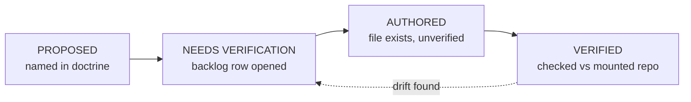

<!-- [KFM_META_BLOCK_V2]
doc_id: kfm://doc/roads-rail-trade-missing-or-planned-files-readme
title: Roads, Rail & Trade Routes — Missing or Planned Files (Domain Tracking Index)
type: standard
version: v1
status: draft
owners: TODO-roads-rail-trade-domain-steward, TODO-docs-steward
created: 2026-06-07
updated: 2026-06-07
policy_label: public
related: [
  ai-build-operating-contract.md,
  directory-rules.md,
  docs/domains/roads-rail-trade/README.md,
  docs/domains/roads-rail-trade/SOURCE_REGISTRY/README.md,
  docs/domains/roads-rail-trade/api-contracts/README.md,
  docs/registers/VERIFICATION_BACKLOG.md,
  docs/registers/DRIFT_REGISTER.md,
  control_plane/verification_backlog.yaml
]
tags: [kfm, roads-rail-trade, planned-files, verification-backlog, tracking]
notes: [
  CONTRACT_VERSION = "3.0.0" pinned per ai-build-operating-contract.md,
  This is a DOMAIN-SCOPED tracking VIEW; the canonical register home is docs/registers/VERIFICATION_BACKLOG.md (see Placement note),
  Parallel-register risk flagged as ADR candidate ADR-ROADS-MPF-01,
  All paths PROPOSED or NEEDS VERIFICATION; repo not mounted this session
]
[/KFM_META_BLOCK_V2] -->

<a id="top"></a>

# 🛤️ Roads, Rail & Trade Routes — Missing or Planned Files

> A domain-scoped tracking view of files, schemas, validators, and policies that the Roads / Rail / Trade Routes lane *expects to exist* but has not yet authored or verified — every entry pointing back to the canonical backlog register.


**Status:** `draft` · **Owners:** `TODO-roads-rail-trade-domain-steward`, `TODO-docs-steward` · **Updated:** `2026-06-07`

> [!IMPORTANT]
> **`CONTRACT_VERSION = "3.0.0"`** — this document operates under `ai-build-operating-contract.md` v3.0 and `directory-rules.md`. Every "missing" file below is `PROPOSED` / `NEEDS VERIFICATION`; **none is asserted to exist or to be absent** without repo inspection.

> [!WARNING]
> **Placement flag — possible parallel register.** KFM already has canonical homes for unfinished-work tracking: `docs/registers/VERIFICATION_BACKLOG.md` (planned / not-yet-authored), `docs/registers/DRIFT_REGISTER.md` (conflicts), and `control_plane/verification_backlog.yaml` (machine-readable). A `missing_or_planned_files/` folder risks becoming a **parallel registry home**, which Directory Rules and the operating contract discourage without an ADR. See [§2](#2-placement-note--this-is-a-view-not-a-register). Tracked as **`ADR-ROADS-MPF-01`**.

---

## Quick jump

- [1. Scope](#1-scope)
- [2. Placement note — this is a view, not a register](#2-placement-note--this-is-a-view-not-a-register)
- [3. Repo fit](#3-repo-fit)
- [4. How an entry is tracked](#4-how-an-entry-is-tracked)
- [5. Planned schemas](#5-planned-schemas)
- [6. Planned validators & tests](#6-planned-validators--tests)
- [7. Planned policy & contracts](#7-planned-policy--contracts)
- [8. Domain verification backlog (Atlas §13.N)](#8-domain-verification-backlog-atlas-13n)
- [9. Planned docs](#9-planned-docs)
- [10. Lifecycle of a planned entry](#10-lifecycle-of-a-planned-entry)
- [11. Directory tree](#11-directory-tree)
- [12. FAQ](#12-faq)
- [13. Open questions register](#13-open-questions-register)
- [14. Open verification backlog](#14-open-verification-backlog)
- [15. Changelog](#15-changelog)
- [16. Definition of done](#16-definition-of-done)
- [17. Related docs](#17-related-docs)

---

## 1. Scope

This directory tracks the **gap between Roads/Rail doctrine and Roads/Rail implementation** — the schemas, validators, policies, contracts, and docs the dossier *names as expected* but which have not yet been authored, placed, or verified against a mounted repository.

It exists to keep the project honest: doctrine describes many `PROPOSED` surfaces, and this view records *which of them are not yet real*, so no reader mistakes a planned file for an existing one.

> [!NOTE]
> The main project risk is **not lack of ideas** — it is overclaiming maturity before repo, runtime, rights, and proof-object evidence exists. This view is a guard against that overclaim. `CONFIRMED doctrine` (open-verification-backlog discipline).

[↑ Back to top](#top)

---

## 2. Placement note — this is a view, not a register

> [!CAUTION]
> **The register of record is `docs/registers/VERIFICATION_BACKLOG.md`, not this folder.** Directory Rules instructs authors to open backlog items in `docs/registers/VERIFICATION_BACKLOG.md` (planned/unverified) or `docs/registers/DRIFT_REGISTER.md` (conflicts), and the machine-readable mirror is `control_plane/verification_backlog.yaml`. `CONFIRMED` (Directory Rules Step 5; §6.1 registers; §6.2 control_plane).

This README is a **domain-scoped reading view** onto those canonical registers. Every entry here MUST carry a `backlog_ref` pointing to its row in the canonical register; if a row is missing there, the gap is that the register entry was never opened — not that this folder is the authority.



**Consequence for authors:** when this view and the canonical register disagree, the canonical register wins and this view is the drift. Do not record a *resolution decision* here; record it in the register and reflect it here.

> [!NOTE]
> **`CONFLICTED` — ADR candidate `ADR-ROADS-MPF-01`.** Two reconciliations for this folder's existence:
> - **Option A — keep `missing_or_planned_files/` as a domain view** that strictly references the canonical register (the posture this draft takes); record the relationship in `DRIFT_REGISTER.md`.
> - **Option B — retire the folder** and track Roads/Rail gaps only as domain-tagged rows in `docs/registers/VERIFICATION_BACKLOG.md`.
> The folder name also mixes `snake_case` with the kebab-case `docs/` lane convention (cf. `source-registry/`, `api-contracts/`); raised alongside the casing question. Draft proceeds at the requested path; awaiting your choice.

[↑ Back to top](#top)

---

## 3. Repo fit

| Direction | Path | Relationship |
|---|---|---|
| **This doc** | `docs/domains/roads-rail-trade/missing_or_planned_files/README.md` | Domain gap view (`DOC` surface) |
| **Parent** | `docs/domains/roads-rail-trade/README.md` | Domain landing doc *(PROPOSED)* |
| **Sibling** | `docs/domains/roads-rail-trade/SOURCE_REGISTRY/README.md` | Source index *(PROPOSED)* |
| **Sibling** | `docs/domains/roads-rail-trade/api-contracts/README.md` | API/contract index *(PROPOSED)* |
| **Canonical backlog** | `docs/registers/VERIFICATION_BACKLOG.md` | Register of record *(PROPOSED)* |
| **Conflict register** | `docs/registers/DRIFT_REGISTER.md` | Drift entries *(PROPOSED)* |
| **Machine mirror** | `control_plane/verification_backlog.yaml` | Structured backlog *(PROPOSED)* |
| **Domain dossier** | Atlas §13.N | Source of the four domain backlog items `[DOM-ROADS] [ENCY]` |

> [!CAUTION]
> The repository was **not mounted** this session. Every "missing" / "planned" status below is `NEEDS VERIFICATION` — a file listed as missing may already exist in the live tree, and vice versa.

[↑ Back to top](#top)

---

## 4. How an entry is tracked

Each planned item carries a stable ID and a pointer to its canonical backlog row:

| Field | Meaning |
|---|---|
| `id` | Stable tracking ID, e.g. `MPF-ROADS-NN` |
| `expected_path` | Where the file *would* live per Directory Rules (`PROPOSED`) |
| `kind` | schema · validator · policy · contract · doc · fixture |
| `doctrine_basis` | Atlas section / card that names the expectation |
| `backlog_ref` | Row in `docs/registers/VERIFICATION_BACKLOG.md` |
| `status` | `PROPOSED` · `NEEDS VERIFICATION` · `AUTHORED` · `VERIFIED` |

> All IDs below are `PROPOSED` and local to this view until mirrored into the canonical register.

[↑ Back to top](#top)

---

## 5. Planned schemas

Schema shapes the dossier implies but which are not verified present. All `PROPOSED`; expected paths follow ADR-0001 schema home `[DIRRULES]`.

| ID | Expected path | Doctrine basis | Status |
|---|---|---|---|
| MPF-ROADS-01 | `schemas/contracts/v1/domains/roads-rail-trade/road_segment.schema.json` | Object families §13.E | `NEEDS VERIFICATION` |
| MPF-ROADS-02 | `schemas/contracts/v1/domains/roads-rail-trade/rail_segment.schema.json` | Object families §13.E | `NEEDS VERIFICATION` |
| MPF-ROADS-03 | `schemas/contracts/v1/domains/roads-rail-trade/transport_facility.schema.json` | Object families §13.E | `NEEDS VERIFICATION` |
| MPF-ROADS-04 | `schemas/contracts/v1/domains/roads-rail-trade/restriction_event.schema.json` | Object families §13.E | `NEEDS VERIFICATION` |
| MPF-ROADS-05 | `schemas/contracts/v1/domains/roads-rail-trade/route_uncertainty_profile.schema.json` | §13.N *Implement RouteUncertaintyProfile* | `NEEDS VERIFICATION` |

> [!NOTE]
> Object family names (Road Segment, Rail Segment, TransportFacility, RestrictionEvent, RouteUncertaintyProfile) are `CONFIRMED` terms; their *field realization* and schema file presence are `PROPOSED` / `NEEDS VERIFICATION` `[DOM-ROADS]`.

[↑ Back to top](#top)

---

## 6. Planned validators & tests

The six validator/test families named in Atlas §13.K. All `PROPOSED` `[DOM-ROADS] [ENCY]`. Expected home: `tests/domains/roads-rail-trade/` and `tools/validators/`.

| ID | Planned check | Status |
|---|---|---|
| MPF-ROADS-06 | Route membership and designation **separation** test | `PROPOSED` |
| MPF-ROADS-07 | Operator/status **temporal** test | `PROPOSED` |
| MPF-ROADS-08 | OSM/GNIS **legal-status denial** test | `PROPOSED` |
| MPF-ROADS-09 | Historic **over-precision denial** test | `PROPOSED` |
| MPF-ROADS-10 | Public **generalization receipt** test | `PROPOSED` |
| MPF-ROADS-11 | Transport-graph projection **rollback** test | `PROPOSED` |

[↑ Back to top](#top)

---

## 7. Planned policy & contracts

| ID | Expected path | Doctrine basis | Status |
|---|---|---|---|
| MPF-ROADS-12 | `policy/domains/roads-rail-trade/` (Indigenous/cultural corridor gate) | §13.N *Verify Indigenous/cultural corridor policy* | `NEEDS VERIFICATION` |
| MPF-ROADS-13 | `policy/sensitivity/` entry for critical transport facilities | §13.I sensitivity posture | `NEEDS VERIFICATION` |
| MPF-ROADS-14 | `contracts/domains/roads-rail-trade/` (`RoadsRailDecisionEnvelope` meaning) | §13.J API surfaces | `NEEDS VERIFICATION` |

[↑ Back to top](#top)

---

## 8. Domain verification backlog (Atlas §13.N)

These are the four items the dossier itself records as `NEEDS VERIFICATION`. Each is settled only by *mounted repo files, schemas, registry entries, tests, logs, emitted artifacts, review records, or release manifests* `[DOM-ROADS] [ENCY]`.

| ID | Item to verify | Status |
|---|---|---|
| MPF-ROADS-15 | Verify KDOT / FHWA / FRA / WZDx source terms | `NEEDS VERIFICATION` |
| MPF-ROADS-16 | Verify Indigenous / cultural corridor policy | `NEEDS VERIFICATION` |
| MPF-ROADS-17 | Implement `RouteUncertaintyProfile` | `NEEDS VERIFICATION` |
| MPF-ROADS-18 | Verify transport graph and MapLibre integration | `NEEDS VERIFICATION` |

> [!IMPORTANT]
> Items MPF-ROADS-15..18 are quoted from the dossier and **must** be mirrored as rows in `docs/registers/VERIFICATION_BACKLOG.md`; this table is a view, not their authority.

[↑ Back to top](#top)

---

## 9. Planned docs

| ID | Expected path | Status |
|---|---|---|
| MPF-ROADS-19 | `docs/domains/roads-rail-trade/README.md` (domain landing doc) | `NEEDS VERIFICATION` |
| MPF-ROADS-20 | `docs/runbooks/roads-rail-trade/SOURCE_REFRESH_RUNBOOK.md` *(subfolder convention pending OPEN-DR-02)* | `PROPOSED` |

[↑ Back to top](#top)

---

## 10. Lifecycle of a planned entry

A planned entry advances through verifiable states; it is never silently promoted to "done."



[↑ Back to top](#top)

---

## 11. Directory tree

> [!NOTE]
> `PROPOSED` tree reflecting the Directory Rules lane pattern — not verified file presence.

```text
docs/domains/roads-rail-trade/
├── README.md                          # domain landing doc        (PROPOSED)
├── SOURCE_REGISTRY/
│   └── README.md                      # source index              (PROPOSED)
├── api-contracts/
│   └── README.md                      # API/contract index        (PROPOSED)
└── missing_or_planned_files/
    └── README.md                      # ← this file (domain view)

docs/registers/                        # canonical register home    (PROPOSED)
├── VERIFICATION_BACKLOG.md            # register of record
└── DRIFT_REGISTER.md                  # conflict register

control_plane/
└── verification_backlog.yaml          # machine-readable mirror     (PROPOSED)
```

[↑ Back to top](#top)

---

## 12. FAQ

<details>
<summary><strong>Does a file listed here definitely not exist?</strong></summary>

No. The repo was not mounted; "missing" means `NEEDS VERIFICATION`, not confirmed-absent. A listed file may already exist in the live tree. Confirm before acting.
</details>

<details>
<summary><strong>Is this folder the project's backlog?</strong></summary>

No. The canonical backlog is `docs/registers/VERIFICATION_BACKLOG.md` (with `control_plane/verification_backlog.yaml` as the machine mirror). This is a domain-scoped view that must reference those. See [§2](#2-placement-note--this-is-a-view-not-a-register).
</details>

<details>
<summary><strong>Where do I record that a planned file is now done?</strong></summary>

In the canonical register row (mark `VERIFIED`), then reflect the status here. Do not record the resolution decision only in this view.
</details>

[↑ Back to top](#top)

---

## 13. Open questions register

| ID | Question | Owner role | Resolution path |
|---|---|---|---|
| ADR-ROADS-MPF-01 | Keep `missing_or_planned_files/` as a domain view, or retire it for register-only tracking? | docs steward | ADR / `DRIFT_REGISTER.md` |
| OQ-ROADS-MPF-01 | Folder casing `missing_or_planned_files/` vs kebab-case `docs/` lane norm? | docs steward | Directory Rules §3 / ADR |
| OQ-ROADS-MPF-02 | Are any listed "missing" files already present in the mounted repo? | domain steward | repo inspection |
| OQ-ROADS-MPF-03 | Subfolder convention for the Roads/Rail runbook (OPEN-DR-02)? | docs steward | ADR |

[↑ Back to top](#top)

---

## 14. Open verification backlog

These items remain `NEEDS VERIFICATION` before promotion from `draft` to `published`:

1. Confirm whether `docs/registers/VERIFICATION_BACKLOG.md` and `control_plane/verification_backlog.yaml` exist and adopt them as the canonical home.
2. Mirror MPF-ROADS-01..20 as canonical register rows with `backlog_ref` IDs.
3. Inspect the mounted repo to set true `AUTHORED` / `VERIFIED` status for each entry.
4. Resolve the parallel-register question (`ADR-ROADS-MPF-01`) and the casing question (`OQ-ROADS-MPF-01`).
5. Confirm parent and sibling READMEs exist and cross-link to this view.

[↑ Back to top](#top)

---

## 15. Changelog

| Change | Type (per contract §37) | Reason |
|---|---|---|
| Initial draft of Roads/Rail missing-or-planned-files domain view | new | Stand up a domain-scoped gap view over the canonical backlog |

> **Backward compatibility.** New file; no prior anchors. Stable anchors introduced here SHOULD be preserved on future revision.

[↑ Back to top](#top)

---

## 16. Definition of done

This document is done enough to enter the repository when:

- the parallel-register question (`ADR-ROADS-MPF-01`) is resolved and the chosen posture recorded in `docs/registers/DRIFT_REGISTER.md`;
- every entry carries a `backlog_ref` into `docs/registers/VERIFICATION_BACKLOG.md`;
- it is placed according to Directory Rules (and casing reconciled);
- a docs steward and the Roads/Rail domain steward review it;
- it is linked from `docs/domains/roads-rail-trade/README.md`;
- it does not conflict with accepted ADRs;
- the `GENERATED_RECEIPT.json` planned in Section 2 is wired into CI;
- future changes follow the operating contract's §37 lifecycle.

[↑ Back to top](#top)

---

## 17. Related docs

- `docs/domains/roads-rail-trade/README.md` — domain landing doc *(TODO / PROPOSED)*
- `docs/domains/roads-rail-trade/SOURCE_REGISTRY/README.md` — source index *(PROPOSED)*
- `docs/domains/roads-rail-trade/api-contracts/README.md` — API/contract index *(PROPOSED)*
- `docs/registers/VERIFICATION_BACKLOG.md` — canonical backlog register *(TODO / PROPOSED)*
- `docs/registers/DRIFT_REGISTER.md` — drift register *(TODO / PROPOSED)*
- `control_plane/verification_backlog.yaml` — machine-readable mirror *(TODO / PROPOSED)*
- `directory-rules.md` — placement & lifecycle doctrine
- `ai-build-operating-contract.md` — operating law, `CONTRACT_VERSION = "3.0.0"`
- Atlas §13.N *Roads, Rail, and Trade Routes — Verification backlog and open questions* `[DOM-ROADS] [ENCY]`

---

_Last updated: 2026-06-07 · `CONTRACT_VERSION = "3.0.0"` · [↑ Back to top](#top)_
