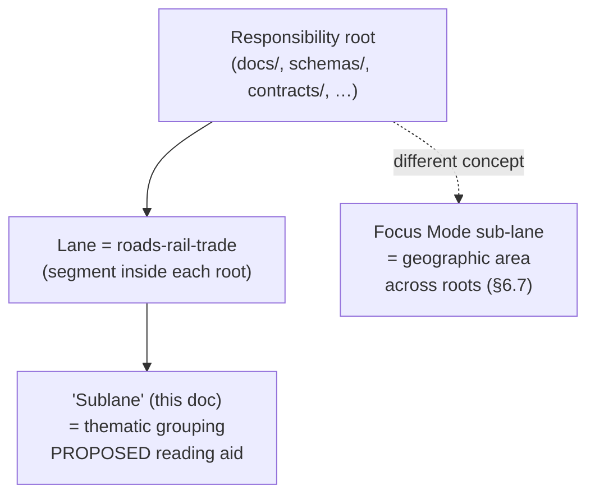
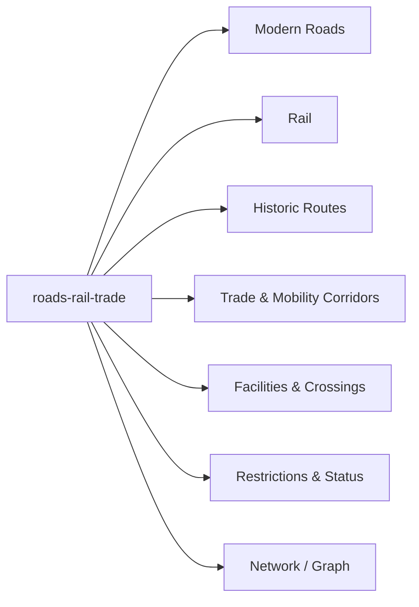

<!-- [KFM_META_BLOCK_V2]
doc_id: kfm://doc/roads-rail-trade-sublanes-readme
title: Roads, Rail & Trade Routes — Sublanes (Internal Grouping Index)
type: standard
version: v1
status: draft
owners: TODO-roads-rail-trade-domain-steward, TODO-docs-steward
created: 2026-06-07
updated: 2026-06-07
policy_label: public
related: [
  ai-build-operating-contract.md,
  directory-rules.md,
  docs/domains/roads-rail-trade/README.md,
  docs/domains/roads-rail-trade/SOURCE_REGISTRY/README.md,
  docs/domains/roads-rail-trade/api-contracts/README.md,
  docs/domains/roads-rail-trade/missing_or_planned_files/README.md
]
tags: [kfm, roads-rail-trade, sublanes, lanes, terminology]
notes: [
  CONTRACT_VERSION = "3.0.0" pinned per ai-build-operating-contract.md,
  TERMINOLOGY FLAG - "sublane" is NOT established KFM doctrine; "lane" is. "sub-lane" exists only in the Focus Mode cross-root sense. See Terminology note,
  Internal groupings are PROPOSED reading aids; they do NOT create new responsibility roots or schema homes,
  Roads/Rail schema path is schemas/contracts/v1/transport/ - a known slug-drift ADR item,
  All paths PROPOSED or NEEDS VERIFICATION; repo not mounted this session
]
[/KFM_META_BLOCK_V2] -->

<a id="top"></a>

# 🛤️ Roads, Rail & Trade Routes — Sublanes

> A reading-aid index of the internal groupings ("sublanes") within the Roads / Rail / Trade Routes domain — modern roads, rail, historic routes, trade corridors, facilities/crossings, restrictions, and the network/graph projection — each a *view onto* the same governance spine, not a new responsibility root.


**Status:** `draft` · **Owners:** `TODO-roads-rail-trade-domain-steward`, `TODO-docs-steward` · **Updated:** `2026-06-07`

> [!IMPORTANT]
> **`CONTRACT_VERSION = "3.0.0"`** — this document operates under `ai-build-operating-contract.md` v3.0 and `directory-rules.md`.

> [!WARNING]
> **Terminology flag — "sublane" is not established KFM doctrine.** The corpus defines **lane** (a domain or topic *segment inside a responsibility root*) and uses **sub-lane** only in the **Focus Mode** sense (one geographic *area* appearing as a segment across multiple responsibility roots). It does **not** define "sublane" as an internal sub-grouping of a single domain. This document treats the requested "sublanes" as **PROPOSED reading aids** and surfaces the term for resolution. See [§2](#2-terminology-note--what-sublane-means-here). Tracked as **`ADR-ROADS-SUBLANE-01`**.

---

## Quick jump

- [1. Scope](#1-scope)
- [2. Terminology note — what "sublane" means here](#2-terminology-note--what-sublane-means-here)
- [3. Repo fit](#3-repo-fit)
- [4. The sublane map](#4-the-sublane-map)
- [5. Sublane → owned objects](#5-sublane--owned-objects)
- [6. Sublane → viewing products](#6-sublane--viewing-products)
- [7. Sublane → sensitivity posture](#7-sublane--sensitivity-posture)
- [8. What a sublane is NOT](#8-what-a-sublane-is-not)
- [9. Directory tree](#9-directory-tree)
- [10. FAQ](#10-faq)
- [11. Open questions register](#11-open-questions-register)
- [12. Open verification backlog](#12-open-verification-backlog)
- [13. Changelog](#13-changelog)
- [14. Definition of done](#14-definition-of-done)
- [15. Related docs](#15-related-docs)

---

## 1. Scope

This directory groups the Roads / Rail / Trade Routes domain into a small set of **internal thematic clusters** — a navigation aid for readers and stewards working within the domain. Each cluster gathers related owned objects, viewing products, and sensitivity concerns so a contributor can find "the rail stuff" or "the historic-route stuff" without scanning the whole dossier.

> [!NOTE]
> A cluster here is a **lens**, not a boundary. All clusters share one trust spine, one schema home, and one set of governance objects. The lens changes the evidence and risk profile in view; it does not change the trust spine. `CONFIRMED doctrine` (lane-pattern / shared-kernel principle).

[↑ Back to top](#top)

---

## 2. Terminology note — what "sublane" means here

> [!CAUTION]
> Two KFM terms are adjacent and must not be conflated:
> - **Lane** — `CONFIRMED`: a domain or topic segment *inside a responsibility root* (e.g., `data/processed/roads-rail-trade/`). `roads-rail-trade` itself is a lane.
> - **Sub-lane** — `CONFIRMED` but Focus-Mode-only: a geographic *area* (e.g., `ellsworth`) appearing as a per-root segment across several responsibility roots, governed by Directory Rules §6.7, **not** by Domain Placement Law §12.

The requested **"sublanes"** in *this* document mean neither of those. They are **thematic sub-groupings within one domain** — a documentation convenience. Because the corpus does not define this usage, every grouping below is `PROPOSED` and carries no placement authority.



> [!NOTE]
> **`CONFLICTED` — ADR candidate `ADR-ROADS-SUBLANE-01`.** Reconciliations:
> - **Option A — keep "sublane" as an explicitly-defined domain reading aid** (the posture this draft takes), with the definition pinned here and recorded in `docs/registers/DRIFT_REGISTER.md` to avoid clashing with the Focus Mode sense.
> - **Option B — rename** to a non-colliding term (e.g., "themes", "clusters", "facets") to keep "sub-lane" reserved for Focus Mode.
> Draft proceeds at the requested path; awaiting your choice.

[↑ Back to top](#top)

---

## 3. Repo fit

| Direction | Path | Relationship |
|---|---|---|
| **This doc** | `docs/domains/roads-rail-trade/sublanes/README.md` | Internal grouping index (`DOC` surface) |
| **Parent** | `docs/domains/roads-rail-trade/README.md` | Domain landing doc *(PROPOSED)* |
| **Sibling** | `…/SOURCE_REGISTRY/README.md` | Source index *(PROPOSED)* |
| **Sibling** | `…/api-contracts/README.md` | API/contract index *(PROPOSED)* |
| **Sibling** | `…/missing_or_planned_files/README.md` | Gap view *(PROPOSED)* |
| **Schema home (lane)** | `schemas/contracts/v1/transport/` | Roads/Rail schema path — **slug drift** vs `roads-rail-trade` *(PROPOSED; ADR)* |
| **Domain dossier** | Atlas §13.B / §13.E / §13.G | Owned objects + viewing products `[DOM-ROADS] [ENCY]` |

> [!CAUTION]
> The dossier's responsibility-root crosswalk (§24.13) gives the Roads/Rail schema path as `schemas/contracts/v1/transport/` while the docs lane is `roads-rail-trade`. This **slug drift** is a known ADR item, not resolved here. The repository was **not mounted**; all paths are `PROPOSED` / `NEEDS VERIFICATION`.

[↑ Back to top](#top)

---

## 4. The sublane map

Seven `PROPOSED` thematic groupings, derived from the domain's owned objects (§13.B) and viewing products (§13.G). `[DOM-ROADS] [ENCY]`.



| Sublane | One-line purpose | Status |
|---|---|---|
| Modern Roads | Present-day road segments and designations | `PROPOSED` |
| Rail | Rail alignments, operators, status | `PROPOSED` |
| Historic Routes | Past routes and route claims | `PROPOSED` |
| Trade & Mobility Corridors | Trade-route corridors incl. Indigenous corridors | `PROPOSED` |
| Facilities & Crossings | Depots, sidings, yards, bridges, ferries, crossings | `PROPOSED` |
| Restrictions & Status | Access restrictions, route/restriction events | `PROPOSED` |
| Network / Graph | Edges, nodes, connectivity projections | `PROPOSED` |

[↑ Back to top](#top)

---

## 5. Sublane → owned objects

Mapping the domain's `CONFIRMED` owned objects (§13.B) onto the `PROPOSED` sublanes. An object may appear under more than one lens.

| Sublane | Owned objects (Atlas §13.B) |
|---|---|
| Modern Roads | Road Segment |
| Rail | Rail Segment; Operator Status |
| Historic Routes | Historic Route; Movement Story Node |
| Trade & Mobility Corridors | Freight Corridor; *(trade/mobility corridor)* |
| Facilities & Crossings | Depot; Siding; Yard; Crossing; Bridge; Ferry; River Crossing |
| Restrictions & Status | Access Restriction; Route Event; Operator Status |
| Network / Graph | Network Edge |

> [!NOTE]
> Object terms are `CONFIRMED` from §13.B; their assignment to a sublane is a `PROPOSED` reading choice, not an ownership change. Ownership stays at the domain level `[DOM-ROADS]`.

[↑ Back to top](#top)

---

## 6. Sublane → viewing products

Mapping the `PROPOSED` domain viewing products (§13.G) onto sublanes. `[DOM-ROADS] [ENCY]`.

| Sublane | Viewing product (Atlas §13.G) |
|---|---|
| Modern Roads | Modern roads layer |
| Rail | Rail alignment layer |
| Historic Routes | Historic route claim view |
| Trade & Mobility Corridors | Freight-corridor context; generalized trade-route corridor |
| Facilities & Crossings | Facility / crossing view |
| Restrictions & Status | Restriction / status timeline |
| Network / Graph | Derived graph / connectivity view |

> [!IMPORTANT]
> All viewing products carry the cross-cutting governance surfaces — Evidence Drawer, time-aware state, trust badges, sensitivity-redacted view, correction/stale-state view, governed Focus Mode. `CONFIRMED doctrine` `[MAP-MASTER] [GAI]`.

[↑ Back to top](#top)

---

## 7. Sublane → sensitivity posture

Sensitivity is a domain-level rule applied per sublane; it does not weaken at the lens boundary. `CONFIRMED / PROPOSED` `[DOM-ROADS] [ENCY]`.

| Sublane | Default posture |
|---|---|
| Trade & Mobility Corridors | **Highest care.** Indigenous trade/mobility corridors, oral history, treaty, cultural, interpretive evidence → steward review + **generalized** public geometry |
| Historic Routes | Generalize; deny historic over-precision; archaeological coordinates **denied** `[DOM-ARCH]` |
| Facilities & Crossings | Critical transport facilities → **review** before public exposure |
| Restrictions & Status | Restriction detail may be sensitive; generalize where harm-enabling |
| Modern Roads · Rail · Network/Graph | Standard governance; rights/terms `NEEDS VERIFICATION` per source |

> [!CAUTION]
> Default disposition when no specific row matches (operating contract §23.2): `DENY` public exact exposure · `GENERALIZE` before publication · `REDACT` (`RedactionReceipt`) · `REQUIRE` steward review · `ABSTAIN` when support is inadequate.

[↑ Back to top](#top)

---

## 8. What a sublane is NOT

> [!WARNING]
> A sublane (as used here) does **not**:
> - create a new responsibility root or a root-level folder — Domain Placement Law forbids it;
> - create a parallel schema, contract, policy, or registry home — those stay in the domain's lane segments (`schemas/contracts/v1/transport/`, `contracts/domains/roads-rail-trade/`, `policy/domains/roads-rail-trade/`);
> - change object ownership — objects remain owned by the `roads-rail-trade` domain;
> - act as a Focus Mode sub-lane — that is a geographic area concept under §6.7.

[↑ Back to top](#top)

---

## 9. Directory tree

> [!NOTE]
> `PROPOSED` tree reflecting the Directory Rules lane pattern — not verified file presence. The `sublanes/` folder, if kept, is a **docs-only navigation aid**; it MUST NOT be mirrored as a segment in `schemas/`, `contracts/`, or `policy/`.

```text
docs/domains/roads-rail-trade/
├── README.md                          # domain landing doc        (PROPOSED)
├── SOURCE_REGISTRY/
│   └── README.md                      # source index              (PROPOSED)
├── api-contracts/
│   └── README.md                      # API/contract index        (PROPOSED)
├── missing_or_planned_files/
│   └── README.md                      # gap view                  (PROPOSED)
└── sublanes/
    └── README.md                      # ← this file (reading aid)

# The lane's actual responsibility homes live OUTSIDE docs/ and are NOT
# subdivided by sublane:
schemas/contracts/v1/transport/        # schema home (slug drift)   (PROPOSED)
contracts/domains/roads-rail-trade/    # object meaning             (PROPOSED)
policy/domains/roads-rail-trade/       # admissibility gates        (PROPOSED)
```

[↑ Back to top](#top)

---

## 10. FAQ

<details>
<summary><strong>Is "sublane" an official KFM term?</strong></summary>

No. KFM defines **lane** and, for Focus Modes, **sub-lane** (a geographic area across roots). This document defines "sublane" locally as a domain reading aid and flags it for ADR resolution (`ADR-ROADS-SUBLANE-01`). See [§2](#2-terminology-note--what-sublane-means-here).
</details>

<details>
<summary><strong>Should I create schemas/contracts/v1/transport/rail/ to match the Rail sublane?</strong></summary>

No. Sublanes are docs-only reading aids; they do not subdivide schema, contract, or policy homes. See [§8](#8-what-a-sublane-is-not).
</details>

<details>
<summary><strong>Why is the schema path "transport" and not "roads-rail-trade"?</strong></summary>

The dossier crosswalk (§24.13) lists `schemas/contracts/v1/transport/` for this domain while the docs lane is `roads-rail-trade`. That slug drift is a known ADR item, not resolved here.
</details>

[↑ Back to top](#top)

---

## 11. Open questions register

| ID | Question | Owner role | Resolution path |
|---|---|---|---|
| ADR-ROADS-SUBLANE-01 | Keep "sublane" as a defined domain reading aid, or rename to avoid colliding with the Focus Mode "sub-lane" sense? | docs steward | ADR / `DRIFT_REGISTER.md` |
| OQ-ROADS-SUBLANE-01 | Is the seven-grouping split the right cut, or should corridors/historic merge? | domain steward | domain review |
| OQ-ROADS-SUBLANE-02 | Resolve `transport` vs `roads-rail-trade` schema-path slug drift (§24.13) | schema steward | ADR |
| OQ-ROADS-SUBLANE-03 | Folder casing `sublanes/` consistency across the domain docs lane | docs steward | Directory Rules §3 |

[↑ Back to top](#top)

---

## 12. Open verification backlog

These items remain `NEEDS VERIFICATION` before promotion from `draft` to `published`:

1. Confirm with the domain steward that the seven groupings reflect how the domain is actually worked.
2. Resolve the "sublane" terminology question (`ADR-ROADS-SUBLANE-01`).
3. Resolve the `transport` vs `roads-rail-trade` slug drift (`OQ-ROADS-SUBLANE-02`).
4. Confirm no `sublanes/` segment has been (incorrectly) created under `schemas/`, `contracts/`, or `policy/`.
5. Confirm parent and sibling READMEs exist and cross-link to this aid.

[↑ Back to top](#top)

---

## 13. Changelog

| Change | Type (per contract §37) | Reason |
|---|---|---|
| Initial draft of Roads/Rail sublanes reading-aid index | new | Provide a navigation aid over the domain's internal groupings |

> **Backward compatibility.** New file; no prior anchors. Stable anchors introduced here SHOULD be preserved on future revision.

[↑ Back to top](#top)

---

## 14. Definition of done

This document is done enough to enter the repository when:

- the "sublane" terminology question (`ADR-ROADS-SUBLANE-01`) is resolved and recorded in `docs/registers/DRIFT_REGISTER.md`;
- the seven groupings are confirmed (or revised) by the Roads/Rail domain steward;
- it is placed according to Directory Rules as a docs-only aid (not mirrored into machine roots);
- a docs steward reviews it;
- it is linked from `docs/domains/roads-rail-trade/README.md`;
- it does not conflict with accepted ADRs (notably the §24.13 slug-drift item);
- the `GENERATED_RECEIPT.json` planned in Section 2 is wired into CI;
- future changes follow the operating contract's §37 lifecycle.

[↑ Back to top](#top)

---

## 15. Related docs

- `docs/domains/roads-rail-trade/README.md` — domain landing doc *(TODO / PROPOSED)*
- `docs/domains/roads-rail-trade/SOURCE_REGISTRY/README.md` — source index *(PROPOSED)*
- `docs/domains/roads-rail-trade/api-contracts/README.md` — API/contract index *(PROPOSED)*
- `docs/domains/roads-rail-trade/missing_or_planned_files/README.md` — gap view *(PROPOSED)*
- `directory-rules.md` — placement & lifecycle doctrine (lane / §6.7 sub-lane definitions)
- `ai-build-operating-contract.md` — operating law, `CONTRACT_VERSION = "3.0.0"`
- Atlas §13.B / §13.E / §13.G *Roads, Rail, and Trade Routes* `[DOM-ROADS] [ENCY]`
- Atlas §24.13 — Responsibility-root crosswalk (slug-drift basis) `[DIRRULES] [ENCY]`

---

_Last updated: 2026-06-07 · `CONTRACT_VERSION = "3.0.0"` · [↑ Back to top](#top)_
