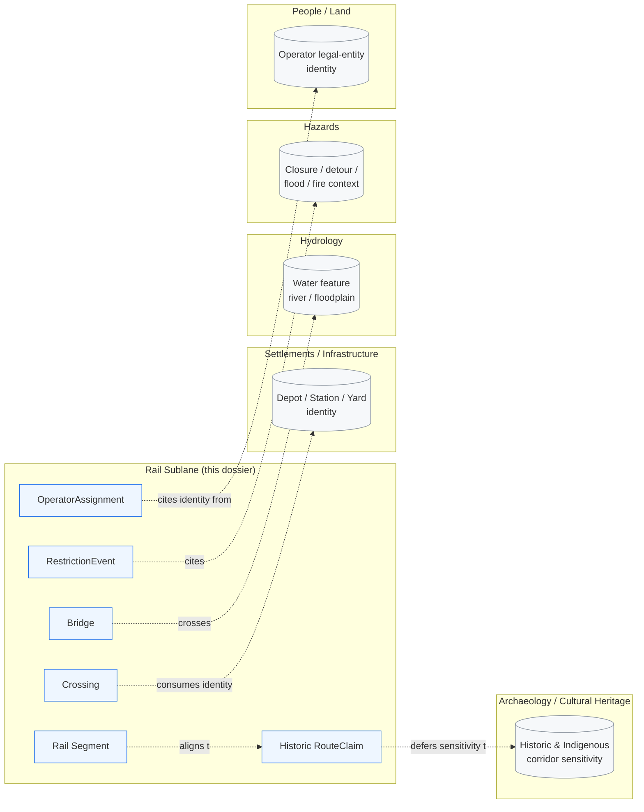
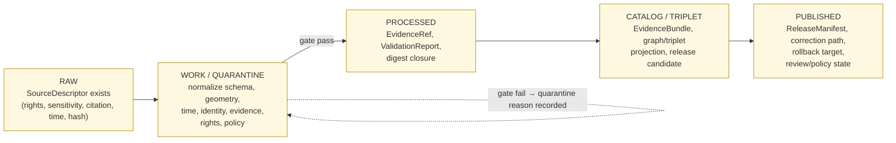

<!-- [KFM_META_BLOCK_V2]
doc_id: kfm://doc/TBD-roads-rail-trade-sublane-rail
title: Roads/Rail/Trade Routes — Rail Sublane Dossier
type: standard
version: v0.1
status: draft
owners: Roads/Rail/Trade Routes domain stewards (TBD — placeholder)
created: 2026-05-19
updated: 2026-05-19
policy_label: public (sublane scaffold) — content tiers vary; operationally sensitive rail detail defaults to deny
related:
  - docs/domains/roads-rail-trade/README.md            # PROPOSED parent dossier
  - docs/domains/roads-rail-trade/sublanes/roads.md    # PROPOSED sibling sublane
  - docs/domains/roads-rail-trade/sublanes/trade.md    # PROPOSED sibling sublane
  - docs/domains/settlements-infrastructure/README.md  # canonical owner of depot/facility identity
  - docs/domains/hydrology/README.md                   # bridge/ferry/ford/river-crossing context
  - docs/domains/archaeology/README.md                 # historic & Indigenous corridor sensitivity
  - docs/doctrine/directory-rules.md                   # placement authority
tags: [kfm, domain, roads-rail-trade, sublane, rail]
notes:
  - "The 'sublanes/' organizational layer is a PROPOSED extension of docs/domains/<domain>/; not yet in Directory Rules."
  - "All path, route, schema, and tooling claims remain PROPOSED until a mounted repository is inspected."
[/KFM_META_BLOCK_V2] -->

# Roads / Rail / Trade Routes — **Rail Sublane Dossier**

> _Governance scaffold for Kansas rail evidence — modern, historic, freight, crossings, facilities, restrictions, and graph projections — within the Roads/Rail/Trade Routes domain lane._

     

<sub><strong>Status:</strong> draft · <strong>Owners:</strong> Roads/Rail/Trade Routes stewards (TBD placeholder) · <strong>Last updated:</strong> 2026-05-19 · <strong>Supersedes:</strong> n/a (first edition)</sub>

> [!IMPORTANT]
> **Scaffolding posture.** This file is the **first edition** of the Rail sublane dossier. The `docs/domains/<domain>/sublanes/` organizational layer is **PROPOSED** — it is not yet enumerated in `docs/doctrine/directory-rules.md`. Until an ADR settles the convention (see [§ O. Verification backlog](#o-verification-backlog-and-open-questions), **OPEN-DR-SUBLANE-01**), treat this dossier as a doctrine **scaffold** that inherits all canonical authority from the parent `[DOM-ROADS]` domain dossier and from Directory Rules. The sublane does **not** own root authority, schema homes, contract homes, policy homes, release surfaces, or governed-API routes.

---

## Quick jump

- [A. Sublane identity & one-line purpose](#a-sublane-identity-and-one-line-purpose)
- [B. Scope, boundary, and explicit non-ownership](#b-scope-boundary-and-explicit-non-ownership)
- [C. Repo fit — parent dossier and responsibility roots](#c-repo-fit--parent-dossier-and-responsibility-roots)
- [D. Ubiquitous language (rail-applicable terms)](#d-ubiquitous-language-rail-applicable-terms)
- [E. Key source families for rail](#e-key-source-families-for-rail)
- [F. Main object families realized in rail](#f-main-object-families-realized-in-rail)
- [G. Cross-lane relations](#g-cross-lane-relations)
- [H. Map and viewing products](#h-map-and-viewing-products)
- [I. Pipeline shape (RAW → PUBLISHED)](#i-pipeline-shape-raw--published)
- [J. Sensitivity, rights, and publication posture](#j-sensitivity-rights-and-publication-posture)
- [K. API, contract, and schema surfaces](#k-api-contract-and-schema-surfaces)
- [L. Validators, tests, fixtures](#l-validators-tests-fixtures)
- [M. Governed AI behavior for the rail sublane](#m-governed-ai-behavior-for-the-rail-sublane)
- [N. Publication, correction, and rollback](#n-publication-correction-and-rollback)
- [O. Verification backlog and open questions](#o-verification-backlog-and-open-questions)
- [Related docs](#related-docs)
- [Appendix — Atlas citation map](#appendix--atlas-citation-map)

---

## A. Sublane identity and one-line purpose

**CONFIRMED doctrine / PROPOSED implementation:** the **Rail sublane** is the rail-mode partition of the Roads/Rail/Trade Routes domain lane (`[DOM-ROADS]`). It governs Kansas rail segments, historic rail alignments, depots, sidings, yards, crossings, rail bridges, operator status, restrictions, and rail-graph projections; it does **not** introduce new lifecycle phases, schema homes, policy homes, or release surfaces. All canonical authority continues to flow through the parent `[DOM-ROADS]` dossier and through Directory Rules. `[DOM-ROADS]` `[ENCY]` `[DIRRULES]`

> [!NOTE]
> **Why a separate sublane file?** The parent domain spans **three mode-families** — roads, rail, and trade routes/corridors — each with distinct source ecosystems, sensitivity surfaces, and viewing products. Decomposing the dossier into per-mode sublane files makes scope, sources, and validators easier to reason about without re-opening the canonical responsibility boundaries. **PROPOSED:** sibling sublane files at `roads.md` and `trade.md` mirror this one.

[↑ back to top](#roads--rail--trade-routes--rail-sublane-dossier)

---

## B. Scope, boundary, and explicit non-ownership

### B.1 In-scope object families (rail-specific realizations)

**CONFIRMED in `[DOM-ROADS]` scope statement / PROPOSED rail-specific realization:** the rail sublane covers, from the parent domain's owned set, these object families when applied to rail evidence:

- **Rail Segment** — track centerlines, alignments, branchlines, mainlines (historic and current).
- **Historic Route / Historic RouteClaim** — historic rail alignments, abandoned lines, predecessor-railroad corridors.
- **Depot, Siding, Yard** — rail-network facility types **whose identity remains settlement/infrastructure-owned** (see [§ G. Cross-lane relations](#g-cross-lane-relations)).
- **Crossing** — at-grade and grade-separated rail-roadway interactions; **highway-rail grade crossings** are the FRA GCIS anchor.
- **Bridge** — rail bridges over water or other infrastructure.
- **CorridorRoute** and **RouteMembership** — multi-segment named rail corridors and segment-to-corridor assignments.
- **Operator Status / OperatorAssignment** — rail-operator (Class I, regional, short-line) ownership and operational control over time.
- **Access Restriction / RestrictionEvent** — embargoes, slow orders, closures, weight/clearance restrictions on rail.
- **Status Event** — rail incidents, outages, service interruptions (sources permitting).
- **Network Edge / Network Node** — rail-graph projections derived from validated evidence.
- **Movement Story Node** — narrative/interpretive nodes tied to rail movement evidence.

`[DOM-ROADS]` `[ENCY]`

### B.2 Explicit non-ownership

**CONFIRMED / PROPOSED:** the rail sublane explicitly does **not** own:

| Concern | Owning lane | Why this matters |
|---|---|---|
| Depot / station / facility canonical identity | Settlements / Infrastructure (`[DOM-SETTLE]`) | A depot **as a place / settlement-infrastructure object** is settlement-owned; the rail sublane consumes that identity and contributes the rail-network role. |
| Water-feature evidence at river crossings | Hydrology (`[DOM-HYD]`) | A rail bridge crosses a hydrologic feature; the feature itself is owned by hydrology. |
| Historic Indigenous corridor truth and sensitivity | Archaeology / Cultural Heritage (`[DOM-ARCH]`) | Where rail alignments overlap or recapitulate Indigenous trade and mobility corridors, the cultural-heritage sensitivity policy of `[DOM-ARCH]` is authoritative. |
| Hazard event truth | Hazards (`[DOM-HAZ]`) | Closures / detours caused by floods, fires, or other hazards are cited from `[DOM-HAZ]`, not authored here. |
| Person / parcel / operator legal-entity facts | People / Land (`[DOM-PEOPLE]`) | Rail-operator identity as a legal entity is people/land-owned; the rail sublane carries the operational-control relation. |

`[DOM-ROADS]` `[DOM-SETTLE]` `[DOM-HYD]` `[DOM-ARCH]` `[DOM-HAZ]` `[DOM-PEOPLE]` `[ENCY]`

[↑ back to top](#roads--rail--trade-routes--rail-sublane-dossier)

---

## C. Repo fit — parent dossier and responsibility roots

### C.1 PROPOSED tree (this sublane in its dossier context)

> [!CAUTION]
> The tree below is **PROPOSED** and **NEEDS VERIFICATION** against a mounted repository. The `roads-rail-trade/` subfolder under `docs/domains/` is **CONFIRMED in `docs/doctrine/directory-rules.md` §6.1** as one of the listed domain dossier subfolders, but the `sublanes/` layer is **not yet enumerated** there. Treat the structure as a working scaffold pending **OPEN-DR-SUBLANE-01** (§ O).

```text
docs/
└── domains/
    └── roads-rail-trade/                     # CONFIRMED in directory-rules.md §6.1 listing
        ├── README.md                         # PROPOSED parent dossier README (NEEDS VERIFICATION)
        ├── ARCHITECTURE.md                   # PROPOSED — parallel to other dossiers
        ├── PRESERVATION_MATRIX.md            # PROPOSED — parallel to other dossiers
        ├── VERIFICATION_BACKLOG.md           # PROPOSED
        └── sublanes/                         # PROPOSED organizational layer — see OPEN-DR-SUBLANE-01
            ├── README.md                     # PROPOSED — sublane index
            ├── roads.md                      # PROPOSED sibling
            ├── rail.md                       # THIS FILE
            └── trade.md                      # PROPOSED sibling
```

### C.2 Canonical responsibility roots this dossier defers to

The rail sublane is a **doctrine surface**, not an authority root. Per `docs/doctrine/directory-rules.md` (CONFIRMED), all of the following remain anchored elsewhere:

| Concern | Canonical root (per Directory Rules) | Status |
|---|---|---|
| Object meaning | `contracts/domains/roads-rail-trade/...` (or whatever the parent domain settles) | PROPOSED — NEEDS VERIFICATION |
| Machine-checkable shape | `schemas/contracts/v1/domains/roads-rail-trade/...` (ADR-0001 default) | PROPOSED — NEEDS VERIFICATION |
| Admissibility / sensitivity | `policy/sensitivity/roads-rail-trade/...` or `policy/release/roads-rail-trade/...` | PROPOSED — NEEDS VERIFICATION |
| Source registry | `control_plane/source_authority_register.yaml` (CONFIRMED root, entries PROPOSED) | PROPOSED — NEEDS VERIFICATION |
| Pipelines | `pipelines/` / `pipeline_specs/` | PROPOSED — NEEDS VERIFICATION |
| Release decisions | `release/` | PROPOSED — NEEDS VERIFICATION |
| Public surface | `apps/governed-api/` | PROPOSED — NEEDS VERIFICATION |

`[DIRRULES]`

> [!NOTE]
> **No parallel homes.** Per Directory Rules §2.4 / §5, the rail sublane MUST NOT introduce a parallel schema, contract, policy, source, registry, release, or proof home. Any new home requires an ADR.

[↑ back to top](#roads--rail--trade-routes--rail-sublane-dossier)

---

## D. Ubiquitous language (rail-applicable terms)

**CONFIRMED terms / PROPOSED field realization** — all terms are inherited from `[DOM-ROADS]` §C and applied within rail evidence; meaning is constrained by source role, evidence, time, and release state. `[DOM-ROADS]` `[ENCY]`

| Term | Rail-specific meaning | Citation |
|---|---|---|
| **Rail Segment** | A linear unit of rail track with a single role/operator/time scope. | `[DOM-ROADS]` |
| **CorridorRoute** | A named multi-segment rail corridor (e.g., a mainline route across multiple operators or eras). | `[DOM-ROADS]` |
| **RouteMembership** | Time-bounded membership of a Rail Segment in a CorridorRoute. | `[DOM-ROADS]` |
| **Network Node** | Junction, switch, interchange, or crossing terminus in the rail graph projection. | `[DOM-ROADS]` |
| **Crossing** | Highway-rail or rail-rail crossing; the GCIS-anchored object for at-grade crossings. | `[DOM-ROADS]` |
| **TransportFacility** | A rail-network facility (depot, station, signal facility, intermodal yard) — **identity owned by Settlements/Infrastructure**, role and rail-network relation owned here. | `[DOM-ROADS]` `[DOM-SETTLE]` |
| **RestrictionEvent** | A time-bounded restriction (embargo, slow order, weight/clearance limit, closure) on a Rail Segment or facility. | `[DOM-ROADS]` |
| **StatusEvent** | An observed rail-status event (incident, outage, service interruption) admissible only with source-role discipline. | `[DOM-ROADS]` |
| **OperatorAssignment** | Time-bounded assignment of an operator (Class I, regional, short-line) to a Rail Segment or CorridorRoute. | `[DOM-ROADS]` |
| **Historic RouteClaim** | A claim about historic rail alignment, recorded with evidence and uncertainty rather than as fact. | `[DOM-ROADS]` |
| **TradeRouteCorridor** | Pre-rail or rail-era trade and mobility corridor that may parallel, anticipate, or interact with rail alignments. | `[DOM-ROADS]` |

> [!TIP]
> **Naming hygiene.** Preserve KFM-specific compound terms (e.g., `Rail Segment`, `RestrictionEvent`, `Historic RouteClaim`) exactly. Do not collapse them into generic industry vocabulary (e.g., "rail link," "incident," "abandoned line") in normative content.

[↑ back to top](#roads--rail--trade-routes--rail-sublane-dossier)

---

## E. Key source families for rail

**CONFIRMED source families / PROPOSED implementation / NEEDS VERIFICATION rights, terms, cadence, and current behavior.** Rights and current terms for every entry below MUST be reviewed in the source registry before activation. `[DOM-ROADS]` `[ENCY]` `[DIRRULES]`

| Source family | Role candidates (per source-role doctrine) | Rail-specific role | Status |
|---|---|---|---|
| **FRA GCIS** (Grade Crossing Inventory System) | authority / observation / context | Canonical inventory of public and private highway-rail grade crossings; safety attributes per crossing. | CONFIRMED in `[DOM-ROADS]` source family ecosystem and Pass-10 C10-05; PROPOSED activation. |
| **FRA Form 57** (incident reports) | authority / observation | Standardized rail incident report; **observation role**, not life-safety authority within KFM. | CONFIRMED in Pass-10 C10-05; PROPOSED activation. |
| **STB Class I weekly reports** | authority (for operational metrics) | Operational metrics from the seven Class I carriers; weekly snapshot cadence with overlap-deduplication concern. | CONFIRMED in Pass-10 C10-05; PROPOSED activation. |
| **HIFLD / NTAD rail layers** | authority / context | Geospatial layers for rail lines, yards, structures. | CONFIRMED in Pass-10 C10-05; PROPOSED activation. |
| **NARN** (North American Rail Network) | authority / context | Rail lines and nodes for topology pairing with GCIS — see card **KFM-P14-PROG-0014**. | CONFIRMED in Pass-32 atlas card KFM-P14-PROG-0014; PROPOSED activation. |
| **OpenStreetMap** (rail features) | observation / context (NOT legal-status authority) | Community-mapped rail features; legal-status joins fail closed. | CONFIRMED in `[DOM-ROADS]` source list; PROPOSED activation; **OSM/GNIS legal-status denial test PROPOSED**. |
| **USGS GNIS names** | authority (place names) | Anchor for facility and place names along rail; vernacular/Indigenous names route to TGN or local authorities. | CONFIRMED in `[DOM-ROADS]` source list; PROPOSED activation. |
| **KDOT / KanPlan / KanDrive / Kansas GIS** | authority / observation (mostly road-oriented) | Context for at-grade crossings, work zones, and rail-roadway interactions in Kansas. | CONFIRMED in `[DOM-ROADS]` source list; PROPOSED activation. |
| **WZDx feeds** | authority / observation | Work-zone events; can include rail-crossing-adjacent closures. | CONFIRMED in `[DOM-ROADS]` source list and Pass-10 C10-04; PROPOSED activation. |
| **County/state bridge & restriction data** | authority / observation | Rail-bridge condition, weight/clearance restriction context where available. | CONFIRMED in `[DOM-ROADS]` source list; PROPOSED activation. |

> [!WARNING]
> **Source-role anti-collapse.** Per Unified Manual §11 (CONFIRMED cross-domain rule), source role **cannot be inferred from convenience**. OpenStreetMap and GNIS are **not legal-status authorities** for rail; STB weekly metrics are **not real-time operational truth**; FRA Form 57 incidents are **observations**, not safety-authority outputs within KFM. Activation must assign each source its correct role before ingest. `[DOM-ROADS]` `[ENCY]`

> [!NOTE]
> **STB snapshot-week handling.** Pass-10 C10-05 warns that STB Class I reports are weekly snapshots that overlap; ingest receipts MUST capture the snapshot-week precisely to prevent downstream double-counting. Treat this as a PROPOSED ingest invariant. `[ENCY]`

[↑ back to top](#roads--rail--trade-routes--rail-sublane-dossier)

---

## F. Main object families realized in rail

**CONFIRMED object purposes / PROPOSED deterministic identity basis / CONFIRMED temporal-time discipline.** Identity rule is inherited from `[DOM-ROADS]` §E: deterministic basis = `source id + object role + temporal scope + normalized digest`. Temporal handling is inherited: source, observed, valid, retrieval, release, and correction times stay distinct where material. `[DOM-ROADS]` `[ENCY]`

| Object | Purpose (within rail) | Identity rule | Temporal handling |
|---|---|---|---|
| Rail Segment | Represents Rail Segment evidence or released derivative within rail. | PROPOSED deterministic. | CONFIRMED multi-time discipline. |
| CorridorRoute | Represents a named multi-segment rail corridor. | PROPOSED deterministic. | CONFIRMED multi-time discipline. |
| RouteMembership | Represents segment-to-corridor membership with temporal scope. | PROPOSED deterministic. | CONFIRMED multi-time discipline. |
| Network Node | Represents rail-graph junction/switch/interchange. | PROPOSED deterministic. | CONFIRMED multi-time discipline. |
| Crossing | Represents a highway-rail crossing (GCIS-anchored when available). | PROPOSED deterministic. | CONFIRMED multi-time discipline. |
| Bridge | Represents a rail bridge (with hydrology cross-lane relation when over water). | PROPOSED deterministic. | CONFIRMED multi-time discipline. |
| TransportFacility (rail role) | Represents a rail-network facility role over a settlement-owned identity. | PROPOSED deterministic. | CONFIRMED multi-time discipline. |
| RestrictionEvent | Represents an embargo, slow order, or closure on rail evidence. | PROPOSED deterministic. | CONFIRMED multi-time discipline. |
| StatusEvent | Represents a rail-status observation from an admissible source role. | PROPOSED deterministic. | CONFIRMED multi-time discipline. |
| OperatorAssignment | Represents time-bounded operator control over a Rail Segment or CorridorRoute. | PROPOSED deterministic. | CONFIRMED multi-time discipline. |
| Historic RouteClaim | Represents a historic rail-alignment claim with evidence and uncertainty. | PROPOSED deterministic. | CONFIRMED multi-time discipline. |

[↑ back to top](#roads--rail--trade-routes--rail-sublane-dossier)

---

## G. Cross-lane relations

**CONFIRMED / PROPOSED:** every cross-lane relation must preserve ownership, source role, sensitivity, and EvidenceBundle support. `[DOM-ROADS]` `[ENCY]`



<sub>**Diagram status:** PROPOSED visualization. Relations are CONFIRMED in doctrine via `[DOM-ROADS]` §F; the rendering is illustrative and **NEEDS VERIFICATION** against a mounted contract/schema layer.</sub>

| This sublane | Related lane | Relation type | Constraint |
|---|---|---|---|
| Rail | Settlements / Infrastructure | Depot, yard, station, signal-facility identity → rail-network role. | Must preserve ownership and EvidenceBundle support. |
| Rail | Hydrology | Rail-bridge / ford / river-crossing geometry. | Must preserve ownership and EvidenceBundle support. |
| Rail | Hazards | Closures, detours, flood/fire/smoke exposure on rail. | Must preserve ownership and EvidenceBundle support; KFM is **never** an alert authority. |
| Rail | Archaeology / Cultural Heritage | Historic rail alignments paralleling Indigenous corridors; cultural-heritage sensitivity policy is authoritative. | Default-deny on exact location for sensitive cultural overlap. |
| Rail | People / Land | Rail-operator legal-entity identity. | Living-person and operator-entity facts deferred to `[DOM-PEOPLE]`. |
| Rail | Roads (sibling sublane) | Highway-rail crossing geometry shared with road segments. | Crossing object resolves on both sides; identity remains one Crossing per real-world feature. |
| Rail | Trade (sibling sublane) | Historic rail alignments interacting with pre-rail TradeRouteCorridors. | Two object families; uncertainty discipline preserved. |

`[DOM-ROADS]` `[DOM-SETTLE]` `[DOM-HYD]` `[DOM-HAZ]` `[DOM-ARCH]` `[DOM-PEOPLE]` `[ENCY]`

[↑ back to top](#roads--rail--trade-routes--rail-sublane-dossier)

---

## H. Map and viewing products

**PROPOSED** rail-mode viewing products inherited from `[DOM-ROADS]` §G:

- Rail alignment layer (modern + historic eras with time-aware state).
- Highway-rail crossing layer (GCIS-anchored where available).
- Rail-facility / yard / depot context view (settlement-identity-linked).
- Operator/Status timeline (Class I / regional / short-line over time).
- Restriction/embargo timeline.
- Freight-corridor context (HIFLD/NTAD/NARN derived).
- Historic rail claim view with uncertainty surface.
- Derived rail-graph / connectivity view (clearly labeled as derived).

**CONFIRMED doctrine** for every viewing product: cross-cutting viewing products include **Evidence Drawer**, **time-aware state**, **trust badges**, **sensitivity-redacted view**, **correction/stale-state view**, and **governed Focus Mode**. `[MAP-MASTER]` `[GAI]`

> [!IMPORTANT]
> **Derived layers are not canonical.** Rail-graph projections, connectivity views, and shortest-path overlays are **derived layers**, never the source of truth. Public clients see them through the governed API; canonical records remain the rail segments and their EvidenceBundles. `[DIRRULES]` `[GAI]`

[↑ back to top](#roads--rail--trade-routes--rail-sublane-dossier)

---

## I. Pipeline shape (RAW → PUBLISHED)

**CONFIRMED doctrine / PROPOSED lane application:** the rail sublane inherits the canonical lifecycle from `[DOM-ROADS]` §H without modification. Promotion is a **governed state transition**, not a file move. `[DIRRULES]` `[DOM-ROADS]` `[ENCY]`



| Stage | Handling (rail-specific notes) | Gate | Status |
|---|---|---|---|
| **RAW** | Capture immutable FRA / STB / HIFLD / NTAD / NARN / OSM / GNIS / KDOT payloads or references with source role, rights, sensitivity, citation, time, and hash. STB snapshot-week MUST be captured in the receipt. | SourceDescriptor exists. | PROPOSED |
| **WORK / QUARANTINE** | Normalize rail-segment geometry, GCIS-anchored crossing identity, time, operator assignment, evidence, rights, policy; hold failures. | Validation and policy gate pass, or quarantine reason recorded. | PROPOSED |
| **PROCESSED** | Emit validated normalized rail objects, receipts, and public-safe candidates. | EvidenceRef, ValidationReport, digest closure exist. | PROPOSED |
| **CATALOG / TRIPLET** | Emit catalog records, EvidenceBundles, rail-graph triplet projections, release candidates. | Catalog / proof closure passes. | PROPOSED |
| **PUBLISHED** | Serve released public-safe rail artifacts (alignment layers, crossing layer, historic-claim view) through governed APIs and manifests. | ReleaseManifest, correction path, rollback target, review/policy state exist. | PROPOSED |

`[DIRRULES]` `[DOM-ROADS]` `[ENCY]`

[↑ back to top](#roads--rail--trade-routes--rail-sublane-dossier)

---

## J. Sensitivity, rights, and publication posture

**CONFIRMED / PROPOSED defaults** inherited from `[DOM-ROADS]` §I and from cross-domain doctrine:

- **Indigenous trade and mobility corridors** that overlap historic rail alignments default to **steward review** and **generalized public geometry**. `[DOM-ROADS]` `[DOM-ARCH]` `[ENCY]`
- **Critical transport facilities** (major yards, intermodal terminals, signal facilities) require review before precise public exposure. `[DOM-ROADS]` `[DOM-SETTLE]`
- **Operational rail status / real-time incident detail** defaults to **deny / generalize** until role and review states are settled; KFM is **not** an alert authority. `[DOM-HAZ]` `[DOM-ROADS]` `[ENCY]`
- **Operator-identity living-person fields** (if any leak through STB or other sources) defer to `[DOM-PEOPLE]` consent/redaction discipline. `[DOM-PEOPLE]`
- **CONFIRMED doctrine:** unclear rights, unresolved source role, missing evidence, unresolved sensitivity, or absent release state **blocks public promotion**. `[ENCY]` `[DIRRULES]`

> [!WARNING]
> **Default-deny on operational rail detail.** Real-time or near-real-time rail-incident detail, precise yard / signal-facility schematics, and operator-internal embargo notices default to **deny / redact / generalize**. Record transforms and reasons via **Redaction Receipt**. `[ENCY]`

[↑ back to top](#roads--rail--trade-routes--rail-sublane-dossier)

---

## K. API, contract, and schema surfaces

**PROPOSED governed-API surfaces** (route names UNKNOWN — exact routes are decided in the parent domain and the governed-API app, not here):

| Endpoint or artifact (PROPOSED) | DTO / schema (PROPOSED) | Outcomes (CONFIRMED finite set per `[GAI]`) | Status |
|---|---|---|---|
| Rail feature / detail resolver | RoadsRailDecisionEnvelope (rail-typed) | ANSWER / ABSTAIN / DENY / ERROR | PROPOSED; exact route UNKNOWN. |
| Rail layer manifest resolver | LayerManifest / domain layer descriptor (rail-typed) | ANSWER / DENY / ERROR | PROPOSED; public-safe release only. |
| Rail Evidence Drawer payload | EvidenceDrawerPayload + EvidenceBundle projection | ANSWER / ABSTAIN / DENY / ERROR | PROPOSED; evidence and policy filtered. |
| Rail Focus Mode answer | Runtime Response Envelope + AIReceipt | ANSWER / ABSTAIN / DENY / ERROR | PROPOSED; AI never root truth. |
| Schema responsibility root | `schemas/contracts/v1/...` (ADR-0001 default) | finite validator outcomes | PROPOSED; verify with Directory Rules and ADR-0001. |

`[DOM-ROADS]` `[GAI]` `[DIRRULES]`

[↑ back to top](#roads--rail--trade-routes--rail-sublane-dossier)

---

## L. Validators, tests, fixtures

**PROPOSED** rail-mode validators and tests (inheriting and specializing the `[DOM-ROADS]` §K list). All are PROPOSED until project evidence places them in `schemas/tests/`, `policy/`, or `tests/fixtures/`:

- Route membership and designation separation tests (rail corridors vs. segments).
- Operator/status temporal tests (overlapping assignments, succession events).
- **OSM/GNIS legal-status denial test** for rail (community-source-as-authority is a closed gate).
- Historic-overprecision denial test (no false-precision on historic alignments).
- Public generalization receipt tests (Redaction Receipt for sensitive alignments).
- Transport-graph projection rollback tests (derived layers can be repointed without losing canonical truth).
- **PROPOSED (rail-specific):** STB snapshot-week deduplication test (per Pass-10 C10-05 warning).
- **PROPOSED (rail-specific):** FRA GCIS vs. HIFLD coordinate-conflict resolution test (per Pass-10 C10-05 open question).
- **PROPOSED (rail-specific):** GCIS↔NARN topology pairing test (per card KFM-P14-PROG-0014).

`[DOM-ROADS]` `[ENCY]`

[↑ back to top](#roads--rail--trade-routes--rail-sublane-dossier)

---

## M. Governed AI behavior for the rail sublane

**CONFIRMED doctrine / PROPOSED implementation:** AI may

- summarize released rail EvidenceBundles;
- compare evidence across rail sources;
- explain limitations and uncertainty;
- draft steward-review notes.

AI **must ABSTAIN** when evidence is insufficient, and **must DENY** where policy, rights, sensitivity, or release state blocks the request. AI is never the root truth source; EvidenceBundle outranks generated language. `[GAI]` `[DOM-ROADS]` `[ENCY]`

> [!IMPORTANT]
> **AIReceipt required on Focus Mode.** Every rail Focus Mode answer must carry an **AIReceipt** with bounded confidence, evidence references, and a finite outcome (ANSWER / ABSTAIN / DENY / ERROR). `[GAI]`

[↑ back to top](#roads--rail--trade-routes--rail-sublane-dossier)

---

## N. Publication, correction, and rollback

**CONFIRMED doctrine / PROPOSED implementation:** rail publication requires **ReleaseManifest**, **EvidenceBundle**, validation/policy support, review state where required, **correction path**, **stale-state rule**, and **rollback target**. Publication is **never** a file move; it is a governed state transition recorded by **PromotionDecision** and reversed by **RollbackCard**. `[ENCY Appendix E]` `[DOM-ROADS]` `[ENCY]` `[DIRRULES]`

| Mechanism | Purpose | Status |
|---|---|---|
| ReleaseManifest | Records released rail artifacts and the gates they passed. | PROPOSED |
| EvidenceBundle | Resolves every public rail claim's EvidenceRef. | PROPOSED |
| PromotionDecision | Records the governed transition into PUBLISHED. | PROPOSED |
| RollbackCard | Names the rollback target and preserves history while repointing release state. | PROPOSED |
| Correction Notice | Records corrections to released rail artifacts without rewriting history. | PROPOSED |
| Redaction Receipt | Records any public-safe geometry or field transformation. | PROPOSED |

[↑ back to top](#roads--rail--trade-routes--rail-sublane-dossier)

---

## O. Verification backlog and open questions

### O.1 Domain-inherited items (from `[DOM-ROADS]` §N)

| Item to verify | Evidence that would settle it | Status |
|---|---|---|
| Verify KDOT / FHWA / FRA / WZDx / source rights and terms. | Mounted repo source registry, schemas, tests, logs, emitted artifacts, review records, or release manifests. | NEEDS VERIFICATION |
| Verify Indigenous / cultural corridor policy on rail overlap. | Mounted repo `policy/sensitivity/` and `[DOM-ARCH]` review records. | NEEDS VERIFICATION |
| Implement RouteUncertaintyProfile for historic rail claims. | Mounted repo schemas / contracts / tests. | NEEDS VERIFICATION |
| Verify transport graph and MapLibre integration for rail. | Mounted repo `packages/maplibre/`, `apps/explorer-web/`, layer manifests. | NEEDS VERIFICATION |

### O.2 New (this dossier)

| ID | Question | Why it's open | Suggested resolution |
|---|---|---|---|
| **OPEN-DR-SUBLANE-01** | Should `docs/domains/<domain>/sublanes/` be a canonical organizational layer, or should multi-mode domains use a different decomposition (e.g., chapter files, atlas extensions, or flat sibling READMEs)? | The `sublanes/` layer is not in `docs/doctrine/directory-rules.md` §6.1. Parallel to **OPEN-DR-02** (runbooks subfolder vs flat) and **OPEN-DR-01** (PROV vs PROVENANCE naming). | ADR. Until resolved, treat this dossier as a scaffold that defers all canonical authority to the parent `[DOM-ROADS]` dossier. |
| **OPEN-DR-SUBLANE-02** | Naming and casing for sublane filenames. | This file uses lowercase `rail.md`; sibling sublanes likely follow. Pattern mismatch is possible with other docs (e.g., `ISO-19115.md` UPPERCASE). | Per-root README decision documented under §6.1.a equivalent of Directory Rules. |
| **OPEN-RAIL-01** | GCIS vs HIFLD coordinate-disagreement policy for the same crossing. | Pass-10 C10-05 open question; rail-specific. | Validator rule + sensitivity-aware default; documented in the parent domain README and this sublane. |
| **OPEN-RAIL-02** | STB Class I snapshot-week deduplication contract. | Pass-10 C10-05 warning; rail-specific ingest invariant. | Receipt invariant + ingest test. |
| **OPEN-RAIL-03** | Operational-rail-detail sensitivity tier (yard schematics, signal facilities, real-time embargo). | Default-deny is doctrinally clear; the **specific tier (T0–T4)** and review cadence are not yet set for rail. | ADR-S-05 (sensitivity tier scheme) downstream. |
| **OPEN-RAIL-04** | Pairing of FRA GCIS crossings with NARN rail lines/nodes. | Pass-32 card **KFM-P14-PROG-0014** PROPOSES the pairing but does not prove repo implementation. | Pipeline spec + validator + test fixture. |

[↑ back to top](#roads--rail--trade-routes--rail-sublane-dossier)

---

## Related docs

- `docs/domains/roads-rail-trade/README.md` — PROPOSED parent dossier (NEEDS VERIFICATION in repo).
- `docs/domains/roads-rail-trade/sublanes/roads.md` — PROPOSED sibling sublane.
- `docs/domains/roads-rail-trade/sublanes/trade.md` — PROPOSED sibling sublane.
- `docs/domains/settlements-infrastructure/README.md` — depot / station / facility identity owner.
- `docs/domains/hydrology/README.md` — bridge / ferry / ford / river-crossing context.
- `docs/domains/archaeology/README.md` — historic + Indigenous corridor sensitivity authority.
- `docs/domains/hazards/README.md` — closure / detour / flood / fire / smoke event context.
- `docs/domains/people-dna-land/README.md` — operator legal-entity identity authority.
- `docs/doctrine/directory-rules.md` — placement and lifecycle authority (CONFIRMED root listing for `docs/domains/roads-rail-trade/`).
- `docs/standards/PROV.md` — provenance reference (naming variance with `PROVENANCE.md` per **OPEN-DR-01**).
- `docs/registers/VERIFICATION_BACKLOG.md` — destination for items above once triaged.
- `docs/adr/` — destination for **OPEN-DR-SUBLANE-01** resolution and any rail-specific structural ADR.

---

## Appendix — Atlas citation map

<details>
<summary><strong>Open: short-name citations used in this dossier</strong></summary>

| Short-name | Source | Role in this dossier |
|---|---|---|
| `[DOM-ROADS]` | Roads / Rail / Trade Routes dossier | Primary domain dossier; this sublane inherits scope, terminology, source families, object families, cross-lane relations, pipeline shape, governed-AI rules, publication discipline, and the verification backlog. |
| `[DOM-SETTLE]` | Settlements / Infrastructure dossier | Owner of depot / station / facility canonical identity. |
| `[DOM-HYD]` | Hydrology dossier | Owner of water-feature evidence under rail bridges. |
| `[DOM-HAZ]` | Hazards dossier | Owner of closure / detour / flood / fire / smoke event context cited by rail. |
| `[DOM-ARCH]` | Archaeology / Cultural Heritage dossier | Sensitivity authority for historic and Indigenous corridor overlap. |
| `[DOM-PEOPLE]` | People / Genealogy / DNA / Land Ownership dossier | Authority for operator legal-entity identity and any living-person fields. |
| `[ENCY]` | KFM Encyclopedia | Master domain / object / source / capability spine; lifecycle and EvidenceBundle doctrine. |
| `[DIRRULES]` | Directory Rules | Placement and lifecycle authority; CONFIRMED root listing of `docs/domains/roads-rail-trade/`. |
| `[MAP-MASTER]` | MapLibre Master | Renderer, tiles, Evidence Drawer, Focus Mode doctrine; cross-cutting viewing products. |
| `[GAI]` | Governed AI dossier | AIReceipt doctrine; finite outcomes (ANSWER / ABSTAIN / DENY / ERROR). |

</details>

<details>
<summary><strong>Open: card-level references (Pass 10 / Pass 23–32)</strong></summary>

- **Pass-10 C10-05 — Rail Stack: FRA GCIS, FRA Form 57, STB Class I, HIFLD, NTAD** (CONFIRMED).
- **Pass-10 C10-04 — Transit Stack: GTFS, GTFS-rt, KCATA, KanDrive, WZDx** (CONFIRMED; tangential for rail-crossing-adjacent work-zone events).
- **KFM-P14-PROG-0014 — FRA GCIS NARN rail-crossing topology package** (PROPOSED; carried forward through Pass 32).
- **KFM-P20-PROG-0013 — Frontier routes FeatureCollection builder** (PROPOSED; includes depots and historic transport corridors).

Atlas v1.1 page-range references for `[DOM-ROADS]` (Chapter 13): p. 82 onward in the v1.0 interior.

</details>

<details>
<summary><strong>Open: doctrine boundaries this dossier MUST NOT bend</strong></summary>

- The rail sublane MUST NOT introduce a parallel schema, contract, policy, source, registry, release, or proof home (Directory Rules §2.4 / §5).
- The rail sublane MUST NOT publish via a path that bypasses the governed API (`apps/governed-api/`).
- The rail sublane MUST NOT collapse generation and approval into one unreviewed path.
- The rail sublane MUST NOT treat derived rail-graph layers as sovereign truth.
- The rail sublane MUST NOT claim repo maturity, route names, deployed behavior, test coverage, or CI enforcement without mounted-repo evidence.

`[DIRRULES]` `[ENCY]` `[GAI]`

</details>

---

**Related:** [Roads/Rail/Trade Routes README](../README.md) · [Roads sublane](./roads.md) · [Trade sublane](./trade.md) · [Directory Rules](../../../doctrine/directory-rules.md)

**Last updated:** 2026-05-19 · **Edition:** v0.1 (first edition) · **Supersedes:** n/a

[↑ back to top](#roads--rail--trade-routes--rail-sublane-dossier)
