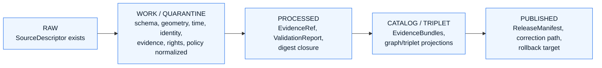

<!-- [KFM_META_BLOCK_V2]
doc_id: kfm://doc/docs-domains-roads-rail-trade-sublanes-roads
title: Roads Sublane — Roads, Rail, and Trade Routes Domain Dossier
type: standard
version: v0.1
status: draft
owners: <Roads/Rail/Trade Routes domain steward — TBD>
created: 2026-05-19
updated: 2026-05-19
policy_label: public
related:
  - docs/domains/roads-rail-trade/README.md
  - docs/domains/roads-rail-trade/sublanes/rail.md
  - docs/domains/roads-rail-trade/sublanes/trade-routes.md
  - docs/doctrine/directory-rules.md
  - docs/architecture/governed-api.md
  - docs/adr/ADR-0001-schema-home.md
tags: [kfm, domain, roads, transport, sublane]
notes:
  - Sublane subdivision under docs/domains/<domain>/ is PROPOSED structure; not in Directory Rules.
  - Implementation-layer paths (schemas/, policy/, packages/, pipelines/) remain PROPOSED until mounted-repo verification.
  - Slug variance "roads-rail-trade" (Directory Rules §6.1) vs "transport" (encyclopedia schema-home shorthand) flagged in §13.
[/KFM_META_BLOCK_V2] -->

# Roads Sublane — Roads, Rail, and Trade Routes Domain

> Modern public-road evidence inside the Roads, Rail, and Trade Routes domain — its scope, source families, object spine, lifecycle, sensitivity posture, governed surfaces, and verification backlog.

<p align="left">
  
  
  
  
  
  
  
</p>

**Status:** draft · **Parent dossier:** [`docs/domains/roads-rail-trade/`](../README.md) · **Owners:** Roads/Rail/Trade Routes steward — `TBD` · **Last updated:** 2026-05-19

---

## Quick navigation

- [1. Sublane in context](#1-sublane-in-context)
- [2. Scope, boundary, and explicit non-ownership](#2-scope-boundary-and-explicit-non-ownership)
- [3. Ubiquitous language (roads sublane)](#3-ubiquitous-language-roads-sublane)
- [4. Source families](#4-source-families)
- [5. Object families](#5-object-families)
- [6. Lifecycle — RAW → PUBLISHED](#6-lifecycle--raw--published)
- [7. Sensitivity, rights, and publication posture](#7-sensitivity-rights-and-publication-posture)
- [8. API, contract, and schema surfaces](#8-api-contract-and-schema-surfaces)
- [9. Validators, tests, fixtures](#9-validators-tests-fixtures)
- [10. Governed AI behavior](#10-governed-ai-behavior)
- [11. Cross-lane and cross-sublane relations](#11-cross-lane-and-cross-sublane-relations)
- [12. Map and viewing products](#12-map-and-viewing-products)
- [13. Open questions and verification backlog](#13-open-questions-and-verification-backlog)
- [14. Related docs](#14-related-docs)

---

## 1. Sublane in context

This file documents the **Roads sublane** — the slice of the Roads, Rail, and Trade Routes domain that owns evidence and released derivatives for **modern public roads**: road segments, route designations and memberships, road-aligned crossings, road-aligned restriction and status events, road-aligned transport facilities, and the road-side of bridge/ferry/river-crossing relationships. The sister sublanes — `rail.md` and `trade-routes.md` (PROPOSED filenames) — own rail-segment and historic/trade-corridor evidence respectively. All three sublanes share the same parent dossier, the same source-role doctrine, and the same lifecycle invariant. **[CONFIRMED domain scope from [DOM-ROADS] [ENCY]; PROPOSED sublane subdivision.]**

> [!IMPORTANT]
> **The `sublanes/` subdirectory is PROPOSED structure, not Directory Rules canon.**
> Directory Rules §12 ("Domain Placement Law") prescribes `docs/domains/<domain>/` as the dossier home and pins `roads-rail-trade` as the canonical domain slug, but does **not** define a `sublanes/` subdirectory pattern. This file proceeds on the assumption that subdividing a broad bounded context into named sublanes is a reasonable organizational choice; the choice itself should be ratified by either the domain README or a small ADR before `sublanes/` is treated as canonical. Until then, treat the path `docs/domains/roads-rail-trade/sublanes/roads.md` as `PROPOSED / NEEDS VERIFICATION`. [DIRRULES]

### 1.1 Why a Roads sublane

The parent domain — `roads-rail-trade` — is unusually broad: it bundles three distinct temporal and authority regimes under one bounded context. The Unified Implementation Architecture Build Manual flags this directly, noting that **PROPOSED pipelines should normalize modern and historic transport evidence separately, create derived graph projections, and prevent routing/traversal graphs from replacing canonical records**. [DOM-ROADS via UNIFIED §6.8] The sublane split is the docs-side reflection of that pipeline-side separation: modern roads, modern rail, and historic / trade routes have different source authorities, different freshness regimes, and different sensitivity defaults. Keeping them in one undifferentiated dossier blurs all three.

### 1.2 Three sublanes — at a glance

| Sublane | Owns (CONFIRMED scope per [DOM-ROADS]) | Dominant source-role posture | Sibling file (PROPOSED) |
|---|---|---|---|
| **Roads** *(this file)* | Road Segment; road-side of Bridge / Ferry / River Crossing; road-aligned Crossing, RestrictionEvent, StatusEvent, OperatorAssignment, TransportFacility; modern RouteMembership and CorridorRoute | authority / observation (modern) | — |
| **Rail** | Rail Segment; Depot; Siding; Yard; rail-aligned Crossing / Bridge; rail RestrictionEvent / StatusEvent / OperatorAssignment; Freight Corridor (rail) | authority / observation (modern) | `sublanes/rail.md` |
| **Trade routes & historic alignments** | Historic Route; Historic RouteClaim; TradeRouteCorridor; Movement Story Node; cross-period RouteMembership | claim / interpretive (historic) | `sublanes/trade-routes.md` |

> [!NOTE]
> The sibling filenames above are PROPOSED. The Directory Rules and parent dossier should ratify whether the trade-route sublane lives at `trade-routes.md`, `historic-routes.md`, or `routes-historic.md` before either filename is treated as canonical.

[↑ back to top](#roads-sublane--roads-rail-and-trade-routes-domain)

---

## 2. Scope, boundary, and explicit non-ownership

### 2.1 What this sublane owns

CONFIRMED scope (subset of [DOM-ROADS] domain scope, narrowed to modern roads):

- **Road Segment** — the canonical road-edge evidence object, carrying source role, geometry fingerprint, observed/valid/release/correction times, and EvidenceRef closure.
- **Road-aligned RouteMembership** — joins a Road Segment to a CorridorRoute (e.g., a numbered route, a designated truck route, a national highway-system membership) **without** collapsing membership into the segment itself.
- **Road-aligned CorridorRoute** — the route as a thing in its own right, distinct from any single underlying segment.
- **Road-aligned Crossing, Bridge, Ferry, River Crossing** — the road-side claim. The structural identity of a bridge usually belongs jointly with `settlements-infrastructure` (which owns *infrastructure asset* identity); this sublane owns the road-traffic-evidence side of the relationship. **[CONFIRMED cross-lane rule from [DOM-ROADS] F-table.]**
- **Road RestrictionEvent / StatusEvent / OperatorAssignment** — temporal events bound to a Road Segment, a CorridorRoute, a Crossing, or a TransportFacility.
- **Road-aligned TransportFacility** — facilities whose road-traffic role is the dominant interpretation (e.g., a weigh station, a rest area, a port-of-entry's road side). Facilities with primary settlement identity remain settlement-owned.
- **Road-side of Movement Story Node, Network Node, Network Edge** when those nodes/edges describe road-mode movement.

### 2.2 What this sublane explicitly does not own

CONFIRMED non-ownership (inherited from [DOM-ROADS] parent rule):

- **Settlement and infrastructure canonical identity** stays with `settlements-infrastructure` — depots, bridges as assets, crossings as facilities, freight terminals. [DOM-SETTLE] [DOM-ROADS]
- **Water evidence** — rivers, fords, floods, regulatory floodplain — stays with `hydrology`, even where a road crosses or is closed by water. [DOM-HYD] [DOM-ROADS]
- **Cultural and Indigenous corridor truth and sensitivity policy** stays with `archaeology` and the trade-routes sublane (PROPOSED). Modern-roads evidence MUST NOT silently absorb cultural-route claims. [DOM-ARCH] [DOM-ROADS]
- **Hazard event truth** — closures, detour reasons, flood/fire/smoke exposure — stays with `hazards`; this sublane consumes hazard context, never publishes it as an alert authority. [DOM-HAZ] [DOM-ROADS]
- **Rail-specific objects** stay with the Rail sublane.
- **Historic / trade-route claim objects** stay with the trade-routes sublane.

> [!WARNING]
> **Source-role anti-collapse.** Per the [ENCY] cross-domain rule and the [DOM-ROADS] anti-pattern register, a community-science or generic geographic source is not a legal-status authority. **OpenStreetMap and GNIS MUST NOT confer legal route designation, jurisdiction, or operator identity** on a Road Segment in this sublane; they can supply geometry, names, and context only. [DOM-ROADS K-tests; ENCY §24.9.2]

[↑ back to top](#roads-sublane--roads-rail-and-trade-routes-domain)

---

## 3. Ubiquitous language (roads sublane)

CONFIRMED terms (from [DOM-ROADS] §C) used inside this sublane; field realization in any specific contract or schema is PROPOSED until verified in `schemas/contracts/v1/...`.

| Term | One-line definition (CONFIRMED meaning) | Field realization | Citation |
|---|---|---|---|
| **Road Segment** | Evidence or released derivative of a road edge, constrained by source role, evidence, time, and release state. | PROPOSED | [DOM-ROADS] [ENCY] |
| **CorridorRoute** | A route as an entity in its own right — the thing a sign or designation refers to — separable from any single segment. | PROPOSED | [DOM-ROADS] [ENCY] |
| **RouteMembership** | Relationship attaching a segment to a CorridorRoute under a stated source role and temporal scope. | PROPOSED | [DOM-ROADS] [ENCY] |
| **Network Node** | A topological node (intersection, junction, terminus) in the road network projection. | PROPOSED | [DOM-ROADS] [ENCY] |
| **Crossing** | A grade-crossing or interchange evidence object; road-side perspective in this sublane. | PROPOSED | [DOM-ROADS] [ENCY] |
| **TransportFacility** | Facility whose role is bounded by source role, evidence, time, and release state; road-aligned facilities only. | PROPOSED | [DOM-ROADS] [ENCY] |
| **RestrictionEvent** | Temporal event constraining traffic on a segment, route, or crossing (weight, width, closure, lane). | PROPOSED | [DOM-ROADS] [ENCY] |
| **StatusEvent** | Temporal event describing operational state (open, restricted, in-construction). | PROPOSED | [DOM-ROADS] [ENCY] |
| **OperatorAssignment** | Time-bound relationship between an operator (e.g., KDOT, county) and a segment / facility. | PROPOSED | [DOM-ROADS] [ENCY] |

> [!TIP]
> **Designation is not membership; membership is not segment.** A common modeling failure is to flatten "this segment IS US-50" into a single denormalized field. KFM keeps three things distinct: the segment (geometry + identity), the route (designation as an entity), and the membership (a sourced, temporal claim that the segment belongs to that route). Validators in §9 enforce the separation. [DOM-ROADS K-tests]

[↑ back to top](#roads-sublane--roads-rail-and-trade-routes-domain)

---

## 4. Source families

CONFIRMED source families from [DOM-ROADS] §D, narrowed to those whose primary role is modern road evidence. Source role is fixed at admission and is **never** upgraded by promotion; rights and current terms remain `NEEDS VERIFICATION` until each source descriptor and source-activation decision is mounted-repo-verified. [DOM-ROADS] [ENCY §24.9.3]

| Source family | Plausible roles (one per descriptor) | Rights / sensitivity | Freshness regime | Status |
|---|---|---|---|---|
| **Census TIGER/Line roads** | authority / observation / context / model — pick one per source descriptor | rights NEEDS VERIFICATION; sensitive joins fail closed | source-vintage | CONFIRMED listing; descriptor PROPOSED [DOM-ROADS] [ENCY] |
| **FHWA HPMS** | authority / observation / context / model — per descriptor | rights NEEDS VERIFICATION | annual cadence (per source) NEEDS VERIFICATION | CONFIRMED listing; descriptor PROPOSED [DOM-ROADS] [ENCY] |
| **FHWA National Highway Freight Network** | authority / observation / context / model — per descriptor | rights NEEDS VERIFICATION | cadence NEEDS VERIFICATION | CONFIRMED listing; descriptor PROPOSED [DOM-ROADS] [ENCY] |
| **WZDx feeds** | authority / observation / context — work-zone / restriction events | rights NEEDS VERIFICATION; live-event cadence may be operationally current | event-driven | CONFIRMED listing; descriptor PROPOSED [DOM-ROADS] [ENCY] |
| **KDOT / KanPlan / KanDrive / Kansas GIS** | authority / observation / context — state authority for many Kansas roads | rights NEEDS VERIFICATION | cadence NEEDS VERIFICATION | CONFIRMED listing; descriptor PROPOSED [DOM-ROADS] [ENCY] |
| **County / state bridge and restriction data** | authority / observation / context | rights NEEDS VERIFICATION; some fields may be sensitive (load posting, structural condition) | cadence NEEDS VERIFICATION | CONFIRMED listing; descriptor PROPOSED [DOM-ROADS] [ENCY] |
| **GNIS names** | context — gazetteer names only | open per USGS terms (NEEDS VERIFICATION) | snapshot cadence | CONFIRMED listing; descriptor PROPOSED [DOM-ROADS] [ENCY] |
| **OpenStreetMap** | observation / context — community geometry and tags | ODbL terms NEEDS VERIFICATION; **MUST NOT** be promoted to legal-status authority | continuous | CONFIRMED listing; descriptor PROPOSED [DOM-ROADS] [ENCY] |

> [!CAUTION]
> **WZDx and other live event feeds are not life-safety alert authorities.** KFM consumes WZDx and equivalent road-restriction feeds as observation evidence; the trust membrane forbids KFM from being the alert/instruction authority for road closures or emergency detours. The same emergency-alert boundary the Hazards lane carries applies to road-restriction publication: status is shown, but operational reliance is denied. [DOM-HAZ retained boundary, [ENCY] §24.4.10; DOM-ROADS]

[↑ back to top](#roads-sublane--roads-rail-and-trade-routes-domain)

---

## 5. Object families

CONFIRMED object-family spine from [DOM-ROADS] §E, narrowed to objects materially involved in modern road evidence. **Identity rule** and **temporal handling** rows are direct restatements of the parent-dossier rules.

| Object | Purpose (within Roads sublane) | Identity rule | Temporal handling | Status |
|---|---|---|---|---|
| **Road Segment** | Represents Road Segment evidence or released derivative within Roads/Rail (road-mode). | PROPOSED deterministic basis: `source id + object role + temporal scope + normalized digest` | CONFIRMED: source, observed, valid, retrieval, release, and correction times stay distinct where material. | CONFIRMED object / PROPOSED implementation [DOM-ROADS] [ENCY] |
| **CorridorRoute** *(road-mode)* | Represents a road-mode CorridorRoute as an entity, separable from any underlying segment. | PROPOSED as above. | CONFIRMED temporal handling as above. | CONFIRMED object / PROPOSED implementation [DOM-ROADS] [ENCY] |
| **RouteMembership** *(road-mode)* | Sourced, temporal claim that a Road Segment belongs to a CorridorRoute. | PROPOSED as above. | CONFIRMED temporal handling as above. | CONFIRMED object / PROPOSED implementation [DOM-ROADS] [ENCY] |
| **Network Node** *(road-mode)* | Road-network topology node. | PROPOSED as above. | CONFIRMED temporal handling as above. | CONFIRMED object / PROPOSED implementation [DOM-ROADS] [ENCY] |
| **Crossing** *(road-side)* | Road-side grade crossing / interchange evidence. | PROPOSED as above. | CONFIRMED temporal handling as above. | CONFIRMED object / PROPOSED implementation [DOM-ROADS] [ENCY] |
| **Bridge / Ferry / River Crossing** *(road-side)* | Road-side perspective; structural / facility identity shared with `settlements-infrastructure` and `hydrology`. | PROPOSED as above. | CONFIRMED temporal handling as above. | CONFIRMED object / PROPOSED implementation; cross-lane edge required [DOM-ROADS F-table] |
| **TransportFacility** *(road-aligned)* | Road-aligned facility (e.g., weigh station, rest area road side). | PROPOSED as above. | CONFIRMED temporal handling as above. | CONFIRMED object / PROPOSED implementation [DOM-ROADS] [ENCY] |
| **RestrictionEvent / StatusEvent / OperatorAssignment** *(road-aligned)* | Temporal events bound to a Road Segment, CorridorRoute, Crossing, or TransportFacility. | PROPOSED as above. | CONFIRMED temporal handling as above; **observed**, **valid**, **release**, and **correction** times remain distinct. | CONFIRMED object / PROPOSED implementation [DOM-ROADS] [ENCY] |

<details>
<summary><strong>PROPOSED Road Segment object shape — illustrative only</strong></summary>

The block below is **illustrative**, not a contract. The canonical shape lives in `schemas/contracts/v1/...` per ADR-0001 (schema-home rule); the slug under that root (`roads-rail-trade/` vs. `transport/`) is itself an open question — see §13. Do not use this shape to validate anything; it exists to make the field intent legible while real schemas are authored.

```jsonc
// PROPOSED — illustrative road_segment object shape. Not a contract. Not a schema.
{
  "object_kind": "RoadSegment",
  "identity": {
    // PROPOSED deterministic basis per [DOM-ROADS] §E
    "source_id": "<source descriptor id>",
    "object_role": "RoadSegment",
    "temporal_scope": { "valid_from": "...", "valid_to": "..." },
    "normalized_digest": "<JCS+SHA-256 of canonical attributes>"
  },
  "geometry": { /* CRS, geometry fingerprint — owned by Spatial Foundation */ },
  "times": {
    // CONFIRMED distinct-time rule [DOM-ROADS] §E
    "source_time": "...",
    "observed_time": "...",
    "valid_time": { "from": "...", "to": "..." },
    "retrieval_time": "...",
    "release_time": "...",
    "correction_time": null
  },
  "source": {
    "source_descriptor_ref": "<...>",
    "source_role": "observation | authority | context | model",  // fixed at admission
    "rights_label": "<NEEDS VERIFICATION>"
  },
  "evidence_ref": "<resolves to EvidenceBundle when released>",
  "policy": { "release_state": "...", "sensitivity_tier": "..." },
  "memberships_ref": "<RouteMembership ids — separated, never inlined>"
}
```

</details>

[↑ back to top](#roads-sublane--roads-rail-and-trade-routes-domain)

---

## 6. Lifecycle — RAW → PUBLISHED

CONFIRMED doctrine / PROPOSED lane application: this sublane inherits the [DIRRULES] lifecycle invariant in full. **Promotion is a governed state transition, not a file move.** [DIRRULES] [DOM-ROADS] [ENCY]



| Stage | Handling (CONFIRMED from [DOM-ROADS] §H) | Gate | Status |
|---|---|---|---|
| **RAW** | Capture immutable source payload or reference with source role, rights, sensitivity, citation, time, and hash. | SourceDescriptor exists. | PROPOSED lane application |
| **WORK / QUARANTINE** | Normalize schema, geometry, time, identity, evidence, rights, and policy; hold failures. | Validation and policy gate pass, **or** quarantine reason is recorded. | PROPOSED |
| **PROCESSED** | Emit validated normalized objects, receipts, and public-safe candidates. | EvidenceRef, ValidationReport, and digest closure exist. | PROPOSED |
| **CATALOG / TRIPLET** | Emit catalog records, EvidenceBundles, graph/triplet projections, and release candidates. | Catalog / proof closure passes. | PROPOSED |
| **PUBLISHED** | Serve released public-safe artifacts through governed APIs and manifests. | ReleaseManifest, correction path, rollback target, and review/policy state exist. | PROPOSED |

> [!IMPORTANT]
> **Watcher-as-non-publisher applies to roads.** Per [DIRRULES] §13.5, a worker that observes a WZDx feed or refreshes a TIGER snapshot emits receipts and candidate decisions; it does not write to `data/catalog/` or `data/published/`. The promotion path runs through the gates above. The same rule blocks any "fast lane" that would push a live road-restriction observation past PROCESSED without policy and review gates.

[↑ back to top](#roads-sublane--roads-rail-and-trade-routes-domain)

---

## 7. Sensitivity, rights, and publication posture

CONFIRMED / PROPOSED ([DOM-ROADS] §I narrowed to roads):

- **Modern public roads are generally public-suitable when released**, conditional on rights confirmation per source descriptor.
- **Critical transport facilities require review.** [DOM-ROADS] §I This applies to road-aligned weigh stations, ports of entry, freight-corridor critical assets, and any facility whose precise exposure would aid harm. Default to steward review before public release.
- **County / state bridge and restriction data may carry sensitive fields** (load posting paired with structural inspection ratings; out-of-service status paired with operator detail). Quarantine or redact at PROCESSED rather than at the wire.
- **Indigenous trade and mobility corridors, oral history, treaty, cultural, and interpretive evidence default to steward review and generalized public geometry** — but this default is the **trade-routes sublane's** primary concern, not this file's. Where a modern road segment is layered over a cultural corridor, the cross-sublane edge MUST preserve the trade-routes sublane's sensitivity posture. [DOM-ROADS] §I

> [!WARNING]
> **Unclear rights, unresolved source role, missing evidence, unresolved sensitivity, or absent release state blocks public promotion.** [ENCY] [DIRRULES] The default for any road-attribute join that crosses into sensitive territory (cultural corridor overlay, infrastructure security posture, living-person operator/owner data) is **fail closed**, with a quarantine reason recorded.

[↑ back to top](#roads-sublane--roads-rail-and-trade-routes-domain)

---

## 8. API, contract, and schema surfaces

PROPOSED governed surfaces from [DOM-ROADS] §J; exact routes, DTO field shapes, and schema slugs remain **UNKNOWN** until mounted-repo verification.

| Endpoint or artifact | DTO / schema | Finite outcomes | Status |
|---|---|---|---|
| Roads feature / detail resolver — route `TBD` | `RoadsRailDecisionEnvelope` (parent-domain envelope; sublane partition TBD) | `ANSWER / ABSTAIN / DENY / ERROR` | PROPOSED governed API surface; exact route UNKNOWN. [DOM-ROADS] |
| Roads layer manifest resolver | `LayerManifest` / domain layer descriptor | `ANSWER / DENY / ERROR` | PROPOSED; public-safe release only. [DOM-ROADS] |
| Roads Evidence Drawer payload | `EvidenceDrawerPayload` + `EvidenceBundle` projection | `ANSWER / ABSTAIN / DENY / ERROR` | PROPOSED; evidence and policy filtered. [DOM-ROADS] [GAI] |
| Roads Focus Mode answer | Runtime Response Envelope + `AIReceipt` | `ANSWER / ABSTAIN / DENY / ERROR` | PROPOSED; AI never root truth. [GAI] |
| Schema responsibility root | `schemas/contracts/v1/...` per ADR-0001 | finite validator outcomes | PROPOSED; **slug variance** `roads-rail-trade/` vs `transport/` — see §13. [DIRRULES] |

> [!NOTE]
> **Public clients use governed APIs, not canonical stores.** [DIRRULES] §7.1; [ENCY] §24.9.2 (anti-pattern: "Public client reads RAW / WORK / QUARANTINE"). Map shells, dashboards, and AI surfaces consume `apps/governed-api/` responses — they do not read from `data/processed/`, `data/catalog/`, or `data/published/` directly.

[↑ back to top](#roads-sublane--roads-rail-and-trade-routes-domain)

---

## 9. Validators, tests, fixtures

PROPOSED test obligations from [DOM-ROADS] §K, with sublane-relevant emphasis. None of these are CONFIRMED present in a mounted repo from this session; all are tracked in §13.

| # | Test obligation | Sublane relevance | Status |
|---|---|---|---|
| 1 | Route membership and designation separation tests. | High — keeps segment / route / membership distinct in this sublane. | PROPOSED [DOM-ROADS] [ENCY] |
| 2 | Operator / status temporal tests. | High — operator changes and status windows must not collapse. | PROPOSED [DOM-ROADS] [ENCY] |
| 3 | OSM / GNIS legal-status denial. | High — prevents community / gazetteer sources from being promoted to authority. | PROPOSED [DOM-ROADS] [ENCY] |
| 4 | Historic overprecision denial. | Low for this sublane (delegates to trade-routes sublane), but cross-sublane joins inherit it. | PROPOSED [DOM-ROADS] [ENCY] |
| 5 | Public generalization receipt tests. | High — every public-safe geometry transform emits a Redaction / Generalization Receipt. | PROPOSED [DOM-ROADS] [ENCY] |
| 6 | Transport graph projection rollback tests. | High — derived graph layers must roll back cleanly when a canonical Road Segment is corrected. | PROPOSED [DOM-ROADS] [ENCY] |

> [!TIP]
> **Fixture-first, no-network.** Per the [DOM-ROADS] / IMPL-PIPE pattern, the first slice of test infrastructure for any sublane is fixture-first and offline: source descriptors, deterministic identity, validators, deny policies, no-network fixtures, and proof-pack / promotion fixtures **before** any live source is activated. [UNIFIED §6.8; IMPL-PIPE §26]

[↑ back to top](#roads-sublane--roads-rail-and-trade-routes-domain)

---

## 10. Governed AI behavior

CONFIRMED doctrine / PROPOSED implementation. [GAI] [DOM-ROADS] [ENCY]

- AI **may** summarize released Roads EvidenceBundles, compare evidence, explain limitations, and draft steward-review notes.
- AI **MUST `ABSTAIN`** when evidence is insufficient (missing EvidenceBundle, missing release state, conflicting sources without resolution).
- AI **MUST `DENY`** where policy, rights, sensitivity, or release state blocks the request (e.g., infrastructure-security exposure question; a cultural-corridor overlay request that crosses into trade-routes sensitivity territory; an operator-detail request bound to living persons).
- AI **MUST NOT** answer Roads questions from RAW / WORK / QUARANTINE stores. Trust-membrane rule from [ENCY] §24.9.2 applies in full.
- Every Focus Mode answer carries an `AIReceipt`. [GAI]

[↑ back to top](#roads-sublane--roads-rail-and-trade-routes-domain)

---

## 11. Cross-lane and cross-sublane relations

### 11.1 Cross-lane edges this sublane participates in

CONFIRMED / PROPOSED ([DOM-ROADS] §F): every relation must preserve ownership, source role, sensitivity, and EvidenceBundle support.

| This sublane | Related lane | Relation | Constraint |
|---|---|---|---|
| Roads | `settlements-infrastructure` | Road-aligned depots, crossings, transport facilities, dependencies. | Settlement / infrastructure identity stays with `settlements-infrastructure`; this sublane owns the road-traffic-evidence side. |
| Roads | `hydrology` | Bridge / ferry / ford / river crossing. | Water evidence stays with `hydrology`; this sublane owns the road-side claim. |
| Roads | `hazards` | Closure, detour, flood / fire / smoke exposure on a Road Segment or CorridorRoute. | Hazard truth stays with `hazards`; KFM is **never** an alert authority. [DOM-HAZ retained boundary] |
| Roads | `archaeology` (via trade-routes sublane) | Historic routes, Indigenous corridors, forts, missions touching a modern alignment. | Cultural truth and sensitivity policy stay with `archaeology` and the trade-routes sublane. Default to generalized public geometry. |

### 11.2 Cross-sublane edges (PROPOSED, internal to `roads-rail-trade`)

| This sublane | Sibling sublane | Relation | Constraint |
|---|---|---|---|
| Roads | Rail | At-grade road-rail Crossings; co-located bridges; shared TransportFacility identity. | The structural identity of a crossing is shared; each sublane owns its mode-side claim. |
| Roads | Trade routes & historic | A modern Road Segment overlying a Historic RouteClaim or TradeRouteCorridor. | The historic claim retains its sensitivity posture; the modern segment does not absorb or override it. |

[↑ back to top](#roads-sublane--roads-rail-and-trade-routes-domain)

---

## 12. Map and viewing products

PROPOSED viewing products from [DOM-ROADS] §G, narrowed to this sublane:

- Modern roads layer.
- Facility / crossing view (road-side).
- Restriction / status timeline (road-aligned events).
- Freight-corridor context (road portion).
- Derived graph / connectivity view (road-mode projection).

CONFIRMED cross-cutting viewing products that apply to every released Roads layer: **Evidence Drawer**, time-aware state, **trust badges**, sensitivity-redacted view, correction / stale-state view, and **governed Focus Mode**. [MAP-MASTER] [GAI]

> [!IMPORTANT]
> **The map renderer is not the truth path.** Per [MAP-MASTER] / [DIRRULES] §11, MapLibre (and Cesium where present) consume the same EvidenceBundle and DecisionEnvelope as any other client — they are alternate renderers, not alternate truth paths. A roads layer whose styling implies a designation that no EvidenceBundle supports is a trust-membrane bug, not a styling choice.

[↑ back to top](#roads-sublane--roads-rail-and-trade-routes-domain)

---

## 13. Open questions and verification backlog

Tracked here for triage; resolutions migrate to `docs/registers/VERIFICATION_BACKLOG.md` or `docs/adr/` as appropriate.

### 13.1 Sublane-structure questions (ADR-class or per-root README class)

| ID | Question | Evidence that would settle it | Status |
|---|---|---|---|
| **OPEN-ROADS-01** | Is `docs/domains/<domain>/sublanes/` a recognized organizational pattern, or should sublane content stay as flat files under `docs/domains/<domain>/`? | Updated Directory Rules §6.1, parent dossier README, or a small ADR. | PROPOSED — needs ADR or per-root README. |
| **OPEN-ROADS-02** | Is the sibling sublane file `trade-routes.md`, `historic-routes.md`, or something else? | Parent dossier README and ADR alignment. | UNKNOWN — naming PROPOSED. |
| **OPEN-ROADS-03** | Schema-home slug for this domain: `schemas/contracts/v1/domains/roads-rail-trade/` (per [DIRRULES] §12 pattern) vs. `schemas/contracts/v1/transport/` (used by the encyclopedia §5.1 cross-reference)? | ADR aligning encyclopedia and Directory Rules; mounted-repo inspection. | NEEDS VERIFICATION — slug variance flagged. [DIRRULES §12; [ENCY] §5.1] |

### 13.2 Source-and-policy questions (carried from [DOM-ROADS] §N)

| Item to verify | Evidence that would settle it | Status |
|---|---|---|
| KDOT / FHWA / WZDx / TIGER source terms and current rights. | Mounted-repo source descriptors, registry entries, and rights metadata. | NEEDS VERIFICATION |
| Indigenous / cultural corridor policy enforcement on modern-road overlays. | Mounted-repo policy bundles and tests covering cross-sublane joins. | NEEDS VERIFICATION |
| `RouteUncertaintyProfile` (or equivalent uncertainty representation for roads). | Mounted-repo schema, validator, and emitted receipts. | NEEDS VERIFICATION |
| Transport graph projection and MapLibre integration. | Mounted-repo pipeline output, layer manifest, and rollback drill receipts. | NEEDS VERIFICATION |

### 13.3 Implementation-maturity questions (this session is docs-only)

| Item | Status |
|---|---|
| Whether any of `contracts/domains/roads-rail-trade/`, `schemas/contracts/v1/domains/roads-rail-trade/`, `policy/domains/roads-rail-trade/`, `tests/domains/roads-rail-trade/`, `pipelines/domains/roads-rail-trade/`, or `data/<phase>/roads-rail-trade/` exist in the mounted repo. | UNKNOWN — no mounted repo this session. [Repository preflight per session contract] |
| Exact route names, DTO field names, and validator commands. | UNKNOWN. |
| CI / workflow coverage of the §9 tests. | UNKNOWN. |

[↑ back to top](#roads-sublane--roads-rail-and-trade-routes-domain)

---

## 14. Related docs

- Parent dossier: [`docs/domains/roads-rail-trade/README.md`](../README.md) — `PROPOSED` link; verify on mount.
- Sibling sublane (PROPOSED): [`docs/domains/roads-rail-trade/sublanes/rail.md`](./rail.md)
- Sibling sublane (PROPOSED): [`docs/domains/roads-rail-trade/sublanes/trade-routes.md`](./trade-routes.md)
- Doctrine: [`docs/doctrine/directory-rules.md`](../../../doctrine/directory-rules.md) — Domain Placement Law (§12), lifecycle invariant.
- Architecture: [`docs/architecture/governed-api.md`](../../../architecture/governed-api.md) — trust-membrane definition.
- ADR: [`docs/adr/ADR-0001-schema-home.md`](../../../adr/ADR-0001-schema-home.md) — schema-home rule.
- Registers: `docs/registers/VERIFICATION_BACKLOG.md`, `docs/registers/DRIFT_REGISTER.md` — destinations for §13 items. (`TODO` link targets — verify on mount.)
- Encyclopedia: `docs/encyclopedia/` — cross-reference §5.1 row for transport schema-home slug variance.

---

<sub>**Last updated:** 2026-05-19 · **Doc version:** v0.1 (draft) · **Status:** standard doc; sublane structure PROPOSED · **Owners:** Roads/Rail/Trade Routes steward — `TBD` · [↑ back to top](#roads-sublane--roads-rail-and-trade-routes-domain)</sub>
