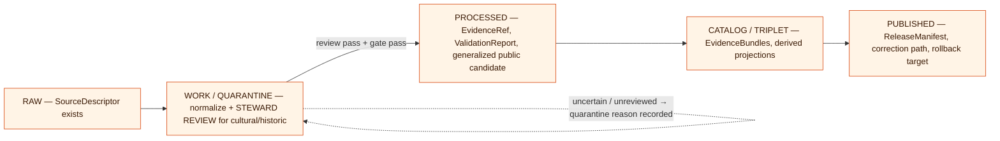

<!-- [KFM_META_BLOCK_V2]
doc_id: kfm://doc/docs-domains-roads-rail-trade-sublanes-trade-routes
title: Trade Routes & Historic Alignments Sublane — Roads, Rail, and Trade Routes Domain Dossier
type: standard
version: v0.1
status: draft
owners: <Roads/Rail/Trade Routes domain steward — TBD>; <cultural-heritage / sovereignty reviewer — TBD>
created: 2026-06-07
updated: 2026-06-07
policy_label: public (sublane scaffold) — content tiers vary; historic/Indigenous/cultural corridor detail defaults to steward review + generalized geometry
related:
  - docs/domains/roads-rail-trade/README.md
  - docs/domains/roads-rail-trade/sublanes/README.md
  - docs/domains/roads-rail-trade/sublanes/roads.md
  - docs/domains/roads-rail-trade/sublanes/rail.md
  - docs/domains/archaeology/README.md
  - docs/domains/people-dna-land/README.md
  - docs/doctrine/directory-rules.md
  - docs/architecture/governed-api.md
  - docs/adr/ADR-0001-schema-home.md
tags: [kfm, domain, roads-rail-trade, sublane, trade-routes, historic-routes, cultural-heritage]
notes:
  - 'CONTRACT_VERSION = "3.0.0" pinned per ai-build-operating-contract.md'
  - "Sublane subdivision under docs/domains/<domain>/ is PROPOSED structure; not in Directory Rules (OPEN-TRADE-01)."
  - "TERMINOLOGY: 'sublane' is not established KFM doctrine. 'lane' is defined; 'sub-lane' exists only in the Focus Mode cross-root sense (Directory Rules §6.7). See OPEN-TRADE-01."
  - "FILENAME is itself an open question: trade-routes.md vs historic-routes.md vs routes-historic.md (OPEN-TRADE-02)."
  - "Slug variance: Directory Rules §12 uses schemas/contracts/v1/domains/roads-rail-trade/; Atlas §24.13 uses schemas/contracts/v1/transport/. CONFLICTED — see OPEN-TRADE-03."
  - "HIGHEST-SENSITIVITY sublane: historic/Indigenous/cultural corridors default to steward review + generalized public geometry; cultural truth and sensitivity policy are owned by Archaeology/Cultural Heritage."
  - "All path, route, schema, and tooling claims remain PROPOSED until a mounted repository is inspected."
[/KFM_META_BLOCK_V2] -->

# Trade Routes & Historic Alignments Sublane — Roads, Rail, and Trade Routes Domain

> Historic and trade/mobility-corridor evidence inside the Roads, Rail, and Trade Routes domain — its scope, source posture, object spine, lifecycle, **sensitivity-first** publication posture, governed surfaces, and verification backlog.

<p align="left">
  
  
  
  
  
  
  
  
</p>

**Status:** draft · **Parent dossier:** [`docs/domains/roads-rail-trade/`](../README.md) · **Owners:** Roads/Rail/Trade Routes steward — `TBD` · cultural-heritage / sovereignty reviewer — `TBD` · **Last updated:** 2026-06-07

> [!CAUTION]
> **This is the highest-sensitivity sublane of the three.** Historic, Indigenous, treaty, oral-history, and cultural-corridor evidence defaults to **steward review** and **generalized public geometry**. Cultural truth and sensitivity policy are **owned by Archaeology / Cultural Heritage** (`[DOM-ARCH]`), not here; this sublane carries the route-claim relation only. Do not publish exact historic/cultural-corridor geometry without reviewed evidence and a transform receipt. `[DOM-ROADS]` §I `[DOM-ARCH]` `[ENCY]`

---

## Quick navigation

- [1. Sublane in context](#1-sublane-in-context)
- [2. Scope, boundary, and explicit non-ownership](#2-scope-boundary-and-explicit-non-ownership)
- [3. Ubiquitous language (trade-routes sublane)](#3-ubiquitous-language-trade-routes-sublane)
- [4. Source posture](#4-source-posture)
- [5. Object families](#5-object-families)
- [6. Lifecycle — RAW → PUBLISHED](#6-lifecycle--raw--published)
- [7. Sensitivity, rights, and publication posture](#7-sensitivity-rights-and-publication-posture)
- [8. API, contract, and schema surfaces](#8-api-contract-and-schema-surfaces)
- [9. Validators, tests, fixtures](#9-validators-tests-fixtures)
- [10. Governed AI behavior](#10-governed-ai-behavior)
- [11. Cross-lane and cross-sublane relations](#11-cross-lane-and-cross-sublane-relations)
- [12. Map and viewing products](#12-map-and-viewing-products)
- [13. Open questions and verification backlog](#13-open-questions-and-verification-backlog)
- [14. Related docs](#14-related-docs)

---

## 1. Sublane in context

This file documents the **Trade Routes & Historic Alignments sublane** — the slice of the Roads, Rail, and Trade Routes domain that owns evidence and released derivatives for **historic and trade/mobility corridors**: historic routes, historic route *claims*, trade-route corridors, cross-period route memberships, and movement story nodes. The sister sublanes — `roads.md` and `rail.md` — own modern public-road and rail evidence respectively. All three sublanes share the same parent dossier, source-role doctrine, and lifecycle invariant. **[CONFIRMED domain scope from `[DOM-ROADS]` `[ENCY]`; PROPOSED sublane subdivision.]**

> [!IMPORTANT]
> **The `sublanes/` subdirectory is PROPOSED structure, not Directory Rules canon — and "sublane" is not a defined KFM term.**
> Directory Rules §12 ("Domain Placement Law") prescribes `docs/domains/<domain>/` as the dossier home and pins `roads-rail-trade` as the canonical domain slug, but does **not** define a `sublanes/` subdirectory pattern. Separately, KFM defines **lane** (a domain/topic segment inside a responsibility root) and uses **sub-lane** only for **Focus Modes** (a geographic *area* across responsibility roots, §6.7) — so this file's "sublane" (a per-mode partition within one domain) is a **coined term that collides with the Focus Mode sense**. Both the subdirectory pattern and the term should be ratified by the domain README or a small ADR before either is treated as canonical. Until then, treat `docs/domains/roads-rail-trade/sublanes/trade-routes.md` as `PROPOSED / NEEDS VERIFICATION`. See [§13 OPEN-TRADE-01](#13-open-questions-and-verification-backlog). `[DIRRULES]`

### 1.1 Why a Trade Routes sublane

The parent domain bundles three distinct temporal and authority regimes under one bounded context. The Unified Implementation Architecture Build Manual flags this directly: the public posture for this slice is that **historic and cultural routes are generalized unless reviewed evidence supports precision, and graph projections are derived only** — and the named risk is **conflating alignment, ownership, operator, legal status, and route claim, plus false precision for historic / Indigenous / cultural corridors**. `[DOM-ROADS via UNIFIED]` Separating this sublane from the modern roads/rail sublanes lets the sensitivity-first posture be the default *here* without weakening, or being weakened by, the modern-evidence posture there.

### 1.2 Three sublanes — at a glance

| Sublane | Owns (CONFIRMED scope per `[DOM-ROADS]`) | Dominant source-role posture | File |
|---|---|---|---|
| Roads | Road Segment; road-side of Bridge / Ferry / River Crossing; road-aligned Crossing, events, facilities; modern RouteMembership / CorridorRoute | authority / observation (modern) | `sublanes/roads.md` |
| Rail | Rail Segment; Depot; Siding; Yard; rail-aligned Crossing / Bridge; rail events; Freight Corridor (rail) | authority / observation (modern) | `sublanes/rail.md` |
| **Trade routes & historic alignments** *(this file)* | Historic Route; Historic RouteClaim; TradeRouteCorridor; Movement Story Node; cross-period RouteMembership | **claim / interpretive (historic)** | `sublanes/trade-routes.md` *(filename PROPOSED — OPEN-TRADE-02)* |

> [!NOTE]
> **Filename is an open question.** This file's name (`trade-routes.md` vs `historic-routes.md` vs `routes-historic.md`) is unsettled; the parent dossier should ratify it before either form is treated as canonical. See **OPEN-TRADE-02**.

[↑ back to top](#trade-routes--historic-alignments-sublane--roads-rail-and-trade-routes-domain)

---

## 2. Scope, boundary, and explicit non-ownership

### 2.1 What this sublane owns

CONFIRMED scope (subset of `[DOM-ROADS]` domain scope, narrowed to historic/trade corridors):

- **Historic Route** — a documented past alignment (trail, wagon road, abandoned corridor) carried as evidence with source role, time, and release state.
- **Historic RouteClaim** — a *claim* about a historic alignment, recorded **with evidence and uncertainty rather than as fact**. The claim is the object; the alignment it asserts is not promoted to truth without reviewed support.
- **TradeRouteCorridor** — a trade / mobility corridor as an entity, including Indigenous trade and mobility corridors where the cultural-heritage owner permits a route-relation projection.
- **Cross-period RouteMembership** — membership of a segment or feature in a corridor across eras, kept separate from any single segment.
- **Movement Story Node** — narrative / interpretive nodes tied to historic movement evidence.

### 2.2 What this sublane explicitly does not own

CONFIRMED non-ownership (inherited from `[DOM-ROADS]` parent rule):

- **Cultural and Indigenous corridor *truth and sensitivity policy*** stays with `archaeology` / cultural heritage (`[DOM-ARCH]`). This sublane carries the route-claim relation; it does **not** author cultural truth or set the sensitivity tier. `[DOM-ARCH]` `[DOM-ROADS]`
- **Forts, missions, settlements, and townsites** as place/settlement objects stay with `settlements-infrastructure`. `[DOM-SETTLE]` `[DOM-ROADS]`
- **Archaeological site identity and exact coordinates** stay with `archaeology`; exact site coordinates are **denied** by default and are never absorbed into a route claim. `[DOM-ARCH]`
- **Water evidence** at fords / river crossings stays with `hydrology`. `[DOM-HYD]`
- **Person / land / ownership facts** (e.g., a corridor crossing private land) stay with `people-dna-land`. `[DOM-PEOPLE]`
- **Modern road and rail objects** stay with the Roads and Rail sublanes.

> [!WARNING]
> **A modern alignment MUST NOT absorb a historic/cultural claim.** Where a present-day road or rail line overlies a historic or Indigenous corridor, the two are distinct objects with distinct sensitivity postures. The modern segment does not inherit, override, or silently publish the historic claim's geometry; the cross-sublane edge preserves the more-restrictive posture. `[DOM-ROADS]` §I `[DOM-ARCH]`

[↑ back to top](#trade-routes--historic-alignments-sublane--roads-rail-and-trade-routes-domain)

---

## 3. Ubiquitous language (trade-routes sublane)

CONFIRMED terms (from `[DOM-ROADS]` §C) used inside this sublane; field realization in any specific contract or schema is PROPOSED until verified in `schemas/contracts/v1/...`.

| Term | One-line definition (CONFIRMED meaning) | Field realization | Citation |
|---|---|---|---|
| **Historic Route** | A documented past alignment carried as evidence, constrained by source role, evidence, time, and release state. | PROPOSED | `[DOM-ROADS]` `[ENCY]` |
| **Historic RouteClaim** | A claim about a historic alignment, recorded with evidence and uncertainty rather than as fact. | PROPOSED | `[DOM-ROADS]` `[ENCY]` |
| **TradeRouteCorridor** | A trade / mobility corridor as an entity in its own right; may include Indigenous corridors under cultural-heritage governance. | PROPOSED | `[DOM-ROADS]` `[ENCY]` |
| **RouteMembership** *(cross-period)* | A sourced, temporal claim that a feature belongs to a corridor across one or more eras. | PROPOSED | `[DOM-ROADS]` `[ENCY]` |
| **Movement Story Node** | A narrative / interpretive node tied to historic movement evidence. | PROPOSED | `[DOM-ROADS]` `[ENCY]` |
| **CorridorRoute** | A route as an entity, separable from any single underlying segment (historic-mode here). | PROPOSED | `[DOM-ROADS]` `[ENCY]` |

> [!TIP]
> **A claim is not a fact; a corridor is not a coordinate.** The defining discipline of this sublane is that a *Historic RouteClaim* records what a source asserts about an alignment together with its uncertainty — it never silently becomes a precise published line. Validators in §9 enforce historic-overprecision denial. `[DOM-ROADS K-tests]`

[↑ back to top](#trade-routes--historic-alignments-sublane--roads-rail-and-trade-routes-domain)

---

## 4. Source posture

This sublane draws on the parent `[DOM-ROADS]` source families (TIGER/Line, FHWA HPMS, NHFN, WZDx, KDOT family, county bridge/restriction data, GNIS, OSM) for *modern geometry context only*, and depends on **cultural-heritage and archival sources governed by `[DOM-ARCH]`** for the historic/Indigenous claim side. Source role is fixed at admission and is **never** upgraded by promotion; rights and current terms remain `NEEDS VERIFICATION` until each descriptor and activation decision is mounted-repo-verified. `[DOM-ROADS]` `[ENCY]`

| Source posture | Role here | Sensitivity / rights | Status |
|---|---|---|---|
| **GNIS names** | context — gazetteer names only; vernacular / Indigenous names route to TGN or local authorities | open per USGS terms (NEEDS VERIFICATION); **not** a corridor-truth authority | CONFIRMED listing; descriptor PROPOSED `[DOM-ROADS]` |
| **OpenStreetMap (historic tags)** | observation / context — community geometry only | ODbL terms NEEDS VERIFICATION; **MUST NOT** confer historic-route legitimacy | CONFIRMED listing; descriptor PROPOSED `[DOM-ROADS]` |
| **TIGER/Line, KDOT family** | context — modern alignment that *may parallel* a historic corridor | rights NEEDS VERIFICATION; modern geometry only | CONFIRMED listing; descriptor PROPOSED `[DOM-ROADS]` |
| **Cultural-heritage / archival / oral-history sources** | claim / interpretive — the historic / Indigenous corridor side | **owned and gated by `[DOM-ARCH]`**; steward + rights-holder review; generalized geometry default | PROPOSED; governance deferred to `[DOM-ARCH]` |
| **Treaty / administrative compilations** | administrative — context, **not** observed-event timelines | source-role tag preserved; MUST NOT be cited as observation | PROPOSED `[ENCY]` |

> [!CAUTION]
> **Source-role anti-collapse, sharpened for historic corridors.** Community-science and gazetteer sources (OSM, GNIS) **cannot** establish that a historic or Indigenous corridor existed at a given precise location. They supply names and modern geometry context only. The corridor claim itself is `claim`/`interpretive` evidence under `[DOM-ARCH]` governance. Administrative or treaty compilations are `administrative` context, never observed-event timelines. `[DOM-ROADS]` `[ENCY]`

[↑ back to top](#trade-routes--historic-alignments-sublane--roads-rail-and-trade-routes-domain)

---

## 5. Object families

CONFIRMED object-family spine from `[DOM-ROADS]` §E, narrowed to historic/trade objects. **Identity rule** and **temporal handling** rows are direct restatements of the parent-dossier rules.

| Object | Purpose (within this sublane) | Identity rule | Temporal handling | Status |
|---|---|---|---|---|
| **Historic Route** | Represents a documented past alignment as evidence or released derivative. | PROPOSED deterministic basis: `source id + object role + temporal scope + normalized digest` | CONFIRMED: source, observed, valid, retrieval, release, and correction times stay distinct where material. | CONFIRMED object / PROPOSED implementation `[DOM-ROADS]` `[ENCY]` |
| **Historic RouteClaim** | Represents a claim about a historic alignment, with evidence and uncertainty. | PROPOSED as above. | CONFIRMED temporal handling as above. | CONFIRMED object / PROPOSED implementation `[DOM-ROADS]` `[ENCY]` |
| **TradeRouteCorridor** | Represents a trade / mobility corridor as an entity; Indigenous corridors under `[DOM-ARCH]` governance. | PROPOSED as above. | CONFIRMED temporal handling as above. | CONFIRMED object / PROPOSED implementation `[DOM-ROADS]` `[ENCY]` |
| **RouteMembership** *(cross-period)* | Sourced, temporal claim that a feature belongs to a corridor across eras. | PROPOSED as above. | CONFIRMED temporal handling as above. | CONFIRMED object / PROPOSED implementation `[DOM-ROADS]` `[ENCY]` |
| **Movement Story Node** | Narrative / interpretive node tied to historic movement evidence. | PROPOSED as above. | CONFIRMED temporal handling as above. | CONFIRMED object / PROPOSED implementation `[DOM-ROADS]` `[ENCY]` |

<details>
<summary><strong>PROPOSED Historic RouteClaim object shape — illustrative only</strong></summary>

The block below is **illustrative**, not a contract. The canonical shape lives in `schemas/contracts/v1/...` per ADR-0001; the slug (`domains/roads-rail-trade/` per Directory Rules §12 vs. `transport/` per Atlas §24.13) is itself an open question — see [§13 OPEN-TRADE-03](#13-open-questions-and-verification-backlog). Do not use this shape to validate anything.

```jsonc
// PROPOSED — illustrative historic_route_claim object shape. Not a contract. Not a schema.
{
  "object_kind": "HistoricRouteClaim",
  "identity": {
    "source_id": "<source descriptor id>",
    "object_role": "HistoricRouteClaim",
    "temporal_scope": { "valid_from": "...", "valid_to": "..." },
    "normalized_digest": "<JCS+SHA-256 of canonical attributes>"
  },
  "asserted_geometry": {
    // PUBLIC GEOMETRY DEFAULTS TO GENERALIZED — exact line withheld pending review
    "public_representation": "generalized",
    "uncertainty": "<RouteUncertaintyProfile ref — PROPOSED>"
  },
  "times": {
    "source_time": "...", "observed_time": "...",
    "valid_time": { "from": "...", "to": "..." },
    "retrieval_time": "...", "release_time": "...", "correction_time": null
  },
  "source": {
    "source_descriptor_ref": "<...>",
    "source_role": "claim | interpretive | administrative | context",  // fixed at admission
    "rights_label": "<NEEDS VERIFICATION>"
  },
  "cultural_governance_ref": "<[DOM-ARCH] steward review / sensitivity record — required when cultural>",
  "evidence_ref": "<resolves to EvidenceBundle when released>",
  "policy": { "release_state": "...", "sensitivity_tier": "<steward-set>" },
  "redaction_receipt_ref": "<RedactionReceipt when generalized/redacted>"
}
```

</details>

[↑ back to top](#trade-routes--historic-alignments-sublane--roads-rail-and-trade-routes-domain)

---

## 6. Lifecycle — RAW → PUBLISHED

CONFIRMED doctrine / PROPOSED lane application: this sublane inherits the `[DIRRULES]` lifecycle invariant in full. **Promotion is a governed state transition, not a file move.** For historic/cultural evidence, the WORK/QUARANTINE gate carries an **added steward-review obligation** before any candidate becomes public-safe. `[DIRRULES]` `[DOM-ROADS]` `[ENCY]`



| Stage | Handling (CONFIRMED from `[DOM-ROADS]` §H, sensitivity-adjusted) | Gate | Status |
|---|---|---|---|
| **RAW** | Capture immutable source payload or reference with source role, rights, sensitivity, citation, time, and hash. | SourceDescriptor exists. | PROPOSED |
| **WORK / QUARANTINE** | Normalize schema, geometry, time, identity, evidence, rights, policy; **route cultural/historic material to steward review**; hold failures and unreviewed cultural claims. | Validation + policy gate pass **and** steward review where cultural, **or** quarantine reason recorded. | PROPOSED |
| **PROCESSED** | Emit validated normalized objects, receipts, and **generalized** public-safe candidates with `RedactionReceipt` where geometry is transformed. | EvidenceRef, ValidationReport, digest closure exist. | PROPOSED |
| **CATALOG / TRIPLET** | Emit catalog records, EvidenceBundles, derived projections, release candidates. | Catalog / proof closure passes. | PROPOSED |
| **PUBLISHED** | Serve released public-safe (generalized) historic/corridor artifacts through governed APIs and manifests. | ReleaseManifest, correction path, rollback target, review/policy state exist. | PROPOSED |

> [!IMPORTANT]
> **Watcher-as-non-publisher applies.** A worker that ingests an archival or gazetteer source emits receipts and candidate decisions; it does not write to `data/catalog/` or `data/published/`, and it cannot move a cultural-corridor claim past PROCESSED without the steward-review and policy gates. `[DIRRULES]`

[↑ back to top](#trade-routes--historic-alignments-sublane--roads-rail-and-trade-routes-domain)

---

## 7. Sensitivity, rights, and publication posture

> [!CAUTION]
> **Sensitivity-first is the default for this sublane.** `[DOM-ROADS]` §I `[DOM-ARCH]` `[ENCY]`
> - **Indigenous trade and mobility corridors, oral history, treaty, cultural, and interpretive evidence default to steward review and generalized public geometry.**
> - **Historic / cultural routes are generalized unless reviewed evidence supports precision; graph projections are derived only.** (`[DOM-ROADS via UNIFIED]`)
> - **Exact archaeological site coordinates are denied by default** and are never absorbed into a route claim. `[DOM-ARCH]`
> - Cultural truth and the sensitivity tier are **owned by `[DOM-ARCH]`** and any rights-holder representative — not set here.

Default disposition when no specific row matches (operating contract §23.2 — most-restrictive applicable row governs):

```text
DENY public exact exposure
GENERALIZE before publication
REDACT when needed (RedactionReceipt)
QUARANTINE uncertain or unreviewed cultural source material
REQUIRE steward review (and rights-holder review where applicable)
ABSTAIN when support is inadequate
```

**CONFIRMED doctrine:** unclear rights, unresolved source role, missing evidence, unresolved sensitivity, or absent release state **blocks public promotion**. `[ENCY]` `[DIRRULES]`

> [!IMPORTANT]
> Each cultural/historic entry MUST link to its `[DOM-ARCH]`-governed sensitivity record and, where geometry is transformed, its `RedactionReceipt`. If that record is missing, surface the gap and ABSTAIN rather than publishing. Link target is `TODO` / `NEEDS VERIFICATION`.

[↑ back to top](#trade-routes--historic-alignments-sublane--roads-rail-and-trade-routes-domain)

---

## 8. API, contract, and schema surfaces

PROPOSED governed surfaces from `[DOM-ROADS]` §J; exact routes, DTO field shapes, and schema slugs remain **UNKNOWN** until mounted-repo verification.

| Endpoint or artifact | DTO / schema | Finite outcomes | Status |
|---|---|---|---|
| Trade-routes feature / detail resolver — route `TBD` | `RoadsRailDecisionEnvelope` (parent-domain envelope; sublane partition TBD) | `ANSWER / ABSTAIN / DENY / ERROR` | PROPOSED; exact route UNKNOWN. `[DOM-ROADS]` |
| Historic-route claim layer manifest resolver | `LayerManifest` / domain layer descriptor (generalized geometry) | `ANSWER / DENY / ERROR` | PROPOSED; public-safe (generalized) release only. `[DOM-ROADS]` |
| Trade-routes Evidence Drawer payload | `EvidenceDrawerPayload` + `EvidenceBundle` projection | `ANSWER / ABSTAIN / DENY / ERROR` | PROPOSED; evidence + policy + sensitivity filtered. `[DOM-ROADS]` `[GAI]` |
| Trade-routes Focus Mode answer | `RuntimeResponseEnvelope` + `AIReceipt` | `ANSWER / ABSTAIN / DENY / ERROR` | PROPOSED; AI never root truth; DENY on unreviewed cultural detail. `[GAI]` |
| Schema responsibility root | `schemas/contracts/v1/...` per ADR-0001 | finite validator outcomes | PROPOSED; **slug variance** `domains/roads-rail-trade/` vs `transport/` — see §13. `[DIRRULES]` |

> [!NOTE]
> **Public clients use governed APIs, not canonical stores.** `[DIRRULES]` `[ENCY]` Map shells, dashboards, and AI surfaces consume `apps/governed-api/` responses; they do not read `data/processed/`, `data/catalog/`, or `data/published/` directly — and they receive **generalized** historic/cultural geometry, never the raw asserted line.

[↑ back to top](#trade-routes--historic-alignments-sublane--roads-rail-and-trade-routes-domain)

---

## 9. Validators, tests, fixtures

PROPOSED test obligations from `[DOM-ROADS]` §K, with sublane-relevant emphasis. None CONFIRMED present in a mounted repo this session; all tracked in §13.

| # | Test obligation | Sublane relevance | Status |
|---|---|---|---|
| 1 | Route membership and designation separation tests. | Medium — corridor / membership / claim kept distinct. | PROPOSED `[DOM-ROADS]` `[ENCY]` |
| 2 | Operator / status temporal tests. | Low — historic corridors rarely carry modern operator status. | PROPOSED `[DOM-ROADS]` `[ENCY]` |
| 3 | OSM / GNIS legal-status denial. | High — community / gazetteer sources cannot establish corridor legitimacy. | PROPOSED `[DOM-ROADS]` `[ENCY]` |
| 4 | **Historic overprecision denial.** | **Highest — the defining test of this sublane.** No false precision on historic/cultural alignments. | PROPOSED `[DOM-ROADS]` `[ENCY]` |
| 5 | Public generalization receipt tests. | **Highest — every public-safe geometry transform emits a `RedactionReceipt`.** | PROPOSED `[DOM-ROADS]` `[ENCY]` |
| 6 | Transport graph projection rollback tests. | Medium — derived projections roll back cleanly when a claim is corrected. | PROPOSED `[DOM-ROADS]` `[ENCY]` |
| 7 | **Steward-review-required denial (PROPOSED, sublane-specific).** | Cultural/Indigenous claims cannot reach PUBLISHED without a `[DOM-ARCH]` review record. | PROPOSED `[DOM-ARCH]` `[ENCY]` |

> [!TIP]
> **Fixture-first, no-network.** The first slice of test infrastructure is fixture-first and offline: source descriptors, deterministic identity, validators, deny policies, no-network fixtures, and proof-pack / promotion fixtures **before** any live source is activated. Negative fixtures (exact cultural geometry, unreviewed claim, missing sensitivity record) are required, not optional. `[UNIFIED]`

[↑ back to top](#trade-routes--historic-alignments-sublane--roads-rail-and-trade-routes-domain)

---

## 10. Governed AI behavior

CONFIRMED doctrine / PROPOSED implementation. `[GAI]` `[DOM-ROADS]` `[ENCY]`

- AI **may** summarize released (generalized) trade-route / historic EvidenceBundles, compare evidence, explain limitations and uncertainty, and draft steward-review notes.
- AI **MUST `ABSTAIN`** when evidence is insufficient (missing EvidenceBundle, missing release state, conflicting claims without resolution).
- AI **MUST `DENY`** where policy, rights, sensitivity, or release state blocks the request — including **any request for exact historic/Indigenous/cultural-corridor geometry that lacks a `[DOM-ARCH]` review record**, or any request to locate sensitive cultural features precisely.
- AI **MUST NOT** answer from RAW / WORK / QUARANTINE stores, and MUST NOT treat a Historic RouteClaim as established fact. The trust-membrane rule from `[ENCY]` applies in full.
- Every Focus Mode answer carries an `AIReceipt`. `[GAI]`

[↑ back to top](#trade-routes--historic-alignments-sublane--roads-rail-and-trade-routes-domain)

---

## 11. Cross-lane and cross-sublane relations

### 11.1 Cross-lane edges this sublane participates in

CONFIRMED / PROPOSED (`[DOM-ROADS]` §F): every relation must preserve ownership, source role, sensitivity, and EvidenceBundle support.

| This sublane | Related lane | Relation | Constraint |
|---|---|---|---|
| Trade routes | `archaeology` / cultural heritage | Historic routes, Indigenous corridors, forts, missions. | **Cultural truth and sensitivity policy are owned by `[DOM-ARCH]`.** Default to generalized public geometry; exact site coords denied. |
| Trade routes | `settlements-infrastructure` | Forts, missions, townsites as place objects along a corridor. | Settlement / place identity stays with `settlements-infrastructure`; this sublane carries the corridor relation. |
| Trade routes | `hydrology` | Fords / river crossings on a historic corridor. | Water evidence stays with `hydrology`; this sublane owns the corridor-claim side. |
| Trade routes | `people-dna-land` | A corridor crossing private land or tied to land tenure. | Living-person, parcel, and ownership facts stay with `people-dna-land`. |
| Trade routes | `hazards` | Historic disaster/closure context on a corridor. | Hazard truth stays with `hazards`; KFM is never an alert authority. `[DOM-HAZ]` |

### 11.2 Cross-sublane edges (PROPOSED, internal to `roads-rail-trade`)

| This sublane | Sibling sublane | Relation | Constraint |
|---|---|---|---|
| Trade routes | Roads | A modern Road Segment overlying a Historic RouteClaim or TradeRouteCorridor. | The historic claim **retains its sensitivity posture**; the modern segment does not absorb or override it. |
| Trade routes | Rail | A historic rail alignment interacting with a pre-rail trade corridor. | Two object families; uncertainty and sensitivity discipline preserved on both sides. |

[↑ back to top](#trade-routes--historic-alignments-sublane--roads-rail-and-trade-routes-domain)

---

## 12. Map and viewing products

PROPOSED viewing products from `[DOM-ROADS]` §G, narrowed to this sublane:

- Historic route claim view (with **uncertainty surface**, generalized geometry).
- Generalized trade-route corridor layer.
- Movement-story narrative view.
- Derived graph / connectivity view (historic-mode projection, clearly labeled derived).

CONFIRMED cross-cutting viewing products that apply to every released layer: **Evidence Drawer**, time-aware state, **trust badges**, **sensitivity-redacted view**, correction / stale-state view, and **governed Focus Mode**. `[MAP-MASTER]` `[GAI]`

> [!IMPORTANT]
> **The map renderer is not the truth path, and styling cannot imply precision.** Per `[MAP-MASTER]` / `[DIRRULES]` §11, the browser renderer consumes the same EvidenceBundle and DecisionEnvelope as any other client — it is an alternate renderer, not an alternate truth path. A historic-corridor layer whose styling implies a precise alignment that no reviewed EvidenceBundle supports is a trust-membrane bug, not a styling choice.

> [!NOTE]
> **Renderer note (v1.3).** `packages/maplibre-runtime/` is the **sole governed browser-side renderer adapter**; the v1.2 Cesium dual-renderer posture is **retired** (doctrine-target, pending the *MapLibre as Sole Browser-Side Renderer; Retire Cesium Dependency* ADR — Directory Rules §18.e OPEN-DR-10). The freeze rule is in effect: no new `cesium*` code, schemas, policies, or tests. `[DIRRULES]` `[MAP-MASTER]`

[↑ back to top](#trade-routes--historic-alignments-sublane--roads-rail-and-trade-routes-domain)

---

## 13. Open questions and verification backlog

Tracked here for triage; resolutions migrate to `docs/registers/VERIFICATION_BACKLOG.md`, `docs/registers/DRIFT_REGISTER.md`, or `docs/adr/` as appropriate.

### 13.1 Sublane-structure questions (ADR-class or per-root README class)

| ID | Question | Evidence that would settle it | Status |
|---|---|---|---|
| **OPEN-TRADE-01** | Is `docs/domains/<domain>/sublanes/` a recognized organizational pattern — and is "sublane" the right term, given it collides with the Focus Mode "sub-lane" (§6.7)? | Updated Directory Rules §6.1, parent dossier README, or a small ADR. | CONFLICTED — needs ADR or per-root README. `[DIRRULES]` |
| **OPEN-TRADE-02** | Is this file `trade-routes.md`, `historic-routes.md`, or `routes-historic.md`? | Parent dossier README and ADR alignment. | UNKNOWN — naming PROPOSED. |
| **OPEN-TRADE-03** | Schema-home slug: `schemas/contracts/v1/domains/roads-rail-trade/` (Directory Rules §12) vs. `schemas/contracts/v1/transport/` (Atlas §24.13)? | ADR aligning Atlas §24.13 and Directory Rules §12; `DRIFT_REGISTER.md` entry. | CONFLICTED — slug variance between two project docs. `[DIRRULES §12]` `[ENCY §24.13]` |

### 13.2 Source-and-policy questions (carried from `[DOM-ROADS]` §N, sensitivity-weighted)

| Item to verify | Evidence that would settle it | Status |
|---|---|---|
| **Indigenous / cultural corridor policy enforcement** (the central question for this sublane). | Mounted-repo `policy/sensitivity/` + `[DOM-ARCH]` review records; steward-review-required denial test. | NEEDS VERIFICATION |
| `RouteUncertaintyProfile` (or equivalent) for historic claims. | Mounted-repo schema, validator, emitted receipts. | NEEDS VERIFICATION |
| Generalization/redaction determinism for public corridor geometry. | Mounted-repo `RedactionReceipt` schema + generalization-receipt tests. | NEEDS VERIFICATION |
| Cultural-heritage / archival / oral-history source terms and rights-holder permissions. | Mounted-repo source descriptors + `[DOM-ARCH]` governance records. | NEEDS VERIFICATION |
| Transport graph projection and MapLibre integration (historic-mode). | Mounted-repo pipeline output, layer manifest, rollback drill receipts. | NEEDS VERIFICATION |

### 13.3 Implementation-maturity questions (this session is docs-only)

| Item | Status |
|---|---|
| Whether any of `contracts/domains/roads-rail-trade/`, `schemas/contracts/v1/domains/roads-rail-trade/` (or `…/transport/`), `policy/domains/roads-rail-trade/`, `tests/domains/roads-rail-trade/`, `pipelines/domains/roads-rail-trade/`, or `data/<phase>/roads-rail-trade/` exist in the mounted repo. | UNKNOWN — no mounted repo this session. |
| Exact route names, DTO field names, and validator commands. | UNKNOWN. |
| CI / workflow coverage of the §9 tests (esp. historic-overprecision and steward-review-required). | UNKNOWN. |

[↑ back to top](#trade-routes--historic-alignments-sublane--roads-rail-and-trade-routes-domain)

---

## 14. Related docs

- Parent dossier: [`docs/domains/roads-rail-trade/README.md`](../README.md) — `PROPOSED` link; verify on mount.
- Sublane index (PROPOSED): [`docs/domains/roads-rail-trade/sublanes/README.md`](./README.md)
- Sibling sublane: [`docs/domains/roads-rail-trade/sublanes/roads.md`](./roads.md)
- Sibling sublane: [`docs/domains/roads-rail-trade/sublanes/rail.md`](./rail.md)
- **Cultural authority:** [`docs/domains/archaeology/README.md`](../../archaeology/README.md) — owner of cultural / Indigenous corridor truth and sensitivity policy.
- [`docs/domains/people-dna-land/README.md`](../../people-dna-land/README.md) — land tenure / private-land authority.
- Doctrine: [`docs/doctrine/directory-rules.md`](../../../doctrine/directory-rules.md) — Domain Placement Law (§12), lifecycle invariant.
- Architecture: [`docs/architecture/governed-api.md`](../../../architecture/governed-api.md) — trust-membrane definition.
- ADR: [`docs/adr/ADR-0001-schema-home.md`](../../../adr/ADR-0001-schema-home.md) — schema-home rule.
- Registers: `docs/registers/VERIFICATION_BACKLOG.md`, `docs/registers/DRIFT_REGISTER.md` — destinations for §13 items, including the OPEN-TRADE-03 slug conflict. (`TODO` link targets — verify on mount.)
- Atlas §24.13 — Responsibility-root crosswalk (source of the `transport` slug variance).

---

<sub><strong>Last updated:</strong> 2026-06-07 · <strong>Doc version:</strong> v0.1 (draft) · <strong>Status:</strong> standard doc; sublane structure PROPOSED · <strong>CONTRACT_VERSION:</strong> 3.0.0 · <strong>Owners:</strong> Roads/Rail/Trade Routes steward — `TBD`; cultural-heritage reviewer — `TBD` · [↑ back to top](#trade-routes--historic-alignments-sublane--roads-rail-and-trade-routes-domain)</sub>
