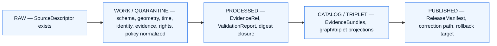

<!-- [KFM_META_BLOCK_V2]
doc_id: kfm://doc/docs-domains-roads-rail-trade-sublanes-trade
title: Trade & Freight Corridors Sublane — Roads, Rail, and Trade Routes Domain Dossier
type: standard
version: v0.1
status: draft
owners: <Roads/Rail/Trade Routes domain steward — TBD>
created: 2026-06-07
updated: 2026-06-07
policy_label: public (sublane scaffold) — content tiers vary; freight-critical-asset and cultural-corridor detail default to review
related:
  - docs/domains/roads-rail-trade/README.md
  - docs/domains/roads-rail-trade/sublanes/README.md
  - docs/domains/roads-rail-trade/sublanes/roads.md
  - docs/domains/roads-rail-trade/sublanes/rail.md
  - docs/domains/roads-rail-trade/sublanes/trade-routes.md
  - docs/domains/archaeology/README.md
  - docs/doctrine/directory-rules.md
  - docs/architecture/governed-api.md
  - docs/adr/ADR-0001-schema-home.md
tags: [kfm, domain, roads-rail-trade, sublane, trade, freight-corridor]
notes:
  - 'CONTRACT_VERSION = "3.0.0" pinned per ai-build-operating-contract.md'
  - "FILENAME-COLLISION FLAG: a sibling file docs/domains/roads-rail-trade/sublanes/trade-routes.md already exists covering historic/Indigenous corridors. trade.md (this file) and trade-routes.md are competing names for the same third sublane. See FILENAME COLLISION callout and OPEN-TRADE-A1. Do NOT keep both as divergent twins without an ADR."
  - "Sublane subdivision under docs/domains/<domain>/ is PROPOSED structure; not in Directory Rules (OPEN-TRADE-A2)."
  - "TERMINOLOGY: 'sublane' is not established KFM doctrine. 'lane' is defined; 'sub-lane' exists only in the Focus Mode cross-root sense (Directory Rules §6.7)."
  - "Slug variance: Directory Rules §12 uses schemas/contracts/v1/domains/roads-rail-trade/; Atlas §24.13 uses schemas/contracts/v1/transport/. CONFLICTED — see OPEN-TRADE-A3."
  - "All path, route, schema, and tooling claims remain PROPOSED until a mounted repository is inspected."
[/KFM_META_BLOCK_V2] -->

# Trade & Freight Corridors Sublane — Roads, Rail, and Trade Routes Domain

> Trade, freight, and mobility-corridor evidence inside the Roads, Rail, and Trade Routes domain — its scope, source posture, object spine, lifecycle, sensitivity posture, governed surfaces, and verification backlog.

<p align="left">
  
  
  
  
  
  
  
  
</p>

**Status:** draft · **Parent dossier:** [`docs/domains/roads-rail-trade/`](../README.md) · **Owners:** Roads/Rail/Trade Routes steward — `TBD` · **Last updated:** 2026-06-07

> [!WARNING]
> **FILENAME COLLISION — read before extending this file.** A sibling file `docs/domains/roads-rail-trade/sublanes/trade-routes.md` already exists, covering **historic and Indigenous trade/mobility corridors** (the claim/interpretive, sensitivity-first slice). This file, `trade.md`, was requested from a docs-inventory entry that lists `trade.md` as the third sublane path. `trade.md` and `trade-routes.md` are **competing names for the same third sublane** and MUST NOT persist as divergent twins. Two reconciliations — pick one:
> - **Option A — single sublane, one filename.** Retire one path; keep the other as the canonical third sublane. Most sublane cross-links (`roads.md`, `rail.md`) already point at `trade-routes.md`, which favors retiring `trade.md`.
> - **Option B — split the third sublane into two.** Keep `trade.md` for **modern trade / freight corridors** (freight-network side) and `trade-routes.md` for **historic / Indigenous corridors** (cultural side). This is a real conceptual seam (modern freight vs. historic/cultural claim), but it adds a fourth file to a structure that is itself only PROPOSED.
>
> This draft is scoped as **Option B's modern-freight slice** so it does not duplicate `trade-routes.md`; if Option A wins, this file is retired and its freight content folds into the surviving sublane. Tracked as **OPEN-TRADE-A1**. `[DIRRULES]`

---

## Quick navigation

- [1. Sublane in context](#1-sublane-in-context)
- [2. Scope, boundary, and explicit non-ownership](#2-scope-boundary-and-explicit-non-ownership)
- [3. Ubiquitous language (trade & freight sublane)](#3-ubiquitous-language-trade--freight-sublane)
- [4. Source posture](#4-source-posture)
- [5. Object families](#5-object-families)
- [6. Lifecycle — RAW → PUBLISHED](#6-lifecycle--raw--published)
- [7. Sensitivity, rights, and publication posture](#7-sensitivity-rights-and-publication-posture)
- [8. API, contract, and schema surfaces](#8-api-contract-and-schema-surfaces)
- [9. Validators, tests, fixtures](#9-validators-tests-fixtures)
- [10. Governed AI behavior](#10-governed-ai-behavior)
- [11. Cross-lane and cross-sublane relations](#11-cross-lane-and-cross-sublane-relations)
- [12. Map and viewing products](#12-map-and-viewing-products)
- [13. Open questions and verification backlog](#13-open-questions-and-verification-backlog)
- [14. Related docs](#14-related-docs)

---

## 1. Sublane in context

This file documents the **Trade & Freight Corridors sublane** — under Option B, the slice of the Roads, Rail, and Trade Routes domain that owns **modern trade and freight-corridor evidence**: freight corridors, the National Highway Freight Network membership, multi-modal freight crossings and facilities, and trade-route corridor entities in their modern/commerce sense. The **historic and Indigenous corridor** slice lives in the sibling `trade-routes.md`; modern public roads and rail live in `roads.md` and `rail.md`. All sublanes share the parent dossier, source-role doctrine, and lifecycle invariant. **[CONFIRMED domain scope from `[DOM-ROADS]` `[ENCY]`; PROPOSED sublane subdivision and split.]**

> [!IMPORTANT]
> **The `sublanes/` subdirectory is PROPOSED structure, not Directory Rules canon — and "sublane" is not a defined KFM term.**
> Directory Rules §12 prescribes `docs/domains/<domain>/` as the dossier home and pins `roads-rail-trade` as the canonical slug, but defines no `sublanes/` pattern. KFM defines **lane** (a domain/topic segment inside a responsibility root) and uses **sub-lane** only for **Focus Modes** (a geographic *area* across responsibility roots, §6.7) — so this file's "sublane" is a coined term colliding with the Focus Mode sense. Ratify both the subdirectory and the term via the domain README or an ADR before treating either as canonical. Treat `docs/domains/roads-rail-trade/sublanes/trade.md` as `PROPOSED / NEEDS VERIFICATION`. See [§13 OPEN-TRADE-A2](#13-open-questions-and-verification-backlog). `[DIRRULES]`

### 1.1 Why a Trade & Freight sublane (under Option B)

The parent domain bundles three temporal/authority regimes. The freight slice differs from the historic-corridor slice in source authority and sensitivity: freight evidence draws on FHWA/HIFLD/NTAD authority layers and the National Highway Freight Network, with a freight-intake model that the corpus proposes separating into **restriction, corridor, crossing, incident, flow, and facility/source families with canonical IDs and STAC/DCAT/PROV publication rules** (KFM-P31-IDEA-0014; KFM-P31-PROG-0011, both PROPOSED). The historic/Indigenous corridor slice, by contrast, is claim/interpretive and sensitivity-first — which is why it has its own file.

### 1.2 The third sublane, two candidate shapes

| Candidate | What it would own | Sensitivity posture | File |
|---|---|---|---|
| **Trade & freight (this file, Option B)** | Freight Corridor; NHFN membership; freight crossings/facilities; modern TradeRouteCorridor (commerce sense) | authority / observation (modern) | `sublanes/trade.md` *(PROPOSED — OPEN-TRADE-A1)* |
| **Trade routes & historic alignments (sibling)** | Historic Route; Historic RouteClaim; Indigenous TradeRouteCorridor; Movement Story Node | claim / interpretive; steward review + generalized | `sublanes/trade-routes.md` *(already drafted)* |

> [!NOTE]
> If Option A is chosen (single third sublane), `trade.md` is retired and the freight content above folds into the surviving file. This draft does not assume Option B is final — it scopes itself to the freight slice precisely so it can be folded back cleanly. See **OPEN-TRADE-A1**.

[↑ back to top](#trade--freight-corridors-sublane--roads-rail-and-trade-routes-domain)

---

## 2. Scope, boundary, and explicit non-ownership

### 2.1 What this sublane owns (Option B scope)

CONFIRMED scope (subset of `[DOM-ROADS]` domain scope, narrowed to modern trade/freight):

- **Freight Corridor** — a designated freight movement corridor as an entity, carrying source role, time, and release state. **[CONFIRMED owned object `[DOM-ROADS]` §B.]**
- **National-freight-network RouteMembership** — membership of a segment/corridor in the National Highway Freight Network or equivalent, kept separate from any single segment.
- **TradeRouteCorridor** *(modern/commerce sense)* — a trade corridor as a present-day commerce entity. The **historic/Indigenous** sense of TradeRouteCorridor stays in `trade-routes.md`.
- **Freight-aligned Crossing / TransportFacility** — multi-modal freight crossings and freight facilities whose freight role is the dominant interpretation (settlement identity stays settlement-owned).
- **Freight RestrictionEvent / Route Event** — corridor-level restrictions, embargoes, or status events on freight movement.
- **Freight Network Edge / Network Node** — freight-graph projections derived from validated evidence.

> [!NOTE]
> **Freight intake model (PROPOSED).** The corpus proposes separating freight/logistics intake into **restriction, corridor, crossing, incident, flow, and facility/source** families with canonical IDs and STAC/DCAT/PROV publication rules (KFM-P31-IDEA-0014), and deterministic identity rules for freight links, restrictions, events, crossings, flows, and facilities (KFM-P31-PROG-0011). Both are PROPOSED atlas cards; neither asserts repo implementation.

### 2.2 What this sublane explicitly does not own

CONFIRMED non-ownership (inherited from `[DOM-ROADS]` parent rule):

- **Historic / Indigenous corridor truth and the cultural sensitivity posture** stay with `trade-routes.md` and `archaeology` (`[DOM-ARCH]`). A modern freight corridor MUST NOT absorb a historic/cultural claim. `[DOM-ARCH]` `[DOM-ROADS]`
- **Settlement and infrastructure canonical identity** (depots, terminals, intermodal yards as assets) stays with `settlements-infrastructure`. `[DOM-SETTLE]`
- **Water evidence** at freight river crossings stays with `hydrology`. `[DOM-HYD]`
- **Hazard event truth** (corridor closures, flood/fire detours) stays with `hazards`; this sublane consumes hazard context, never publishes it as an alert authority. `[DOM-HAZ]`
- **Rail-segment and road-segment objects** stay with the Rail and Roads sublanes; this sublane carries the cross-modal *freight-corridor* relation over them.

> [!WARNING]
> **Source-role anti-collapse.** OpenStreetMap and GNIS supply geometry, names, and context only — they **MUST NOT** confer freight-network designation, jurisdiction, or operator identity. Aggregate freight-flow figures are `aggregate` and MUST NOT be joined to a single segment as a per-place truth. `[DOM-ROADS]` `[ENCY]`

[↑ back to top](#trade--freight-corridors-sublane--roads-rail-and-trade-routes-domain)

---

## 3. Ubiquitous language (trade & freight sublane)

CONFIRMED terms (from `[DOM-ROADS]` §C) used inside this sublane; field realization in any specific contract or schema is PROPOSED until verified in `schemas/contracts/v1/...`.

| Term | One-line definition (CONFIRMED meaning) | Field realization | Citation |
|---|---|---|---|
| **Freight Corridor** | A designated freight movement corridor as an entity, constrained by source role, evidence, time, and release state. | PROPOSED | `[DOM-ROADS]` `[ENCY]` |
| **TradeRouteCorridor** *(modern/commerce sense)* | A trade corridor as a present-day commerce entity; the historic/Indigenous sense lives in `trade-routes.md`. | PROPOSED | `[DOM-ROADS]` `[ENCY]` |
| **CorridorRoute** | A route as an entity in its own right, separable from any single segment. | PROPOSED | `[DOM-ROADS]` `[ENCY]` |
| **RouteMembership** *(freight-network)* | A sourced, temporal claim that a segment/corridor belongs to a freight network (e.g., NHFN). | PROPOSED | `[DOM-ROADS]` `[ENCY]` |
| **TransportFacility** *(freight-aligned)* | A facility whose freight role is dominant; settlement identity stays settlement-owned. | PROPOSED | `[DOM-ROADS]` `[ENCY]` |
| **Crossing** *(freight)* | A multi-modal freight crossing evidence object. | PROPOSED | `[DOM-ROADS]` `[ENCY]` |
| **RestrictionEvent** | A temporal restriction (embargo, weight/clearance, closure) on a corridor or facility. | PROPOSED | `[DOM-ROADS]` `[ENCY]` |
| **Network Edge / Network Node** | Freight-graph projection edges/nodes derived from validated evidence. | PROPOSED | `[DOM-ROADS]` `[ENCY]` |

> [!TIP]
> **Corridor designation is not segment, and freight flow is not per-place truth.** Keep three things distinct: the segment (geometry + identity), the freight corridor / network (designation as an entity), and the membership (a sourced, temporal claim). And never join an aggregate freight-flow figure to a single segment as if it were a measured per-segment value. Validators in §9 enforce both separations. `[DOM-ROADS K-tests]` `[ENCY]`

[↑ back to top](#trade--freight-corridors-sublane--roads-rail-and-trade-routes-domain)

---

## 4. Source posture

CONFIRMED source families from `[DOM-ROADS]` §D, narrowed to those whose primary role is modern freight/trade evidence. Source role is fixed at admission and is **never** upgraded by promotion; rights and current terms remain `NEEDS VERIFICATION`. `[DOM-ROADS]` `[ENCY]`

| Source family | Role here | Rights / sensitivity | Freshness | Status |
|---|---|---|---|---|
| **FHWA National Highway Freight Network** | authority — freight-network designation | rights NEEDS VERIFICATION | cadence NEEDS VERIFICATION | CONFIRMED listing; descriptor PROPOSED `[DOM-ROADS]` `[ENCY]` |
| **FHWA HPMS** | observation / context — freight-relevant road attributes | rights NEEDS VERIFICATION | annual (per source) NEEDS VERIFICATION | CONFIRMED listing; descriptor PROPOSED `[DOM-ROADS]` `[ENCY]` |
| **HIFLD / NTAD** | authority / context — transportation geospatial layers (incl. freight structures) | rights NEEDS VERIFICATION; some critical-asset fields may be sensitive | snapshot/cadence specific | CONFIRMED (Pass-10 C10-05 ecosystem); descriptor PROPOSED `[DOM-ROADS]` |
| **WZDx feeds** | observation — corridor restriction/work-zone events | rights NEEDS VERIFICATION; live-event cadence may be operationally current | event-driven | CONFIRMED listing; descriptor PROPOSED `[DOM-ROADS]` `[ENCY]` |
| **KDOT / KanPlan / KanDrive / Kansas GIS** | authority / observation — Kansas freight-corridor context | rights NEEDS VERIFICATION | cadence NEEDS VERIFICATION | CONFIRMED listing; descriptor PROPOSED `[DOM-ROADS]` `[ENCY]` |
| **County / state bridge & restriction data** | authority / observation — freight weight/clearance restriction context | rights NEEDS VERIFICATION; load posting + condition may be sensitive | cadence NEEDS VERIFICATION | CONFIRMED listing; descriptor PROPOSED `[DOM-ROADS]` `[ENCY]` |
| **GNIS names** | context — gazetteer names only | open per USGS terms (NEEDS VERIFICATION); not a designation authority | snapshot | CONFIRMED listing; descriptor PROPOSED `[DOM-ROADS]` `[ENCY]` |
| **OpenStreetMap** | observation / context — community geometry/tags | ODbL NEEDS VERIFICATION; **not** a freight-designation authority | continuous | CONFIRMED listing; descriptor PROPOSED `[DOM-ROADS]` `[ENCY]` |

> [!CAUTION]
> **Freight-flow aggregates and critical-asset detail.** Aggregate freight-flow datasets are `aggregate`-role and carry geometry-scope guards: DENY any join from an aggregate cell to a single record. Critical freight assets (major intermodal terminals, ports of entry) require review before precise public exposure. `[DOM-ROADS]` §I `[ENCY]`

[↑ back to top](#trade--freight-corridors-sublane--roads-rail-and-trade-routes-domain)

---

## 5. Object families

CONFIRMED object-family spine from `[DOM-ROADS]` §E, narrowed to modern freight/trade objects. **Identity rule** and **temporal handling** rows restate the parent-dossier rules.

| Object | Purpose (within this sublane) | Identity rule | Temporal handling | Status |
|---|---|---|---|---|
| **Freight Corridor** | Represents a designated freight corridor as evidence or released derivative. | PROPOSED deterministic basis: `source id + object role + temporal scope + normalized digest` | CONFIRMED: source, observed, valid, retrieval, release, and correction times stay distinct where material. | CONFIRMED object / PROPOSED implementation `[DOM-ROADS]` `[ENCY]` |
| **TradeRouteCorridor** *(modern)* | Represents a present-day trade corridor as an entity. | PROPOSED as above. | CONFIRMED temporal handling as above. | CONFIRMED object / PROPOSED implementation `[DOM-ROADS]` `[ENCY]` |
| **RouteMembership** *(freight-network)* | Sourced, temporal claim of network membership. | PROPOSED as above. | CONFIRMED temporal handling as above. | CONFIRMED object / PROPOSED implementation `[DOM-ROADS]` `[ENCY]` |
| **Crossing** *(freight)* | Multi-modal freight crossing evidence. | PROPOSED as above. | CONFIRMED temporal handling as above. | CONFIRMED object / PROPOSED implementation `[DOM-ROADS]` `[ENCY]` |
| **TransportFacility** *(freight-aligned)* | Freight facility role over a settlement-owned identity. | PROPOSED as above. | CONFIRMED temporal handling as above. | CONFIRMED object / PROPOSED implementation `[DOM-ROADS]` `[ENCY]` |
| **RestrictionEvent / Route Event** *(freight)* | Corridor-level restriction or status event. | PROPOSED as above. | CONFIRMED temporal handling as above. | CONFIRMED object / PROPOSED implementation `[DOM-ROADS]` `[ENCY]` |
| **Network Edge / Network Node** *(freight)* | Freight-graph projection. | PROPOSED as above. | CONFIRMED temporal handling as above. | CONFIRMED object / PROPOSED implementation `[DOM-ROADS]` `[ENCY]` |

<details>
<summary><strong>PROPOSED freight intake families — illustrative only</strong></summary>

The corpus proposes (PROPOSED, repo-unverified) separating freight/logistics intake into six families with canonical IDs and STAC/DCAT/PROV publication rules. Illustrative only — not a contract; canonical shape lives in `schemas/contracts/v1/...` per ADR-0001 (slug `domains/roads-rail-trade/` vs `transport/` — see [§13 OPEN-TRADE-A3](#13-open-questions-and-verification-backlog)).

```text
# PROPOSED freight intake families (KFM-P31-IDEA-0014 / KFM-P31-PROG-0011) — illustrative
restriction   — weight/clearance/embargo/closure events
corridor      — designated freight corridors and network memberships
crossing      — multi-modal freight crossings
incident      — freight incidents / status events
flow          — aggregate freight-flow datasets (aggregate role; geometry-scope guarded)
facility       — freight facilities (settlement identity stays settlement-owned)

# Each family: canonical deterministic IDs; STAC/DCAT/PROV publication rules.
# Status: PROPOSED atlas cards; repo implementation UNKNOWN.
```

</details>

[↑ back to top](#trade--freight-corridors-sublane--roads-rail-and-trade-routes-domain)

---

## 6. Lifecycle — RAW → PUBLISHED

CONFIRMED doctrine / PROPOSED lane application: this sublane inherits the `[DIRRULES]` lifecycle invariant in full. **Promotion is a governed state transition, not a file move.** `[DIRRULES]` `[DOM-ROADS]` `[ENCY]`



| Stage | Handling (CONFIRMED from `[DOM-ROADS]` §H) | Gate | Status |
|---|---|---|---|
| **RAW** | Capture immutable NHFN / HIFLD / NTAD / WZDx / KDOT payloads or references with source role, rights, sensitivity, citation, time, and hash. Aggregate freight-flow datasets carry geometry-scope tokens. | SourceDescriptor exists. | PROPOSED |
| **WORK / QUARANTINE** | Normalize corridor geometry, network membership, time, evidence, rights, policy; hold failures; quarantine aggregate-as-per-place joins. | Validation + policy gate pass, **or** quarantine reason recorded. | PROPOSED |
| **PROCESSED** | Emit validated normalized freight objects, receipts, and public-safe candidates. | EvidenceRef, ValidationReport, digest closure exist. | PROPOSED |
| **CATALOG / TRIPLET** | Emit catalog records, EvidenceBundles, freight-graph projections, release candidates. | Catalog / proof closure passes. | PROPOSED |
| **PUBLISHED** | Serve released public-safe freight artifacts through governed APIs and manifests. | ReleaseManifest, correction path, rollback target, review/policy state exist. | PROPOSED |

> [!IMPORTANT]
> **Watcher-as-non-publisher applies.** A worker that ingests a WZDx feed or refreshes an HIFLD layer emits receipts and candidate decisions; it does not write to `data/catalog/` or `data/published/`, and cannot push a freight observation past PROCESSED without policy and review gates. `[DIRRULES]`

[↑ back to top](#trade--freight-corridors-sublane--roads-rail-and-trade-routes-domain)

---

## 7. Sensitivity, rights, and publication posture

CONFIRMED / PROPOSED (`[DOM-ROADS]` §I narrowed to freight/trade):

- **Modern freight corridors are generally public-suitable when released**, conditional on rights confirmation per source descriptor.
- **Critical freight assets require review** (major intermodal terminals, ports of entry, critical-asset structures whose precise exposure would aid harm). Default to steward review before public release.
- **Aggregate freight-flow figures** are `aggregate`-role: DENY join from an aggregate cell to a single record; ABSTAIN at AI; carry an aggregation receipt and geometry-scope guard. `[ENCY]`
- **Where a freight corridor overlies a historic / Indigenous corridor**, the cross-file edge preserves the **more-restrictive** posture of `trade-routes.md` / `[DOM-ARCH]` (steward review + generalized geometry). This file does not author cultural truth.
- **CONFIRMED doctrine:** unclear rights, unresolved source role, missing evidence, unresolved sensitivity, or absent release state **blocks public promotion**. `[ENCY]` `[DIRRULES]`

> [!CAUTION]
> The default for any freight-attribute join that crosses into sensitive territory (critical-asset security posture, aggregate-as-per-place, cultural-corridor overlay) is **fail closed**, with a quarantine reason recorded. The most-restrictive applicable row of the operating contract's §23.2 matrix governs. `[ENCY]`

[↑ back to top](#trade--freight-corridors-sublane--roads-rail-and-trade-routes-domain)

---

## 8. API, contract, and schema surfaces

PROPOSED governed surfaces from `[DOM-ROADS]` §J; exact routes, DTO field shapes, and schema slugs remain **UNKNOWN** until mounted-repo verification.

| Endpoint or artifact | DTO / schema | Finite outcomes | Status |
|---|---|---|---|
| Freight-corridor feature / detail resolver — route `TBD` | `RoadsRailDecisionEnvelope` (parent-domain envelope; sublane partition TBD) | `ANSWER / ABSTAIN / DENY / ERROR` | PROPOSED; exact route UNKNOWN. `[DOM-ROADS]` |
| Freight layer manifest resolver | `LayerManifest` / domain layer descriptor | `ANSWER / DENY / ERROR` | PROPOSED; public-safe release only. `[DOM-ROADS]` |
| Freight Evidence Drawer payload | `EvidenceDrawerPayload` + `EvidenceBundle` projection | `ANSWER / ABSTAIN / DENY / ERROR` | PROPOSED; evidence + policy filtered (aggregate guarded). `[DOM-ROADS]` `[GAI]` |
| Freight Focus Mode answer | `RuntimeResponseEnvelope` + `AIReceipt` | `ANSWER / ABSTAIN / DENY / ERROR` | PROPOSED; AI never root truth; ABSTAIN on aggregate-as-per-place. `[GAI]` |
| Schema responsibility root | `schemas/contracts/v1/...` per ADR-0001 | finite validator outcomes | PROPOSED; **slug variance** `domains/roads-rail-trade/` vs `transport/` — see §13. `[DIRRULES]` |

> [!NOTE]
> **Public clients use governed APIs, not canonical stores.** `[DIRRULES]` `[ENCY]` Map shells, dashboards, and AI surfaces consume `apps/governed-api/` responses; they do not read `data/processed/`, `data/catalog/`, or `data/published/` directly.

[↑ back to top](#trade--freight-corridors-sublane--roads-rail-and-trade-routes-domain)

---

## 9. Validators, tests, fixtures

PROPOSED test obligations from `[DOM-ROADS]` §K, with sublane-relevant emphasis. None CONFIRMED present in a mounted repo this session; all tracked in §13.

| # | Test obligation | Sublane relevance | Status |
|---|---|---|---|
| 1 | Route membership and designation separation tests. | High — corridor / network-membership / segment kept distinct. | PROPOSED `[DOM-ROADS]` `[ENCY]` |
| 2 | Operator / status temporal tests. | Medium — corridor restriction/status windows must not collapse. | PROPOSED `[DOM-ROADS]` `[ENCY]` |
| 3 | OSM / GNIS legal-status denial. | High — community / gazetteer sources cannot confer freight designation. | PROPOSED `[DOM-ROADS]` `[ENCY]` |
| 4 | Historic overprecision denial. | Delegated to `trade-routes.md`; inherited on cross-file joins. | PROPOSED `[DOM-ROADS]` `[ENCY]` |
| 5 | Public generalization receipt tests. | High — public-safe geometry transforms emit a `RedactionReceipt`. | PROPOSED `[DOM-ROADS]` `[ENCY]` |
| 6 | Transport graph projection rollback tests. | High — freight-graph layers roll back cleanly on canonical correction. | PROPOSED `[DOM-ROADS]` `[ENCY]` |
| 7 | **Aggregate-to-single-record join denial (PROPOSED, sublane-specific).** | High — freight-flow aggregates must not be joined as per-segment truth. | PROPOSED `[ENCY]` |

> [!TIP]
> **Fixture-first, no-network.** First test slice is fixture-first and offline: source descriptors, deterministic identity, validators, deny policies, no-network fixtures, proof-pack / promotion fixtures **before** any live source is activated. Negative fixtures (aggregate-as-per-place, OSM-as-designation, missing release state) are required. `[UNIFIED]`

[↑ back to top](#trade--freight-corridors-sublane--roads-rail-and-trade-routes-domain)

---

## 10. Governed AI behavior

CONFIRMED doctrine / PROPOSED implementation. `[GAI]` `[DOM-ROADS]` `[ENCY]`

- AI **may** summarize released freight EvidenceBundles, compare evidence, explain limitations, and draft steward-review notes.
- AI **MUST `ABSTAIN`** when evidence is insufficient — including any attempt to read an aggregate freight-flow figure as a per-segment value.
- AI **MUST `DENY`** where policy, rights, sensitivity, or release state blocks the request (e.g., critical-asset security exposure; a cultural-corridor overlay crossing into `trade-routes.md` sensitivity territory).
- AI **MUST NOT** answer from RAW / WORK / QUARANTINE stores. The trust-membrane rule from `[ENCY]` applies in full.
- Every Focus Mode answer carries an `AIReceipt`. `[GAI]`

[↑ back to top](#trade--freight-corridors-sublane--roads-rail-and-trade-routes-domain)

---

## 11. Cross-lane and cross-sublane relations

### 11.1 Cross-lane edges this sublane participates in

CONFIRMED / PROPOSED (`[DOM-ROADS]` §F): every relation must preserve ownership, source role, sensitivity, and EvidenceBundle support.

| This sublane | Related lane | Relation | Constraint |
|---|---|---|---|
| Trade & freight | `settlements-infrastructure` | Freight terminals, intermodal yards, depots as assets. | Asset identity stays with `settlements-infrastructure`; this sublane owns the freight role. |
| Trade & freight | `hydrology` | Freight river crossings / bridges over water. | Water evidence stays with `hydrology`. |
| Trade & freight | `hazards` | Corridor closures, flood/fire detours. | Hazard truth stays with `hazards`; KFM is never an alert authority. `[DOM-HAZ]` |
| Trade & freight | `archaeology` (via `trade-routes.md`) | Freight corridor overlying a historic/Indigenous corridor. | Cultural truth and sensitivity stay with `[DOM-ARCH]` / `trade-routes.md`; default to generalized geometry. |

### 11.2 Cross-sublane edges (PROPOSED, internal to `roads-rail-trade`)

| This sublane | Sibling sublane | Relation | Constraint |
|---|---|---|---|
| Trade & freight | Roads | Freight corridors over modern Road Segments. | Each owns its mode-side claim; corridor membership kept separate from segment. |
| Trade & freight | Rail | Freight corridors over Rail Segments; intermodal facilities. | Each owns its mode-side claim. |
| Trade & freight | Trade routes & historic (`trade-routes.md`) | A modern freight corridor overlying a historic / Indigenous corridor. | The historic claim retains its more-restrictive sensitivity posture; the freight corridor does not absorb it. |

[↑ back to top](#trade--freight-corridors-sublane--roads-rail-and-trade-routes-domain)

---

## 12. Map and viewing products

PROPOSED viewing products from `[DOM-ROADS]` §G, narrowed to this sublane:

- Freight-corridor context layer.
- Freight facility / crossing view.
- Corridor restriction / status timeline.
- Derived freight-graph / connectivity view (clearly labeled derived).

CONFIRMED cross-cutting viewing products that apply to every released layer: **Evidence Drawer**, time-aware state, **trust badges**, sensitivity-redacted view, correction / stale-state view, and **governed Focus Mode**. `[MAP-MASTER]` `[GAI]`

> [!IMPORTANT]
> **The map renderer is not the truth path.** The browser renderer consumes the same EvidenceBundle and DecisionEnvelope as any other client — an alternate renderer, not an alternate truth path. A freight layer whose styling implies a designation no EvidenceBundle supports is a trust-membrane bug. `[MAP-MASTER]` `[DIRRULES]`

> [!NOTE]
> **Renderer note (v1.3).** `packages/maplibre-runtime/` is the **sole governed browser-side renderer adapter**; the v1.2 Cesium dual-renderer posture is **retired** (doctrine-target, pending the *MapLibre as Sole Browser-Side Renderer; Retire Cesium Dependency* ADR — Directory Rules §18.e OPEN-DR-10). Freeze rule in effect: no new `cesium*` code, schemas, policies, or tests. `[DIRRULES]` `[MAP-MASTER]`

[↑ back to top](#trade--freight-corridors-sublane--roads-rail-and-trade-routes-domain)

---

## 13. Open questions and verification backlog

Tracked here for triage; resolutions migrate to `docs/registers/VERIFICATION_BACKLOG.md`, `docs/registers/DRIFT_REGISTER.md`, or `docs/adr/` as appropriate.

### 13.1 Structure & filename questions (ADR-class)

| ID | Question | Evidence that would settle it | Status |
|---|---|---|---|
| **OPEN-TRADE-A1** | `trade.md` vs `trade-routes.md`: one third sublane (retire one) or two (modern freight vs historic/cultural)? Most sibling cross-links point at `trade-routes.md`. | Parent dossier README + ADR; `DRIFT_REGISTER.md` entry. | CONFLICTED — duplicate-scope risk. |
| **OPEN-TRADE-A2** | Is `docs/domains/<domain>/sublanes/` a recognized pattern, and is "sublane" the right term (collides with Focus Mode "sub-lane" §6.7)? | Updated Directory Rules §6.1, README, or ADR. | CONFLICTED — needs ADR. `[DIRRULES]` |
| **OPEN-TRADE-A3** | Schema-home slug: `schemas/contracts/v1/domains/roads-rail-trade/` (Directory Rules §12) vs. `schemas/contracts/v1/transport/` (Atlas §24.13)? | ADR aligning the two; `DRIFT_REGISTER.md` entry. | CONFLICTED — slug variance between two project docs. `[DIRRULES §12]` `[ENCY §24.13]` |

### 13.2 Source-and-policy questions (carried from `[DOM-ROADS]` §N)

| Item to verify | Evidence that would settle it | Status |
|---|---|---|
| FHWA NHFN / HIFLD / NTAD / WZDx / KDOT source terms and rights. | Mounted-repo source descriptors, registry entries, rights metadata. | NEEDS VERIFICATION |
| Freight aggregate-flow geometry-scope guard and aggregation receipt. | Mounted-repo policy bundle + aggregate-join denial test. | NEEDS VERIFICATION |
| Freight canonical ID schema (KFM-P31-PROG-0011) and six-family intake (KFM-P31-IDEA-0014). | Mounted-repo schema, validator, fixtures. | NEEDS VERIFICATION |
| Critical-freight-asset review policy. | Mounted-repo `policy/sensitivity/` + review records. | NEEDS VERIFICATION |
| Transport graph projection and MapLibre integration (freight-mode). | Mounted-repo pipeline output, layer manifest, rollback drill receipts. | NEEDS VERIFICATION |

### 13.3 Implementation-maturity questions (this session is docs-only)

| Item | Status |
|---|---|
| Whether any of `contracts/domains/roads-rail-trade/`, `schemas/contracts/v1/domains/roads-rail-trade/` (or `…/transport/`), `policy/domains/roads-rail-trade/`, `tests/domains/roads-rail-trade/`, `pipelines/domains/roads-rail-trade/`, or `data/<phase>/roads-rail-trade/` exist in the mounted repo. | UNKNOWN — no mounted repo this session. |
| Exact route names, DTO field names, and validator commands. | UNKNOWN. |
| CI / workflow coverage of the §9 tests. | UNKNOWN. |

[↑ back to top](#trade--freight-corridors-sublane--roads-rail-and-trade-routes-domain)

---

## 14. Related docs

- Parent dossier: [`docs/domains/roads-rail-trade/README.md`](../README.md) — `PROPOSED` link; verify on mount.
- Sublane index (PROPOSED): [`docs/domains/roads-rail-trade/sublanes/README.md`](./README.md)
- Sibling sublane: [`docs/domains/roads-rail-trade/sublanes/roads.md`](./roads.md)
- Sibling sublane: [`docs/domains/roads-rail-trade/sublanes/rail.md`](./rail.md)
- **Filename twin / historic-corridor slice:** [`docs/domains/roads-rail-trade/sublanes/trade-routes.md`](./trade-routes.md) — see OPEN-TRADE-A1.
- Cultural authority: [`docs/domains/archaeology/README.md`](../../archaeology/README.md) — historic/Indigenous corridor truth and sensitivity policy.
- Doctrine: [`docs/doctrine/directory-rules.md`](../../../doctrine/directory-rules.md) — Domain Placement Law (§12), lifecycle invariant.
- Architecture: [`docs/architecture/governed-api.md`](../../../architecture/governed-api.md) — trust-membrane definition.
- ADR: [`docs/adr/ADR-0001-schema-home.md`](../../../adr/ADR-0001-schema-home.md) — schema-home rule.
- Registers: `docs/registers/VERIFICATION_BACKLOG.md`, `docs/registers/DRIFT_REGISTER.md` — destinations for §13 items, including the OPEN-TRADE-A1 filename collision and OPEN-TRADE-A3 slug conflict. (`TODO` link targets — verify on mount.)
- Atlas §24.13 — Responsibility-root crosswalk (source of the `transport` slug variance).

---

<sub><strong>Last updated:</strong> 2026-06-07 · <strong>Doc version:</strong> v0.1 (draft) · <strong>Status:</strong> standard doc; sublane structure + filename PROPOSED · <strong>CONTRACT_VERSION:</strong> 3.0.0 · <strong>Owners:</strong> Roads/Rail/Trade Routes steward — `TBD` · [↑ back to top](#trade--freight-corridors-sublane--roads-rail-and-trade-routes-domain)</sub>
