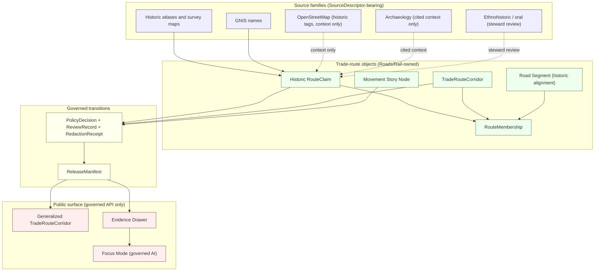
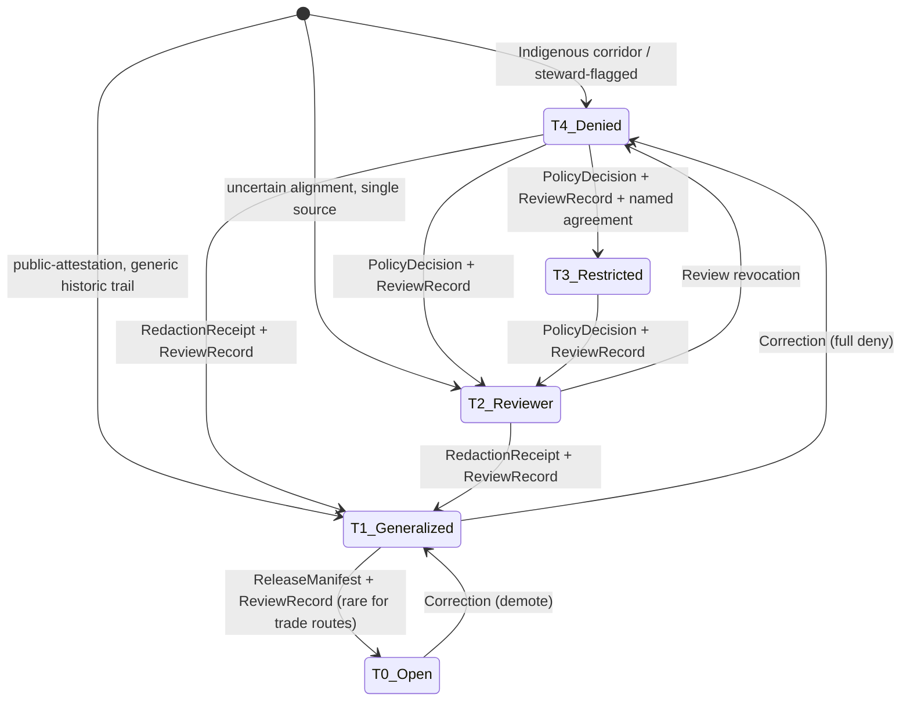

<!-- [KFM_META_BLOCK_V2]
doc_id: kfm://doc/docs-domains-roads-rail-trade-sublanes-trade-routes
title: Trade Routes Sublane — Roads, Rail, and Trade Routes Domain
type: standard
version: v2
status: draft
owners: <TODO: roads-rail-trade domain stewards; cultural-heritage / sovereignty reviewer>
created: 2026-05-19
updated: 2026-06-07
policy_label: public
related: [docs/domains/roads-rail-trade/README.md, docs/domains/roads-rail-trade/sublanes/README.md, docs/domains/roads-rail-trade/sublanes/roads.md, docs/domains/roads-rail-trade/sublanes/rail.md, docs/domains/roads-rail-trade/sublanes/trade.md, docs/doctrine/lifecycle-law.md, docs/doctrine/directory-rules.md, docs/domains/archaeology/README.md, docs/standards/PROV.md]
tags: [kfm, domain, roads-rail-trade, trade-routes, historic-corridors, sensitivity]
notes:
  - 'CONTRACT_VERSION = "3.0.0" pinned per ai-build-operating-contract.md'
  - "PROPOSED sublanes/ placement convention — NEEDS VERIFICATION against an ADR or directory-rules amendment (OQ-TR-01)."
  - "TERMINOLOGY: 'sublane' is not established KFM doctrine. 'lane' is defined; 'sub-lane' exists only in the Focus Mode cross-root sense (Directory Rules §6.7)."
  - "FILENAME: three spellings are in play — trade-routes.md (this file, kebab), trade.md (sibling, modern-freight slice), and a legacy trade_routes.md (underscore). Normalized here to trade-routes.md. See OQ-TR-07."
  - "TIER SCHEME T0–T4 is PROPOSED pending ADR-S-05 (Atlas §24.5.1); tier transitions in §7.2 are PROPOSED motion, not adopted doctrine."
  - "Cesium retired (v1.3 doctrine-target): packages/maplibre-runtime/ is the SOLE governed browser-side renderer; freeze rule in effect. Cesium language removed."
[/KFM_META_BLOCK_V2] -->

# Trade Routes Sublane

> Historic and trade corridors inside the Roads, Rail, and Trade Routes domain — governed as evidence, not as geometry.


-orange)


**Status:** draft &nbsp;·&nbsp; **Owners:** _TODO — roads-rail-trade domain stewards; cultural-heritage / sovereignty reviewer_ &nbsp;·&nbsp; **Last updated:** 2026-06-07

> [!IMPORTANT]
> **Placement and term are PROPOSED.** The `docs/domains/<domain>/sublanes/` subfolder pattern is **not yet documented** in [`docs/doctrine/directory-rules.md`](../../../doctrine/directory-rules.md). Separately, "sublane" is **not** a defined KFM term — KFM defines **lane** (a domain/topic segment inside a responsibility root) and uses **sub-lane** only for **Focus Modes** (a geographic *area* across responsibility roots, §6.7), so this usage collides with that sense. This file proceeds under the `sublanes/` convention on the assumption that large multi-aspect domains benefit from topic-segmented sub-folders (parallel to the `docs/runbooks/<domain>/` discussion). **An ADR is needed to freeze both the convention and the term before further `sublanes/` files are added.** See [Open questions](#15-open-questions--verification-backlog).

> [!WARNING]
> **Filename — three spellings exist.** This historic-corridor sublane appears as `trade-routes.md` (kebab; the form sibling cross-links use), `trade_routes.md` (underscore; legacy meta), and is adjacent to a separate sibling `trade.md` that covers the **modern trade / freight** slice. This file is normalized to **`trade-routes.md`** and scoped to **historic / trade / Indigenous corridors**; the modern-freight slice lives in `trade.md`. One of `trade.md` / `trade-routes.md` may be retired if the third sublane is kept as a single file. Tracked as **OQ-TR-07**.

---

## Quick jump

- [1. Scope and purpose](#1-scope-and-purpose)
- [2. Position within the parent domain](#2-position-within-the-parent-domain)
- [3. Ubiquitous language](#3-ubiquitous-language)
- [4. Object families](#4-object-families)
- [5. Source families](#5-source-families)
- [6. Pipeline shape (RAW → PUBLISHED)](#6-pipeline-shape-raw--published)
- [7. Sensitivity, rights, and publication posture](#7-sensitivity-rights-and-publication-posture)
- [8. Cross-lane relations](#8-cross-lane-relations)
- [9. Map and viewing products](#9-map-and-viewing-products)
- [10. API, contract, and schema surfaces](#10-api-contract-and-schema-surfaces)
- [11. Validators, tests, fixtures](#11-validators-tests-fixtures)
- [12. Governed AI behavior](#12-governed-ai-behavior)
- [13. Publication, correction, and rollback](#13-publication-correction-and-rollback)
- [14. Diagrams](#14-diagrams)
- [15. Open questions & verification backlog](#15-open-questions--verification-backlog)
- [16. Related docs](#16-related-docs)

---

## 1. Scope and purpose

**Scope.** This sublane covers the **trade-route and historic-corridor** subset of the Roads / Rail / Trade Routes domain. It is the home for `TradeRouteCorridor`, `Historic RouteClaim`, and the associated source families, sensitivity rules, evidence patterns, and map products that distinguish *historic claim* from *administrative status* from *modern geometry*. CONFIRMED doctrine grounds this sublane in Atlas v1.0 Ch. 13 (DOM-ROADS §§ A–N). [DOM-ROADS] [ENCY]

**Why it is its own sublane (PROPOSED).** Roads / Rail / Trade Routes spans modern roads, historic roads, wagon roads, military/mail/emigrant/stage/cattle/trade corridors, rail corridors, depots, yards, crossings, restrictions, facilities, freight/logistics context, and graph projections. The *trade-route and historic-corridor* slice has distinct source genres (historic atlases, treaty material, ethnohistorical and oral evidence), a stricter sensitivity default (steward review and generalized public geometry for Indigenous corridors), and a different evidence-handling shape (claim-bearing rather than observation-bearing). Separating it under `sublanes/` clarifies that distinction. [DOM-ROADS] [ENCY] [UNIFIED]

**What it does *not* cover.**

| Out of scope here | Lives in |
|---|---|
| Modern road and rail geometry, KDOT/TIGER pipelines | `sublanes/roads.md`, `sublanes/rail.md` |
| Modern trade / freight corridors, NHFN, freight-flow aggregates | `sublanes/trade.md` (modern-freight slice) |
| Depots, sidings, yards, transport facility identity | Parent domain + cross-lane edge to Settlements / Infrastructure [DOM-SETTLE] |
| River-crossing hydrologic context | Cross-lane edge to Hydrology [DOM-HYD] |
| Archaeological site coordinates along historic alignments | Archaeology / Cultural Heritage (deny-default site coords) [DOM-ARCH] |
| Living-person, DNA, or person-parcel joins via genealogy of route operators | People / Genealogy / DNA / Land [DOM-PEOPLE] |
| Emergency-alert authority over current route closures | Hazards never; the alert-authority boundary holds [DOM-HAZ] |

[↑ Back to top](#trade-routes-sublane)

---

## 2. Position within the parent domain

CONFIRMED doctrine — this sublane sits **inside** the Roads / Rail / Trade Routes domain (Atlas v1.0 Ch. 13). The parent domain's identity, scope, and lifecycle invariants apply in full; nothing here overrides them. [DOM-ROADS] [ENCY]

| Layer | Parent (CONFIRMED doctrine / PROPOSED home) | This sublane (PROPOSED scope) |
|---|---|---|
| Atlas chapter | Ch. 13 — Roads / Rail / Trade Routes [DOM-ROADS] | Trade-route + historic-corridor subset of Ch. 13 §B, §C, §I |
| Docs home | `docs/domains/roads-rail-trade/` (CONFIRMED in Directory Rules §6.1) [DIRRULES] | `docs/domains/roads-rail-trade/sublanes/trade-routes.md` (**PROPOSED**) |
| Contracts (meaning) | `contracts/transport/` (PROPOSED per Ch. 24.13 — **CONFLICTED** with Directory Rules §12 `contracts/domains/roads-rail-trade/`; see OQ-TR-08) [DIRRULES] [ENCY] | _no separate sublane home — uses parent_ |
| Schemas (shape) | `schemas/contracts/v1/transport/` (PROPOSED per Ch. 24.13; ADR-0001 — **CONFLICTED** with §12 `…/domains/roads-rail-trade/`; see OQ-TR-08) [DIRRULES] [ENCY] | _no separate sublane home — uses parent_ |
| Policy (admissibility) | `policy/domains/roads-rail-trade/` (PROPOSED per Directory Rules §12) [DIRRULES] | Generalization and cultural-route sensitivity rules concentrate here |
| Data lifecycle | `data/{raw,work,quarantine,processed,catalog,published}/roads-rail-trade/` (PROPOSED) [DIRRULES] | Historic-source carrier may need a distinct *processed*-stage projection from modern-source carrier |

> [!NOTE]
> Per Directory Rules §12 (Domain Placement Law), domains MUST NOT become root folders, and sublanes MUST NOT split a domain's lifecycle into parallel data, schema, or policy homes. This sublane is **documentation-only**. It does not create a `data/trade-routes/` or `schemas/contracts/v1/trade-routes/` tree, and any executable artefacts continue to live under the parent's responsibility roots. [DIRRULES]

[↑ Back to top](#trade-routes-sublane)

---

## 3. Ubiquitous language

The Atlas v1.0 ubiquitous-language table for the parent domain is authoritative. The terms below are the **subset** most active in this sublane, repeated here for navigational convenience and not re-defined. KFM-specific capitalization and compound terms are preserved exactly. [DOM-ROADS] [ENCY]

| Term | Sublane usage | Citation |
|---|---|---|
| **TradeRouteCorridor** | CONFIRMED term / PROPOSED field realization. Generalized geographical corridor representing a named trade or mobility route, distinct from precise alignment. | [DOM-ROADS] [ENCY] |
| **Historic RouteClaim** | CONFIRMED term / PROPOSED field realization. A *claim* about a historical route's alignment, period, or use — *not* the route itself. Evidence-bearing and always interpretable. | [DOM-ROADS] [ENCY] |
| **CorridorRoute** | CONFIRMED term / PROPOSED field realization. Generic corridor abstraction; trade-route corridors are a typed specialization. | [DOM-ROADS] [ENCY] |
| **RouteMembership** | CONFIRMED term / PROPOSED field realization. Association of a `Road Segment` or `Rail Segment` to a corridor or route; carries temporal scope. | [DOM-ROADS] [ENCY] |
| **Movement Story Node** | CONFIRMED domain-owned object (Atlas Ch. 13 §B). Narrative anchor for a movement, journey, or mobility event tied to corridor evidence. | [DOM-ROADS] [ENCY] |
| **Freight Corridor** | CONFIRMED domain-owned object (Atlas Ch. 13 §B). Modern freight-context corridor; PROPOSED cross-citation pattern with `TradeRouteCorridor` where a modern corridor inherits historical context. Primary home is `sublanes/trade.md`. | [DOM-ROADS] [ENCY] |

> [!IMPORTANT]
> **Geometry is not authority.** A polyline of any historic trail or Indigenous mobility corridor is **a claim**, not a fact. The sublane handles every trade-route geometry as `Historic RouteClaim` evidence under `EvidenceBundle` resolution. Promoting that evidence to a published `TradeRouteCorridor` is a governed state transition with its own gates. [DOM-ROADS] [ENCY] [DIRRULES]

[↑ Back to top](#trade-routes-sublane)

---

## 4. Object families

CONFIRMED domain ownership: the Roads / Rail / Trade Routes domain owns the objects below (Atlas Ch. 13 §B and §E). The sublane is most active in the rows marked **TR-primary**. [DOM-ROADS] [ENCY]

| Object | Identity rule (PROPOSED) | Temporal handling (CONFIRMED doctrine) | Activity in this sublane |
|---|---|---|---|
| `Historic RouteClaim` | source id + object role + temporal scope + normalized digest | source / observed / valid / retrieval / release / correction times stay distinct | **TR-primary** |
| `TradeRouteCorridor` | source id + object role + temporal scope + normalized digest | distinct times preserved | **TR-primary** |
| `CorridorRoute` | source id + object role + temporal scope + normalized digest | distinct times preserved | TR-supporting |
| `RouteMembership` | source id + object role + temporal scope + normalized digest | distinct times preserved | **TR-primary** (period and alignment claims propagate via membership) |
| `Movement Story Node` | (per parent ubiquitous language) | distinct times preserved | TR-supporting (narrative surface) |
| `Freight Corridor` | source id + object role + temporal scope + normalized digest | distinct times preserved | TR-supporting (modern → historic cross-citation; primary home `trade.md`) |
| `Road Segment` / `Rail Segment` | source id + object role + temporal scope + normalized digest | distinct times preserved | Cited by `RouteMembership`; not owned by the sublane |
| `Route Event` / `Operator Status` | source id + object role + temporal scope + normalized digest | distinct times preserved | Out of scope here (current-status; lives in `roads.md` / `rail.md`) |

CONFIRMED cross-cutting object families (owned outside Roads / Rail) that this sublane *cites*:

| Cited object family | Owner | Default tier (PROPOSED, ADR-S-05) | Citation |
|---|---|---|---|
| `EvidenceBundle` | ENCY doctrine (cross-cutting) | mirrors claim tier | [ENCY] |
| `SourceDescriptor` | source steward (cross-cutting) | varies | [ENCY] |
| `ArchaeologicalSite` | Archaeology / Cultural Heritage | **deny-default site coords** | [DOM-ARCH] |
| `Settlement` / `Municipality` / `GhostTown` | Settlements / Infrastructure | T0 | [DOM-SETTLE] |
| `CulturalTemporalPeriod` | Archaeology / Cultural Heritage | T0 | [DOM-ARCH] |

> [!NOTE]
> `Route Event` and `Operator Status` are the CONFIRMED owned-object names from Atlas Ch. 13 §B; earlier drafts of this sublane used `RestrictionEvent` / `StatusEvent` as field realizations. Those realizations are PROPOSED, not the dossier's canonical owned-object names.

[↑ Back to top](#trade-routes-sublane)

---

## 5. Source families

CONFIRMED doctrine — the parent domain's source-family roster (Atlas Ch. 13 §D) governs all transport sources. The rows below are the subset the *trade-route sublane* is most likely to admit, with rights / sensitivity / freshness left as **NEEDS VERIFICATION** in keeping with parent-domain doctrine; sensitive joins fail closed. [DOM-ROADS] [ENCY]

| Source family | Role (per source descriptor) | Rights / sensitivity | Freshness | Status |
|---|---|---|---|---|
| Historic atlases and survey maps (e.g., GLO, USGS historical topographic) | authority / observation / context / model as source role requires | rights and current terms **NEEDS VERIFICATION**; sensitive joins fail closed | source-vintage specific | [DOM-ROADS] [ENCY] |
| Ethnohistorical and oral-history corpora (Indigenous mobility, treaty, traveller accounts) | context / model as source role requires (rarely *authority*) | **steward-review default**; rights, sovereignty, and consent terms **NEEDS VERIFICATION** | source-vintage specific | [DOM-ROADS] [DOM-ARCH] [ENCY] |
| GNIS names (route, station, ford, ferry, depot) | authority / observation / context / model as source role requires | rights and current terms NEEDS VERIFICATION; sensitive joins fail closed | cadence specific | [DOM-ROADS] [ENCY] |
| OpenStreetMap (historic tags: `historic=*`, `route=*`, `name=*`, `network=*`) | observation / context only — **never legal-status authority** | rights NEEDS VERIFICATION; OSM legal-status denial is a validator-enforced gate (see §11) | rolling | [DOM-ROADS] [ENCY] |
| Census TIGER/Line roads (historic editions) | authority / observation / context / model as source role requires | rights and current terms NEEDS VERIFICATION | edition-specific | [DOM-ROADS] [ENCY] |
| National Park Service / National Historic Trail records | authority / observation / context / model as source role requires | rights and current terms NEEDS VERIFICATION | cadence specific | PROPOSED addition (not in parent §D table) |
| County, state, and tribal historical-society holdings | context / model as source role requires | **steward-review default**; rights NEEDS VERIFICATION | source-specific | PROPOSED addition (not in parent §D table) |

> [!CAUTION]
> The two rows marked **PROPOSED addition** extend the parent domain's §D roster (which lists Census TIGER, FHWA HPMS, FHWA NHFN, WZDx, KDOT/KanPlan/KanDrive, county/state bridge data, GNIS, and OpenStreetMap [DOM-ROADS] [ENCY]). Admission requires a `SourceDescriptor`, rights review, and the parent domain's RAW-stage gate before any historic-trail material is ingested. Do not treat them as accepted source families.

[↑ Back to top](#trade-routes-sublane)

---

## 6. Pipeline shape (RAW → PUBLISHED)

CONFIRMED doctrine — the parent domain follows the canonical lifecycle, and this sublane inherits it without bypass: `RAW → WORK / QUARANTINE → PROCESSED → CATALOG / TRIPLET → PUBLISHED`, with promotion as a **governed state transition, not a file move**. [DIRRULES] [DOM-ROADS] [ENCY]

| Stage | Trade-route-specific handling (PROPOSED) | Gate (CONFIRMED doctrine) | Status |
|---|---|---|---|
| **RAW** | Capture immutable source payload — historic atlas scan, ethnohistorical excerpt, GNIS row — with source role, rights, sensitivity, citation, time, and hash. Indigenous-corridor evidence enters with steward-review flag set. | `SourceDescriptor` exists. | PROPOSED |
| **WORK / QUARANTINE** | Normalize: assign canonical corridor name, period of attestation, uncertainty bound, alignment evidence type. Hold failures (e.g., legal-status assertions sourced only from OSM tags) in quarantine with a recorded reason. | Validation and policy gate pass, or quarantine reason recorded. | PROPOSED |
| **PROCESSED** | Emit validated `Historic RouteClaim` objects, `TradeRouteCorridor` candidates, `RouteMembership` proposals, receipts, and public-safe candidate geometry. *Historic and modern carriers stay separate.* [UNIFIED — PROPOSED] | `EvidenceRef`, `ValidationReport`, and digest closure exist. | PROPOSED |
| **CATALOG / TRIPLET** | Emit catalog records, `EvidenceBundle`s, graph / triplet projections, and release candidates. Graph-derived corridors are labelled **derived**, never canonical. [DOM-ROADS] [ENCY] | Catalog / proof closure passes. | PROPOSED |
| **PUBLISHED** | Serve released public-safe artifacts — generalized `TradeRouteCorridor` polylines, narrative `Movement Story Node`s, Evidence Drawer payloads — through governed APIs and manifests. | `ReleaseManifest`, correction path, rollback target, and review / policy state exist. | PROPOSED |

> [!WARNING]
> **No back-channel publishing.** Public clients reach trade-route data only through the governed API. The browser renderer — `packages/maplibre-runtime/`, the **sole governed renderer** (v1.3; Cesium retired) — consumes the same `EvidenceBundle` and `DecisionEnvelope` as any other client; it is **not** a parallel truth path. [DIRRULES §11]

[↑ Back to top](#trade-routes-sublane)

---

## 7. Sensitivity, rights, and publication posture

CONFIRMED doctrine — *Indigenous trade and mobility corridors, oral history, treaty, cultural, and interpretive evidence default to steward review and generalized public geometry. Critical transport facilities require review.* [DOM-ROADS] [ENCY]

CONFIRMED doctrine — *Unclear rights, unresolved source role, missing evidence, unresolved sensitivity, or absent release state blocks public promotion.* [ENCY] [DIRRULES]

> [!IMPORTANT]
> **The T0–T4 tier scheme itself is PROPOSED, pending ADR-S-05.** Atlas §24.5.1 labels the tier scheme PROPOSED, and ADR-S-05 ("adopt as canonical or revise") is an **open ADR**. The tables in §7.1 and §7.2 therefore describe **proposed motion**, not adopted doctrine. The *underlying postures* they encode (steward review + generalized geometry for Indigenous corridors; deny-default site coords; cite-or-abstain) are CONFIRMED; the *tier labels and transition artifacts* are PROPOSED. [ENCY §24.5.1] [DIRRULES ADR-S-05]

### 7.1 Default tier by trade-route claim class (PROPOSED)

Per Atlas §24.5 (Master Sensitivity / Rights Tier Reference, PROPOSED), applying the parent domain's posture to this sublane:

| Claim class | Default tier | Allowed transforms (PROPOSED) | Required gates |
|---|---|---|---|
| Generic historic trail with broad public attestation (e.g., a named national historic trail) | **T1** | Generalize alignment to corridor (cell size pending the redaction-determinism profile); record `RedactionReceipt`. | `RedactionReceipt` + `ReviewRecord` |
| Indigenous trade / mobility corridor, sourced from steward-governed material | **T4** | Steward + sovereignty review → generalize → `RedactionReceipt` → demote to **T2** (reviewer-only) or **T1** (generalized public). No transform releases to **T0**. | Sovereignty review + `ReviewRecord` + `PolicyDecision` |
| Uncertain historic alignment (single-source, contested, low-precision) | **T2** | Reviewer-only until corroborating evidence or steward sign-off. Generalization may later move to **T1**. | `ReviewRecord` + uncertainty label |
| `Movement Story Node` referencing living-person account, oral-history participant, or culturally sensitive narrator | **T4** | De-identification + consent + `RedactionReceipt` → **T2**; aggregation may permit **T1**. Crosses into People / DNA / Land posture if living-person fields are present. | Consent + `ReviewRecord` + `PolicyDecision` ([DOM-PEOPLE]) |
| Modern freight-corridor cross-citation to a historic corridor | **T0–T1** | Freight footprint at parent-domain default; historic context carried as generalized cross-citation. | Per parent-domain release manifest |

[↑ Back to top](#trade-routes-sublane)

### 7.2 Tier-transition motion (PROPOSED, per Atlas §24.5.3)

From Atlas §24.5.3, restated for this sublane. **The tier scheme is PROPOSED (ADR-S-05); this is proposed motion, not adopted doctrine.**

| From → To | Required artifact | Required reviewer | Reversibility |
|---|---|---|---|
| **T4 → T3** | `PolicyDecision` + `ReviewRecord` + named agreement | Steward + rights-holder where applicable | Reversible: agreement revocation returns to **T4** with `CorrectionNotice` |
| **T4 → T2** | `PolicyDecision` + `ReviewRecord` | Steward | Reversible: review revocation returns to **T4** |
| **T4 → T1** | `RedactionReceipt` + `ReviewRecord` | Steward | Reversible: redaction can be re-evaluated; a published **T1** can be demoted to **T4** by correction |
| **T2 → T1** | `RedactionReceipt` + `ReviewRecord` | Steward | Reversible |
| **T1 → T0** | `ReleaseManifest` + `ReviewRecord` | Steward + release authority | Reversible via `RollbackCard` |

> [!CAUTION]
> **Never publish exact archaeological coordinates that intersect a trade-route alignment.** Atlas Ch. 13 §F is explicit: historical corridor reconstructions are cited as context only; exact archaeological coordinates are denied. Archaeology owns the site, Roads / Rail cites the context, and the published trade-route corridor must be generalized enough that it does not become a forensic locator. [DOM-ROADS] [DOM-ARCH] [ENCY]

[↑ Back to top](#trade-routes-sublane)

---

## 8. Cross-lane relations

CONFIRMED doctrine (Atlas Ch. 13 §F). Each cited relation must preserve ownership, source role, sensitivity, and `EvidenceBundle` support. [DOM-ROADS] [ENCY]

| This sublane | Related lane | Relation type | Constraint |
|---|---|---|---|
| Trade Routes (Roads / Rail) | Archaeology / Cultural Heritage | Historic alignments cite forts, missions, Indigenous corridors as *context*; **exact archaeological coordinates denied** | Archaeology retains coord truth and sensitivity policy [DOM-ARCH] |
| Trade Routes (Roads / Rail) | Settlements / Infrastructure | Depots, stations, ferry-landings, ghost-town anchors along corridors | Settlement / facility identity is **settlement-owned** [DOM-SETTLE] |
| Trade Routes (Roads / Rail) | Hydrology | River-crossing / ford / ferry geometry; floodplain interaction | Hydrology owns water evidence; bridge / ferry / ford context cited [DOM-HYD] |
| Trade Routes (Roads / Rail) | Hazards | Closure, detour, flood / fire / smoke exposure along corridors | KFM is **never** an alert authority; cite context only [DOM-HAZ] |
| Trade Routes (Roads / Rail) | People / Genealogy / DNA / Land | Operator identity, journey participants (when narrators are living, deny-default applies) | Living-person, DNA, person-parcel lanes deny-default [DOM-PEOPLE] |
| Trade Routes (Roads / Rail) | Frontier Matrix | Generalized access observations bound the access cells of the matrix | Frontier Matrix is composition, not authority [DOM-ROADS] [UNIFIED] |
| Trade Routes (Roads / Rail) | Planetary / 3D / Digital Twin | Corridor or fly-over scenes use the *same* `EvidenceBundle` / `DecisionEnvelope` | 3D is an alternate renderer (`packages/maplibre-runtime/` + governed plugins), never an alternate truth path [DIRRULES §11] |

[↑ Back to top](#trade-routes-sublane)

---

## 9. Map and viewing products

PROPOSED — the parent domain's viewing-product list (Atlas Ch. 13 §G) includes a *historic route claim view*, a *generalized trade-route corridor*, and a *derived graph / connectivity view*. This sublane is the documentation home for those three products, plus the cross-cutting drawers and modes that wrap them. [DOM-ROADS] [ENCY]

| Product | Role in this sublane | Tier / posture (PROPOSED) |
|---|---|---|
| Historic-route-claim view | Per-claim presentation of `Historic RouteClaim`, with EvidenceBundle resolution and uncertainty surface | T1 default (generalized); T2 for contested / single-source alignments |
| Generalized trade-route corridor | Public-safe `TradeRouteCorridor` polyline / band — generalization is governed, not stylistic | T1 default; T4 for Indigenous / steward-flagged corridors until review |
| Derived graph / connectivity view | Network projection across corridor membership; *labelled derived*, never canonical | T1; rollback test required (see §11) |
| Evidence Drawer | Per-claim citation surface; stale / uncertainty badges; public-safe redaction visibility | Cross-cutting [MAP-MASTER] [GAI] |
| Focus Mode | Bounded-scope governed AI over released trade-route bundles only; ABSTAIN / DENY behaviour | Cross-cutting [GAI] |
| Movement Story Node renderer | Narrative anchor with abstain template when EvidenceBundle / spec_hash / redaction receipt is missing | T1–T2 depending on narrator status |

> [!NOTE]
> **MapLibre tile shape (illustrative).** The Master MapLibre catalog records `ML-G-046` (canonical historic-trail LineString shape), `ML-H-031` (historic-trail vector tile generation), and `ML-Y-077` (historic-trail overlay thin slice) as EXPANDED ideas. They are illustrative of how a trade-route corridor would be tiled (vector PMTiles per epoch, precision-gated). They are **not** a claim that any such tile already exists in the repo. [MAP-MASTER]

[↑ Back to top](#trade-routes-sublane)

---

## 10. API, contract, and schema surfaces

PROPOSED — surfaces below extend the parent domain's §J table. Exact routes, package names, and DTOs are UNKNOWN without mounted-repo evidence. [DOM-ROADS] [DIRRULES]

| Surface | DTO / schema (PROPOSED) | Outcomes | Status |
|---|---|---|---|
| Trade-route feature / detail resolver | `RoadsRailDecisionEnvelope` (parent-domain DTO; PROPOSED specialization for `TradeRouteCorridor` / `Historic RouteClaim`) | `ANSWER` / `ABSTAIN` / `DENY` / `ERROR` | PROPOSED; exact route UNKNOWN |
| Trade-route layer manifest resolver | `LayerManifest` / domain layer descriptor | `ANSWER` / `DENY` / `ERROR` | PROPOSED; public-safe release only |
| Trade-route Evidence Drawer payload | `EvidenceDrawerPayload` + `EvidenceBundle` projection | `ANSWER` / `ABSTAIN` / `DENY` / `ERROR` | PROPOSED; evidence- and policy-filtered |
| Trade-route Focus Mode answer | `RuntimeResponseEnvelope` + `AIReceipt` | `ANSWER` / `ABSTAIN` / `DENY` / `ERROR` | PROPOSED; AI never root truth [GAI] |
| Schema responsibility root | `schemas/contracts/v1/transport/` (PROPOSED per Ch. 24.13; **CONFLICTED** with §12 `…/domains/roads-rail-trade/`; ADR-0001 binds the schema-home rule) | finite validator outcomes | PROPOSED |
| Contracts (meaning) | `contracts/transport/` (PROPOSED; CONFLICTED — see OQ-TR-08) | n/a | PROPOSED |
| Policy (admissibility) | `policy/domains/roads-rail-trade/` (PROPOSED per Directory Rules §12) | `ALLOW` / `DENY` / `RESTRICT` / `ABSTAIN` | PROPOSED |

<details>
<summary><strong>Illustrative envelope shape (PROPOSED — not a contract)</strong></summary>

```jsonc
// PROPOSED illustrative shape. Not a binding contract.
// Authoritative shape lives in schemas/contracts/v1/transport/ (PROPOSED; slug CONFLICTED — OQ-TR-08).
{
  "outcome": "ANSWER",
  "claim": {
    "type": "TradeRouteCorridor",
    "name": "<canonical corridor name>",
    "alignment_evidence": [
      { "kind": "Historic RouteClaim", "evidence_ref": "kfm://evidence/..." }
    ],
    "temporal_scope": {
      "valid_from": "YYYY-MM-DD",
      "valid_to": "YYYY-MM-DD"
    },
    "geometry": {
      "type": "LineString",
      "generalization": { "method": "TODO", "cell_m": null }
    },
    "tier": "T1",
    "uncertainty": {
      "alignment": "TODO",
      "period": "TODO"
    }
  },
  "evidence_bundle": "kfm://evidence/bundle/...",
  "policy_decision": "kfm://policy/decision/...",
  "release_manifest": "kfm://release/manifest/...",
  "receipts": ["kfm://receipt/redaction/..."]
}
```

</details>

[↑ Back to top](#trade-routes-sublane)

---

## 11. Validators, tests, fixtures

PROPOSED — the parent domain enumerates the validator set (Atlas Ch. 13 §K); this sublane is most active in the rows below. [DOM-ROADS] [ENCY]

- **Route membership and designation separation tests (PROPOSED).** A `RouteMembership` MUST NOT collapse a corridor's named designation with the underlying segment's administrative status. [DOM-ROADS]
- **Historic overprecision denial (PROPOSED).** Released historic alignments MUST carry generalization metadata; alignments with precision tighter than the configured threshold are denied at the promotion gate. [DOM-ROADS]
- **OSM / GNIS legal-status denial (PROPOSED).** Legal status (e.g., "national historic trail") MUST NOT be asserted from OSM tags or GNIS rows alone; an authority-role source is required. [DOM-ROADS]
- **Operator / status temporal tests (PROPOSED).** Operator and status assertions MUST preserve source, observed, valid, retrieval, release, and correction times distinctly. [DOM-ROADS] [ENCY]
- **Public generalization receipt tests (PROPOSED).** Every published trade-route corridor MUST resolve to a `RedactionReceipt` recording the generalization method, cell size or radius, and seed (if jittered). The seeded-jitter determinism rule's document home is `docs/standards/REDACTION_DETERMINISM.md` (**PROPOSED in corpus; not yet authored**). [DIRRULES §6.1]
- **Transport graph projection rollback tests (PROPOSED).** A derived graph projection that loses its underlying corridor evidence MUST be rolled back, not patched in place. [DOM-ROADS]
- **Steward-review-required denial (PROPOSED, sublane-specific).** An Indigenous/cultural corridor claim MUST NOT reach PUBLISHED without a `[DOM-ARCH]`-governed `ReviewRecord`. [DOM-ARCH] [ENCY]

> [!TIP]
> **Fixtures live close to the proof, not the schema.** Per Directory Rules §6.6 you MAY keep trade-route fixtures under `tests/fixtures/` or `fixtures/`, but you MUST NOT maintain two competing fixture homes for the same artefact. Pick one and declare the difference in the README. [DIRRULES]

[↑ Back to top](#trade-routes-sublane)

---

## 12. Governed AI behavior

CONFIRMED doctrine / PROPOSED implementation — AI may summarize released trade-route `EvidenceBundle`s, compare evidence, explain limitations, and draft steward-review notes. AI MUST **ABSTAIN** when evidence is insufficient and **DENY** where policy, rights, sensitivity, or release state blocks the request. AI never reads RAW or WORK content; only released `EvidenceBundle`. [GAI] [DOM-ROADS] [ENCY]

| Trade-route AI request | Expected behaviour |
|---|---|
| "Summarize the published evidence for the corridor named X" | **ANSWER** with citations to the resolved `EvidenceBundle`; uncertainty surfaced. |
| "Where exactly does the Indigenous mobility corridor Y run?" | **DENY** when corridor Y is at a deny-default tier; **ABSTAIN** when published evidence is generalized and the question demands precision the published tier cannot supply. |
| "Was operator O assigned to corridor X in 1873?" | **ANSWER** if operator evidence supports it with distinct observed and valid times; otherwise **ABSTAIN**. |
| "Compose a story node connecting living-person account L to corridor X" | **DENY** unless consent + `ReviewRecord` + `PolicyDecision` satisfy the People / Land posture. [DOM-PEOPLE] |
| "Show me the underlying RAW source rows" | **DENY** — AI surface never touches RAW / WORK. [GAI] |

[↑ Back to top](#trade-routes-sublane)

---

## 13. Publication, correction, and rollback

CONFIRMED doctrine / PROPOSED implementation — trade-route publication requires `ReleaseManifest`, `EvidenceBundle`, validation / policy support, review state where required, correction path, stale-state rule, and rollback target. Atlas Appendix E governs supersession. [ENCY Appendix E] [DOM-ROADS] [ENCY]

| Lifecycle moment | Required artefact | Notes |
|---|---|---|
| Release of a `TradeRouteCorridor` polyline | `ReleaseManifest` + `EvidenceBundle` + `RedactionReceipt` + `ReviewRecord` | Indigenous-corridor cases additionally require sovereignty `PolicyDecision`. |
| Correction of an alignment claim | `CorrectionNotice` (Atlas Appendix E) | Demotion to a more-restrictive tier is reversible per §24.5.3 (PROPOSED). |
| Stale historic source (e.g., superseded atlas edition) | Stale-state flag on the source descriptor | Published derivative continues to serve under stale label until next promotion cycle. |
| Rollback of a published corridor | `RollbackCard` referencing the prior `ReleaseManifest` | Graph projections derived from the rolled-back release must roll back together (see §11 graph-rollback test). |

[↑ Back to top](#trade-routes-sublane)

---

## 14. Diagrams

### 14.1 Trade-route object topology (PROPOSED)



> [!NOTE]
> This diagram is **PROPOSED** — it reflects the doctrinal flow described in Atlas Ch. 13 §B, §F, §H, §I and the cross-domain crosswalk in §24.5 / §24.13, but the underlying repo files, route names, and DTOs are **NEEDS VERIFICATION** in this docs-only session. [DOM-ROADS] [ENCY] [DIRRULES]

### 14.2 Tier transitions for trade-route claims (PROPOSED motion, ADR-S-05)



> [!NOTE]
> The tier labels and transitions above are **PROPOSED** pending ADR-S-05 (Atlas §24.5.1 labels the scheme PROPOSED). The motion is illustrative of the intended governance, not adopted doctrine.

[↑ Back to top](#trade-routes-sublane)

---

## 15. Open questions & verification backlog

| ID | Item | What would settle it | Status |
|---|---|---|---|
| **OQ-TR-01** | `sublanes/` subfolder convention + "sublane" term (collides with Focus Mode "sub-lane" §6.7) | ADR or amendment to `docs/doctrine/directory-rules.md` §6.1 | CONFLICTED — placement + term PROPOSED |
| **OQ-TR-02** | Generalization profile (cell size, radius, jitter seed rule) for published trade-route corridors | Authoring `docs/standards/REDACTION_DETERMINISM.md` (PROPOSED in corpus, not yet authored) + per-profile entry | NEEDS VERIFICATION |
| **OQ-TR-03** | Schema home for `TradeRouteCorridor`, `Historic RouteClaim`, `RouteMembership` | Repo evidence under the resolved schema slug + valid/invalid fixtures | UNKNOWN — repo not mounted |
| **OQ-TR-04** | Indigenous-corridor steward-review workflow (sovereignty + rights-holder + reviewer roles) | `policy/domains/roads-rail-trade/` rules + workflow doc + signed `ReviewRecord` template | NEEDS VERIFICATION |
| **OQ-TR-05** | Historic-source rights and current terms for each row in §5 | `SourceDescriptor` entries with rights review | NEEDS VERIFICATION (parent §D already flags this) |
| **OQ-TR-06** | Anchor stability of `Movement Story Node` across Atlas v1.0 → v1.1 | Confirm against `docs/atlases/` and Appendix G | NEEDS VERIFICATION |
| **OQ-TR-07** | Filename: `trade-routes.md` (this file) vs `trade.md` (modern-freight sibling) vs legacy `trade_routes.md` | Parent dossier README + ADR; `DRIFT_REGISTER.md` entry | CONFLICTED — three spellings, possible duplicate scope |
| **OQ-TR-08** | Schema/contract slug: `transport/` (Atlas §24.13) vs `domains/roads-rail-trade/` (Directory Rules §12) | ADR aligning the two project docs; `DRIFT_REGISTER.md` entry | CONFLICTED — slug variance |
| **OQ-TR-09** | Tier scheme T0–T4 adoption | ADR-S-05 acceptance (currently open; §24.5.1 PROPOSED) | NEEDS VERIFICATION |
| **OQ-TR-10** | Final repo placement of this very document | Mounted-repo inspection | NEEDS VERIFICATION |

[↑ Back to top](#trade-routes-sublane)

---

## 16. Related docs

> Relative links use this document's location at `docs/domains/roads-rail-trade/sublanes/trade-routes.md` (PROPOSED). Confirm paths against the repo before relying on them in PR review.

- [`../README.md`](../README.md) — Roads / Rail / Trade Routes domain README (TODO if not yet authored)
- [`./README.md`](./README.md) — Sublane index (PROPOSED)
- [`./roads.md`](./roads.md) — Roads sublane (modern roads)
- [`./rail.md`](./rail.md) — Rail sublane
- [`./trade.md`](./trade.md) — Trade & freight sublane (modern-freight slice) — see OQ-TR-07
- [`../../../doctrine/directory-rules.md`](../../../doctrine/directory-rules.md) — Directory Rules (governs placement)
- [`../../../doctrine/lifecycle-law.md`](../../../doctrine/lifecycle-law.md) — RAW → PUBLISHED lifecycle law
- [`../../../doctrine/trust-membrane.md`](../../../doctrine/trust-membrane.md) — Trust membrane (governed API boundary)
- [`../../../architecture/governed-api.md`](../../../architecture/governed-api.md) — Governed API surface
- [`../../../standards/PROV.md`](../../../standards/PROV.md) — Provenance standard (W3C PROV-O mapping)
- [`../../../standards/REDACTION_DETERMINISM.md`](../../../standards/REDACTION_DETERMINISM.md) — Redaction determinism standard *(TODO — PROPOSED in corpus, not yet authored)*
- [`../../../standards/SENSITIVITY_RUBRIC.md`](../../../standards/SENSITIVITY_RUBRIC.md) — Sensitivity rubric *(TODO — PROPOSED in corpus, not yet authored)*
- [`../../archaeology/README.md`](../../archaeology/README.md) — Archaeology / Cultural Heritage domain (cross-lane sensitivity owner)
- [`../../settlements-infrastructure/README.md`](../../settlements-infrastructure/README.md) — Settlements / Infrastructure domain (facility identity)
- [`../../people-dna-land/README.md`](../../people-dna-land/README.md) — People / Genealogy / DNA / Land domain (living-person posture)

---

<sub>**Citation short-codes used above** — [DOM-ROADS] Roads, Rail, and Trade Routes dossier (Atlas v1.0 Ch. 13); [ENCY] KFM Encyclopedia; [DIRRULES] Directory Rules; [DOM-ARCH] Archaeology / Cultural Heritage dossier; [DOM-SETTLE] Settlements / Infrastructure dossier; [DOM-HYD] Hydrology dossier; [DOM-HAZ] Hazards dossier; [DOM-PEOPLE] People / Genealogy / DNA / Land dossier; [MAP-MASTER] Master MapLibre Components dossier; [GAI] Governed AI dossier; [UNIFIED] Unified Implementation Architecture Build Manual.</sub>

---

_Last updated: 2026-06-07 &nbsp;·&nbsp; Doc version: v2 &nbsp;·&nbsp; Status: draft &nbsp;·&nbsp; CONTRACT_VERSION: 3.0.0 &nbsp;·&nbsp; Owners: TODO &nbsp;·&nbsp; [↑ Back to top](#trade-routes-sublane)_
