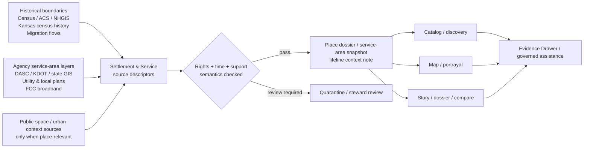

<!-- [KFM_META_BLOCK_V2]
doc_id: kfm://doc/NEEDS-VERIFICATION
title: Settlement & Service Geography
type: standard
version: v1
status: draft
owners: NEEDS VERIFICATION
created: YYYY-MM-DD
updated: YYYY-MM-DD
policy_label: NEEDS VERIFICATION
related: [NEEDS VERIFICATION]
tags: [kfm, settlement, service-geography, place-dossiers, lifeline-systems]
notes: [Mounted repo tree was not directly visible in this session; owners, related paths, and subtree inventory require repo verification.]
[/KFM_META_BLOCK_V2] -->

# Settlement & Service Geography

Kansas-first routing surface for settlement geography, place dossiers, service areas, lifeline systems, and public-space context.

> [!NOTE]
> **Status:** experimental  
> **Owners:** NEEDS VERIFICATION  
>     
> **Quick jumps:** [Scope](#scope) · [Repo fit](#repo-fit) · [Accepted inputs](#accepted-inputs) · [Exclusions](#exclusions) · [Current verified snapshot](#current-verified-snapshot) · [Directory tree](#directory-tree) · [Quickstart](#quickstart) · [Usage](#usage) · [Diagram](#diagram) · [Lane registry](#lane-registry) · [Task list](#task-list--definition-of-done) · [FAQ](#faq) · [Appendix](#appendix)  
> **Repo fit:** `docs/domains/settlement-services/README.md` → upstream: [`../README.md`](../README.md) (**NEEDS VERIFICATION**), [`../../README.md`](../../README.md) (**NEEDS VERIFICATION**) · downstream: settlement/service geography leaves in this subtree (**PROPOSED / NEEDS VERIFICATION**)

> [!IMPORTANT]
> This directory should function as a **domain routing surface**, not as a generic urban-studies notebook and not as a substitute for KFM’s current proof-first environmental lanes. Keep it narrow, evidence-aware, and explicit about whether a claim is statistical, administrative, operational, documentary, or modeled.

> [!WARNING]
> Current session evidence surfaced the KFM PDF corpus, not a mounted repository tree. Adjacent file inventory, subtree depth, owners, workflows, tests, schemas, and downstream leaves remain **UNKNOWN** or **NEEDS VERIFICATION** unless separately rechecked in the repo.

## Scope

This lane covers the part of KFM that moves from **where people and places are** to **how service context is organized around them**.

In practice, that means this directory is the home for guidance and routing around:

- **Settlement geography**: historical boundaries, census baselines, population framing, migration and mobility context
- **Service geography**: service areas, catchments, municipal and county context, lifeline systems, and critical-service coverage
- **Place dossiers**: durable place- or feature-centered objects that assemble identity, dependencies, service areas, hazards/water context, gap notes, and evidence links
- **Public-space context**: urban/public-space material only when it is being used as evidence-bearing context for place and service interpretation, not as free-floating theory

This lane exists because KFM is **not only** an environmental analyzer. It is a Kansas-first spatial evidence system with room for municipal, civic, and service context. That said, the current corpus treats this area as a **legitimate but less operationally specified lane** than hydrology or hazards, so documentation here should stay honest about maturity.

## Repo fit

| Path | Role | Relationship | Status |
| --- | --- | --- | --- |
| `docs/domains/settlement-services/README.md` | directory README | this file | **CONFIRMED** |
| [`docs/domains/README.md`](../README.md) | domain hub | likely parent lane index | **NEEDS VERIFICATION** |
| [`docs/README.md`](../../README.md) | docs hub | likely broader docs entry point | **NEEDS VERIFICATION** |
| `docs/domains/settlement-services/settlement-geography/` | candidate child lane | historical boundaries, census, migration/mobility packaging | **PROPOSED** |
| `docs/domains/settlement-services/service-areas/` | candidate child lane | catchments, service polygons, coverage and access context | **PROPOSED** |
| `docs/domains/settlement-services/place-dossiers/` | candidate child lane | durable downstream place objects | **PROPOSED** |
| `docs/domains/settlement-services/lifeline-systems/` | candidate child lane | utilities, emergency response, broadband, critical systems | **PROPOSED** |
| `docs/domains/settlement-services/public-space/` | candidate child lane | urban/public-space evidence where it affects place interpretation | **PROPOSED** |

## Accepted inputs

This directory should accept material that helps KFM explain **settlement patterns**, **service context**, or **place-centered evidence objects**.

### Core settlement-geography inputs

- historical boundaries and administrative geography
- decennial census baselines
- ACS and NHGIS extracts
- Kansas territorial and state census material
- migration and mobility summaries, including origin-destination or IRS-style movement products
- time-aware place frames and boundary changes

### Core service-geography inputs

- agency service-area layers
- municipal and county service context
- school districts, healthcare catchments, emergency response areas, utilities, and broadband context
- KDOT or state GIS service-coverage context where relevant
- local plans and utility/service reports
- place-level service-capacity cues, when support and time basis are explicit

### Supporting context inputs

- public-space or urban-form studies that help interpret access, service reach, mobility, or place conditions
- place-dossier components that combine service areas with supporting hazards, water context, identity, and evidence links
- explanatory maps, tables, and civic-context summaries that remain reconstructable to source evidence

## Exclusions

This directory should **not** become the default drop-zone for every place-shaped or city-shaped file.

| Does **not** belong here | Route instead | Why |
| --- | --- | --- |
| deeds, plats, parcel history, chain-of-title work | land-tenure / cadastral lane | legal description and title-resolution burdens are different |
| archive scans, oral histories, heritage narratives | archives / heritage lane | rights, provenance, and reuse constraints need their own treatment |
| hydrology-first material, reservoir operations, flood stages, water-quality records | hydrology lane | water remains the preferred first thin slice and should not be diluted here |
| severe weather, flood, smoke, drought, resilience composites | hazards lane | hazard semantics and publication burdens differ from service context |
| GTFS-RT, work-zone, closure, or live transportation operations | transportation / logistics lane | real-time mobility feeds require distinct merge logic |
| financial or transactional “settlement services” | outside this lane | this path is interpreted here as **settlement geography**, not financial settlement |
| unsupported current service-capacity claims | review / quarantine path | service geography, legal jurisdiction, and operational capacity are not identical |
| generic urban-design reading notes without KFM routing value | research / notes elsewhere | this lane is for governed operational context, not a theory scrapbook |

## Status vocabulary

Use these labels in this subtree unless a stronger local convention is already verified elsewhere.

| Label | Meaning here |
| --- | --- |
| **CONFIRMED** | Directly supported by the current KFM corpus or by directly visible workspace evidence in this session |
| **INFERRED** | Strongly implied by the corpus, but not directly surfaced as mounted implementation |
| **PROPOSED** | Recommended file shape, packaging move, or workflow direction |
| **UNKNOWN** | Not verified strongly enough to claim as current repo fact |
| **NEEDS VERIFICATION** | Reviewable placeholder for owners, paths, file inventory, or implementation details that likely exist but were not directly surfaced |

## Current verified snapshot

The following points are the safest current-session takeaways for this lane:

1. KFM treats **settlement geography** and **service geography** as structural Kansas operating lanes, not decorative topic buckets.
2. The corpus distinguishes two adjacent but related concerns:
   - **historical boundaries / census / settlement geography / migration-mobility**
   - **places / cities / service areas / lifeline systems / critical systems**
3. The corpus also frames this broader lane as **real and important**, but **less operationally specified** than hydrology or hazards.
4. Place dossiers are a meaningful downstream object for this lane, because KFM’s shell doctrine already treats the dossier as a durable object that can carry service areas, dependencies, hazards/water context, gap notes, and evidence links.
5. Mounted subtree inventory, file leaves, schemas, tests, owners, and workflow coverage remain **UNKNOWN** in this session.

## Directory tree

Only the target README path was explicit in the request. The subtree below is a **starter shape**, not a claim about mounted repo contents.

```text
docs/
└── domains/
    └── settlement-services/
        ├── README.md                     # CONFIRMED target path
        ├── settlement-geography/         # PROPOSED
        ├── service-areas/                # PROPOSED
        ├── place-dossiers/               # PROPOSED
        ├── lifeline-systems/             # PROPOSED
        └── public-space/                 # PROPOSED
```

## Quickstart

Use this lane when you need to decide **what kind of place/service evidence you have**, **how it should be interpreted**, and **where it should route next**.

1. **Classify the incoming source**
   - settlement baseline
   - migration / mobility
   - service-area layer
   - municipal / lifeline context
   - public-space supporting context
   - place-dossier input

2. **Declare the knowledge character**
   - statistical aggregate
   - administrative record
   - operator/service context
   - documentary evidence
   - modeled / derived layer

3. **Attach time and support semantics**
   - what date or period does this describe?
   - what is the unit of support: person, household, tract, county, service polygon, jurisdiction, route, facility?

4. **Separate what often gets collapsed**
   - service geography
   - legal jurisdiction
   - operational capacity
   - observed condition
   - modeled estimate

5. **Route the object**
   - settlement geography note
   - service-area snapshot
   - place dossier
   - lifeline-system context
   - quarantine / review if rights, support, or time basis are weak

### Illustrative starter record

This is a routing example, not a confirmed mounted schema.

```yaml
kind: settlement_service_source_descriptor
status: PROPOSED
lane: settlement-services
subject_class: service_area_layer
knowledge_character: administrative_record
time_basis: effective_date
support_basis: polygon
rights_posture: NEEDS VERIFICATION
downstream_objects:
  - place_dossier
  - service_area_snapshot
obligations:
  - disclose_partial
  - cite
notes:
  - Distinguish service geography from legal jurisdiction.
  - Distinguish service coverage from demonstrated service capacity.
```

## Usage

### Use this lane when…

- the question is about **where people, households, or places sit in time-aware Kansas geography**
- the output needs a **place dossier**
- the input is a **service polygon, catchment, district, corridor, or lifeline layer**
- the story or map needs **municipal/service context** that remains one hop from inspectable evidence
- the work is about **access, coverage, connectivity, or civic context**, not only environmental conditions

### Keep these distinctions explicit

| Thing | Do not silently collapse it into | Why it matters |
| --- | --- | --- |
| aggregated population or migration flow | synthetic person-level truth | the corpus explicitly rejects flattening households, persons, and admin units into one synthetic population layer |
| service geography | legal jurisdiction | coverage and authority are related but not identical |
| service geography | operational capacity | a polygon can show where a service applies without proving actual service quality or load |
| local plan or report | live operator state | documentary evidence may lag or summarize rather than report current conditions |
| public-space interpretation | authoritative operational record | observational and design material can support interpretation without becoming sovereign truth |
| place dossier | loose folder of notes | the dossier is a trust-bearing downstream object, not a scrapbook |

### Recommended downstream objects

| Object | Best use | Minimum trust expectations |
| --- | --- | --- |
| **Settlement geography note** | time-aware boundary or population framing | period stated, support stated, aggregation not overstated |
| **Service-area snapshot** | coverage, catchment, district, or response-zone view | effective time, source role, jurisdiction/capacity distinction |
| **Place dossier** | durable place-centered object | identity, service areas, dependencies, hazard/water context, evidence links, gap notes |
| **Lifeline-system context note** | utilities, emergency response, broadband, critical-service framing | source class clear, operational caveats visible |
| **Public-space context brief** | urban/public-space interpretation tied to a place | provenance, date, and interpretation limits visible |

## Diagram



## Lane registry

| Sublane | Primary questions | Representative source families | Trust burden | Current maturity in corpus |
| --- | --- | --- | --- | --- |
| **Settlement geography** | How does a place exist across time, boundary change, population framing, and mobility context? | Historical boundaries, Decennial Census, ACS, NHGIS, Kansas territorial/state censuses, IRS migration flows | Explicit time semantics; no synthetic population flattening | **CONFIRMED doctrine** |
| **Service geography** | What service areas, catchments, districts, or coverage zones frame this place? | DASC, Census/NHGIS, agency service-area layers, KDOT/state GIS, local plans and utility reports, FCC broadband | Distinguish service geography from jurisdiction and capacity | **CONFIRMED doctrine** |
| **Lifeline systems / critical systems** | What emergency, utility, school, healthcare, broadband, or other critical-service context matters here? | Agency service layers, utility/service reports, local plans, emergency response context | Often cross-lane; may need review for precision and service-status claims | **INFERRED packaging** |
| **Public-space context** | What urban/public-space context helps explain access, movement, or civic conditions? | Planning and mapping references; local studies and observations | Must remain supporting evidence, not free-floating authority | **INFERRED** |
| **Place dossiers** | How should all of the above be assembled into one durable place object? | Downstream from the other sublanes | Identity, dependencies, service areas, gap notes, evidence links | **INFERRED / PROPOSED** |

## Task list — definition of done

Use this checklist before treating this subtree as stable.

### Documentation gates

- [ ] Owners are replaced with verified repo owners or CODEOWNERS-backed maintainers
- [ ] Parent links and any child links are rechecked against the mounted repo tree
- [ ] This README matches adjacent docs in naming, tone, and badge conventions
- [ ] Any child leaves are documented as lane-specific, not generic notebooks

### Evidence and interpretation gates

- [ ] Every listed source family is tagged by knowledge character: statistical, administrative, operational, documentary, or modeled
- [ ] Time basis is explicit for every outward-facing example
- [ ] Aggregated flows and population summaries are not written as person-level truth
- [ ] Service geography, legal jurisdiction, and operational capacity are explicitly separated
- [ ] Public-space context is marked as interpretive support where applicable

### KFM trust gates

- [ ] Place-dossier outputs retain evidence links and gap notes
- [ ] Story, map, and compare surfaces remain one hop from evidence
- [ ] Rights or sensitivity uncertainty routes to review, not silent publication
- [ ] This lane does not displace hydrology-, hazards-, or soils-first proof work in planning order

## FAQ

### Why is this called “Settlement & Service Geography” when the path says `settlement-services`?

Because the current corpus uses **settlement geography** and **service geography** as the strongest doctrinal terms. The path name is treated here as a routing surface that joins those adjacent concerns instead of silently renaming them.

### Is this a fully implemented KFM lane?

No. The corpus supports it as a legitimate lane, but also treats it as less operationally specified than hydrology or hazards. This README is therefore documentation-first and verification-conscious.

### Does every service-area map belong here?

No. A service-area layer belongs here when it is helping explain place context, coverage, or dossier logic. Live operator feeds, closures, or route updates may belong more naturally in transportation, hazards, or a narrower operations lane.

### Can this lane publish current capacity claims?

Only carefully. The corpus explicitly warns that service geography, legal jurisdiction, and operational capacity are related but not identical. Capacity claims need support, time basis, and often a stronger source role than a coverage polygon alone.

### Does this replace archives, cadastral history, or biodiversity?

No. Those remain adjacent lanes with different burdens. This subtree should link outward rather than absorbing them.

## Appendix

<details>
<summary><strong>Candidate source families and open verification backlog</strong></summary>

### Candidate source families

| Group | Candidate families | Packaging note |
| --- | --- | --- |
| Settlement baselines | Historical boundaries, Decennial Census, ACS, NHGIS, Kansas territorial/state censuses, IRS migration flows | Keep temporal grain and support semantics explicit |
| Service areas | Agency service-area layers, healthcare catchments, school districts, emergency response zones, broadband/service coverage | Do not equate polygon coverage with live service quality |
| Lifeline systems | Utilities, local plans, utility/service reports, KDOT/state GIS, critical-system context | Cross-check whether material is administrative, documentary, or operational |
| Public-space support | Local planning documents, public-space studies, urban-form context | Treat as supporting context unless a stronger operational role is proven |

### Open verification backlog

| Item | Why it is still open |
| --- | --- |
| Exact subtree inventory | No mounted repo tree was directly surfaced in this session |
| Verified owners / CODEOWNERS | Not directly visible |
| Actual parent README presence | Relative paths were inferred from directory depth, not repo inspection |
| Child lane existence | Proposed for clarity, not asserted as mounted fact |
| Existing contracts / schemas / fixtures | Not surfaced for this lane |
| Existing CI checks or docs gates | Workflow inventory was not directly visible |
| Final policy label for this directory | Not directly surfaced from repo policy files |

[Back to top](#settlement--service-geography)

</details>
