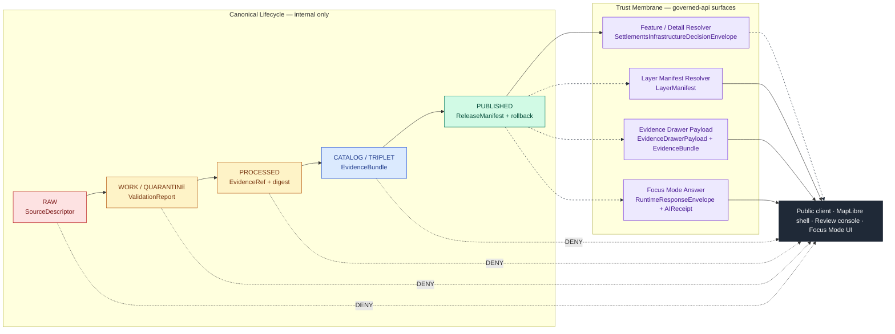
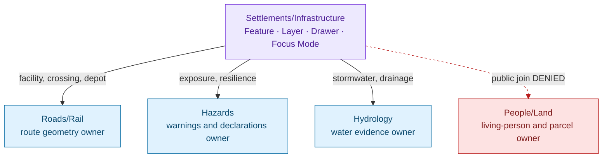

<!-- [KFM_META_BLOCK_V2]
doc_id: kfm://doc/settlements-infrastructure-api-contracts
title: Settlements & Infrastructure — API Contracts
type: standard
version: v1.1-draft
status: draft
owners: TBD (Settlements/Infrastructure domain steward; Governed-API steward) — PROPOSED
created: 2026-05-19
updated: 2026-06-07
policy_label: public
related:
  - ai-build-operating-contract.md                            # canonical operating contract, CONTRACT_VERSION = "3.0.0"
  - docs/domains/settlements-infrastructure/README.md          # NEEDS VERIFICATION
  - docs/domains/settlements-infrastructure/SENSITIVITY.md     # NEEDS VERIFICATION
  - docs/architecture/governed-api.md                          # NEEDS VERIFICATION
  - docs/standards/PROV.md                                     # CONFIRMED authored (prior session)
  - kfm://atlas/domains-v1.1#ch14                              # CONFIRMED doctrine (Settlements/Infrastructure)
  - kfm://atlas/domains-v1.1#ch24.3                            # CONFIRMED doctrine (Master Decision Outcome Envelope)
  - kfm://atlas/domains-v1.1#ch24.6                            # CONFIRMED doctrine (Pipeline Gate Reference + reason codes)
tags: [kfm, settlements, infrastructure, api, contracts, governance]
notes:
  - CONTRACT_VERSION = "3.0.0" — doctrine-adjacent doc; operating-contract pin carried.
  - All repo paths, route names, and schema filenames remain PROPOSED until mounted-repo verification.
  - Schema-home is CONFLICTED — see §4.5 / §10. ENCY §7.12 names schemas/contracts/v1/settlement/ (singular) while Directory Rules §6.4 patterns schemas/contracts/v1/domains/<domain>/. ADR-class per Directory Rules §2.4(3).
  - Critical-asset, condition, and dependency surfaces default T4 (Atlas §24.5.2); the synthesis carries a divergent T2 framing — see §6 CONFLICTED note.
[/KFM_META_BLOCK_V2] -->

# Settlements & Infrastructure — API Contracts

> Governed API surface contracts for the Settlements/Infrastructure domain — the five inspectable answer surfaces, their finite outcomes, and the trust-membrane rules that bind them.


|Field                     |Value                                                                                                                                  |
|--------------------------|---------------------------------------------------------------------------------------------------------------------------------------|
|**Status**                |`draft` — second authored revision (v1.1-draft)                                                                                        |
|**Owners**                |`TBD` *(PROPOSED: Settlements/Infrastructure domain steward + Governed-API steward)*                                                   |
|**Last updated**          |2026-06-07                                                                                                                             |
|**Authority**             |Atlas v1.1 Ch. 14 (`[DOM-SETTLE]`) + Ch. 24.3 (Master Decision Outcome Envelope) + Ch. 24.6 (Pipeline Gate Reference) + Directory Rules|
|**Contract**              |`CONTRACT_VERSION = "3.0.0"`                                                                                                           |
|**Mounted-repo verified?**|No — all repo-state claims `PROPOSED` / `NEEDS VERIFICATION` / `CONFLICTED`                                                            |

-----

## Contents

- [1. Scope and Purpose](#1-scope-and-purpose)
- [2. Doctrinal Basis](#2-doctrinal-basis)
- [3. Surface Map (Trust-Membrane View)](#3-surface-map-trust-membrane-view)
- [4. The Five Governed API Surfaces](#4-the-five-governed-api-surfaces)
  - [4.1 Feature / Detail Resolver](#41-feature--detail-resolver)
  - [4.2 Layer Manifest Resolver](#42-layer-manifest-resolver)
  - [4.3 Evidence Drawer Payload](#43-evidence-drawer-payload)
  - [4.4 Focus Mode Answer](#44-focus-mode-answer)
  - [4.5 Schema Responsibility Root](#45-schema-responsibility-root)
- [5. DecisionEnvelope and Finite Outcomes](#5-decisionenvelope-and-finite-outcomes)
- [6. Sensitivity, Rights, and Publication Posture](#6-sensitivity-rights-and-publication-posture)
- [7. Cross-Lane Contract Semantics](#7-cross-lane-contract-semantics)
- [8. Forbidden Behaviors per Surface](#8-forbidden-behaviors-per-surface)
- [9. Validator and Test Dependencies](#9-validator-and-test-dependencies)
- [10. Verification Backlog](#10-verification-backlog)
- [11. Related Docs](#11-related-docs)
- [Appendix A — Object Families Carried Across These Surfaces](#appendix-a--object-families-carried-across-these-surfaces)
- [Appendix B — Anti-Pattern Quick Reference](#appendix-b--anti-pattern-quick-reference)

-----

## 1. Scope and Purpose

This document specifies the **governed API contract surfaces** for the Settlements/Infrastructure domain (`[DOM-SETTLE]`). It is the dossier-level reference for how any public, semi-public, or AI-mediated request that touches settlement, municipality, census place, historic townsite, infrastructure asset, network, facility, condition observation, or dependency data must be answered.

> [!NOTE]
> **Whole-domain charge (CONFIRMED, Atlas v1.0 Ch. 14 §A).** The parent domain governs *“settlements, municipalities, census places, historic townsites, ghost towns, forts, missions, reservation communities, infrastructure assets, networks, facilities, service areas, operators, condition observations, dependencies, and public-safe representations.”* These API surfaces are the **only** governed routes by which any of that reaches a public client.

In scope:

- The **five surface families** named in Atlas v1.1 Ch. 14 §J.
- The **finite outcome grammar** they share with every other KFM domain (Atlas v1.1 Ch. 24.3).
- The **sensitivity and publication posture** that constrains which requests can resolve to `ANSWER` at all (Atlas v1.1 Ch. 14 §I; Ch. 24.5).
- **Cross-lane** contract semantics where Settlements/Infrastructure intersects Roads/Rail, Hazards, Hydrology, and People/Land.

Out of scope (and explicitly *not* owned by this surface):

- Transport route geometry → **Roads/Rail** lane.
- Surface- and ground-water evidence → **Hydrology** lane.
- Hazard events, warnings, declarations → **Hazards** lane.
- Living-person ownership, parcel privacy, residence-history privacy → **People/Genealogy/DNA/Land** lane.

> [!NOTE]
> This is a **contract** document — it describes *meaning, fields, and outcome grammar*. Machine-checkable shape lives in `schemas/`; admissibility lives in `policy/`; proof lives in `tests/fixtures/`. Per Directory Rules §6.3–§6.5, those layers must agree but each is authoritative for its own concern: `.schema.json` files **never** live under `contracts/`.

[↑ back to top](#contents)

-----

## 2. Doctrinal Basis

These are the doctrinal anchors that this document operationalizes. Each is `CONFIRMED` doctrine; only the *implementation* placement is `PROPOSED`.

|Doctrine                               |What it requires                                                                                                                                                                                                              |Source                                         |
|---------------------------------------|------------------------------------------------------------------------------------------------------------------------------------------------------------------------------------------------------------------------------|-----------------------------------------------|
|**Cite-or-abstain**                    |Every public claim must resolve `EvidenceRef → EvidenceBundle`. If it cannot, the surface MUST `ABSTAIN`, never invent.                                                                                                       |Atlas v1.1 Ch. 24.3.1; Encyclopedia §11        |
|**Trust membrane**                     |Public clients and normal UI surfaces MUST consume governed APIs and released artifacts only — never RAW, WORK, QUARANTINE, canonical/internal stores, graph internals, vector indexes, source APIs, or direct model runtimes.|Atlas v1.1 Ch. 24.6.2 / 24.9.2; MapLibre Master|
|**Deny-by-default for critical assets**|Critical infrastructure, utilities, condition observations, dependencies, operator-sensitive details, and exact facility geometry default to **restricted** or **review**.                                                    |Atlas v1.1 Ch. 14 §I                           |
|**Finite outcomes**                    |Governed surfaces return exactly one of `ANSWER / ABSTAIN / DENY / ERROR`; promotion/release/correction may additionally `HOLD`; validators return `PASS / FAIL`. Silent fall-through is forbidden.                           |Atlas v1.1 Ch. 24.3                            |
|**Source-role anti-collapse**          |The seven source roles (`observed                                                                                                                                                                                             |regulatory                                     |
|**Release as governed transition**     |A claim reaches `PUBLISHED` only with a resolvable `ReleaseManifest`, correction path, rollback target, and (where required) `ReviewRecord`; release authority distinct from author at materiality.                           |Atlas v1.1 Ch. 14 §M; Ch. 24.6 / 24.7          |


> [!IMPORTANT]
> When this document and a mounted-repo implementation conflict, **the mounted repo wins for facts of behavior, but doctrine still governs design intent.** Disagreements file to `docs/registers/DRIFT_REGISTER.md` per Directory Rules §2.5. *(PROPOSED path; NEEDS VERIFICATION.)*

[↑ back to top](#contents)

-----

## 3. Surface Map (Trust-Membrane View)

The diagram below shows where each Settlements/Infrastructure governed API surface sits relative to the canonical lifecycle and the trust membrane. **Public traffic crosses the membrane only through the four governed surfaces named in §4.1–§4.4**; the schema root in §4.5 is internal infrastructure that constrains all four. `PUBLISHED` is the only state from which the governed API may emit `ANSWER` (Atlas §24.6.2).



> [!CAUTION]
> The dashed lines mark the **prohibited** routes. Any code path that lets a public client, MapLibre style, popup, AI answer, or export reach `RAW`, `WORK`, `QUARANTINE`, `PROCESSED`, or `CATALOG` artifacts directly is a **trust-membrane bypass** and a deny-class anti-pattern (Atlas v1.1 Ch. 24.9.2). The only legitimate paths out of the lifecycle are the four governed surfaces above.

[↑ back to top](#contents)

-----

## 4. The Five Governed API Surfaces

CONFIRMED from Atlas v1.1 Ch. 14 §J — these are the contract surfaces; exact route names, package paths, and DTO field shapes are **PROPOSED** until mounted-repo verification.

|#  |Surface                   |DTO / schema (PROPOSED name)                         |Outcomes                                 |Status                                     |
|---|--------------------------|-----------------------------------------------------|-----------------------------------------|-------------------------------------------|
|4.1|Feature / detail resolver |`SettlementsInfrastructureDecisionEnvelope`          |`ANSWER / ABSTAIN / DENY / ERROR`        |**PROPOSED**; exact route `UNKNOWN`        |
|4.2|Layer manifest resolver   |`LayerManifest` / domain layer descriptor            |`ANSWER / DENY / ERROR`                  |**PROPOSED**; public-safe release only     |
|4.3|Evidence Drawer payload   |`EvidenceDrawerPayload` + `EvidenceBundle` projection|`ANSWER / ABSTAIN / DENY / ERROR`        |**PROPOSED**; evidence- and policy-filtered|
|4.4|Focus Mode answer         |`RuntimeResponseEnvelope` + `AIReceipt`              |`ANSWER / ABSTAIN / DENY / ERROR`        |**PROPOSED**; AI is never root truth       |
|4.5|Schema responsibility root|**CONFLICTED** placement — see §4.5                  |finite validator outcomes (`PASS / FAIL`)|**PROPOSED**; ADR-class                    |

### 4.1 Feature / Detail Resolver

**Purpose.** Resolve a clicked feature, an explicit identifier, or a structured query for a Settlements/Infrastructure object (Settlement, Municipality, CensusPlace, Townsite, GhostTown, Fort, Mission, ReservationCommunity, Infrastructure Asset, Network Node, Network Segment, Facility, Service Area, Operator, Condition Observation, Dependency) and return a governed answer.

**Returned envelope (PROPOSED shape).** A domain extension of the Master Decision Outcome Envelope (Atlas v1.1 Ch. 24.3; idea card `KFM-P5-PROG-0001`); see §5.

|Element          |Meaning                                                                                            |Status                                                    |
|-----------------|---------------------------------------------------------------------------------------------------|----------------------------------------------------------|
|`decision_id`    |UUID join key into receipts, audit, correction lineage.                                            |PROPOSED                                                  |
|`outcome`        |`ANSWER` / `ABSTAIN` / `DENY` / `ERROR`.                                                           |CONFIRMED grammar                                         |
|`policy_family`  |One of `promotion | access | render | capability | consent | sensitivity`.                         |CONFIRMED grammar                                         |
|`reasons[]`      |Deny / abstain reason codes (e.g., `RIGHTS_UNKNOWN`, `SENSITIVITY_UNRESOLVED`, `MISSING_EVIDENCE`).|CONFIRMED catalog (§5.3 / Atlas §24.6.3)                  |
|`obligations[]`  |Advisory follow-ups (e.g., `{"type": "redact", "op": "generalize_geometry", "level": "coarse"}`).  |PROPOSED structured shape *(see §5.1 obligations tension)*|
|`evidence_refs[]`|Resolvable `EvidenceRef`s into one or more `EvidenceBundle`s.                                      |CONFIRMED requirement for `ANSWER`                        |
|`evaluated_at`   |ISO-8601 timestamp.                                                                                |PROPOSED field                                            |

**Required for `ANSWER`.** `EvidenceBundle` resolved; `PolicyDecision = ALLOW`; applicable `ReleaseManifest` covers the requested object; for sensitive infrastructure, `ReviewRecord` and a redaction/generalization receipt.

**Mandated `DENY` cases.** Critical-asset detail, exact facility geometry on sensitive assets, condition observations on operator-sensitive infrastructure, dependency graphs where exposure compounds risk. See §6.

> [!NOTE]
> The route name is intentionally left undeclared. Atlas v1.1 Ch. 14 §J records the route as **TBD**. A naming ADR (`PROPOSED: ADR-S-* — Settlements/Infrastructure feature resolver route`) is the resolution path.

[↑ back to top](#contents)

### 4.2 Layer Manifest Resolver

**Purpose.** Return the released, public-safe set of map layers that an authorized client may consume — never a `WORK` or `CATALOG` layer; never an unreleased candidate.

**Returned object (PROPOSED).** `LayerManifest` / domain-layer descriptor: layer id, source binding, style binding, tile artifact manifest reference, time scope, sensitivity class, `ReleaseManifest` reference, rollback target. (Field intent drawn from the MapLibre Master object map.)

**Allowed outcomes.** `ANSWER` / `DENY` / `ERROR` only — there is no `ABSTAIN` here: either a public-safe layer exists for the request or it does not.

**Mandated `DENY` cases.**

- Requested layer lacks a `ReleaseManifest`.
- Requested layer sits at `WORK` / `QUARANTINE` / `PROCESSED` / `CATALOG`.
- Requested layer carries sensitive geometry that has not passed a generalization or redaction receipt.
- Requested layer’s rollback target is missing.

> [!WARNING]
> A layer **hidden only by style** (e.g., `opacity: 0`, `filter` exclusion, `visibility: none`) is still served and is therefore still publicly observable in the network tab. Sensitive geometry MUST be transformed *before* tile production, not at render time. Style-only hiding is an explicit anti-pattern (MapLibre Master; Atlas v1.1 Ch. 24.9.2) and the §9 restricted-geometry no-leak test exists to catch it.

[↑ back to top](#contents)

### 4.3 Evidence Drawer Payload

**Purpose.** Project a resolved `EvidenceBundle` into the UI-facing inspection surface that opens when a user clicks a Settlements/Infrastructure feature, badge, or consequential claim. The `EvidenceBundle` remains canonical; this surface is a **governed projection** that lets UI evolve without renegotiating evidence shape.

**Returned object (PROPOSED).** `EvidenceDrawerPayload`:

- Resolved `EvidenceBundle` references (sources, citations, validation summary).
- Policy posture (sensitivity class, rights, source role).
- Time scope (source / observed / valid / retrieval / release / correction times, kept distinct per Ch. 14 §E).
- Citation validation state (`PASS` / `FAIL` summary from `CitationValidationReport`).
- Stale / corrected / superseded state, if any, with `CorrectionNotice` references.
- Trust-visible badge state (released / stale / degraded / denied).

**Allowed outcomes.** `ANSWER` / `ABSTAIN` / `DENY` / `ERROR`.

**Mandated `ABSTAIN` cases.** No resolvable `EvidenceBundle`; broken `EvidenceRef`; missing citation validation. The drawer never invents an explanation — it surfaces the lineage break rather than hiding it.

> [!TIP]
> A **popup is not an Evidence Drawer substitute.** Popups are a convenience surface; consequential claims (legal status, condition, dependency, exposure) MUST resolve through the drawer payload and carry citations. This is enforced by drawer-projection tests (click-to-`EvidenceBundle`).

[↑ back to top](#contents)

### 4.4 Focus Mode Answer

**Purpose.** The governed AI surface over Settlements/Infrastructure released evidence. AI may summarize released `EvidenceBundle`s, compare evidence, explain limitations, and draft steward-review notes. AI is **never** root truth (Atlas v1.1 Ch. 14 §L; Governed AI doctrine `[GAI]`).

**Request (PROPOSED).** `FocusModeRequest` over a `MapContextEnvelope` carrying released layer ids, camera, selected feature ids, time window, visible state, policy posture, and evidence refs only. **No `RAW` / `WORK` / direct model access.**

**Response (PROPOSED).** `RuntimeResponseEnvelope` containing the same finite-outcome grammar as §5, **plus** an `AIReceipt` recording:

- Model adapter / model pin, prompt-context envelope ids, parameter pin (incl. `num_ctx`).
- `evidence_refs[]` actually consulted.
- Pre/post `PolicyDecision` ids.
- `outcome` (`ANSWER` / `ABSTAIN` / `DENY` / `ERROR`).
- `reason_code` for non-`ANSWER` outcomes.
- `CitationValidationReport` reference.

**Mandated `ABSTAIN` cases.**

- Evidence insufficient or stale for the question asked.
- Citation validation fails (model cannot bind a claim to an `EvidenceBundle`).
- The requested scope crosses into RAW / WORK / unreleased candidate territory.

**Mandated `DENY` cases.**

- Question targets critical infrastructure detail, operator-sensitive dependency, or exact restricted geometry.
- KFM is being asked to act as alert / instruction / life-safety authority (out-of-scope; T4 forever for Hazards alert authority, shared boundary).
- Sensitive cross-lane join (e.g., infrastructure × living-person, infrastructure × precise residence).

[↑ back to top](#contents)

### 4.5 Schema Responsibility Root

The machine-checkable shape that all of the above surfaces validate against. **Repo placement is CONFLICTED** between two governing docs:

|Candidate home                                                               |Source                                                                                  |Pattern             |
|-----------------------------------------------------------------------------|----------------------------------------------------------------------------------------|--------------------|
|`schemas/contracts/v1/settlement/` *(singular object name)*                  |`[ENCY]` §7.12 (Settlements/Infrastructure row)                                         |object-named segment|
|`schemas/contracts/v1/domains/settlements-infrastructure/` *(domain segment)*|Directory Rules §6.4 (pattern shows `domains/<domain>/`, e.g. `hydrology/ soil/ fauna/`)|domain-named segment|

The companion layers are less contested:

|Layer        |PROPOSED path                                                                      |Owns                                                              |
|-------------|-----------------------------------------------------------------------------------|------------------------------------------------------------------|
|Meaning      |`contracts/domains/settlements-infrastructure/`                                    |Markdown contract files (object meaning, invariants, field intent)|
|Admissibility|`policy/domains/settlements-infrastructure/` + `policy/sensitivity/infrastructure/`|Sensitivity rules, redaction determinism, deny lanes              |
|Proof        |`tests/domains/settlements-infrastructure/`                                        |Valid / invalid / negative fixtures, finite-outcome assertions    |


> [!IMPORTANT]
> Per **Directory Rules ADR-0001**, the default machine-schema home is `schemas/contracts/v1/...`, and **two parallel schema homes** is a named anti-pattern (Atlas §24.9.1). The §7.12-vs-§6.4 divergence above is exactly that risk and is **ADR-class** per Directory Rules §2.4(3) — tracked in §10 and in the §24.12 Open-ADR backlog as ADR-S-01 (schema-home confirmation). Any candidate `contracts/<domain>/<x>.schema.json` placement is **lineage / CONFLICTED** and MUST be migrated under ADR-0001 before any new schema lands. Divergent definitions in both `schemas/` and `contracts/` are forbidden.

[↑ back to top](#contents)

-----

## 5. DecisionEnvelope and Finite Outcomes

### 5.1 Envelope shape

`CONFIRMED` doctrine (Atlas v1.1 Ch. 24.3; idea card `KFM-P5-PROG-0001`): every policy module emits a `DecisionEnvelope` of the form:

```json
{
  "decision_id": "<uuid>",
  "outcome": "ANSWER | ABSTAIN | DENY | ERROR",
  "policy_family": "promotion | access | render | capability | consent | sensitivity",
  "reasons": ["<reason_code>", "..."],
  "obligations": [
    {"type": "redact", "op": "generalize_geometry", "level": "coarse"},
    {"type": "hold",   "op": "steward_review"}
  ],
  "evaluated_at": "<ISO-8601>"
}
```

PROPOSED schema location: `schemas/contracts/v1/runtime/decision_envelope.schema.json` (per `KFM-P5-PROG-0001`). The `SettlementsInfrastructureDecisionEnvelope` is a domain extension of this base, adding domain context such as object family, geometry support class, and sensitivity tier — none of which override the base finite-outcome grammar.

> [!NOTE]
> **Obligations-shape tension (CONFLICTED, open per `KFM-P5-PROG-0001`).** The corpus uses **both** structured obligations (`{type, op, level?}`) and bare string forms; convergence on the structured form is recorded as *necessary* but unresolved. This document uses the structured form throughout; a schema PR + ADR is the resolution path. Note also that `PolicyDecision.outcome` uses `ALLOW`/`DENY` casing in the schema map, while the governed-surface answer outcomes use `ANSWER`/`DENY` — the two enums are distinct and MUST NOT be conflated.

### 5.2 Outcome semantics

|Outcome                            |When (CONFIRMED doctrine)                                                                                |Required artifacts                                                                                                         |Public-surface effect                                                  |
|-----------------------------------|---------------------------------------------------------------------------------------------------------|---------------------------------------------------------------------------------------------------------------------------|-----------------------------------------------------------------------|
|`ANSWER`                           |Evidence sufficient, policy permits, release state allows, review state recorded (where required).       |`EvidenceBundle` resolved; `PolicyDecision = ALLOW`; `ReleaseManifest` applies; sensitive-asset `ReviewRecord` if required.|Substantive answer with drawer + citation.                             |
|`ABSTAIN`                          |Evidence insufficient / incomplete, cannot cite, or evidence is stale and no released alternative exists.|`AIReceipt` (Focus Mode) or `RuntimeResponseEnvelope` with reason; **no claim emitted**.                                   |Non-substantive note with reason; never invents.                       |
|`DENY`                             |Policy, rights, sensitivity, or release state forbids. **Critical-asset lane defaults here.**            |`PolicyDecision = DENY` + `reason_code`; `AIReceipt` (if AI surface) records denial.                                       |Denial reason; offer non-restricted alternative surface where possible.|
|`ERROR`                            |API cannot evaluate — missing schema, malformed query, contract violation, infra failure.                |Error envelope with diagnostic code, **no claim leakage**.                                                                 |Finite, actionable error; never silently routes to a different lane.   |
|`HOLD` *(promotion/release class)* |Promotion / release / correction paused pending steward, rights-holder, or policy review.                |`ReviewRecord` pending; `PolicyDecision = HOLD`.                                                                           |Surface remains in prior state; no silent rollback.                    |
|`PASS` / `FAIL` *(validator class)*|Validator or admission check completed.                                                                  |`ValidationReport`.                                                                                                        |Internal only; no public answer emitted directly.                      |

### 5.3 Reason-code catalog (this domain)

The cross-cutting reason codes below are **CONFIRMED** as a PROPOSED catalog at Atlas v1.1 Ch. 24.6.3. The critical-asset-specific codes are **PROPOSED** for this domain, implied by the §I sensitivity posture and not yet enumerated in a mounted policy bundle.

|Family                                          |Reason code                                                                               |Likely surface               |Recovery                                                       |
|------------------------------------------------|------------------------------------------------------------------------------------------|-----------------------------|---------------------------------------------------------------|
|Missing required artifact                       |`MISSING_EVIDENCE`, `MISSING_RECEIPT`, `MISSING_REVIEW`                                   |Feature / Drawer / Focus Mode|Re-emit; re-run review.                                        |
|Schema / contract drift                         |`SCHEMA_MISMATCH`, `CONTRACT_DRIFT`                                                       |All                          |Schema fix + ADR + re-validate.                                |
|Rights / sensitivity unresolved                 |`RIGHTS_UNKNOWN`, `SENSITIVITY_UNRESOLVED`                                                |Feature / Layer / Drawer     |Steward review; rights resolution; tier reassignment.          |
|Source-role collapse risk                       |`ROLE_COLLAPSE`, `ROLE_DOWNCAST_FORBIDDEN`                                                |Feature / Focus Mode         |Restore source role; refuse upcast.                            |
|Review state inadequate                         |`REVIEW_NEEDED`, `REVIEW_INSUFFICIENT`, `REVIEW_REJECTED`                                 |Feature / Layer              |Run required review; supply `ReviewRecord`.                    |
|Release infrastructure                          |`RELEASE_MANIFEST_INVALID`, `ROLLBACK_TARGET_MISSING`                                     |Layer / Feature              |Manifest fix; supply rollback target.                          |
|Critical-asset deny *(PROPOSED domain-specific)*|`CRITICAL_ASSET_RESTRICTED`, `OPERATOR_SENSITIVE_DETAIL`, `EXACT_FACILITY_GEOMETRY_DENIED`|Feature / Layer / Focus Mode |Offer generalized public-safe alternative; steward review path.|

[↑ back to top](#contents)

-----

## 6. Sensitivity, Rights, and Publication Posture

CONFIRMED (Atlas v1.1 Ch. 14 §I, verbatim): **“Critical infrastructure, utilities, condition observations, dependencies, operator-sensitive details, and exact facility geometry default to restricted or review.”** Unclear rights, unresolved source role, missing evidence, unresolved sensitivity, or absent release state blocks public promotion.

### 6.1 Default posture by object family

Tier names follow the master T0–T4 scheme (Atlas v1.1 Ch. 24.5.1). The **place/community** families and the **critical-infrastructure** families sit at opposite ends of the scale.

|Object family                                |Default tier                                            |Public-safe answer possible?                     |Authority / notes                                                                                                                                                               |
|---------------------------------------------|--------------------------------------------------------|-------------------------------------------------|--------------------------------------------------------------------------------------------------------------------------------------------------------------------------------|
|`Settlement`, `Municipality`, `GhostTown`    |**T0**                                                  |Yes, with legal-source / observation distinction.|Atlas §24.4 cross-domain matrix: Settlement / Municipality / GhostTown = T0. Legal municipality ≠ census place ≠ historic townsite.                                             |
|`CensusPlace`                                |**T0**                                                  |Yes, vintaged and attributed.                    |Statistical place; never collapsed with `Municipality` (source-role anti-collapse).                                                                                             |
|`Townsite`, `Fort`, `Mission`                |**T0 / T1** *(historical)*                              |Yes, with time-scoped citation.                  |Modern coords may still be sensitive where an archaeology footprint overlaps → `[DOM-ARCH]` review, generalized geometry (see §7).                                              |
|`ReservationCommunity`                       |**T1 / review-required**                                |Conditional.                                     |Sovereignty review governs detail; defer to People/Land + `[DOM-ARCH]` cultural review; never household/parcel detail.                                                          |
|`Infrastructure Asset` (critical), `Facility`|**T4** *(critical detail)*; **T1** generalized footprint|Generalized / public-safe view only.             |Atlas §24.5.2: *Infrastructure — critical asset detail = T4*; transform = generalized facility footprint + suppressed dependency → T1 under steward review + `RedactionReceipt`.|
|`Network Node`, `Network Segment`            |**T4** *(critical topology)*                            |Topology-only generalized view at most.          |Network exposure compounds risk; falls under the critical-asset deny lane.                                                                                                      |
|`Operator`                                   |**T2 / T3**                                             |Generalized / aggregated only.                   |Operator-sensitive detail is named in §I; condition/vulnerability is T3-to-named-authorities-only.                                                                              |
|`Condition Observation`                      |**T4**                                                  |Aggregated or denied.                            |Atlas §24.5.2: *Infrastructure — condition / vulnerability = T4*; T3 to named authorities only, never T0/T1.                                                                    |
|`Dependency`                                 |**T4**                                                  |Denied by default for critical assets.           |Most exposure-amplifying object family; suppressed in the generalized footprint transform.                                                                                      |
|`Service Area`                               |**T1 / T2**                                             |Generalized polygons only.                       |Boundary precision is the lever; public-safe only after generalization.                                                                                                         |


> [!CAUTION]
> **CONFLICTED tier source — surfaced, not smoothed.** Three governing surfaces give different default tiers for critical settlements/infrastructure assets: Atlas §24.5.2 says **T4** for critical-asset detail and condition/vulnerability; the cross-domain matrix (Atlas §24.4) says **T4 default / T1 generalized**; the unified-doctrine synthesis §16 says **T2** (“public summary only; precise locations deny”). This document follows the **most restrictive applicable** reading — **T4 default for critical detail**, T1/T2 only via reviewed generalization — per the deny-by-default rule. The divergence is an ADR/drift candidate (see §10).

> [!CAUTION]
> The intermediate tiers in the table above are **PROPOSED** for this document. The canonical sensitivity rubric (`docs/standards/SENSITIVITY_RUBRIC.md`) is `PROPOSED` in the corpus (Pass-10 C6-01) and **not yet authored**, and the T0–T4 tier scheme itself is `PROPOSED` (Atlas §24.5.1, ADR-S-05). Until those are accepted, these tiers are working assumptions, not enforced policy.

### 6.2 Three release-relevant invariants

1. **No critical-asset detail through `ANSWER`** without `ReviewRecord` + redaction/generalization `RedactionReceipt` + `ReleaseManifest`. Tier upgrade toward public is two-key (transform receipt **and** review); downgrade to T4 is one-key (`CorrectionNotice`) — Atlas §24.5.3.
1. **No dependency-graph exposure** that allows a public client to reconstruct restricted topology by composition. Cross-feature inference is its own risk class.
1. **No alert / instruction / life-safety output.** KFM is never an alert authority (Atlas v1.1 Ch. 24.5.2 — *T4 forever*); Settlements/Infrastructure shares this boundary with Hazards.

[↑ back to top](#contents)

-----

## 7. Cross-Lane Contract Semantics

CONFIRMED / PROPOSED (Atlas v1.1 Ch. 14 §F; Ch. 24.4 Cross-Lane Relation Atlas): relations across lanes must preserve **ownership, source role, sensitivity, and `EvidenceBundle` support**. The Settlements/Infrastructure API surfaces participate in — but do not own — the following cross-lane joins.

|This domain               |Related lane   |Relation type                                      |Contract obligation on this surface                                                                               |
|--------------------------|---------------|---------------------------------------------------|------------------------------------------------------------------------------------------------------------------|
|Settlements/Infrastructure|**Roads/Rail** |Depot, bridge, crossing, transport facility        |Defer transport-route truth (T0) to Roads/Rail resolver; carry only the facility/asset side.                      |
|Settlements/Infrastructure|**Hazards**    |Exposure, resilience, warnings, declarations       |Never act as alert authority; consume hazard context as released evidence only.                                   |
|Settlements/Infrastructure|**Hydrology**  |Water, wastewater, stormwater, floodplain, drainage|Defer hydrology evidence to Hydrology resolver; carry only the facility/service-area side.                        |
|Settlements/Infrastructure|**People/Land**|Residence, ownership, parcel, migration context    |Living-person and parcel-privacy denials are People/Land’s (T4); this surface MUST NOT join through a public path.|



> [!NOTE]
> The dashed line marks the **public-path denial**: a Settlements/Infrastructure × People/Land join (e.g., “who owns this parcel containing this facility”) is denied by default (private person-parcel join = T4; generalized parcel + de-identified person → T2 only) and routed through People/Land’s consent + restricted-surface gates, not through this domain’s public surfaces.

[↑ back to top](#contents)

-----

## 8. Forbidden Behaviors per Surface

CONFIRMED doctrine — these are deny-class anti-patterns (Atlas v1.1 Ch. 24.3.2 + 24.9.2). Any of them constitutes a trust-membrane bypass.

|Surface                  |Forbidden behavior                                                                                  |Surface that must `DENY` it   |
|-------------------------|----------------------------------------------------------------------------------------------------|------------------------------|
|Feature / detail resolver|Return an **unreleased candidate** as `ANSWER`.                                                     |Feature resolver.             |
|Feature / detail resolver|Expose internal store identifiers (graph node ids, canonical UUIDs not meant for public projection).|Feature resolver.             |
|Feature / detail resolver|Return raw critical-asset detail without `ReviewRecord` + redaction receipt.                        |Feature resolver.             |
|Layer manifest resolver  |Return a layer that lacks a `ReleaseManifest`.                                                      |Layer manifest resolver.      |
|Layer manifest resolver  |Serve `WORK` or `CATALOG` layers to public clients.                                                 |Layer manifest resolver.      |
|Layer manifest resolver  |Hide sensitive geometry by style alone (tile still leaks).                                          |Tile production gate.         |
|Evidence Drawer          |Hide a lineage break instead of surfacing it.                                                       |Drawer projection.            |
|Evidence Drawer          |Use a popup as a substitute for drawer payload on a consequential claim.                            |Drawer test gate.             |
|Focus Mode               |Return uncited language.                                                                            |Focus Mode citation validator.|
|Focus Mode               |Answer from `RAW` / `WORK` rather than `EvidenceBundle`.                                            |Focus Mode runtime.           |
|Focus Mode               |Issue alert / instruction / life-safety output.                                                     |Focus Mode policy gate.       |
|All surfaces             |Route through an **admin shortcut** to bypass the normal public path.                               |Trust-membrane audit.         |
|All surfaces             |Release / answer **without rollback target**.                                                       |Release queue gate.           |

[↑ back to top](#contents)

-----

## 9. Validator and Test Dependencies

The Settlements/Infrastructure governed API surfaces depend on the validator and test families enumerated in Atlas v1.1 Ch. 14 §K. **All are PROPOSED implementations.**

|Validator family                       |Surface(s) it backstops         |What it proves                                                                                                                     |
|---------------------------------------|--------------------------------|-----------------------------------------------------------------------------------------------------------------------------------|
|Legal-municipality evidence tests      |Feature resolver                |A `Municipality` claim cites a legal source; not collapsed with a `CensusPlace`.                                                   |
|Census-vs-municipality distinction     |Feature resolver, Drawer        |Source-role anti-collapse for census vs. legal place.                                                                              |
|Infrastructure topology tests          |Feature resolver, Layer manifest|`Network Node`/`Segment` topology is internally consistent; no orphan segments leak.                                               |
|Condition `observed_at` tests          |Feature resolver, Drawer        |Condition observations carry distinct source / observed / valid / retrieval times.                                                 |
|Restricted-geometry no-leak tests      |Layer manifest, Feature resolver|Sensitive geometry cannot appear in a public layer, tile, or response — including via style hiding, drawer fallback, or AI summary.|
|Catalog / proof / release closure tests|All four governed surfaces      |`EvidenceBundle` resolves; `ReleaseManifest` exists; rollback target reachable.                                                    |
|Negative-state coverage                |All four governed surfaces      |`DENY` / `ABSTAIN` / `ERROR` / `HOLD` paths exercised, not just `ANSWER`.                                                          |


> [!NOTE]
> Validators live in `tests/domains/settlements-infrastructure/` *(PROPOSED path)* with fixtures under `tests/fixtures/` or `fixtures/`; both `valid/` and `invalid/` are required (Directory Rules §6.6). Mounted-repo confirmation is `NEEDS VERIFICATION`.

[↑ back to top](#contents)

-----

## 10. Verification Backlog

CONFIRMED from Atlas v1.1 Ch. 14 §N — these items must be resolved against a mounted repo or live evidence before any `PROPOSED` claim in this document can be promoted to `CONFIRMED`.

|ID            |Item                                                                                                                                                                             |Evidence that would settle it                                                            |Status                              |
|--------------|---------------------------------------------------------------------------------------------------------------------------------------------------------------------------------|-----------------------------------------------------------------------------------------|------------------------------------|
|`VB-SI-API-01`|Verify source rights and municipal legal-source roles.                                                                                                                           |Mounted repo files; schemas; registry entries; tests; review records; release manifests. |`NEEDS VERIFICATION`                |
|`VB-SI-API-02`|Verify critical-infrastructure policy.                                                                                                                                           |Mounted `policy/sensitivity/infrastructure/`; policy fixtures; deny-fixture tests.       |`NEEDS VERIFICATION`                |
|`VB-SI-API-03`|Verify public-safe layer registry.                                                                                                                                               |Mounted `LayerManifest`s; layer-id uniqueness checks; tile-artifact manifest fixtures.   |`NEEDS VERIFICATION`                |
|`VB-SI-API-04`|Verify API and Focus Mode auth/policy behavior.                                                                                                                                  |Mounted route definitions; auth middleware; `AIReceipt` fixtures; runtime-proof tests.   |`NEEDS VERIFICATION`                |
|`VB-SI-API-05`|Resolve `SettlementsInfrastructureDecisionEnvelope` name and route.                                                                                                              |ADR + mounted route file.                                                                |`UNKNOWN` *(route TBD per Atlas §J)*|
|`VB-SI-API-06`|**Resolve the schema-home conflict** — `schemas/contracts/v1/settlement/` (`[ENCY]` §7.12) vs. `schemas/contracts/v1/domains/settlements-infrastructure/` (Directory Rules §6.4).|ADR (= ADR-S-01 in the §24.12 backlog; ADR-0001 confirm-or-amend); mounted schema layout.|`CONFLICTED` *(ADR-class, §2.4(3))* |
|`VB-SI-API-07`|**Resolve the critical-asset tier conflict** — T4 (Atlas §24.5.2) vs. T2 (synthesis §16).                                                                                        |ADR-S-05 (tier scheme) + mounted `policy/sensitivity/infrastructure/`.                   |`CONFLICTED`                        |
|`VB-SI-API-08`|Resolve the obligations-shape convergence (structured `{type, op, level}` vs. string).                                                                                           |Schema PR on `decision_envelope.schema.json` + ADR (`KFM-P5-PROG-0001` open question).   |`NEEDS VERIFICATION`                |
|`VB-SI-API-09`|Resolve sensitivity-tier authority for this domain.                                                                                                                              |`docs/standards/SENSITIVITY_RUBRIC.md` (currently PROPOSED, not authored); ADR-S-05.     |`NEEDS VERIFICATION`                |

[↑ back to top](#contents)

-----

## 11. Related Docs

Linked documents below are a mix of `CONFIRMED authored` (prior session), `PROPOSED in corpus`, and `TODO` placeholders. Mounted-repo presence is `NEEDS VERIFICATION` for all.

- `ai-build-operating-contract.md` — *canonical operating contract*; `CONTRACT_VERSION = "3.0.0"`.
- `docs/domains/settlements-infrastructure/README.md` — *TODO* domain dossier landing page.
- `docs/domains/settlements-infrastructure/sublanes/settlements.md` — *PROPOSED* settlements sublane dossier (place/community half).
- `docs/domains/settlements-infrastructure/sublanes/infrastructure.md` — *PROPOSED* infrastructure sublane dossier (asset/network half).
- `docs/domains/settlements-infrastructure/SENSITIVITY.md` — *TODO* per-domain sensitivity rules.
- `docs/domains/settlements-infrastructure/VERIFICATION_BACKLOG.md` — *TODO* tracked open items.
- `docs/architecture/governed-api.md` — *TODO* trust-membrane architecture.
- `docs/architecture/contract-schema-policy-split.md` — *TODO* contracts ↔ schemas ↔ policy split.
- `docs/standards/PROV.md` — *CONFIRMED authored* (prior session); provenance crosswalk.
- `docs/standards/SENSITIVITY_RUBRIC.md` — *PROPOSED in corpus* (Pass-10 C6-01); not yet authored.
- `docs/standards/REDACTION_DETERMINISM.md` — *PROPOSED in corpus* (Pass-10 C6-03); not yet authored.
- `docs/adr/README.md` — *TODO* ADR index; route-name, schema-home (ADR-S-01), and tier-scheme (ADR-S-05) ADRs land here.
- `kfm://atlas/domains-v1.1#ch14` — Atlas v1.1 Ch. 14 (`[DOM-SETTLE]`).
- `kfm://atlas/domains-v1.1#ch24.3` — Master Decision Outcome Envelope reference.
- `kfm://atlas/domains-v1.1#ch24.6` — Pipeline Gate Reference + reason-code catalog (§24.6.3).

[↑ back to top](#contents)

-----

## Appendix A — Object Families Carried Across These Surfaces

<details>
<summary><b>Click to expand: full object-family roster owned by Settlements/Infrastructure</b></summary>

CONFIRMED from Atlas v1.1 Ch. 14 §B and §E — `[DOM-SETTLE]` object families. Each carries the identity rule “source id + object role + temporal scope + normalized digest” (PROPOSED deterministic basis) and keeps source / observed / valid / retrieval / release / correction times distinct where material.

|Object                 |One-line role                                                                                  |
|-----------------------|-----------------------------------------------------------------------------------------------|
|`Settlement`           |The umbrella concept; an inhabited or formerly inhabited place evidence-bound to a source role.|
|`Municipality`         |Legal civic entity; source role fixed at admission (legal-source required).                    |
|`CensusPlace`          |Statistical place from census authority; never collapsed with a `Municipality`.                |
|`Townsite`             |Platted or historically platted townsite; time-scoped founding claim.                          |
|`GhostTown`            |Place without current residential function; historical lane, cite-or-abstain.                  |
|`Fort`                 |Military post; historical context lane; archaeology overlap.                                   |
|`Mission`              |Mission settlement; historical and cultural-review lane.                                       |
|`ReservationCommunity` |Defers to People/Land + cultural review for sovereignty considerations.                        |
|`Infrastructure Asset` |Physical asset (utility, bridge, plant, station, etc.); critical-asset deny lane (T4).         |
|`Network Node`         |Junction in a service network (water, power, comms, transit).                                  |
|`Network Segment`      |Edge in a service network; topology-sensitive.                                                 |
|`Facility`             |Operating facility; condition + operator data attaches here.                                   |
|`Service Area`         |Polygon describing service coverage; boundary precision controls exposure.                     |
|`Operator`             |Entity operating an asset / network / facility.                                                |
|`Condition Observation`|Time-stamped condition / inspection record; restricted by default (T4).                        |
|`Dependency`           |Cross-asset dependency edge; most exposure-amplifying object family (T4).                      |

This roster is **not** the schema — it is the contract vocabulary that the schemas under the §4.5 schema home (CONFLICTED placement) must realize.

</details>

[↑ back to top](#contents)

-----

## Appendix B — Anti-Pattern Quick Reference

<details>
<summary><b>Click to expand: trust-membrane anti-patterns (cross-cutting, Atlas v1.1 Ch. 24.9.2)</b></summary>

|Anti-pattern                                            |What goes wrong                                                 |Surface that must `DENY`                   |
|--------------------------------------------------------|----------------------------------------------------------------|-------------------------------------------|
|Public client reads RAW / WORK / QUARANTINE.            |Trust membrane bypassed; promotion gates skipped.               |Governed API; layer manifest resolver.     |
|Map shell consumes canonical / internal store directly. |Renderer becomes the public surface and inherits no governance. |MapLibre shell wiring; layer registry.     |
|AI returns uncited language.                            |Generated text substitutes for evidence; cite-or-abstain broken.|Focus Mode; AI surface steward.            |
|AI answers from RAW / WORK rather than `EvidenceBundle`.|AI becomes its own truth source.                                |Governed AI runtime; `AIReceipt` evaluator.|
|Sensitive content released without redaction.           |`RedactionReceipt` missing; rights / sovereignty violation.     |Release queue; sensitivity reviewer.       |
|Aggregate cited as per-place observation.               |Source-role collapse; matrix-cell semantics violated.           |Validator; Focus Mode citation evaluator.  |
|Two parallel schema homes.                              |Reviewers no longer know which schema is authoritative.         |Schema CI; ADR-0001 (see §4.5).            |
|KFM used as alert / instruction authority.              |Out-of-scope use of governed evidence as life-safety guidance.  |Hazards / Settlements surfaces.            |
|Release without `ReleaseManifest` or rollback target.   |Public surface cannot be rolled back; release not auditable.    |Release queue; release authority.          |
|AI generation routed through admin shortcut.            |Admin bypass becomes a normal-path public route.                |Trust-membrane audit; infra.               |

</details>

[↑ back to top](#contents)

-----

## Changelog

|Version   |Date      |Type (per contract §37)     |Change                                                                                                                                                                                                                                                                                                                                                                                                                                          |
|----------|----------|----------------------------|------------------------------------------------------------------------------------------------------------------------------------------------------------------------------------------------------------------------------------------------------------------------------------------------------------------------------------------------------------------------------------------------------------------------------------------------|
|v1-draft  |2026-05-19|new                         |Initial authored revision; grounded in Atlas v1.1 Ch. 14 + Ch. 24.3. No mounted-repo verification.                                                                                                                                                                                                                                                                                                                                              |
|v1.1-draft|2026-06-07|reconciliation / gap closure|Pinned `CONTRACT_VERSION = "3.0.0"`; surfaced schema-home CONFLICT (§4.5, VB-06) and critical-asset tier CONFLICT (§6.1, VB-07); corrected `PolicyDecision` to `ALLOW`/`DENY` casing and added obligations-shape tension note (§5.1); reconciled §6.1 tiers to the most-restrictive Atlas §24.5.2 reading; corrected domain-segment paths (`contracts/domains/…`, `policy/domains/…`); quoted all Mermaid labels; added negative-state test row.|


> **Backward compatibility.** H1 and all `#contents` anchors preserved; existing section numbers unchanged. Only the schema-home framing in §4.5 and tier values in §6.1 changed materially; both are flagged CONFLICTED rather than silently re-asserted.

-----

**Related docs:** see [§11](#11-related-docs) · **Last updated:** 2026-06-07 · **Contract:** `CONTRACT_VERSION = "3.0.0"` · [↑ Back to top](#contents)