<!-- [KFM_META_BLOCK_V2]
doc_id: kfm://doc/domain/settlements-infrastructure/architecture
title: Settlements & Infrastructure — Domain Architecture
type: standard
subtype: domain-dossier-architecture
version: v0.2
status: draft
owners: <settlements-infrastructure-stewards>  # PLACEHOLDER — assign before review
created: 2026-05-19
updated: 2026-06-07
policy_label: public
related:
  - ai-build-operating-contract.md                             # canonical operating contract, CONTRACT_VERSION = "3.0.0"
  - docs/domains/settlements-infrastructure/README.md          # PROPOSED; NEEDS VERIFICATION
  - docs/domains/settlements-infrastructure/PRESERVATION_MATRIX.md  # PROPOSED; not yet authored
  - docs/domains/settlements-infrastructure/VERIFICATION_BACKLOG.md # PROPOSED; not yet authored
  - docs/domains/settlements-infrastructure/sublanes/settlements.md     # PROPOSED settlements sublane dossier
  - docs/domains/settlements-infrastructure/sublanes/infrastructure.md  # PROPOSED infrastructure sublane dossier
  - docs/domains/settlements-infrastructure/API_CONTRACTS.md   # PROPOSED API contracts dossier
  - docs/architecture/settlements-infrastructure/README.md     # PROPOSED lane-architecture page (separate)
  - docs/doctrine/directory-rules.md
  - docs/doctrine/trust-membrane.md
  - docs/doctrine/lifecycle-law.md
  - docs/architecture/contract-schema-policy-split.md
  - docs/architecture/governed-api.md
  - docs/architecture/map-shell.md
  - docs/standards/PROV.md
  - docs/standards/PMTILES.md
  - docs/runbooks/settlements-infrastructure/                   # PROPOSED; pattern A pending ADR (OPEN-DR-02)
  - docs/adr/ADR-0001-schema-home.md
  - control_plane/domain_lane_register.yaml
  - control_plane/source_authority_register.yaml
extends:
  - KFM Domains v1.1 Atlas — Ch. 14 Settlements and Infrastructure (canonical lane source)
  - KFM Unified Implementation Architecture Build Manual
  - KFM Encyclopedia §7 (per-domain chapter for Settlements/Infrastructure)
authority_posture: domain-dossier architecture — subordinate to Directory Rules, [DOM-SETTLE] dossier, [ENCY], and any ADRs touching schema/policy/release placement for this lane.
truth_labels: [CONFIRMED, INFERRED, PROPOSED, NEEDS VERIFICATION, UNKNOWN, CONFLICTED, EXTERNAL]
tags: [kfm, domain, settlements, infrastructure, architecture, governance, evidence-first]
notes:
  - "CONTRACT_VERSION = \"3.0.0\" — doctrine-adjacent dossier; operating-contract pin carried."
  - "Doctrine is CONFIRMED from the attached [DOM-SETTLE] / [ENCY] / [DIRRULES] / [UNIFIED] corpus."
  - "Implementation depth is PROPOSED or NEEDS VERIFICATION throughout — no mounted repo was inspected in this authoring session."
  - "Schema-home is CONFLICTED: Directory Rules §6.4 prescribes schemas/contracts/v1/domains/<domain>/; Atlas v1.1 §24.13 and Encyclopedia §7.12 cite the short form schemas/contracts/v1/settlement/. This dossier follows Directory Rules. ADR-class per §2.4(3). See §15 OPEN-SI-02."
  - "Critical-infrastructure, condition, dependency, operator-sensitive, and exact-geometry data default to DENY / restricted / review per [DOM-SETTLE] §I and the Atlas v1.1 §24.5.2 tier matrix (critical-asset detail = T4)."
[/KFM_META_BLOCK_V2] -->

# Settlements & Infrastructure — Domain Architecture

> **The Settlements/Infrastructure lane governs how Kansas’s settled places — legal municipalities, census places, historic townsites, ghost towns, forts, missions, and reservation communities — together with their physical infrastructure assets, networks, facilities, service areas, operators, condition observations, and dependencies, are admitted, validated, classified, redacted, released, corrected, and rolled back. It is a deny-by-default lane wherever critical-infrastructure exposure, rights ambiguity, or sensitive geometry is at stake.**

[](#1-domain-identity--purpose)
[](#15-verification-backlog--open-questions)
[](#status--authority)
[](#8-pipeline-shape-raw--published)
[](#9-sensitivity-rights--publication-posture)
[](#status--authority)
[](#status--authority)
[](#status--authority)

> [!IMPORTANT]
> No mounted repository was inspected in this authoring session. Every concrete path, route name, schema filename, validator command, CI workflow, and badge target in this document is **`PROPOSED`** or **`NEEDS VERIFICATION`** until verified against repo evidence. Doctrine remains **`CONFIRMED`** where the corpus supports it. Where two governing docs disagree, the claim is **`CONFLICTED`** and both sources are cited.

-----

## Status & Authority

|Field                            |Value                                                                                                                                                                                           |
|---------------------------------|------------------------------------------------------------------------------------------------------------------------------------------------------------------------------------------------|
|**Document type**                |Domain-dossier architecture (standard doc)                                                                                                                                                      |
|**Edition**                      |v0.2 (second dossier draft)                                                                                                                                                                     |
|**Contract**                     |`CONTRACT_VERSION = "3.0.0"`                                                                                                                                                                    |
|**Doctrinal authority**          |`CONFIRMED` — derived from `[DOM-SETTLE]`, `[ENCY]`, `[DIRRULES]`, `[UNIFIED]`                                                                                                                  |
|**Implementation authority**     |`PROPOSED` / `NEEDS VERIFICATION` — no repo mounted                                                                                                                                             |
|**Owner**                        |`<settlements-infrastructure-stewards>` (PLACEHOLDER — assign before review)                                                                                                                    |
|**Reviewers required for change**|Domain steward + docs steward + sensitivity reviewer (per Atlas v1.1 §24.7 separation-of-duties matrix)                                                                                         |
|**Proposed canonical home**      |`docs/domains/settlements-infrastructure/ARCHITECTURE.md`                                                                                                                                       |
|**Schema home**                  |`schemas/contracts/v1/domains/settlements-infrastructure/` (Directory Rules §6.4); **CONFLICTED** with the Atlas/Encyclopedia short form `schemas/contracts/v1/settlement/` — see §15 OPEN-SI-02|
|**Lifecycle invariant**          |`RAW → WORK / QUARANTINE → PROCESSED → CATALOG / TRIPLET → PUBLISHED` — promotion is a governed state transition, not a file move                                                               |
|**Last reviewed**                |2026-06-07                                                                                                                                                                                      |

[Back to top](#settlements--infrastructure--domain-architecture)

-----

## Mini Table of Contents

1. [Domain identity & purpose](#1-domain-identity--purpose)
1. [Scope, boundary, and explicit non-ownership](#2-scope-boundary-and-explicit-non-ownership)
1. [Architectural posture](#3-architectural-posture)
1. [Ubiquitous language](#4-ubiquitous-language)
1. [Object families & identity](#5-object-families--identity)
1. [Cross-lane relations](#6-cross-lane-relations)
1. [Source families](#7-source-families)
1. [Pipeline shape (RAW → PUBLISHED)](#8-pipeline-shape-raw--published)
1. [Sensitivity, rights & publication posture](#9-sensitivity-rights--publication-posture)
1. [API, contract & schema surfaces](#10-api-contract--schema-surfaces)
1. [Validators, tests & fixtures](#11-validators-tests--fixtures)
1. [Governed AI behavior](#12-governed-ai-behavior)
1. [Publication, correction & rollback](#13-publication-correction--rollback)
1. [Repository placement & responsibility roots](#14-repository-placement--responsibility-roots)
1. [Verification backlog & open questions](#15-verification-backlog--open-questions)
1. [Related docs](#16-related-docs)

-----

## 1. Domain identity & purpose

**`CONFIRMED` doctrine / `PROPOSED` implementation.** The Settlements/Infrastructure lane governs settlements, legal municipalities, census places, historic townsites, ghost towns, forts, missions, reservation communities, infrastructure assets, networks, facilities, service areas, operators, condition observations, dependencies, and the public-safe representations of all of the above. `[DOM-SETTLE]` `[ENCY]` `[UNIFIED]`

> [!NOTE]
> **Whole-domain charge (CONFIRMED verbatim, Atlas v1.0 Ch. 14 §A).** *“Govern settlements, municipalities, census places, historic townsites, ghost towns, forts, missions, reservation communities, infrastructure assets, networks, facilities, service areas, operators, condition observations, dependencies, and public-safe representations.”*

The lane carries three structural responsibilities that are *not* substitutable:

- **Settled-place evidence over time.** Where people lived, when, under whose legal authority, and with what historical reading (active municipality, abandoned townsite, fort, mission, reservation community). Source role and temporal scope are first-class, not afterthoughts.
- **Infrastructure asset, network, and dependency evidence.** What was built, what it connected to, what depended on what, what condition it was in when observed, and who operated it — held to a deny-by-default disclosure posture wherever critical-asset exposure, operator sensitivity, or exact facility geometry is at stake.
- **Public-safe derivative production.** Only after a settled place or asset has passed through source admission, normalization, validation, policy, EvidenceBundle closure, review (where required), and a `ReleaseManifest` may any derivative reach a public surface — and even then only via the trust membrane (governed API), never directly from canonical/internal stores. `[DIRRULES]` `[ENCY]`

> [!NOTE]
> The lane is **not** an emergency operations system, not a planning authority, and not a property-ownership system. It is a governed evidence and release surface for settled-place and infrastructure facts and their derivatives. Boundaries to adjacent lanes are stated explicitly in §2.

[Back to top](#settlements--infrastructure--domain-architecture)

-----

## 2. Scope, boundary, and explicit non-ownership

### 2.1 What this lane owns

`CONFIRMED / PROPOSED`: The lane owns the following object families, with their evidence, identity, time, sensitivity, and release lifecycle: `Settlement`, `Municipality`, `CensusPlace`, `Townsite`, `GhostTown`, `Fort`, `Mission`, `ReservationCommunity`, `Infrastructure Asset`, `Network Node`, `Network Segment`, `Facility`, `Service Area`, `Operator`, `Condition Observation`, `Dependency`. `[DOM-SETTLE]` `[ENCY]`

> [!TIP]
> **Sublane split.** This lane is organized into two PROPOSED sublanes: the **settlements** sublane (place/community identity — the first eight families) and the **infrastructure** sublane (asset/network — the remaining eight). The split is a doctrine-level boundary, not a directory-level one; both sublanes share the canonical responsibility roots keyed to `settlements-infrastructure`. See the sublane dossiers in `related`.

### 2.2 What this lane does NOT own

The lane explicitly does not own — and must not author authority for — the following, even when its evidence touches them:

|Adjacent lane                      |Owns                                                                                     |This lane’s relation                                                                                                                                                                                                    |
|-----------------------------------|-----------------------------------------------------------------------------------------|------------------------------------------------------------------------------------------------------------------------------------------------------------------------------------------------------------------------|
|**Roads/Rail**                     |Transport routes, road/rail segments, corridor routes, transport-graph identity.         |Shares depot, bridge, crossing, and transport-facility *relations* only. `[DOM-ROADS]` `[DOM-SETTLE]`                                                                                                                   |
|**Hydrology**                      |Water evidence, gauges, NHD/NHDPlus, regulatory floodplain layers, observed flood events.|Shares water-supply, wastewater, stormwater, floodplain, and drainage *relations* — never owns the water observation itself. `[DOM-HYD]` `[DOM-SETTLE]`                                                                 |
|**Hazards**                        |Hazard events, warnings, advisories, declarations, exposure summaries.                   |Shares exposure, resilience, warning-context, and declaration *relations* — never re-publishes a hazard warning. **KFM is never an alert authority (T4 forever).** `[DOM-HAZ]` `[DOM-SETTLE]`                           |
|**People / Genealogy / DNA / Land**|Ownership, parcels, living-person privacy, person-parcel joins, DNA-derived material.    |Shares residence, ownership, parcel, and migration-context relations *with restrictions* — living-person joins and DNA-derived material remain in [DOM-PEOPLE] and default-deny here (T4). `[DOM-PEOPLE]` `[DOM-SETTLE]`|
|**Archaeology / Cultural Heritage**|Archaeological sites, sacred sites, cultural-heritage chronology.                        |Historic-townsite / fort / mission footprints overlapping a known site use generalized geometry only after `[DOM-ARCH]` steward review (site coords = T4). `[DOM-ARCH]` `[DOM-SETTLE]`                                  |
|**Cross-cutting**                  |`ReviewRecord`, `PolicyDecision`, all receipt families.                                  |These are §24.2 cross-cutting governance objects; this lane *references and emits* them but does not own their schema home. `[ENCY §24.2]`                                                                              |


> [!WARNING]
> **Anti-pattern (`[ENCY §24.9]` / `[ENCY §24.1]`):** *“Administrative compilation cited as observation.”* A municipal annexation record, a census place definition, or a historic gazetteer entry is an **administrative** (or **aggregate**) source role — not an observed event timeline. Promotion that collapses administrative compilations into observation surfaces is a `DENY` at the trust membrane. Source role is fixed at admission from the seven-role taxonomy and is **never** upgraded by promotion. `[ENCY §24.1]` `[DIRRULES]`

[Back to top](#settlements--infrastructure--domain-architecture)

-----

## 3. Architectural posture

`CONFIRMED` doctrine. The Settlements/Infrastructure lane inherits the KFM architectural posture in full; nothing in this lane bends an invariant.

```mermaid
flowchart LR
  subgraph Sources["Source families (role per SourceDescriptor)"]
    S1["Census TIGER /<br/>census-place geography"]
    S2["GNIS and<br/>gazetteers"]
    S3["State / local GIS<br/>Kansas Geoportal-style"]
    S4["Municipal and<br/>local legal records"]
    S5["Historical gazetteers<br/>and maps"]
    S6["Infrastructure operators<br/>and providers"]
    S7["KDOT / bridge /<br/>facility sources"]
    S8["FEMA / hazards /<br/>resilience sources"]
  end

  subgraph Lifecycle["Lifecycle (governed state transitions, not file moves)"]
    direction LR
    R["RAW"] --> WQ["WORK /<br/>QUARANTINE"]
    WQ --> P["PROCESSED"]
    P --> CT["CATALOG /<br/>TRIPLET"]
    CT --> PUB["PUBLISHED"]
  end

  subgraph TrustMembrane["Trust membrane (public clients enter here, never deeper)"]
    GA["Governed API<br/>apps/governed-api"]
    EDR["Evidence Drawer<br/>payload resolver"]
    FM["Focus Mode<br/>AI surface"]
    LMR["Layer Manifest<br/>resolver"]
  end

  subgraph PublicSurfaces["Public / semi-public surfaces"]
    EW["apps/explorer-web<br/>MapLibre shell"]
    EXP["Stories, exports,<br/>atlases"]
  end

  Sources -->|"SourceDescriptor + admission policy"| R
  PUB -->|"ReleaseManifest + rollback target"| GA
  GA --> EDR
  GA --> FM
  GA --> LMR
  LMR --> EW
  EDR --> EW
  FM --> EW
  EW --> EXP

  classDef sensitive fill:#fee2e2,stroke:#b91c1c,stroke-width:2px;
  classDef governed fill:#e0f2fe,stroke:#0369a1,stroke-width:2px;
  class WQ,P,CT sensitive;
  class GA,EDR,FM,LMR governed;
```



**Invariants this diagram preserves** (`[DIRRULES]` `[ENCY §24.6.2]`):

- Public clients **never** read `RAW`, `WORK`, `QUARANTINE`, `PROCESSED`, `CATALOG`, canonical/internal stores, graph internals, vector indexes, source APIs, or direct model runtimes. They enter via the governed API, and `PUBLISHED` is the only state from which the governed API may emit `ANSWER`.
- Promotion through the lifecycle is a **governed state transition**, recorded by `PromotionDecision`, gated by `ValidationReport` + `PolicyDecision` + (where required) `ReviewRecord`, and reversible via `RollbackCard`. A gate that pauses pending review returns `HOLD`; validators return `PASS` / `FAIL`.
- `EvidenceRef` must resolve to a closed `EvidenceBundle` before any consequential claim is rendered; otherwise the surface returns `ABSTAIN`. `[ENCY]` `[GAI]`
- Critical-asset, operator-sensitive, condition, dependency, and exact-facility-geometry data are `DENY`-default at the membrane and require steward review + public-safe generalization + `RedactionReceipt` to ever release. `[DOM-SETTLE §I]` `[ENCY §24.5.2]`

> [!NOTE]
> The diagram above shows lane *responsibility flow*, not deployment topology. Deployment topology is a separate concern; see `docs/architecture/deployment-topology.md` (`PROPOSED`, `NEEDS VERIFICATION`).

[Back to top](#settlements--infrastructure--domain-architecture)

-----

## 4. Ubiquitous language

`CONFIRMED` terms / `PROPOSED` field realization. Each term has a single, lane-scoped meaning constrained by source role, evidence, time, and release state. Field-level shapes are governed by the §10 schema home (`PROPOSED`; placement CONFLICTED, §15 OPEN-SI-02).

|Term                     |Lane-scoped meaning                                                                                                                                                                                     |Citation                              |
|-------------------------|--------------------------------------------------------------------------------------------------------------------------------------------------------------------------------------------------------|--------------------------------------|
|**Settlement**           |An inhabited or formerly-inhabited place evidenced within this lane — broadest umbrella over the more specific kinds below.                                                                             |`[DOM-SETTLE]` `[ENCY]`               |
|**Municipality**         |A place with legal-municipality status, evidenced by a recognized administrative or legal source. Source role is *legal* / *administrative*, never *observed*.                                          |`[DOM-SETTLE]` `[ENCY]`               |
|**CensusPlace**          |A statistical geography defined by a census authority for a stated vintage. Source role is *aggregate* with a geometry-scope token; censuses are not observed events.                                   |`[DOM-SETTLE]` `[ENCY]`               |
|**Townsite**             |A platted or recognized townsite, including those that were never legally incorporated.                                                                                                                 |`[DOM-SETTLE]` `[ENCY]`               |
|**GhostTown**            |A formerly settled place no longer inhabited or no longer legally constituted. Time-bound; requires distinct `valid_time` for the inhabited and abandoned states.                                       |`[DOM-SETTLE]` `[ENCY]`               |
|**Fort**                 |A military installation (active, decommissioned, or historic) treated as a settled place for lane purposes.                                                                                             |`[DOM-SETTLE]` `[ENCY]`               |
|**Mission**              |A religious or missionary settlement, with the mission’s operating authority recorded.                                                                                                                  |`[DOM-SETTLE]` `[ENCY]`               |
|**ReservationCommunity** |A community located within a reservation boundary. **Cultural sensitivity, tribal rights, and steward review are first-class here**; cross-lane joins with [DOM-PEOPLE] follow that lane’s deny-default.|`[DOM-SETTLE]` `[DOM-PEOPLE]` `[ENCY]`|
|**Infrastructure Asset** |A built asset (bridge, dam, water tower, treatment plant, substation, generation facility, etc.) within the lane’s scope. Default sensitivity is **restricted / T4 for critical detail** until reviewed.|`[DOM-SETTLE]` `[ENCY]`               |
|**Network Node**         |A graph-node within an infrastructure network (junction, substation, well, etc.).                                                                                                                       |`[DOM-SETTLE]` `[ENCY]`               |
|**Network Segment**      |A graph-edge within an infrastructure network (pipe, line, segment). Transport segments belong to [DOM-ROADS], not here.                                                                                |`[DOM-SETTLE]` `[DOM-ROADS]` `[ENCY]` |
|**Facility**             |A discrete operational site (plant, depot, station). Depots that are transport facilities live primarily under [DOM-ROADS]; this lane carries the settled-place relation only.                          |`[DOM-SETTLE]` `[DOM-ROADS]` `[ENCY]` |
|**Service Area**         |The geographic area served by a Facility, Operator, or Infrastructure Asset. Often default-restricted because it discloses operator coverage.                                                           |`[DOM-SETTLE]` `[ENCY]`               |
|**Operator**             |The party operating a Facility, Asset, or Network. May be sensitive; rights status governs disclosure.                                                                                                  |`[DOM-SETTLE]` `[ENCY]`               |
|**Condition Observation**|A time-stamped observation of asset condition (inspection, rating, status event). Restricted by default (T4) for critical infrastructure.                                                               |`[DOM-SETTLE]` `[ENCY]`               |
|**Dependency**           |A typed relation expressing that one asset/network/service depends on another. Default-restricted (T4): dependencies are exploitable information.                                                       |`[DOM-SETTLE]` `[ENCY]`               |


> [!TIP]
> When in doubt about whether to use **Municipality** vs **CensusPlace** for a place: ask the source role. A legal record makes a Municipality; a census vintage makes a CensusPlace. They are different objects that may share a label and overlap a geometry, and that distinction is **load-bearing** for downstream queries. `[DOM-SETTLE §K]`

[Back to top](#settlements--infrastructure--domain-architecture)

-----

## 5. Object families & identity

`CONFIRMED` doctrine / `PROPOSED` field shape. Every object family in this lane represents either source-derived **evidence** or a **released derivative**. The objects themselves are not the truth; they carry pointers (`EvidenceRef`) into the canonical `EvidenceBundle` that resolves the truth claim. This mirrors the `[DDD]` *Entity* pattern: an object is distinguished by its identity thread, not its attributes. `[ENCY]` `[DDD]`

### 5.1 Identity rule (PROPOSED, lane-wide)

Each domain object’s deterministic identity is `PROPOSED` to follow this composition:

```text
identity = canonicalize(
  source_id          # admission identity (SourceDescriptor.source_id)
  + object_role      # e.g., Settlement | Municipality | InfrastructureAsset | …
  + temporal_scope   # source_time / observed_at / valid_time tuple per object
  + normalized_digest  # JCS- or URDNA2015-canonicalized content hash
)
```

This identity is **not** a primary key in any specific database; it is a stable, reproducible reference key that survives reingestion, re-validation, and republication. Implementation home is `PROPOSED` to be the §10 schema home per Directory Rules §6.4. `[ENCY §24]` `[DIRRULES]`

### 5.2 Temporal rule (CONFIRMED)

Source, observed, valid, retrieval, release, and correction times remain **distinct where material**. They are never collapsed into a single `timestamp` field by this lane, regardless of how source data presents them. `[DOM-SETTLE §E]`

### 5.3 Object family summary

|Object               |Purpose                                      |Identity basis (`PROPOSED`)                                               |Temporal handling                                                              |
|---------------------|---------------------------------------------|--------------------------------------------------------------------------|-------------------------------------------------------------------------------|
|Settlement           |Settled-place evidence / released derivative.|`source_id + role + temporal_scope + digest`                              |All six time roles distinct where material.                                    |
|Municipality         |Legal-municipality evidence.                 |Same composition.                                                         |Legal-status events use `valid_time`.                                          |
|CensusPlace          |Census-vintage geography.                    |Same composition; *vintage* is part of identity.                          |`source_time` and `valid_time` distinct per vintage.                           |
|Townsite             |Platted/recognized townsite.                 |Same composition.                                                         |`valid_time` carries plat → abandonment, etc.                                  |
|GhostTown            |Abandoned settlement evidence.               |Same composition; `is_abandoned` does not change identity.                |Inhabited and abandoned intervals are separate `valid_time` ranges, not a flag.|
|Fort                 |Military settlement evidence.                |Same composition.                                                         |Active / decommissioned / historic intervals distinct.                         |
|Mission              |Religious / missionary settlement evidence.  |Same composition.                                                         |Founding and dissolution intervals distinct.                                   |
|ReservationCommunity |Reservation-community evidence.              |Same composition; cultural-review reference may be part of EvidenceBundle.|Time roles distinct; **sensitivity may govern release-time visibility**.       |
|Infrastructure Asset |Built-asset evidence or released derivative. |Same composition.                                                         |`source_time` / `observed_at` / `valid_time` distinct.                         |
|Network Node         |Network-node evidence.                       |Same composition.                                                         |As above.                                                                      |
|Network Segment      |Network-edge evidence.                       |Same composition.                                                         |As above.                                                                      |
|Facility             |Operational site evidence.                   |Same composition.                                                         |As above.                                                                      |
|Service Area         |Service-area evidence.                       |Same composition.                                                         |As above; aggregate scope token mandatory.                                     |
|Operator             |Operator evidence.                           |Same composition.                                                         |As above.                                                                      |
|Condition Observation|Time-stamped condition.                      |Same composition; `observed_at` is required.                              |`observed_at` distinct from `retrieval_at`.                                    |
|Dependency           |Typed relation.                              |Same composition; both endpoints identified.                              |`valid_time` of the dependency.                                                |


> [!IMPORTANT]
> `PROPOSED deterministic basis`, above, mirrors the lane dossier and Atlas v1.1 Ch. 14 §E. Actual schema-realized identity field names (e.g., `subject_id`, `evidence_key`, `entity_hash`) are **`NEEDS VERIFICATION`** until the schema home is inspected and the canonical `SourceDescriptor` identity shape is verified.

[Back to top](#settlements--infrastructure--domain-architecture)

-----

## 6. Cross-lane relations

`CONFIRMED / PROPOSED`: cross-lane relations preserve ownership, source role, sensitivity, and `EvidenceBundle` support of both endpoints. The relation does not transfer authority. `[DOM-SETTLE §F]` `[ENCY §24.4]`

|This lane                 |Related lane       |Relation type                                              |Constraint                                                                                                                                                      |
|--------------------------|-------------------|-----------------------------------------------------------|----------------------------------------------------------------------------------------------------------------------------------------------------------------|
|Settlements/Infrastructure|**Roads/Rail**     |Depot, bridge, crossing, transport facility.               |Each endpoint retains its lane’s ownership; EvidenceBundle support required from both. `[DOM-ROADS]` `[DOM-SETTLE §F]`                                          |
|Settlements/Infrastructure|**Hazards**        |Exposure, resilience, warning, advisory, declaration.      |Settlements/Infra **never** re-emits a hazard claim — only consumes the released hazard EvidenceBundle. `[DOM-HAZ]` `[DOM-SETTLE §F]`                           |
|Settlements/Infrastructure|**Hydrology**      |Water-supply, wastewater, stormwater, floodplain, drainage.|Water-observation truth lives in `[DOM-HYD]`; this lane references via `EvidenceRef`. `[DOM-HYD]` `[DOM-SETTLE §F]`                                             |
|Settlements/Infrastructure|**People / Land**  |Residence, ownership, parcel, migration context.           |**With restrictions.** Living-person, DNA, and private person-parcel joins remain in `[DOM-PEOPLE]` and default-deny here (T4). `[DOM-PEOPLE]` `[DOM-SETTLE §F]`|
|Settlements/Infrastructure|**Frontier Matrix**|Feeds Settlement Status as a county-year panel cell.       |Matrix owns the panel cell + `MatrixCellReceipt`; this lane provides underlying evidence only. `[ENCY]` `[UNIFIED]`                                             |


> [!CAUTION]
> Cross-lane joins are the highest-risk surface in this lane. A join from a public-safe Settlement layer to a [DOM-PEOPLE] residence layer can, in aggregate, defeat living-person privacy controls in the People lane. The Master Risk Register flags inference-via-join as a *high*-severity residual concern; periodic threat modeling of joins is required and not automated. `[ENCY §24.10]`

[Back to top](#settlements--infrastructure--domain-architecture)

-----

## 7. Source families

`CONFIRMED / PROPOSED`: each source family below carries a `SourceDescriptor` at admission with `source_role`, rights, sensitivity, citation, cadence, and an ingest hash. Rights and current-terms verification is **`NEEDS VERIFICATION`** for every family; sensitive joins fail closed at admission until rights and role are resolved. `[DOM-SETTLE §D]`

|Source family                           |Typical `source_role`                    |Rights / sensitivity posture                                                                              |Freshness                  |
|----------------------------------------|-----------------------------------------|----------------------------------------------------------------------------------------------------------|---------------------------|
|Census TIGER / census-place geography   |aggregate / administrative               |Public source; **aggregate** scope mandatory; sensitive joins fail closed.                                |Source-vintage.            |
|GNIS and gazetteers                     |authority / context                      |Public; rights-current `NEEDS VERIFICATION` per vintage.                                                  |Vintage / cadence-specific.|
|State/local GIS (Kansas Geoportal-style)|observation / context                    |Mixed; per-source terms `NEEDS VERIFICATION`.                                                             |Source-cadence.            |
|Municipal & local legal records         |**administrative** / legal               |Public legal records, but compilation roles must be tagged; “compilation as observation” is denied.       |Issue-cadence.             |
|Historical gazetteers & maps            |context / historical                     |Public, but historical sensitivity (cultural, naming) may apply; review path required.                    |Vintage.                   |
|Infrastructure operators & providers    |**observation** / operator               |**Default restricted** for operator-sensitive content; redaction receipts required for any public release.|Operator-cadence.          |
|KDOT / bridge / facility sources        |observation / authority                  |Bridge / inspection / condition is restricted; exact facility geometry is restricted.                     |Inspection-cadence.        |
|FEMA / hazards / resilience sources     |regulatory / aggregate (for context only)|Regulatory layer **must not** be cited as observation evidence — see anti-pattern in §2.                  |Program-cadence.           |


> [!NOTE]
> The `source_role` enum follows the consolidated `[ENCY §24.1]` register: `observed | regulatory | modeled | aggregate | administrative | candidate | synthetic`. The role is set at admission and is **never edited in place** — corrections must produce a *new* `SourceDescriptor` plus a `CorrectionNotice`. *(Note: the seven canonical roles use `administrative`, not a bare `legal` token; municipal legal records carry the `administrative` role with an authority reference.)* `[ENCY §24.1]`

[Back to top](#settlements--infrastructure--domain-architecture)

-----

## 8. Pipeline shape (RAW → PUBLISHED)

`CONFIRMED` doctrine / `PROPOSED` lane application. The Settlements/Infrastructure lane follows the KFM canonical lifecycle. Promotion is a **governed state transition**, not a file move. `[DIRRULES]` `[DOM-SETTLE §H]` `[ENCY §24.6]`

|Stage                |Handling                                                                                                                    |Gate (PROPOSED)                                                                                                                 |Status    |
|---------------------|----------------------------------------------------------------------------------------------------------------------------|--------------------------------------------------------------------------------------------------------------------------------|----------|
|**RAW**              |Capture immutable source payload (or reference) carrying source role, rights, sensitivity, citation, time, and content hash.|`SourceDescriptor` exists; admission policy `PASS`.                                                                             |`PROPOSED`|
|**WORK / QUARANTINE**|Normalize schema, geometry, time, identity, evidence, rights, and policy. Hold failures with a recorded quarantine reason.  |`ValidationReport` pass and `PolicyDecision = ALLOW`, *or* quarantine reason recorded.                                          |`PROPOSED`|
|**PROCESSED**        |Emit validated normalized objects, transform/redaction receipts, and public-safe candidates.                                |`EvidenceRef`, `ValidationReport`, and digest closure all exist.                                                                |`PROPOSED`|
|**CATALOG / TRIPLET**|Emit catalog records, `EvidenceBundle`s, graph/triplet projections, and release candidates.                                 |`CatalogMatrix` + catalog/proof closure passes; `HOLD` at PROCESSED if review pending.                                          |`PROPOSED`|
|**PUBLISHED**        |Serve released public-safe artifacts through the governed API and `ReleaseManifest`.                                        |`ReleaseManifest`, correction path, rollback target, and review/policy state exist; `HOLD` at CATALOG if release review pending.|`PROPOSED`|


> [!NOTE]
> Per Atlas v1.1 §24.6.2 closure rules: a transition is closed only when the required artifacts exist, every required artifact *resolves* (not merely references) its dependencies (`EvidenceRef → EvidenceBundle`, `source_id → SourceDescriptor`), and the policy gate evaluated and recorded its decision. Missing any of these fails closed and preserves the prior state.

<details>
<summary><strong>Receipts that travel with this lane through the lifecycle (illustrative, from <code>[ENCY §24.2]</code>)</strong></summary>

Cells without dots are not normally emitted at that phase; cells with dots are emitted, amended, or referenced.

|Receipt                                                       |RAW|WORK / QUARANTINE|PROCESSED|CATALOG / TRIPLET|PUBLISHED|
|--------------------------------------------------------------|:-:|:---------------:|:-------:|:---------------:|:-------:|
|`SourceDescriptor`                                            |•  |•                |•        |•                |•        |
|`TransformReceipt`                                            |   |•                |•        |•                |         |
|`RedactionReceipt` *(notably load-bearing in this lane)*      |   |•                |•        |•                |•        |
|`AggregationReceipt` *(census, service-area)*                 |   |•                |•        |•                |•        |
|`ValidationReport`                                            |   |•                |•        |•                |         |
|`PolicyDecision`                                              |•  |•                |•        |•                |•        |
|`ReviewRecord` *(steward review for sensitive lanes)*         |   |•                |•        |•                |•        |
|`ReleaseManifest`                                             |   |                 |         |•                |•        |
|`CorrectionNotice`                                            |   |                 |         |•                |•        |
|`RollbackCard`                                                |   |                 |         |•                |•        |
|`AIReceipt` *(Focus Mode answers about released bundles only)*|   |                 |         |•                |•        |

Receipts created earlier remain *referenced* (not duplicated) at later phases via `EvidenceRef`. `[ENCY §24.2.2]`

</details>

[Back to top](#settlements--infrastructure--domain-architecture)

-----

## 9. Sensitivity, rights & publication posture

`CONFIRMED / PROPOSED`: critical infrastructure, utilities, condition observations, dependencies, operator-sensitive details, and **exact facility geometry default to restricted or review** in this lane (verbatim, `[DOM-SETTLE §I]`).

`CONFIRMED` doctrine: unclear rights, unresolved source role, missing evidence, unresolved sensitivity, or absent release state **blocks public promotion**. `[ENCY]` `[DIRRULES]`

### 9.1 Tier posture by object class (from the Atlas v1.1 §24.5.2 tier matrix)

|Object class                                                   |Default tier                                          |Allowed transform                                                  |Required gates                                             |Citation                      |
|---------------------------------------------------------------|------------------------------------------------------|-------------------------------------------------------------------|-----------------------------------------------------------|------------------------------|
|Settlement, Municipality, GhostTown, CensusPlace               |**T0**                                                |None for public-safe attribution.                                  |Standard `ReleaseManifest` + `ReviewRecord`.               |`[ENCY §24.4]`                |
|Townsite, Fort, Mission                                        |**T0 / T1**                                           |Generalized footprint on archaeology overlap → `[DOM-ARCH]` review.|`RedactionReceipt` if overlap transform applied.           |`[DOM-SETTLE]` `[DOM-ARCH]`   |
|ReservationCommunity                                           |**T1 / review-required**                              |Sovereignty review + generalization.                               |`RedactionReceipt` + `ReviewRecord` + sovereignty review.  |`[DOM-PEOPLE]` `[DOM-ARCH]`   |
|Infrastructure Asset (critical), Facility, Network Node/Segment|**T4** (critical detail); **T1** generalized footprint|Generalized facility footprint + suppressed dependency → T1.       |Steward review + `RedactionReceipt`.                       |`[DOM-SETTLE]` (Atlas §24.5.2)|
|Condition Observation, Dependency                              |**T4**                                                |T3 to named authorities only; never T0 / T1.                       |Steward review + named-party agreement.                    |`[DOM-SETTLE]` (Atlas §24.5.2)|
|Operator, Service Area                                         |**T2 / T3**                                           |Generalized / aggregated only.                                     |`AggregationReceipt` / `RedactionReceipt` + `ReviewRecord`.|`[DOM-SETTLE]`                |


> [!CAUTION]
> **CONFLICTED tier source — surfaced, not smoothed.** Atlas §24.5.2 sets critical-asset detail and condition/vulnerability at **T4**; the unified-doctrine synthesis §16 frames Settlements/Infrastructure critical assets at **T2** (“public summary only; precise locations deny”). This dossier follows the most-restrictive **T4** reading per deny-by-default. The divergence is an ADR/drift candidate — see §15 OPEN-SI-08.

### 9.2 Deny-by-default register row (excerpt from `[ENCY §20.5]` / Atlas §24.5.2)

|Domain / surface                              |Denied by default                               |Allowed only when                                                     |Citation      |
|----------------------------------------------|------------------------------------------------|----------------------------------------------------------------------|--------------|
|**Infrastructure — critical asset detail**    |Critical assets, dependencies, condition detail.|Steward review + public-safe generalization + `RedactionReceipt` → T1.|`[DOM-SETTLE]`|
|**Infrastructure — condition / vulnerability**|All condition/vulnerability detail.             |T3 to named authorities only; never T0/T1.                            |`[DOM-SETTLE]`|

### 9.3 Settlements/Infrastructure publication checklist (`PROPOSED`)

Before any object in this lane crosses from `CATALOG / TRIPLET` to `PUBLISHED`:

- [ ] `SourceDescriptor` resolved with `source_role`, `rights_status`, `sensitivity`, `citation`, and `cadence`.
- [ ] `ValidationReport` pass — including the lane-specific validators in §11.
- [ ] `PolicyDecision = ALLOW` from the runtime + promotion bundles (sensitivity, rights, release).
- [ ] `EvidenceBundle` closed and resolvable from every `EvidenceRef` the object carries.
- [ ] `ReviewRecord` present for any object whose default tier is `restricted` / T2+ (critical-asset, condition, dependency, operator-sensitive, exact-geometry, reservation-community).
- [ ] `RedactionReceipt` recorded for every public-safe transformation (generalization, withholding, attribute masking).
- [ ] `ReleaseManifest` entry with `rollback_target` and `correction_path`.
- [ ] Cross-lane joins (with [DOM-PEOPLE], [DOM-HAZ], [DOM-HYD], [DOM-ROADS], [DOM-ARCH]) re-evaluated against the joined lane’s default-deny posture; `AggregationReceipt` where any join is to an aggregate scope.

> [!WARNING]
> Style-only hiding of sensitive geometry on a map (e.g., a layer set to `visibility: none` in the style JSON, or a CSS rule) is **not** an accepted redaction. The corpus is explicit: a stylesheet is not a policy decision. The negative-state test `sensitive-geometry deny fixture` exists specifically to prove that exact sensitive geometry cannot publish or render publicly; transform happens *before* tile production. `[MAP-MASTER]` `[ENCY §24.9.2]`

> [!NOTE]
> Tier upgrade toward public is **two-key** (transform receipt **and** review record); downgrade to T4 is **one-key** (`CorrectionNotice` + `ReviewRecord`) and always permitted, preceding derivative invalidation (Atlas §24.5.3).

[Back to top](#settlements--infrastructure--domain-architecture)

-----

## 10. API, contract & schema surfaces

`PROPOSED` governed surfaces; exact routes are `UNKNOWN` until verified against `apps/governed-api/` (`PROPOSED`, not inspected this session). `[DOM-SETTLE §J]`

|Endpoint or artifact                                            |DTO / schema                                                                                                                                                                 |Outcomes                                   |Status                                    |
|----------------------------------------------------------------|-----------------------------------------------------------------------------------------------------------------------------------------------------------------------------|-------------------------------------------|------------------------------------------|
|Settlements/Infrastructure feature/detail resolver — route `TBD`|`SettlementsInfrastructureDecisionEnvelope` (`DecisionEnvelope` specialization)                                                                                              |`ANSWER` / `ABSTAIN` / `DENY` / `ERROR`    |`PROPOSED` governed API; route `UNKNOWN`. |
|Settlements/Infrastructure layer manifest resolver              |`LayerManifest` + lane layer descriptor                                                                                                                                      |`ANSWER` / `DENY` / `ERROR`                |`PROPOSED`; public-safe release only.     |
|Settlements/Infrastructure Evidence Drawer payload              |`EvidenceDrawerPayload` + `EvidenceBundle` projection                                                                                                                        |`ANSWER` / `ABSTAIN` / `DENY` / `ERROR`    |`PROPOSED`; evidence and policy filtered. |
|Settlements/Infrastructure Focus Mode answer                    |`RuntimeResponseEnvelope` + `AIReceipt`                                                                                                                                      |`ANSWER` / `ABSTAIN` / `DENY` / `ERROR`    |`PROPOSED`; AI never root truth.          |
|Schema responsibility root                                      |**CONFLICTED** — `schemas/contracts/v1/domains/settlements-infrastructure/` (Directory Rules §6.4) vs. `schemas/contracts/v1/settlement/` (Atlas §24.13 / Encyclopedia §7.12)|finite validator outcomes (`PASS` / `FAIL`)|`PROPOSED`; ADR-class. See §15 OPEN-SI-02.|


> [!NOTE]
> Finite outcomes are doctrine: governed surfaces return `ANSWER` / `ABSTAIN` / `DENY` / `ERROR`; promotion/release/correction gates may additionally `HOLD`; validators return `PASS` / `FAIL` (Atlas §24.3). The full API-contract specification for these surfaces lives in the companion `API_CONTRACTS.md` dossier (see `related`).

### 10.1 DecisionEnvelope shape (PROPOSED, per `[ENCY §24.3]` and `KFM-P5-PROG-0001`)

Every policy module touching this lane emits a normalized envelope. The envelope below is the lane’s specialization of the master shape; only `outcome` is fixed by doctrine. PROPOSED schema location: `schemas/contracts/v1/runtime/decision_envelope.schema.json`.

```jsonc
// PROPOSED — illustrative shape; field names NEEDS VERIFICATION against
// schemas/contracts/v1/runtime/decision_envelope.schema.json
{
  "decision_id": "<UUID>",
  "outcome": "ANSWER | ABSTAIN | DENY | ERROR",
  "policy_family": "promotion | access | render | capability | consent | sensitivity",
  "reasons": [
    // illustrative DENY/ABSTAIN reason codes (Atlas §24.6.3 catalog; domain-specific codes PROPOSED)
    "SENSITIVITY_UNRESOLVED",
    "RIGHTS_UNKNOWN",
    "MISSING_EVIDENCE",
    "REVIEW_NEEDED",
    "ROLE_COLLAPSE"
  ],
  "obligations": [
    // illustrative; structured form per KFM-P5-PROG-0001 (string form is a known, unresolved variant)
    { "type": "redact",  "op": "generalize_geometry", "level": "coarse" },
    { "type": "hold",    "op": "steward_review" },
    { "type": "deny" }
  ],
  "evaluated_at": "<ISO-8601>"
}
```

> [!NOTE]
> The envelope is deliberately small. Domain-specific extensions (e.g., a Sensitivity Drawer payload) live in linked artifacts referenced by `decision_id`, not by widening the envelope. Note that `PolicyDecision.outcome` uses `ALLOW`/`DENY` casing, distinct from the answer-outcome `ANSWER`/`DENY` enum — the two MUST NOT be conflated. `[ENCY §24.3]`

[Back to top](#settlements--infrastructure--domain-architecture)

-----

## 11. Validators, tests & fixtures

`PROPOSED` lane validators, drawn from `[DOM-SETTLE §K]`. Implementation home: `tests/domains/settlements-infrastructure/` (`PROPOSED`, Directory Rules §6.6); fixtures under `fixtures/domains/settlements-infrastructure/` *or* `tests/fixtures/...` (compatibility — a single home should be declared in the per-root README per Directory Rules §6.6).

|Validator / test                       |What it proves                                                                                                 |Negative fixture (`PROPOSED`)                                                          |
|---------------------------------------|---------------------------------------------------------------------------------------------------------------|---------------------------------------------------------------------------------------|
|**Legal-municipality evidence test**   |A `Municipality` cannot be admitted without a legal/administrative-source `SourceDescriptor`.                  |Census-only candidate promoted to Municipality → `DENY`.                               |
|**Census-vs-municipality distinction** |A `CensusPlace` and a `Municipality` sharing a label and geometry are not the same object.                     |Census place cited as legal authority for an annexation → `DENY`.                      |
|**Infrastructure topology**            |Network nodes and segments compose into a topologically valid graph.                                           |Disconnected segment masquerading as connected dependency → `FAIL`.                    |
|**Condition-observation `observed_at`**|A `Condition Observation` carries a distinct `observed_at` from `retrieval_at`.                                |Observation with collapsed time fields → `FAIL`.                                       |
|**Restricted-geometry no-leak**        |Exact sensitive geometry cannot exit through tiles, vectors, popups, or labels.                                |Restricted asset geometry attempted to publish → `DENY`. `[MAP-MASTER]`                |
|**Catalog / proof / release closure**  |`EvidenceRef`, `EvidenceBundle`, `ReleaseManifest`, and `RollbackCard` reachability for any `PUBLISHED` object.|Unresolved `EvidenceRef` → `ABSTAIN`; missing rollback target → `ERROR`.               |
|**Source-role anti-collapse**          |Administrative/aggregate compilation cannot be promoted as observation.                                        |Annexation record reframed as observed event → `DENY` at trust membrane. `[ENCY §24.9]`|
|**Cross-lane join policy**             |A join from this lane to [DOM-PEOPLE] cannot expose living-person fields.                                      |Settlement → residence join leaking living-person attribute → `DENY`. `[DOM-PEOPLE]`   |
|**No-network fixture pipeline**        |Tests run offline; no live source dependency in CI.                                                            |Fixture pinned by `spec_hash`; pipeline fails closed on accidental network. `[UNIFIED]`|


> [!IMPORTANT]
> Validators in this lane are required to exercise their **negative state** — every validator must have at least one fixture that *fails*, producing a `DENY` / `ABSTAIN` / `ERROR` / `FAIL` with a reason code. A validator that has never failed has not been proven to enforce anything. `[ENCY]` `[DIRRULES]`

[Back to top](#settlements--infrastructure--domain-architecture)

-----

## 12. Governed AI behavior

`CONFIRMED` doctrine / `PROPOSED` implementation. AI in this lane may:

- summarize **released** `Settlements/Infrastructure` `EvidenceBundle`s,
- compare evidence across multiple released bundles,
- explain *limitations* of a given EvidenceBundle (source role, cadence, sensitivity scope),
- draft steward-review notes for the review queue.

AI in this lane **must**:

- `ABSTAIN` when evidence is insufficient, stale, or unresolved, or when citation validation fails.
- `DENY` where policy, rights, sensitivity, or release state blocks the request — including any request that would expose critical-infra detail, exact facility geometry, condition observation, dependency map, or operator-sensitive information, or that asks KFM to act as an alert / instruction / life-safety authority.
- never read RAW / WORK / QUARANTINE content — only released `EvidenceBundle` context (T4 boundary).
- emit an `AIReceipt` for every Focus Mode answer, with provider/model/adapter identity, parameter pin (incl. `num_ctx`), evidence refs, pre/post `PolicyDecision`, citation validation, and outcome class, **without** exposing private chain-of-thought. `[GAI]` `[DOM-SETTLE §L]` `[MAP-MASTER]`

> [!CAUTION]
> AI text **is not evidence**. Fluent generation never substitutes for an `EvidenceBundle`. A Focus Mode answer that cannot cite a released bundle returns `ABSTAIN`, not a plausible-sounding paragraph. `[GAI]` `[ENCY]`

[Back to top](#settlements--infrastructure--domain-architecture)

-----

## 13. Publication, correction & rollback

`CONFIRMED` doctrine / `PROPOSED` implementation. Publication in this lane requires the full release stack: `ReleaseManifest`, `EvidenceBundle`, validation/policy support, review state (where required), correction path, stale-state rule, and rollback target. Release authority is distinct from the original author when materiality applies (Atlas §24.7). `[ENCY Appendix E]` `[DOM-SETTLE §M]`

### 13.1 Stale-state vs. wrong-state (`[ENCY §24.8]`)

The lane distinguishes **stale** from **wrong**:

- **Stale** — a `PUBLISHED` claim whose evidence, source freshness, dependent data, or context has aged past its declared cadence tolerance. The Evidence Drawer shows a stale-source badge (`SOURCE_STALE`); the surface may serve `ABSTAIN` rather than `ANSWER`.
- **Wrong** — a `PUBLISHED` claim whose substance is incorrect. Requires a `CorrectionNotice` that lists invalidated derivatives, and a `RollbackCard` if the correction warrants un-publishing.

A stale claim is not silently re-served as fresh; a wrong claim is not silently deleted. Both states have visible markers and traceable lifecycles. The manifest pins to spec-hashed contents (`spec_hash` = RFC 8785 JCS + SHA-256, recorded as `jcs:sha256:<hex>`). `[ENCY §24.8]`

### 13.2 Stale-state triggers in this lane (illustrative, `PROPOSED`)

|Marker                  |Typical trigger here                                                                                  |UI signal                                                        |
|------------------------|------------------------------------------------------------------------------------------------------|-----------------------------------------------------------------|
|Source freshness expired|Census vintage rolled forward; KDOT inspection cadence elapsed; municipal boundary change unprocessed.|Stale-source badge in Evidence Drawer.                           |
|Rights changed          |Source provider revised terms (operator data terms change is the canonical example).                  |Rights-changed badge; potential downgrade.                       |
|Policy version changed  |Sensitivity rubric updated; critical-infra deny list changed.                                         |Policy-version badge; re-run gate; potentially supersede release.|

[Back to top](#settlements--infrastructure--domain-architecture)

-----

## 14. Repository placement & responsibility roots

`PROPOSED` placement per Directory Rules §3–§6 and §4 Step 3 (domains as *segments* under responsibility roots, never as root folders). All paths below are `PROPOSED` until inspected; the live repo was not mounted.

```text
# PROPOSED — repository fanout for the Settlements/Infrastructure lane
# Verify each path against the mounted repo before treating as fact.

docs/
└── domains/
    └── settlements-infrastructure/
        ├── README.md                    # domain dossier landing (PROPOSED)
        ├── ARCHITECTURE.md              # this file
        ├── API_CONTRACTS.md             # PROPOSED; companion API-contract dossier
        ├── PRESERVATION_MATRIX.md       # PROPOSED; not yet authored
        ├── VERIFICATION_BACKLOG.md      # PROPOSED; not yet authored
        └── sublanes/                    # PROPOSED organizational layer — see OPEN-SI-09
            ├── settlements.md           # PROPOSED settlements sublane dossier
            └── infrastructure.md        # PROPOSED infrastructure sublane dossier

docs/architecture/
└── settlements-infrastructure/
    └── README.md                        # PROPOSED lane-architecture page (separate from dossier)

docs/runbooks/
└── settlements-infrastructure/          # PROPOSED Pattern A (subfolder); pending ADR — DIRRULES §6.1.b / §18 OPEN-DR-02
    └── <runbook>.md

contracts/
└── domains/
    └── settlements-infrastructure/      # PROPOSED — Markdown semantic-meaning files (no .schema.json here)
        ├── settlement.md
        ├── municipality.md
        ├── infrastructure-asset.md
        └── …

schemas/
└── contracts/
    └── v1/
        └── domains/
            └── settlements-infrastructure/   # PROPOSED — JSON Schema machine shape (ADR-0001 home; CONFLICTED vs short form, OPEN-SI-02)
                ├── settlement.schema.json
                ├── municipality.schema.json
                ├── infrastructure-asset.schema.json
                └── …

policy/
├── sensitivity/
│   └── infrastructure/                  # PROPOSED — critical-infra deny rules per ENCY §20.5 / Atlas §24.5.2
└── domains/
    └── settlements-infrastructure/      # PROPOSED — lane-scoped policy bundles

tests/
└── domains/
    └── settlements-infrastructure/      # PROPOSED — see §11 validators

fixtures/                                # OR tests/fixtures/  (per-root README must declare; DIRRULES §6.6)
└── domains/
    └── settlements-infrastructure/

pipelines/
└── domains/
    └── settlements-infrastructure/      # PROPOSED — executable pipeline logic

pipeline_specs/
└── settlements-infrastructure/          # PROPOSED — declarative pipeline configuration

data/
├── raw/                /work/                /quarantine/        # all under <phase>/settlements-infrastructure/
├── processed/          /catalog/             /triplets/          # likewise
├── published/
│   └── layers/
│       └── settlements-infrastructure/      # PROPOSED — public-safe released layers
└── registry/
    └── settlements-infrastructure/          # PROPOSED — lane-scoped registry entries

release/
└── candidates/
    └── settlements-infrastructure/          # PROPOSED — release candidates
```

> [!NOTE]
> **Why this layout, in one line:** *Topic does not justify a root folder; responsibility does.* `[DIRRULES §3]` There is no `settlements/` root folder. The lane lives as a segment under each responsibility root. A flat-root `settlements/` would compete with the responsibility roots and fragment the lifecycle — a named anti-pattern. `[DIRRULES §24.9.1]`

[Back to top](#settlements--infrastructure--domain-architecture)

-----

## 15. Verification backlog & open questions

`NEEDS VERIFICATION` items inherited from `[DOM-SETTLE §N]`, plus open questions surfaced in this dossier.

|ID            |Item                                                                                                                                                                                                                                                         |Evidence that would settle it                                                                                             |Status                               |
|--------------|-------------------------------------------------------------------------------------------------------------------------------------------------------------------------------------------------------------------------------------------------------------|--------------------------------------------------------------------------------------------------------------------------|-------------------------------------|
|OV-SI-01      |Verify current rights status and municipal **legal/administrative-source** roles for Kansas sources.                                                                                                                                                         |Mounted source-authority register; SourceDescriptors with `source_role` and `rights_status`.                              |`NEEDS VERIFICATION`                 |
|OV-SI-02      |Verify the critical-infrastructure policy bundle exists and binds at the membrane.                                                                                                                                                                           |`policy/sensitivity/infrastructure/` bundle; policy test fixtures; promotion-gate proof.                                  |`NEEDS VERIFICATION`                 |
|OV-SI-03      |Verify the public-safe layer registry for this lane.                                                                                                                                                                                                         |`data/registry/settlements-infrastructure/`; `LayerManifest` entries; `ReleaseManifest`.                                  |`NEEDS VERIFICATION`                 |
|OV-SI-04      |Verify governed API and Focus Mode auth/policy behavior for this lane’s endpoints.                                                                                                                                                                           |Routes in `apps/governed-api/`; integration tests under `tests/api/` and `tests/runtime_proof/`.                          |`NEEDS VERIFICATION`                 |
|**OPEN-SI-01**|Per-domain Definition of Done for `CATALOG → PUBLISHED` promotion in this lane.                                                                                                                                                                              |Authored DoD checklist; CI gate referencing it.                                                                           |`PROPOSED` (per `[Pass-10 C14-05]`)  |
|**OPEN-SI-02**|**Schema-home conflict.** Directory Rules §6.4 prescribes `schemas/contracts/v1/domains/<domain>/`; Atlas v1.1 §24.13 and Encyclopedia §7.12 cite short form `schemas/contracts/v1/settlement/`. Confirm canonical lane schema home and migrate if necessary.|ADR (= ADR-S-01 in the §24.12 backlog; ADR-0001 confirm-or-amend); mounted-repo evidence; schema header `supersedes` link.|`CONFLICTED` — ADR-class per §2.4(3).|
|**OPEN-SI-03**|Folder name. The lane carries two compound names: `settlements-infrastructure` (used in `docs/domains/` and matching the prior runbook session) and `settlement` (Atlas v1.1 §24.13 short form). Pick one for repo-wide use.                                 |ADR or per-root README.                                                                                                   |`PROPOSED`                           |
|**OPEN-SI-04**|Runbook subfolder convention. Pattern A (`docs/runbooks/settlements-infrastructure/`) vs Pattern B (flat with domain prefix). Directory Rules §6.1.b cross-references this as `OPEN-DR-02`; pending ADR. Recommendation: Pattern A.                          |ADR.                                                                                                                      |`PROPOSED`                           |
|**OPEN-SI-05**|`Service Area` vs `Operator coverage area` — overlapping shapes, distinct authority sources. One object family with a `coverage_kind` enum, or two?                                                                                                          |Schema realization; reviewer note.                                                                                        |`PROPOSED`                           |
|**OPEN-SI-06**|`Dependency` typology. Is the relation set fixed (`supplies`, `depends_on`, `serves`, `connects_to`) or extensible per source?                                                                                                                               |Dossier or schema decision.                                                                                               |`PROPOSED`                           |
|**OPEN-SI-07**|Reservation-community cultural-review path. The corpus locates cultural review primarily in `[DOM-ARCH]` and `[DOM-PEOPLE]`; this lane’s reservation-community objects also touch it. Where does the review record live?                                     |Cross-lane review policy.                                                                                                 |`PROPOSED`                           |
|**OPEN-SI-08**|**Critical-asset tier conflict.** Atlas §24.5.2 = T4 (critical-asset detail, condition/vulnerability); synthesis §16 = T2. Confirm canonical tier.                                                                                                           |ADR-S-05 (tier scheme); mounted `policy/sensitivity/infrastructure/`.                                                     |`CONFLICTED`                         |
|**OPEN-SI-09**|Should `docs/domains/<combined-domain>/sublanes/` be enumerated in Directory Rules §6 / §12 as a recognized organizational layer?                                                                                                                            |ADR + mounted-repo inspection.                                                                                            |`PROPOSED`                           |

[Back to top](#settlements--infrastructure--domain-architecture)

-----

## 16. Related docs

> [!NOTE]
> All paths below are `PROPOSED` until verified in the mounted repo. Several are tracked as **`CONFIRMED` authored in prior sessions** but with mounted-repo presence still **`NEEDS VERIFICATION`**.

- `ai-build-operating-contract.md` — canonical operating contract; `CONTRACT_VERSION = "3.0.0"`.
- `docs/doctrine/directory-rules.md` — placement law (canonical).
- `docs/doctrine/trust-membrane.md` — public clients enter via the governed API, never deeper.
- `docs/doctrine/lifecycle-law.md` — RAW → PUBLISHED as a governed state transition.
- `docs/architecture/contract-schema-policy-split.md` — contract / schema / policy / tests separation.
- `docs/architecture/governed-api.md` — trust membrane in executable form.
- `docs/architecture/map-shell.md` — MapLibre shell consumes released layers only.
- `docs/architecture/settlements-infrastructure/README.md` — **separate** lane-architecture page (`PROPOSED`).
- `docs/domains/settlements-infrastructure/README.md` — lane dossier landing (`PROPOSED`).
- `docs/domains/settlements-infrastructure/API_CONTRACTS.md` — companion API-contract dossier (`PROPOSED`).
- `docs/domains/settlements-infrastructure/sublanes/settlements.md` — settlements sublane dossier (`PROPOSED`).
- `docs/domains/settlements-infrastructure/sublanes/infrastructure.md` — infrastructure sublane dossier (`PROPOSED`).
- `docs/domains/settlements-infrastructure/PRESERVATION_MATRIX.md` — `PROPOSED`, not yet authored.
- `docs/domains/settlements-infrastructure/VERIFICATION_BACKLOG.md` — `PROPOSED`, not yet authored.
- `docs/runbooks/settlements-infrastructure/` — `PROPOSED` Pattern A; pending ADR (OPEN-DR-02).
- `docs/standards/PROV.md` — provenance crosswalk (CONFIRMED authored prior session).
- `docs/standards/PMTILES.md` — tile format crosswalk (CONFIRMED authored prior session).
- `docs/standards/SENSITIVITY_RUBRIC.md` — `PROPOSED` per `[Pass-10 C6-01]`; not yet authored.
- `docs/adr/ADR-0001-schema-home.md` — schema-home authority (`PROPOSED` reference name).
- `docs/registers/DRIFT_REGISTER.md` — file drift entries here.
- `docs/registers/VERIFICATION_BACKLOG.md` — track OV-SI-01 … OV-SI-04 here.
- `control_plane/domain_lane_register.yaml` — machine-readable lane register.
- `control_plane/source_authority_register.yaml` — source-authority register.

-----

## Changelog

|Version|Date      |Type (per contract §37)     |Change                                                                                                                                                                                                                                                                                                                                                                                                                                                                                                                                                                                                     |
|-------|----------|----------------------------|-----------------------------------------------------------------------------------------------------------------------------------------------------------------------------------------------------------------------------------------------------------------------------------------------------------------------------------------------------------------------------------------------------------------------------------------------------------------------------------------------------------------------------------------------------------------------------------------------------------|
|v0.1   |2026-05-19|new                         |Initial dossier draft; grounded in `[DOM-SETTLE]` / `[ENCY]` / `[DIRRULES]` / `[UNIFIED]`.                                                                                                                                                                                                                                                                                                                                                                                                                                                                                                                 |
|v0.2   |2026-06-07|reconciliation / gap closure|Pinned `CONTRACT_VERSION = "3.0.0"` (badge, Status table, footer); elevated schema-home OPEN-SI-02 to `CONFLICTED` and tied it to ADR-S-01; added §9.1 tier table from Atlas §24.5.2 and surfaced the T4-vs-T2 conflict as OPEN-SI-08; added HOLD/PASS/FAIL finite-outcome notes (§3, §8, §10); corrected the `source_role` for municipal legal records to `administrative` per the seven-role enum; added [DOM-ARCH] and Frontier Matrix to non-ownership/cross-lane tables; added sublane + API_CONTRACTS cross-references and OPEN-SI-09; quoted all Mermaid node/edge labels for GitHub-safe rendering.|


> **Backward compatibility.** H1 and all section anchors preserved; section numbers unchanged. Material edits are the schema-home label (now CONFLICTED), the new §9.1 tier table, and the changed municipal `source_role`; each is flagged inline rather than silently re-asserted.

-----

<!-- footer -->

-----

**Last updated:** 2026-06-07 · **Doctrine status:** `CONFIRMED` · **Implementation status:** `PROPOSED` / `NEEDS VERIFICATION` · **Edition:** v0.2 · **Contract:** `CONTRACT_VERSION = "3.0.0"` · [Back to top](#settlements--infrastructure--domain-architecture)