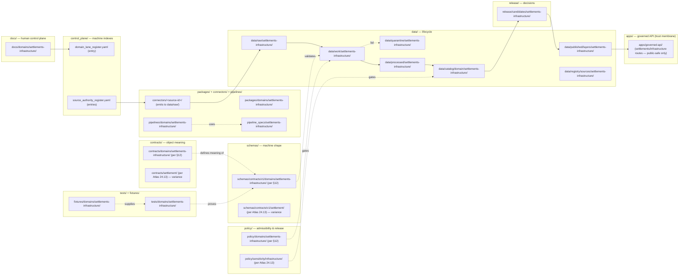

<!-- [KFM_META_BLOCK_V2]
doc_id: kfm://doc/docs/domains/settlements-infrastructure/CANONICAL_PATHS
title: Canonical Paths — Settlements / Infrastructure Domain
type: standard
version: v1
status: draft
owners: <Docs steward + Settlements/Infrastructure lane steward — TODO confirm>
created: 2026-05-19
updated: 2026-05-19
policy_label: public
related:
  - docs/doctrine/directory-rules.md
  - docs/domains/settlements-infrastructure/README.md
  - docs/atlases/KFM_Domains_Culmination_Atlas_v1_1.pdf
  - docs/registers/DRIFT_REGISTER.md
  - docs/registers/VERIFICATION_BACKLOG.md
  - docs/adr/ADR-0001-schema-home.md
tags: [kfm, doctrine, directory-rules, domains, settlements-infrastructure, canonical-paths]
notes:
  - "Doctrine of canonical paths is CONFIRMED per Directory Rules §12."
  - "Specific path presence in any mounted repo is NEEDS VERIFICATION until inspected."
  - "Naming variance between Directory Rules §12 and Atlas v1.1 Ch. 24.13 / Encyclopedia §5.1 is filed as OPEN-CP-01 (ADR-class)."
[/KFM_META_BLOCK_V2] -->

# Canonical Paths — Settlements / Infrastructure Domain

> Authoritative single-page registry of **where Settlements/Infrastructure lives** across the KFM responsibility roots. Resolves any "what folder does this go in?" question for files owned by — or routed through — the Settlements/Infrastructure lane.


<!-- TODO: CI / docs-lint / link-check badges once badge endpoints are CONFIRMED in repo. -->

| Field | Value |
|---|---|
| **Status** | `draft` |
| **Owners** | Docs steward + Settlements/Infrastructure lane steward _(placeholder — confirm via CODEOWNERS)_ |
| **Doctrinal anchor** | Directory Rules §3, §4, §12 (Domain Placement Law) |
| **Domain slug** | `settlements-infrastructure` |
| **Sensitivity posture** | T4 default for critical-asset detail; T1 for generalized footprints; T0 for legal-status settlement names |
| **Last updated** | 2026-05-19 |

---

## 📑 Contents

- [1. Scope and role of this document](#1-scope-and-role-of-this-document)
- [2. Doctrinal basis](#2-doctrinal-basis)
- [3. Domain slug — why `settlements-infrastructure`](#3-domain-slug--why-settlements-infrastructure)
- [4. Canonical-path map](#4-canonicalpath-map)
- [5. Lane-by-lane canonical paths](#5-lanebylane-canonical-paths)
- [6. Sensitivity-aware policy lanes](#6-sensitivityaware-policy-lanes)
- [7. Cross-domain placement](#7-crossdomain-placement)
- [8. Compatibility roots and anti-patterns](#8-compatibility-roots-and-antipatterns)
- [9. Reviewer placement checklist](#9-reviewer-placement-checklist)
- [10. Open questions register](#10-open-questions-register)
- [11. Related docs](#11-related-docs)
- [12. Glossary](#12-glossary)

---

## 1. Scope and role of this document

This document is a **per-domain canonical-path registry**. It enumerates every responsibility-root lane segment that the Settlements/Infrastructure domain may legitimately occupy, and pins each enumeration to a doctrinal citation. It is the single page a reviewer should reach for when asking *"does this Settlements/Infrastructure-related file go here or there?"*.

**This document is.** A doctrine-grounded path index for the Settlements/Infrastructure lane. A reviewer's quick-reference. A reconciliation surface for naming variance across KFM sources (Directory Rules vs Atlas v1.1 vs Encyclopedia).

**This document is not.** A claim that any of these paths currently exists in the mounted repository. It is not a substitute for `contracts/`, `schemas/`, `policy/`, or per-root READMEs that define **what** lives there — only **where** it lives. It is not an authority for **whether** a file should exist; that is decided by source descriptors, ADRs, schemas, contracts, and reviews.

> [!IMPORTANT]
> Per Directory Rules §0, **the rules below are CONFIRMED doctrine; any specific path's presence in a mounted repo is PROPOSED / NEEDS VERIFICATION until inspected.** This document does not promote a proposed path to repo fact.

[↑ back to top](#-contents)

---

## 2. Doctrinal basis

This registry derives from the following CONFIRMED sources:

| Source | Authority for | Truth label |
|---|---|---|
| Directory Rules §3 (root authority) | Which root folders are canonical / compatibility | CONFIRMED |
| Directory Rules §4 (placement protocol, Steps 1–5) | The five-step placement decision (responsibility → lifecycle → domain → authority → cite) | CONFIRMED |
| Directory Rules §12 (Domain Placement Law) | The lane pattern: domains live as **segments** under responsibility roots, never as **root folders** | CONFIRMED |
| Directory Rules §6.1 (`docs/` tree) | Explicit enumeration of `docs/domains/settlements-infrastructure/` as a canonical domain folder | CONFIRMED |
| Atlas v1.1 Ch. 14 (Settlements / Infrastructure) | Domain identity, ownership, cross-lane relations, sensitivity posture | CONFIRMED doctrine / PROPOSED implementation |
| Atlas v1.1 Ch. 24.13 (responsibility-root crosswalk) | Domain ↔ responsibility-root mapping | PROPOSED (naming variance — see [§10 OPEN-CP-01](#10-open-questions-register)) |
| Encyclopedia §5.1 (per-domain index) | Restates Atlas v1.1 Ch. 24.13 with sensitivity tiers | PROPOSED (same variance) |

> [!NOTE]
> Where Directory Rules §12 and Atlas v1.1 Ch. 24.13 disagree on path shape, **Directory Rules wins** per the conflict rule in Directory Rules §2.2 ("Directory Rules wins on path and responsibility-root questions"). The variance is documented as OPEN-CP-01 below; resolution is ADR-class.

[↑ back to top](#-contents)

---

## 3. Domain slug — why `settlements-infrastructure`

The canonical domain segment for this lane is **`settlements-infrastructure`** (lowercase, hyphenated). This is:

- CONFIRMED in Directory Rules §6.1, which lists `docs/domains/settlements-infrastructure/` alongside the other domain folders.
- CONFIRMED in Directory Rules §12, which enumerates `settlements-infrastructure` in the canonical list of domain slugs subject to the Domain Placement Law.
- Consistent with the hyphenated convention used by sibling domains (`roads-rail-trade`, `people-dna-land`).

The Atlas v1.1 Ch. 24.13 crosswalk uses **`settlement/`** (singular, no `domains/` segment) as a `contracts/`/`schemas/` lane name; this is a PROPOSED projection from the dossier short-name `[DOM-SETTLE]`, not a contradiction of the slug above. See [§10 OPEN-CP-01](#10-open-questions-register).

| Surface | Slug form | Truth label |
|---|---|---|
| `docs/domains/<slug>/` | `settlements-infrastructure` | CONFIRMED (Directory Rules §6.1) |
| `schemas/contracts/v1/domains/<slug>/` (per §12) | `settlements-infrastructure` | CONFIRMED doctrine / NEEDS VERIFICATION in repo |
| Atlas crosswalk `schemas/contracts/v1/<slug>/` (per Atlas 24.13) | `settlement` | PROPOSED — see OPEN-CP-01 |
| Policy crosswalk `policy/sensitivity/<slug>/` (per Atlas 24.13) | `infrastructure` | PROPOSED — see OPEN-CP-01 |
| Dossier short-name | `[DOM-SETTLE]` | CONFIRMED (Atlas v1.0 §2; v1.1 Appx. B) |

[↑ back to top](#-contents)

---

## 4. Canonical-path map

The diagram below summarizes the responsibility-root reach of the Settlements/Infrastructure lane. Topology only — no claim is made about which boxes currently exist in any mounted repo.



> [!NOTE]
> Two pairs of variance boxes (`contracts/settlement/` vs `contracts/domains/settlements-infrastructure/`, and `schemas/contracts/v1/settlement/` vs `schemas/contracts/v1/domains/settlements-infrastructure/`) reflect a real disagreement between Directory Rules §12 and Atlas v1.1 Ch. 24.13. Until OPEN-CP-01 is resolved by ADR, **Directory Rules §12 is the working canonical form**.

[↑ back to top](#-contents)

---

## 5. Lane-by-lane canonical paths

The table below enumerates every responsibility root that may legitimately host a Settlements/Infrastructure-segment file. Paths are written as **PROPOSED** unless explicitly verified in a mounted repo. The **doctrine** of the lane pattern is CONFIRMED per Directory Rules §12; the **specific path text** is the form Directory Rules §4 Step 3 prescribes.

### 5.1 Authority / governance roots

| Responsibility root | Canonical path (PROPOSED) | What lives here | Doctrine | Truth label |
|---|---|---|---|---|
| `docs/` | `docs/domains/settlements-infrastructure/` | Domain README, this CANONICAL_PATHS, dossier excerpts, ADR backlog, sensitivity briefs | §6.1, §12 | CONFIRMED doctrine / NEEDS VERIFICATION presence |
| `control_plane/` | `control_plane/domain_lane_register.yaml` (entry), `control_plane/source_authority_register.yaml` (entries) | Machine-readable registry **entries** for this lane (not a per-domain file) | §6.2 | CONFIRMED doctrine / NEEDS VERIFICATION presence |
| `contracts/` | `contracts/domains/settlements-infrastructure/` | Object meaning: `Settlement`, `Municipality`, `CensusPlace`, `Townsite`, `GhostTown`, `Fort`, `Mission`, `ReservationCommunity`, `InfrastructureAsset`, `NetworkNode`, `NetworkSegment`, `Facility`, `ServiceArea`, `Operator`, `ConditionObservation`, `Dependency` | §6.3, §12 | CONFIRMED doctrine (Atlas Ch. 14 §B owns this set) / NEEDS VERIFICATION presence |
| `schemas/` | `schemas/contracts/v1/domains/settlements-infrastructure/` | JSON Schemas for every contract above; `schemas/tests/valid/` and `schemas/tests/invalid/` carry golden samples | §6.4, §7.4 (ADR-0001), §12 | CONFIRMED doctrine / NEEDS VERIFICATION presence / variance with Atlas 24.13 → OPEN-CP-01 |
| `policy/` | `policy/domains/settlements-infrastructure/` **and** `policy/sensitivity/infrastructure/` (per Atlas 24.13) | Sensitivity classification, redaction, and release policy for critical-asset detail | §6.5, §12 | CONFIRMED doctrine / NEEDS VERIFICATION presence / OPEN-CP-01 |

### 5.2 Proof roots

| Responsibility root | Canonical path (PROPOSED) | What lives here |
|---|---|---|
| `tests/` | `tests/domains/settlements-infrastructure/` | Validator tests, deny-lane proofs, public-safe no-leak tests, condition-temporal tests |
| `fixtures/` | `fixtures/domains/settlements-infrastructure/` | Golden valid / invalid sample data for the tests above |

Per Atlas Ch. 14 §K, the Settlements/Infrastructure test families include — all PROPOSED implementation:

- Legal municipality evidence tests
- Census-vs-municipality distinction tests
- Infrastructure topology tests
- `observed_at` temporal tests for condition observations
- **Restricted-geometry no-leak tests** _(critical-asset deny lane)_
- Catalog / proof / release closure tests

### 5.3 Code roots

| Responsibility root | Canonical path (PROPOSED) | What lives here |
|---|---|---|
| `packages/` | `packages/domains/settlements-infrastructure/` | Shared lane libraries: identity helpers, normalization adapters, generalization utilities |
| `connectors/` | `connectors/<source-id>/` (no `domains/` segment) | Source-specific fetchers / admitters. Connectors **do not publish**: they emit to `data/raw/<domain>/` or `data/quarantine/<domain>/` — Directory Rules §13.5 (Connector publishes anti-pattern) |
| `pipelines/` | `pipelines/domains/settlements-infrastructure/` | Executable promotion logic |
| `pipeline_specs/` | `pipeline_specs/settlements-infrastructure/` | Declarative pipeline configuration (note: **no `domains/` segment** here per §4 Step 3) |
| `tools/` | `tools/validators/<topic>/` (cross-domain shared tooling lives **without** a domain segment) | Repo-wide validators that may include Settlements/Infrastructure cases |

### 5.4 Lifecycle data root

Per Directory Rules §4 Step 2, files under `data/` carry an explicit phase. Per §4 Step 3, **the domain segment follows the phase** — `data/<phase>/<domain>/` — and does **not** appear under a `domains/` sub-segment.

| Phase | Canonical path (PROPOSED) | Promotion gate (Atlas Ch. 14 §H) |
|---|---|---|
| RAW | `data/raw/settlements-infrastructure/` | `SourceDescriptor` exists; rights, sensitivity, citation, time, hash captured |
| WORK | `data/work/settlements-infrastructure/` | Schema, geometry, time, identity, evidence, rights, and policy normalization runnable |
| QUARANTINE | `data/quarantine/settlements-infrastructure/` | Validation or policy failure; reason recorded; **never silently promotes** |
| PROCESSED | `data/processed/settlements-infrastructure/` | `EvidenceRef`, `ValidationReport`, and digest closure exist; `RedactionReceipt` if sensitivity applies |
| CATALOG | `data/catalog/domain/settlements-infrastructure/` | `CatalogMatrix` entry; `EvidenceBundle`; graph/triplet projections if applicable |
| PUBLISHED | `data/published/layers/settlements-infrastructure/` | `ReleaseManifest`, rollback target, correction path, `ReviewRecord` where required |

Adjacent emitted artifacts (per §4 Step 2: receipts, proofs, registry, rollback **are emitted alongside lifecycle directories; they do not replace them**):

| Artifact | Canonical path (PROPOSED) |
|---|---|
| Receipts | `data/receipts/settlements-infrastructure/` |
| Proofs (`EvidenceBundle` resolution) | `data/proofs/settlements-infrastructure/` |
| Source registry | `data/registry/sources/settlements-infrastructure/` (or `data/registry/settlements-infrastructure/` — both acceptable per §4 Step 3) |
| Rollback targets | `data/rollback/settlements-infrastructure/` |

> [!CAUTION]
> Per Directory Rules §13.5 (Watcher-as-non-publisher invariant) and §13 (Lifecycle skip anti-pattern), a pipeline **MUST NOT** write directly from `data/raw/settlements-infrastructure/` to `data/published/layers/settlements-infrastructure/`. Every phase runs; promotion is a governed state transition.

### 5.5 Release root

| Surface | Canonical path (PROPOSED) |
|---|---|
| Release candidates | `release/candidates/settlements-infrastructure/` |
| `ReleaseManifest` files | `release/manifests/settlements-infrastructure/` _(PROPOSED — confirm sibling convention per ADR-S-03)_ |
| `RollbackCard` files | `release/rollback/settlements-infrastructure/` _(PROPOSED — convention pending)_ |
| `CorrectionNotice` files | `release/corrections/settlements-infrastructure/` _(PROPOSED — convention pending)_ |

> [!NOTE]
> Per Directory Rules §13.2, release **decisions** live in `release/`; release **artifacts** live in `data/published/`. They are distinct.

### 5.6 Runtime / infra / examples

| Responsibility root | Canonical path (PROPOSED) | Notes |
|---|---|---|
| `runtime/` | `runtime/adapters/<topic>/` (no domain segment) | Local runtime adapters; never a public surface |
| `apps/` | `apps/governed-api/` (no domain segment) | The **trust membrane**. Settlements/Infrastructure routes live here, not in a per-domain app folder |
| `infra/` | `infra/` (no domain segment) | Deploy posture is repo-wide |
| `configs/` | `configs/` (no domain segment, unless a per-domain template) | Templates and defaults only — no secrets |
| `migrations/` | `migrations/<change-id>/` (no domain segment) | Includes a `rollback/` subtree |
| `examples/` | `examples/settlements-infrastructure/` _(PROPOSED — by analogy with §12)_ | Runnable, kept current |

[↑ back to top](#-contents)

---

## 6. Sensitivity-aware policy lanes

Atlas Ch. 14 §I designates Settlements/Infrastructure as a **critical-asset deny lane**. The canonical-path implications:

| Lane | Sensitivity tier (Atlas 24.5 / 24.14) | Canonical policy path (PROPOSED) | Default outcome |
|---|---|---|---|
| Critical infrastructure asset detail | **T4** default | `policy/sensitivity/infrastructure/` _and_ `policy/domains/settlements-infrastructure/` | DENY → review-then-generalize |
| Utility / dependency edges | **T4** for detail; T1 for aggregate | same | DENY detail; ALLOW aggregate with `AggregationReceipt` |
| Exact facility geometry | **T4** | same | DENY → `RedactionReceipt` + generalized footprint |
| Condition observations | **T4** for raw; T2 with steward review | same | DENY raw publication |
| Legal-status `Settlement` / `Municipality` / `GhostTown` | **T0** | `policy/domains/settlements-infrastructure/` | ALLOW with `EvidenceBundle` |
| Generalized footprint of critical asset (post-review) | **T1** | same + `RedactionReceipt` in `data/receipts/` | ALLOW after redaction |

> [!WARNING]
> Per Atlas Ch. 14 §I and Atlas Ch. 24.9 trust-membrane anti-patterns: **public clients MUST NOT read from `data/processed/` or `data/catalog/` directly.** All public routes for Settlements/Infrastructure flow through `apps/governed-api/`, which enforces evidence, policy, release, and finite outcomes (`ANSWER` / `ABSTAIN` / `DENY` / `ERROR`).

The `SettlementsInfrastructureDecisionEnvelope` DTO and the layer-manifest / Evidence Drawer payload schemas land under `schemas/contracts/v1/domains/settlements-infrastructure/runtime/` (PROPOSED — pending OPEN-CP-01 resolution and ADR-S-03 receipt-class home decision).

[↑ back to top](#-contents)

---

## 7. Cross-domain placement

Settlements/Infrastructure has CONFIRMED cross-lane relations to Roads/Rail, Hazards, Hydrology, and People/Land (Atlas Ch. 14 §F). When a file legitimately spans Settlements/Infrastructure and one or more of these lanes:

| Situation | Canonical placement (per §12 multi-domain rule) | Example |
|---|---|---|
| Shared validator across Settlements/Infrastructure × Roads/Rail (e.g., depot–bridge–crossing topology) | `tools/validators/<topic>/` — **no domain segment** | `tools/validators/transport-facility-topology/` |
| Shared schema across Settlements × Hazards (e.g., exposure indices) | `schemas/contracts/v1/<topic>/` — **no domain segment** | `schemas/contracts/v1/exposure/` |
| Shared cross-lane doctrine | `docs/architecture/<topic>.md` — **no domain segment** | `docs/architecture/critical-asset-exposure.md` |
| File owned by Roads/Rail but consumed here | Lives under `roads-rail-trade` segments; cited here, not duplicated | `schemas/contracts/v1/domains/roads-rail-trade/transport-facility.schema.json` |

> [!TIP]
> The rule from Directory Rules §12 is: **place a cross-cutting file under the lowest common responsibility root that owns the file's responsibility, without a domain segment**. Picking one of the two domains as the home is drift, not a solution.

### 7.1 Object-family ownership reference

From Atlas Ch. 24.14 — these object families are **owned** by Settlements/Infrastructure (lives under the slug above) but **cited** from other lanes:

| Object family | Citing domains | Sensitivity default |
|---|---|---|
| `Settlement` / `Municipality` / `GhostTown` | People/Land; Frontier Matrix; Archaeology | T0 |
| `InfrastructureAsset` (critical) | Hazards (with restriction) | **T4 default**; T1 for generalized footprint |

Conversely, the following are **cited** by Settlements/Infrastructure but **owned** elsewhere (do **not** place under Settlements/Infrastructure paths):

| Object family | Owner | Path home |
|---|---|---|
| `HUC` / `Watershed` / `Reach` | Hydrology | `schemas/contracts/v1/domains/hydrology/` _(per §12)_ |
| `NFHLZone` (regulatory floodplain) | Hydrology | same |
| `SoilMapUnit` / `SoilComponent` (advisory) | Soil | `schemas/contracts/v1/domains/soil/` |
| `RoadSegment` / `RailSegment` / `TransportFacility` | Roads/Rail | `schemas/contracts/v1/domains/roads-rail-trade/` |
| `HazardEvent` / `DisasterDeclaration` | Hazards | `schemas/contracts/v1/domains/hazards/` |
| `PersonAssertion` (with restrictions) | People/Genealogy | `schemas/contracts/v1/domains/people-dna-land/` |

[↑ back to top](#-contents)

---

## 8. Compatibility roots and anti-patterns

### 8.1 What `settlements-infrastructure/` MUST NOT become

Per Directory Rules §12 and §13.4, a root folder named `settlements-infrastructure/` at the **repo root** is forbidden:

```text
# ❌ FORBIDDEN — domain folder at repo root (Directory Rules §13.4)
settlements-infrastructure/
├── data/
├── schemas/
├── policy/
└── docs/
```

This pattern competes with responsibility roots, fragments the lifecycle, and creates parallel authority homes. The fix is to migrate every file into the lane pattern shown in [§5](#5-lanebylane-canonical-paths).

### 8.2 Other anti-patterns specifically risky for this domain

| Anti-pattern | Why it's risky here | Counter-rule |
|---|---|---|
| Critical-asset detail leaked through `data/processed/` to a public client | T4 deny lane bypassed | All public reads go through `apps/governed-api/`; trust membrane (§7.1) |
| `policy/sensitivity/infrastructure/` and `policy/domains/settlements-infrastructure/` evolving in parallel without ADR | Two parallel policy homes; reviewers can't tell which is authoritative | Single policy home per topic; ADR if both are needed; see OPEN-CP-01 |
| `RedactionReceipt` for generalized footprint stored in `artifacts/` | Trust-bearing receipt in build-scratch root (§13.2) | Receipts live in `data/receipts/settlements-infrastructure/`, never `artifacts/` |
| `ConditionObservation` schema authored next to a CSV instance | Schema-alongside-data drift (§13 / §13.5 Schema-mirror divergence) | Shape under `schemas/`; meaning under `contracts/`; instance under `data/` |
| Aggregate `ServiceArea` cited as per-place observation | Source-role collapse (Atlas 24.9.2) | Validator + Focus Mode citation evaluator enforces aggregate vs per-place separation |

[↑ back to top](#-contents)

---

## 9. Reviewer placement checklist

When reviewing a PR that adds, moves, or renames a Settlements/Infrastructure-related path, work through this list (extends Directory Rules §16):

- [ ] **Responsibility identified.** Maps to exactly one of Directory Rules §4 Step 1 categories.
- [ ] **Right root.** Chosen root matches that responsibility (use [§5](#5-lanebylane-canonical-paths) as the lookup).
- [ ] **Domain segment correct.** Slug is `settlements-infrastructure` (not `settlement`, `settlements`, `infrastructure`, or `settlement-and-infrastructure`) unless OPEN-CP-01 has been resolved otherwise by ADR.
- [ ] **`domains/` segment present where §12 requires it.** Specifically under `docs/`, `contracts/`, `schemas/contracts/v1/`, `policy/`, `tests/`, `fixtures/`, `packages/`, `pipelines/`.
- [ ] **`domains/` segment absent where §12 forbids it.** Specifically under `pipeline_specs/`, `data/<phase>/`, `release/candidates/`, `connectors/`, `tools/`, `runtime/`, `apps/`, `infra/`, `configs/`, `migrations/`.
- [ ] **Lifecycle phase correct** (data only). File is in the right phase; no skipping.
- [ ] **No new root without ADR.** No new canonical or compatibility root introduced silently.
- [ ] **No parallel authority.** No new schema home, policy home, receipt home, or release home created without an ADR.
- [ ] **Trust content placement.** Receipts → `data/receipts/`; proofs → `data/proofs/`; release decisions → `release/`. Never `artifacts/`.
- [ ] **Sensitivity-aware.** Critical-asset detail (T4) is not exposed through a non-governed path.
- [ ] **Public path discipline.** Public reads route through `apps/governed-api/`, not direct stores.
- [ ] **Variance flagged.** Any deviation from §12 in favor of Atlas 24.13 form (`settlement/`, `policy/sensitivity/infrastructure/`) is filed against OPEN-CP-01.
- [ ] **Rule cited in PR description.** PR names the Directory Rules section that justifies the placement.

> [!IMPORTANT]
> A reviewer who cannot tick every applicable box SHOULD request changes or open an entry in `docs/registers/DRIFT_REGISTER.md`.

[↑ back to top](#-contents)

---

## 10. Open questions register

These items are tracked here for triage; resolutions migrate to `docs/registers/VERIFICATION_BACKLOG.md`, `docs/registers/DRIFT_REGISTER.md`, or `docs/adr/` as appropriate.

### Variance and ADR-class

- **OPEN-CP-01 — Slug variance between Directory Rules §12 and Atlas v1.1 Ch. 24.13.**
  Directory Rules §12 prescribes `schemas/contracts/v1/domains/settlements-infrastructure/` and `policy/domains/settlements-infrastructure/`. Atlas v1.1 Ch. 24.13 (and Encyclopedia §5.1) cite `schemas/contracts/v1/settlement/`, `contracts/settlement/`, and `policy/sensitivity/infrastructure/`. The two forms cannot both be canonical without an ADR. Parallel to OPEN-DR-01 (`PROV.md` vs `PROVENANCE.md`) and OPEN-ENC-04 (`geology` vs `geology-and-natural-resources`).
  **Resolution required by ADR.** Until resolved, this document treats Directory Rules §12 as canonical and flags Atlas 24.13 form as variance.

- **OPEN-CP-02 — Sensitivity policy home: `policy/sensitivity/<topic>/` vs `policy/domains/<domain>/`.**
  Atlas 24.13 places critical-asset deny rules at `policy/sensitivity/infrastructure/`; Directory Rules §12 implies `policy/domains/settlements-infrastructure/`. Whether to use a sensitivity-axis home, a domain-axis home, or both (with one mirroring the other) is ADR-class per Directory Rules §2.4(5).
  **Resolution via ADR.**

- **OPEN-CP-03 — Release sub-structure for this lane.**
  Whether `release/manifests/<domain>/`, `release/rollback/<domain>/`, and `release/corrections/<domain>/` are the correct sibling structure, or whether a flatter `release/<domain>/manifests/` layout applies. Touches ADR-S-11 (story / export receipt policy) and ADR-S-03 (receipt class home).
  **Resolution via ADR.**

### Repo-evidence

- **OPEN-CP-04 — Mounted-repo verification of every path above.**
  Every PROPOSED path in [§5](#5-lanebylane-canonical-paths) NEEDS VERIFICATION against a mounted repo. The doctrine is CONFIRMED; presence is not.

- **OPEN-CP-05 — Per-domain `examples/` convention.**
  Whether `examples/settlements-infrastructure/` is the convention, or examples live under `examples/<topic>/` without a domain segment. Directory Rules §4 Step 3 does not list `examples/` in the lane-pattern enumeration; §12 is silent.
  **Resolution via routine PR + Docs steward decision.**

### Naming and casing

- **OPEN-CP-06 — Hyphen vs underscore for the slug.**
  Existing KFM convention uses hyphenated lowercase slugs (`settlements-infrastructure`, `roads-rail-trade`). NEEDS VERIFICATION that no mounted-repo file uses `settlements_infrastructure` or `SettlementsInfrastructure`. If inconsistency exists, file to `docs/registers/DRIFT_REGISTER.md`.

[↑ back to top](#-contents)

---

## 11. Related docs

- `docs/doctrine/directory-rules.md` — Source of the lane-pattern doctrine (§§3, 4, 12, 13)
- `docs/domains/settlements-infrastructure/README.md` — Domain orientation _(PROPOSED — TODO confirm)_
- `docs/atlases/KFM_Domains_Culmination_Atlas_v1_1.pdf` — Atlas v1.1 Ch. 14 (Settlements/Infrastructure) and Ch. 24.13 (responsibility-root crosswalk)
- `docs/encyclopedia/` — Encyclopedia §5.1 (per-domain index)
- `docs/adr/ADR-0001-schema-home.md` — Schema home authority (governs §5.1 schemas row)
- `docs/registers/DRIFT_REGISTER.md` — Where variance entries land
- `docs/registers/VERIFICATION_BACKLOG.md` — Where NEEDS VERIFICATION items land
- `docs/standards/PROV.md` — Provenance standard _(per Directory Rules §6.1 v1.1 note; naming variance flagged as OPEN-DR-01)_

[↑ back to top](#-contents)

---

## 12. Glossary

<details>
<summary>Click to expand glossary</summary>

Terms used in this document with placement-disambiguating definitions. Full definitions live in `docs/doctrine/` and `contracts/`.

| Term | Short definition |
|---|---|
| **Authority root** | A repo-root folder that carries one of the Directory Rules §3 responsibilities. |
| **Compatibility root** | A root that exists for legacy, mirror, deprecated, or transitional reasons (Directory Rules §8). |
| **Critical-asset deny lane** | The Settlements/Infrastructure posture under which utility detail, condition observations, dependencies, operator-sensitive details, and exact facility geometry default to T4 (DENY) until reviewed and generalized (Atlas Ch. 14 §I). |
| **Domain segment** | The hyphenated slug `settlements-infrastructure` appearing **inside** a responsibility root, never as a root itself. |
| **EvidenceBundle / EvidenceRef** | Resolved support package for claims; lives in `data/proofs/`. Outranks generated language. |
| **Governed API** | The trust-membrane operational surface — `apps/governed-api/`. All public reads route through it. |
| **Lane** | A domain or topic segment inside a responsibility root (e.g., `data/processed/settlements-infrastructure/`). |
| **Lane pattern** | The Directory Rules §12 enumeration of canonical responsibility-root × domain-segment combinations. |
| **Lifecycle invariant** | RAW → WORK / QUARANTINE → PROCESSED → CATALOG / TRIPLET → PUBLISHED. Promotion is a governed state transition, not a file move. |
| **Promotion** | A governed state transition between lifecycle phases. Not a file move. Atlas Ch. 14 §H gates apply. |
| **RedactionReceipt** | Trust-bearing record of a public-safe field or geometry transformation; emitted under `data/receipts/`. |
| **ReleaseManifest** | Release decision; lives in `release/`. Published artifact lives in `data/published/`. |
| **Responsibility root** | One of the Directory Rules §3 canonical or compatibility root folders. |
| **Sensitivity tier** | T0 (open public) through T4 (deny default); Atlas Ch. 24.5 defines transitions. |
| **Slug** | The hyphenated lowercase domain identifier: `settlements-infrastructure`. |
| **Trust membrane** | The boundary that prevents raw / unreviewed / model-generated / internal state from becoming public truth (Atlas Ch. 24.9.2). Operational form: `apps/governed-api/`. |

</details>

[↑ back to top](#-contents)

---

<sub>📂 **Canonical Paths — Settlements / Infrastructure Domain** · doc_id: `kfm://doc/docs/domains/settlements-infrastructure/CANONICAL_PATHS` · version `v1` (draft) · last updated **2026-05-19** · doctrine CONFIRMED · repo presence NEEDS VERIFICATION · [↑ back to top](#-contents)</sub>

**Related:** [`directory-rules.md`](../../doctrine/directory-rules.md) · [`README.md`](./README.md) · [`Atlas v1.1 Ch. 14`](../../atlases/KFM_Domains_Culmination_Atlas_v1_1.pdf) · [`DRIFT_REGISTER.md`](../../registers/DRIFT_REGISTER.md) · [`VERIFICATION_BACKLOG.md`](../../registers/VERIFICATION_BACKLOG.md)
