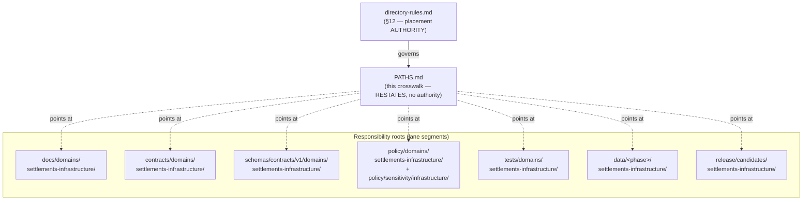

<!-- [KFM_META_BLOCK_V2]
doc_id: kfm://doc/settlements-infrastructure-paths
title: Settlements & Infrastructure — Lane Path Crosswalk
type: standard
version: v1
status: draft
owners: PLACEHOLDER-settlements-infrastructure-domain-steward, PLACEHOLDER-docs-steward
created: 2026-06-07
updated: 2026-06-07
policy_label: public
related: [ai-build-operating-contract.md, directory-rules.md, docs/domains/settlements-infrastructure/README.md, schemas/contracts/v1/domains/settlements-infrastructure/, policy/sensitivity/infrastructure/, data/published/layers/settlements-infrastructure/]
tags: [kfm, settlements-infrastructure, paths, crosswalk, placement, directory-rules]
notes: [Doctrine-adjacent; CONTRACT_VERSION = "3.0.0" pinned. This is a READ-ONLY lane crosswalk that RESTATES Directory Rules §12 + Atlas §24.13 — it is NOT a placement authority. directory-rules.md governs. Created via Option A instead of the requested CANONICAL_PATHS/ folder to avoid a parallel-authority / singleton-folder smell. All concrete paths are PROPOSED until verified against a mounted repo.]
[/KFM_META_BLOCK_V2] -->

<a id="top"></a>

# 🏘️ Settlements & Infrastructure — Lane Path Crosswalk

> Where every Settlements/Infrastructure file belongs, restated from Directory Rules §12 and Atlas §24.13. This page is a **map, not an authority** — it points at the canonical homes, it does not create them.


<!-- TODO: replace with real CI / placement-lint endpoint once available -->


**Status:** `draft` · **Owners:** Settlements/Infrastructure domain steward + docs steward _(placeholders — verify)_ · **Updated:** 2026-06-07
**Pinned:** `CONTRACT_VERSION = "3.0.0"` (`ai-build-operating-contract.md`)

> [!IMPORTANT]
> **This file is a crosswalk, not a placement authority.** The canonical placement authority is [`directory-rules.md`](../../../directory-rules.md) (§12 Domain Placement Law); the canonical Atlas-section ↔ root mapping is **Atlas §24.13**. If this page ever disagrees with either, **they govern** and the conflict is logged in `docs/registers/DRIFT_REGISTER.md`. A new placement authority MUST NOT be created here. *(Directory Rules §13 / §24.9.1 — parallel homes create competing authorities.)*

---

## Quick navigation

- [1. Why this page exists](#1-why-this-page-exists)
- [2. Domain Placement Law in one line](#2-domain-placement-law-in-one-line)
- [3. Lane map (diagram)](#3-lane-map-diagram)
- [4. Canonical lane paths](#4-canonical-lane-paths)
- [5. Atlas §24.13 anchor row](#5-atlas-2413-anchor-row)
- [6. Data lifecycle paths](#6-data-lifecycle-paths)
- [7. What does NOT live in this lane](#7-what-does-not-live-in-this-lane)
- [8. Cross-lane non-ownership](#8-cross-lane-non-ownership)
- [Open questions register](#open-questions-register)
- [Open verification backlog](#open-verification-backlog)
- [Changelog](#changelog-v0--v1)
- [Definition of done](#definition-of-done)
- [Related docs](#related-docs)

---

## 1. Why this page exists

A contributor adding a Settlements/Infrastructure file needs one place to answer "where does this go?" without re-deriving Directory Rules each time. This crosswalk collects the lane's path answers in one view, **citing the rule for each**, so placement stays a governed act rather than a guess.

It does three things and nothing more:

1. Restates the **lane segment pattern** for this domain.
2. Lists the **canonical homes** per responsibility root.
3. Names what does **not** belong here and where it goes instead.

> [!NOTE]
> Every concrete path below is **PROPOSED** until verified against a mounted repository. The **rule** (responsibility-rooted placement, domain as segment) is CONFIRMED; the **specific files/dirs** are not. `[DIRRULES §12]`

[↑ Back to top](#top)

---

## 2. Domain Placement Law in one line

> A domain MUST NOT become a root folder. `settlements-infrastructure` is a **lane segment inside responsibility roots**, never a root itself. *(CONFIRMED — `[DIRRULES §12]`)*

```text
❌  settlements-infrastructure/          # domain as a root — forbidden
        data/  schemas/  policy/  docs/

✅  docs/domains/settlements-infrastructure/        # lane segment in each root
    schemas/contracts/v1/domains/settlements-infrastructure/
    policy/domains/settlements-infrastructure/
    data/<phase>/settlements-infrastructure/
```

[↑ Back to top](#top)

---

## 3. Lane map (diagram)



<sub>CONFIRMED pattern (Directory Rules §12); concrete path presence is NEEDS VERIFICATION against a mounted repo.</sub>

[↑ Back to top](#top)

---

## 4. Canonical lane paths

The uniform lane pattern from Directory Rules §12, instantiated for `settlements-infrastructure`. **All PROPOSED until repo-verified.**

| Responsibility | Canonical lane path | Rule |
|---|---|---|
| Explain to humans | `docs/domains/settlements-infrastructure/` | `[DIRRULES §12]` |
| Object meaning | `contracts/domains/settlements-infrastructure/` | `[DIRRULES §12]` |
| Object shape (schema) | `schemas/contracts/v1/domains/settlements-infrastructure/` | `[DIRRULES §12 / §7.4 / ADR-0001]` |
| Allow / deny / restrict | `policy/domains/settlements-infrastructure/` | `[DIRRULES §12]` |
| Prove enforceability | `tests/domains/settlements-infrastructure/` | `[DIRRULES §12]` |
| Test sample data | `fixtures/domains/settlements-infrastructure/` | `[DIRRULES §12]` |
| Shared lane code | `packages/domains/settlements-infrastructure/` | `[DIRRULES §12]` |
| Pipeline logic | `pipelines/domains/settlements-infrastructure/` | `[DIRRULES §12]` |
| Lifecycle data | `data/<phase>/settlements-infrastructure/` | `[DIRRULES §12]` (see [§6](#6-data-lifecycle-paths)) |
| Release candidates | `release/candidates/settlements-infrastructure/` | `[DIRRULES §12]` |

> [!CAUTION]
> **Critical-asset deny lane.** Per Atlas §24.13, this domain carries a **critical-asset deny lane**: precise critical-infrastructure detail defaults to **T4** and is governed under `policy/sensitivity/infrastructure/`. Path placement does not relax sensitivity — a public-safe lane path is not a license to publish precise critical-asset geometry. `[DOM-SETTLE §I] [ENCY §24.5.2]`

[↑ Back to top](#top)

---

## 5. Atlas §24.13 anchor row

The Atlas Section ↔ Dossier ↔ Responsibility Root crosswalk records this lane's anchor row. Reproduced verbatim-in-meaning (PROPOSED per Atlas; NEEDS VERIFICATION in repo):

| Atlas ch. | Domain | Dossier | Primary responsibility root (PROPOSED) | Notes |
|---|---|---|---|---|
| 14 | Settlements / Infrastructure | `[DOM-SETTLE]` | `schemas/contracts/v1/settlement/`; `contracts/settlement/`; `policy/sensitivity/infrastructure/` | Critical-asset deny lane. |

> [!WARNING]
> **Naming variance — surface, do not resolve.** Atlas §24.13 uses the **singular `settlement/`** segment (`schemas/contracts/v1/settlement/`, `contracts/settlement/`), while Directory Rules §12's uniform pattern uses the **full lane name `settlements-infrastructure/`**. These are CONFLICTED. Directory Rules §12 is the placement authority, so the §4 table above prefers `settlements-infrastructure/`; the §24.13 singular form is preserved here as lineage. An ADR or `DRIFT_REGISTER.md` entry should ratify one. See [OQ-SI-PATH-01](#open-questions-register). `[DIRRULES §12 vs ENCY §24.13]`

[↑ Back to top](#top)

---

## 6. Data lifecycle paths

Lifecycle data uses the phase-then-domain pattern; promotion between phases is a **governed state transition, not a file move**. `[DIRRULES §12] [DOM-SETTLE §H]`

```text
data/raw/settlements-infrastructure/
data/work/settlements-infrastructure/
data/quarantine/settlements-infrastructure/
data/processed/settlements-infrastructure/
data/catalog/domain/settlements-infrastructure/
data/published/layers/settlements-infrastructure/
data/registry/sources/settlements-infrastructure/      # PROPOSED home — see OQ-SI-PATH-02
```

| Phase | Lane path | Gate (per dossier §H) |
|---|---|---|
| RAW | `data/raw/settlements-infrastructure/` | `SourceDescriptor` exists |
| WORK / QUARANTINE | `data/work/…`, `data/quarantine/…` | validation + policy pass, or quarantine reason |
| PROCESSED | `data/processed/settlements-infrastructure/` | `EvidenceRef` + `ValidationReport` + digest |
| CATALOG / TRIPLET | `data/catalog/domain/settlements-infrastructure/` | catalog/proof closure + `EvidenceBundle` |
| PUBLISHED | `data/published/layers/settlements-infrastructure/` | `ReleaseManifest` + rollback + correction + review |

*(All PROPOSED — `[DOM-SETTLE §H] [DIRRULES §12]`)*

[↑ Back to top](#top)

---

## 7. What does NOT live in this lane

| Do not place here | Goes instead in | Why |
|---|---|---|
| A `settlements-infrastructure/` root folder | the lane segments above | Domain ≠ root `[DIRRULES §3, §12]` |
| The `SourceDescriptor` schema | `schemas/contracts/v1/source/` | Cross-cutting schema, ADR-0001 |
| Receipts / proofs / manifests | `data/receipts/`, `data/proofs/`, `release/` | Trust content, not `docs/` `[DIRRULES §13.2]` |
| A new placement authority (e.g. `CANONICAL_PATHS/`) | nowhere — `directory-rules.md` is the authority | Parallel authority `[DIRRULES §13 / §24.9.1]` |
| Cross-domain validators (e.g. settlements × hazards) | `tools/validators/<topic>/` (no domain segment) | Multi-domain files go to the lowest common root `[DIRRULES §12]` |
| Roads/Rail transport routes, Hydrology water, Hazards events, People/Land ownership | their owning lanes (see [§8](#8-cross-lane-non-ownership)) | Non-ownership `[DOM-SETTLE §B]` |

[↑ Back to top](#top)

---

## 8. Cross-lane non-ownership

This lane owns **Settlement · Municipality · CensusPlace · Townsite · GhostTown · Fort · Mission · ReservationCommunity · Infrastructure Asset · Network Node · Network Segment · Facility · Service Area · Operator · Condition Observation · Dependency**. `[DOM-SETTLE §B]`

It explicitly does **not** own:

| Concept | Owning lane | Relationship |
|---|---|---|
| Transport routes (depot/bridge/crossing as *route* objects) | Roads / Rail | cites via governed join |
| Water / wastewater / stormwater / floodplain / drainage | Hydrology | cites via governed join |
| Hazard events, warnings, declarations | Hazards | cites; KFM never an alert authority |
| Ownership, parcel, living-person privacy | People / Land | cites; defers to their sensitivity policy |

*(CONFIRMED non-ownership + cross-lane relations — `[DOM-SETTLE §B, §F]`)*

[↑ Back to top](#top)

---

## Open questions register

| ID | Question | Owner role | Resolution path |
|---|---|---|---|
| OQ-SI-PATH-01 | Singular `settlement/` (Atlas §24.13) vs full lane name `settlements-infrastructure/` (Directory Rules §12) — which segment is canonical? | Docs steward | ADR or `DRIFT_REGISTER.md`; reconcile §4 / §5 |
| OQ-SI-PATH-02 | Source-descriptor registry home: `data/registry/<domain>/` vs `data/registry/sources/<domain>/` (both phrasings appear in Directory Rules). | Docs steward | ADR-class per §2.4(5); shared with Roads/Rail OQ-RR-SR-08 |
| OQ-SI-PATH-03 | Was `CANONICAL_PATHS/` intended to hold future path artifacts beyond this crosswalk? If yes, a §15 folder-README may be warranted instead. | Docs steward | Lane doc-set review |

## Open verification backlog

These remain `NEEDS VERIFICATION` before promotion from `draft` to `published`:

1. Presence of each lane segment (`docs/`, `contracts/`, `schemas/`, `policy/`, `tests/`, `data/`, `release/`) for this domain.
2. The §24.13 singular-vs-full naming reconciliation (OQ-SI-PATH-01).
3. The registry-home question (OQ-SI-PATH-02).
4. Presence of `policy/sensitivity/infrastructure/` (the critical-asset deny lane).

## Changelog v0 → v1

| Change | Type (per contract §37) | Reason |
|---|---|---|
| Initial creation as lane path crosswalk (Option A) | new | Requested `CANONICAL_PATHS/README.md` reframed to avoid parallel-authority / singleton-folder smell |
| §24.13 singular-vs-§12 full-name variance surfaced | reconciliation | CONFLICTED segment naming flagged, not silently picked |
| Critical-asset deny-lane caution inlined | clarification | Path placement must not relax sensitivity |

> **Backward compatibility.** New file at `PATHS.md` (not the requested `CANONICAL_PATHS/README.md`). If a `CANONICAL_PATHS/` folder is later required, this content moves there under a §15 folder-README and this file becomes a redirect stub.

## Definition of done

This document is done enough to enter the repository when:

- it is placed at `docs/domains/settlements-infrastructure/PATHS.md` per Directory Rules §12;
- a docs steward **and** domain steward review it;
- it restates — never overrides — Directory Rules §12 and Atlas §24.13;
- the §24.13 naming variance (OQ-SI-PATH-01) is ratified or logged in `docs/registers/DRIFT_REGISTER.md`;
- it is linked from the lane `README.md`;
- the `GENERATED_RECEIPT.json` planned in Notes is wired into CI;
- future changes follow the operating contract's §37 lifecycle.

---

## Related docs

- [`docs/domains/settlements-infrastructure/README.md`](./README.md) *(PROPOSED neighbor — verify)*
- [`directory-rules.md`](../../../directory-rules.md) — **placement authority**; §12 Domain Placement Law; §13 / §24.9.1 parallel-authority anti-pattern
- [`ai-build-operating-contract.md`](../../../ai-build-operating-contract.md) — operating law; `CONTRACT_VERSION = "3.0.0"`
- Atlas §24.13 — Atlas Section ↔ Dossier ↔ Responsibility Root crosswalk *(authoritative source-root mapping)*
- `policy/sensitivity/infrastructure/` — critical-asset deny lane *(PROPOSED)*
- `data/published/layers/settlements-infrastructure/` — public-safe release home *(PROPOSED)*

---

*Last updated: 2026-06-07 · Doc version: v1 (draft) · `CONTRACT_VERSION = "3.0.0"` · Crosswalk — not a placement authority*

[↑ Back to top](#top)

