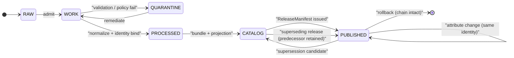

<!-- [KFM_META_BLOCK_V2]
doc_id: kfm://doc/<TODO: assign UUID via control_plane/document_registry.yaml>
title: Continuity Inventory — Settlements & Infrastructure
type: standard
version: v1.1
status: draft
owners: <TODO: Settlements/Infrastructure domain steward; verify against CODEOWNERS>
created: 2026-05-19
updated: 2026-06-07
policy_label: public
related:
  - ai-build-operating-contract.md                     # canonical operating contract, CONTRACT_VERSION = "3.0.0"
  - docs/domains/settlements-infrastructure/README.md   # NEEDS VERIFICATION: presence
  - docs/domains/settlements-infrastructure/ARCHITECTURE.md
  - docs/domains/settlements-infrastructure/CANONICAL_PATHS.md
  - docs/registers/VERIFICATION_BACKLOG.md
  - docs/standards/PROV.md                              # naming variance vs PROVENANCE.md (Directory Rules §18.b OPEN-DR-01)
  - docs/atlases/KFM_Domains_Culmination_Atlas_v1_1.pdf # PROPOSED placement per Directory Rules §5/§6.1
  - docs/adr/ADR-0001-schema-home.md                    # NEEDS VERIFICATION: presence
tags: [kfm, settlements, infrastructure, continuity, identity, supersession, temporal]
notes:
  - "CONTRACT_VERSION = \"3.0.0\" — doctrine-adjacent doc; operating-contract pin carried."
  - "Identity-thread inventory for Settlements/Infrastructure entities; doctrinal anchor: [DOM-SETTLE], [ENCY], [DIRRULES], [DDD]."
  - "Implementation maturity for every entity is UNKNOWN/NEEDS VERIFICATION pending mounted-repo inspection."
  - "Schema-home is CONFLICTED: [ENCY] §7.12 / Atlas §24.13 use schemas/contracts/v1/settlement/ (singular); Directory Rules §4/§12 use schemas/contracts/v1/domains/settlements-infrastructure/. ADR-class per §2.4(5). See Q5."
[/KFM_META_BLOCK_V2] -->

# Continuity Inventory — Settlements & Infrastructure

> Identity-thread register for the entities the **Settlements / Infrastructure** lane carries through time — what makes “the same settlement,” “the same asset,” “the same network” across renames, status changes, rebuilds, operator changes, and policy transitions.

[](#)
[](#)
[](#)
[](#)
[](#)
[](#)
[](#)
[](#)

**Status:** draft · **Owners:** `<TODO: Settlements/Infrastructure steward — verify CODEOWNERS>` · **Last updated:** 2026-06-07 · **Contract:** `CONTRACT_VERSION = "3.0.0"`

-----

## Quick Jump

- [1. Purpose & scope](#1-purpose--scope)
- [2. Continuity, defined](#2-continuity-defined)
- [3. Identity-thread inventory](#3-identity-thread-inventory)
- [4. Temporal axes preserved per thread](#4-temporal-axes-preserved-per-thread)
- [5. Supersession & rename rules](#5-supersession--rename-rules)
- [6. Continuity events & state transitions](#6-continuity-events--state-transitions)
- [7. Cross-lane continuity boundaries](#7-cross-lane-continuity-boundaries)
- [8. Sensitivity & publication posture](#8-sensitivity--publication-posture)
- [9. Stale-state markers & required action](#9-stale-state-markers--required-action)
- [10. Operational implications](#10-operational-implications)
- [11. Governed-AI behavior](#11-governed-ai-behavior)
- [12. Validators, tests, fixtures (PROPOSED)](#12-validators-tests-fixtures-proposed)
- [13. Open questions & verification backlog](#13-open-questions--verification-backlog)
- [14. Related docs](#14-related-docs)

-----

## 1. Purpose & scope

CONFIRMED doctrine / PROPOSED domain application: this document is the **identity-and-continuity register** for entities owned by the Settlements / Infrastructure lane. It exists so that a settlement, municipality, infrastructure asset, network, or operator that changes name, status, jurisdiction, geometry, condition, or owner can still be **distinguished, matched, audited, and rolled back** as the same thread through time — without collapsing observed source state into release state. [DOM-SETTLE] [ENCY] [DIRRULES] [DDD]

> [!IMPORTANT]
> Continuity is an **identity** property, not a publication promise. A settlement may have an unbroken identity thread and still be **stale**, **restricted**, **denied**, or **superseded** in PUBLISHED surfaces. This file does not authorize public exposure; release state, sensitivity tier, and rights remain governed by [ENCY] and [DIRRULES].

### 1.1 What this inventory covers

CONFIRMED scope (from the Settlements/Infrastructure dossier, Atlas Ch. 14 §B): `Settlement`, `Municipality`, `CensusPlace`, `Townsite`, `GhostTown`, `Fort`, `Mission`, `ReservationCommunity`, `Infrastructure Asset`, `Network Node`, `Network Segment`, `Facility`, `Service Area`, `Operator`, `Condition Observation`, `Dependency`. [DOM-SETTLE] [ENCY]

### 1.2 What it does **not** cover

CONFIRMED non-ownership boundary: this inventory does **not** track identity threads owned by other lanes — transport routes (Roads/Rail), water evidence (Hydrology), hazard events and warnings (Hazards), ownership and living-person privacy (People/Land), cultural-period and site identity (Archaeology). Where a Settlements/Infrastructure thread cites or composes those threads, the citation must preserve owning-lane authority. [DOM-SETTLE] [ENCY]

-----

## 2. Continuity, defined

CONFIRMED doctrine (Domain-Driven Design reference, adopted): an entity is “an object distinguished by a thread of identity that runs through time and often across distinct representations.” Keeping the class focused on **life-cycle continuity and identity** — and defining “what it means to be the same thing” — is the governing test; mistaken identity corrupts data. [DDD]

For this lane, three levels of continuity are tracked. Examples below are **illustrative**, not sourced from specific Kansas records.

|Level                  |Question it answers                                                    |Illustrative example                                                                                          |
|-----------------------|-----------------------------------------------------------------------|--------------------------------------------------------------------------------------------------------------|
|**Identity continuity**|Is this the same entity as before?                                     |A townsite recorded in 1880 and the same townsite mapped in 2020 are one thread, even if its name has changed.|
|**Role continuity**    |Is the entity playing the same role in the system?                     |A water utility that changes operator but continues to serve the same Service Area.                           |
|**Evidence continuity**|Does the evidence trail survive correction, supersession, and rollback?|An EvidenceBundle replaced by a corrected bundle that retains the prior bundle for audit. [ENCY §24.8.2]      |


> [!NOTE]
> Identity continuity ≠ attribute stability. A Townsite may change name, post-office status, population, and even jurisdiction while preserving identity. The PROPOSED deterministic identity basis for objects in this lane is **source id + object role + temporal scope + normalized digest**, with `source`, `observed`, `valid`, `retrieval`, `release`, and `correction` times kept distinct where material. [DOM-SETTLE]

-----

## 3. Identity-thread inventory

**Label posture for this section.** Owned object families are CONFIRMED in the dossier. The **Continuity thread** and **Allowed attribute drift** columns are INFERRED working interpretations of the dossier’s ubiquitous-language definitions, offered for steward review. The **Identity rule** column reflects the CONFIRMED general form (`source id + object role + temporal scope + normalized digest`) with PROPOSED per-family realizations; concrete field realizations, schema homes, hashing canonicalization, and validators remain PROPOSED pending mounted-repo verification. [DOM-SETTLE] [ENCY] [DIRRULES]

|# |Object family            |Continuity thread (what stays “the same”)                                                                                               |Allowed attribute drift                                                           |Identity rule (PROPOSED)                                                                                        |
|--|-------------------------|----------------------------------------------------------------------------------------------------------------------------------------|----------------------------------------------------------------------------------|----------------------------------------------------------------------------------------------------------------|
|1 |**Settlement**           |A populated or formerly populated place — a community of people anchored to a location — through name, status, and jurisdiction changes.|name, alternate names, population, post-office status, jurisdiction, legal status.|source id + `settlement` role + temporal scope + normalized digest.                                             |
|2 |**Municipality**         |A legally incorporated entity through annexations, charter changes, name changes, and classification transitions.                       |boundary geometry (with version), name, classification, charter.                  |source id + `municipality` role + temporal scope + normalized digest; legal-status event chain.                 |
|3 |**CensusPlace**          |A Census-defined geography (incorporated place, CDP) through decennial geometry refreshes.                                              |geometry vintage, place codes, population.                                        |source id + `census_place` role + temporal scope + normalized digest; bound to source vintage.                  |
|4 |**Townsite**             |A platted or recorded townsite footprint, including townsites whose populations are gone.                                               |survival status, current population, post-office presence.                        |source id + `townsite` role + temporal scope + normalized digest.                                               |
|5 |**GhostTown**            |A formerly populated place persisting as a historical and spatial reference after settlement function lapsed.                           |present-day visibility, monument presence, naming.                                |source id + `ghost_town` role + temporal scope + normalized digest.                                             |
|6 |**Fort**                 |A military or fortified post, active or historical, including reused or decommissioned sites.                                           |active / decommissioned state, current land use.                                  |source id + `fort` role + temporal scope + normalized digest.                                                   |
|7 |**Mission**              |A religious mission settlement, including those that became towns or were abandoned.                                                    |active / historical state, ecclesiastical jurisdiction.                           |source id + `mission` role + temporal scope + normalized digest.                                                |
|8 |**ReservationCommunity** |A community on or affiliated with a reservation — held with explicit sovereignty deference.                                             |community boundary, services.                                                     |source id + `reservation_community` role + temporal scope + normalized digest; sovereignty review path required.|
|9 |**Infrastructure Asset** |A specific asset (bridge, water tower, plant) through rebuilds, ownership transfers, and condition cycles.                              |structure (after rebuild in place), operator, condition.                          |source id + `infrastructure_asset` role + temporal scope + normalized digest.                                   |
|10|**Network Node**         |A node in a service network (substation, pump station, junction) through equipment refresh.                                             |equipment, capacity, name.                                                        |source id + `network_node` role + temporal scope + normalized digest.                                           |
|11|**Network Segment**      |A segment between two nodes (pipe, line, conductor) through replacement-in-place.                                                       |material, capacity, rated condition.                                              |source id + `network_segment` role + temporal scope + normalized digest.                                        |
|12|**Facility**             |A bounded operational facility (depot, plant, station) through expansion, mothballing, and reactivation.                                |operator, capability, footprint.                                                  |source id + `facility` role + temporal scope + normalized digest.                                               |
|13|**Service Area**         |A polygon of who is served by a given service through boundary redraws.                                                                 |boundary, service category.                                                       |source id + `service_area` role + temporal scope + normalized digest; bound to operator-at-time.                |
|14|**Operator**             |An organization operating a network, facility, or service through mergers, divestitures, and rebrands.                                  |name, contact, ownership.                                                         |source id + `operator` role + temporal scope + normalized digest.                                               |
|15|**Condition Observation**|An observed condition at a specific time — immutable once admitted.                                                                     |none after admission; superseded by a new observation.                            |source id + `condition_observation` role + observation time + normalized digest.                                |
|16|**Dependency**           |A directed dependency between two infrastructure entities through reconfiguration.                                                      |criticality, direction, mediation.                                                |source id + `dependency` role + temporal scope + normalized digest; preserves both endpoints.                   |


> [!CAUTION]
> Do **not** treat the **Identity rule** column as a contract definition. Treat `contracts/domains/settlements-infrastructure/` (PROPOSED home) as the authority once authored, and the §12 schema home (CONFLICTED placement, see Q5) as the machine-checkable shape. The seven canonical source roles (`observed | regulatory | modeled | aggregate | administrative | candidate | synthetic`) are fixed at admission and never upcast — the per-family `role` tokens above are object roles, not source roles. [DIRRULES] [ENCY]

[↑ back to top](#continuity-inventory--settlements--infrastructure)

-----

## 4. Temporal axes preserved per thread

CONFIRMED doctrine: `source`, `observed`, `valid`, `retrieval`, `release`, and `correction` times stay distinct where material. Collapsing axes is the most common identity-corruption failure in this lane (e.g., backdating a 2020-retrieval to an 1880-valid-time window). [DOM-SETTLE] [ENCY]

|Axis               |What it means                                                                   |Why it matters here                                                                             |
|-------------------|--------------------------------------------------------------------------------|------------------------------------------------------------------------------------------------|
|**source time**    |The time stated by the source (e.g., publication date, survey date).            |Resolves provenance and edition.                                                                |
|**observed time**  |When the underlying phenomenon was observed (e.g., a survey crew on the ground).|Drives the historical-vs-current distinction.                                                   |
|**valid time**     |The interval over which a claim is asserted to hold.                            |Required for legal-status windows (charter dates), occupancy intervals, decommissioning windows.|
|**retrieval time** |When KFM pulled the source.                                                     |Drives source-freshness staleness.                                                              |
|**release time**   |When KFM PUBLISHED a derivative.                                                |Anchors ReleaseManifest and the rollback chain.                                                 |
|**correction time**|When a CorrectionNotice supersedes an earlier release.                          |Required to distinguish “stale” from “wrong.” [ENCY] [DIRRULES]                                 |


> [!TIP]
> When in doubt, **add an axis; do not merge axes**. A Townsite founded 1872, observed by a survey in 1875, captured in a 1959 USGS quad, retrieved by KFM in 2026-05, and released in 2026-Q3 has five distinct timestamps, and they are not interchangeable.

-----

## 5. Supersession & rename rules

CONFIRMED doctrine: supersession is a **lineage transition**, not a deletion. A superseding object retains a `superseded_by` (or equivalent lineage link) to its predecessor; the predecessor remains queryable for time-bound claims and audit. [ENCY §24.8.2] [DIRRULES §14]

### 5.1 Rename and identity-change matrix

A rename that does **not** change identity is an attribute change recorded in the entity’s history. A rename that **does** change identity is a content change, not a placement change, and follows the Directory Rules contract: ADR, schema-version bump if shape is affected, compatibility map for fixtures, parity tests, and correction notices for any released artifact that referenced the old identity. [DIRRULES §14]

The change types below are illustrative; each row is a working interpretation pending steward review and ADR resolution.

|Change (illustrative)                                                 |Continuity treatment                                                                                                     |
|----------------------------------------------------------------------|-------------------------------------------------------------------------------------------------------------------------|
|A townsite renamed but with continuous community.                     |Attribute change; alias retained; identity preserved.                                                                    |
|Two adjacent townsites merging into one municipality.                 |New Municipality identity; both predecessor townsites retained with `superseded_by` links.                               |
|Municipality re-incorporation as a new legal entity.                  |New Municipality identity; predecessor retained; legal-status event chain documents discontinuity.                       |
|Ghost-towning of an active settlement.                                |Same Settlement identity; status transition event; downstream consumers MAY surface a stale-state marker.                |
|Infrastructure rebuild on the same footprint.                         |Same Infrastructure Asset identity; condition history continues; rebuild event recorded.                                 |
|Asset replaced by a structurally different asset at the same location.|New Infrastructure Asset identity; predecessor retained with `superseded_by`.                                            |
|Operator merger.                                                      |New Operator identity (PROPOSED); both predecessor Operators retained; Service Area continuity preserved across the join.|

### 5.2 Required artifacts per supersession

CONFIRMED doctrine, drawn from the v1.1 Atlas §24.8.2 supersession-lineage reference (verbatim object-class rules). [ENCY] [DIRRULES]

|Object class                             |Supersession rule                                                        |Required lineage artifact                                 |
|-----------------------------------------|-------------------------------------------------------------------------|----------------------------------------------------------|
|`SourceDescriptor`                       |Replaced by a newer descriptor; old retained with `superseded_by`.       |Supersession entry in source register.                    |
|`EvidenceBundle`                         |Replaced when corrected; old bundle retained for audit.                  |`EvidenceBundle` + `CorrectionNotice` + supersession link.|
|`GeographyVersion`                       |Replaced by a newer version; both remain queryable for time-bound claims.|Version register entry + crosswalk.                       |
|Schema (under `schemas/contracts/v1/...`)|Replaced via ADR; old schema retained.                                   |ADR + supersession link in schema header.                 |
|`Policy`                                 |Replaced via accepted ADR; old policy retained.                          |ADR + supersession link.                                  |
|`ReleaseManifest`                        |Replaced by next release; rollback target remains valid.                 |Manifest history + rollback chain.                        |
|`AIReceipt`                              |Never superseded retroactively; new answer is a new receipt.             |Two distinct `AIReceipt`s with cross-reference.           |

[↑ back to top](#continuity-inventory--settlements--infrastructure)

-----

## 6. Continuity events & state transitions

CONFIRMED doctrine (DDD *Domain Events*): state changes of identity-bearing entities SHOULD be modeled as **domain events** — “something happened that domain experts care about,” modeled as discrete, immutable records carrying a timestamp for when the event occurred and the identity of the entities involved. [DDD] [ENCY]

### 6.1 Continuity event catalog (PROPOSED)

|Event family                             |Triggers a …                                              |Notes                                             |
|-----------------------------------------|----------------------------------------------------------|--------------------------------------------------|
|`settlement.founded`                     |new Settlement identity.                                  |observed/valid time required.                     |
|`settlement.renamed`                     |attribute change; alias retained.                         |identity preserved.                               |
|`settlement.status_changed`              |attribute change (e.g., active → ghost).                  |downstream UI may add stale-state badge.          |
|`municipality.incorporated`              |new Municipality identity.                                |legal-status event chain entry required.          |
|`municipality.annexed`                   |Municipality `GeographyVersion` change.                   |rebind dependent Service Areas.                   |
|`municipality.dissolved`                 |terminal event; identity retained for audit.              |downstream Service Areas may need rebinding.      |
|`asset.commissioned`                     |new Infrastructure Asset identity.                        |condition history begins.                         |
|`asset.rebuilt_in_place`                 |attribute change; identity preserved.                     |optional condition reset event.                   |
|`asset.replaced`                         |new Infrastructure Asset identity; predecessor superseded.|both retained.                                    |
|`asset.decommissioned`                   |terminal event; identity retained for audit.              |                                                  |
|`network.reconfigured`                   |Network Segment additions or removals.                    |Dependency relations may rebind.                  |
|`operator.merged` / `operator.divested`  |new Operator identity.                                    |Service-Area continuity preserved across the join.|
|`condition.observed`                     |immutable observation.                                    |never superseded retroactively.                   |
|`dependency.added` / `dependency.removed`|Dependency identity transitions.                          |criticality history retained.                     |

### 6.2 Lifecycle diagram



> [!NOTE]
> The diagram reflects the CONFIRMED `RAW → WORK/QUARANTINE → PROCESSED → CATALOG/TRIPLET → PUBLISHED` chain ([DIRRULES] [DOM-SETTLE]). The `PUBLISHED → PUBLISHED` self-loop is the attribute-only update path that does **not** mint a new identity; the `PUBLISHED → CATALOG → PUBLISHED` branch is the supersession path. **NEEDS VERIFICATION**: concrete state-machine implementation, dashboards, and run-receipt emission against a mounted repo.

[↑ back to top](#continuity-inventory--settlements--infrastructure)

-----

## 7. Cross-lane continuity boundaries

CONFIRMED doctrine: cross-lane relations must preserve ownership, source role, sensitivity, and EvidenceBundle support; this lane never overrides another lane’s identity authority. [DOM-SETTLE] [ENCY §24.4]

|When this lane cites …                                                |Owning lane     |Continuity rule                                                                                                                                                        |
|----------------------------------------------------------------------|----------------|-----------------------------------------------------------------------------------------------------------------------------------------------------------------------|
|Roads/Rail nodes (depots, crossings, bridges as transport facilities).|Roads/Rail.     |Network-node identity is owned by Roads/Rail; the Facility (e.g., depot) identity is settlement-owned. [DOM-ROADS] [DOM-SETTLE]                                        |
|Hydrology water, wastewater, stormwater, floodplain, drainage context.|Hydrology.      |Water-evidence identity stays with Hydrology; the Service Area or Dependency citing it remains settlement-owned.                                                       |
|Hazards exposure, resilience, warnings, and declarations.             |Hazards.        |Hazard-event identity stays with Hazards; the Critical Infrastructure exposure record uses both identities. KFM is **never** an alert authority (T4 forever). [DOM-HAZ]|
|People/Land residence, ownership, parcel, and migration context.      |People/Land.    |Living-person and parcel identity stay with People/Land (T4); settlement identity bounds residence context with restrictions. [DOM-PEOPLE]                             |
|Archaeology cultural temporal periods and survey context.             |Archaeology.    |Cultural-period identity stays with Archaeology; precise site coordinates remain denied by default (T4). [DOM-ARCH]                                                    |
|Frontier Matrix Settlement Status as a county-year panel cell.        |Frontier Matrix.|Matrix owns the panel cell + `MatrixCellReceipt`; this lane feeds the underlying evidence, never the cell. [ENCY]                                                      |

-----

## 8. Sensitivity & publication posture

CONFIRMED / PROPOSED: identity threads in this lane carry a default sensitivity tier; continuity treatment does **not** alter the tier without a steward review and a `PolicyDecision`. Tiers follow the master T0–T4 scheme (Atlas §24.5.1–§24.5.2). [DOM-SETTLE] [ENCY] [DIRRULES]

|Thread                                           |Default tier (PROPOSED)                              |Why                                                                                     |
|-------------------------------------------------|-----------------------------------------------------|----------------------------------------------------------------------------------------|
|Settlement, Municipality, CensusPlace, GhostTown.|**T0**                                               |Public legal-status / census identity (Atlas §24.4).                                    |
|Townsite, Fort, Mission.                         |**T0 / T1**                                          |Historic; precise coordinates may be restricted where an archaeology footprint overlaps.|
|ReservationCommunity.                            |**T1 / review-required**                             |Sovereignty deference; review state required; never household/parcel detail.            |
|Infrastructure Asset (critical), Facility.       |**T4** critical detail; **T1** generalized footprint.|Security-sensitive (Atlas §24.5.2).                                                     |
|Network Node, Network Segment.                   |**T4** critical topology.                            |Operator-sensitive; network exposure compounds risk.                                    |
|Service Area (aggregate).                        |**T1 / T2**                                          |Aggregate boundary; underlying customer detail belongs to People/Land.                  |
|Operator (identity).                             |**T0 / T1** name; T2/T3 internal.                    |Operator name is public; internal contact and credentials are not.                      |
|Condition Observation.                           |**T4** raw; T3 to named authorities only.            |Inspection/vulnerability detail; never T0/T1 (Atlas §24.5.2).                           |
|Dependency.                                      |**T4**                                               |Dependency graphs leak attack surface; defaults denied.                                 |


> [!WARNING]
> Continuity bookkeeping does **not** weaken sensitivity. A redacted/generalized PUBLISHED footprint and a restricted internal-review footprint are two different release artifacts sharing one identity thread. Conflating them would collapse the trust membrane. Tier upgrade toward public is two-key (transform receipt + review); downgrade to T4 is one-key (`CorrectionNotice` + `ReviewRecord`) (Atlas §24.5.3). [GAI] [ENCY]

-----

## 9. Stale-state markers & required action

CONFIRMED doctrine (Atlas v1.1 §24.8.1 stale-state register, verbatim markers), applied to this lane. KFM separates **stale** (aged past declared tolerance) from **wrong** (incorrect substance); both states have visible markers and traceable lifecycles. [ENCY] [DIRRULES]

|Marker                    |Triggered by                                                                               |UI signal                                        |Action for this lane                                                                                                                      |
|--------------------------|-------------------------------------------------------------------------------------------|-------------------------------------------------|------------------------------------------------------------------------------------------------------------------------------------------|
|Source freshness expired  |`SourceDescriptor` cadence passed without re-admission.                                    |Stale-source badge in Evidence Drawer.           |Re-admit (TIGER vintage, GNIS edition, operator feed) or supersede; otherwise mark dependent Settlement/Municipality/Network claims stale.|
|Schema version drift      |Object schema upgraded past the published claim.                                           |Schema-drift badge; show migration ADR.          |Migrate, re-validate, re-release; or mark stale. Schema home is CONFLICTED — see Q5.                                                      |
|Geography version drift   |`GeographyVersion` replaced; claim still bound to prior version.                           |Geography-version banner with prior-version cite.|Rebind boundaries (annexation, CensusPlace vintage) and re-release; or mark stale.                                                        |
|Time-scope outside support|Claim’s temporal scope falls outside the current data-support window.                      |Time-out-of-support indicator.                   |Mark stale; do not refresh silently.                                                                                                      |
|Model version superseded  |`ModelRunReceipt` references an older model than current.                                  |Model-version badge with new model identity.     |Re-run; supersede; or mark stale.                                                                                                         |
|Review aged out           |`ReviewRecord` older than tolerance for the sensitive lane (e.g., critical infrastructure).|Review-aged badge.                               |Trigger steward review; potentially downgrade tier.                                                                                       |
|Rights status changed     |Rights change in `SourceDescriptor` (operator feed, KDOT, FEMA).                           |Rights-changed badge.                            |Re-evaluate tier; potentially downgrade; emit `CorrectionNotice` if necessary.                                                            |
|Policy version changed    |Policy referenced by `PolicyDecision` superseded.                                          |Policy-version badge.                            |Re-run gate; potentially supersede release.                                                                                               |

-----

## 10. Operational implications

PROPOSED domain viewing-product behaviors. The viewing products themselves are PROPOSED in the dossier; the cross-cutting affordances (Evidence Drawer, time-aware state, trust badges, sensitivity-redacted view, correction/stale-state view, governed Focus Mode) are CONFIRMED doctrine and apply uniformly. [DOM-SETTLE] [MAP-MASTER] [GAI]

- **Current settlement view** SHOULD render the current identity with a time slider that respects valid-time intervals and surfaces alias history.
- **Historic townsite view** SHOULD render the footprint at observed-time, with a stale-source badge if no recent admission.
- **Legal-status-event view** SHOULD chain incorporation, annexation, name changes, and dissolution along a single Municipality identity.
- **Census-place comparison** SHOULD bind each CensusPlace to its decennial `GeographyVersion` and refuse silent rebinding.
- **Public-safe asset view** SHOULD show generalized footprint only; precise critical-asset detail stays in the restricted internal-review surface.
- **Service-area aggregate view** SHOULD remain rebinding-tolerant across Operator merges via the operator continuity chain.
- **Dependency-summary view** SHOULD redact criticality and topology by default; full graphs are restricted internal-review surfaces.
- **Restricted internal-review view** SHOULD carry steward audit and never appear in the normal public path. [GAI] [ENCY]

> [!IMPORTANT]
> This lane does **not** author its own cross-cutting affordances. Evidence Drawer, time-aware state, trust badges, sensitivity-redacted view, correction/stale-state view, and governed Focus Mode belong to the MapLibre / Governed AI doctrine and are reused, not redefined. MapLibre is the sole browser renderer (`packages/maplibre-runtime/`; Cesium retired per Directory Rules v1.3). [MAP-MASTER] [GAI]

-----

## 11. Governed-AI behavior

CONFIRMED doctrine / PROPOSED implementation: an AI surface MAY summarize released Settlements/Infrastructure `EvidenceBundle`s, compare evidence across editions or supersessions, explain limitations, and draft steward-review notes. It MUST `ABSTAIN` when evidence is insufficient and `DENY` where policy, rights, sensitivity, or release state blocks the request. AI never reads RAW/WORK content and is never root truth; every Focus Mode answer carries an `AIReceipt`. [GAI] [DOM-SETTLE] [ENCY]

For continuity questions specifically:

- A question like “is this the same town as before?” is answered by **resolving the identity thread**, not by inferring sameness from name similarity.
- A question about **historic critical-infrastructure detail** defaults to `DENY` unless the steward-reviewed public-safe artifact carries the requested level of detail.
- A question that depends on an aged source SHOULD return a stale-state-aware answer (`SOURCE_STALE` / `ABSTAIN`), not a confident assertion. [ENCY]

-----

## 12. Validators, tests, fixtures (PROPOSED)

PROPOSED test suite for this lane (drawn from [DOM-SETTLE] §K and [ENCY]). Concrete validator presence, test paths, and CI wiring are **UNKNOWN** until verified against a mounted repo. [DIRRULES]

<details>
<summary><b>Tests this inventory implies (PROPOSED)</b></summary>

- **Legal-municipality evidence tests** — confirm a Municipality identity is only minted when legal-status evidence supports it. [DOM-SETTLE]
- **Census-vs-municipality distinction tests** — a CensusPlace identity does **not** silently become a Municipality identity. [DOM-SETTLE]
- **Infrastructure topology tests** — Network Node + Network Segment graph invariants under reconfiguration. [DOM-SETTLE]
- **Condition `observed_at` tests** — Condition Observations are immutable and time-bound. [DOM-SETTLE]
- **Restricted-geometry no-leak tests** — generalized footprints never carry precise geometry through the public pipeline; style-only hiding fails the test. [DOM-SETTLE]
- **Catalog / proof / release closure tests** — `EvidenceBundle` resolves; `ReleaseManifest` references a valid rollback target. [DOM-SETTLE] [ENCY]
- **Supersession-link parity tests** — every superseding object resolves its predecessor (`superseded_by`). [ENCY §24.8.2]
- **Rename-without-identity-change parity tests** — a Settlement rename retains identity, aliases, and prior-name searchability. [DDD] [DIRRULES §14]
- **Negative-state coverage** — every validator exercises `DENY` / `ABSTAIN` / `ERROR` / `FAIL`, not only the pass path. [ENCY]

PROPOSED fixture homes (paths NEEDS VERIFICATION against Directory Rules and a mounted repo):

```text
schemas/contracts/v1/domains/settlements-infrastructure/   # PROPOSED schema home (Directory Rules §6.4)
                                                           #   CONFLICTED with [ENCY] §7.12 / Atlas §24.13 short form
                                                           #   schemas/contracts/v1/settlement/ — see Q5
contracts/domains/settlements-infrastructure/              # PROPOSED contract home (Directory Rules §6.3)
policy/sensitivity/infrastructure/                         # PROPOSED policy home (Atlas §24.13)
policy/domains/settlements-infrastructure/                 # PROPOSED policy home (Directory Rules §6.5)
tests/domains/settlements-infrastructure/                  # PROPOSED test home (Directory Rules §6.6)
fixtures/domains/settlements-infrastructure/               # PROPOSED fixture home (valid/ + invalid/)
```

</details>

[↑ back to top](#continuity-inventory--settlements--infrastructure)

-----

## 13. Open questions & verification backlog

|# |Item                                                                                                                                                                                |Resolution path                                                                |Status                             |
|--|------------------------------------------------------------------------------------------------------------------------------------------------------------------------------------|-------------------------------------------------------------------------------|-----------------------------------|
|Q1|Concrete identity-hash canonicalization for each object family (JCS+SHA-256 corpus convention `jcs:sha256:<hex>` vs. lane-specific extension).                                      |Schema + contract authoring; ADR if cross-lane impact.                         |NEEDS VERIFICATION                 |
|Q2|Whether Operator-merger continuity is modeled as `superseded_by` only or also via a `merged_with` relation.                                                                         |ADR — affects Service-Area binding history.                                    |UNKNOWN                            |
|Q3|Whether `ReservationCommunity` continuity events require steward sign-off before public surfacing.                                                                                  |Policy + `ReviewRecord` schema; sovereignty review per [DOM-ARCH]/[DOM-PEOPLE].|NEEDS VERIFICATION                 |
|Q4|Whether Infrastructure-Asset rebuild “in place” requires steward review (vs. attribute-only event).                                                                                 |Steward-policy ADR.                                                            |NEEDS VERIFICATION                 |
|Q5|**Schema-home conflict** — `schemas/contracts/v1/settlement/` ([ENCY] §7.12 / Atlas §24.13) vs. `schemas/contracts/v1/domains/settlements-infrastructure/` (Directory Rules §4/§12).|ADR (= ADR-S-01 in §24.12 backlog; ADR-0001 confirm-or-amend).                 |CONFLICTED — ADR-class per §2.4(5).|
|Q6|Validator exit-code contract dependency for any inventory-checker (`tools/validators/...`).                                                                                         |Tied to Directory Rules §18.b OPEN-DR-03.                                      |NEEDS VERIFICATION                 |
|Q7|Whether legal-status events chain into a single `LegalStatusEventStream` object family or remain per-object event histories.                                                        |Domain-modeling ADR.                                                           |UNKNOWN                            |
|Q8|Whether this file’s location (`docs/domains/settlements-infrastructure/CONTINUITY_INVENTORY.md`) conforms to the per-domain dossier convention.                                     |Directory Rules check; tied to OPEN-CP-01 slug variance.                       |NEEDS VERIFICATION                 |


> [!NOTE]
> Items Q1–Q8 are tracked for **triage**; resolutions migrate to `docs/registers/VERIFICATION_BACKLOG.md` or `docs/adr/` as appropriate. None may be silently closed by editing this file. [DIRRULES]

-----

## 14. Related docs

- `ai-build-operating-contract.md` — canonical operating contract; `CONTRACT_VERSION = "3.0.0"`.
- `docs/domains/settlements-infrastructure/README.md` — domain landing page (NEEDS VERIFICATION).
- `docs/domains/settlements-infrastructure/ARCHITECTURE.md` — domain architecture dossier.
- `docs/domains/settlements-infrastructure/CANONICAL_PATHS.md` — per-domain canonical-path registry.
- `docs/registers/VERIFICATION_BACKLOG.md` — central verification register.
- `docs/standards/PROV.md` — provenance standard (naming variance vs. `PROVENANCE.md` pending ADR — Directory Rules §18.b OPEN-DR-01).
- `docs/atlases/KFM_Domains_Culmination_Atlas_v1_1.pdf` — v1.1 Atlas, Chapter 14 (Settlements / Infrastructure) is the doctrinal anchor; §24.8 (stale-state/supersession) anchors §5/§9 of this file.
- `docs/doctrine/lifecycle-law.md`, `docs/doctrine/truth-posture.md`, `docs/doctrine/trust-membrane.md` — supporting doctrine roots (PROPOSED per Directory Rules §6.1).
- `docs/adr/ADR-0001-schema-home.md` — schema-home ADR governing `schemas/contracts/v1/...` placement.
- `contracts/domains/settlements-infrastructure/` — semantic contracts (PROPOSED home).
- `policy/sensitivity/infrastructure/` and `policy/domains/settlements-infrastructure/` — sensitivity policy (PROPOSED homes).
- `control_plane/object_family_register.yaml` — machine-readable object-family registry.

-----

## Changelog

|Version|Date      |Type (per contract §37)     |Change                                                                                                                                                                                                                                                                                                                                                                                                                                                                                                                                                                                                                                                                                                                                                                                                             |
|-------|----------|----------------------------|-------------------------------------------------------------------------------------------------------------------------------------------------------------------------------------------------------------------------------------------------------------------------------------------------------------------------------------------------------------------------------------------------------------------------------------------------------------------------------------------------------------------------------------------------------------------------------------------------------------------------------------------------------------------------------------------------------------------------------------------------------------------------------------------------------------------|
|v1     |2026-05-19|new                         |Initial continuity inventory; grounded in [DOM-SETTLE] / [ENCY] / [DIRRULES] / [DDD].                                                                                                                                                                                                                                                                                                                                                                                                                                                                                                                                                                                                                                                                                                                              |
|v1.1   |2026-06-07|reconciliation / gap closure|Pinned `CONTRACT_VERSION = "3.0.0"`; reconciled the slug from `settlements` to `settlements-infrastructure` (schema/contract/fixture homes) and flagged the schema-home as CONFLICTED (Q5, = ADR-S-01); tightened the §6 domain-event citation from `[INDEX-18]` to `[DDD]` Domain Events (verified verbatim) + Atlas; converted §5.2 to the verbatim Atlas §24.8.2 object-class table; completed the §9 stale-state table with the two missing canonical markers (time-scope-outside-support, model-version-superseded) and added the UI-signal column; reconciled §8 tiers to Atlas §24.5.2 (T4 critical detail/condition/dependency); added Archaeology and Frontier Matrix cross-lane rows; quoted all Mermaid stateDiagram transition labels (removed raw `\n` and unquoted parens) for GitHub-safe rendering.|


> **Backward compatibility.** H1, the back-to-top anchor, and all section numbers/anchors preserved. Material edits are the slug reconciliation (`settlements` → `settlements-infrastructure`), the schema-home CONFLICTED flag, and the completed stale-state table — each flagged inline.

-----

<sub>**Citation short-names used above:** `[DOM-SETTLE]` Settlements / Infrastructure dossier · `[ENCY]` KFM Encyclopedia · `[DIRRULES]` Directory Rules · `[MAP-MASTER]` MapLibre Master · `[GAI]` Governed AI dossier · `[DDD]` Domain-Driven Design Reference · `[DOM-ROADS]` Roads / Rail dossier · `[DOM-HAZ]` Hazards dossier · `[DOM-PEOPLE]` People / DNA / Land dossier · `[DOM-ARCH]` Archaeology dossier. Full ledger in the v1.1 Atlas §2.</sub>

-----

**Last updated:** 2026-06-07 · **Owners:** `<TODO: Settlements/Infrastructure domain steward>` · **Contract:** `CONTRACT_VERSION = "3.0.0"` · [↑ back to top](#continuity-inventory--settlements--infrastructure)