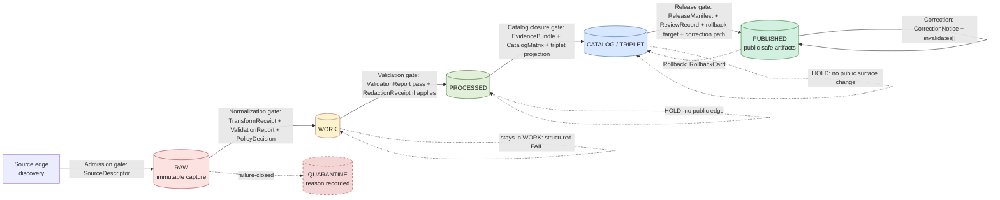
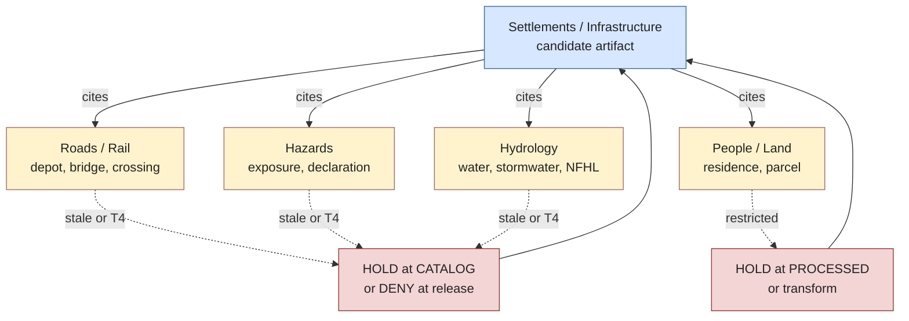

<!-- [KFM_META_BLOCK_V2]
doc_id: kfm://doc/settlements-infrastructure/data-lifecycle
title: Settlements & Infrastructure — Data Lifecycle
type: standard
version: v1.1
status: draft
owners: <TBD — settlements/infrastructure steward; release authority>
created: 2026-05-19
updated: 2026-06-07
policy_label: public
related:
  - ai-build-operating-contract.md            # canonical operating contract, CONTRACT_VERSION = "3.0.0"
  - docs/doctrine/lifecycle-law.md
  - docs/doctrine/directory-rules.md
  - docs/domains/settlements-infrastructure/README.md
  - docs/domains/settlements-infrastructure/ARCHITECTURE.md
  - docs/domains/settlements-infrastructure/CANONICAL_PATHS.md
  - docs/domains/settlements-infrastructure/CONTINUITY_INVENTORY.md
  - docs/atlases/domains-v1.1-ch14.md
  - data/README.md
  - release/README.md
tags: [kfm, domain, settlements, infrastructure, lifecycle, governance]
notes:
  - CONTRACT_VERSION = "3.0.0" — doctrine-adjacent doc; operating-contract pin carried.
  - Domain-specific operationalization of the universal RAW → PUBLISHED invariant.
  - Paths, validators, contracts, and schemas are PROPOSED until verified in a mounted repo.
  - Domain segment form (`settlements-infrastructure` vs `settlement`) is CONFLICTED — Directory Rules §4/§12 vs Atlas §24.13 / Encyclopedia §7.12. ADR-class per §2.4(5). See §11 OPEN-SI-01.
[/KFM_META_BLOCK_V2] -->

# Settlements & Infrastructure — Data Lifecycle

Governed `RAW → WORK / QUARANTINE → PROCESSED → CATALOG / TRIPLET → PUBLISHED` operationalization for the Settlements / Infrastructure lane, with the gates, receipts, sensitivity holds, and failure-closed outcomes that move (or refuse to move) an artifact from source-edge to public surface.

|Status      |Owners                                                                    |Contract                    |Last updated|
|------------|--------------------------------------------------------------------------|----------------------------|------------|
|draft · v1.1|`<TBD — settlements/infrastructure steward>` · `<TBD — release authority>`|`CONTRACT_VERSION = "3.0.0"`|2026-06-07  |

> [!IMPORTANT]
> This file is **domain doctrine for the settlements/infrastructure lane**. It does **not** assert that the live repository currently implements the paths, validators, contracts, schemas, or workflows referenced below. Repo-state items are labelled **PROPOSED**, **NEEDS VERIFICATION**, **CONFLICTED**, or **UNKNOWN** until inspected on a mounted repo. The doctrinal `RAW → PUBLISHED` invariant itself is **CONFIRMED**.

-----

## Contents

- [1. Scope and authority](#1-scope-and-authority)
- [2. What this lane owns (and explicitly does not)](#2-what-this-lane-owns-and-explicitly-does-not)
- [3. The lifecycle invariant for this lane](#3-the-lifecycle-invariant-for-this-lane)
- [4. Per-phase responsibilities and data paths](#4-per-phase-responsibilities-and-data-paths)
- [5. Lifecycle gates — required artifacts and failure-closed outcomes](#5-lifecycle-gates--required-artifacts-and-failure-closed-outcomes)
- [6. Receipt × phase matrix](#6-receipt--phase-matrix)
- [7. Sensitivity holds and the deny-default surface](#7-sensitivity-holds-and-the-deny-default-surface)
- [8. Cross-lane lifecycle interactions](#8-cross-lane-lifecycle-interactions)
- [9. Quarantine reasons specific to this lane](#9-quarantine-reasons-specific-to-this-lane)
- [10. Publication, correction, and rollback](#10-publication-correction-and-rollback)
- [11. Open questions and verification backlog](#11-open-questions-and-verification-backlog)
- [12. Related docs](#12-related-docs)

-----

## 1. Scope and authority

**Doc role.** Operationalize the KFM lifecycle invariant for the Settlements / Infrastructure domain lane. Read as a *companion to* — not a replacement for — the universal `docs/doctrine/lifecycle-law.md` and the per-domain chapter in `docs/atlases/domains-v1.1-ch14.md`.

**Authority ladder.**

1. **CONFIRMED doctrine.** `RAW → WORK / QUARANTINE → PROCESSED → CATALOG / TRIPLET → PUBLISHED`, promotion as a **governed state transition** (not a file move), failure-closed gates, the cite-or-abstain truth posture, and the deny-default posture for unresolved rights, sensitivity, or release state. Sources: Directory Rules §9; Domains Atlas v1.1 Ch. 14 §H; Encyclopedia / Atlas §24.6.1–§24.6.2. [`[DIRRULES]`](../../doctrine/directory-rules.md) [`[DOM-SETTLE]`](../../atlases/domains-v1.1-ch14.md) [`[ENCY]`](../../encyclopedia/README.md)
1. **CONFIRMED doctrine / PROPOSED implementation.** Per-domain lane application of the invariant to Settlements / Infrastructure, including object families, source families, sensitivity defaults, and cross-lane relations. Sources: Domains Atlas v1.1 Ch. 14 §A–§N.
1. **PROPOSED only.** Concrete repo paths, schema homes, validator IDs, route names, policy bundle locations, and CI workflow filenames. All path-bearing statements below carry an explicit label.

**Audience.** Domain stewards, ingest authors, validator authors, release authorities, AI reviewers, and downstream lane stewards (Roads/Rail, Hazards, Hydrology, People/Land) whose claims cite settlements / infrastructure evidence.

[↑ back to top](#settlements--infrastructure--data-lifecycle)

-----

## 2. What this lane owns (and explicitly does not)

> [!NOTE]
> Scope statements below are **CONFIRMED doctrine / PROPOSED field realization** from Domains Atlas v1.1 §14.B. The lane name in this document is hyphenated (`settlements-infrastructure`) to match the `docs/domains/` listing in Directory Rules §6.1; the domain segment under other responsibility roots (`schemas/`, `policy/`, `data/`, `release/`) is **CONFLICTED** between Directory Rules §4/§12 (`domains/settlements-infrastructure/`) and Atlas §24.13 (`settlement/`) — see [§11 OPEN-SI-01](#11-open-questions-and-verification-backlog).

### 2.1 Owned objects (CONFIRMED / PROPOSED)

`Settlement`, `Municipality`, `CensusPlace`, `Townsite`, `GhostTown`, `Fort`, `Mission`, `ReservationCommunity`, `InfrastructureAsset`, `NetworkNode`, `NetworkSegment`, `Facility`, `ServiceArea`, `Operator`, `ConditionObservation`, `Dependency`. (Atlas Ch. 14 §B, verbatim object set.)

### 2.2 Explicit non-ownership

|This lane does **not** own…                                |Lane that owns it    |Why it matters for lifecycle                                                                                                               |
|-----------------------------------------------------------|---------------------|-------------------------------------------------------------------------------------------------------------------------------------------|
|Transport routes, road and rail segments, route memberships|Roads / Rail         |A settlement-anchored depot or bridge **cites** Roads/Rail evidence; it does not promote on its behalf.                                    |
|Canonical water evidence, gauges, NFHL zones               |Hydrology            |Water-supply or stormwater dependencies **cite** Hydrology; quarantine if the cited claim is stale.                                        |
|Hazard events, warnings, declarations                      |Hazards              |Exposure and resilience overlays cite Hazards; never republish a hazard claim from this lane. KFM is never an alert authority (T4 forever).|
|Ownership, parcels, living-person privacy                  |People / Land        |Residence / migration context relations carry restrictions that may **block** settlements promotion (person-parcel join = T4).             |
|Archaeological / sacred site coordinates                   |Archaeology          |Historic-townsite / fort / mission footprints overlapping a known site use generalized geometry only after `[DOM-ARCH]` review.            |
|`ReviewRecord`, `PolicyDecision`, all receipt families     |Cross-cutting (§24.2)|This lane *emits and references* these governance objects but does not own their schema home.                                              |

[↑ back to top](#settlements--infrastructure--data-lifecycle)

-----

## 3. The lifecycle invariant for this lane

**CONFIRMED doctrine.** Promotion is a **governed state transition**, not a file move. A bytes-only move from one directory to another that bypasses validators, policy gates, EvidenceBundle creation, catalog closure, and the release decision is a **violation of the invariant** regardless of where the bytes ended up. (Directory Rules §9; Atlas §24.6.2 closure rules.)

**Reading note.** Dashed edges are failure-closed outcomes — the artifact does **not** advance. The Atlas v1.1 §14.H table marks every gate as PROPOSED for this lane’s implementation maturity; the diagram above renders the gates as doctrine, not as evidence of working code. Governed surfaces emit `ANSWER / ABSTAIN / DENY / ERROR`; promotion/release/correction gates may additionally `HOLD`; validators return `PASS / FAIL` (Atlas §24.3).

[↑ back to top](#settlements--infrastructure--data-lifecycle)

-----

## 4. Per-phase responsibilities and data paths

Per Directory Rules §4 Step 2–3 / §9, lifecycle phases live under `data/` with the **phase named explicitly**, and the domain appears as a segment *after* the phase (`data/<phase>/<domain>/`). Receipts, proofs, registry, and rollback sit **alongside** the phase directories — they do not replace them.

> [!NOTE]
> All `data/...` paths below are **PROPOSED** and follow the §4 Step 3 pattern `data/<phase>/<domain>/`. The literal domain segment (`settlements-infrastructure` vs `settlement`) is **CONFLICTED** — see [§11 OPEN-SI-01](#11-open-questions-and-verification-backlog). Note that the `data/<phase>/` family does **not** take a `domains/` sub-segment (confirmed verbatim in §4 Step 3).

|Phase                |Responsibility (this lane)                                                                                                                                                                                         |Allowed contents                                                                                      |MUST NOT                                                            |PROPOSED data path                                                                                                    |
|---------------------|-------------------------------------------------------------------------------------------------------------------------------------------------------------------------------------------------------------------|------------------------------------------------------------------------------------------------------|--------------------------------------------------------------------|----------------------------------------------------------------------------------------------------------------------|
|**RAW**              |Capture an immutable source payload or reference (Census TIGER tiles, GNIS extracts, KDOT bridge inventories, municipal records, gazetteers, etc.) with source role, rights, sensitivity, citation, time, and hash.|Source-edge captures; retrieval metadata; payload checksums                                           |Public clients; AI context; UI layers; normalized records           |`data/raw/<domain>/<source_id>/<run_id>/`                                                                             |
|**WORK**             |Normalize schema, geometry, time, identity, evidence, rights, and policy. Hold all unresolved candidates here, not in PROCESSED.                                                                                   |Normalized intermediates; candidate assertions; transform receipts                                    |Public API/UI; release aliases                                      |`data/work/<domain>/<run_id>/`                                                                                        |
|**QUARANTINE**       |Hold artifacts that failed normalization, validation, rights resolution, sensitivity classification, schema drift checks, or over-precise geometry checks. **Reason MUST be recorded.**                            |Failed inputs with `TransformReceipt`, `ValidationReport`, `PolicyDecision`, and a structured `reason`|Silent promotion; reason-less holds                                 |`data/quarantine/<domain>/<reason>/<run_id>/`                                                                         |
|**PROCESSED**        |Emit validated, normalized canonical records for this lane (Settlement, Municipality, InfrastructureAsset, …).                                                                                                     |Validated canonical records; resolvable `EvidenceRef`; `ValidationReport`; closed digests             |Public/release status assumption; uncited claims                    |`data/processed/<domain>/<dataset_id>/<version>/`                                                                     |
|**CATALOG / TRIPLET**|Emit catalog records (STAC/DCAT/PROV), domain catalog entries, EvidenceBundles, and graph/triplet projections needed for release.                                                                                  |`CatalogMatrix` entry; `EvidenceBundle`; triplet projections; release candidate                       |Canonical replacement semantics; uncited claims                     |`data/catalog/stac/`, `data/catalog/dcat/`, `data/catalog/prov/`, `data/catalog/domain/<domain>/`, `data/triplets/...`|
|**PUBLISHED**        |Serve released, public-safe artifacts through governed APIs and manifests (public asset views, service-area aggregates, current settlement view, historic townsite view, etc.).                                    |Release-tagged tiles/layers/payloads; signed manifests                                                |RAW/WORK/QUARANTINE bytes; exact restricted geometry; uncited claims|`data/published/layers/<domain>/`, `data/published/pmtiles/`, `data/published/api_payloads/`                          |

### 4.1 Receipts, proofs, registry, and rollback (emitted alongside)

|Concern                        |PROPOSED path                                                                                                                                 |Purpose                                                     |
|-------------------------------|----------------------------------------------------------------------------------------------------------------------------------------------|------------------------------------------------------------|
|Process receipts               |`data/receipts/{ingest,validation,pipeline,ai,release}/`                                                                                      |Run-level audit trail across phases                         |
|Evidence proofs                |`data/proofs/{evidence_bundle,proof_pack,validation_report,citation_validation}/`                                                             |Truth-bearing proof objects                                 |
|Rollback artifacts             |`data/rollback/<domain>/<release_id>/`                                                                                                        |Alias revert receipts, prior-release pointers               |
|Source/layer/dataset registries|`data/registry/sources/<domain>/`, `data/registry/layers/`, `data/registry/datasets/`, `data/registry/sensitivity/`                           |Append-only governance records                              |
|Release decisions              |`release/candidates/<domain>/`, `release/manifests/`, `release/promotion_decisions/`, `release/rollback_cards/`, `release/correction_notices/`|Release decision artifacts (distinct from `data/published/`)|

> [!IMPORTANT]
> **Two homes, one boundary.** `data/published/` holds released **artifacts** (the public-safe outputs). `release/` holds release **decisions** (manifests, proofs, signatures, rollback/correction). A `ReleaseManifest` does **not** live in `data/published/`; a published PMTiles file does **not** live in `release/`. Directory Rules §13.2. Receipt **schemas** live at `schemas/contracts/v1/receipts/` (ADR-S-03 governs any split).

[↑ back to top](#settlements--infrastructure--data-lifecycle)

-----

## 5. Lifecycle gates — required artifacts and failure-closed outcomes

**CONFIRMED doctrine** (Atlas §24.6.1 Pipeline Gate Reference; Directory Rules §9). The artifacts named below are the **minimum** required to clear each gate for this lane. Domain-specific additions (e.g., critical-infrastructure review) extend, never relax, these minimums.

|Gate (transition)                                      |Pre-condition                                                                                                                                                                                         |Required artifacts (minimum)                                                                        |Failure-closed outcome                                                            |
|-------------------------------------------------------|------------------------------------------------------------------------------------------------------------------------------------------------------------------------------------------------------|----------------------------------------------------------------------------------------------------|----------------------------------------------------------------------------------|
|**Admission** (— → `RAW`)                              |Source identity and rights minimally established; source-role intent is set (e.g., Census TIGER = `aggregate`/`administrative`; KDOT bridge inventory = `observed`; historical gazetteer = `context`).|`SourceDescriptor` (role, authority, rights, sensitivity, cadence); payload or reference **hash**.  |Source not admitted; logged as candidate awaiting steward.                        |
|**Normalization** (`RAW` → `WORK / QUARANTINE`)        |Schema, geometry, time, identity, evidence, rights, and policy rules are runnable.                                                                                                                    |`TransformReceipt`; `ValidationReport` (working set); `PolicyDecision`.                             |`QUARANTINE` with structured reason; **never silently promotes**.                 |
|**Validation** (`WORK` → `PROCESSED`)                  |Validators deterministic and tied to fixtures; required receipts present.                                                                                                                             |`ValidationReport` pass; `RedactionReceipt` if sensitivity applies; `AggregationReceipt` if applies.|Stay in `WORK`; structured FAIL outcome.                                          |
|**Catalog closure** (`PROCESSED` → `CATALOG / TRIPLET`)|`EvidenceRef`s resolve; catalog matrix and digests close.                                                                                                                                             |`CatalogMatrix` entry; `EvidenceBundle`; graph/triplet projections if applicable.                   |HOLD at `PROCESSED`; **no public edge**.                                          |
|**Release** (`CATALOG / TRIPLET` → `PUBLISHED`)        |Review state where required; **release authority distinct from original author** when materiality applies (Atlas §24.7).                                                                              |`ReleaseManifest`; rollback target; correction path; `ReviewRecord` (if required).                  |HOLD at `CATALOG`; **no public surface change**.                                  |
|**Correction** (`PUBLISHED` → `PUBLISHED'`)            |Detected error or new evidence; downstream derivatives identified.                                                                                                                                    |`CorrectionNotice`; `invalidates[]`; `ReviewRecord`.                                                |Public surface displays a stale/corrected badge; derivative invalidation cascades.|
|**Rollback** (`PUBLISHED` → prior release)             |Failed release or post-publication failure; targeted prior release identified.                                                                                                                        |`RollbackCard`; `CorrectionNotice`; `ReleaseManifest` reverts to prior release.                     |Held at current state until rollback validated.                                   |

> [!WARNING]
> **Critical-infrastructure materiality.** When the release surface touches critical infrastructure, utilities, bridge/condition/inspection details, operator-sensitive information, or exact vulnerable-facility geometry, the **release authority MUST be distinct from the original author** and `ReviewRecord` is **required**, not optional. Critical-asset detail and condition/vulnerability default to **T4** (Atlas §24.5.2); the public path is generalized footprint → T1 only via `RedactionReceipt` + review. (Atlas v1.1 §14.I, §24.5.2, §24.7.)

[↑ back to top](#settlements--infrastructure--data-lifecycle)

-----

## 6. Receipt × phase matrix

**CONFIRMED doctrine** (Atlas §24.2 Receipt Catalog; §24.6 closure rules). A `•` means the receipt is normally **emitted, amended, or referenced** at that phase. Receipts created earlier remain **referenced via `EvidenceRef`** at later phases — they are not duplicated. Receipt schema home: `schemas/contracts/v1/receipts/` (ADR-S-03).

|Receipt                    |RAW|WORK / QUARANTINE|PROCESSED|CATALOG / TRIPLET|PUBLISHED          |
|---------------------------|:-:|:---------------:|:-------:|:---------------:|:-----------------:|
|`SourceDescriptor`         |•  |•                |•        |•                |•                  |
|`TransformReceipt`         |   |•                |•        |•                |                   |
|`ValidationReport`         |   |•                |•        |•                |                   |
|`RedactionReceipt`         |   |•                |•        |•                |•                  |
|`AggregationReceipt`       |   |•                |•        |•                |•                  |
|`PolicyDecision`           |•  |•                |•        |•                |•                  |
|`ReviewRecord`             |   |•                |•        |•                |•                  |
|`ModelRunReceipt`          |   |•                |•        |•                |•                  |
|`RepresentationReceipt`    |   |                 |•        |•                |•                  |
|`AIReceipt`                |   |                 |         |•                |• (Focus Mode only)|
|`EvidenceBundle` (resolved)|   |                 |(built)  |•                |•                  |
|`ReleaseManifest`          |   |                 |         |•                |•                  |
|`CorrectionNotice`         |   |                 |         |•                |•                  |
|`RollbackCard`             |   |                 |         |•                |•                  |
|`RealityBoundaryNote`      |   |                 |•        |•                |•                  |

[↑ back to top](#settlements--infrastructure--data-lifecycle)

-----

## 7. Sensitivity holds and the deny-default surface

**CONFIRMED / PROPOSED** (Atlas v1.1 §14.I, §24.5.2). Within this lane, the following **default to restricted or review** and require an explicit `PolicyDecision = allow` plus `ReviewRecord` before any movement toward `PUBLISHED`:

- Critical infrastructure assets (water, wastewater, electric, gas, communications) — **T4** critical detail
- Utilities operational details — **T4**
- Condition observations (bridge inspections, asset condition reports) — **T4**; T3 to named authorities only
- Dependency relations between infrastructure assets — **T4**
- Operator-sensitive details (operator identities, contact, schedules) — **T2/T3**
- Exact facility geometry for vulnerable or restricted facilities — **T4**; T1 generalized footprint

> [!CAUTION]
> **Default-deny promotion posture.** Unclear rights, unresolved source role, missing evidence, unresolved sensitivity, or absent release state **blocks public promotion**. This is an invariant of the lane, not a recommendation. ([Encyclopedia](../../encyclopedia/README.md); [Directory Rules](../../doctrine/directory-rules.md).)

### 7.1 Public-safe transforms

When a sensitive observation is needed in a public surface, the path is **transform-then-release**, not release-then-redact. Tier upgrade toward public is two-key (transform receipt + `ReviewRecord`); downgrade to T4 is one-key (`CorrectionNotice` + `ReviewRecord`) (Atlas §24.5.3). Transforms include:

|Transform                                                               |Receipt emitted                            |Use case                           |
|------------------------------------------------------------------------|-------------------------------------------|-----------------------------------|
|Geometry generalization (e.g., to municipality or census-place centroid)|`TransformReceipt` + `RedactionReceipt`    |Exact-facility-geometry hold       |
|Field-level redaction (operator name, capacity, schedule)               |`RedactionReceipt`                         |Operator-sensitive details         |
|Aggregation to service-area or dependency-summary view                  |`AggregationReceipt`                       |Dependency relation publication    |
|Delayed release (embargo window)                                        |`ReviewRecord` referencing release calendar|Time-sensitive condition data      |
|Staged access (steward-only, then internal-review, then public)         |`PolicyDecision` chain                     |Cultural / archaeological adjacency|

> [!WARNING]
> Style-only hiding of sensitive geometry (e.g., `visibility: none` in the style JSON) is **not** an accepted redaction — the transform happens *before* tile production, not at render time. The restricted-geometry no-leak test exists to prove exact geometry cannot publish or render publicly. (Atlas §24.9.2.)

[↑ back to top](#settlements--infrastructure--data-lifecycle)

-----

## 8. Cross-lane lifecycle interactions

Settlements / Infrastructure features almost always **cite** evidence owned by another lane. The lifecycle implication: an artifact in this lane **cannot promote ahead of its cited claims**. Stale or quarantined cross-lane evidence holds the citing artifact back. (Atlas §24.4 Cross-Lane Relation Atlas.)

|Citing relation                                               |Lifecycle implication                                                                                                                                    |
|--------------------------------------------------------------|---------------------------------------------------------------------------------------------------------------------------------------------------------|
|Depot / bridge / crossing / transport facility on Roads / Rail|A depot artifact cannot reach `PUBLISHED` while the cited Roads/Rail evidence is in `WORK`, `QUARANTINE`, or carries a stale-source badge.               |
|Exposure / resilience to Hazards events                       |A resilience overlay holds at `PROCESSED` if the cited Hazards declaration was rolled back; a re-issued declaration requires a re-review.                |
|Water / wastewater / stormwater / floodplain to Hydrology     |A service-area view holds if the cited NFHL zone or gauge observation has been corrected and the new evidence has not been re-bound.                     |
|Residence / ownership / parcel relations to People / Land     |Living-person and parcel restrictions (person-parcel join = T4) can **force** a settlements artifact into the transform-then-release path or into denial.|

[↑ back to top](#settlements--infrastructure--data-lifecycle)

-----

## 9. Quarantine reasons specific to this lane

Quarantine is **never** silent. Each held artifact carries a structured `reason` recorded with its `TransformReceipt`, `ValidationReport`, and `PolicyDecision`. The following are PROPOSED lane-specific reasons; they extend the universal quarantine grammar (Atlas §24.6.3 reason-code catalog), they do not replace it.

<strong>Show domain-specific quarantine reasons (PROPOSED)</strong>

|Reason code (PROPOSED)              |Trigger                                                                                        |Typical resolution path                                                                              |
|------------------------------------|-----------------------------------------------------------------------------------------------|-----------------------------------------------------------------------------------------------------|
|`rights_unresolved`                 |Source rights or terms NEEDS VERIFICATION; sensitive joins fail closed.                        |Steward resolves rights; `SourceDescriptor` updated; re-run normalization.                           |
|`legal_status_ambiguous`            |A settlement claim mixes “legal municipality” and “census place” without distinguishing them.  |Reconcile against authority source (state legal record vs Census TIGER); split records.              |
|`census_vs_municipality_collision`  |The same geography is bound to a legal municipality and a census place under one ID.           |Re-key with object-role distinction (Atlas §14.E identity rule).                                     |
|`topology_invalid`                  |Network nodes or segments do not form valid topology after normalization.                      |Topology validator + fixture; correct or quarantine input.                                           |
|`condition_observation_undated`     |`observed_at` missing or unparseable on a `ConditionObservation`.                              |Recover timestamp from source; otherwise hold permanently.                                           |
|`restricted_geometry_precision`     |Geometry is more precise than the facility’s release tier permits.                             |Apply generalization transform; emit `RedactionReceipt`.                                             |
|`critical_infrastructure_unreviewed`|Critical-infrastructure surface is missing its required `ReviewRecord`.                        |Route to release authority queue.                                                                    |
|`operator_identity_disclosed`       |Operator-sensitive field would appear on a public-tier surface.                                |Field-level redaction or staged access.                                                              |
|`cross_lane_citation_stale`         |Cited evidence in another lane is `T4` (steward-only) or has been corrected without re-binding.|Re-bind to current evidence; re-run catalog closure.                                                 |
|`temporal_collision`                |Source/observed/valid/retrieval/release/correction times disagree in a material way.           |Resolve the timeline against the canonical source; record divergence in `EvidenceBundle.limitations`.|

> [!NOTE]
> Quarantined artifacts are **retained**, not deleted. Rejected joins — by analogy with KFM’s rejected-habitat-join doctrine — are stored with **method, confidence, reason, inputs, run receipt, and review state**, never silently dropped (idea card `KFM-P25-PROG-0020`). A rejected-join **review queue** exposing method, confidence, reason, and evidence references is the companion surface (`KFM-P25-FEAT-0004`). *(Both cards are habitat/fauna-scoped in the corpus; this lane applies the same pattern by analogy — a settlements-specific card is PROPOSED.)*

[↑ back to top](#settlements--infrastructure--data-lifecycle)

-----

## 10. Publication, correction, and rollback

**CONFIRMED doctrine / PROPOSED implementation** (Atlas v1.1 §14.M, §24.6, §24.8.2).

### 10.1 Publication

A settlements / infrastructure release reaching `PUBLISHED` requires **all** of:

1. `ReleaseManifest` — names every included dataset by stable ID, every bundle by `spec_hash`, every PMTiles archive by `spec_hash`, and every layer manifest by `spec_hash`. (`spec_hash` = RFC 8785 JCS + SHA-256, recorded as `jcs:sha256:<hex>`.)
1. Resolvable `EvidenceBundle`(s) — every public claim binds to evidence; cite-or-abstain holds.
1. `PolicyDecision = ALLOW` — including any required sensitivity gates.
1. `ReviewRecord` where materiality applies (critical infrastructure, etc.).
1. **Rollback target** — a prior `release_id` consumers can revert to.
1. **Correction path** — a documented mechanism for issuing `CorrectionNotice`.

> [!TIP]
> **Content-addressed binding.** Consumers (the web client, the catalog harvester, downstream pipelines) bind to the `ReleaseManifest`, not to floating “latest” pointers. A consumer recording the `ReleaseManifest`’s `spec_hash` is recording exactly which evidence it observed. (See `contracts/release/release_manifest.md` — **PROPOSED path; NEEDS VERIFICATION**.)

### 10.2 Correction

A correction does **not** edit the prior release. It emits a new `CorrectionNotice` referencing the prior `release_id`, names the changed claim, lists `invalidates[]` (downstream derivatives), and ties to a `ReviewRecord`. The corrected artifact becomes `PUBLISHED'`; the prior `PUBLISHED` is retained with a stale/corrected badge. (Atlas §24.8.2: `EvidenceBundle` replaced when corrected; old bundle retained for audit via `superseded_by`.)

### 10.3 Rollback

Rollback re-points the public surface to a prior `release_id` via a `RollbackCard`. Rollback **does not silently delete history**: the rolled-from release remains in `release/manifests/` with its lineage intact. (Atlas §24.6, §24.8.2.)

### 10.4 Trust-tier transitions for published artifacts

|Transition                          |Required artifacts                 |Reversible?                                        |
|------------------------------------|-----------------------------------|---------------------------------------------------|
|`T1 → T0` (release)                 |`ReleaseManifest` + `ReviewRecord` |Yes, via `RollbackCard`.                           |
|Any tier → `T4` (downgrade)         |`CorrectionNotice` + `ReviewRecord`|Always permitted; precedes derivative invalidation.|
|`T4 → T1` (restricted republication)|`RedactionReceipt` + `ReviewRecord`|Yes; review may be revoked.                        |

Reading note (CONFIRMED doctrine, Atlas §24.5.3): *upgrade* toward more public always requires both a transform receipt and a review record (two-key); *downgrade* toward less public never requires both — `CorrectionNotice` alone is sufficient to remove or restrict (one-key).

[↑ back to top](#settlements--infrastructure--data-lifecycle)

-----

## 11. Open questions and verification backlog

These items are **explicitly not resolved** by this document. They should be tracked in `docs/registers/VERIFICATION_BACKLOG.md` and addressed via ADR or per-root README. (Atlas v1.1 §14.N carries the lane-level verification backlog this list extends.)

|ID          |Item                                                                                                                                                                                                                                               |Evidence that would settle it                                                          |Status                                 |
|------------|---------------------------------------------------------------------------------------------------------------------------------------------------------------------------------------------------------------------------------------------------|---------------------------------------------------------------------------------------|---------------------------------------|
|`OPEN-SI-01`|**Domain segment form** under `schemas/`, `policy/`, `contracts/`, `release/` — `settlements-infrastructure` (Directory Rules §4/§12, matches `docs/domains/`) vs `settlement` (Atlas v1.1 §24.13 crosswalk / Encyclopedia §7.12).                 |ADR (= ADR-S-01 in §24.12 backlog; ADR-0001 confirm-or-amend); mounted-repo inspection.|**CONFLICTED** — ADR-class per §2.4(5).|
|`OPEN-SI-02`|Source rights and **municipal legal-source roles** (Census TIGER, GNIS, state/local GIS, municipal records, KDOT, FEMA, operators, historical gazetteers). Note: municipal legal records carry the `administrative` role, not a bare `legal` token.|Mounted-repo `SourceDescriptor` entries; source registry.                              |NEEDS VERIFICATION                     |
|`OPEN-SI-03`|**Critical infrastructure policy** — exact deny-default rules, generalization parameters, embargo windows.                                                                                                                                         |Mounted-repo `policy/sensitivity/infrastructure/` bundle; OPA tests.                   |NEEDS VERIFICATION                     |
|`OPEN-SI-04`|Public-safe **layer registry** — which settlement / infrastructure layers are eligible for `PUBLISHED` and at which tier.                                                                                                                          |Mounted-repo `data/registry/layers/`.                                                  |NEEDS VERIFICATION                     |
|`OPEN-SI-05`|Governed-API and Focus-Mode **auth / policy behavior** for this lane (route names, `SettlementsInfrastructureDecisionEnvelope` shape).                                                                                                             |Mounted-repo `apps/governed-api/`; contract files.                                     |NEEDS VERIFICATION / UNKNOWN           |
|`OPEN-SI-06`|**Validator IDs** and fixture locations for legal-municipality, census-vs-municipality, topology, `condition.observed_at`, restricted-geometry, and catalog/proof/release-closure tests.                                                           |Mounted-repo `tests/` and `fixtures/`.                                                 |NEEDS VERIFICATION                     |
|`OPEN-SI-07`|Pre-RAW **admission edge** (`event_envelope`, `prefilter_output`, `event_run_receipt`) coverage for automated source watchers on this lane.                                                                                                        |BLD-GREEN §§1, 7, 21; mounted-repo runtime/pipelines.                                  |PROPOSED                               |
|`OPEN-SI-08`|**`delta_manifest` vs `ReleaseManifest`** relationship for per-PMTiles archives published from this lane.                                                                                                                                          |ADR + mounted-repo `release/manifests/`.                                               |PROPOSED                               |
|`OPEN-SI-09`|**Critical-asset tier conflict** — Atlas §24.5.2 (T4 critical detail/condition/dependency) vs unified-synthesis §16 (T2 “public summary only”).                                                                                                    |ADR-S-05 (tier scheme); mounted `policy/sensitivity/infrastructure/`.                  |**CONFLICTED**                         |

[↑ back to top](#settlements--infrastructure--data-lifecycle)

-----

## 12. Related docs

> [!NOTE]
> Links below are **PROPOSED** repo-relative paths derived from Directory Rules §6.1. Several targets are NEEDS VERIFICATION in the live repo; broken links will be tracked in `docs/registers/VERIFICATION_BACKLOG.md`.

- `ai-build-operating-contract.md` — canonical operating contract; `CONTRACT_VERSION = "3.0.0"`.
- `../../doctrine/lifecycle-law.md` — universal `RAW → PUBLISHED` lifecycle law
- `../../doctrine/directory-rules.md` — placement protocol and per-phase rules (§4 Step 2–3 data; §13.2 release)
- `../../doctrine/truth-posture.md` — cite-or-abstain doctrine
- `../../doctrine/trust-membrane.md` — governed-interface boundary
- `./README.md` — Settlements & Infrastructure lane README *(TODO — not yet authored in this conversation)*
- `./ARCHITECTURE.md` — lane architecture and bounded context
- `./CANONICAL_PATHS.md` — per-domain canonical-path registry
- `./CONTINUITY_INVENTORY.md` — identity-thread / supersession register
- `./PRESERVATION_MATRIX.md` — sensitivity transforms registry *(TODO)*
- `./VERIFICATION_BACKLOG.md` — lane-specific open items *(TODO)*
- `../../atlases/domains-v1.1-ch14.md` — Domains Atlas v1.1 Chapter 14 (Settlements / Infrastructure)
- `../../encyclopedia/README.md` — KFM Encyclopedia (object family, source family, capability spine)
- `../../standards/PROV.md` — provenance standard (CONFIRMED authored prior session; naming variance — see Directory Rules §18 OPEN-DR-01)
- `../../runbooks/settlements-infrastructure/SOURCE_REFRESH_RUNBOOK.md` — source-refresh runbook *(TODO; subfolder convention pending ADR — see Directory Rules §18 OPEN-DR-02)*
- `../../../data/README.md` — `data/` root README
- `../../../release/README.md` — `release/` root README

-----

## Changelog

|Version|Date      |Type (per contract §37)     |Change                                                                                                                                                                                                                                                                                                                                                                                                                                                                                                                                                                                                                                                                                                                                                                                                                                                                                                                     |
|-------|----------|----------------------------|---------------------------------------------------------------------------------------------------------------------------------------------------------------------------------------------------------------------------------------------------------------------------------------------------------------------------------------------------------------------------------------------------------------------------------------------------------------------------------------------------------------------------------------------------------------------------------------------------------------------------------------------------------------------------------------------------------------------------------------------------------------------------------------------------------------------------------------------------------------------------------------------------------------------------|
|v1     |2026-05-19|new                         |Initial lane data-lifecycle doc; gate ladder, receipt×phase matrix, quarantine grammar, cross-lane holds, tier transitions.                                                                                                                                                                                                                                                                                                                                                                                                                                                                                                                                                                                                                                                                                                                                                                                                |
|v1.1   |2026-06-07|reconciliation / gap closure|Pinned `CONTRACT_VERSION = "3.0.0"` (badge, status table, footer); elevated OPEN-SI-01 schema/slug variance to `CONFLICTED` and tied it to ADR-S-01; added the critical-asset tier conflict as OPEN-SI-09; quoted all Mermaid node/edge labels in both diagrams (removed unquoted `/`, `+`, parens) for GitHub-safe rendering; added the Rollback gate row to §5 and the finite-outcome note to §3; corrected the admission-gate source-role examples to the seven-role enum (`aggregate`/`administrative`/`observed`); added the §24.5.3 two-key/one-key framing to §7.1 and §10.4; added the style-only-hiding warning to §7; tightened the `KFM-P25-PROG-0020` note (habitat-scoped; applied by analogy) and added `KFM-P25-FEAT-0004`; added Archaeology + cross-cutting-receipt non-ownership rows; added ARCHITECTURE / CANONICAL_PATHS / CONTINUITY_INVENTORY cross-links; pinned `spec_hash` to `jcs:sha256:<hex>`.|

> **Backward compatibility.** H1, the back-to-top anchor, and all section numbers/anchors preserved. Material edits are the OPEN-SI-01 CONFLICTED relabel, the new Rollback gate row, the source-role corrections, and the Mermaid label quoting — each flagged inline or in this changelog.

-----

Last updated: 2026-06-07 · status: draft · v1.1 · `CONTRACT_VERSION = "3.0.0"` · `kfm://doc/settlements-infrastructure/data-lifecycle` · [↑ back to top](#settlements--infrastructure--data-lifecycle)