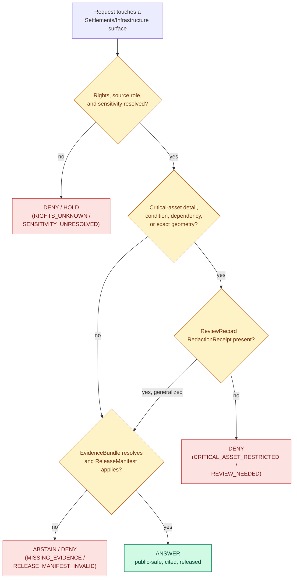

<!-- [KFM_META_BLOCK_V2]
doc_id: kfm://doc/domains/settlements-infrastructure/DENY_BY_DEFAULT
title: Deny-by-Default Register — Settlements & Infrastructure
type: standard
subtype: sensitivity-posture-register
version: v0.1
status: draft
owners: <TBD — settlements/infrastructure steward; sensitivity reviewer; release authority>
created: 2026-06-07
updated: 2026-06-07
policy_label: public
related:
  - ai-build-operating-contract.md                                  # canonical operating contract, CONTRACT_VERSION = "3.0.0"
  - docs/domains/settlements-infrastructure/README.md                # NEEDS VERIFICATION
  - docs/domains/settlements-infrastructure/ARCHITECTURE.md
  - docs/domains/settlements-infrastructure/DATA_LIFECYCLE.md
  - docs/domains/settlements-infrastructure/CANONICAL_PATHS.md
  - docs/standards/SENSITIVITY_RUBRIC.md                             # PROPOSED in corpus (Pass-10 C6-01); not yet authored
  - docs/standards/REDACTION_DETERMINISM.md                          # PROPOSED in corpus (Pass-10 C6-03); not yet authored
  - docs/doctrine/trust-membrane.md
  - docs/doctrine/directory-rules.md
  - docs/atlases/domains-v1.1-ch14.md
  - docs/registers/VERIFICATION_BACKLOG.md
  - docs/adr/ADR-0001-schema-home.md
enforced_by:
  - policy/sensitivity/infrastructure/                               # PROPOSED enforcement home (Atlas §24.13)
  - policy/domains/settlements-infrastructure/                       # PROPOSED enforcement home (Directory Rules §6.5)
tags: [kfm, settlements, infrastructure, sensitivity, deny-by-default, policy, governance]
notes:
  - CONTRACT_VERSION = "3.0.0" — doctrine-adjacent register; operating-contract pin carried.
  - This register DOCUMENTS the lane's deny-by-default posture; it does NOT enforce it. Enforcement lives in policy/ and is proven in tests/.
  - Tiers follow Atlas §24.5.1–§24.5.2 (T0–T4). Critical-asset detail, condition/vulnerability, and dependency default to T4.
  - Schema/policy home is CONFLICTED — policy/sensitivity/infrastructure/ (Atlas §24.13) vs policy/domains/settlements-infrastructure/ (Directory Rules §6.5). ADR-class per §2.4(5). See §9 OPEN-DBD-01.
[/KFM_META_BLOCK_V2] -->

# Deny-by-Default Register — Settlements & Infrastructure

> The single page that answers **“what does this lane refuse to publish, and what would it take to release it safely?”** — the per-lane operationalization of the KFM Deny-by-Default Register (Atlas §20.5) and the T0–T4 sensitivity tiers (Atlas §24.5), for everything the Settlements / Infrastructure lane owns.

|Field               |Value                                                                                                                                                            |
|--------------------|-----------------------------------------------------------------------------------------------------------------------------------------------------------------|
|**Status**          |`draft` · v0.1                                                                                                                                                   |
|**Owners**          |`<TBD — domain steward + sensitivity reviewer + release authority>`                                                                                              |
|**Contract**        |`CONTRACT_VERSION = "3.0.0"`                                                                                                                                     |
|**Doctrinal anchor**|Atlas v1.1 Ch. 14 §I; §20.5 (Deny-by-Default Register); §24.5.2 (tier matrix); §24.9.2 (trust-membrane anti-patterns)                                            |
|**Enforcement home**|`policy/sensitivity/infrastructure/` (Atlas §24.13) — **CONFLICTED** with `policy/domains/settlements-infrastructure/` (Directory Rules §6.5); see §9 OPEN-DBD-01|
|**Posture**         |Deny-by-default; fail-closed; transform-then-release                                                                                                             |
|**Last updated**    |2026-06-07                                                                                                                                                       |

> [!IMPORTANT]
> **This register documents; it does not enforce.** The deny lanes below are doctrine derived from the corpus. The *enforcement* of every lane lives in `policy/` (as OPA/Rego bundles or equivalent) and is *proven* in `tests/`/`fixtures/`. A row in this table is not a guarantee that a mounted repo enforces it — that is `NEEDS VERIFICATION`. The deny-by-default **doctrine** is `CONFIRMED`. ([ENCY] §11; Atlas §20.5.)

-----

## Contents

- [1. Scope and posture](#1-scope-and-posture)
- [2. The one-sentence rule](#2-the-one-sentence-rule)
- [3. Deny-by-default register (this lane)](#3-deny-by-default-register-this-lane)
- [4. Sensitivity tiers for this lane](#4-sensitivity-tiers-for-this-lane)
- [5. The deny decision flow](#5-the-deny-decision-flow)
- [6. Transform-then-release: how a denied surface becomes public-safe](#6-transform-then-release-how-a-denied-surface-becomes-public-safe)
- [7. Anti-collapse deny conditions](#7-anti-collapse-deny-conditions)
- [8. Reason codes and finite outcomes](#8-reason-codes-and-finite-outcomes)
- [9. Open questions and verification backlog](#9-open-questions-and-verification-backlog)
- [10. Related docs](#10-related-docs)

-----

## 1. Scope and posture

CONFIRMED doctrine / PROPOSED implementation. This register enumerates the **deny-by-default lanes** for the Settlements / Infrastructure domain — the object families, surfaces, and joins that are **restricted or denied** unless an explicit, receipted, reviewed transform makes them public-safe. It is the lane’s slice of the master Deny-by-Default Register (Atlas §20.5) and the master tier matrix (Atlas §24.5.2). [DOM-SETTLE] [ENCY]

In scope: the deny disposition of every owned object family, the cross-lane joins that force a hold or denial, the transforms that lift a denial, and the reason codes the lane emits when it refuses.

Out of scope: the *meaning* of objects (that is `contracts/`), the *shape* (that is `schemas/`), and the *executable* policy bundles (that is `policy/`). This register points at those homes; it does not replace them.

> [!NOTE]
> **Deny-by-default is a posture, not a verdict on the data.** A denied surface is not “bad data” — it is data whose public exposure carries unresolved risk (security, rights, sovereignty, privacy, or precision). The lane’s job is to hold it safely and provide a reviewed, receipted path to a public-safe derivative where one exists. [DOM-SETTLE §I]

[↑ back to top](#contents)

-----

## 2. The one-sentence rule

CONFIRMED doctrine (Atlas v1.1 Ch. 14 §I, verbatim):

> [!CAUTION]
> **“Critical infrastructure, utilities, condition observations, dependencies, operator-sensitive details, and exact facility geometry default to restricted or review.”** And: **“Unclear rights, unresolved source role, missing evidence, unresolved sensitivity, or absent release state blocks public promotion.”** [DOM-SETTLE] [ENCY] [DIRRULES]

Everything else in this document is the operational unfolding of those two sentences.

[↑ back to top](#contents)

-----

## 3. Deny-by-default register (this lane)

CONFIRMED doctrine. This extends the master register’s Infrastructure row (Atlas §20.5: *“critical assets, dependencies, condition detail | steward review + public-safe generalization | [DOM-SETTLE]”*) to the lane’s full object roster. The **Denied by default** and **Allowed only when** columns follow the master register’s two-column grammar; the **Default tier** column follows Atlas §24.5.2.

|Surface / object                                          |Denied by default                                              |Default tier   |Allowed only when                                                                                            |Enforcement (PROPOSED)                                     |
|----------------------------------------------------------|---------------------------------------------------------------|---------------|-------------------------------------------------------------------------------------------------------------|-----------------------------------------------------------|
|Critical infrastructure asset detail                      |Exact location, capacity, vulnerability, internal layout.      |**T4**         |Steward review + public-safe generalization + `RedactionReceipt` → T1 footprint.                             |`policy/sensitivity/infrastructure/`                       |
|Condition / vulnerability observations                    |Inspection ratings, deficiency reports, structural detail.     |**T4**         |T3 release to **named authorities only** under agreement; never T0/T1.                                       |`policy/sensitivity/infrastructure/`                       |
|Dependency relations / graphs                             |Which asset depends on which; cascade topology.                |**T4**         |Aggregate / suppressed-edge summary with `AggregationReceipt`; full graph stays restricted.                  |`policy/sensitivity/infrastructure/`                       |
|Exact facility geometry (vulnerable facilities)           |Precise coordinates / footprint.                               |**T4**         |`RedactionReceipt` + generalized footprint (centroid or coarse polygon) → T1.                                |`policy/sensitivity/infrastructure/`                       |
|Operator-sensitive details                                |Operator identity linkage, contact, schedules, credentials.    |**T2 / T3**    |Field-level `RedactionReceipt`; operator *name* may be T0/T1 where already public.                           |`policy/sensitivity/infrastructure/`                       |
|Network node / segment topology                           |Connected critical-network topology.                           |**T4**         |Topology-only generalized view at most; never exact critical routing.                                        |`policy/sensitivity/infrastructure/`                       |
|Service Area (precise)                                    |Customer-resolving boundary precision.                         |**T1 / T2**    |Generalized aggregate polygon + `AggregationReceipt`.                                                        |`policy/domains/settlements-infrastructure/`               |
|Settlement / Municipality / CensusPlace / GhostTown       |— (public legal/census identity)                               |**T0**         |`EvidenceBundle` + `ReleaseManifest`; legal-vs-census role distinction preserved.                            |`policy/domains/settlements-infrastructure/`               |
|Townsite / Fort / Mission (historic)                      |— except archaeology-overlap coordinates                       |**T0 / T1**    |Generalized geometry after `[DOM-ARCH]` review where a site footprint overlaps.                              |`policy/domains/settlements-infrastructure/` + `[DOM-ARCH]`|
|ReservationCommunity                                      |Household/parcel detail; precise internal boundaries.          |**T1 / review**|Sovereignty review + `ReviewRecord`; defer to `[DOM-PEOPLE]` / `[DOM-ARCH]`.                                 |review path                                                |
|Cross-lane join → People/Land (person × parcel × facility)|Living-person and private parcel linkage through a public path.|**T4**         |Routed through People/Land consent + restricted surface; generalized parcel + de-identified person → T2 only.|`[DOM-PEOPLE]` (not this lane)                             |
|KFM as alert / instruction / life-safety authority        |Any emergency-instruction output.                              |**T4 forever** |**Never** — the boundary holds; no transform permits it.                                                     |`policy/release/` boundary                                 |

> [!WARNING]
> The bottom three rows are the **highest-risk** in the lane. Dependency-graph exposure and cross-lane person×facility joins are *inference-amplifying* — a public client may reconstruct restricted topology or defeat living-person privacy by **composition** even when each layer is individually public-safe. The deny applies to the *composed* result, not only the individual layers. (Atlas §24.10 risk register; §24.4 cross-lane atlas.)

[↑ back to top](#contents)

-----

## 4. Sensitivity tiers for this lane

CONFIRMED tier scheme (Atlas §24.5.1, PROPOSED per ADR-S-05). The lane spans the full T0–T4 range; the placement of each object follows §24.5.2.

|Tier  |Name       |Meaning                                                                                                |Default audience                         |Lane objects at this tier                                                                                                                 |
|------|-----------|-------------------------------------------------------------------------------------------------------|-----------------------------------------|------------------------------------------------------------------------------------------------------------------------------------------|
|**T0**|Open       |Public-safe, no transform required.                                                                    |Any public client via governed API.      |Settlement, Municipality, CensusPlace, GhostTown; operator *name*.                                                                        |
|**T1**|Generalized|Public-safe only after generalization / aggregation / redaction; transform reviewed and recorded.      |Any public client via governed API.      |Generalized critical-asset footprint; aggregate Service Area; historic Townsite/Fort/Mission.                                             |
|**T2**|Reviewer   |Released only to authenticated reviewers / stewards; policy-bounded.                                   |Stewards, reviewers, named collaborators.|Operator detail; de-identified person × generalized parcel join.                                                                          |
|**T3**|Restricted |Released only under named agreement (rights, sovereignty, consent).                                    |Named authorized parties only.           |Condition/vulnerability to named authorities; operator-sensitive internals.                                                               |
|**T4**|Denied     |Not released to any audience; the existence of a record may be released only as steward review permits.|—                                        |Critical-asset detail; condition/vulnerability; dependency graph; exact vulnerable geometry; person×parcel×facility join; alert authority.|

> [!CAUTION]
> **CONFLICTED tier source — surfaced, not smoothed.** Atlas §24.5.2 sets critical-asset detail and condition/vulnerability at **T4**; the unified-doctrine synthesis §16 frames Settlements/Infrastructure critical assets at **T2** (“public summary only; precise locations deny”). This register follows the most-restrictive **T4** reading per deny-by-default. Resolution is ADR-class (see §9 OPEN-DBD-02).

### 4.1 Tier transitions (CONFIRMED, Atlas §24.5.3)

|Transition                     |Required artifacts                                                                |Keys       |Reversible?                                                                   |
|-------------------------------|----------------------------------------------------------------------------------|-----------|------------------------------------------------------------------------------|
|Toward public (e.g., `T4 → T1`)|transform receipt (`RedactionReceipt`/`AggregationReceipt`) **and** `ReviewRecord`|**two-key**|Yes; review revocation returns the object toward T4 with a `CorrectionNotice`.|
|`T1 → T0` (release)            |`ReleaseManifest` + `ReviewRecord`                                                |two-key    |Yes, via `RollbackCard`.                                                      |
|Any tier → `T4` (downgrade)    |`CorrectionNotice` + `ReviewRecord`                                               |**one-key**|Always permitted; precedes derivative invalidation.                           |

The asymmetry is deliberate: **making something more public is hard (two keys); making it less public is always allowed (one key).**

[↑ back to top](#contents)

-----

## 5. The deny decision flow

The diagram shows how a candidate surface is evaluated. The default branch is **deny**; an `ANSWER` is reached only by clearing every gate.

> [!NOTE]
> Every dead-end is a **finite outcome** with a reason code (§8), never a silent omission. The flow is fail-closed: any unanswered gate resolves to `DENY`, `HOLD`, or `ABSTAIN`, not to a default-allow. (Atlas §24.3; §24.6.2 closure rules.)

[↑ back to top](#contents)

-----

## 6. Transform-then-release: how a denied surface becomes public-safe

CONFIRMED doctrine. The path out of a deny lane is **transform-then-release**, never release-then-redact. A transform happens *before* tile/artifact production and emits a receipt; the public surface only ever sees the transformed output. (Atlas §24.5.2 allowed-transforms; §24.9.2 anti-patterns.)

|Denied surface                   |Transform                                                  |Receipt(s) emitted                     |Resulting tier              |
|---------------------------------|-----------------------------------------------------------|---------------------------------------|----------------------------|
|Exact facility geometry (T4)     |Generalize to centroid or coarse polygon.                  |`TransformReceipt` + `RedactionReceipt`|T1                          |
|Operator-sensitive fields (T2/T3)|Field-level redaction / masking.                           |`RedactionReceipt`                     |T1 (name) / held (internals)|
|Dependency graph (T4)            |Aggregate to dependency-summary; suppress individual edges.|`AggregationReceipt`                   |T1 (summary)                |
|Condition / vulnerability (T4)   |No public transform; named-authority release only.         |`ReviewRecord` + named-party agreement |T3 (named only)             |
|Service Area (T1/T2)             |Aggregate to coarse coverage polygon.                      |`AggregationReceipt`                   |T1                          |
|Historic site-overlap geometry   |Generalize after `[DOM-ARCH]` review.                      |`RedactionReceipt` + `ReviewRecord`    |T1                          |

> [!WARNING]
> **Style-only hiding is not redaction.** A layer set to `visibility: none`, `opacity: 0`, or filtered out in the MapLibre style JSON is still served in the tile and observable in the network tab. Sensitive geometry MUST be transformed before tile production. The restricted-geometry no-leak test exists to prove this. (Atlas §24.9.2; MapLibre Master.) MapLibre is the sole renderer (`packages/maplibre-runtime/`; Cesium retired per Directory Rules v1.3).

> [!IMPORTANT]
> **Receipts are not optional.** Every transform that lifts a deny lane emits a receipt that names the policy reference, the method, the kept and removed fields, the geometry transform, and the reviewer. A public-safe derivative without a `RedactionReceipt`/`AggregationReceipt` is itself a deny condition — the missing receipt is the reason code. (Atlas §24.2; receipt home `schemas/contracts/v1/receipts/`.)

[↑ back to top](#contents)

-----

## 7. Anti-collapse deny conditions

CONFIRMED doctrine (Atlas §24.1.2 anti-collapse register; §24.9 failure-mode register). Beyond the object-level deny lanes, the lane denies any **source-role collapse** — a transformation or query that silently upgrades one source role into another. The seven canonical roles (`observed | regulatory | modeled | aggregate | administrative | candidate | synthetic`) are fixed at admission and never upcast by promotion.

|Collapse pattern (this lane is at risk)                                                                                                                     |Denied outcome                                                        |Required guardrail                                                          |
|------------------------------------------------------------------------------------------------------------------------------------------------------------|----------------------------------------------------------------------|----------------------------------------------------------------------------|
|**Administrative compilation cited as observation** — e.g., a municipal annexation record or census-place definition reframed as an observed event timeline.|DENY publication of the compilation as observed event evidence.       |Source-role tag preserved; named `AdminEvent` vs `LifeEvent`/observed types.|
|**Aggregate cited as per-place truth** — e.g., an aggregate `ServiceArea` or census roll-up cited as a single-facility observation.                         |DENY join from aggregate cell to single record; ABSTAIN at AI surface.|`AggregationReceipt`; geometry-scope guard.                                 |
|**Candidate exposed on a public surface** — an unpromoted settlement/asset candidate reaching a public client.                                              |DENY at trust membrane; route to QUARANTINE.                          |Promotion gate; no PUBLISHED edge to WORK/QUARANTINE.                       |
|**AI text treated as evidence** — a Focus Mode summary of asset detail standing in for an `EvidenceBundle`.                                                 |DENY publication; ABSTAIN at Focus Mode; `AIReceipt` mandatory.       |Cite-or-abstain; `AIReceipt`; release state required.                       |

> [!CAUTION]
> Source-role collapse is the quietest deny condition because the output *looks* correct. A census place rendered as a legal municipality, or a modeled estimate rendered as an observed reading, produces a fluent, plausible surface that is nonetheless a doctrine violation. The lane’s validators (legal-municipality evidence test; census-vs-municipality distinction test) exist specifically to catch it. (Atlas §24.1.2; §14.K.)

[↑ back to top](#contents)

-----

## 8. Reason codes and finite outcomes

CONFIRMED grammar (Atlas §24.3 finite outcomes; §24.6.3 reason-code catalog — a PROPOSED catalog). When the lane refuses, it emits exactly one finite outcome with a reason code — never a silent omission.

|Finite outcome|When                                                                                         |Lane-relevant reason codes                                                                                                                                                                                                        |
|--------------|---------------------------------------------------------------------------------------------|----------------------------------------------------------------------------------------------------------------------------------------------------------------------------------------------------------------------------------|
|`DENY`        |Policy, rights, sensitivity, or release state forbids. **Critical-asset lane defaults here.**|`RIGHTS_UNKNOWN`, `SENSITIVITY_UNRESOLVED`, `ROLE_COLLAPSE`, `ROLE_DOWNCAST_FORBIDDEN`, `REVIEW_REJECTED`, *(PROPOSED domain-specific)* `CRITICAL_ASSET_RESTRICTED`, `OPERATOR_SENSITIVE_DETAIL`, `EXACT_FACILITY_GEOMETRY_DENIED`|
|`ABSTAIN`     |Evidence insufficient / uncitable / stale; no released alternative.                          |`MISSING_EVIDENCE`, `MISSING_RECEIPT`                                                                                                                                                                                             |
|`HOLD`        |Promotion / release / correction paused pending review.                                      |`REVIEW_NEEDED`, `REVIEW_INSUFFICIENT`, `MISSING_REVIEW`                                                                                                                                                                          |
|`ERROR`       |Surface cannot evaluate — schema/contract drift, malformed request.                          |`SCHEMA_MISMATCH`, `CONTRACT_DRIFT`, `RELEASE_MANIFEST_INVALID`, `ROLLBACK_TARGET_MISSING`                                                                                                                                        |

> [!NOTE]
> The cross-cutting reason codes (`RIGHTS_UNKNOWN`, `ROLE_COLLAPSE`, `MISSING_*`, `SCHEMA_MISMATCH`, etc.) are CONFIRMED in the §24.6.3 catalog. The critical-asset-specific codes are PROPOSED for this lane and not yet enumerated in a mounted policy bundle. The `PolicyDecision` that produces these uses the distinct enum `allow | deny | restrict | hold | abstain` — not the answer-outcome enum above; the two MUST NOT be conflated.

[↑ back to top](#contents)

-----

## 9. Open questions and verification backlog

|ID           |Item                                                                                                                                                                                                                                                                     |Resolution path                                                                              |Status                                 |
|-------------|-------------------------------------------------------------------------------------------------------------------------------------------------------------------------------------------------------------------------------------------------------------------------|---------------------------------------------------------------------------------------------|---------------------------------------|
|`OPEN-DBD-01`|**Policy/schema home** — `policy/sensitivity/infrastructure/` (Atlas §24.13) vs `policy/domains/settlements-infrastructure/` (Directory Rules §6.5); and the parallel schema-home variance `schemas/contracts/v1/settlement/` vs `…/domains/settlements-infrastructure/`.|ADR (= ADR-S-01 in §24.12 backlog; ADR-0001 confirm-or-amend).                               |**CONFLICTED** — ADR-class per §2.4(5).|
|`OPEN-DBD-02`|**Critical-asset tier conflict** — Atlas §24.5.2 (T4) vs unified-synthesis §16 (T2).                                                                                                                                                                                     |ADR-S-05 (tier scheme); mounted `policy/sensitivity/infrastructure/`.                        |**CONFLICTED**                         |
|`OPEN-DBD-03`|Exact **generalization parameters** for the T4→T1 footprint transform (centroid vs coarse polygon; coarsening radius).                                                                                                                                                   |`docs/standards/REDACTION_DETERMINISM.md` (PROPOSED, not yet authored, Pass-10 C6-03).       |PROPOSED                               |
|`OPEN-DBD-04`|**Named-authority agreement** mechanism for T3 condition/vulnerability release (who, what agreement, what audit).                                                                                                                                                        |Policy + `ReviewRecord` schema; ADR-S-14 (cross-lane join policy) adjacent.                  |NEEDS VERIFICATION                     |
|`OPEN-DBD-05`|**Composition / inference-via-join deny** — how the lane detects that individually-public layers compose into a restricted result.                                                                                                                                       |Threat-model runbook; Atlas §24.10 risk register; not automated.                             |PROPOSED                               |
|`OPEN-DBD-06`|Domain-specific **reason-code enumeration** (`CRITICAL_ASSET_RESTRICTED`, etc.) in a mounted policy bundle.                                                                                                                                                              |Mounted `policy/sensitivity/infrastructure/`; OPA tests.                                     |NEEDS VERIFICATION                     |
|`OPEN-DBD-07`|Canonical **sensitivity rubric** for the lane.                                                                                                                                                                                                                           |`docs/standards/SENSITIVITY_RUBRIC.md` (PROPOSED, not yet authored, Pass-10 C6-01); ADR-S-05.|NEEDS VERIFICATION                     |

> [!NOTE]
> Items are tracked for triage; resolutions migrate to `docs/registers/VERIFICATION_BACKLOG.md` or `docs/adr/`. None may be silently closed by editing this register. [DIRRULES]

[↑ back to top](#contents)

-----

## 10. Related docs

- `ai-build-operating-contract.md` — canonical operating contract; `CONTRACT_VERSION = "3.0.0"`.
- `docs/domains/settlements-infrastructure/README.md` — lane dossier landing (`PROPOSED`).
- `docs/domains/settlements-infrastructure/ARCHITECTURE.md` — domain architecture; §9 sensitivity posture.
- `docs/domains/settlements-infrastructure/DATA_LIFECYCLE.md` — §7 sensitivity holds; the lifecycle this register gates.
- `docs/domains/settlements-infrastructure/CANONICAL_PATHS.md` — §6 sensitivity-aware policy lanes; path homes.
- `docs/standards/SENSITIVITY_RUBRIC.md` — canonical tier rubric (`PROPOSED` per Pass-10 C6-01; not yet authored).
- `docs/standards/REDACTION_DETERMINISM.md` — deterministic redaction parameters (`PROPOSED` per Pass-10 C6-03; not yet authored).
- `docs/doctrine/trust-membrane.md` — the boundary all public reads cross.
- `docs/doctrine/directory-rules.md` — placement law; §6.5 `policy/` tree.
- `docs/atlases/domains-v1.1-ch14.md` — Atlas v1.1 Ch. 14 §I (the source sentence) + §20.5 register + §24.5 tiers.
- `docs/adr/ADR-0001-schema-home.md` — schema/policy-home authority (governs OPEN-DBD-01).
- `policy/sensitivity/infrastructure/` — PROPOSED enforcement home (Atlas §24.13).
- `policy/domains/settlements-infrastructure/` — PROPOSED enforcement home (Directory Rules §6.5).

-----

## Changelog

|Version|Date      |Type (per contract §37)|Change                                                                                                                                                                                                                                                                                                                                                                                  |
|-------|----------|-----------------------|----------------------------------------------------------------------------------------------------------------------------------------------------------------------------------------------------------------------------------------------------------------------------------------------------------------------------------------------------------------------------------------|
|v0.1   |2026-06-07|new                    |Initial deny-by-default register for the lane; operationalizes Atlas §14.I + §20.5 + §24.5.2 + §24.9.2 across the full object roster. Pinned `CONTRACT_VERSION = "3.0.0"`; flagged the policy/schema home (OPEN-DBD-01) and critical-asset tier (OPEN-DBD-02) as CONFLICTED and tied OPEN-DBD-01 to ADR-S-01; all Mermaid labels quoted; documents-not-enforces posture stated up front.|

> **Note on novelty.** This is a new document. Its deny lanes are derived from CONFIRMED corpus doctrine (Atlas §14.I verbatim; §20.5 register; §24.5.2 tier matrix; §24.1.2 anti-collapse; §24.6.3 reason codes). Domain-specific reason codes and generalization parameters are PROPOSED and carry the label. No mounted repo was inspected; enforcement presence is `NEEDS VERIFICATION`.

-----

Last updated: 2026-06-07 · status: draft · v0.1 · `CONTRACT_VERSION = "3.0.0"` · `kfm://doc/domains/settlements-infrastructure/DENY_BY_DEFAULT` · doctrine CONFIRMED · enforcement NEEDS VERIFICATION · [↑ back to top](#contents)