<!-- [KFM_META_BLOCK_V2]
doc_id: kfm://doc/docs-domains-settlements-infrastructure-expansion-backlog
title: Settlements & Infrastructure — Expansion Backlog
type: standard
version: v0.2
status: draft
owners: <Settlements/Infrastructure domain steward — TODO>, <Docs steward — TODO>
created: 2026-05-19
updated: 2026-06-08
policy_label: public
related: [
  ai-build-operating-contract.md,
  docs/domains/settlements-infrastructure/README.md,
  docs/doctrine/directory-rules.md,
  docs/atlases/KFM_Domains_Culmination_Atlas_v1_1.pdf,
  docs/encyclopedia/README.md,
  docs/registers/VERIFICATION_BACKLOG.md,
  docs/registers/DRIFT_REGISTER.md,
  policy/sensitivity/infrastructure/
]
tags: [kfm, settlements, infrastructure, backlog, expansion, governance, sensitivity, critical-infrastructure]
notes: [
  "CONTRACT_VERSION pinned to 3.0.0 per ai-build-operating-contract.md authority.",
  "PROPOSED placement per Directory Rules v1.3 6.1 (docs/domains/settlements-infrastructure/) and Step 3 (domain-as-segment).",
  "No mounted repo verified this session; all implementation-shaped claims default to PROPOSED until repo evidence resolves them.",
  "Critical-infrastructure sensitivity posture is inherited from DOM-SETTLE I, ENCY 11, Atlas 20.5, and Atlas 24.5 and is non-negotiable across every backlog item below.",
  "CONFLICTED: contract path. Atlas 24.13 / ENCY 7.1 crosswalk uses contracts/settlement/; Directory Rules 6.1 domain-segment pattern implies contracts/domains/settlements-infrastructure/. Surfaced as ADR-Q-SET-D. This edition aligns primary paths to the crosswalk and flags the divergence."
]
[/KFM_META_BLOCK_V2] -->

# Settlements & Infrastructure — Expansion Backlog

> Domain-scoped working backlog for the **Settlements / Infrastructure** lane: what this domain owes the KFM trust membrane before broadening, organized by priority and tied to verifiable closure criteria.

[](#)
[](../../doctrine/truth-posture.md)
[](../../../policy/sensitivity/infrastructure/)
[](../../doctrine/lifecycle-law.md)
[](#)
[](../../../ai-build-operating-contract.md)
[](#)

**Status:** draft · **Owners:** Settlements/Infrastructure domain steward (TODO) · Docs steward (TODO) · **Updated:** 2026-06-08

| Field | Value |
|---|---|
| **Authority of this doc as a backlog** | **CONFIRMED** — Directory Rules §6.1 places domain-scoped docs under `docs/domains/<domain>/`. |
| **Authority of specific items** | **PROPOSED** — see truth label per row. No implementation maturity is asserted. |
| **Domain identity citation** | `[DOM-SETTLE]` / Atlas Ch. 14 / Encyclopedia README §7.1 — Settlements and Infrastructure. |
| **Path basis** | Directory Rules v1.3 §6.1 (`docs/domains/settlements-infrastructure/`) and Step 3 (domain-as-segment); Atlas Ch. 24.13 / ENCY §7.1 crosswalk for `schemas/`, `contracts/`, `policy/` roots. |
| **Critical-infrastructure posture** | `[DOM-SETTLE §I]`, `[ENCY §11]`, Atlas §20.5 (Deny-by-Default Register), Atlas §24.5 (Tier matrix: critical-asset detail and condition/vulnerability default **T4**) — critical-asset deny lane. |
| **Operating contract** | `ai-build-operating-contract.md`, `CONTRACT_VERSION = "3.0.0"`. |
| **Updated** | 2026-06-08 |

---

## Contents

1. [Purpose and scope](#1-purpose-and-scope)
2. [Authority, truth posture, and scope boundaries](#2-authority-truth-posture-and-scope-boundaries)
3. [How this backlog fits the KFM trust spine](#3-how-this-backlog-fits-the-kfm-trust-spine)
4. [Backlog organization](#4-backlog-organization)
5. [High-priority backlog](#5-high-priority-backlog)
6. [Medium-priority backlog](#6-medium-priority-backlog)
7. [Low-priority backlog](#7-low-priority-backlog)
8. [Thin-slice and pilot proposals](#8-thin-slice-and-pilot-proposals)
9. [Settlements/Infrastructure verification backlog (carryover)](#9-settlementsinfrastructure-verification-backlog-carryover)
10. [Risks, sensitivity posture, and rollback notes](#10-risks-sensitivity-posture-and-rollback-notes)
11. [Open questions register](#11-open-questions-register)
12. [Promotion criteria — how items leave this backlog](#12-promotion-criteria--how-items-leave-this-backlog)
13. [Related docs and cross-references](#13-related-docs-and-cross-references)
14. [Appendix A — Settlements/Infrastructure source-family anchor list](#appendix-a--settlementsinfrastructure-source-family-anchor-list)
15. [Appendix B — Backlog item template](#appendix-b--backlog-item-template)
16. [Appendix C — Canonical sensitivity-tier crosswalk](#appendix-c--canonical-sensitivity-tier-crosswalk)

---

## 1. Purpose and scope

This document is the **domain-scoped working backlog** for Settlements and Infrastructure. It enumerates the expansion work — research, writing, schema authoring, validator authoring, sensitivity-policy authoring, fixture authoring, thin-slice piloting, and verification — that the Settlements/Infrastructure lane needs in order to advance from CONFIRMED doctrine to PROPOSED-then-CONFIRMED implementation, while honoring KFM's lifecycle, evidence, policy, sensitivity, and release controls.

**It is not**:

- a release plan (release decisions live under `release/` and the publication path);
- a roadmap of features for public consumption (those follow `LayerManifest` and `ReleaseManifest` once items here are closed);
- a single source of truth for cross-cutting expansion work (that lives at `docs/registers/VERIFICATION_BACKLOG.md` and `control_plane/verification_backlog.yaml`, PROPOSED paths per Directory Rules §6.1–§6.2).

**It is**: a focused, citation-bearing inventory of what Settlements/Infrastructure owes the trust membrane before broadening, and what proof-of-closure each owed item must produce.

> [!IMPORTANT]
> Every item in this backlog inherits the Settlements/Infrastructure sensitivity posture: **critical infrastructure, utilities, condition observations, dependencies, operator-sensitive details, and exact facility geometry default to restricted or review (Atlas §24.5: critical-asset detail and condition/vulnerability default tier T4)**, and **legal place / census place / historic place / townsite / ghost-town identity must remain distinct**. No item below relaxes that posture. CONFIRMED doctrine (`[DOM-SETTLE §I]`, `[ENCY §11]`, Atlas §20.5, Atlas §24.5).

[⬆ back to top](#contents)

---

## 2. Authority, truth posture, and scope boundaries

### 2.1 Authority

| Authority surface | Role for this backlog | Citation |
|---|---|---|
| `ai-build-operating-contract.md` v3.0 | Canonical operating contract; governs evidence, truth labels, sensitive-domain handling, receipt discipline. | `CONTRACT_VERSION = "3.0.0"` |
| Directory Rules v1.3 | Decides where this document and any item it spawns lives. | `directory-rules.md §§2–6, §18` |
| Domains Atlas v1.1, Ch. 14 (Settlements / Infrastructure) | CONFIRMED doctrinal anchor: identity, scope, language, sources, objects, relations, pipeline, sensitivity, API surfaces, AI, publication, verification backlog. | Atlas v1.0 Ch. 14, retained verbatim in v1.1 |
| Atlas Ch. 20.5 (Deny-by-Default Register and Sensitivity Matrix) | CONFIRMED deny lane: Infrastructure critical assets, dependencies, condition detail denied by default; allowed only with steward review + public-safe generalization. | Atlas §20.5 |
| Atlas Ch. 24.5 (Master Sensitivity / Rights Tier Reference, T0–T4) | CONFIRMED canonical tier scheme; per-domain matrix sets Infrastructure critical-asset detail and condition/vulnerability at **T4**. | Atlas §24.5 |
| Atlas Ch. 24.13 / Encyclopedia README §7.1 (Crosswalk) | Responsibility-root targets: `schemas/contracts/v1/settlement/`, `contracts/settlement/`, `policy/sensitivity/infrastructure/`. | Atlas §24.13; ENCY §7.1 (updated 2026-05-24) |
| KFM Encyclopedia README §11 (Sensitive / Deny-by-Default Posture) | Critical-infrastructure precise locations: **DENY**; `policy/sensitivity/infrastructure/`. | `docs/encyclopedia/README.md §11` |
| Unified Implementation Architecture §6.9 | Settlements/Infrastructure scope, sources of authority, sensitivity, object families, pipelines, gates, open verification items. | `KFM_Unified_Implementation_Architecture_Build_Manual §6.9` |
| ADRs (current and pending) | May amend any row by promoting, demoting, or splitting it. | `docs/adr/` |

### 2.2 Truth labels in use

| Label | Meaning in this backlog |
|---|---|
| **CONFIRMED** | Grounded in attached KFM doctrine (Atlas Ch. 14, Atlas §20.5, Atlas §24.5, Atlas §24.13, Encyclopedia, Directory Rules) visible to this authoring session. |
| **PROPOSED** | Design recommendation, file path, schema/contract/policy/test/fixture placement, or backlog row not yet verified against mounted-repo evidence. |
| **INFERRED** | Reasonably derivable from CONFIRMED doctrine but not stated verbatim. |
| **NEEDS VERIFICATION** | Checkable against repo evidence; not yet checked in this session. |
| **CONFLICTED** | Sources disagree, or doctrine and implementation appear inconsistent; held until an ADR or drift-register entry resolves it. |
| **UNKNOWN** | Not resolvable without more evidence. |

> [!NOTE]
> No mounted repo, CI, workflow, dashboard, or runtime log was inspected in this authoring session. Every path, schema name, policy file, test name, route, and registry entry referenced below is **PROPOSED** until repo inspection. This matches the truth posture of `ai-build-operating-contract.md` §5 and Directory Rules v1.3 §0.

> [!WARNING]
> **CONFLICTED — contract path convention.** Atlas §24.13 and Encyclopedia README §7.1 give the Settlements/Infrastructure contract root as `contracts/settlement/` (flat, short-name). Directory Rules §6.1 Step 3 expresses domain files as a *segment inside* a responsibility root, which would imply `contracts/domains/settlements-infrastructure/`. Earlier editions of this backlog used the latter. **This edition aligns primary contract paths to the crosswalk (`contracts/settlement/`)** because the crosswalk is the more specific, domain-targeted authority, and surfaces the divergence as **ADR-Q-SET-D** (§11.3). Until that ADR resolves, both forms are marked PROPOSED and the chosen path should be cited in any PR per Directory Rules §4 Step 5.

### 2.3 In-scope (this lane owns these expansions)

CONFIRMED scope per `[DOM-SETTLE §B]` (Atlas Ch. 14 §B):

- **Settlement** — generic settled places not yet typed.
- **Municipality** — legal city, town, village entities with charter / incorporation evidence.
- **CensusPlace** — Census Bureau place geographies (TIGER), CDPs and incorporated places treated as observations.
- **Townsite** — platted/historical townsite footprints.
- **GhostTown** — abandoned or depopulated places carrying former-settlement evidence.
- **Fort** — frontier-era military posts (historical and active).
- **Mission** — religious mission sites, historical and active.
- **ReservationCommunity** — communities on or adjacent to recognized tribal lands; sovereignty-sensitive.
- **Infrastructure Asset** — bridges, utility nodes, treatment plants, depots, generators, towers, terminals; rendered public-safe per policy.
- **Network Node / Network Segment** — connected-infrastructure graph elements.
- **Facility** — service-providing structures (schools, hospitals, fire stations, etc.) where ownership of the asset is in scope but transport function is not.
- **Service Area** — operator service boundaries (water utility area, electric coop area, etc.).
- **Operator** — utility / municipal / private operator entity.
- **Condition Observation** — bridge inspections, asset condition reports; restricted by default (T4).
- **Dependency** — A-depends-on-B asset/operator relations; restricted by default (T4).

### 2.4 Out of scope (other lanes own these)

CONFIRMED non-ownership per `[DOM-SETTLE §B]`:

| What this domain does **not** own | Owning lane | Why the boundary matters |
|---|---|---|
| Transport routes (highways, rail lines, trails, designated trade routes) | **Roads/Rail** (`[DOM-ROADS]`) | A depot is a settlement asset; the corridor it sits on is a transport route. Co-locating them collapses identity. |
| Hydrologic water evidence (streams, aquifers, NFHL zones, gauges) | **Hydrology** (`[DOM-HYD]`) | A water utility's service area is a settlement object; the water it serves is a hydrology object. |
| Hazard events, warnings, declarations | **Hazards** (`[DOM-HAZ]`) | Settlement exposure to a hazard is a cross-lane relation; the hazard itself is hazards. |
| Land ownership, parcel geometry, living-person residency | **People / DNA / Land** (`[DOM-PEOPLE]`) | A person living in a settlement is an ownership/residency assertion, not a settlement attribute. |
| Archaeological sites underlying or adjacent to historical settlements | **Archaeology** (`[DOM-ARCH]`) | A fort's archaeological component is governed by archaeology's sovereignty/sensitivity stack, not this lane. |

### 2.5 Cross-lane relations (CONFIRMED / PROPOSED)

Atlas Ch. 14 §F catalogs four cross-lane relations Settlements/Infrastructure both supplies and consumes:

| Related lane | Relation type | Constraint (CONFIRMED) |
|---|---|---|
| **Roads/Rail** | depot, bridge, crossing, transport facility relation | Must preserve ownership, source role, sensitivity, EvidenceBundle support. |
| **Hazards** | exposure, resilience, warnings, declarations | KFM is **never** an alert authority (Atlas §20.5); relations are descriptive, not advisory. |
| **Hydrology** | water, wastewater, stormwater, floodplain, drainage | Service-area relation; does not flatten hydrologic evidence. |
| **People/Land** | residence, ownership, parcel, migration context (restricted) | Living-person and parcel relations remain governed by `[DOM-PEOPLE]` policy. |

[⬆ back to top](#contents)

---

## 3. How this backlog fits the KFM trust spine

CONFIRMED doctrinal pipeline per `[DIRRULES]` and Atlas Ch. 14 §H:

```mermaid
flowchart LR
    subgraph SRC["Source families (Appendix A)"]
        TIGER["Census TIGER"]
        GNIS["GNIS / gazetteers"]
        STATE["State / Kansas Geoportal"]
        MUN["Municipal / legal records"]
        HIST["Historical gazetteers / maps"]
        OP["Infrastructure operators"]
        KDOT["KDOT / bridge / facility"]
        FEMA["FEMA / hazards / resilience"]
    end

    subgraph PIPE["RAW to PUBLISHED pipeline (CONFIRMED doctrine)"]
        RAW[("RAW")]
        WORK[("WORK / QUARANTINE")]
        PROC[("PROCESSED")]
        CAT[("CATALOG / TRIPLET")]
        PUB[("PUBLISHED")]
    end

    subgraph GOV["Governance surfaces"]
        SD["SourceDescriptor"]
        VR["ValidationReport"]
        EB["EvidenceBundle"]
        RM["ReleaseManifest"]
        RR["RollbackTarget"]
        CN["CorrectionNotice"]
        POL["policy/sensitivity/infrastructure/"]
        REV["ReviewRecord"]
    end

    subgraph BACK["THIS BACKLOG"]
        H["High-priority (5)"]
        M["Medium-priority (6)"]
        L["Low-priority (7)"]
        PILOT["Thin-slice pilots (8)"]
        VBL["Verification carryover (9)"]
    end

    SRC --> RAW --> WORK --> PROC --> CAT --> PUB
    SD -.-> RAW
    WORK -.-> POL
    PROC -.-> VR
    CAT -.-> EB
    PUB -.-> RM
    PUB -.-> RR
    PUB -.-> CN
    PUB -.-> REV

    BACK -.feeds.-> SRC
    BACK -.feeds.-> PIPE
    BACK -.feeds.-> GOV

    classDef gate fill:#bf8700,stroke:#5c4400,color:#fff;
    classDef back fill:#1f6feb,stroke:#0a2e6b,color:#fff;
    classDef src fill:#2da44e,stroke:#0a3d1a,color:#fff;
    class POL,EB,RM,RR,CN,REV gate;
    class H,M,L,PILOT,VBL back;
    class TIGER,GNIS,STATE,MUN,HIST,OP,KDOT,FEMA src;
```



> [!NOTE]
> **PROPOSED diagram.** Every `policy/`, `SourceDescriptor`, `EvidenceBundle`, `ReleaseManifest`, `RollbackTarget`, and `CorrectionNotice` target above resolves to PROPOSED paths per Atlas Ch. 24.13 and Directory Rules §§2–6. The diagram shows responsibility flow, not implementation presence.

The trust spine has **no Settlements/Infrastructure-specific shortcut**. Every backlog row below either expands one of these surfaces, supplies a missing gate input, or supplies a missing fixture; rows that would skip any of `RAW → WORK / QUARANTINE → PROCESSED → CATALOG / TRIPLET → PUBLISHED` are rejected by definition.

[⬆ back to top](#contents)

---

## 4. Backlog organization

Backlog items are organized along two axes:

1. **Priority band**: High, Medium, Low, Pilot. Priority reflects **proximity to a credible thin-slice** plus **risk of unsupervised drift if delayed**, not strategic importance in the abstract.
2. **Owed surface**: doctrine, contract, schema, policy, validator, fixture, runbook, ADR, or atlas crosswalk. Every row names the surface it advances.

### 4.1 Row anatomy

Each row carries: a stable backlog ID (`SET-BL-NNNN`), title, owed surface, doctrine anchor, sensitivity flag, proposed responsibility root, closure criterion, and truth label.

> [!TIP]
> A row is **closed** only when (a) the named responsibility root contains the named artifact, (b) at least one PROPOSED → CONFIRMED label flip is evidence-backed, and (c) any policy or sensitivity row has corresponding validator and fixture support. Backlog closure ≠ publication.

### 4.2 ID space

Backlog IDs use the pattern `SET-BL-NNNN` (Settlements/Infrastructure Backlog, four-digit zero-padded ordinal). IDs are stable across edits; reassignment requires an ADR if a row is split or merged. The ID range is local to this lane.

### 4.3 Sensitivity flags map to the canonical tier scheme

This backlog uses a lane-local `T0–T4` flag for fast scanning. **These flags map directly onto the canonical Atlas §24.5 tier scheme** (`T0 Open`, `T1 Generalized`, `T2 Reviewer`, `T3 Restricted`, `T4 Denied`) — they are not a separate vocabulary. The full crosswalk is in [Appendix C](#appendix-c--canonical-sensitivity-tier-crosswalk). Where a row's flag and the canonical `policy/sensitivity/infrastructure/` tier disagree, **the canonical tier wins**.

### 4.4 Reading order

| If you are a… | Read these sections first |
|---|---|
| Domain steward triaging next sprint | §5 → §8 → §11 |
| Validator/test author | §5 → §6 → Appendix B |
| Schema/contract author | §5 (rows S* / C*) → Appendix A → Atlas §24.13 |
| Policy steward (sensitivity) | §5 (rows P*) → §10 → Appendix C → `[ENCY §11]` |
| Reviewer or release gatekeeper | §3 → §10 → §12 |
| Atlas/encyclopedia editor | §9 → §11 → §13 |

[⬆ back to top](#contents)

---

## 5. High-priority backlog

> [!IMPORTANT]
> High priority = **proof-of-trust-spine for Settlements/Infrastructure cannot start without it**. These rows precede any thin-slice (§8) and any public publication of a Settlements/Infrastructure layer.

| ID | Title | Owed surface | Sensitivity flag | Proposed root (PROPOSED) | Closure criterion (PROPOSED) | Anchor | Status |
|---|---|---|---|---|---|---|---|
| **SET-BL-0001** | Legal-place vs CensusPlace vs Townsite vs GhostTown identity separation | Doctrine + contract | T2 (identity-collapse risk) | `contracts/settlement/place-identity.md` | One contract file enumerating each `Place`-class object, its identity rule, and a `KIND_OF_PLACE` enum with mutual-exclusion test. Mirrors Atlas Ch. 14 §C ubiquitous-language table. | `[DOM-SETTLE §B–C]`, `[ENCY §11]` | PROPOSED |
| **SET-BL-0002** | `SourceDescriptor` rows for the eight source families | Source registry | Varies by family | `data/registry/sources/settlements-infrastructure/` | Eight `source_descriptor.*.yaml` files (one per Appendix A row), each with `source_role`, `rights_status`, `sensitivity_default`, `freshness`, and `legal_authority_class` fields. | `[DOM-SETTLE §D]`, `[ENCY §2]` | PROPOSED |
| **SET-BL-0003** | Critical-infrastructure deny-default policy bundle | Policy + validator | **T4** — critical-infrastructure deny lane | `policy/sensitivity/infrastructure/` | Policy bundle that DENIES, by default: exact geometry of utility-operator assets, condition observations, dependencies, operator-sensitive details, and facility-detail attributes; plus a validator that asserts no PUBLISHED layer carries those fields. Aligns to Atlas §24.5 (critical-asset detail = T4; condition/vulnerability = T4). | `[DOM-SETTLE §I]`, `[ENCY §11]`, Atlas §20.5, Atlas §24.5 | PROPOSED |
| **SET-BL-0004** | Restricted-geometry no-leak test | Test + fixture | T4 | `tests/domains/settlements-infrastructure/test_restricted_geometry_no_leak.py` + `fixtures/domains/settlements-infrastructure/restricted/` | Test loads a fixture of restricted-class (T4) assets, runs the public-render path, and asserts no exact geometry appears in PUBLISHED output. Mirrors Atlas Ch. 14 §K list ("restricted geometry no-leak tests"). | `[DOM-SETTLE §K]` | PROPOSED |
| **SET-BL-0005** | Census-vs-municipality distinction test | Test + fixture | T2 | `tests/domains/settlements-infrastructure/test_census_vs_municipality.py` | Fixture provides one place that is BOTH a CensusPlace and a Municipality and one that is ONLY a CensusPlace; test asserts the system never collapses the two and never labels a CDP "incorporated city." Mirrors Atlas Ch. 14 §K ("census-vs-municipality distinction"). | `[DOM-SETTLE §K]` | PROPOSED |
| **SET-BL-0006** | Schema home migration to `schemas/contracts/v1/settlement/` | Schema | T2 | `schemas/contracts/v1/settlement/` per Atlas §24.13 | Eight base schemas (Settlement, Municipality, CensusPlace, Townsite, GhostTown, Fort, Mission, ReservationCommunity) plus eight asset/network schemas (Infrastructure Asset, Network Node, Network Segment, Facility, Service Area, Operator, Condition Observation, Dependency), all validated via `schemas/tests/valid/` and `schemas/tests/invalid/`. ADR-0001 schema-home rule applies. | Atlas §24.13, ADR-0001 (ADR-S-01) | PROPOSED |
| **SET-BL-0007** | Infrastructure topology test | Test + fixture | T3 | `tests/domains/settlements-infrastructure/test_topology.py` | Network Node ↔ Network Segment connectivity is closed (no dangling segments, no orphan nodes), and Dependency edges form an acyclic-by-rule graph where the rule applies. Mirrors Atlas Ch. 14 §K ("infrastructure topology tests"). | `[DOM-SETTLE §K]` | PROPOSED |
| **SET-BL-0008** | Condition observation temporal test | Test + fixture | T4 | `tests/domains/settlements-infrastructure/test_condition_observed_at.py` | Condition Observation rows carry distinct `source_time`, `observed_at`, `valid_at`, `retrieved_at`, `released_at`, and `corrected_at` where material; collapsing into "observation date alone" is rejected. Mirrors Atlas Ch. 14 §E (temporal handling) and §K ("condition observed_at tests"). | `[DOM-SETTLE §E]`, `[DOM-SETTLE §K]` | PROPOSED |
| **SET-BL-0009** | Catalog / proof / release closure test | Test + fixture | T2 | `tests/domains/settlements-infrastructure/test_catalog_release_closure.py` | A PUBLISHED Settlements/Infrastructure artifact must resolve to a `CATALOG` record, an `EvidenceBundle`, a `ReleaseManifest`, a rollback target, and a correction path; any missing leg fails the test. Mirrors Atlas Ch. 14 §K/§M. | `[DOM-SETTLE §M]`, `[DOM-SETTLE §K]` | PROPOSED |
| **SET-BL-0010** | ReservationCommunity sovereignty review gate | Policy + review | **T4** | `policy/sensitivity/infrastructure/reservation-community.rego` (PROPOSED engine) | Any object with `kind_of_place = ReservationCommunity` or with a relation to a recognized tribal land triggers a steward-review obligation before promotion. Default: ABSTAIN until ReviewRecord is filed. Mirrors archaeology sovereignty pattern (`[DOM-ARCH]`) without owning archaeology semantics. | `[DOM-SETTLE §B]`, `[DOM-ARCH]` (sovereignty pattern), Atlas §24.13 | PROPOSED |

### 5.1 Notes on the High band

- **SET-BL-0003** is the rate-limiting row. Without a critical-infrastructure deny-default policy bundle, every other "public-safe" claim in this lane is unsupported. It must precede any pilot in §8. Atlas §24.5 fixes its target tier at **T4** for both critical-asset detail and condition/vulnerability, so the bundle has a concrete, citable target.
- **SET-BL-0001** is conceptually small but pre-requires **SET-BL-0006**: the schemas must encode the place-identity enum the contract enumerates.
- **SET-BL-0010** is the only T4 row that survives even with **SET-BL-0003** in place, because sovereignty review is a process obligation, not just a field redaction.

[⬆ back to top](#contents)

---

## 6. Medium-priority backlog

> [!NOTE]
> Medium priority = **necessary for second-wave layers and durable trust**, but not blocking on the first thin-slice. Several Medium rows depend on at least one High row.

| ID | Title | Owed surface | Sensitivity flag | Proposed root (PROPOSED) | Closure criterion (PROPOSED) | Anchor | Status |
|---|---|---|---|---|---|---|---|
| **SET-BL-0101** | Operator entity disambiguation | Contract + validator | T3 | `contracts/settlement/operator.md` | Operator identity rule distinguishes parent-of-operator vs operating-entity vs holding-entity; validator rejects rows that bind a single Service Area to multiple incompatible Operator records without temporal disambiguation. | `[DOM-SETTLE §B]`, `[UNIFIED §6.9]` | PROPOSED |
| **SET-BL-0102** | Service-area boundary lineage | Contract + schema | T2 | `schemas/contracts/v1/settlement/service_area.schema.json` | Service Area carries `boundary_source`, `boundary_method` (legal / surveyed / inferred), `effective_from`, and `superseded_by`; inferred boundaries are flagged in PUBLISHED output. | `[DOM-SETTLE §B]` | PROPOSED |
| **SET-BL-0103** | Historical gazetteer + ghost-town source-role discipline | Source + contract | T2 (historical); T3 (sovereignty-adjacent townsites) | `data/registry/sources/settlements-infrastructure/historical_gazetteer.yaml` | Historical gazetteer rows are marked `source_role = historical` and cannot supply a `LegalPlace` claim; supplies only `HistoricalPlace` claims. Test SET-BL-0005 exercises this. | `[DOM-SETTLE §D]`, `[ENCY §11]` | PROPOSED |
| **SET-BL-0104** | Census decade vintage discipline | Schema + validator | T2 | `tests/domains/settlements-infrastructure/test_census_vintage.py` | Every CensusPlace row carries a `census_vintage` (e.g., 1860, 1880, 1900, 2020); validator rejects time-merged CensusPlace records without an explicit decade enum. | `[DOM-SETTLE §K]` | PROPOSED |
| **SET-BL-0105** | Municipality charter / incorporation evidence rule | Contract + policy | T2 | `policy/domains/settlements-infrastructure/municipality_evidence.rego` (PROPOSED engine) | Any `Municipality` claim asserting "incorporated" requires a charter/ordinance/incorporation-event EvidenceRef; the policy ABSTAINs otherwise. Mirrors Atlas Ch. 14 §K ("Legal municipality evidence tests"). | `[DOM-SETTLE §K]` | PROPOSED |
| **SET-BL-0106** | KDOT bridge / facility crosswalk to Roads/Rail | Crosswalk + contract | T3 | `contracts/settlement/roads-rail-crosswalk.md` | Bridges, depots, and grade-crossings: the **asset** is owned by Settlements/Infrastructure; the **route** is owned by `[DOM-ROADS]`. Crosswalk document spells out joining rule and forbids assertion of route designation from the asset side. | `[DOM-SETTLE §F]`, `[DOM-ROADS]`, Atlas §24.13 | PROPOSED |
| **SET-BL-0107** | Hydrology service-area crosswalk | Crosswalk + contract | T2 | `contracts/settlement/hydrology-crosswalk.md` | Wastewater / stormwater / drinking-water service areas: this lane owns the **service-area boundary**; `[DOM-HYD]` owns the **water evidence**. Crosswalk spells out join rules; floodplain joins go to `NFHL zone` (Hydrology-owned, T0 regulatory per Atlas §24.14). | `[DOM-SETTLE §F]`, `[DOM-HYD]` | PROPOSED |
| **SET-BL-0108** | Hazards exposure crosswalk | Crosswalk + contract | T3 | `contracts/settlement/hazards-crosswalk.md` | "This settlement was affected by hazard X" relations: this lane supplies the **exposure subject**; `[DOM-HAZ]` supplies the **hazard event**; KFM is **never** an alert authority. Atlas §20.5 emergency-alert-boundary DENY applies. | `[DOM-SETTLE §F]`, `[DOM-HAZ]`, Atlas §20.5 | PROPOSED |
| **SET-BL-0109** | People/Land residence crosswalk | Crosswalk + contract | **T4** (living-person) | `contracts/settlement/people-land-crosswalk.md` | Residence and migration-context relations: this lane never owns living-person fields; `[DOM-PEOPLE]` policy stack applies; living-person joins are DENY by default (Atlas §20.5, §24.5 People/DNA living-person = T4). | `[DOM-SETTLE §F]`, `[DOM-PEOPLE]` | PROPOSED |
| **SET-BL-0110** | Dependency graph public-safe projection | Schema + validator | T4 | `schemas/contracts/v1/settlement/dependency.schema.json` | Dependency edges carry an `exposure_class` (public-safe / restricted / quarantine) and a `generalization_method`; PUBLISHED dependency layers are aggregated to a public-safe density / count, not asset-to-asset edges. Atlas §20.5 lists Infrastructure dependencies in the deny lane. | `[DOM-SETTLE §I]`, `[ENCY §11]`, Atlas §20.5 | PROPOSED |
| **SET-BL-0111** | LayerManifest entries for the eight viewing products | LayerManifest | Varies | `data/published/layers/settlements-infrastructure/` | Eight `LayerManifest` entries per Atlas Ch. 14 §G: current settlement view, historic townsite view, legal-status-event view, census-place comparison, public-safe asset view, service-area aggregate view, dependency-summary view, **and the restricted internal review view** with explicit non-public release class. | Atlas Ch. 14 §G | PROPOSED |
| **SET-BL-0112** | Focus Mode answer envelope for Settlements/Infrastructure | Runtime + AI | T2 | `apps/governed-api/.../settlements_infrastructure_focus_mode.py` (PROPOSED) | Settlements/Infrastructure Focus Mode answer envelope (Atlas Ch. 14 §J: `SettlementsInfrastructureDecisionEnvelope` + Runtime Response Envelope + AIReceipt) returns ANSWER / ABSTAIN / DENY / ERROR; AI never substitutes for EvidenceBundle. | Atlas Ch. 14 §J/§L, `[GAI]` | PROPOSED |
| **SET-BL-0113** | Source-refresh runbook (Pattern A subfolder, per Directory Rules §6.1) | Runbook | Varies | `docs/runbooks/settlements-infrastructure/SOURCE_REFRESH_RUNBOOK.md` | Runbook covering Census TIGER decade refresh, GNIS sync, KDOT inspection-cycle refresh, FEMA NFHL refresh (consumed from Hydrology), and Kansas Geoportal sync; mirrors authored `docs/runbooks/fauna/SOURCE_REFRESH_RUNBOOK.md` structure. | Directory Rules §6.1, fauna runbook precedent | PROPOSED |
| **SET-BL-0114** | Evidence Drawer payload spec for this lane | Contract | T3 | `contracts/settlement/evidence-drawer-payload.md` | `EvidenceDrawerPayload` shape (Atlas Ch. 14 §J) for a Settlements/Infrastructure claim includes: source family, source_role, sensitivity_class (tier), place-kind, legal-status-event provenance (if any), and policy decision trace. | Atlas Ch. 14 §J, `[ENCY §11]` | PROPOSED |
| **SET-BL-0115** | Operator-sensitive condition redaction receipt | Receipt + validator | T4 | `data/receipts/settlements-infrastructure/condition_redaction/` | Every published Condition Observation that began life as a restricted (T4) record emits a `RedactionReceipt` recording: original sensitivity tier, transformation method, retained signal, and steward sign-off. Aligns to Atlas §24.5 tier-transition gates (T4 → T1 requires RedactionReceipt + ReviewRecord). | `[ENCY §11]`, `[DOM-SETTLE §I]`, Atlas §24.5 | PROPOSED |

### 6.1 Medium-band cross-references

- **SET-BL-0106 / 0107 / 0108 / 0109** form the four-corner cross-lane crosswalk set. They should be authored as a coherent batch, not piecemeal, to keep terminology aligned across files.
- **SET-BL-0111** depends on **SET-BL-0003** (deny-default policy) and **SET-BL-0004** (no-leak test) before any of the public LayerManifest entries can move to PUBLISHED.

[⬆ back to top](#contents)

---

## 7. Low-priority backlog

> [!NOTE]
> Low priority = **valuable expansion, but not blocking on lane maturity**. Items here may be promoted as evidence or external need surfaces.

| ID | Title | Owed surface | Sensitivity flag | Proposed root (PROPOSED) | Closure criterion (PROPOSED) | Anchor | Status |
|---|---|---|---|---|---|---|---|
| **SET-BL-0201** | Historical map raster ingestion for townsite footprints | Pipeline + fixture | T2 | `pipelines/domains/settlements-infrastructure/historical_townsite_ingest.py` | Pipeline ingests scanned/georeferenced historical maps as `source_role = historical`; emits Townsite footprints with explicit precision degradation and never as legal-status evidence. | `[DOM-SETTLE §D]`, `[UNIFIED §6.9]` | PROPOSED |
| **SET-BL-0202** | Mission site historical context layer | LayerManifest | T2–T3 (sovereignty-adjacent) | `data/published/layers/settlements-infrastructure/mission_sites.layer.yaml` | Historical mission-site context layer; sovereignty-adjacent (some missions are on or near tribal lands) → defers to `[DOM-ARCH]` policy where overlap exists. | `[DOM-SETTLE §B]`, `[DOM-ARCH]` | PROPOSED |
| **SET-BL-0203** | Fort lifecycle event timeline | Schema + contract | T2 | `schemas/contracts/v1/settlement/fort_event.schema.json` | Fort `LifecycleEvent` schema (founded / garrisoned / abandoned / re-occupied / decommissioned / preserved); each event carries source_role and EvidenceRef. | `[DOM-SETTLE §B]` (Fort term) | PROPOSED |
| **SET-BL-0204** | Census-place-comparison viewing product spec | Viewing-product contract | T2 | `contracts/settlement/viewing-product-census-comparison.md` | Specifies UI/data shape for comparing census-place over decades (population, area, incorporation status); flags `geography_version` per decade (GeographyVersion is T0, Spatial-Foundation-owned per Atlas §24.14). | Atlas Ch. 14 §G | PROPOSED |
| **SET-BL-0205** | Ghost-town authority discipline | Contract + validator | T3 | `contracts/settlement/ghost-town-authority.md` | Defines a `ghost_town_status_evidence_class` (population <X for Y years, post-office closure, etc.); KFM never asserts ghost-town status from a single secondary source. | `[DOM-SETTLE §B]` | PROPOSED |
| **SET-BL-0206** | Settlement-accessibility indicator (with algorithm-limitation labels) | Indicator + contract | T2 | `contracts/settlement/accessibility-indicator.md` | Indicator schema with **algorithm-limitation labels**; cannot be used for investment or planning claims; flagged with a model-card and bounded-confidence disclosure. | `[UNIFIED §6.9]`, `[GAI]` | PROPOSED |
| **SET-BL-0207** | Census-place comparison stale-state rule | Validator | T2 | `tests/domains/settlements-infrastructure/test_stale_census_place.py` | When a CensusPlace's vintage is older than configured threshold, the public layer is rendered with a `stale-state` flag (`SOURCE_STALE`) in the Evidence Drawer. | `[DOM-SETTLE §M]` | PROPOSED |
| **SET-BL-0208** | Public-safe asset clustering for low-zoom maps | Render policy | T3 | `policy/release/settlements-infrastructure/asset_clustering.rego` (PROPOSED) | At zoom levels below the configured threshold, restricted-class assets are clustered such that no individual asset is locatable. | `[DOM-SETTLE §I]`, `[MAP-MASTER]` | PROPOSED |
| **SET-BL-0209** | Reservation-community boundary deference rule | Policy | **T4** | `policy/sensitivity/infrastructure/reservation-community-boundary.md` | KFM does not render or assert a ReservationCommunity boundary except as supplied by a recognized tribal-government source or federal-recognized dataset; community-asserted boundaries follow steward-review with sovereignty review attached. | `[DOM-SETTLE §B]`, `[DOM-ARCH]` (sovereignty pattern) | PROPOSED |
| **SET-BL-0210** | Long-form encyclopedia chapter for Settlements/Infrastructure | Encyclopedia | n/a | `docs/encyclopedia/chapters/11-settlements-infrastructure.md` (PROPOSED; pending encyclopedia chapter-split ADR) | Encyclopedia chapter mirroring Atlas Ch. 14 with stable anchors; resolution depends on encyclopedia chapter-split ADR (ENCY §15 OPEN-ENC backlog). | `docs/encyclopedia/README.md §15` | PROPOSED |

[⬆ back to top](#contents)

---

## 8. Thin-slice and pilot proposals

> [!IMPORTANT]
> **No pilot below executes without the High-band rows closed.** A thin-slice is reversible only if its trust-spine support is real before the pilot lands.

### 8.1 Pilot A — *Public-safe historical townsite viewing product*

| Field | Value |
|---|---|
| **Goal (PROPOSED)** | Stand up one PUBLISHED layer: "Historical Townsite Footprints, Kansas" — pre-statehood through 1950, restricted to non-sensitive, non-sovereignty-adjacent townsites. |
| **Why this pilot** | Carries the lowest sensitivity load: historical-only, no living-person joins, no critical-asset exposure. Surfaces the legal-vs-historical identity separation test (SET-BL-0005) end-to-end. |
| **Prerequisites (CONFIRMED required)** | SET-BL-0001 (identity contract), SET-BL-0002 (`SourceDescriptor` rows for historical gazetteer + GNIS + state/local GIS), SET-BL-0005 (census-vs-municipality test), SET-BL-0006 (schema home), SET-BL-0009 (catalog/release closure), SET-BL-0103 (gazetteer source-role discipline). |
| **Out of pilot scope** | All ReservationCommunity, all Infrastructure Assets, all Condition Observations, all Operator/Dependency edges. |
| **Closure** | One `LayerManifest`, one `ReleaseManifest`, one `EvidenceBundle` per townsite, one rollback target, one correction path. |
| **Rollback posture** | Layer-level rollback to PROCESSED state; correction notice for any individual townsite whose footprint is challenged. |

### 8.2 Pilot B — *Settlements–Hazards exposure crosswalk thin-slice*

| Field | Value |
|---|---|
| **Goal (PROPOSED)** | Publish one cross-lane relation: "Kansas settlements affected by FEMA-declared disasters, 2000–present," joining this lane's Settlement objects to `[DOM-HAZ]` event objects. |
| **Why this pilot** | Proves the cross-lane relation discipline (SET-BL-0108) without lighting up critical-asset deny-default risks. |
| **Prerequisites (CONFIRMED required)** | High band complete + SET-BL-0108 (hazards crosswalk), and a Hazards-lane EvidenceBundle for declared events. |
| **Out of pilot scope** | Real-time hazard data, KFM as alert authority (Atlas §20.5 boundary), per-asset exposure. |
| **Closure** | One cross-lane `LayerManifest` + EvidenceBundle for each settlement-event pair + steward sign-off. |
| **Rollback posture** | Cross-lane relation can be retracted without touching either lane's canonical store. |

### 8.3 Pilot C — *ReservationCommunity sovereignty-review walkthrough*

| Field | Value |
|---|---|
| **Goal (PROPOSED)** | Run a paper walkthrough (no publication) of the sovereignty-review flow on one ReservationCommunity claim, end-to-end, to validate the policy bundle (SET-BL-0010, SET-BL-0209). |
| **Why this pilot** | The sovereignty-review obligation has no precedent in the Settlements/Infrastructure lane; rehearsal precedes any real review. |
| **Prerequisites (CONFIRMED required)** | SET-BL-0010 policy file, SET-BL-0209 boundary-deference rule, `ReviewRecord` schema (cross-cutting, Atlas §24.2). |
| **Out of pilot scope** | Publication. The pilot **must not produce a PUBLISHED layer**. |
| **Closure** | One walkthrough record + lessons-learned entry in the open-questions register. |
| **Rollback posture** | Trivial — no public artifact. |

[⬆ back to top](#contents)

---

## 9. Settlements/Infrastructure verification backlog (carryover)

CONFIRMED carryover from Atlas Ch. 14 §N. These items are tracked here for lane-local triage; resolutions migrate to `docs/registers/VERIFICATION_BACKLOG.md` (PROPOSED path per Directory Rules §6.1).

| Item to verify | Evidence that would settle it | Status | Maps to backlog row |
|---|---|---|---|
| Verify source rights and municipal legal-source roles. | mounted repo files, source descriptors, registry entries, tests, logs, emitted artifacts, review records, or release manifests | NEEDS VERIFICATION | SET-BL-0002, SET-BL-0105 |
| Verify critical infrastructure policy. | mounted policy bundle, validator tests, fixtures, release manifests | NEEDS VERIFICATION | SET-BL-0003, SET-BL-0004 |
| Verify public-safe layer registry. | mounted `LayerManifest` files, registry tests, public-render-path tests | NEEDS VERIFICATION | SET-BL-0111, SET-BL-0208 |
| Verify API and Focus Mode auth/policy behavior. | mounted route definitions, governed-API tests, AIReceipt evidence, ABSTAIN/DENY trace logs | NEEDS VERIFICATION | SET-BL-0112 |

> [!CAUTION]
> Until repo inspection resolves these four rows, **no row in this backlog is allowed to flip from PROPOSED to CONFIRMED**. The carryover items are upstream of every closure criterion above.

[⬆ back to top](#contents)

---

## 10. Risks, sensitivity posture, and rollback notes

### 10.1 Risk register

Drawn from `[DOM-SETTLE §I]`, `[ENCY §11]`, Atlas §20.5, Atlas §24.5, `[UNIFIED §6.9]`:

| Risk | Posture |
|---|---|
| **Critical-infrastructure exposure** — utility nodes, treatment plants, generators, towers becoming targets. | Restricted/denied by default (T4); public render only after policy + generalization + steward review + RedactionReceipt. |
| **Private-landowner sensitivity** — facility geometry crossing private parcels. | Generalize geometry; route ownership joins through `[DOM-PEOPLE]` discipline. |
| **Condition/security misuse** — bridge inspection / asset condition becoming attacker telemetry. | Condition Observation restricted by default (T4); aggregate / generalized public projection only. |
| **Legal-vs-historical-vs-census identity collapse** — labeling a CDP an "incorporated city," a townsite a "ghost town," or a historical place a modern legal place. | SET-BL-0001, SET-BL-0005, SET-BL-0205 enforce the separation. |
| **Sovereignty exposure** — ReservationCommunity boundary or facility detail published without tribal-government source or steward review. | SET-BL-0010 + SET-BL-0209 + cross-reference to `[DOM-ARCH]` sovereignty pattern. |
| **Operator-sensitive flattening** — collapsing parent-of-operator and operating-entity. | SET-BL-0101 disambiguation rule + validator. |
| **Dependency graph as attack-graph** — publishing asset-to-asset edges that map cascading failure. | SET-BL-0110 — only aggregate / public-safe density projections; never raw edges (Atlas §20.5 deny lane). |
| **KFM-as-alert-authority drift** — "is this settlement currently in danger?" framed as a Settlements/Infrastructure answer. | Atlas §20.5 DENY (emergency-alert boundary, "KFM is never an alert authority"); SET-BL-0108 crosswalk reinforces. |

### 10.2 Sensitivity posture (inherited, aligned to canonical tiers)

CONFIRMED, from `[ENCY §11]`, `[DOM-SETTLE §I]`, Atlas §20.5, and Atlas §24.5 per-domain tier matrix:

| Asset class | Canonical tier (Atlas §24.5) | Default posture | Allowed only when |
|---|---|---|---|
| Critical infrastructure exact geometry / asset detail | **T4** | **DENY** | Steward review + public-safe generalization + RedactionReceipt + EvidenceBundle → T1 |
| Condition Observation / vulnerability (bridge inspection, asset condition) | **T4** | **DENY** | Steward review + named-party agreement (T3 to named authorities only; never T0/T1 raw) |
| Dependency edges (asset-to-asset) | **T4** | **DENY** | Aggregate / public-safe density only |
| Operator-sensitive details (capacity, vulnerabilities, schedules) | **T4** | **DENY** | Operator agreement + steward review |
| ReservationCommunity boundary | **T4 → ABSTAIN/DENY** | **ABSTAIN / DENY** | Tribal-government source OR federal-recognized dataset + sovereignty review |
| Historical settlement / townsite footprint (non-sovereignty-adjacent) | **T1** | **ALLOW** with vintage flags | EvidenceBundle + `source_role = historical` |
| CensusPlace (current decade) | **T0–T1** | **ALLOW** | EvidenceBundle anchored to vintage |
| Municipality (incorporated) | **T0–T1** | **ALLOW** | Charter / ordinance EvidenceRef (per SET-BL-0105) |

> [!CAUTION]
> The full canonical tier definitions, allowed transforms, and required gates live in Atlas §24.5 and `policy/sensitivity/infrastructure/`. See [Appendix C](#appendix-c--canonical-sensitivity-tier-crosswalk) for the lane-local-flag → canonical-tier crosswalk. Where this table and the mounted policy disagree, **the policy wins**.

### 10.3 Rollback notes

CONFIRMED doctrine per `[DOM-SETTLE §M]`, Atlas §24.5 (tier transitions), and `[ENCY Appendix E]`:

- Every PUBLISHED Settlements/Infrastructure artifact must carry a **rollback target** (the prior state to which the system can revert without losing the EvidenceBundle).
- A **correction notice** (`CorrectionNotice`) path exists for individual claim retractions (e.g., a townsite footprint challenged, a Municipality charter date revised).
- **Stale-state rule** (SET-BL-0207): when a CensusPlace's vintage falls below the configured freshness threshold, the layer renders with a `SOURCE_STALE` flag, not silent reuse.
- **Tier transitions are reversible** (Atlas §24.5): a T4 → T1 redaction can be re-evaluated, and a correction may demote a published T1 back to T4 via `CorrectionNotice`.
- **Reversal of the High band is itself rollback-classed**: revoking SET-BL-0003 (the deny-default policy bundle) requires withdrawal of every dependent PUBLISHED layer in the same change.

[⬆ back to top](#contents)

---

## 11. Open questions register

### 11.1 Lane-scoped open questions

| ID | Question | Resolution path |
|---|---|---|
| **Q-SET-01** | Should `ReservationCommunity` boundary geometry default to ABSTAIN (no rendering until tribal-government source confirms) or DENY (require explicit policy decision to render)? | ADR + tribal-government consultation outside this backlog; cross-ref `[DOM-ARCH]` sovereignty pattern. |
| **Q-SET-02** | Is "Service Area boundary" owned by Settlements/Infrastructure when the operator is a hydrologic utility (water/wastewater)? Atlas Ch. 14 §F lists "water, wastewater, stormwater, floodplain, drainage" as a Hydrology cross-lane relation; SET-BL-0107 must spell out the boundary. | ADR. |
| **Q-SET-03** | Where does a **depot** asset live: under Settlements/Infrastructure (the building) or Roads/Rail (the transport node)? Atlas Ch. 14 §F lists "depot, bridge, crossing, transport facility" as a Roads/Rail relation; Roads/Rail §F symmetrically lists "depots, crossings, facilities, dependencies" as a Settlements relation. This backlog scopes the building to Settlements/Infrastructure and the transport function to Roads/Rail. | ADR cross-stewarded with Roads/Rail; SET-BL-0106 carries the crosswalk. |
| **Q-SET-04** | Does the Settlements/Infrastructure lane own a *legal-status-event* object family (charter / incorporation / disincorporation / annexation / dissolution), or carry these as evented attributes of Municipality? | Contract decision in SET-BL-0001 and SET-BL-0105. |
| **Q-SET-05** | Is `Facility` (school, hospital, fire station, etc.) a Settlements/Infrastructure object or a thin wrapper over an operator-typed asset? | Contract decision in SET-BL-0001. |
| **Q-SET-06** | Should the dependency-summary viewing product (Atlas Ch. 14 §G) be available outside an authenticated, steward-gated surface at all? | Policy decision in SET-BL-0110 + SET-BL-0111. |

### 11.2 Cross-lane open questions (referred out, tracked here)

| ID | Question | Referred to |
|---|---|---|
| **Q-SET-X1** | Hazards × Settlements: where does the "settlement-as-exposure-subject" record live — in Hazards or in this lane? This backlog assumes the *settlement* identity lives here and the *event* lives in Hazards. | `[DOM-HAZ]` backlog. |
| **Q-SET-X2** | People/Land × Settlements: the "migration context with restrictions" relation in Atlas Ch. 14 §F is ambiguous. | `[DOM-PEOPLE]` backlog. |
| **Q-SET-X3** | Archaeology × Settlements: when a Fort, Mission, Townsite, or GhostTown carries an archaeological component, which lane's sensitivity policy dominates? Default: archaeology dominates where overlap exists (sovereignty / cultural sensitivity outranks settlement-asset disclosure). | `[DOM-ARCH]` backlog. |

### 11.3 ADR-class questions surfaced by this backlog

| ID | Question | Recommended path |
|---|---|---|
| **ADR-Q-SET-A** | Should `data/registry/sources/settlements-infrastructure/` carry per-source-family files (eight files) or one composite registry? Directory Rules §6.1 allows either; eight files preferred for diff-review granularity. | ADR + repo inspection. |
| **ADR-Q-SET-B** | Should `LayerManifest` carry a `sensitivity_class`/tier field at top level, or only at per-feature level? Atlas Ch. 14 §G implies layer-level (the restricted internal review view is a separate layer). | ADR (cross-lane: affects every domain). Maps to Atlas open-ADR ADR-S-05 (tier scheme). |
| **ADR-Q-SET-C** | Should this lane's sovereignty review for ReservationCommunity reuse the `[DOM-ARCH]` review machinery, or stand up a parallel review queue? Reuse is preferred for governance economy. | ADR. Maps to Atlas open-ADR ADR-S-14 (cross-lane join policy). |
| **ADR-Q-SET-D** | **CONFLICTED — contract path.** Atlas §24.13 / ENCY §7.1 give `contracts/settlement/`; Directory Rules §6.1 domain-segment pattern implies `contracts/domains/settlements-infrastructure/`. This edition aligns to the crosswalk. Confirm or amend. | ADR. Maps to Atlas open-ADR ADR-S-02 (doctrine/contract artifact placement). File a `docs/registers/DRIFT_REGISTER.md` entry per Directory Rules §2.5. |

[⬆ back to top](#contents)

---

## 12. Promotion criteria — how items leave this backlog

A row leaves this backlog only when **every** condition below holds. Closure ≠ publication; closure means trust-spine support is real.

1. **Responsibility root populated.** The artifact named in "Proposed root" exists in the repo and the path conforms to Directory Rules §§2–6 (and the ADR-Q-SET-D contract-path decision, if resolved).
2. **At least one PROPOSED → CONFIRMED flip is evidence-backed.** Repo inspection, schema validation, test run, fixture admittance, or release manifest carries the proof.
3. **Policy and sensitivity support attached.** Any T3 or T4 row has a corresponding `policy/sensitivity/infrastructure/` rule and a `tests/` validator, and its tier matches Atlas §24.5.
4. **Atlas / Encyclopedia anchor still holds.** The doctrinal citation in the row remains accurate against the current edition of Atlas Ch. 14 / §20.5 / §24.5 / Encyclopedia §11.
5. **Cross-lane reviewers signed off where the row carries a crosswalk.** SET-BL-0106 (Roads/Rail), SET-BL-0107 (Hydrology), SET-BL-0108 (Hazards), SET-BL-0109 (People/Land), SET-BL-0010 / 0209 (Archaeology sovereignty pattern).
6. **No drift entry blocking.** No `docs/registers/DRIFT_REGISTER.md` row contradicts the closure (including the open ADR-Q-SET-D path entry).
7. **Closure recorded.** The row is marked CLOSED in this file with a date and a link to the PR or artifact that closed it.

> [!TIP]
> A row closed under §12 does not automatically advance to PUBLISHED. Publication still requires `ReleaseManifest`, `EvidenceBundle`, validation/policy support, review state where required, correction path, and rollback target — per Atlas Ch. 14 §M and `[ENCY Appendix E]`.

[⬆ back to top](#contents)

---

## 13. Related docs and cross-references

> [!NOTE]
> Targets below are **PROPOSED paths** per Directory Rules v1.3 §§2–6 and Atlas Ch. 24.13 / ENCY §7.1. NEEDS VERIFICATION against a mounted repo. Contract-root paths reflect the ADR-Q-SET-D decision (crosswalk-aligned).

### 13.1 Within the Settlements/Infrastructure lane

- `docs/domains/settlements-infrastructure/README.md` — domain dossier landing page (PROPOSED; not yet authored this session).
- `docs/runbooks/settlements-infrastructure/SOURCE_REFRESH_RUNBOOK.md` — operational runbook (SET-BL-0113).
- `contracts/settlement/` — object meaning for this lane (per Atlas §24.13; see ADR-Q-SET-D).
- `schemas/contracts/v1/settlement/` — machine shape (per Atlas §24.13).
- `policy/sensitivity/infrastructure/` — critical-asset deny lane.
- `tests/domains/settlements-infrastructure/` — enforceability proof.
- `fixtures/domains/settlements-infrastructure/` — golden valid/invalid inputs.
- `data/published/layers/settlements-infrastructure/` — public-safe layer outputs.
- `release/candidates/settlements-infrastructure/` — candidate release manifests.

### 13.2 Adjacent doctrine

- `ai-build-operating-contract.md` — canonical operating contract, `CONTRACT_VERSION = "3.0.0"`.
- `docs/doctrine/directory-rules.md` — placement authority (v1.3).
- `docs/doctrine/truth-posture.md` — cite-or-abstain default.
- `docs/doctrine/trust-membrane.md` — public/canonical boundary.
- `docs/doctrine/lifecycle-law.md` — RAW → PUBLISHED governance.
- `docs/atlases/KFM_Domains_Culmination_Atlas_v1_1.pdf` — Ch. 14, §20.5, §24.5, §24.13.
- `docs/encyclopedia/README.md` — §7.1 crosswalk, §11 sensitive / deny-by-default register.

### 13.3 Adjacent lanes (with explicit boundary)

- `docs/domains/roads-rail-trade/` — transport routes (Q-SET-03, SET-BL-0106).
- `docs/domains/hydrology/` — water evidence and NFHL zones (SET-BL-0107).
- `docs/domains/hazards/` — hazard events and warnings (SET-BL-0108).
- `docs/domains/people-dna-land/` — ownership, parcels, living-person discipline (SET-BL-0109).
- `docs/domains/archaeology/` — sovereignty and cultural sensitivity overlap (Q-SET-X3, SET-BL-0010, SET-BL-0209).

### 13.4 Registers and ADRs

- `docs/registers/VERIFICATION_BACKLOG.md` — cross-cutting verification carryover.
- `docs/registers/DRIFT_REGISTER.md` — drift entries that may block closure (§12.6); ADR-Q-SET-D path conflict filed here.
- `docs/adr/` — ADR home for Q-SET-* items in §11.3.

[⬆ back to top](#contents)

---

## Appendix A — Settlements/Infrastructure source-family anchor list

The table below mirrors the source families documented in `[DOM-SETTLE §D]` for convenient cross-reference from backlog rows. It is **not** the source registry; the registry lives in `data/registry/sources/settlements-infrastructure/` (PROPOSED path per Directory Rules §4 Step 3).

| Source family | Typical role(s) | Sensitivity flags | Doctrine citation |
|---|---|---|---|
| Census TIGER / census place geography | authority / observation / context / model | rights NEEDS VERIFICATION; sensitive joins fail closed; CensusPlace ≠ Municipality | `[DOM-SETTLE §D]` |
| GNIS and gazetteers | authority / observation / context / model | rights NEEDS VERIFICATION; sensitive joins fail closed | `[DOM-SETTLE §D]` |
| State / local GIS / Kansas Geoportal-style sources | authority / observation / context / model | rights NEEDS VERIFICATION; sensitive joins fail closed | `[DOM-SETTLE §D]` |
| Municipal and local legal records (charters, ordinances) | authority (legal-status events) | rights NEEDS VERIFICATION; required for SET-BL-0105 | `[DOM-SETTLE §D]` |
| Historical gazetteers and maps | historical / observation / context / model | source_role = historical only; cannot supply LegalPlace claim | `[DOM-SETTLE §D]`, SET-BL-0103 |
| Infrastructure operators and providers | observation / operator-sensitive | rights NEEDS VERIFICATION; sensitive joins fail closed; condition / dependency restricted (T4) | `[DOM-SETTLE §D]`, `[ENCY §11]` |
| KDOT / bridge / facility sources | authority / observation (asset attributes) | condition observations restricted by default (T4) | `[DOM-SETTLE §D]`, SET-BL-0106 |
| FEMA / hazards / resilience sources | context / observation (exposure relation) | KFM never alert authority; Atlas §20.5 boundary | `[DOM-SETTLE §D]`, `[DOM-HAZ]`, Atlas §20.5 |

[⬆ back to top](#contents)

---

## Appendix B — Backlog item template

When adding a new row, use this template. Keep the row terse; expand below the table only if a row needs prose context.

<details>
<summary><strong>Click to expand row template</strong></summary>

```yaml
# Settlements/Infrastructure backlog row — template
id: SET-BL-NNNN                  # next free ordinal
title: <short title>
priority: high | medium | low | pilot
owed_surface:                    # one or more from:
  - doctrine | contract | schema | policy | validator | test | fixture |
    runbook | ADR | atlas-crosswalk | source-registry | LayerManifest |
    receipt | evidence-drawer-spec
sensitivity_flag: T0 | T1 | T2 | T3 | T4   # maps to Atlas 24.5 canonical tiers
proposed_root: <responsibility-root path per Directory Rules and Atlas 24.13>
closure_criterion: |
  <one-paragraph statement of what evidence flips this row from PROPOSED to CONFIRMED>
doctrine_anchor:                 # one or more
  - "[DOM-SETTLE §<letter>]"
  - "[ENCY §11]"
  - "Atlas Ch. 14 / 20.5 / 24.5 / 24.13"
  - "[UNIFIED §6.9]"
  - "Directory Rules §<n>"
status: PROPOSED                 # start as PROPOSED
linked_rows: []                  # other SET-BL-* IDs this row depends on
linked_open_questions: []        # Q-SET-* IDs
sovereignty_review_required: false  # set true if ReservationCommunity / tribal-government source involved
```

</details>

### B.1 Sensitivity-flag legend (lane-local; maps to Atlas §24.5)

| Flag | Lane-local meaning | Maps to canonical tier (Atlas §24.5) |
|---|---|---|
| **T0** | No sensitivity beyond default attribution. | T0 Open |
| **T1** | Public-safe only after generalization / vintage- or precision-flagging. | T1 Generalized |
| **T2** | Public-safe with identity-collapse risk (legal vs census vs historic). | T0–T2 depending on transform |
| **T3** | Operator-, sovereignty-, or boundary-sensitive; requires steward review on edge cases. | T2 Reviewer / T3 Restricted |
| **T4** | Critical-infrastructure / sovereignty / living-person adjacency — deny-default; explicit policy required. | T4 Denied |

> [!CAUTION]
> The lane-local T0–T4 flag is a **scan convenience** keyed to the canonical Atlas §24.5 scheme; it is not an independent vocabulary. The authoritative tier and its allowed transforms / required gates live in `policy/sensitivity/infrastructure/` and Atlas §24.5. Where the two disagree, **`policy/` wins**.

[⬆ back to top](#contents)

---

## Appendix C — Canonical sensitivity-tier crosswalk

CONFIRMED from Atlas §24.5 (Master Sensitivity / Rights Tier Reference) and the per-domain tier matrix. This appendix exists so reviewers can resolve any lane-local flag to its canonical tier without leaving the document.

| Canonical tier | Name | Definition (Atlas §24.5) | Default audience |
|---|---|---|---|
| **T0** | Open | Public-safe, no transformation required. | Any public client via governed API. |
| **T1** | Generalized | Public-safe only after generalization, fuzzing, aggregation, or recorded redaction. | Any public client via governed API. |
| **T2** | Reviewer | Released only to authenticated reviewers or domain stewards; policy-bounded. | Stewards, reviewers, named collaborators. |
| **T3** | Restricted | Released only under named agreement (rights, sovereignty, or consent), recorded. | Named authorized parties only. |
| **T4** | Denied | Not released to any audience; existence may be released only as steward review permits. | — |

**Settlements/Infrastructure per-domain tier defaults (Atlas §24.5):**

| Object class | Default tier | Allowed transform → target | Required gates |
|---|---|---|---|
| Infrastructure — critical asset detail | **T4** | Generalized facility footprint + suppressed dependency → T1 | Steward review + RedactionReceipt |
| Infrastructure — condition / vulnerability | **T4** | T3 to named authorities only; never T0 / T1 | Steward review + named-party agreement |

> [!IMPORTANT]
> **Tier transitions are reversible (Atlas §24.5).** `T4 → T1` requires `RedactionReceipt + ReviewRecord`; a `CorrectionNotice` may demote a published `T1` back to `T4`. This reversibility is the rollback basis for SET-BL-0003, SET-BL-0110, and SET-BL-0115.

[⬆ back to top](#contents)

---

**Related docs:** [Operating contract](../../../ai-build-operating-contract.md) · [Atlas Ch. 14 / §20.5 / §24.5 / §24.13 (PROPOSED link)](../../atlases/KFM_Domains_Culmination_Atlas_v1_1.pdf) · [Encyclopedia §7.1 / §11 (PROPOSED link)](../../encyclopedia/README.md) · [Directory Rules v1.3](../../doctrine/directory-rules.md) · [Verification Backlog](../../registers/VERIFICATION_BACKLOG.md) · [Drift Register](../../registers/DRIFT_REGISTER.md)

**Last updated:** 2026-06-08  ·  `CONTRACT_VERSION = "3.0.0"`  ·  [⬆ back to top](#contents)
