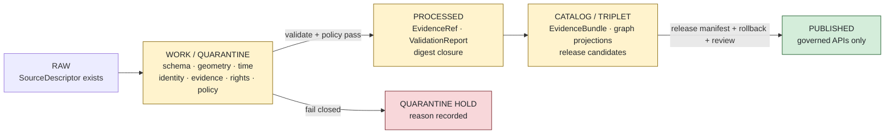
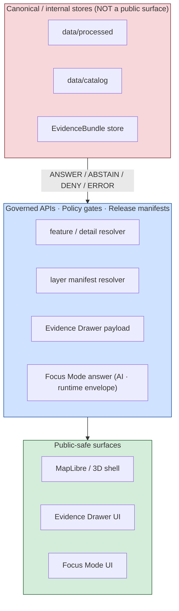
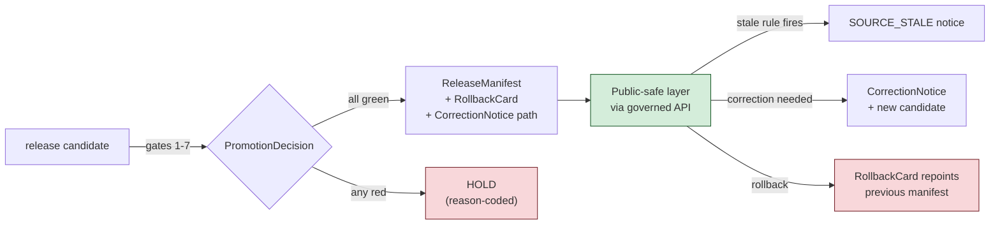

<!-- [KFM_META_BLOCK_V2]
doc_id: kfm://doc/domains/settlements-infrastructure/expansion-plan
title: Settlements / Infrastructure — Expansion Plan
type: standard
version: v0.2
status: draft
owners: <TBD domain steward + docs steward> (NEEDS VERIFICATION)
created: 2026-05-19
updated: 2026-06-08
policy_label: public
related:
  - ai-build-operating-contract.md
  - docs/doctrine/directory-rules.md
  - docs/registers/VERIFICATION_BACKLOG.md
  - docs/registers/DRIFT_REGISTER.md
  - kfm://atlas/v1.1#ch14-settlements-infrastructure
  - kfm://atlas/v1.1#ch20-5-deny-by-default-register
  - kfm://atlas/v1.1#ch24-5-sensitivity-tier-reference
  - kfm://atlas/v1.1#ch24-13-atlas-dossier-root-crosswalk
tags: [kfm, domain, settlements, infrastructure, expansion-plan]
notes:
  - "CONTRACT_VERSION pinned to 3.0.0 per ai-build-operating-contract.md authority."
  - "Path home (PROPOSED): docs/domains/settlements-infrastructure/EXPANSION_PLAN.md per Directory Rules v1.3 12 (Domain Placement Law) and 6.1 (docs/ tree lists settlements-infrastructure as a segment)."
  - "Implementation-layer paths, routes, schemas, policies, tests, and CI claims are PROPOSED until verified against a mounted repo."
  - "CONFLICTED: lane segment naming. Directory Rules 6.1/6.4 trees use domains/<domain>/ and schemas/contracts/v1/domains/<domain>/; Atlas 24.13 row 14 uses flat contracts/settlement/ and schemas/contracts/v1/settlement/. Surfaced as ADR-S-SETTLE-01; mapped to Atlas open-ADR ADR-S-01/ADR-S-02 and ADR-0001."
[/KFM_META_BLOCK_V2] -->

# Settlements / Infrastructure — Expansion Plan

> Governed, evidence-first roadmap for bringing the Settlements / Infrastructure lane through `RAW → WORK / QUARANTINE → PROCESSED → CATALOG / TRIPLET → PUBLISHED` with deny-by-default protection for critical-asset detail.

<!-- Badges: placeholders until CI/registry targets are wired. -->


-red)


| Field | Value |
|---|---|
| **Status** | Draft (Phase-1 documentation control plane) |
| **Owners** | `<TBD>` domain steward + docs steward · **NEEDS VERIFICATION** |
| **Doctrinal authority** | KFM Domains Atlas v1.1, Ch. 14 — Settlements / Infrastructure; §20.5 Deny-by-Default Register; §24.5 Sensitivity / Rights Tier Reference; §24.13 Atlas ↔ Dossier ↔ Responsibility-Root Crosswalk; Directory Rules **v1.3** §12 |
| **Operating contract** | `ai-build-operating-contract.md`, `CONTRACT_VERSION = "3.0.0"` |
| **Repo evidence** | Not mounted this session — all repo-state claims **PROPOSED / NEEDS VERIFICATION** |
| **Last updated** | 2026-06-08 |

---

## 📑 Contents

1. [Purpose & scope](#1-purpose--scope)
2. [Doctrinal anchor](#2-doctrinal-anchor)
3. [What this lane owns (and does not)](#3-what-this-lane-owns-and-does-not)
4. [Repo fit — responsibility-root layout](#4-repo-fit--responsibility-root-layout)
5. [Proposed lane directory tree](#5-proposed-lane-directory-tree)
6. [Architecture — lifecycle, trust membrane, governed APIs](#6-architecture--lifecycle-trust-membrane-governed-apis)
7. [Expansion phases](#7-expansion-phases)
8. [Object-family rollout](#8-object-family-rollout)
9. [Source-family activation matrix](#9-source-family-activation-matrix)
10. [Sensitivity & publication posture](#10-sensitivity--publication-posture)
11. [Cross-lane relations](#11-cross-lane-relations)
12. [Map & viewing products](#12-map--viewing-products)
13. [Validators, tests, fixtures](#13-validators-tests-fixtures)
14. [Governed AI behavior](#14-governed-ai-behavior)
15. [Publication, correction, rollback](#15-publication-correction-rollback)
16. [Open ADRs & verification backlog](#16-open-adrs--verification-backlog)
17. [Related docs](#17-related-docs)

---

## 1. Purpose & scope

This **Expansion Plan** is the lane-level roadmap for the Settlements / Infrastructure domain. It translates the domain's doctrinal A–N template (Atlas v1.1 Ch. 14) into a **phased, reversible, evidence-bearing expansion** across the KFM responsibility roots — without claiming any of the implementation already exists.

It exists to:

- Make the lane's **scope, boundary, and non-ownership** legible to reviewers.
- Sequence the lane's work so that **governance precedes generation**: source ledger → schemas → fixtures → validators → policy → catalog/proof → release.
- Surface every **deny-by-default** posture (critical assets, dependencies, condition detail — Atlas §20.5, T4 per §24.5) before any public-safe layer ships.
- Keep every implementation-layer claim labeled `PROPOSED` / `NEEDS VERIFICATION` until repo evidence resolves it.

> [!IMPORTANT]
> This is doctrine-grounded planning, not a status report. **No file path, schema name, route, policy bundle, test command, or CI workflow listed below has been verified against a mounted repository in this session.** Treat every concrete path as `PROPOSED` and open a verification entry before quoting it elsewhere.

[↑ Back to top](#-contents)

---

## 2. Doctrinal anchor

| Layer | Source | Status |
|---|---|---|
| Domain identity (one-line purpose) | Atlas v1.1 Ch. 14 §A | **CONFIRMED doctrine** |
| Scope, boundary, non-ownership | Atlas v1.1 Ch. 14 §B | **CONFIRMED doctrine** |
| Ubiquitous language | Atlas v1.1 Ch. 14 §C; `[DDD]` Reference | **CONFIRMED terms / PROPOSED field realization** |
| Key source families | Atlas v1.1 Ch. 14 §D | **CONFIRMED list / NEEDS VERIFICATION rights & cadence** |
| Object families | Atlas v1.1 Ch. 14 §E; Atlas Appendix C / §24.14 | **CONFIRMED spine / PROPOSED identity rules** |
| Cross-lane relations | Atlas v1.1 Ch. 14 §F | **CONFIRMED relation classes / PROPOSED constraints** |
| Map & viewing products | Atlas v1.1 Ch. 14 §G | **PROPOSED lane products / CONFIRMED cross-cutting doctrine** |
| Pipeline shape | Atlas v1.1 Ch. 14 §H; Directory Rules §9 lifecycle invariant | **CONFIRMED doctrine / PROPOSED lane application** |
| Sensitivity, rights, publication posture | Atlas v1.1 Ch. 14 §I; §20.5 Deny-by-Default Register; §24.5 Tier matrix | **CONFIRMED doctrine / PROPOSED enforcement** |
| API / contract / schema surfaces | Atlas v1.1 Ch. 14 §J | **PROPOSED routes, schema homes** |
| Validators, tests, fixtures | Atlas v1.1 Ch. 14 §K | **PROPOSED** |
| Governed AI behavior | Atlas v1.1 Ch. 14 §L; `[GAI]` | **CONFIRMED doctrine / PROPOSED implementation** |
| Publication, correction, rollback | Atlas v1.1 Ch. 14 §M; Atlas Appendix E | **CONFIRMED doctrine / PROPOSED implementation** |
| Verification backlog | Atlas v1.1 Ch. 14 §N | **NEEDS VERIFICATION** |
| Responsibility-root crosswalk | Atlas v1.1 §24.13 row 14; Encyclopedia README §7.12 | **PROPOSED root assignments** |
| Domain-as-lane placement | Directory Rules **v1.3** §12 Domain Placement Law (lists `settlements-infrastructure` among domain segments); §6.1 `docs/` tree | **CONFIRMED rule / PROPOSED presence** |

[↑ Back to top](#-contents)

---

## 3. What this lane owns (and does not)

**CONFIRMED / PROPOSED** — Atlas v1.1 Ch. 14 §B.

### 3.1 Owned object families

| Class | Members |
|---|---|
| Settlement objects | Settlement · Municipality · CensusPlace · Townsite · GhostTown · Fort · Mission · ReservationCommunity |
| Infrastructure objects | Infrastructure Asset · Network Node · Network Segment · Facility · Service Area · Operator |
| Operational evidence | Condition Observation · Dependency |
| Public-safe derivatives | Public-safe representations of any of the above (subject to §10 sensitivity posture) |

### 3.2 Explicit non-ownership

> [!NOTE]
> The lane's authority **stops at the boundaries below**. Cross-lane evidence is consumed via governed interfaces; ownership is not duplicated.

| The lane **does not** own | Owning lane |
|---|---|
| Transport routes (road / rail segments, corridors, route memberships) | Roads / Rail `[DOM-ROADS]` |
| Water evidence (streamflow, gauge, NFHL flood) | Hydrology `[DOM-HYD]` |
| Hazard events, warnings, advisories, declarations | Hazards `[DOM-HAZ]` |
| Parcel ownership, living-person privacy, person↔parcel joins | People / DNA / Land `[DOM-PEOPLE]` |

[↑ Back to top](#-contents)

---

## 4. Repo fit — responsibility-root layout

**CONFIRMED rule (Directory Rules v1.3 §12) / PROPOSED path presence.** Files for this domain are distributed across responsibility roots as a **lane segment**, never as a root-level domain folder. The mapping below follows §12 (Domain Placement Law) and the §24.13 row 14 crosswalk.

| Responsibility root | Settlements / Infrastructure lane segment | Purpose |
|---|---|---|
| `docs/` | `docs/domains/settlements-infrastructure/` | Human-facing lane doctrine, runbooks, expansion plan (this file). **CONFIRMED segment form** — Directory Rules §6.1 `docs/` tree lists `settlements-infrastructure/`. |
| `contracts/` | `contracts/settlement/` *(§24.13)* **vs** `contracts/domains/settlements-infrastructure/` *(§12 pattern)* | Object **meaning** (semantic contracts). **CONFLICTED — ADR required** to resolve segment name. See §16 `ADR-S-SETTLE-01`. |
| `schemas/` | `schemas/contracts/v1/settlement/` *(§24.13)* **vs** `schemas/contracts/v1/domains/settlements-infrastructure/` *(§6.4 tree)* | Machine-checkable **shape**. **CONFLICTED — ADR required**; ADR-0001 schema-home rule applies. |
| `policy/` | `policy/sensitivity/infrastructure/` *(§24.13, CONFIRMED form)* + `policy/domains/settlements-infrastructure/` | Allow / deny / restrict / abstain / review decisions; critical-asset deny lane. |
| `tests/` | `tests/domains/settlements-infrastructure/` | Enforceability proof for the lane's validators and policy. |
| `fixtures/` | `fixtures/domains/settlements-infrastructure/` | Golden / valid / invalid fixtures (no-network). |
| `pipelines/` | `pipelines/domains/settlements-infrastructure/` | Executable pipeline logic per source family. |
| `pipeline_specs/` | `pipeline_specs/settlements-infrastructure/` | Declarative pipeline config. |
| `connectors/` | `connectors/settlements-infrastructure/<source>/` | Source-specific fetchers / admitters (one per source family). |
| `packages/` | `packages/domains/settlements-infrastructure/` *(if shared library is justified)* | Shared lane libraries — only when ≥2 deployables consume them. |
| `data/` | `data/{raw\|work\|quarantine\|processed}/settlements-infrastructure/`<br>`data/catalog/domain/settlements-infrastructure/`<br>`data/published/layers/settlements-infrastructure/`<br>`data/registry/sources/settlements-infrastructure/` | Lifecycle data and emitted proof. |
| `release/` | `release/candidates/settlements-infrastructure/` | Release decisions, manifests, rollback cards. |

> [!WARNING]
> **Segment naming is unresolved (CONFLICTED).** Directory Rules v1.3 expresses domain files as `domains/<domain>/` segments — its own `docs/` tree (§6.1) lists `settlements-infrastructure/`, and its `schemas/` tree (§6.4) uses `schemas/contracts/v1/domains/<domain>/`. Atlas §24.13 row 14 instead lists flat short-name roots: `schemas/contracts/v1/settlement/`, `contracts/settlement/`, `policy/sensitivity/infrastructure/`. The `policy/sensitivity/infrastructure/` form is consistent across both. The `contracts/` and `schemas/` segment names are **not**. This is a **drift candidate** requiring an ADR. See [§16](#16-open-adrs--verification-backlog) — `ADR-S-SETTLE-01: Lane segment naming` (maps to Atlas open-ADR `ADR-S-01` schema home / `ADR-S-02` artifact placement, and `ADR-0001`). File a `docs/registers/DRIFT_REGISTER.md` entry per Directory Rules §2.5 until resolved.

[↑ Back to top](#-contents)

---

## 5. Proposed lane directory tree

> [!NOTE]
> **PROPOSED tree.** No path below has been verified against a mounted repo. Use as a planning sketch, not a repo description. Contract / schema segment names shown in the **§24.13 flat form** pending `ADR-S-SETTLE-01`; the §12/§6.4 `domains/<domain>/` form is the alternative under that ADR.

```text
# Authority-bearing lanes (governance, contracts, policy)
docs/domains/settlements-infrastructure/
├── README.md                        # PROPOSED — lane landing doc
├── EXPANSION_PLAN.md                # this file
├── SOURCE_FAMILIES.md               # PROPOSED — one row per source family from §D
├── DENY_BY_DEFAULT.md               # PROPOSED — critical-asset deny posture detail

docs/runbooks/settlements-infrastructure/      # Pattern A (Directory Rules §6.1.b; recommended pending OPEN-DR-02)
└── SOURCE_REFRESH_RUNBOOK.md        # PROPOSED — refresh lifecycle per source

contracts/settlement/                # §24.13 form  (CONFLICTED vs contracts/domains/settlements-infrastructure/)
├── settlement.contract.md
├── municipality.contract.md
├── census-place.contract.md
├── townsite.contract.md
├── ghost-town.contract.md
├── fort.contract.md
├── mission.contract.md
├── reservation-community.contract.md
├── infrastructure-asset.contract.md
├── network-node.contract.md
├── network-segment.contract.md
├── facility.contract.md
├── service-area.contract.md
├── operator.contract.md
├── condition-observation.contract.md
└── dependency.contract.md

schemas/contracts/v1/settlement/     # §24.13 form  (CONFLICTED vs .../domains/settlements-infrastructure/)
├── settlement.schema.json
├── municipality.schema.json
├── …
└── _shared/
    └── public-safe-derivative.schema.json

policy/
├── domains/settlements-infrastructure/
│   ├── source-admission.rego
│   ├── municipality-evidence.rego
│   └── census-vs-municipality.rego
└── sensitivity/infrastructure/      # CONFIRMED form (§24.13)
    ├── critical-asset-deny.rego
    ├── condition-detail-deny.rego
    └── dependency-graph-deny.rego

# Lifecycle, validation, release
tests/domains/settlements-infrastructure/
fixtures/domains/settlements-infrastructure/
pipelines/domains/settlements-infrastructure/
pipeline_specs/settlements-infrastructure/
connectors/settlements-infrastructure/{tiger,gnis,kansas-geoportal,kdot,fema,…}/

data/raw/settlements-infrastructure/
data/work/settlements-infrastructure/
data/quarantine/settlements-infrastructure/
data/processed/settlements-infrastructure/
data/catalog/domain/settlements-infrastructure/
data/published/layers/settlements-infrastructure/
data/registry/sources/settlements-infrastructure/

release/candidates/settlements-infrastructure/
```

> [!NOTE]
> **Runbook placement corrected.** The runbook now sits at `docs/runbooks/settlements-infrastructure/` (Pattern A), not under `docs/domains/.../runbooks/`. Directory Rules §6.1.b makes `docs/runbooks/<domain>/` the recommended (Pattern A) home; co-locating runbooks under `docs/domains/` would split the operational-procedure responsibility. Subfolder-vs-flat is OPEN-DR-02 (ADR pending); Pattern A is recommended for any domain that already has a domain-segmented runbook.

[↑ Back to top](#-contents)

---

## 6. Architecture — lifecycle, trust membrane, governed APIs

**CONFIRMED doctrine / PROPOSED lane application** — Atlas v1.1 Ch. 14 §H, §J; Directory Rules §9.

### 6.1 Lifecycle and gates



> [!IMPORTANT]
> **Promotion is a governed state transition, not a file move** (Directory Rules §9, lifecycle invariant). The lane never advances an object by copy/rename; it advances by `PromotionDecision` against the gates above.

### 6.2 Trust membrane (public surfaces)



> [!NOTE]
> **MapLibre is the sole browser renderer** (`packages/maplibre-runtime/`, per Directory Rules v1.3 §18.e OPEN-DR-10/12 and `maplibre-3d.md`). The map-shell node above is a public-safe consumer of governed APIs, never a direct reader of canonical stores.

### 6.3 PROPOSED API / contract / schema surfaces

CONFIRMED from Atlas v1.1 Ch. 14 §J (finite outcomes and DTO names); routes PROPOSED.

| Endpoint or artifact | DTO / schema (PROPOSED) | Finite outcomes | Status |
|---|---|---|---|
| Settlements / Infrastructure feature/detail resolver | `SettlementsInfrastructureDecisionEnvelope` | `ANSWER` / `ABSTAIN` / `DENY` / `ERROR` | **PROPOSED** — exact route **UNKNOWN** |
| Settlements / Infrastructure layer manifest resolver | `LayerManifest` / domain layer descriptor | `ANSWER` / `DENY` / `ERROR` | **PROPOSED** — public-safe release only |
| Evidence Drawer payload | `EvidenceDrawerPayload` + `EvidenceBundle` projection | `ANSWER` / `ABSTAIN` / `DENY` / `ERROR` | **PROPOSED** — evidence + policy filtered |
| Focus Mode answer | `RuntimeResponseEnvelope` + `AIReceipt` | `ANSWER` / `ABSTAIN` / `DENY` / `ERROR` | **PROPOSED** — AI is never root truth |
| Schema home | `schemas/contracts/v1/…` *(segment CONFLICTED — see §16)* | finite validator outcomes | **PROPOSED** — pending ADR-0001 application |

[↑ Back to top](#-contents)

---

## 7. Expansion phases

> [!NOTE]
> Phase ordering mirrors the governance-before-features sequence in Atlas v1.1 §21 (Programming Possibilities Backlog & Roadmap: source ledger → schemas → fixtures → validators → policy gates → EvidenceBundle closure → finite envelopes → release manifests → correction path → rollback targets). Any cross-reference to repo-wide Greenfield/Phase-numbered schedules is **NEEDS VERIFICATION** against a mounted repo; lane phases below sequence work **within** whatever repo-wide schedule is in force.

| # | Phase | Goal | Exit criteria | Rollback / fail-safe |
|---|---|---|---|---|
| **0** | Lane evidence inventory | Inventory branch state, existing settlement/infrastructure files, source-ledger entries, schemas, policies, tests, CI workflows, manifests, logs. | Inventory file in `docs/registers/VERIFICATION_BACKLOG.md`; gaps labeled **UNKNOWN** / **NEEDS VERIFICATION**. | No claim of lane maturity emitted. |
| **1** | Documentation control plane | Author lane README, this Expansion Plan, `SOURCE_FAMILIES.md`, `DENY_BY_DEFAULT.md`, ADR drafts (segment naming, deny posture). | Lane docs present and link from `docs/domains/README.md`; ADRs filed as `proposed`. | Revert doc PRs and append correction note. |
| **2** | Shared schemas & fixtures (no-network) | Author lane schemas under `schemas/contracts/v1/…` (segment per `ADR-S-SETTLE-01`); add valid/invalid fixtures for each object family. | Each object family has shape + 1 valid + ≥2 invalid fixtures; CI runs no-network. | Remove schema wave if ADR rejected. |
| **3** | Validators & policy gates | Wire reason-coded `DENY` / `ABSTAIN` / `ERROR` / `HOLD` outcomes for legal-municipality evidence, census-vs-municipality, infrastructure topology, condition-`observed_at`, restricted-geometry no-leak, catalog/proof closure. | All §13 tests green against fixtures. | Disable a gate only if a stronger gate replaces it. |
| **4** | No-network query→save→recompile dry run | Run a synthetic SourceDescriptor → WORK → PROCESSED loop on Townsite + Infrastructure Asset fixtures; emit `ValidationReport`, `EvidenceRef`, `RunReceipt` — **no `PUBLISHED` target**. | Loop produces receipts; no public layer emitted. | Loop is internal only; no rollback needed. |
| **5** | First proof-bearing thin slice — **Townsites / GhostTowns** | Public-safe historical-townsite slice: GNIS + historical gazetteer fixture → `EvidenceBundle` → catalog → release candidate → Evidence Drawer payload. | `ReleaseManifest`, `EvidenceBundle`, `ValidationReport`, `RollbackCard` all present; sensitive-asset gate proves DENY on critical-infra fixture. | `RollbackCard` repoints release; manifest history retained. |
| **6** | Municipality + CensusPlace + legal-status events | Census TIGER + municipal-legal fixture → Municipality & CensusPlace public-safe layer with legal-status-event timeline. | Legal-municipality evidence test passes; census-vs-municipality distinction enforced. | Disable layer if legal-source rights are unresolved. |
| **7** | Infrastructure Assets — public-safe generalization only | Public-safe asset view backed by generalization receipts; critical-asset attributes and condition detail remain **DENY by default (T4)**. | Critical-asset deny fixture passes; vector-tile attribute whitelist enforced; `RedactionReceipt`s emitted. | Pull layer from publication if any leak fixture fails. |
| **8** | Service Area + Operator + Dependency aggregates | Aggregate views (service-area, dependency-summary) with stewardship review; **no exact infrastructure exposure** in public surfaces. | Steward review record + `EvidenceBundle` + `AggregationReceipt`. | Tombstone aggregate; rollback to prior manifest. |
| **9** | Cross-lane joins | Wire governed joins to Roads/Rail (depot/bridge/crossing), Hazards (exposure), Hydrology (water/wastewater/floodplain), People/Land (residence/parcel) — each preserving ownership, source role, sensitivity, and `EvidenceBundle` support. | Cross-lane relation tests pass; person↔parcel join denied by default. | Drop the join; preserve unilateral layers. |
| **10** | Focus Mode / governed AI | Wire `RuntimeResponseEnvelope` + `AIReceipt` for the lane; `ABSTAIN` when `EvidenceBundle` missing, `DENY` when sensitivity/release blocks. | AI surface returns finite outcomes only; no uncited claims. | Disable Focus Mode for lane while keeping read-only layers. |

> [!TIP]
> Phases 0–4 are **reversible by `git revert`**. Phases 5+ become reversible by **`RollbackCard` + `ReleaseManifest` history** — preserve both before promoting any candidate.

[↑ Back to top](#-contents)

---

## 8. Object-family rollout

**CONFIRMED spine (Atlas v1.1 Ch. 14 §E) / PROPOSED identity rules and field realizations.**

Identity rule (CONFIRMED candidate basis for the whole lane): `source id + object role + temporal scope + normalized digest`.
Temporal handling (CONFIRMED): source, observed, valid, retrieval, release, and correction times stay distinct where material.

| Object family | First needed in phase | Primary source families | Public-safe default | Notes |
|---|---|---|---|---|
| **Settlement** | 5–6 | TIGER · GNIS · historical gazetteers · municipal-legal | Public-safe geometry + name + period | Generic settlement umbrella. |
| **Municipality** | 6 | Census TIGER · municipal-legal · state/local GIS | Public-safe boundary + legal-status events | Distinct from CensusPlace; legal-source rights **NEEDS VERIFICATION**. |
| **CensusPlace** | 6 | Census TIGER · Census decennial/ACS | Public-safe boundary + vintage | Census-vs-municipality distinction enforced by validator. |
| **Townsite** | 5 | Historical gazetteers · historical maps · GNIS | Public-safe historic geometry + period | Anchor case for thin slice. |
| **GhostTown** | 5 | Historical gazetteers · GNIS · county histories | Public-safe historic geometry + abandonment evidence | Pairs with Townsite slice. |
| **Fort** | 6–7 | Historical sources · GNIS · state/local GIS | Public-safe geometry + period | May overlap with Archaeology lane — see §11. |
| **Mission** | 6–7 | Historical sources · GNIS | Public-safe geometry + period | May overlap with Archaeology lane — see §11. |
| **ReservationCommunity** | 6–7 | State/local GIS · federal sources · municipal-legal | **Steward / sovereignty review required** before publication | Sovereignty review path; defer to People/Land for individual-level joins. |
| **Infrastructure Asset** | 7 | State/local GIS · operators · KDOT · FEMA | **DENY exact (T4) / publish generalized only** | Critical-asset deny lane. |
| **Network Node** | 7–8 | State/local GIS · operators · KDOT | **DENY exact (T4) / aggregate only** | Topology shape may publish; identifiers may not. |
| **Network Segment** | 7–8 | State/local GIS · operators · KDOT | **DENY exact (T4) / aggregate only** | Distinct from Roads/Rail network segments — see §11. |
| **Facility** | 7 | Operators · state/local GIS · KDOT | **DENY exact location for critical facilities** | Facility-class table required (PROPOSED). |
| **Service Area** | 8 | Operators · state/local GIS | Aggregate-only | `AggregationReceipt` required. |
| **Operator** | 8 | Operators · state/local GIS · municipal-legal | Identity may publish; sensitive ops detail **DENY (T4)** | Operator-sensitive joins fail closed. |
| **Condition Observation** | 7–8 | Operators · KDOT · FEMA | **DENY by default (T4)** (condition detail) | Steward review per release; §24.5: T3 to named authorities only. |
| **Dependency** | 8 | Operators · state/local GIS | **DENY by default (T4)** (dependency graph) | Dependency-summary aggregate only. |

[↑ Back to top](#-contents)

---

## 9. Source-family activation matrix

**CONFIRMED list (Atlas v1.1 Ch. 14 §D) / NEEDS VERIFICATION** on rights, current terms, and source-specific cadence. Sensitive joins **fail closed** in every row.

| Source family | Primary role | Earliest phase | Rights & terms | Freshness | Status |
|---|---|---|---|---|---|
| Census TIGER / census-place geography | authority / observation / context / model | 6 | **NEEDS VERIFICATION** | source-vintage / decennial | `[DOM-SETTLE] [ENCY]` |
| GNIS and gazetteers | authority / observation / context / model | 5–6 | **NEEDS VERIFICATION** | source-vintage | `[DOM-SETTLE] [ENCY]` |
| State / local GIS — Kansas Geoportal-style | authority / observation / context / model | 5–7 | **NEEDS VERIFICATION** | source-vintage / cadence-specific | `[DOM-SETTLE] [ENCY]` |
| Municipal and local legal records | authority (legal source role) | 6 | **NEEDS VERIFICATION** — legal source-role definition open | source-event-driven | `[DOM-SETTLE] [ENCY]` |
| Historical gazetteers and maps | historical / observation / context | 5 | **NEEDS VERIFICATION** | source-vintage | `[DOM-SETTLE] [ENCY]` |
| Infrastructure operators and providers | observation / operator-sensitive | 7–8 | **NEEDS VERIFICATION** — operator agreements likely required | cadence-specific | `[DOM-SETTLE] [ENCY]` · **deny-by-default (T4) for sensitive detail** |
| KDOT / bridge / facility sources | authority / observation | 7 | **NEEDS VERIFICATION** | source-vintage / cadence-specific | `[DOM-SETTLE] [ENCY]` — condition observations restricted (T4) |
| FEMA / hazards / resilience sources | context (exposure side) | 7 | **NEEDS VERIFICATION** | event-driven / cadence-specific | `[DOM-SETTLE] [ENCY]` — Hazards lane owns events; this lane consumes exposure context. |

[↑ Back to top](#-contents)

---

## 10. Sensitivity & publication posture

**CONFIRMED doctrine** — Atlas v1.1 §20.5 row "Infrastructure", Ch. 14 §I, and §24.5 per-domain tier matrix.

> [!CAUTION]
> **Critical infrastructure, utilities, condition observations, dependencies, operator-sensitive details, and exact facility geometry default to `restricted` or `review`** (Atlas §20.5). Per the §24.5 tier matrix, **critical-asset detail and condition/vulnerability default to tier T4 (Denied)**. Unclear rights, unresolved source role, missing evidence, unresolved sensitivity, or absent release state **blocks** public promotion.

### 10.1 Lane sensitivity tier baseline

The lane's baseline tier is **T2** with a **critical-asset deny lane** (Encyclopedia README §7.12). Most settlement/place objects are public-safe (T0–T2 after vintage/precision flagging); the deny-class objects below sit at **T4** and require recorded transforms to descend.

### 10.2 Per-class posture (aligned to Atlas §24.5)

| Class | Canonical tier | Default | Allowed only when | Receipt required |
|---|---|---|---|---|
| Exact critical-asset geometry / asset detail | **T4** | **DENY** | steward review + public-safe generalization → T1 | `RedactionReceipt` + `EvidenceBundle` |
| Critical-asset attributes (capacity, vulnerabilities, condition) | **T4** | **DENY** | T3 to named authorities only; never T0/T1 raw | steward review + named-party agreement |
| Network topology (exact) | **T4** | **DENY** | aggregate-only derivative | `AggregationReceipt` |
| Dependency graphs (asset-to-asset) | **T4** | **DENY** | dependency-summary aggregate | `AggregationReceipt` |
| Operator-sensitive ops detail | **T4** | **DENY** | consent + agreement + restricted authorized surface | `PolicyDecision` + `EvidenceBundle` |
| Reservation-community boundaries | **T4 → REVIEW** | **ABSTAIN / DENY** (sovereignty) | tribal-government source OR federal-recognized dataset + sovereignty review | `ReviewRecord` + `EvidenceBundle` |
| Townsite / GhostTown historic geometry (non-sovereignty-adjacent) | **T1** | **ALLOW** when evidence + period known | `EvidenceBundle` resolves; `source_role = historical` | `EvidenceBundle` |
| Public-safe Municipality / CensusPlace boundaries | **T0–T1** | **ALLOW** when source rights resolved | `EvidenceBundle` + rights resolution | `EvidenceBundle` |

> [!NOTE]
> **Tier transitions are reversible** (Atlas §24.5). `T4 → T1` requires `RedactionReceipt + ReviewRecord`; a `CorrectionNotice` may demote a published `T1` back to `T4`. This reversibility is the rollback basis for Phase 7–8 deny-class layers.

**Deny-by-default register cross-link:** Atlas v1.1 §20.5 row `Infrastructure` — "critical assets, dependencies, condition detail" denied unless "steward review + public-safe generalization" applies.

[↑ Back to top](#-contents)

---

## 11. Cross-lane relations

**CONFIRMED / PROPOSED** — Atlas v1.1 Ch. 14 §F. Every relation must preserve ownership, source role, sensitivity, and `EvidenceBundle` support.

| Related lane | Relation type | Constraint | Lane that owns the related object |
|---|---|---|---|
| Roads / Rail | depot · bridge · crossing · transport facility | Settlement/Infra references; route truth stays in Roads/Rail | `[DOM-ROADS]` |
| Hazards | exposure · resilience · warnings · declarations | KFM is **never** an alert authority (Atlas §20.5); Hazards owns events | `[DOM-HAZ]` |
| Hydrology | water · wastewater · stormwater · floodplain · drainage | Water evidence stays in Hydrology; floodplain joins resolve to `NFHL zone` (Hydrology-owned, T0 regulatory) | `[DOM-HYD]` |
| People / Land | residence · ownership · parcel · migration context | Person↔parcel joins **deny by default (T4)**; living-person privacy lives in People/Land | `[DOM-PEOPLE]` |

> [!NOTE]
> **Adjacent-lane caution:** Forts and Missions overlap with Archaeology / Cultural Heritage (`[DOM-ARCH]`). When an object is also an archaeological site, defer site-coordinate sensitivity to Archaeology's deny defaults (Atlas §20.5 row Archaeology — site coords DENY, sovereignty review); this lane retains the settlement-role projection only.

[↑ Back to top](#-contents)

---

## 12. Map & viewing products

**PROPOSED lane products** (Atlas v1.1 Ch. 14 §G — eight products) over the **CONFIRMED cross-cutting doctrine** (Evidence Drawer, time-aware state, trust badges, sensitivity-redacted view, correction/stale-state view, governed Focus Mode — `[MAP-MASTER]` / `[GAI]`).

| Product | Phase | Public surface | Sensitivity note |
|---|---|---|---|
| Current settlement view | 6 | MapLibre layer + Evidence Drawer | Public-safe geometry only |
| Historic townsite view | 5 | MapLibre time-aware layer | Period evidence required |
| Legal-status event view | 6 | Timeline + Evidence Drawer | Municipal-legal source role required |
| Census-place comparison | 6 | MapLibre + vintage selector | Census vintage stamp required |
| Public-safe asset view | 7 | MapLibre + generalization | **Deny exact (T4)** — `RedactionReceipt` required |
| Service-area aggregate view | 8 | MapLibre + `AggregationReceipt` | Aggregate-only |
| Dependency-summary view | 8 | Evidence Drawer + aggregate | Aggregate-only; deny graph |
| Restricted internal review view | — | Authorized surface only | Never reachable on public path; explicit non-public release class |

[↑ Back to top](#-contents)

---

## 13. Validators, tests, fixtures

**PROPOSED tests (Atlas v1.1 Ch. 14 §K).** All test outcomes are reason-coded into finite outcomes (`ANSWER` / `ABSTAIN` / `DENY` / `ERROR` / `HOLD`).

<details>
<summary><strong>Lane test register</strong> (PROPOSED)</summary>

| Test | Object families covered | Phase | Expected failure mode |
|---|---|---|---|
| Legal municipality evidence test | Municipality, CensusPlace | 6 | `HOLD` until legal source role resolves |
| Census-vs-municipality distinction | Municipality, CensusPlace | 6 | `ERROR` on confused identity |
| Infrastructure topology test | Network Node, Network Segment, Facility | 7–8 | `ERROR` on broken connectivity |
| Condition `observed_at` test | Condition Observation | 7–8 | `ERROR` on missing / out-of-range time |
| Restricted geometry no-leak test | Infrastructure Asset, Facility, Network Node/Segment, Dependency | 7+ | `DENY` if exact geometry / attribute leaks |
| Catalog / proof / release closure test | All public-safe layers | 5+ | `HOLD` on digest mismatch or missing rollback target |
| Cross-lane ownership-preservation test | All cross-lane relations | 9 | `DENY` if ownership/source-role/sensitivity not preserved |
| Generalization-receipt test | Public-safe asset view | 7 | `DENY` if `RedactionReceipt` absent or transform unrecorded |

</details>

[↑ Back to top](#-contents)

---

## 14. Governed AI behavior

**CONFIRMED doctrine / PROPOSED implementation** — Atlas v1.1 Ch. 14 §L; `[GAI]`.

| AI behavior | When | Outcome |
|---|---|---|
| Summarize released Settlements / Infrastructure `EvidenceBundle`s | `EvidenceBundle` resolves and policy allows | `ANSWER` + `AIReceipt` |
| Compare evidence across sources | Two or more bundles resolved | `ANSWER` + `AIReceipt` |
| Explain limitations / uncertainty | Evidence partial or stale | `ANSWER` with bounded confidence |
| Draft steward-review notes | Authorized review surface only | `ANSWER` on review surface |
| Insufficient evidence | `EvidenceRef` does not resolve | `ABSTAIN` + `AIReceipt` |
| Policy / rights / sensitivity / release blocks request | Any deny condition | `DENY` + `AIReceipt` (reason-coded) |
| Uncited generation | Always | **Forbidden** — never returned to public path |

> [!IMPORTANT]
> AI **never** acts as root truth for this lane. Map rendering, scenes, graphs, and Focus Mode text are downstream carriers of `EvidenceBundle`, never substitutes for it.

[↑ Back to top](#-contents)

---

## 15. Publication, correction, rollback

**CONFIRMED doctrine / PROPOSED implementation** — Atlas v1.1 Ch. 14 §M; Atlas Appendix E.

Every public-safe release in this lane requires **all** of:

1. `ReleaseManifest` (release decision + digest closure)
2. Resolved `EvidenceBundle` (every public claim resolves)
3. `ValidationReport` + `PolicyDecision` (validation + policy support)
4. `ReviewRecord` where the §10 sensitivity matrix requires one (critical-asset, reservation-community, operator-sensitive)
5. **Correction path** (`CorrectionNotice`) declared in the manifest
6. **Stale-state rule** declared (`SOURCE_STALE` trigger — when does the layer go stale?)
7. `RollbackCard` identifying the rollback target



[↑ Back to top](#-contents)

---

## 16. Open ADRs & verification backlog

### 16.1 Proposed ADRs surfaced by this lane

| ADR (PROPOSED) | Question | Affects | Maps to Atlas open-ADR |
|---|---|---|---|
| `ADR-S-SETTLE-01` — Lane segment naming **(CONFLICTED)** | Resolve `domains/settlements-infrastructure/` (§12 / §6.1 / §6.4 trees) vs. `settlement/` (§24.13 row 14) for `contracts/` and `schemas/contracts/v1/`. (`policy/sensitivity/infrastructure/` is consistent across both and not in dispute.) | `contracts/` · `schemas/` | `ADR-S-01` (schema home), `ADR-S-02` (artifact placement); `ADR-0001` |
| `ADR-S-SETTLE-02` — Critical-asset deny taxonomy | Define the canonical list of critical-asset classes, denied fields, and allowed public-safe transforms (T4 → T1 path). | `policy/sensitivity/infrastructure/` · `schemas/` | `ADR-S-05` (tier scheme) |
| `ADR-S-SETTLE-03` — Legal municipality source role | Define what counts as a `legal-source-role` for a municipality; clarify rights handling for municipal records. | `contracts/` · `policy/` · source ledger | `ADR-S-04` (source-role vocab) |
| `ADR-S-SETTLE-04` — Reservation-community publication path | Define sovereignty / steward review flow before any ReservationCommunity layer publishes; reuse vs. parallel review queue. | `policy/` · `release/` | `ADR-S-14` (cross-lane join policy) |
| `ADR-S-SETTLE-05` — Cross-lane Fort/Mission overlap | Decide how Fort/Mission objects in this lane defer to Archaeology when an object is also an archaeological site. | `contracts/` · `policy/` | `ADR-S-14` |

### 16.2 Verification backlog (NEEDS VERIFICATION)

CONFIRMED carryover from Atlas v1.1 Ch. 14 §N.

| Item | Evidence that would settle it | Status |
|---|---|---|
| Source rights & municipal legal-source roles | Mounted repo source ledger entries, license assertions, schemas, release manifests | **NEEDS VERIFICATION** |
| Critical-infrastructure policy | Mounted repo `policy/sensitivity/infrastructure/*.rego`, deny fixtures, leak tests | **NEEDS VERIFICATION** |
| Public-safe layer registry | Mounted repo `data/registry/sources/settlements-infrastructure/`, `data/published/layers/settlements-infrastructure/` | **NEEDS VERIFICATION** |
| API & Focus Mode auth / policy behavior | Mounted repo `apps/` / `runtime/` config, route tests, policy outcomes | **NEEDS VERIFICATION** |
| Lane segment naming (resolve §12/§6.4 vs §24.13) | Accepted `ADR-S-SETTLE-01` | **CONFLICTED** until ADR resolves |
| Owners / stewards for this lane | `CODEOWNERS` / steward register | **UNKNOWN** |

[↑ Back to top](#-contents)

---

## 17. Related docs

> [!NOTE]
> Links below are **PROPOSED** repo-relative targets. Validate against repo evidence before publishing externally.

- [`ai-build-operating-contract.md`](../../../ai-build-operating-contract.md) — canonical operating contract, `CONTRACT_VERSION = "3.0.0"`
- [`docs/doctrine/directory-rules.md`](../../doctrine/directory-rules.md) — placement authority, **v1.3** (CONFIRMED rule / PROPOSED presence)
- [`docs/domains/README.md`](../README.md) — domain-lane index *(TODO link target)*
- [`docs/domains/settlements-infrastructure/README.md`](./README.md) — lane landing *(TODO)*
- [`docs/domains/settlements-infrastructure/SOURCE_FAMILIES.md`](./SOURCE_FAMILIES.md) — per-source dossier *(TODO)*
- [`docs/domains/settlements-infrastructure/DENY_BY_DEFAULT.md`](./DENY_BY_DEFAULT.md) — critical-asset deny posture *(TODO)*
- [`docs/runbooks/settlements-infrastructure/SOURCE_REFRESH_RUNBOOK.md`](../../runbooks/settlements-infrastructure/SOURCE_REFRESH_RUNBOOK.md) — source-refresh runbook (Pattern A) *(TODO)*
- [`docs/registers/VERIFICATION_BACKLOG.md`](../../registers/VERIFICATION_BACKLOG.md) *(TODO)*
- [`docs/registers/DRIFT_REGISTER.md`](../../registers/DRIFT_REGISTER.md) *(TODO)*
- Atlas v1.1 Ch. 14 — Settlements / Infrastructure *(in-project reference: `[DOM-SETTLE]` + `[ENCY]`)*
- Atlas v1.1 §20.5 — Deny-by-Default Register and Sensitivity Matrix
- Atlas v1.1 §24.5 — Master Sensitivity / Rights Tier Reference (T0–T4)
- Atlas v1.1 §24.13 — Atlas ↔ Dossier ↔ Responsibility-Root Crosswalk

---

**Last updated:** 2026-06-08 · **Doctrine:** Atlas v1.1 Ch. 14, §20.5, §24.5, §24.13; Directory Rules **v1.3** §9, §12 · `CONTRACT_VERSION = "3.0.0"` · **Implementation:** PROPOSED until mounted-repo verification.

[↑ Back to top](#-contents)
