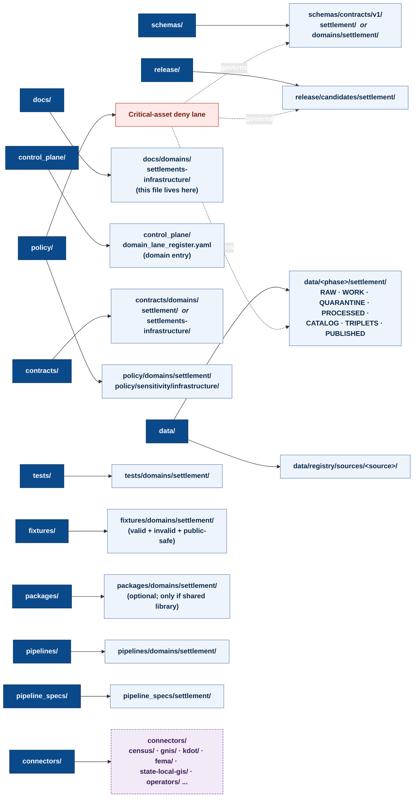

<!-- [KFM_META_BLOCK_V2]
doc_id: kfm://doc/settlements-infrastructure/file-system-plan
title: Settlements & Infrastructure — Domain File-System Plan
type: standard
version: v1-draft
status: draft
owners: <docs steward> / <domain steward — Settlements & Infrastructure>   # PLACEHOLDER — assign before review
created: 2026-05-19
updated: 2026-05-19
policy_label: public
related:
  - docs/doctrine/directory-rules.md
  - docs/domains/README.md
  - docs/standards/PROV.md
  - docs/runbooks/README.md
  - kfm://atlas/domains/v1_1#ch-14-settlements-infrastructure
  - kfm://encyclopedia/§7.12
tags: [kfm, domain, settlements, infrastructure, directory-rules, file-system-plan]
notes:
  - "All concrete paths in this plan are PROPOSED until verified against a mounted repository."
  - "Slug 'settlements-infrastructure/' is grounded in directory-rules.md §6.1; schema-folder variance vs. the Atlas '[DOM-SETTLE] schemas/contracts/v1/settlement/' form is filed as OPEN-FSP-01."
[/KFM_META_BLOCK_V2] -->

# Settlements & Infrastructure — Domain File-System Plan

A responsibility-rooted map of every place files for the **Settlements & Infrastructure** domain are expected to live, what they hold, what they must not hold, and which gates govern them.

[](#status--authority)
[](../../doctrine/directory-rules.md)
[](../../doctrine/truth-posture.md)
[](#7--sensitivity-rights--release-posture)
[](#6--lifecycle--data-lanes)
[](#11--open-questions--verification-backlog)

> **Status · Owners · Updated**
> Status: **draft** · Owners: `<docs steward>` / `<domain steward — Settlements & Infrastructure>` *(placeholder — assign before review)* · Last reviewed: **2026-05-19**

---

## Quick jump

- [1 · Scope](#1--scope)
- [2 · Repo fit](#2--repo-fit)
- [3 · Inputs](#3--inputs-what-belongs-in-this-domain)
- [4 · Exclusions](#4--exclusions-what-does-not-belong-here)
- [5 · Domain file-system map](#5--domain-file-system-map)
- [6 · Lifecycle / data lanes](#6--lifecycle--data-lanes)
- [7 · Sensitivity, rights & release posture](#7--sensitivity-rights--release-posture)
- [8 · Per-lane placement table](#8--per-lane-placement-table)
- [9 · Naming & casing](#9--naming--casing)
- [10 · FAQ](#10--faq)
- [11 · Open questions & verification backlog](#11--open-questions--verification-backlog)
- [12 · Related docs](#12--related-docs)

---

## 1 · Scope

**CONFIRMED doctrine / PROPOSED implementation.** This plan describes where the **Settlements & Infrastructure** domain's files are expected to land across the repository's responsibility roots. It is a *placement* document, not a contract or schema: it tells reviewers and authors *where* a file goes once `contracts/`, `schemas/`, `policy/`, source descriptors, ADRs, and reviews have decided that the file *should* exist.

The plan is governed by:

- The lifecycle invariant **RAW → WORK / QUARANTINE → PROCESSED → CATALOG / TRIPLET → PUBLISHED** *(CONFIRMED doctrine; promotion is a governed state transition, not a file move).*
- The **trust membrane** boundary that prevents raw, unreviewed, restricted, or model-generated state from becoming public truth.
- The **critical-asset deny lane** for this domain *(CONFIRMED doctrine: critical infrastructure, condition observations, dependencies, operator-sensitive details, and exact facility geometry default to T4 — restricted or review)*.

> [!NOTE]
> Every concrete path in this document is **PROPOSED** until verified against a mounted repository. No mounted repo, CI workflow, dashboard, or runtime log was inspected when authoring this plan; placements are grounded in `docs/doctrine/directory-rules.md` and the Domains v1.1 Atlas Ch. 14 only.

[↑ Back to top](#settlements--infrastructure--domain-file-system-plan)

---

## 2 · Repo fit

| Field | Value | Status |
|---|---|---|
| Owning responsibility root for **this file** | `docs/` (human-facing control plane) | CONFIRMED rule [DIRRULES §3, §6.1] |
| Domain segment slug | `settlements-infrastructure/` | CONFIRMED (slug appears in `directory-rules.md` §6.1 `docs/domains/` listing) |
| This file's path | `docs/domains/settlements-infrastructure/FILE_SYSTEM_PLAN.md` | PROPOSED (path home confirmed; filename convention pending §11 OPEN-FSP-02) |
| Upstream doctrine | `docs/doctrine/directory-rules.md`; Domains v1.1 Atlas Ch. 14; KFM Encyclopedia §7.12 | CONFIRMED references |
| Downstream consumers | `docs/domains/settlements-infrastructure/README.md` *(planned)*; per-domain runbooks; per-domain ADRs; reviewers proposing files in this lane | PROPOSED |
| Authority order over conflicts | Per `directory-rules.md` §2.1: KFM invariants → accepted ADRs → Directory Rules → per-root READMEs → dossiers → mounted-repo convention | CONFIRMED |

[↑ Back to top](#settlements--infrastructure--domain-file-system-plan)

---

## 3 · Inputs (what belongs in this domain)

**CONFIRMED scope (object families owned by Settlements & Infrastructure)** *[DOM-SETTLE] [ENCY]*:

| Object family | Purpose (per Atlas Ch. 14 §E) | Identity rule | Status |
|---|---|---|---|
| Settlement | Represents Settlement evidence or released derivative within Settlements/Infrastructure. | PROPOSED deterministic basis: source id + object role + temporal scope + normalized digest. | CONFIRMED doctrine |
| Municipality | Legal-municipality evidence or derivative. | Same identity rule. | CONFIRMED doctrine |
| CensusPlace | Census-place geography evidence or derivative. | Same identity rule. | CONFIRMED doctrine |
| Townsite | Historic townsite evidence or derivative. | Same identity rule. | CONFIRMED doctrine |
| GhostTown | Ghost-town evidence or derivative. | Same identity rule. | CONFIRMED doctrine |
| Fort | Fort evidence or derivative. | Same identity rule. | CONFIRMED doctrine |
| Mission | Mission evidence or derivative. | Same identity rule. | CONFIRMED doctrine |
| ReservationCommunity | Reservation-community evidence or derivative. | Same identity rule. | CONFIRMED doctrine |
| Infrastructure Asset | Infrastructure-asset evidence or derivative. | Same identity rule. | CONFIRMED doctrine |
| Network Node | Network-node evidence or derivative. | Same identity rule. | CONFIRMED doctrine |
| Network Segment | Network-segment evidence or derivative. | Same identity rule. | CONFIRMED doctrine |
| Facility | Facility evidence or derivative. | Same identity rule. | CONFIRMED doctrine |
| Service Area | Service-area evidence or derivative. | Same identity rule. | CONFIRMED doctrine (named in §B); PROPOSED object-family entry (not enumerated in §E table). |
| Operator | Operator evidence or derivative. | Same identity rule. | CONFIRMED doctrine (named in §B); PROPOSED object-family entry. |
| Condition Observation | Condition-observation evidence or derivative. | Same identity rule. | CONFIRMED doctrine (named in §B); PROPOSED object-family entry. |
| Dependency | Dependency evidence or derivative. | Same identity rule. | CONFIRMED doctrine (named in §B); PROPOSED object-family entry. |

> [!IMPORTANT]
> Identity rules above are **PROPOSED**. Schema and identity realization land under `schemas/` and `contracts/` — *not* in this plan. See §8.

[↑ Back to top](#settlements--infrastructure--domain-file-system-plan)

---

## 4 · Exclusions (what does **not** belong here)

**CONFIRMED doctrine — explicit non-ownership** *[DOM-SETTLE] [ENCY]*:

| If the file is about… | …it belongs in domain… |
|---|---|
| Transport routes (road segments, rail segments, corridor routes, route membership, route status) | **Roads/Rail** (`roads-rail-trade/`) |
| Water evidence (gauges, watersheds, NFHL zones, flow, reaches) | **Hydrology** |
| Hazard events, warnings, advisories, disaster declarations | **Hazards** |
| Ownership, living-person privacy, raw DNA, person-parcel joins | **People / Genealogy / DNA / Land** |

> [!CAUTION]
> A file that crosses these boundaries is a **cross-lane relation**, not a domain reassignment. Cross-lane relations preserve the owner's source role, sensitivity, and EvidenceBundle support; they do not move the object. See §5 diagram for the four canonical cross-lane edges.

[↑ Back to top](#settlements--infrastructure--domain-file-system-plan)

---

## 5 · Domain file-system map

The diagram below shows the **responsibility roots** where Settlements & Infrastructure files are expected to land. Each leaf is a *lane*, not a root; the domain never owns a root folder.



> [!NOTE]
> The diagram is **illustrative** of the responsibility-rooted layout. Concrete folder presence is **NEEDS VERIFICATION** against a mounted repo. The domain-segment naming variance (`settlement/` vs `settlements-infrastructure/` vs `domains/settlement/`) is filed as **OPEN-FSP-01** in §11.

[↑ Back to top](#settlements--infrastructure--domain-file-system-plan)

---

## 6 · Lifecycle / data lanes

**CONFIRMED doctrine / PROPOSED lane application.** This domain follows the universal lifecycle invariant. Promotion between phases is a **governed state transition**, never a file move *[DIRRULES] [DOM-SETTLE] [ENCY]*.

| Stage | Handling (per Atlas Ch. 14 §H) | Gate | Proposed home | Status |
|---|---|---|---|---|
| **RAW** | Capture immutable source payload or reference with source role, rights, sensitivity, citation, time, and hash. | SourceDescriptor exists. | `data/raw/settlement/<source_id>/<run_id>/` | PROPOSED |
| **WORK / QUARANTINE** | Normalize schema, geometry, time, identity, evidence, rights, and policy; hold failures. | Validation and policy gate pass, or quarantine reason is recorded. | `data/work/settlement/...` ; `data/quarantine/settlement/...` | PROPOSED |
| **PROCESSED** | Emit validated normalized objects, receipts, and public-safe candidates. | EvidenceRef, ValidationReport, and digest closure exist. | `data/processed/settlement/...` ; `data/receipts/settlement/...` ; `data/proofs/settlement/...` | PROPOSED |
| **CATALOG / TRIPLET** | Emit catalog records, EvidenceBundles, graph / triplet projections, and release candidates. | Catalog / proof closure passes. | `data/catalog/domain/settlement/...` ; `data/triplets/settlement/...` | PROPOSED |
| **PUBLISHED** | Serve released public-safe artifacts through governed APIs and manifests. | ReleaseManifest, correction path, rollback target, and review/policy state exist. | `data/published/layers/settlement/...` ; manifests under `release/manifests/`; promotion under `release/promotion_decisions/`; rollback under `release/rollback_cards/` | PROPOSED |

> [!WARNING]
> **No file MAY skip a phase.** Connectors emit only to `data/raw/...` or `data/quarantine/...`. Workers emit receipts and candidate decisions; they do not publish. The trust membrane (governed API) is the only normal public path.

<details>
<summary><strong>Compatibility note — receipts, proofs, registry, rollback</strong></summary>

Per `directory-rules.md` §4 Step 2, receipts, proofs, registry, and rollback are emitted **alongside** lifecycle directories — they do not replace them. The Settlements & Infrastructure lane respects that convention; e.g. `data/receipts/settlement/...` is a *sibling* of `data/processed/settlement/...`, not a replacement for it.

Whether `data/rollback/` (data-plane alias revert) and `release/rollback_cards/` (decision plane) co-exist or merge is an **open ADR-class question** carried forward from Directory Rules §18.a. This plan keeps both pending resolution.

</details>

[↑ Back to top](#settlements--infrastructure--domain-file-system-plan)

---

## 7 · Sensitivity, rights & release posture

**CONFIRMED doctrine.** Settlements and historic objects (Settlement, Municipality, GhostTown, etc.) default to **T0 — Open**; **critical infrastructure** detail defaults to **T4 — Denied**. The critical-asset deny lane is the most important boundary in this domain *[DOM-SETTLE] [ENCY] [Atlas v1.1 Ch. 24.5]*.

| Object class | Default tier | Allowed transforms (PROPOSED) | Required gates | Status |
|---|---|---|---|---|
| Settlement / Municipality / GhostTown / Townsite | **T0 — Open** | None required beyond standard release. | ReleaseManifest + EvidenceBundle. | CONFIRMED doctrine |
| Infrastructure Asset (critical) | **T4 — Denied** | Generalized facility footprint + suppressed dependency → T1. | Steward review + RedactionReceipt. | CONFIRMED doctrine |
| Infrastructure — condition / vulnerability | **T4 — Denied** | T3 to named authorities only; never T0 / T1. | Steward review + named-party agreement. | CONFIRMED doctrine |
| Operator-sensitive details, exact facility geometry, dependencies | **Restricted or Review** | Generalization / redaction; named-agreement release as policy permits. | RedactionReceipt + ReviewRecord + PolicyDecision. | CONFIRMED doctrine [Atlas §I] |

> [!CAUTION]
> **Unclear rights, unresolved source role, missing evidence, unresolved sensitivity, or absent release state blocks public promotion.** This is invariant, not advisory.

**Policy lane homes (PROPOSED):**

```text
policy/domains/settlement/              # general domain admissibility
policy/sensitivity/infrastructure/      # critical-asset deny lane
policy/release/settlement/              # release-stage admissibility (if needed)
```

The `policy/sensitivity/infrastructure/` path is **CONFIRMED in doctrine** *(named in Atlas Ch. 24.13 and the KFM Encyclopedia §7.12 schema-folder table)*; its mounted-repo presence is **NEEDS VERIFICATION**.

[↑ Back to top](#settlements--infrastructure--domain-file-system-plan)

---

## 8 · Per-lane placement table

The canonical reference: for each file kind, the responsibility root, the domain segment, and the gating authority. **All paths PROPOSED** unless otherwise marked.

| Responsibility root | Domain-lane path (PROPOSED) | What lives here | Governing authority |
|---|---|---|---|
| `docs/` | `docs/domains/settlements-infrastructure/` | Human-facing domain operating manual: this plan, domain README, decision notes, glossary alignments. | DIRRULES §6.1 (slug CONFIRMED) |
| `control_plane/` | `control_plane/domain_lane_register.yaml` *(entry for this domain)* | Machine-readable "what governs what" — domain-to-source, domain-to-schema, domain-to-policy maps. | DIRRULES §6.2 |
| `contracts/` | `contracts/domains/settlement/` *(slug TBD — see §9 / OPEN-FSP-01)* | Markdown describing what each object **means** (Settlement, Municipality, Infrastructure Asset, …), its fields' intent, its invariants. No machine validation here. | DIRRULES §6.3 |
| `schemas/` | `schemas/contracts/v1/settlement/` *(per Atlas Ch. 24.13)* — **or** `schemas/contracts/v1/domains/settlement/` *(per DIRRULES §3 protocol)* | JSON Schema and JSON-LD contexts; machine-checkable shape. **Schema-home rule (ADR-0001) is canonical;** divergent `contracts/<x>.schema.json` paths are forbidden. | DIRRULES §6.4 / ADR-0001 |
| `policy/` | `policy/domains/settlement/` ; `policy/sensitivity/infrastructure/` *(deny lane)* | Allow / deny / restrict / abstain decisions; critical-asset deny lane lives here. | DIRRULES §3 / Atlas §I |
| `tests/` | `tests/domains/settlement/` | Proof that the rules are enforceable. Includes the proposed test set from Atlas §K: legal-municipality evidence; census-vs-municipality distinction; infrastructure topology; condition `observed_at`; restricted-geometry no-leak; catalog/proof/release closure. | DIRRULES §3 |
| `fixtures/` | `fixtures/domains/settlement/{valid,invalid}/` ; `fixtures/public_safe/settlement/` | Golden, valid, invalid, and public-safe sample data for tests and review. | DIRRULES §3 |
| `connectors/` | `connectors/census/` ; `connectors/gnis/` ; `connectors/kdot/` ; `connectors/fema/` ; `connectors/<state-local-gis>/` ; `connectors/<operator>/` *(plus historical-gazetteer connectors as added)* | Source-specific fetch / admit. Connectors emit to `data/raw/...` or `data/quarantine/...`; they MUST NOT publish or mutate canonical truth. | DIRRULES §7.3 |
| `pipelines/` | `pipelines/domains/settlement/` | Executable pipeline logic (ingest → normalize → validate → catalog → publish → rollback) for this domain. | DIRRULES §7.4 |
| `pipeline_specs/` | `pipeline_specs/settlement/` | Declarative configuration of what should run. | DIRRULES §7.4 |
| `packages/` | `packages/domains/settlement/` *(optional)* | Shared libraries used by multiple deployables for this domain. Create only when reuse is real; otherwise a `tools/` or `pipelines/` helper is preferred. | DIRRULES §7.2 |
| `data/` | `data/{raw,work,quarantine,processed,catalog/domain,triplets,receipts,proofs,published/layers,rollback,registry}/settlement/...` | See §6 lifecycle table. | DIRRULES §4 Step 2 |
| `release/` | `release/candidates/settlement/` ; `release/manifests/...` ; `release/promotion_decisions/...` ; `release/rollback_cards/...` ; `release/correction_notices/...` | Release decisions, manifests, rollback cards, correction notices. | DIRRULES §3 |

> [!TIP]
> The cross-cutting source descriptors for this domain's sources live under `data/registry/sources/<source>/` (per `directory-rules.md` §3 Step 3), **not** under the domain lane. The connector under `connectors/<source>/` and the descriptor under `data/registry/sources/<source>/` are different responsibilities.

**Source families relevant to this domain** *(authority/observation/context/model roles vary per source; rights & current terms NEEDS VERIFICATION; sensitive joins fail closed)* — per Atlas §D:

- Census TIGER / census-place geography
- GNIS and gazetteers
- State/local GIS / Kansas Geoportal-style sources
- Municipal and local legal records
- Historical gazetteers and maps
- Infrastructure operators and providers *(rights typically restricted; T4 default for sensitive detail)*
- KDOT / bridge / facility sources *(cross-cuts with Roads/Rail)*
- FEMA / hazards / resilience sources *(cross-cuts with Hazards)*

[↑ Back to top](#settlements--infrastructure--domain-file-system-plan)

---

## 9 · Naming & casing

**CONFIRMED** anchors:

- The `docs/` domain segment slug is **`settlements-infrastructure/`** (kebab-case, lowercase) per `directory-rules.md` §6.1.
- The dossier short-name is **`[DOM-SETTLE]`** per Atlas Appendix B and Master Source Ledger.

**Naming variances surfaced — not silently smoothed:**

| Surface | Variant A | Variant B | Status |
|---|---|---|---|
| Schema folder | `schemas/contracts/v1/settlement/` *(Atlas Ch. 24.13 & Encyclopedia §7.12 form)* | `schemas/contracts/v1/domains/settlement/` *(DIRRULES §3 Step 3 generic form)* | **OPEN-FSP-01** — ADR-class per DIRRULES §2.4(5) if it standardizes a parallel home. |
| Contract folder | `contracts/settlement/` *(Atlas Ch. 24.13)* | `contracts/domains/settlement/` *(DIRRULES §6.3)* | **OPEN-FSP-01** — same family of question. |
| Domain-segment singular vs compound | `settlement/` *(short, matches `[DOM-SETTLE]`)* | `settlements-infrastructure/` *(matches `docs/` slug)* | **OPEN-FSP-01** — recommendation: align on **`settlements-infrastructure/`** for human-facing roots (`docs/`, `policy/sensitivity/infrastructure/` already adopts the compound), and accept `settlement/` for short slug in `schemas/`/`contracts/` if the ADR confirms — but freeze the pair, not both. |
| Filename pattern for this doc | `FILE_SYSTEM_PLAN.md` *(SCREAMING_SNAKE — matches authored `SOURCE_REFRESH_RUNBOOK.md`)* | Plain `file-system-plan.md` *(matches `directory-rules.md` kebab pattern)* | **OPEN-FSP-02** — pending ADR on docs-file naming conventions. The path *as supplied by the requesting user* uses SCREAMING_SNAKE; this draft accepts that form. |

> [!IMPORTANT]
> Until OPEN-FSP-01 and OPEN-FSP-02 are resolved by ADR, this plan treats the supplied path (`docs/domains/settlements-infrastructure/FILE_SYSTEM_PLAN.md`) as the live artifact and flags any new cross-reference under a competing form as a **drift candidate** for `docs/registers/DRIFT_REGISTER.md`.

[↑ Back to top](#settlements--infrastructure--domain-file-system-plan)

---

## 10 · FAQ

> [!NOTE]
> **Q. Why does the domain own *settlements* but not *roads*, *bridges*, or *parcels*?**
> **A.** Roads and rail are owned by the **Roads/Rail** domain. Parcels are owned by **People / Genealogy / DNA / Land**. Settlements & Infrastructure cites those objects via cross-lane relations (Atlas Ch. 14 §F) — it does not relocate them. Bridges are a special case: the geometry and route membership live with Roads/Rail; the dependency on a settlement or a service area lives here.

> [!NOTE]
> **Q. Where does a new historical-gazetteer source go?**
> **A.** The connector goes under `connectors/<gazetteer-id>/`. The source descriptor lives under `data/registry/sources/<gazetteer-id>/`. The lifecycle output lands under `data/raw/settlement/<gazetteer-id>/<run_id>/`. The schema for whatever object the gazetteer produces lives under `schemas/contracts/v1/settlement/` *(pending OPEN-FSP-01)*. The connector folder is **not** a settlements lane — it is a source lane.

> [!NOTE]
> **Q. A team wants to publish a public-safe substation map. Where does it land?**
> **A.** It does **not** land — at least not without passing the critical-asset deny lane. Default tier is **T4**. Allowed motion is T4 → T1 via generalized facility footprint + suppressed dependency, with a RedactionReceipt and a steward ReviewRecord. The published layer would land under `data/published/layers/settlement/<layer>/` only after the gates close. The redaction transform itself is recorded under `data/receipts/settlement/...` so the public derivative is auditable.

> [!NOTE]
> **Q. Why is `Service Area`, `Operator`, `Condition Observation`, and `Dependency` flagged "PROPOSED object-family entry"?**
> **A.** Atlas Ch. 14 §B (Scope) names them; Atlas Ch. 14 §E (Main object families) and the Atlas v1.1 supplement Master Object Family × Domain Reference Matrix (Ch. 24.14) do not enumerate them as standalone object families. The terms are part of the domain's ubiquitous language; whether each gets its own object-family schema is a contracts/schemas decision, not a file-system decision. This plan leaves a placement lane for them but does not assert that the contracts exist.

[↑ Back to top](#settlements--infrastructure--domain-file-system-plan)

---

## 11 · Open questions & verification backlog

Tracked here for triage; resolutions migrate to `docs/registers/VERIFICATION_BACKLOG.md` or `docs/adr/` as appropriate.

### 11.a Placement (potentially ADR-class)

- **OPEN-FSP-01 — Domain segment under `schemas/` and `contracts/`.** The Atlas v1.1 master crosswalk (Ch. 24.13) and Encyclopedia §7.12 show `schemas/contracts/v1/settlement/` and `contracts/settlement/` (short slug, matching the `[DOM-SETTLE]` dossier). The generic Directory Rules §3 placement protocol shows `schemas/contracts/v1/domains/<domain>/` and `contracts/domains/<domain>/`. Until reconciled, **either** form may be defended; the live repo should not carry both. **Resolution by ADR** per DIRRULES §2.4(5).
- **OPEN-FSP-02 — Filename convention for this class of doc.** `FILE_SYSTEM_PLAN.md` (SCREAMING_SNAKE, matching authored `SOURCE_REFRESH_RUNBOOK.md`) vs `file-system-plan.md` (kebab, matching `directory-rules.md`). Parallel to the Directory Rules OPEN-DR-04 family. **Resolution by docs-steward decision or ADR.**

### 11.b Carried forward from Directory Rules §18

- **NEEDS VERIFICATION:** Whether `contracts/` or `schemas/contracts/v1/` is the live machine-schema authority. ADR-0001 defaults to `schemas/contracts/v1/`. Affects this domain directly.
- **NEEDS VERIFICATION:** Whether `policy/` or `policies/` is canonical. Default is `policy/`. Affects `policy/domains/settlement/` and `policy/sensitivity/infrastructure/`.
- **OPEN-DR-02 (DIRRULES):** Runbook subfolder vs flat pattern. When this domain's runbooks are authored (e.g. critical-asset redaction drill), they should land at `docs/runbooks/settlements-infrastructure/<RUNBOOK>.md` per Pattern A, consistent with the fauna runbook precedent — pending the ADR that freezes the convention.

### 11.c Domain-specific (carried from Atlas §N)

| Item to verify | Evidence that would settle it | Status |
|---|---|---|
| Source rights and municipal legal-source roles. | Mounted repo files, schemas, registry entries, tests, logs, emitted artifacts, review records, release manifests. | NEEDS VERIFICATION |
| Critical infrastructure policy (the `policy/sensitivity/infrastructure/` deny lane). | As above; specifically, presence of `policy/sensitivity/infrastructure/` and at least one enforced gate. | NEEDS VERIFICATION |
| Public-safe layer registry. | Presence of `data/registry/layers/<settlement-layer>/` entries with rights, sensitivity, and release-state fields. | NEEDS VERIFICATION |
| API and Focus Mode auth/policy behavior for `Settlements/Infrastructure feature/detail resolver`. | Governed-API route registration; runtime envelope schema; policy bundle; AIReceipt schema. | NEEDS VERIFICATION |

### 11.d Other unknowns surfaced by this plan

- **UNKNOWN:** Whether `docs/domains/settlements-infrastructure/` already exists in the mounted repo, and whether a sibling `README.md` is present or pending.
- **UNKNOWN:** Whether any of the proposed connector folders (`census/`, `gnis/`, `kdot/`, `fema/`, etc.) are present, what their source-descriptor coverage is, and which (if any) have produced RAW outputs.
- **UNKNOWN:** Whether the test set proposed by Atlas §K (legal-municipality evidence; census-vs-municipality distinction; infrastructure topology; condition `observed_at`; restricted-geometry no-leak; catalog/proof/release closure) has any implementation under `tests/domains/settlement/`.

[↑ Back to top](#settlements--infrastructure--domain-file-system-plan)

---

## 12 · Related docs

- [`docs/doctrine/directory-rules.md`](../../doctrine/directory-rules.md) — placement authority *(CONFIRMED reference)*
- [`docs/domains/README.md`](../README.md) — domain-index landing *(PROPOSED — confirm presence)*
- [`docs/domains/settlements-infrastructure/README.md`](./README.md) — domain operating manual *(PROPOSED — planned sibling)*
- [`docs/adr/`](../../adr/) — accepted ADRs; OPEN-FSP-01 and OPEN-FSP-02 would land here once raised
- [`docs/standards/PROV.md`](../../standards/PROV.md) — provenance standard *(CONFIRMED authored; naming-variance question OPEN-DR-01)*
- [`docs/runbooks/README.md`](../../runbooks/README.md) — runbook index *(any future settlements-infrastructure runbook should land per Pattern A — `docs/runbooks/settlements-infrastructure/...`)*
- [`docs/registers/DRIFT_REGISTER.md`](../../registers/DRIFT_REGISTER.md) — drift entries *(PROPOSED home for naming-variance drifts)*
- [`docs/registers/VERIFICATION_BACKLOG.md`](../../registers/VERIFICATION_BACKLOG.md) — verification queue
- `kfm://atlas/domains/v1_1#ch-14-settlements-infrastructure` — Atlas Ch. 14 dossier
- `kfm://encyclopedia/§7.12` — Encyclopedia per-domain entry for Settlements/Infrastructure

---

> **Last reviewed:** 2026-05-19 · **Authored by:** `<docs steward>` *(placeholder)* · **Status:** draft
> **Authority basis:** `directory-rules.md` §§2–4, §6, §13, §18 · Domains v1.1 Atlas Ch. 14, Ch. 24.5, Ch. 24.13, Ch. 24.14 · KFM Encyclopedia §7.12.
>
> [↑ Back to top](#settlements--infrastructure--domain-file-system-plan)
