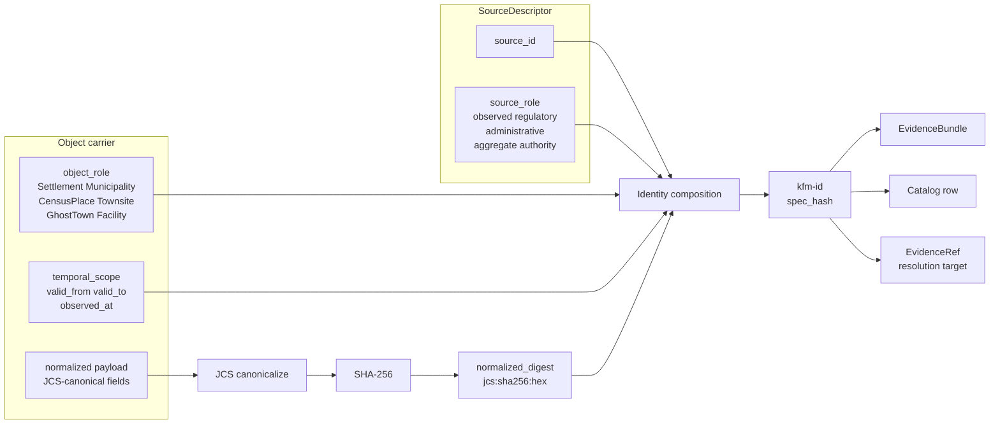

<!-- [KFM_META_BLOCK_V2]
doc_id: kfm://doc/docs.domains.settlements-infrastructure.identity-model
title: Settlements / Infrastructure — Identity Model
type: standard
version: v1
status: draft
owners: <Settlements/Infrastructure domain steward — placeholder>
created: 2026-05-19
updated: 2026-05-19
policy_label: public
related:
  - docs/domains/settlements-infrastructure/README.md
  - docs/doctrine/directory-rules.md
  - docs/doctrine/lifecycle-law.md
  - docs/doctrine/trust-membrane.md
  - docs/standards/PROV.md
  - docs/standards/SIGNING.md
  - docs/adr/ADR-0001-schema-home.md
tags: [kfm, domain, settlements, infrastructure, identity, deterministic-id, spec-hash]
notes:
  - "Settlement schema-home segment in atlas §24.13 is 'settlement/' (singular). docs/domains segment is 'settlements-infrastructure/'. Naming variance is OPEN-IDM-SI-01."
  - "All path and route claims under Implementation Surfaces are PROPOSED until verified against a mounted repository."
[/KFM_META_BLOCK_V2] -->

# Settlements / Infrastructure — Identity Model

> How the **Settlements / Infrastructure** lane decides *what counts as the same thing* — across sources, across time, and across the trust membrane.

| Field | Value |
|---|---|
| **Document type** | Standard — domain identity contract |
| **Authority of these rules** | CONFIRMED doctrine where labeled; PROPOSED implementation otherwise |
| **Lane** | Settlements / Infrastructure (atlas ch. 14) |
| **Owners** | `<Settlements/Infrastructure domain steward — placeholder>` |
| **Status** | Draft (review pending) |
| **Last reviewed** | 2026-05-19 |

> [!IMPORTANT]
> Settlements / Infrastructure includes a **critical-infrastructure deny lane**. Identity decisions in this document are the substrate on which sensitivity, redaction, and release policy operate. **Do not weaken the identity contract to make integration easier.** Reach for an ADR instead.

---

## Table of contents

1. [Purpose and scope](#1-purpose-and-scope)
2. [The deterministic identity rule](#2-the-deterministic-identity-rule)
3. [Identity composition diagram](#3-identity-composition-diagram)
4. [Object families and their identity rule](#4-object-families-and-their-identity-rule)
5. [Temporal handling — the four-clock rule](#5-temporal-handling--the-four-clock-rule)
6. [Source role and its effect on identity](#6-source-role-and-its-effect-on-identity)
7. [What this lane does *not* identify (cross-lane boundary)](#7-what-this-lane-does-not-identify-cross-lane-boundary)
8. [Domain-specific identity edge cases](#8-domain-specific-identity-edge-cases)
9. [Lifecycle of an identifier (RAW → PUBLISHED)](#9-lifecycle-of-an-identifier-raw--published)
10. [Sensitivity and identity](#10-sensitivity-and-identity)
11. [Implementation surfaces (PROPOSED)](#11-implementation-surfaces-proposed)
12. [Anti-patterns](#12-anti-patterns)
13. [Open questions](#13-open-questions)
14. [Related docs](#14-related-docs)

---

## 1. Purpose and scope

This document is the **identity contract** for the Settlements / Infrastructure lane. It answers, for every object family the lane owns, three questions that must be answered the same way by every pipeline, every catalog record, every Evidence Drawer payload, and every Focus Mode answer:

1. **What composes the identity** of a `Settlement`, `Municipality`, `CensusPlace`, `Townsite`, `GhostTown`, `Fort`, `Mission`, `ReservationCommunity`, `Infrastructure Asset`, `Network Node`, `Network Segment`, `Facility`, `Service Area`, `Operator`, `Condition Observation`, or `Dependency`?
2. **How is that identity rendered** as a stable, content-addressable identifier suitable for evidence resolution, catalog joins, EvidenceBundle closure, tombstoning, and rollback?
3. **What time(s)** does that identity refer to — and what does the system do when those times disagree?

It does **not** assert any specific repository file, schema URI, route, or owner. Those are PROPOSED until a mounted-repo inspection or an ADR upgrades them.

> [!NOTE]
> Bounded-context discipline: terms used here (`Settlement`, `Municipality`, `Townsite`, etc.) mean what this lane says they mean. Other lanes citing these objects do so **through evidence**, not by re-defining the term.

---

## 2. The deterministic identity rule

### CONFIRMED doctrine (atlas ch. 14, register E)

> For every object family in this lane, identity is decided by **source id + object role + temporal scope + normalized digest**.

Each component carries weight; none is optional, and none is silently swappable.

| Component | What it pins | Why it is in the identity |
|---|---|---|
| **`source_id`** | Which source admitted this evidence | Two sources naming "Lehigh" do not silently merge into one `Settlement`; they remain two source-bound assertions until reconciliation happens explicitly. |
| **`object_role`** | Which family this evidence carries (e.g., `Municipality` vs `CensusPlace` vs `Townsite`) | A census place named "Marquette" and a legally incorporated municipality named "Marquette" are **different objects**. Source-role plus object-role keeps that distinction explicit. |
| **`temporal_scope`** | Which validity window the assertion applies to | A `Settlement` carrier for 1872 is not the same identity as one for 1925. Time is a first-class identity component, not an attribute. |
| **`normalized_digest`** | Canonical content fingerprint after normalization | Tamper-evidence, dedup, and reproducible runs. Recorded as **`jcs:sha256:<hex>`** per Pass-10 C1-02. |

### CONFIRMED rendering (Pass-10 C1-02)

The `normalized_digest` is computed by:

1. **Canonicalize** the identity-bearing JSON payload via **RFC 8785 JCS** (sorted keys, UTF-8, no whitespace, normalized number form).
2. **Hash** the canonical bytes with **SHA-256**.
3. **Record** the result as `jcs:sha256:<hex>` in the receipt, catalog row, and EvidenceBundle.

URDNA2015 is reserved for cases where RDF-semantic equivalence is the relevant invariant; the default for this lane is JCS.

> [!TIP]
> Identity hashing is **for re-runnability and audit**, not for secrecy. Hash inputs are normalized public-shape values; sensitivity is handled by policy at the publication boundary, not by hiding identity.

[Back to top](#table-of-contents)

---

## 3. Identity composition diagram

The diagram below shows how the four identity components flow from a SourceDescriptor through normalization into the deterministic identifier and the EvidenceBundle it anchors.

> [!NOTE]
> **PROPOSED illustrative form.** The exact field names, identifier prefix, and binding between `kfm-id` and `spec_hash` will be fixed in the schemas under `schemas/contracts/v1/settlement/` (PROPOSED path; see §11). The composition order is doctrinal; the wire form is not yet ratified.

[Back to top](#table-of-contents)

---

## 4. Object families and their identity rule

Every family in the lane shares the **same identity composition** (`source_id + object_role + temporal_scope + normalized_digest`) but differs in which fields drive the normalized digest. The table below records the family-specific normalization concerns.

| Object family | Status | Identity-driving fields *(PROPOSED — needs schema confirmation)* | Special concerns |
|---|---|---|---|
| `Settlement` | CONFIRMED family / PROPOSED fields | locality name + source-asserted geometry fingerprint + temporal_scope | Distinct from CensusPlace and Municipality even at the same site. |
| `Municipality` | CONFIRMED family / PROPOSED fields | legal-name + jurisdiction key + legal_status_at + temporal_scope | Mutable status (incorporated → dissolved → reincorporated) is modeled as **legal-status events**, not by editing the Municipality. |
| `CensusPlace` | CONFIRMED family / PROPOSED fields | FIPS / GNIS-style external authority id + census vintage + temporal_scope | Vintage is part of identity. A 2010 CensusPlace and a 2020 CensusPlace are not the same row. |
| `Townsite` | CONFIRMED family / PROPOSED fields | plat / townsite filing reference + temporal_scope | A platted townsite that never functioned is still a valid `Townsite`; it is **not** a `GhostTown`. |
| `GhostTown` | CONFIRMED family / PROPOSED fields | predecessor reference + depopulation evidence + temporal_scope | Distinct identity from any predecessor `Settlement`; relation is **succession**, not merge. |
| `Fort` | CONFIRMED family / PROPOSED fields | designation + operating-authority + temporal_scope | Many forts have multiple closure / reactivation epochs; each epoch is its own temporal slice. |
| `Mission` | CONFIRMED family / PROPOSED fields | designation + religious-authority + temporal_scope | Cultural sensitivity may apply; see §10. |
| `ReservationCommunity` | CONFIRMED family / PROPOSED fields | community name + recognized authority + temporal_scope | Sovereignty considerations may constrain naming, geometry precision, and join behavior. |
| `Infrastructure Asset` | CONFIRMED family / PROPOSED fields | asset-class + operator key + canonical location + temporal_scope | **Critical-asset deny lane.** Geometry precision is restricted by default. |
| `Network Node` | CONFIRMED family / PROPOSED fields | node-class + canonical location + temporal_scope | Shares identity discipline with Roads/Rail Network Node, but **facility identity is owned by Settlements** per atlas §24.4.11. |
| `Network Segment` | CONFIRMED family / PROPOSED fields | endpoints (NodeId, NodeId) + segment-class + temporal_scope | Endpoint identity drift breaks segment identity — endpoint deprecation must emit a new segment row, not a silent edit. |
| `Facility` | CONFIRMED family / PROPOSED fields | facility-class + operator key + canonical location + temporal_scope | Operator-sensitive details default to restricted. |
| `Service Area` | CONFIRMED family / PROPOSED fields | service-class + operator key + geometry fingerprint + temporal_scope | Often aggregate — **must carry an aggregation receipt** to prevent join-to-individual. |
| `Operator` | CONFIRMED family / PROPOSED fields | operator-legal-name + jurisdiction key + temporal_scope | Reorganizations / mergers handled by lineage objects, not by rewriting Operator identity. |
| `Condition Observation` | CONFIRMED family / PROPOSED fields | subject AssetId + observed_at + observation-class + measurement payload digest | `observed_at` is **load-bearing**, not advisory. A new observation is a new row. |
| `Dependency` | CONFIRMED family / PROPOSED fields | dependent AssetId + dependee AssetId + dependency-class + temporal_scope | Sensitivity high — dependency graphs are restricted by default. |

> [!CAUTION]
> Fields marked *PROPOSED* are doctrinally plausible but **not verified against a mounted schema**. Treat the table as a contract sketch, not a published spec. Final field selection lives in the contracts and schemas under §11.

[Back to top](#table-of-contents)

---

## 5. Temporal handling — the four-clock rule

### CONFIRMED doctrine (atlas ch. 14, register E)

> *Source, observed, valid, retrieval, release, and correction times stay distinct where material.*

Practically, every identity-bearing carrier in this lane SHOULD be able to answer **at least four clocks** independently:

| Clock | What it means | Example |
|---|---|---|
| **`source_time`** | When the source authored or filed the assertion | An incorporation order's filing date |
| **`observed_at` / `valid_from` / `valid_to`** | The real-world window the assertion is about | The municipality was legally incorporated 1881-04-12; dissolved 1937-06-30 |
| **`retrieval_time`** | When KFM fetched / admitted the source | The fetch timestamp the watcher recorded |
| **`release_time`** | When the derived public carrier was promoted to PUBLISHED | The release manifest emission timestamp |

`correction_time` is added when a CorrectionNotice is issued. `valid_*` differs from `observed_at` for **regulatory** sources, where the legal effective window may differ from the document's authoring date.

> [!IMPORTANT]
> Collapsing these clocks is a common identity bug. If a `Municipality` carrier silently uses `retrieval_time` as `valid_from`, every downstream query that filters by validity will be **subtly, persistently wrong**. The identity rule treats temporal_scope as a deterministic input precisely so this collapse leaves a hash fingerprint.

[Back to top](#table-of-contents)

---

## 6. Source role and its effect on identity

### CONFIRMED doctrine

A `SourceDescriptor` carries a `source_role` field with the following enum *(per atlas §24.1.3, PROPOSED descriptor surface)*:

`observed` | `regulatory` | `modeled` | `aggregate` | `administrative` | `candidate` | `synthetic`

Source-role is **set at admission** and is **never edited in place**; corrections produce a new descriptor and a CorrectionNotice. Source-role flows into the identity composition through `source_id`, but it also constrains what kind of object_role the evidence can carry. The table below pins the lane-specific mapping.

<strong>Source-role → permitted object_role mapping (PROPOSED)</strong>

| source_role | Typical Settlements / Infrastructure object_roles | Identity / join constraints |
|---|---|---|
| `observed` | Condition Observation, Infrastructure Asset (operator-attested) | Default restricted on public surfaces; `observed_at` mandatory and in identity. |
| `regulatory` | Municipality legal-status event, FEMA-designated infrastructure context | Legal effective window (`valid_from` / `valid_to`) drives temporal_scope; not the document date. |
| `administrative` | Annexation order, county-change order, county-seat designation | DENY publication of administrative compilation as observed event timeline (atlas anti-pattern). Each order is its own event identity. |
| `aggregate` | Service Area summary, dependency-summary view | MUST carry `role_aggregation_unit`; DENY join from aggregate cell to single record. |
| `modeled` | Resilience model output, exposure summary | MUST carry `role_model_run_ref` to a ModelRunReceipt. Model run is part of the identity surface. |
| `authority` (gazetteer / TIGER) | CensusPlace, GNIS-anchored Settlement | Authority identifier flows into the digest; multiple authorities citing one feature do **not** silently dedup. |
| `candidate` | Pre-merge Settlement candidate from historical maps | DENY edge to PUBLISHED until `role_candidate_disposition = merged`. |
| `synthetic` | Reconstructed scene context | Reality-boundary note required; never identity-equivalent to a real Settlement. |

> [!WARNING]
> **Aggregate cited as a per-place truth** is an atlas-named anti-pattern. The identity rule alone does not prevent it; only the source-role tag combined with the aggregation receipt does. Identity tooling MUST surface `source_role` on every carrier so reviewers can see the join boundary.

[Back to top](#table-of-contents)

---

## 7. What this lane does *not* identify (cross-lane boundary)

The Settlements / Infrastructure identity rule is bounded by these CONFIRMED non-ownership facts from atlas ch. 14:

| Identity NOT owned here | Owning lane | What the boundary means in practice |
|---|---|---|
| Transport route (corridor, road, rail line) | Roads / Rail / Trade Routes | A `Facility` may be a depot, but the **route through it** is identified by Roads/Rail. Cross-lane joins go through Network Node, not through route re-identification here. |
| Water, wastewater, stormwater event evidence | Hydrology | A `Service Area` may reference a watershed for context, but the **HUC identity** is Hydrology-owned. |
| Hazard event or warning | Hazards | An `Infrastructure Asset` may be exposed to a hazard; the **hazard event identity** belongs to Hazards. KFM is never an alert authority. |
| Living-person identity, ownership privacy, parcel-to-person joins | People / Genealogy / DNA / Land | Residence, ownership, and migration relations are **denied at the trust membrane** without policy clearance. |

Cross-lane edges from this lane carry relations *(atlas §F)* — they do not redefine the cited object's identity.

[Back to top](#table-of-contents)

---

## 8. Domain-specific identity edge cases

These are the recurring identity bugs the corpus warns about, with the resolution this contract requires.

### 8.1 Census place is not a legal municipality

A `CensusPlace` named *Marquette* and a `Municipality` named *Marquette* are **two objects with two identities** — even when they share name, geometry, and time window. Joining or merging them across these classes without an explicit reconciliation event is a violation of the bounded-context rule and triggers the atlas-named anti-pattern of *aggregate-as-per-place-truth* once census counts get attached to municipal claims.

> [!IMPORTANT]
> The `census-vs-municipality distinction` is on the **validators / tests** backlog for this lane (atlas ch. 14, register K). A failing test here SHOULD block promotion.

### 8.2 Townsite → Settlement → GhostTown is a succession chain, not identity reuse

When a townsite is platted (1870), occupied as a functioning settlement (1882–1908), and then depopulated (1925), it produces **three distinct carriers**: a `Townsite`, a `Settlement`, and a `GhostTown`. They are linked by a **succession relation**, not by sharing an identifier. Identity reuse across these classes destroys the per-class evidence trail.

### 8.3 Legal status events are first-class objects

Incorporation, dissolution, reincorporation, annexation, and county-change events are **events with their own identity** (composed the same way: source_id + event_role + temporal_scope + digest). They reference the `Municipality` but do **not** mutate it. Public renderings that show a "current legal status" do so by **projecting** the event timeline, not by reading a mutable field on `Municipality`.

### 8.4 Network Node identity is shared with Roads/Rail; Facility identity is not

Per atlas §24.4.11: *"Network nodes and crossings anchor settlement connectivity; facility identity is settlement-owned."* In practice:

- `Network Node` identity uses the **same** deterministic composition on both sides of the lane boundary; cross-lane reconciliation requires matching `(node-class, canonical location, temporal_scope)` and an explicit reconciliation receipt.
- `Facility` identity is **owned solely** by Settlements / Infrastructure. Roads/Rail cites Facility by reference; it never invents Facility identifiers.

### 8.5 Condition Observation identity travels with `observed_at`

`Condition Observation` is the most failure-prone identity in this lane. A condition observation made *2024-08-12* on a bridge is a distinct row from one made *2024-09-02*. Updating an observation in place destroys the temporal trail. Corrections emit a new `Condition Observation` plus a CorrectionNotice referencing the prior digest.

### 8.6 Service Area carries an aggregation receipt or it cannot publish

`Service Area` is structurally aggregate (a polygon summarizing many serviced points). Its identity MUST include `role_aggregation_unit`; without it, the carrier cannot pass the policy gate to PUBLISHED. This is the lane-specific application of the atlas-named *aggregate-cited-as-per-place-truth* anti-pattern.

[Back to top](#table-of-contents)

---

## 9. Lifecycle of an identifier (RAW → PUBLISHED)

### CONFIRMED doctrine (atlas ch. 14, register H)

> Settlements / Infrastructure follows **RAW → WORK / QUARANTINE → PROCESSED → CATALOG / TRIPLET → PUBLISHED**, with promotion as a governed state transition (not a file move).

How the identifier evolves at each stage:

| Stage | What the identifier carries | Gate |
|---|---|---|
| **RAW** | Source-bound payload reference; identifier is the SourceDescriptor `source_id` plus content hash of the immutable capture. No domain-object identity yet. | SourceDescriptor exists. |
| **WORK / QUARANTINE** | A *candidate* `kfm-id` may be computed; the carrier is not yet identity-stable for publication. Failures hold here with a quarantine reason. | Validation + policy gate pass, or quarantine reason recorded. |
| **PROCESSED** | The deterministic identifier is **finalized** here: `source_id + object_role + temporal_scope + normalized_digest`. An EvidenceRef and ValidationReport are emitted; digest closure exists. | EvidenceRef, ValidationReport, and digest closure exist. |
| **CATALOG / TRIPLET** | The identifier resolves to a full **EvidenceBundle**; catalog records, graph / triplet projections, and a release candidate are emitted. | Catalog / proof closure passes. |
| **PUBLISHED** | The same identifier is referenced by a **ReleaseManifest** with rollback target and correction path. Public clients address the carrier by this identifier through governed APIs. | ReleaseManifest, correction path, rollback target, and review / policy state exist. |

> [!NOTE]
> **The identifier MUST be stable across this chain.** A `kfm-id` computed at PROCESSED is the same `kfm-id` referenced at PUBLISHED. If a downstream stage mutates a field that participates in the digest, the result is a *new* identifier and a CorrectionNotice that supersedes the old one — never an in-place update.

[Back to top](#table-of-contents)

---

## 10. Sensitivity and identity

### CONFIRMED / PROPOSED doctrine (atlas ch. 14, register I)

> Critical infrastructure, utilities, condition observations, dependencies, operator-sensitive details, and exact facility geometry default to **restricted or review**. Unclear rights, unresolved source role, missing evidence, unresolved sensitivity, or absent release state **blocks public promotion**.

Implications for the identity contract:

- **Identity exists and is computed for restricted carriers**, but the carrier may resolve only inside the restricted lane. Public-safe surfaces see a redacted projection, not a different identity.
- **Redaction is deterministic**: a generalization transform that produces the public-safe form has its own receipt; the redacted carrier's identity is computed over the **redacted** canonical fields, not the original precise fields. This keeps the public hash verifiable without exposing the private payload.
- **Cultural sensitivity** for `Mission` and `ReservationCommunity` may add review requirements that do not change the identity composition but **gate the resolver** behind a PolicyDecision.

> [!WARNING]
> If a precise-geometry `Facility` carrier accidentally leaks onto a public surface, the failure is **promotion**, not identity. The identifier did its job by remaining stable; the trust membrane failed to deny resolution. Treat such incidents as policy / resolver failures, not as a reason to weaken the identity rule.

[Back to top](#table-of-contents)

---

## 11. Implementation surfaces (PROPOSED)

> [!IMPORTANT]
> Every path, schema URI, route, and tool name in this section is **PROPOSED** until verified against a mounted repository. Atlas §24.13 names `schemas/contracts/v1/settlement/` as the PROPOSED schema home for this lane; the `docs/domains/` segment is `settlements-infrastructure/` (this file's home). The singular-vs-compound naming variance is **OPEN-IDM-SI-01** (§13).

| Surface | PROPOSED location | Identity-bearing fields it defines |
|---|---|---|
| Schemas (canonical) | `schemas/contracts/v1/settlement/<object>.schema.json` | `kfm_id`, `source_id`, `object_role`, `temporal_scope`, `normalized_digest`, plus family-specific identity-driving fields |
| Contracts (meaning) | `contracts/settlement/<object>.md` | Semantic definition of each family, what counts as "the same thing," cross-lane relation rules |
| Policy (sensitivity) | `policy/sensitivity/infrastructure/<rule>.rego` | Default-deny for critical assets, operator-sensitive details, exact geometry |
| Validators | `tools/validators/identity/jcs_spec_hash.py` | Computes `jcs:sha256:<hex>` per Pass-10 C1-02 |
| Test home | `tests/domains/settlements-infrastructure/identity/` | Census-vs-municipality, townsite-vs-ghosttown succession, condition-observation temporal-scope, aggregate-leak negative tests |
| Fixtures | `fixtures/domains/settlements-infrastructure/identity/` | Golden carriers, drift carriers, redaction carriers |
| EvidenceBundle home | `data/catalog/domain/settlements-infrastructure/` *(or `data/triplets/...`)* | Resolved EvidenceBundles keyed by `kfm_id` |
| Registry of sources | `data/registry/sources/settlements-infrastructure/` | SourceDescriptors carrying `source_role`, rights, terms |
| Release candidates | `release/candidates/settlements-infrastructure/` | Release manifests citing `kfm_id` and rollback targets |

These follow the **Domain Placement Law** (Directory Rules §12) verbatim — domain files live as segments under responsibility roots, never as new root-level domain folders.

[Back to top](#table-of-contents)

---

## 12. Anti-patterns

The atlas and Directory Rules name the following identity anti-patterns. They are listed here in lane-specific form.

| Anti-pattern | What goes wrong | Counter-rule |
|---|---|---|
| **Merging CensusPlace and Municipality by name match** | Aggregate counts get cited as per-place legal facts; bounded contexts collapse. | Distinct object_roles → distinct identities; cross-class merges require an explicit reconciliation event with its own evidence. |
| **Mutating Municipality on status change** | Legal-status history disappears; pre-change evidence becomes ambiguous. | Status changes are first-class **events** with their own identity (§8.3). |
| **Reusing one identifier across Townsite → Settlement → GhostTown** | Per-class evidence trail destroyed; succession looks like identity. | Three carriers, succession relation, distinct identifiers. |
| **In-place edits to Condition Observation** | Temporal trail destroyed; corrections become invisible. | New observation + CorrectionNotice referencing prior digest. |
| **Service Area without aggregation receipt** | Aggregate gets cited as per-individual truth; join-to-record returns false specificity. | DENY publication; require `role_aggregation_unit`. |
| **Network Node identity drift between Roads/Rail and Settlements** | Same node ends up with two `kfm_id`s; cross-lane joins silently misalign. | Shared composition rule; explicit reconciliation receipt at the lane boundary; Facility identity stays Settlements-owned. |
| **Restricted carrier's "public version" computed by dropping fields silently** | Public hash diverges from a verifiable transform; reviewers cannot prove redaction was deterministic. | Use a labeled generalization transform with its own receipt; compute the public digest over the redacted canonical fields. |
| **`administrative` source cited as `observed` event** | Compilation timelines presented as observation timelines; reviewers lose source-role discipline. | DENY publication of administrative compilation as observed event timeline; preserve `source_role` tag. |

[Back to top](#table-of-contents)

---

## 13. Open questions

These items are checkable but not yet checked at the level this contract requires. Each carries a stable identifier to be referenced from PRs and ADRs.

| ID | Question | What would settle it |
|---|---|---|
| **OPEN-IDM-SI-01** | Is the canonical schema home segment `settlement/` (singular, per atlas §24.13) or `settlements-infrastructure/` (compound, matching `docs/domains/`)? | An ADR or mounted-repo evidence under `schemas/contracts/v1/`. |
| **OPEN-IDM-SI-02** | Should `normalized_digest` use BLAKE3 in addition to or in place of JCS+SHA-256 for this lane? Pass-10 C1-02 confirms JCS+SHA-256 as the corpus default; BLAKE3 appears in the project's tooling list. | An ADR adopting either single-hash or dual-hash receipts. |
| **OPEN-IDM-SI-03** | What is the precise identity-driving field set for each object family? §4 lists doctrinally plausible inputs; the final field set lives in the schemas. | Mounted-repo inspection of `schemas/contracts/v1/settlement/<object>.schema.json` or a draft ADR. |
| **OPEN-IDM-SI-04** | How is `Network Node` cross-lane reconciliation receipted in practice? Atlas names the boundary but not the receipt shape. | A contract/schema for `NetworkNodeReconciliationReceipt` (PROPOSED name). |
| **OPEN-IDM-SI-05** | Does a `Municipality` legal-status event chain use its own object family, or is it a specialized form of an existing cross-cutting event family? | Cross-domain coordination with People / Land (LifeEvent / AdminEvent typology). |
| **OPEN-IDM-SI-06** | What is the canonical relation predicate for `Townsite → Settlement → GhostTown` succession? | A contract entry under `contracts/settlement/` plus a relation in the cross-domain object-family register. |
| **OPEN-IDM-SI-07** | Should `Operator` reorganizations / mergers produce a new `Operator` identity plus a `Lineage` object, or carry a versioned `Operator` with stable `kfm_id`? | An ADR; the bounded-context rule favors new identity + Lineage, but cross-lane callers may prefer stable id. |

[Back to top](#table-of-contents)

---

## 14. Related docs

> Links below resolve relative to the repository root once the listed targets exist. Items marked *(NEEDS VERIFICATION)* are PROPOSED targets, not confirmed files.

- [`docs/domains/settlements-infrastructure/README.md`](README.md) — domain orientation (NEEDS VERIFICATION)
- [`docs/doctrine/directory-rules.md`](../../doctrine/directory-rules.md) — placement authority (CONFIRMED in corpus)
- [`docs/doctrine/lifecycle-law.md`](../../doctrine/lifecycle-law.md) — RAW → PUBLISHED invariant (NEEDS VERIFICATION)
- [`docs/doctrine/trust-membrane.md`](../../doctrine/trust-membrane.md) — public-surface boundary (NEEDS VERIFICATION)
- [`docs/standards/PROV.md`](../../standards/PROV.md) — provenance crosswalk (CONFIRMED authored prior session; corpus naming variance vs `PROVENANCE.md` flagged elsewhere)
- [`docs/standards/SIGNING.md`](../../standards/SIGNING.md) — attestation, cosign (PROPOSED, not yet authored)
- [`docs/adr/ADR-0001-schema-home.md`](../../adr/ADR-0001-schema-home.md) — `schemas/contracts/v1/` canonical (CONFIRMED in corpus)
- *(PROPOSED)* `docs/architecture/identity-and-spec-hash.md` — cross-domain identity primer

---

**Status:** draft · **Last reviewed:** 2026-05-19 · **Lane:** Settlements / Infrastructure · [Back to top](#settlements--infrastructure--identity-model)
