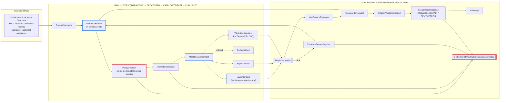

<!-- [KFM_META_BLOCK_V2]
doc_id: kfm://doc/domains/settlements-infrastructure/map-ui-contracts
title: Settlements & Infrastructure — Map and UI Contracts
type: standard
version: v1
status: draft
owners: <Settlements/Infrastructure steward + Map/UI steward — TODO confirm>
created: 2026-05-19
updated: 2026-05-19
policy_label: public
related:
  - kfm://doctrine/directory-rules
  - kfm://doctrine/trust-membrane
  - kfm://doctrine/lifecycle-law
  - kfm://contracts/runtime/decision_envelope
  - kfm://contracts/map/layer_manifest
  - kfm://contracts/map/map_release_manifest
  - kfm://contracts/ui/evidence_drawer_payload
  - kfm://contracts/ui/map_context_envelope
  - kfm://contracts/ai/focus_mode_request
  - kfm://contracts/ai/focus_mode_response
  - kfm://contracts/evidence/evidence_bundle
  - kfm://contracts/policy/policy_decision
  - kfm://contracts/release/release_manifest
  - kfm://docs/domains/settlements-infrastructure/README
  - kfm://docs/architecture/map-master
tags: [kfm, domain, settlements, infrastructure, map, ui, contracts, governed-ai]
notes:
  - "Repo not mounted in authoring session; all paths PROPOSED until verified."
  - "Decision envelope name `SettlementsInfrastructureDecisionEnvelope` sourced from Atlas v1.1 ch. 14 §J."
  - "Sensitivity defaults per [DOM-SETTLE]: critical infrastructure denies public exact-geometry by default."
[/KFM_META_BLOCK_V2] -->

<a id="top"></a>

# 🗺️ Settlements & Infrastructure — Map and UI Contracts

*The governed map/UI contract surface for the Settlements/Infrastructure lane: which manifests, envelopes, drawer payloads, and Focus Mode messages bind released settlement and infrastructure features to evidence, policy, and finite outcomes.*


| Field | Value |
|---|---|
| **Status** | `draft` (review pending) |
| **Owners** | Settlements/Infrastructure steward + Map/UI steward · *placeholder — confirm in control_plane* |
| **Last reviewed** | 2026-05-19 |
| **Authority** | This document is a domain contract reference. It is **subordinate** to Directory Rules, the KFM Encyclopedia, [DOM-SETTLE], [MAP-MASTER], and the canonical schemas under `schemas/contracts/v1/`. |
| **Repo state** | `NEEDS VERIFICATION` — no mounted repo was inspected in the authoring session. All paths below are `PROPOSED` until confirmed against repo evidence. |

---

## 📑 Contents

1. [Scope and one-line purpose](#1-scope-and-one-line-purpose)
2. [Repo fit and placement](#2-repo-fit-and-placement)
3. [What this contract surface accepts](#3-what-this-contract-surface-accepts)
4. [Exclusions — not owned here](#4-exclusions--not-owned-here)
5. [Contract topology (diagram)](#5-contract-topology-diagram)
6. [Domain object families bound by these contracts](#6-domain-object-families-bound-by-these-contracts)
7. [Governed Map/UI surfaces and DTOs](#7-governed-mapui-surfaces-and-dtos)
8. [Finite outcomes contract](#8-finite-outcomes-contract)
9. [`SettlementsInfrastructureDecisionEnvelope`](#9-settlementsinfrastructuredecisionenvelope)
10. [Sensitivity, rights, and publication posture](#10-sensitivity-rights-and-publication-posture)
11. [Viewing products served by these contracts](#11-viewing-products-served-by-these-contracts)
12. [Cross-lane consumption rules](#12-cross-lane-consumption-rules)
13. [Validators, tests, fixtures](#13-validators-tests-fixtures)
14. [Anti-patterns and forbidden behaviors](#14-anti-patterns-and-forbidden-behaviors)
15. [Open questions and verification backlog](#15-open-questions-and-verification-backlog)
16. [Related docs](#16-related-docs)
17. [Appendix — Illustrative DTO sketches](#17-appendix--illustrative-dto-sketches)

---

## 1. Scope and one-line purpose

`CONFIRMED doctrine / PROPOSED implementation`

This document fixes the **map and UI contract surface** for the **Settlements/Infrastructure** lane: the set of governed manifests, envelopes, and drawer payloads through which the MapLibre shell, the Evidence Drawer, and the Focus Mode runtime may render, click-resolve, and synthesize over released settlement and infrastructure evidence — and the finite outcomes they are permitted to emit.

It does **not** create a new contract authority. It maps the cross-cutting object families (`LayerManifest`, `EvidenceBundle`, `MapContextEnvelope`, etc., owned by the Encyclopedia and Master MapLibre doctrine) onto this lane's objects, sensitivity defaults, and decision envelope. Where this document and a higher source disagree, the higher source wins and a drift entry is filed per Directory Rules §2.5.

> [!IMPORTANT]
> Generated text never outranks an `EvidenceBundle`. Rendered features identify **candidates**, not proof. Every consequential claim on any settlement or infrastructure surface resolves through the Evidence Drawer or aborts with a finite outcome.

[↑ Back to top](#top)

---

## 2. Repo fit and placement

`CONFIRMED placement doctrine / PROPOSED path realization`

| Concern | Path (PROPOSED) | Authority |
|---|---|---|
| **This doc** | `docs/domains/settlements-infrastructure/MAP_UI_CONTRACTS.md` | Directory Rules §12 — *Domain Placement Law*: domain files live as lanes inside `docs/domains/<domain>/`. |
| **Domain contracts (semantic)** | `contracts/domains/settlements-infrastructure/` | Directory Rules §6.3 — meaning lives in `contracts/`. |
| **Domain schemas (machine shape)** | `schemas/contracts/v1/domains/settlements-infrastructure/` | ADR-0001 — schema home is `schemas/contracts/v1/...`. |
| **Domain policy** | `policy/domains/settlements-infrastructure/` and `policy/sensitivity/infrastructure/` | Directory Rules §12; deny-by-default register for critical assets. |
| **Domain tests / fixtures** | `tests/domains/settlements-infrastructure/`, `fixtures/domains/settlements-infrastructure/` | Directory Rules §12. |
| **Released layer artifacts** | `data/published/layers/settlements-infrastructure/` | Lifecycle Law — public artifacts live in `PUBLISHED`. |
| **Release candidates** | `release/candidates/settlements-infrastructure/` | Directory Rules §12. |

> [!NOTE]
> **Domain slug.** The slug **`settlements-infrastructure`** mirrors the pattern listed in Directory Rules §12 (`hydrology`, `roads-rail-trade`, `settlements-infrastructure`, …). If a different slug is in use in the live repo (e.g., `settlements_infrastructure`, `settlements`), update this document and file a drift entry; do **not** silently conform.

[↑ Back to top](#top)

---

## 3. What this contract surface accepts

Inputs that this contract layer is permitted to consume:

- **Released** Settlement/Infrastructure features carrying a resolvable `EvidenceRef` to an `EvidenceBundle`.
- A signed, addressable `LayerManifest` referencing the renderer (MapLibre / Cesium), a `TileArtifactManifest`, a `StyleManifest`, and a `PolicyDecision` allowing rendering.
- An active `MapReleaseManifest` binding the above with a `rollback_target` and a `cache_invalidation` record.
- A `MapContextEnvelope` carrying camera, visible released-layer IDs, time window, selected feature IDs, and `EvidenceRef[]`.
- A `FocusModeRequest` constructed from that envelope and `EvidenceBundle` references only.

[↑ Back to top](#top)

---

## 4. Exclusions — not owned here

This document does **not** define:

- The semantic meaning of `Settlement`, `Municipality`, `Infrastructure Asset`, etc. — that lives in **`contracts/domains/settlements-infrastructure/`** and the Encyclopedia.
- The JSON Schema files themselves — those live under **`schemas/contracts/v1/...`** per ADR-0001.
- The MapLibre style spec or PMTiles wire format — those are upstream standards; KFM only profiles and constrains them.
- Hazard event semantics, transport route geometry, residence ownership joins, or hydrologic features — owned by Hazards, Roads/Rail, People/Land, and Hydrology lanes respectively (see [§12](#12-cross-lane-consumption-rules)).
- Emergency-alert authority. KFM is never an alert authority on this surface.

[↑ Back to top](#top)

---

## 5. Contract topology (diagram)

> [!NOTE]
> `PROPOSED diagram`. The shapes and edges below reflect doctrine from [MAP-MASTER], [GAI], and [DOM-SETTLE] §J. Object names are stable vocabulary; lanes between them are governed flow, not implementation guarantees. **Verify against repo before treating as runtime.**



[↑ Back to top](#top)

---

## 6. Domain object families bound by these contracts

`CONFIRMED object-family spine (doctrine) / PROPOSED implementation` — sourced from Atlas v1.1 ch. 14 §B, §E and [DOM-SETTLE].

| Object family | Renders on map? | Default sensitivity | Notes |
|---|---|---|---|
| `Settlement` | Yes (public-safe) | Public | Identity bounded by source role + temporal scope + normalized digest. |
| `Municipality` | Yes (public-safe) | Public | Distinguish from `CensusPlace`; do not collapse the source roles. |
| `CensusPlace` | Yes (public-safe) | Public | Census enumeration, not legal authority. |
| `Townsite` | Yes (public-safe) | Public | Historical scope; carries `valid_time` separately from `observed_time`. |
| `GhostTown` | Yes (public-safe) | Public | Historical scope. |
| `Fort` | Yes (public-safe) | Public | Coordinate generalization where archaeological sensitivity applies. |
| `Mission` | Yes (public-safe) | Public | Cross-cites Archaeology where applicable. |
| `ReservationCommunity` | Yes, CARE-aware | Restricted-default | Sovereignty/CARE labels required; ABSTAIN where labels missing. |
| `Infrastructure Asset` | Generalized / staged | **Restricted-default** | Critical infrastructure denies public exact geometry. |
| `Network Node` | Generalized / staged | **Restricted-default** | Operator-sensitive; deny by default. |
| `Network Segment` | Generalized / staged | **Restricted-default** | Cross-lane edge to Roads/Rail; ownership preserved. |
| `Facility` | Generalized / staged | **Restricted-default** | Condition/inspection detail denies public surface. |
| `Service Area` | Aggregate only | Public-safe (aggregate) | Coverage envelope; never raw routing tables. |
| `Operator` | Reference only | Restricted | Operator-sensitive identifiers per [DOM-SETTLE] §I. |
| `Condition Observation` | Generalized / staged | **Restricted-default** | `observed_at` distinct from `valid_at`. |
| `Dependency` | Aggregate / summary | **Restricted-default** | Dependency graph denies leaf detail by default. |

> [!CAUTION]
> Rows marked **Restricted-default** must not appear on a public map without (a) a `Redaction Receipt` recording the transform, (b) a `PolicyDecision = ALLOW` with reviewer recorded, and (c) a `ReleaseManifest` that names the public-safe derivative. Style filters alone are insufficient — sensitive geometry must be generalized, redacted, delayed, restricted, or denied **before tile generation**.

[↑ Back to top](#top)

---

## 7. Governed Map/UI surfaces and DTOs

`CONFIRMED doctrine / PROPOSED implementation` — fields and paths are sourced from [MAP-MASTER] v1.9–v2.0 and the Encyclopedia object-family spine. Schema paths are `PROPOSED` until verified against the repo per [ADR-0001](#16-related-docs).

| Surface | DTO / contract | Field intent (minimum) | Proposed schema home | Outcomes |
|---|---|---|---|---|
| Domain feature / detail resolver | `SettlementsInfrastructureDecisionEnvelope` | `decision_id`, `outcome`, `policy_family`, `reasons[]`, `obligations[]`, `evaluated_at`, `evidence_ref[]` | `schemas/contracts/v1/runtime/decision_envelope.schema.json` (cross-cutting) | ANSWER / ABSTAIN / DENY / ERROR |
| Domain layer manifest resolver | `LayerManifest` | `layer_id`, `source_id`, `source_layer`, `evidence_ref_field`, `temporal_fields`, `policy_label`, `release_state`, `renderer`, `tile_artifact_ref`, `style_ref`, `attribution` | `schemas/contracts/v1/map/layer_manifest.schema.json` | ANSWER / DENY / ERROR |
| Style binding | `StyleManifest` | `style_id`, `version`, `style_json_digest`, `sprite_ref`, `glyph_ref`, `layer_ids`, `release_id` | `schemas/contracts/v1/map/style_manifest.schema.json` | (validator-class) PASS / FAIL / ERROR |
| Tile artifact binding | `TileArtifactManifest` | `artifact_id`, `type` (`pmtiles`/`mvt`/`cog`/`mbtiles`), `uri`, `digest`, `zooms`, `bounds`, `source_layers`, `range_required`, `cors_required` | `schemas/contracts/v1/map/tile_artifact_manifest.schema.json` | (validator-class) PASS / FAIL / ERROR |
| Release contract | `MapReleaseManifest` | `release_id`, `layer_manifests[]`, `style_manifest`, `tile_artifacts[]`, `release_time`, `supersedes`, `rollback_target`, `cache_keys` | `schemas/contracts/v1/map/map_release_manifest.schema.json` | ALLOW / HOLD / DENY / ERROR (release-class) |
| Click-resolve payload | `EvidenceDrawerPayload` | `feature_id`, `layer_id`, `evidence_bundle_refs[]`, `source summary`, `citations[]`, `policy_state`, `release_state`, `limitations` | `schemas/contracts/v1/ui/evidence_drawer_payload.schema.json` | ANSWER / ABSTAIN / DENY / ERROR |
| Focus Mode input | `MapContextEnvelope` | `visible_layers[]`, `bounds`, `zoom`, `pitch`, `bearing`, `filters`, `time_window`, `selected_features[]`, `evidence_refs[]` | `schemas/contracts/v1/ui/map_context_envelope.schema.json` | (envelope) — |
| Governed AI request | `FocusModeRequest` | `question`, `map_context_envelope`, `evidence_refs[]`, `policy_context`, `user_role` | `schemas/contracts/v1/ai/focus_mode_request.schema.json` | (envelope) — |
| Governed AI response | `FocusModeResponse` | `outcome`, `answer` (if ANSWER), `citations[]`, `abstain_reason`, `deny_reason`, `evidence_used[]`, `policy_decisions[]`, `ai_receipt_id` | `schemas/contracts/v1/ai/focus_mode_response.schema.json` | ANSWER / ABSTAIN / DENY / ERROR |
| Citation gate | `CitationValidationReport` | `report_id`, `answer_id`, `citation_refs[]`, `resolved[]`, `missing[]`, `unsupported[]`, `verdict` | `schemas/contracts/v1/evidence/citation_validation_report.schema.json` | PASS / FAIL / ERROR |
| AI audit record | `AIReceipt` | `receipt_id`, `model_provider`, `model_id`, `context_hash`, `evidence_ids[]`, `citation_report_id`, `policy_ids[]`, `runtime`, `outcome` | `schemas/contracts/v1/ai/ai_receipt.schema.json` | (record) — |

> [!NOTE]
> The schema home convention (`schemas/contracts/v1/...`) is governed by **ADR-0001**. If the repo currently carries divergent schemas under `contracts/<domain>/<x>.schema.json`, that is **lineage / CONFLICTED** per Directory Rules §13.1 and must be reconciled before any new schema lands.

[↑ Back to top](#top)

---

## 8. Finite outcomes contract

`CONFIRMED doctrine` — sourced from Atlas v1.1 §24.3 and [GAI] §§2–4.

| Outcome | When | Required artifacts | Surface effect |
|---|---|---|---|
| `ANSWER` | Evidence sufficient · policy permits · release state allows · review (if required) recorded. | Resolved `EvidenceBundle`; `PolicyDecision = ALLOW`; `ReleaseManifest` applies. | Substantive answer + drawer + citation. |
| `ABSTAIN` | Evidence insufficient · surface cannot cite · evidence stale and no released alternative. | `AIReceipt` with reason; no claim emitted. | Non-substantive note with reason; never invents. |
| `DENY` | Policy / rights / sensitivity / release state forbids the answer. **Default for sensitive infrastructure detail.** | `PolicyDecision = DENY` + reason code; `AIReceipt` records denial. | Denial reason; offers non-restricted alternative where possible. |
| `ERROR` | Governed API cannot evaluate — missing schema, malformed query, contract violation, infrastructure failure. | Error envelope with diagnostic code, no claim leakage. | Finite, actionable error; never silently falls through. |
| `HOLD` *(release-class)* | Promotion / release / correction paused pending steward, rights-holder, or policy review. | `ReviewRecord` pending; `PolicyDecision = HOLD`. | Surface remains in prior state; no silent rollback. |
| `PASS` / `FAIL` *(validator-class)* | Validator or admission check completed. | `ValidationReport`. | Internal only. |

> [!WARNING]
> **`DENY` is the default** for `Infrastructure Asset`, `Network Node`, `Network Segment`, `Facility`, `Condition Observation`, and `Dependency` exact-geometry queries. A flip to `ANSWER` requires explicit allow with reviewer-recorded `PolicyDecision`, a public-safe generalized derivative, and a `ReleaseManifest` entry naming that derivative.

[↑ Back to top](#top)

---

## 9. `SettlementsInfrastructureDecisionEnvelope`

`PROPOSED` — name and outcome set come from Atlas v1.1 ch. 14 §J; field-level shape is the cross-cutting `DecisionEnvelope` shape from `KFM-P5-PROG-0001`. Exact route and JSON shape remain `UNKNOWN` until the repo is inspected.

The envelope is the join key between the Settlements/Infrastructure feature-detail resolver, the Evidence Drawer, audit trails, DSSE receipts, correction lineage, and rollback rehearsals.

```jsonc
// PROPOSED illustrative shape — not authoritative.
// Canonical shape lives at schemas/contracts/v1/runtime/decision_envelope.schema.json (ADR-0001).
{
  "decision_id":   "uuid",                       // join key
  "envelope_kind": "SettlementsInfrastructureDecisionEnvelope",
  "outcome":       "ANSWER",                     // ANSWER | ABSTAIN | DENY | ERROR
  "policy_family": "render",                     // promotion | access | render | capability | consent | sensitivity
  "subject": {
    "feature_id":    "kfm:settle:municipality:...",
    "object_family": "Municipality",
    "layer_id":      "settlements.municipalities.v1"
  },
  "evidence_ref":   ["kfm:evidence:bundle:..."],
  "reasons":        ["evidence_resolved", "release_state_active"],
  "obligations":    [],                          // e.g. {type:"redact", op:"generalize_geometry", level:"coarse"}
  "release_ref":    "kfm:release:map:2026-Q2-...",
  "rollback_ref":   "kfm:rollback:map:2026-Q2-...",
  "evaluated_at":   "2026-05-19T00:00:00Z"
}
```

> [!IMPORTANT]
> The envelope **wraps**, it does not **replace**, the underlying `EvidenceBundle`, `PolicyDecision`, `ReleaseManifest`, `CitationValidationReport`, and `AIReceipt`. Any consumer that reads only the envelope and not the linked artifacts is bypassing the trust membrane.

[↑ Back to top](#top)

---

## 10. Sensitivity, rights, and publication posture

`CONFIRMED / PROPOSED` — sourced from [DOM-SETTLE] §I and the Atlas v1.1 *Deny-by-Default Register and Sensitivity Matrix* (§20.5).

| Domain element | Denied by default | Allowed only when |
|---|---|---|
| Critical infrastructure (utilities, condition observations, dependencies, operator-sensitive details, exact facility geometry) | Public exact geometry, asset-level condition detail, operator identifiers, dependency-graph leaf detail | Steward review + public-safe generalization + `Redaction Receipt` + `ReleaseManifest` + reviewer-recorded `PolicyDecision`. |
| Cross-cited archaeology context (e.g., `Fort`, `Mission` historical loci) | Exact coords where archaeology denies | Generalized geometry per [DOM-ARCH] sovereignty rules. |
| Living-person residence joins | Person-parcel join surfaces | Consent + restricted authorized surface only — owned by **People/Land**, not by this lane. |
| Hazard exposure detail | Asset-level hazard exposure linked to identified critical infrastructure | Aggregate or generalized; cite Hazards owner. |

> [!CAUTION]
> Unclear rights, unresolved source role, missing evidence, unresolved sensitivity, or absent release state **blocks public promotion**. There is no "soft launch" or "preview-only" lane on the public map surface. [ENCY] [DIRRULES]

[↑ Back to top](#top)

---

## 11. Viewing products served by these contracts

`PROPOSED` — sourced from Atlas v1.1 ch. 14 §G.

| Viewing product | Primary objects rendered | Cross-cutting surfaces |
|---|---|---|
| Current settlement view | `Settlement`, `Municipality`, `CensusPlace` | Evidence Drawer, time-aware state, trust badges |
| Historic townsite view | `Townsite`, `GhostTown`, `Fort`, `Mission` | time-aware state, generalization disclosures |
| Legal-status-event view | `Municipality` legal-event timeline | correction/stale-state view |
| Census-place comparison | `CensusPlace` vs `Municipality` deltas | sensitivity-redacted view where joins apply |
| Public-safe asset view | Aggregate `Infrastructure Asset` envelopes | sensitivity-redacted view, Redaction Receipt link |
| Service-area aggregate view | `Service Area` envelopes only | trust badges, aggregate disclosures |
| Dependency-summary view | Aggregate `Dependency` summaries | governed Focus Mode for narrative |
| Restricted internal review view | Full sensitive detail | **internal-only**; never reachable from the public path |

> [!NOTE]
> Cross-cutting surfaces (Evidence Drawer, trust badges, time-aware state, sensitivity-redacted view, correction/stale-state view, governed Focus Mode) are `CONFIRMED doctrine` per [MAP-MASTER] and [GAI]; per-product binding is `PROPOSED` until the layer registry is verified.

[↑ Back to top](#top)

---

## 12. Cross-lane consumption rules

`CONFIRMED / PROPOSED` — sourced from Atlas v1.1 §24.4.12 and ch. 14 §F. Every cross-lane edge must preserve ownership, source role, sensitivity, and `EvidenceBundle` support.

| This lane | Related lane | Relation | Constraint |
|---|---|---|---|
| Settlements/Infrastructure | Roads/Rail | Depot · bridge · crossing · transport-facility relation | Roads/Rail owns route geometry and crossings; this lane owns facility identity. |
| Settlements/Infrastructure | Hazards | Exposure · resilience · warnings · declarations | This lane **cites** hazard event context; KFM is never an alert authority. |
| Settlements/Infrastructure | Hydrology | Water · wastewater · stormwater · floodplain · drainage | Hydrology owns water evidence; this lane cites it. NFHL flood lines are regulatory, never labeled as observed flood. |
| Settlements/Infrastructure | People/Land | Residence · ownership · parcel · migration context | This lane bounds settlement identity; **People/Land owns** ownership and living-person privacy. Direct joins **DENY** by default. |
| Settlements/Infrastructure | Archaeology | Cultural temporal period · survey context | Site coords denied; bounded interpretation only. |
| Settlements/Infrastructure | Frontier Matrix | Settlement status feeds matrix settlement cells | Cited via released aggregate only. |

[↑ Back to top](#top)

---

## 13. Validators, tests, fixtures

`PROPOSED` — sourced from [DOM-SETTLE] §K. Each item below maps to a negative-state path the validator must exercise.

| Test family | Required negative case | Expected outcome |
|---|---|---|
| Legal municipality evidence | Source missing legal-authority role; collapsed `Municipality`/`CensusPlace`. | `FAIL` / `DENY` |
| Census-vs-municipality distinction | Census-only feature labeled as legal authority. | `FAIL` / `DENY` |
| Infrastructure topology | Disconnected `Network Node`/`Segment` claimed as connected; orphan node. | `FAIL` / `ERROR` |
| Condition `observed_at` | `Condition Observation` missing distinct `observed_at`. | `FAIL` |
| Restricted geometry no-leak | Sensitive asset exact geometry reaches public layer, even under style filter. | `DENY` |
| Catalog / proof / release closure | Layer lacks `MapReleaseManifest` or rollback target. | `HOLD` / `DENY` |
| Click-to-`EvidenceBundle` | Click on rendered feature returns drawer payload with unresolved `EvidenceRef`. | `ABSTAIN` |
| Focus Mode citation closure | Generated answer lacks `CitationValidationReport` PASS. | `ABSTAIN` |
| Stale source badge / abstain | Source freshness past cadence; layer still served as fresh. | Stale badge + possible `ABSTAIN` |
| Rollback restores prior manifest | Rollback drill leaves cache un-invalidated. | `ERROR` |
| Sensitive geometry style-filter substitute | Style filter alone used to "hide" sensitive geometry that exists in the tile. | `FAIL` (validator), `DENY` (release) |

> [!TIP]
> Validators must exercise **negative-state paths first**. A test suite that only passes positive cases provides no enforcement evidence and counts as `NEEDS VERIFICATION`, not coverage.

[↑ Back to top](#top)

---

## 14. Anti-patterns and forbidden behaviors

These are the specific failure modes this contract surface is designed to prevent. Any of them appearing in code review is grounds to block merge.

- **Badge-as-evidence.** Verification badges that link to nothing or that act as the Evidence Drawer rather than linking into it.
- **Popup-as-Evidence-Drawer.** Popups carrying claims that should resolve through the drawer. Popups may summarize and link; they may not stand in for resolution.
- **Style-filter as redaction.** Sensitive `Infrastructure Asset` geometry present in the tile but "hidden" via a MapLibre filter. Sensitive geometry must be generalized, redacted, delayed, restricted, or denied **before** tile generation.
- **Uncited Focus Mode `ANSWER`.** A generated answer not bound to a `CitationValidationReport` PASS.
- **Direct `addSource` on unverified PMTiles.** MapLibre `addSource` / `addLayer` on artifacts without `MapReleaseManifest` and allowed `PolicyDecision`.
- **Census-place ↔ Municipality collapse.** Treating census-place geometry as legal-authority municipality, or vice versa.
- **Operator identifier leakage.** Operator-sensitive identifiers exposed in tile attributes, popups, or drawer payloads.
- **Person-parcel join on public surface.** Living-person joins to parcels exposed on a public layer — this is People/Land territory and denies by default.
- **Cross-lane ownership theft.** This lane producing hazard event canonical state, transport route geometry, or hydrologic features instead of citing the owning lane.
- **Polish ahead of provenance.** Visual polish, label density, or animation prioritized over `EvidenceBundle` resolution, policy gating, citation closure, or rollback path.

[↑ Back to top](#top)

---

## 15. Open questions and verification backlog

`NEEDS VERIFICATION` — all items below require mounted-repo inspection, registry entries, tests, logs, emitted artifacts, review records, or release manifests to settle.

| # | Item | Evidence that would settle it | Status |
|---|---|---|---|
| Q1 | Confirm the slug `settlements-infrastructure` matches the live `docs/domains/<slug>/` directory. | `git ls-tree` of `docs/domains/`. | `NEEDS VERIFICATION` |
| Q2 | Confirm `SettlementsInfrastructureDecisionEnvelope` route/path and exact field shape. | Route registration; OpenAPI / schema in `schemas/contracts/v1/`. | `UNKNOWN` |
| Q3 | Confirm `schemas/contracts/v1/...` is the live schema home (vs `contracts/<domain>/*.schema.json`). | Inspection per Directory Rules §18.a. | `NEEDS VERIFICATION` |
| Q4 | Confirm `policy/` vs `policies/` canonicalization. | Inspection per Directory Rules §18.a. | `NEEDS VERIFICATION` |
| Q5 | Confirm public-safe `Infrastructure Asset` layer registry — which layers are released, which are restricted, which are quarantine. | `data/published/layers/settlements-infrastructure/` + `MapReleaseManifest`. | `NEEDS VERIFICATION` |
| Q6 | Confirm critical-infrastructure deny policy is enforced at the policy layer (not at UI). | Policy files + negative-path tests. | `NEEDS VERIFICATION` |
| Q7 | Confirm cross-lane edges (Roads/Rail bridge, Hazards exposure, Hydrology drainage) preserve ownership in the live data. | Fixture closure tests across lanes. | `NEEDS VERIFICATION` |
| Q8 | Confirm Focus Mode rejects unreleased layers and emits `ABSTAIN` on missing citation closure. | Fixture: unreleased layer + Focus prompt → `ABSTAIN`. | `NEEDS VERIFICATION` |
| Q9 | Confirm rollback restores prior `MapReleaseManifest` for this lane and records cache invalidation. | Rollback drill receipt. | `NEEDS VERIFICATION` |
| Q10 | Owners and reviewers for this document — placeholder pending `control_plane/document_registry.yaml` entry. | Registry entry. | `NEEDS VERIFICATION` |

[↑ Back to top](#top)

---

## 16. Related docs

- [`docs/doctrine/directory-rules.md`](../../doctrine/directory-rules.md) — Directory Rules (placement and lifecycle authority).
- [`docs/doctrine/trust-membrane.md`](../../doctrine/trust-membrane.md) — Trust membrane doctrine. *TODO confirm.*
- [`docs/doctrine/lifecycle-law.md`](../../doctrine/lifecycle-law.md) — RAW → PUBLISHED lifecycle invariant. *TODO confirm.*
- [`docs/architecture/map-master.md`](../../architecture/map-master.md) — Master MapLibre Components / Functions / Features. *TODO confirm path.*
- [`docs/domains/settlements-infrastructure/README.md`](./README.md) — Lane landing page. *TODO confirm exists.*
- `contracts/domains/settlements-infrastructure/` — semantic contracts (Markdown).
- `schemas/contracts/v1/domains/settlements-infrastructure/` — machine schemas (JSON Schema).
- `policy/domains/settlements-infrastructure/`, `policy/sensitivity/infrastructure/` — admissibility and deny rules.
- ADR-0001 — schema home rule (`schemas/contracts/v1/`).
- [DOM-SETTLE] — Settlements/Infrastructure dossier (canonical lane doctrine).
- [ENCY] — KFM Encyclopedia.

[↑ Back to top](#top)

---

## 17. Appendix — Illustrative DTO sketches

> [!NOTE]
> The examples below are **illustrative** synthesis of doctrine fields, not extracted from a mounted repo. Treat field names as `PROPOSED` and verify against `schemas/contracts/v1/...` before relying on them.

<details>
<summary><b>A. <code>LayerManifest</code> entry for a public-safe municipality layer (PROPOSED)</b></summary>

```jsonc
{
  "layer_id":     "settlements.municipalities.v1",
  "title":        "Kansas Municipalities (released)",
  "geometry_type":"Polygon",
  "renderer":     "maplibre",
  "source_id":    "src:tiger:place:2024",
  "source_layer": "municipality",
  "tile_artifact_ref": "kfm:tile:pmtiles:settlements.municipalities.v1@sha256:…",
  "style_ref":         "kfm:style:settlements.v1",
  "policy_label":      "public",
  "release_state":     "PUBLISHED",
  "evidence_ref_field":"evidence_ref",
  "temporal_fields": {
    "observed_at": "source_observed_at",
    "valid_at":    "legal_valid_at",
    "retrieved_at":"retrieval_time",
    "released_at": "release_time"
  },
  "attribution":  "U.S. Census Bureau TIGER/Line (2024) · KFM release 2026-Q2",
  "release_id":   "kfm:release:map:2026-Q2-settlements"
}
```

</details>

<details>
<summary><b>B. <code>EvidenceDrawerPayload</code> on click of a municipality feature (PROPOSED)</b></summary>

```jsonc
{
  "feature_id":   "kfm:settle:municipality:ks:ellsworth:1867",
  "layer_id":     "settlements.municipalities.v1",
  "evidence_bundle_refs": [
    "kfm:evidence:bundle:tiger-place-ellsworth-2024",
    "kfm:evidence:bundle:kshs-charter-ellsworth-1867"
  ],
  "citations": [
    { "source_id": "src:tiger:place:2024", "page": null },
    { "source_id": "src:kshs:charter:ellsworth", "page": "1" }
  ],
  "policy_state":  { "decision": "ALLOW", "decision_id": "uuid" },
  "release_state": { "state": "PUBLISHED", "release_id": "kfm:release:map:2026-Q2-settlements" },
  "limitations":   ["Historical boundary; legal valid_at differs from observed_at."],
  "envelope_ref":  "kfm:envelope:settlements-infrastructure:uuid"
}
```

</details>

<details>
<summary><b>C. <code>FocusModeResponse</code> — <code>DENY</code> on a critical-infrastructure exact-geometry ask (PROPOSED)</b></summary>

```jsonc
{
  "outcome": "DENY",
  "answer":  null,
  "deny_reason": "sensitivity:critical_infrastructure_exact_geometry",
  "evidence_used": [],
  "policy_decisions": [
    {
      "decision_id":   "uuid",
      "policy_family": "sensitivity",
      "outcome":       "DENY",
      "reasons":       ["critical_asset", "exact_geometry_requested"],
      "obligations":   [{ "type": "redact", "op": "generalize_geometry", "level": "coarse" }]
    }
  ],
  "citations":   [],
  "ai_receipt_id": "kfm:airec:uuid",
  "envelope_ref":  "kfm:envelope:settlements-infrastructure:uuid"
}
```

</details>

<details>
<summary><b>D. Negative-path validator fixture sketch (PROPOSED)</b></summary>

```text
fixture: restricted_geometry_no_leak
input:
  - released layer contains exact Facility geometry filtered only by MapLibre style
expected:
  - validator outcome: FAIL
  - decision envelope outcome: DENY
  - reason: "style-filter substituting for redaction"
  - release: HOLD until generalized derivative emitted with Redaction Receipt
```

</details>

[↑ Back to top](#top)

---

### Footer

**Related docs:** [Directory Rules](../../doctrine/directory-rules.md) · [DOM-SETTLE dossier](./README.md) · [Map Master](../../architecture/map-master.md) · ADR-0001 *(schema home)* · [Encyclopedia](../../doctrine/encyclopedia.md)

**Last updated:** 2026-05-19 · **Doc status:** `draft` · **Repo state:** `NEEDS VERIFICATION` · **Authority:** subordinate to Directory Rules, KFM Encyclopedia, [DOM-SETTLE], [MAP-MASTER], and `schemas/contracts/v1/`.

[↑ Back to top](#top)
