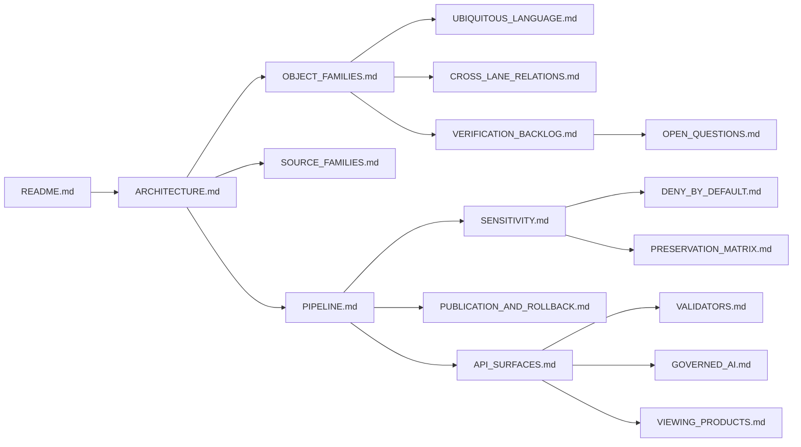

<!-- [KFM_META_BLOCK_V2]
doc_id: kfm://doc/settlements-infrastructure/missing-or-planned-files
title: Settlements / Infrastructure — Missing or Planned Files
type: standard
version: v0.1
status: draft
owners: <PLACEHOLDER — Settlements/Infrastructure dossier steward; verify in CODEOWNERS>
created: 2026-05-19
updated: 2026-05-19
policy_label: public
related:
  - docs/domains/settlements-infrastructure/README.md
  - docs/doctrine/directory-rules.md
  - docs/registers/VERIFICATION_BACKLOG.md
  - kfm://atlas/v1.1/ch14
tags: [kfm, dossier, settlements, infrastructure, backlog, register]
notes:
  - Authored from doctrine; no mounted repo inspected this session.
  - Every dossier-internal file path is PROPOSED until repo verification.
  - Dossier folder name follows Directory Rules §6.1 (CONFIRMED).
[/KFM_META_BLOCK_V2] -->

# Settlements / Infrastructure — Missing or Planned Files

> Authoring register: which files this domain dossier should carry, which already exist,
> and which placement questions remain open. Doctrine-grounded scope; PROPOSED paths
> pending repository verification.

| Status | Owners | Last reviewed |
|---|---|---|
| draft (v0.1, doctrine-grounded) | _PLACEHOLDER_ — dossier steward; **NEEDS VERIFICATION** in CODEOWNERS | 2026-05-19 |

---

## Contents

1. [Scope and intent](#1-scope-and-intent)
2. [How to use this register](#2-how-to-use-this-register)
3. [Dossier file map (Mermaid)](#3-dossier-file-map-mermaid)
4. [Tier A — Dossier-internal files (`docs/domains/settlements-infrastructure/…`)](#4-tier-a--dossier-internal-files)
5. [Tier B — Cross-root files this lane implies](#5-tier-b--cross-root-files-this-lane-implies)
6. [Tier C — Open placement and structural questions](#6-tier-c--open-placement-and-structural-questions)
7. [Verification backlog overlay](#7-verification-backlog-overlay)
8. [Suggested authoring order and dependencies](#8-suggested-authoring-order-and-dependencies)
9. [Anti-patterns specific to this dossier](#9-anti-patterns-specific-to-this-dossier)
10. [Related docs](#10-related-docs)
11. [Changelog](#11-changelog)

---

## 1. Scope and intent

This file is the **authoring register** for the Settlements / Infrastructure domain
dossier at `docs/domains/settlements-infrastructure/`. It tracks:

- which Markdown artifacts the dossier should carry,
- which adjacent cross-root files (schemas, contracts, policy, fixtures, runbooks,
  connectors, data lanes) this dossier implies,
- and which placement / naming / structural questions remain open.

**CONFIRMED doctrine basis.** The Settlements / Infrastructure lane is governed by
Atlas v1.1 Ch. 14 (Settlements and Infrastructure) and the Encyclopedia spine, with
placement governed by Directory Rules §6.1 (`docs/domains/settlements-infrastructure/`
appears as a canonical dossier folder under `docs/domains/`).

**PROPOSED file paths.** No mounted repository, CI, workflow, dashboard, or runtime
log was inspected during authoring of this register. Every dossier-internal and
cross-root path below is **PROPOSED** until repo verification. Whether the dossier
folder itself currently exists in the repository is **NEEDS VERIFICATION**.

> [!NOTE]
> This register intentionally does **not** assert that any file listed below already
> exists. It asserts only what the doctrine and dossier conventions imply *should*
> exist. Verification against a mounted repository converts entries from PROPOSED
> to CONFIRMED.

[Back to top](#contents)

---

## 2. How to use this register

Each entry in Tiers A–C carries:

- **Path** — proposed file path under the appropriate responsibility root.
- **Purpose** — what the file would carry, in one or two sentences.
- **Doctrine anchor** — atlas / encyclopedia / directory-rules section that supports it.
- **Truth label** — `CONFIRMED` (path exists or doctrine fully supports), `PROPOSED`
  (recommended placement, not yet verified), `INFERRED` (derivable from adjacent
  evidence), or `NEEDS VERIFICATION` (checkable against the repo).
- **Status** — `not authored` | `authored, unverified` | `authored, verified`.

A reviewer working through this list should:

1. Read the doctrine anchor before authoring.
2. Open the file under its **PROPOSED** path; if the repo dictates a different
   placement, file the conflict to `docs/registers/DRIFT_REGISTER.md` and propose
   an ADR per Directory Rules §2.4.
3. Mark the entry `authored, unverified` until the dossier README cross-links it
   and any companion contract / schema / policy / test artifact is in place.

> [!TIP]
> Tier A entries are pure documentation. Tier B entries cross responsibility
> roots and **MUST** be cleared against Directory Rules before any path is created.
> Tier C entries are decisions, not files — resolve them first when they block
> Tier A or B work.

[Back to top](#contents)

---

## 3. Dossier file map (Mermaid)

```mermaid
flowchart TB
    subgraph DOCS["docs/domains/settlements-infrastructure/"]
        README["README.md"]
        ARCH["ARCHITECTURE.md"]
        OBJ["OBJECT_FAMILIES.md"]
        UBQ["UBIQUITOUS_LANGUAGE.md"]
        SRC["SOURCE_FAMILIES.md"]
        XLN["CROSS_LANE_RELATIONS.md"]
        PIPE["PIPELINE.md"]
        SENS["SENSITIVITY.md"]
        API["API_SURFACES.md"]
        VAL["VALIDATORS.md"]
        VIEW["VIEWING_PRODUCTS.md"]
        AI["GOVERNED_AI.md"]
        PUB["PUBLICATION_AND_ROLLBACK.md"]
        VBK["VERIFICATION_BACKLOG.md"]
        OPQ["OPEN_QUESTIONS.md"]
        PRES["PRESERVATION_MATRIX.md"]
        DENY["DENY_BY_DEFAULT.md"]
        MISS["MISSING_OR_PLANNED_FILES.md (this file)"]
    end

    subgraph CROSS["Cross-root targets implied by this dossier (PROPOSED)"]
        SCH["schemas/contracts/v1/domains/settlements-infrastructure/"]
        CON["contracts/domains/settlements-infrastructure/"]
        POL["policy/sensitivity/settlements-infrastructure/"]
        TST["tests/fixtures/settlements-infrastructure/"]
        RUN["docs/runbooks/settlements-infrastructure/"]
        CXN["connectors/settlements-infrastructure/"]
        DATA["data/.../settlements-infrastructure/"]
    end

    README --> ARCH --> OBJ
    README --> SRC --> XLN
    ARCH --> PIPE --> PUB
    OBJ --> SCH
    SENS --> POL
    VAL --> TST
    SRC --> CXN
    PIPE --> DATA
    AI --> API
    PRES --> DENY
    VBK --- OPQ
    MISS -.tracks.-> README
    MISS -.tracks.-> CROSS

    classDef proposed fill:#fff7d6,stroke:#a07b00,color:#3a2e00;
    classDef dossier  fill:#e6f0ff,stroke:#1e3a8a,color:#0b1d3a;
    class CROSS,SCH,CON,POL,TST,RUN,CXN,DATA proposed;
    class DOCS,README,ARCH,OBJ,UBQ,SRC,XLN,PIPE,SENS,API,VAL,VIEW,AI,PUB,VBK,OPQ,PRES,DENY,MISS dossier;
```

> [!WARNING]
> The diagram reflects the *proposed* dossier shape derived from the Atlas
> chapter spine (sub-sections A–N) and from the encyclopedia rule that the
> `docs/domains/<domain>/` dossier carries `README`, `ARCHITECTURE`,
> `PRESERVATION_MATRIX`, `VERIFICATION_BACKLOG`, etc. Mounted-repo presence of
> any node is **NEEDS VERIFICATION**.

[Back to top](#contents)

---

## 4. Tier A — Dossier-internal files

All entries below sit under `docs/domains/settlements-infrastructure/`. Doctrine
anchor codes: **A14** = Atlas Ch. 14 sub-section letter; **DR** = Directory Rules
section; **ENCY** = Encyclopedia §6.2 / §7.

| # | File | Purpose | Doctrine anchor | Truth label | Status |
|---|---|---|---|---|---|
| A1 | `README.md` | Dossier landing page: scope, boundary, non-ownership, navigation, badge row, mini-TOC. Required per Directory Rules §15 README contract. | A14.A–B; DR §15; ENCY §6.2 | PROPOSED path; CONFIRMED requirement | not authored |
| A2 | `ARCHITECTURE.md` | Lane-level architecture: responsibility-layer mapping, schema home, contract home, policy home, public-safe release surface. | A14 (lane spine); DR §6 | PROPOSED | not authored |
| A3 | `OBJECT_FAMILIES.md` | Per-object detail for Settlement, Municipality, CensusPlace, Townsite, GhostTown, Fort, Mission, ReservationCommunity, Infrastructure Asset, Network Node, Network Segment, Facility, Service Area, Operator, Condition Observation, Dependency. | A14.E | CONFIRMED object set; PROPOSED file | not authored |
| A4 | `UBIQUITOUS_LANGUAGE.md` | Domain glossary extending the Atlas Ch. 14.C language table with field-realization notes. | A14.C; DDD ref. | CONFIRMED terms; PROPOSED file | not authored |
| A5 | `SOURCE_FAMILIES.md` | Census TIGER / census-place geography, GNIS / gazetteers, state-local Kansas Geoportal-style sources, municipal & local legal records, historical gazetteers and maps, infrastructure operators / providers, KDOT / bridge / facility sources, FEMA / hazards / resilience sources. Rights and freshness per source family. | A14.D | CONFIRMED set; PROPOSED file | not authored |
| A6 | `CROSS_LANE_RELATIONS.md` | Relations to Roads/Rail (depot, bridge, crossing, transport facility), Hazards (exposure, resilience, warnings, declarations), Hydrology (water, wastewater, stormwater, floodplain, drainage), People/Land (residence, ownership, parcel, migration context). | A14.F | CONFIRMED | not authored |
| A7 | `PIPELINE.md` | Lane application of RAW → WORK/QUARANTINE → PROCESSED → CATALOG/TRIPLET → PUBLISHED, with per-stage handling, gate, and rollback / failure posture. | A14.H; DR §3 lifecycle invariant | CONFIRMED doctrine; PROPOSED file | not authored |
| A8 | `SENSITIVITY.md` | Default-restricted set (critical infrastructure, utilities, condition observations, dependencies, operator-sensitive details, exact facility geometry). Promotion blockers. | A14.I | CONFIRMED policy direction; PROPOSED file | not authored |
| A9 | `API_SURFACES.md` | Lane API: feature/detail resolver, layer manifest resolver, Evidence Drawer payload, Focus Mode answer; finite outcomes (ANSWER / ABSTAIN / DENY / ERROR); schema responsibility root. | A14.J | CONFIRMED surfaces; PROPOSED file; routes UNKNOWN | not authored |
| A10 | `VALIDATORS.md` | Test backlog: legal municipality evidence; census-vs-municipality distinction; infrastructure topology; condition observed_at; restricted geometry no-leak; catalog/proof/release closure. | A14.K | CONFIRMED test set; PROPOSED file | not authored |
| A11 | `VIEWING_PRODUCTS.md` | Viewing products: current settlement view, historic townsite view, legal-status-event view, census-place comparison, public-safe asset view, service-area aggregate view, dependency-summary view, restricted internal review view; plus cross-cutting Evidence Drawer / time-aware state / trust badges / Focus Mode. | A14.G; MapLibre Master | CONFIRMED set; PROPOSED file | not authored |
| A12 | `GOVERNED_AI.md` | Per-domain Focus Mode behavior: summarize released EvidenceBundles; ABSTAIN when evidence is insufficient; DENY when policy / rights / sensitivity / release state blocks. | A14.L; GAI | CONFIRMED doctrine; PROPOSED file | not authored |
| A13 | `PUBLICATION_AND_ROLLBACK.md` | Release requirements (ReleaseManifest, EvidenceBundle, validation/policy support, review state, correction path, stale-state rule, rollback target). | A14.M; ENCY App. E | CONFIRMED requirements; PROPOSED file | not authored |
| A14 | `VERIFICATION_BACKLOG.md` | Lane-scoped verification items carried from Atlas Ch. 14.N (source rights & municipal legal-source roles; critical infrastructure policy; public-safe layer registry; API / Focus Mode auth-policy behavior). | A14.N; ENCY §6.2 | CONFIRMED items; PROPOSED file | not authored |
| A15 | `OPEN_QUESTIONS.md` | Domain-specific structural questions (folder name; encyclopedia chapter alignment; restricted-geometry threshold; viewing-product registry placement). | DR §18; ENCY §15 | PROPOSED | not authored |
| A16 | `PRESERVATION_MATRIX.md` | Per-object preservation matrix (rights → sensitivity → release-state → audience). Encyclopedia §6.2 cites this as a standard dossier artifact. | ENCY §6.2 | PROPOSED | not authored |
| A17 | `DENY_BY_DEFAULT.md` | Domain-scoped slice of the deny-by-default register (Atlas Ch. 20.5): critical assets, dependencies, condition detail → allowed only with steward review + public-safe generalization. | Atlas Ch. 20.5 | CONFIRMED entries; PROPOSED file | not authored |
| A18 | `MISSING_OR_PLANNED_FILES.md` | This file — the dossier authoring register. | self | CONFIRMED (this draft) | authored, unverified |

> [!IMPORTANT]
> Truth label policy. The **set** of needed dossier files is CONFIRMED from
> Atlas Ch. 14.A–N and Encyclopedia §6.2. The **paths and filenames** are PROPOSED.
> If the mounted repo uses different filenames (e.g., kebab-case, lowercase), this
> register must be reconciled to the repo, not the other way around.

[Back to top](#contents)

---

## 5. Tier B — Cross-root files this lane implies

These files cross **out** of `docs/` into other responsibility roots. They are
listed here so the dossier author has a single navigable backlog, but each path
**MUST** clear Directory Rules placement review before creation. None should be
created from this register alone.

### 5.1 Schemas — `schemas/contracts/v1/domains/settlements-infrastructure/` (PROPOSED)

| # | File | Purpose | Doctrine anchor | Truth label |
|---|---|---|---|---|
| B1.1 | `settlement.schema.json` | Shape for `Settlement` object family. | A14.E; DR §6.4 | PROPOSED |
| B1.2 | `municipality.schema.json` | Shape for `Municipality` (legal place). | A14.E | PROPOSED |
| B1.3 | `census_place.schema.json` | Shape for `CensusPlace` (TIGER census-place geography). | A14.E | PROPOSED |
| B1.4 | `townsite.schema.json` | Shape for `Townsite` (historic). | A14.E | PROPOSED |
| B1.5 | `ghost_town.schema.json` | Shape for `GhostTown`. | A14.E | PROPOSED |
| B1.6 | `fort.schema.json` | Shape for `Fort`. | A14.E | PROPOSED |
| B1.7 | `mission.schema.json` | Shape for `Mission`. | A14.E | PROPOSED |
| B1.8 | `reservation_community.schema.json` | Shape for `ReservationCommunity` — cross-check People/Land + sovereignty review. | A14.E; A14.F | PROPOSED |
| B1.9 | `infrastructure_asset.schema.json` | Shape for `Infrastructure Asset` — sensitivity-bearing. | A14.E; A14.I | PROPOSED |
| B1.10 | `network_node.schema.json` | Shape for `Network Node`. | A14.E | PROPOSED |
| B1.11 | `network_segment.schema.json` | Shape for `Network Segment`. | A14.E | PROPOSED |
| B1.12 | `facility.schema.json` | Shape for `Facility`. | A14.E | PROPOSED |
| B1.13 | `service_area.schema.json` | Shape for `Service Area`. | A14.E | PROPOSED |
| B1.14 | `operator.schema.json` | Shape for `Operator` — sensitivity-bearing. | A14.E; A14.I | PROPOSED |
| B1.15 | `condition_observation.schema.json` | Shape for `Condition Observation`; `observed_at` discipline. | A14.E; A14.K | PROPOSED |
| B1.16 | `dependency.schema.json` | Shape for `Dependency` — sensitivity-bearing. | A14.E; A14.I | PROPOSED |
| B1.17 | `redaction_receipt.schema.json` (lane projection) | If lane-specific RedactionReceipt fields are needed; otherwise share with core. | ENCY; Pass-10 C6 | PROPOSED |

> [!CAUTION]
> **Schema-home rule (ADR-0001).** The default machine-schema home is
> `schemas/contracts/v1/...`. Do **not** create `contracts/<domain>/<x>.schema.json`
> — that pattern is lineage / CONFLICTED. Any divergent definitions in `schemas/`
> and `contracts/` are a violation of Directory Rules §6.4.

### 5.2 Contracts — `contracts/domains/settlements-infrastructure/` (PROPOSED)

Markdown contracts describing object **meaning**, field intent, and invariants.

| # | File | Purpose | Truth label |
|---|---|---|---|
| B2.1 | `settlement.md` | Meaning, fields, invariants for `Settlement`. | PROPOSED |
| B2.2 | `municipality.md` | Distinguishes legal municipality from census place; legal-source role. | PROPOSED |
| B2.3 | `census_place.md` | Census-place semantics; explicit non-equivalence to municipality. | PROPOSED |
| B2.4 | `townsite.md`, `ghost_town.md`, `fort.md`, `mission.md` | Historic place semantics; uncertainty and source-role notes. | PROPOSED |
| B2.5 | `reservation_community.md` | Sovereignty, cultural-source, CARE considerations. | PROPOSED |
| B2.6 | `infrastructure_asset.md` | Sensitivity-bearing object meaning. | PROPOSED |
| B2.7 | `network_node.md`, `network_segment.md`, `facility.md`, `service_area.md` | Network and facility meaning. | PROPOSED |
| B2.8 | `operator.md`, `condition_observation.md`, `dependency.md` | Operator-sensitive and condition-bearing meaning; `observed_at` rule. | PROPOSED |

### 5.3 Policy — `policy/sensitivity/settlements-infrastructure/` (PROPOSED)

| # | File | Purpose | Truth label |
|---|---|---|---|
| B3.1 | `critical_infrastructure_deny.rego` (or `.yaml`) | Default-deny for critical infrastructure assets, dependencies, condition detail until steward review + public-safe generalization. | PROPOSED |
| B3.2 | `operator_sensitivity.rego` | Operator-sensitive details default to restricted. | PROPOSED |
| B3.3 | `exact_facility_geometry.rego` | Exact facility geometry default-restricted; allowed under generalization receipt. | PROPOSED |
| B3.4 | `sensitive_join_block.rego` | Blocks unsafe joins with People/Land (residence, parcel), Hazards (exposure), per A14.F. | PROPOSED |
| B3.5 | `legal_vs_census_separation.rego` | Prevents collapsing legal municipality and census-place records into a single layer. | PROPOSED |

> [!NOTE]
> Canonical singular root is `policy/` (Directory Rules §5 canonical roots).
> `policies/` is a compatibility mirror if it exists. Do not create divergent
> rules in both.

### 5.4 Tests and fixtures — `tests/fixtures/settlements-infrastructure/{valid,invalid}/` (PROPOSED)

Six PROPOSED validator families from Atlas Ch. 14.K, each with paired valid /
invalid / quarantine fixtures:

| # | Fixture family | Validator role | Truth label |
|---|---|---|---|
| B4.1 | `legal_municipality_evidence/` | Legal-source role test set. | PROPOSED |
| B4.2 | `census_vs_municipality/` | Distinguishing CensusPlace from Municipality. | PROPOSED |
| B4.3 | `infrastructure_topology/` | Network-segment / node / facility topology validity. | PROPOSED |
| B4.4 | `condition_observed_at/` | Temporal discipline for `Condition Observation`. | PROPOSED |
| B4.5 | `restricted_geometry_no_leak/` | Negative-state: ensures restricted geometry never leaves the trust membrane. | PROPOSED |
| B4.6 | `catalog_proof_release_closure/` | EvidenceBundle / ReleaseManifest / rollback closure tests. | PROPOSED |

> [!IMPORTANT]
> Each fixture family must include negative-state cases (DENY / ABSTAIN /
> ERROR / HOLD). Positive-only coverage is an anti-pattern in KFM.

### 5.5 Runbooks — `docs/runbooks/settlements-infrastructure/` (PROPOSED, **OPEN-DR-02**)

| # | File | Purpose | Truth label |
|---|---|---|---|
| B5.1 | `SOURCE_REFRESH_RUNBOOK.md` | Refresh procedure for TIGER, GNIS, KDOT, FEMA, Kansas Geoportal, and operator-supplied source families. | PROPOSED |
| B5.2 | `CRITICAL_INFRASTRUCTURE_REVIEW.md` | Steward review walkthrough for default-restricted assets. | PROPOSED |
| B5.3 | `PUBLIC_SAFE_GENERALIZATION_DRILL.md` | Generalization-receipt workflow before any restricted feature is published. | PROPOSED |
| B5.4 | `ROLLBACK_DRILL.md` | Lane-scoped rollback drill referencing `release/rollback_cards/`. | PROPOSED |

> [!WARNING]
> **OPEN-DR-02.** Pattern A (`docs/runbooks/<domain>/`) vs Pattern B (flat
> with prefix) is not yet ADR-frozen. The fauna runbook uses Pattern A;
> this register follows Pattern A for consistency. If an ADR selects
> Pattern B, every runbook path here changes accordingly.

### 5.6 Connectors — `connectors/settlements-infrastructure/` (PROPOSED)

| # | Path | Purpose | Truth label |
|---|---|---|---|
| B6.1 | `tiger_census_place/` | Census TIGER / census-place geography connector. | PROPOSED |
| B6.2 | `gnis/` | USGS GNIS connector (Pass-10 C7-09). | PROPOSED |
| B6.3 | `kansas_geoportal/` | State-local Kansas Geoportal-style connector. | PROPOSED |
| B6.4 | `kdot_facility/` | KDOT bridge / facility connector. | PROPOSED |
| B6.5 | `fema_resilience/` | FEMA hazards / resilience connector (cross-lane with Hazards). | PROPOSED |
| B6.6 | `municipal_legal_records/` | Per-municipality legal-record adapters; may be PDF/CSV harvest. | PROPOSED |
| B6.7 | `historical_gazetteers/` | Historical gazetteer and map sources. | PROPOSED |
| B6.8 | `infrastructure_operator/` | Operator-supplied feeds (default restricted). | PROPOSED |

> [!NOTE]
> Connector output goes to `data/raw/` or `data/quarantine/` only. Connectors
> never publish (Directory Rules §5).

### 5.7 Data lanes — `data/<phase>/settlements-infrastructure/` (PROPOSED)

| # | Path | Phase | Truth label |
|---|---|---|---|
| B7.1 | `data/raw/settlements-infrastructure/` | Immutable source payloads with SourceDescriptor. | PROPOSED |
| B7.2 | `data/quarantine/settlements-infrastructure/` | Failed-validation or unresolved-rights holds. | PROPOSED |
| B7.3 | `data/processed/settlements-infrastructure/` | Validated normalized objects + EvidenceRef + ValidationReport. | PROPOSED |
| B7.4 | `data/catalog/settlements-infrastructure/` | Catalog records, EvidenceBundles, release candidates. | PROPOSED |
| B7.5 | `data/published/settlements-infrastructure/` | Public-safe released artifacts (governed-API-served). | PROPOSED |
| B7.6 | `data/receipts/settlements-infrastructure/` | Run receipts, redaction receipts, validation receipts. | PROPOSED |
| B7.7 | `data/proofs/settlements-infrastructure/` | EvidenceBundle proofs. | PROPOSED |
| B7.8 | `release/manifests/settlements-infrastructure/` | ReleaseManifests for lane releases. | PROPOSED |
| B7.9 | `release/rollback_cards/settlements-infrastructure/` | Rollback decisions for this lane. | PROPOSED |

[Back to top](#contents)

---

## 6. Tier C — Open placement and structural questions

These are decisions, not files. Resolve before authoring affected Tier A / B entries.

| ID | Question | Status | Resolution path |
|---|---|---|---|
| OPEN-SETTLE-01 | Dossier folder name: `docs/domains/settlements-infrastructure/` (Directory Rules §6.1) vs an encyclopedia variant such as `settlements-and-infrastructure/`. Parallel to **OPEN-ENC-04** (geology naming). | OPEN | ADR-class per DR §2.4 (placement). Until resolved, this register follows DR §6.1 form. |
| OPEN-SETTLE-02 | Should `Operator` and `Dependency` schemas live under `settlements-infrastructure/` or under a shared `infrastructure-commons/` schema home that Roads/Rail and Hazards also reference? | OPEN | Cross-lane question; touches Atlas Ch. 24.12 ADR-S-14 (cross-lane join policy). |
| OPEN-SETTLE-03 | Public-safe layer registry placement: per-domain layer manifest under `data/published/settlements-infrastructure/` vs a global `release/manifests/layers/`. The lane manifest resolver (A14.J) implies one of these is canonical. | NEEDS VERIFICATION | DR §18 OPEN (manifests sibling). |
| OPEN-SETTLE-04 | Restricted-geometry threshold for `Infrastructure Asset` and `Facility` (radius, generalization profile, cell size). Likely shares Pass-10 C6 profiles, but the lane-specific calibration is unsettled. | NEEDS VERIFICATION | Author `policy/redaction/profiles.yaml` calibration entry per Pass-10 C6-02. |
| OPEN-SETTLE-05 | Whether `ReservationCommunity` belongs entirely in Settlements / Infrastructure or has an authority overlap with People / Land for sovereignty / consent. | OPEN | Cross-lane review with People/DNA/Land dossier owner. |
| OPEN-SETTLE-06 | Filename casing convention for the dossier files (`MISSING_OR_PLANNED_FILES.md` UPPER_UNDERSCORES vs `missing-or-planned-files.md` lower-kebab). Parallel to **OPEN-DR-04** (standards casing). | OPEN | Resolution via per-root README at `docs/domains/README.md` or ADR. Pending, this register uses UPPER_SNAKE_CASE matching `VERIFICATION_BACKLOG.md` / `PRESERVATION_MATRIX.md` precedents in Encyclopedia §6.2. |
| OPEN-SETTLE-07 | Runbook subfolder vs flat (parallel to **OPEN-DR-02**) for this lane. | OPEN | Defer to OPEN-DR-02 ADR. |

[Back to top](#contents)

---

## 7. Verification backlog overlay

The four verification items below are CONFIRMED open per Atlas Ch. 14.N and carry
into the dossier-internal `VERIFICATION_BACKLOG.md` (Tier A14). They are echoed
here so that authoring of Tier A and B files happens in the shadow of the
unresolved items.

| Item | Evidence that would settle it | Status |
|---|---|---|
| Verify source rights and municipal legal-source roles. | Mounted repo files, source registry entries, rights metadata, review records. | NEEDS VERIFICATION |
| Verify critical infrastructure policy. | Mounted `policy/` rules, fixtures exercising DENY paths, integration tests. | NEEDS VERIFICATION |
| Verify public-safe layer registry. | Layer manifest under `release/manifests/` or `data/published/`, with attribution / rights / sensitivity fields. | NEEDS VERIFICATION |
| Verify API and Focus Mode auth / policy behavior. | Governed API routes, AIReceipt evaluator, policy gates, Focus Mode template inventory. | NEEDS VERIFICATION |

[Back to top](#contents)

---

## 8. Suggested authoring order and dependencies

Author the dossier from doctrine outward. Each step assumes the prior step
landed and was reviewed.

**Heuristic.** Land Tier A files first; defer Tier B (schemas, policy, fixtures)
until at least `ARCHITECTURE.md`, `OBJECT_FAMILIES.md`, `SENSITIVITY.md`, and
`PIPELINE.md` exist. Premature schema authoring without a stable object-family
contract risks the schema-home rule (ADR-0001) being applied inconsistently.

<b>Recommended PR slicing (PROPOSED)</b>

1. **PR-1: Dossier skeleton.** README, ARCHITECTURE, OBJECT_FAMILIES,
   UBIQUITOUS_LANGUAGE. Doctrine only; no schema or policy edits.
2. **PR-2: Source + cross-lane.** SOURCE_FAMILIES, CROSS_LANE_RELATIONS.
3. **PR-3: Lifecycle + sensitivity.** PIPELINE, SENSITIVITY, DENY_BY_DEFAULT,
   PRESERVATION_MATRIX. References Atlas Ch. 20.5.
4. **PR-4: Surfaces.** API_SURFACES, VIEWING_PRODUCTS, GOVERNED_AI,
   PUBLICATION_AND_ROLLBACK.
5. **PR-5: Backlog.** VALIDATORS, VERIFICATION_BACKLOG, OPEN_QUESTIONS,
   and updates to this `MISSING_OR_PLANNED_FILES.md` as items convert from
   PROPOSED to CONFIRMED.
6. **Subsequent PRs:** schemas, contracts, policy, fixtures, runbooks under
   their respective responsibility roots, each preceded by a Directory Rules
   placement check.

[Back to top](#contents)

---

## 9. Anti-patterns specific to this dossier

> [!WARNING]
> These are common ways the Settlements / Infrastructure dossier could go wrong.
> Author defensively.

- **Collapsing legal municipality and census place into one record.** They are
  distinct source-role objects (legal vs observation/geography). Atlas Ch. 14.E
  treats them as separate object families.
- **Treating `Operator` or `Dependency` as a public attribute.** Both default
  to restricted per Atlas Ch. 14.I and the deny-by-default register (Atlas
  Ch. 20.5).
- **Publishing exact `Facility` geometry without a generalization receipt.**
  Exact facility geometry default-restricted. The "restricted geometry no-leak"
  validator family (B4.5) exists specifically to catch this.
- **Authoring schemas under `contracts/<domain>/`.** Violates ADR-0001.
  Default schema home is `schemas/contracts/v1/domains/settlements-infrastructure/`.
- **Linking the encyclopedia chapter as authoritative over the dossier.** Per
  Encyclopedia §6.2: when an encyclopedia chapter disagrees with the domain
  dossier, **the dossier wins**.
- **Treating the Atlas chapter spine (A–N) as a doc template.** The spine is a
  doctrine outline. The dossier file split (Tier A1–A18 above) is the
  authoring unit; do not jam all sub-sections into a single `dossier.md`.
- **Creating a parallel sensitivity register.** The lane sensitivity must
  reference Atlas Ch. 20.5 and Pass-10 C6 named profiles, not invent
  domain-local sensitivity vocabulary.
- **Treating connectors as part of the dossier.** Connectors live under
  `connectors/`. They are listed here as cross-root targets, not as
  dossier-internal files.

[Back to top](#contents)

---

## 10. Related docs

- [`docs/domains/settlements-infrastructure/README.md`](./README.md) — dossier landing page _(PROPOSED, not yet authored)_
- [`docs/domains/settlements-infrastructure/VERIFICATION_BACKLOG.md`](./VERIFICATION_BACKLOG.md) — lane verification register _(PROPOSED)_
- [`docs/domains/settlements-infrastructure/SENSITIVITY.md`](./SENSITIVITY.md) — sensitivity & restricted-geometry policy _(PROPOSED)_
- [`docs/doctrine/directory-rules.md`](../../doctrine/directory-rules.md) — placement authority
- [`docs/registers/VERIFICATION_BACKLOG.md`](../../registers/VERIFICATION_BACKLOG.md) — repo-wide verification register
- [`docs/registers/DRIFT_REGISTER.md`](../../registers/DRIFT_REGISTER.md) — file drift / conflict ledger
- Atlas v1.1 Ch. 14 — Settlements and Infrastructure _(authoritative doctrine source)_
- Atlas v1.1 Ch. 20.5 — Deny-by-default register and sensitivity matrix
- Encyclopedia §6.2 — Encyclopedia vs. Domain Dossier (dossier-wins rule)
- Pass-10 Idea Index, §6.6 (C6) — Sensitivity, redaction, and geoprivacy profiles
- Cross-lane dossier pointers _(PROPOSED paths)_:
  - [`docs/domains/roads-rail-trade/`](../roads-rail-trade/)
  - [`docs/domains/hazards/`](../hazards/)
  - [`docs/domains/hydrology/`](../hydrology/)
  - [`docs/domains/people-dna-land/`](../people-dna-land/)

---

## 11. Changelog

| Version | Date | Change |
|---|---|---|
| v0.1 | 2026-05-19 | Initial draft. Doctrine-grounded register; all Tier A and Tier B paths PROPOSED; Tier C lists seven open structural questions; verification backlog overlay carried from Atlas Ch. 14.N. No mounted repo inspected this session. |

---

_Last updated: 2026-05-19 · [Back to top](#contents)_
