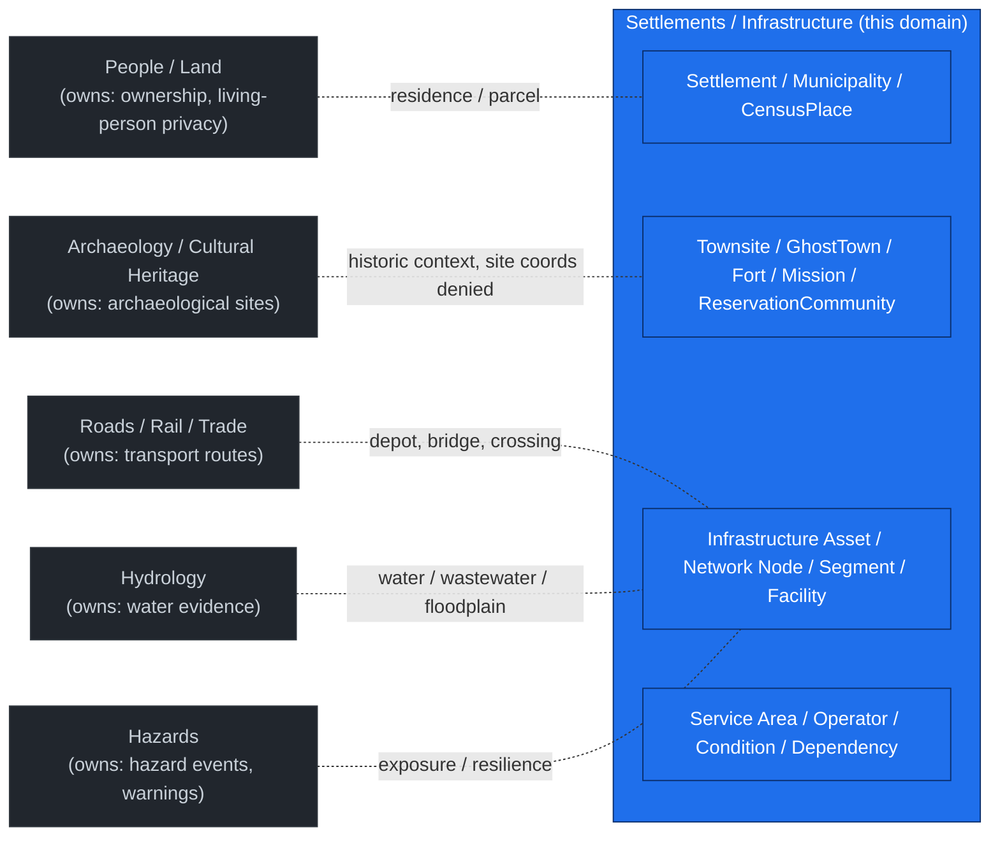
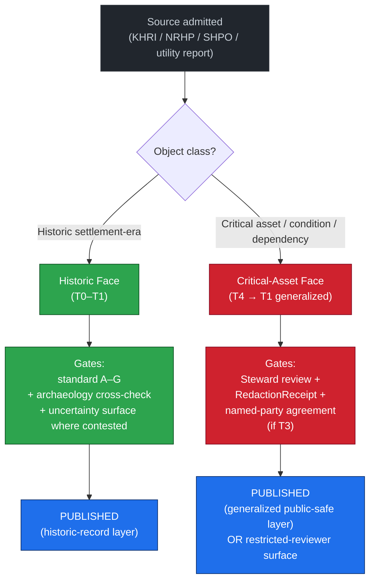
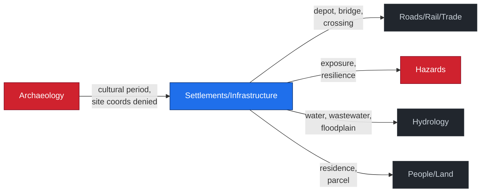

<!-- [KFM_META_BLOCK_V2]
doc_id: kfm://doc/domains/settlements-infrastructure/preservation-matrix
title: Settlements / Infrastructure — Preservation Matrix
type: standard
subtype: domain-dossier/preservation-matrix
version: v0.1
status: draft
owners: <settlements-infrastructure-steward>  # PLACEHOLDER — assign before review
created: 2026-05-19
updated: 2026-05-19
policy_label: public
extends:
  - Atlas v1.1 §24.5 Master Sensitivity / Rights Tier Reference (T0–T4)  # CONFIRMED doctrine
  - Atlas v1.0 §20.5 Deny-by-Default Register and Sensitivity Matrix  # CONFIRMED doctrine
  - Atlas v1.1 §24.6 Master Pipeline Gate Reference (RAW → PUBLISHED)  # CONFIRMED doctrine
  - DOM-SETTLE Settlements/Infrastructure domain dossier (sections A–L)  # CONFIRMED doctrine
  - KFM Encyclopedia §6.2 — domain dossier file family (README, ARCHITECTURE, PRESERVATION_MATRIX, VERIFICATION_BACKLOG)
related:
  - ../../doctrine/directory-rules.md
  - ../../doctrine/trust-membrane.md
  - ../../doctrine/lifecycle-law.md
  - ../../architecture/contract-schema-policy-split.md
  - ../README.md                                  # docs/domains/ landing — TODO link target
  - ./README.md                                   # docs/domains/settlements-infrastructure/ — TODO link target
  - ./ARCHITECTURE.md                             # PROPOSED sibling — NEEDS VERIFICATION
  - ./VERIFICATION_BACKLOG.md                     # PROPOSED sibling — NEEDS VERIFICATION
  - ../archaeology/PRESERVATION_MATRIX.md         # PROPOSED sibling-domain crosswalk
  - ../people-dna-land/PRESERVATION_MATRIX.md     # PROPOSED sibling-domain crosswalk
  - ../../registers/DRIFT_REGISTER.md
  - ../../registers/VERIFICATION_BACKLOG.md
  - ../../adr/README.md
  - ../../atlases/KFM_Domains_Culmination_Atlas_v1_1.pdf
tags: [kfm, domain, settlements, infrastructure, preservation, sensitivity, governance, doctrine-adjacent]
truth_labels: [CONFIRMED, PROPOSED, INFERRED, NEEDS VERIFICATION, UNKNOWN, EXTERNAL]
notes:
  - "This file is a domain-scoped extension of Atlas v1.1 §24.5 + §24.6. It refines the master tier scheme for the Settlements/Infrastructure object families and does not override the Atlas; conflicts file to docs/registers/DRIFT_REGISTER.md."
  - "No mounted repo was inspected in this authoring session. Every quoted repo path is PROPOSED until confirmed. Implementation maturity for policies, validators, schemas, and routes is UNKNOWN."
  - "The Atlas explicitly bounds the Settlements/Infrastructure deny lane to 'Critical-asset deny lane' (§24.13) and 'Infrastructure — critical asset detail T4 / generalized facility footprint + suppressed dependency → T1' (§24.5.2). This matrix preserves those defaults."
  - "Two preservation faces are in scope: (a) historic preservation of settlement-era objects (Townsite, GhostTown, Fort, Mission, ReservationCommunity, historic Infrastructure); (b) operational preservation of critical-infrastructure assets and their condition/vulnerability records. Both ride the same sensitivity-tier machinery; the gates differ."
[/KFM_META_BLOCK_V2] -->

<a id="top"></a>

# Settlements / Infrastructure — Preservation Matrix

> **Domain-scoped extension of Atlas v1.1 §24.5 (Master Sensitivity / Rights Tier Reference) for the Settlements / Infrastructure object families.** Names default sensitivity tiers, allowed transforms, required gates, reviewer roles, and cross-lane preservation relationships for the settlement-era, historic-preservation, and critical-infrastructure surfaces this domain owns. Subordinate to Atlas, doctrine, ADRs, and policy — never a substitute for them.

[](#0-status--authority)
[](#1-purpose--non-purpose)
[](#2-doctrinal-basis-and-source-ledger)
[](#0-status--authority)
[](#4-tier-scheme-summary)
[](#0-status--authority)
[](#status--authority)
[]()

> [!IMPORTANT]
> **Critical-infrastructure preservation has two failure modes.** Under-protection (publishing condition / vulnerability detail that enables harm) and over-redaction (suppressing public-safe historic-settlement evidence behind an infrastructure deny lane). This matrix splits the two surfaces so neither absorbs the other.

---

## Mini-TOC

- [0. Status & Authority](#0-status--authority)
- [1. Purpose & Non-Purpose](#1-purpose--non-purpose)
- [2. Doctrinal Basis and Source Ledger](#2-doctrinal-basis-and-source-ledger)
- [3. Scope, Boundary, and Explicit Non-Ownership](#3-scope-boundary-and-explicit-non-ownership)
- [4. Tier Scheme Summary](#4-tier-scheme-summary)
- [5. Preservation Matrix — Object Class × Default Tier × Transform × Gate](#5-preservation-matrix--object-class--default-tier--transform--gate)
- [6. Two Preservation Faces — Historic vs. Critical-Asset](#6-two-preservation-faces--historic-vs-critical-asset)
- [7. Allowed Tier Transitions (Domain-Scoped)](#7-allowed-tier-transitions-domain-scoped)
- [8. Pipeline Gate Application (RAW → PUBLISHED)](#8-pipeline-gate-application-raw--published)
- [9. Cross-Lane Preservation Relationships](#9-cross-lane-preservation-relationships)
- [10. Reviewer Roles and Separation of Duties](#10-reviewer-roles-and-separation-of-duties)
- [11. Failure-Closed Behaviors and Anti-Patterns](#11-failure-closed-behaviors-and-anti-patterns)
- [12. UI Negative States](#12-ui-negative-states)
- [13. Worked Examples](#13-worked-examples)
- [14. Open Questions and Verification Backlog](#14-open-questions-and-verification-backlog)
- [15. Conformance Checklist](#15-conformance-checklist)
- [16. Related Docs](#16-related-docs)

---

## 0. Status & Authority

| Field | Value |
|---|---|
| **Document type** | Domain dossier — Preservation matrix (standard doc) |
| **Authority class** | Domain dossier (`docs/domains/<domain>/`) — `CONFIRMED` per Directory Rules §6.1 |
| **Authority rank (per Encyclopedia §6.2)** | When this matrix disagrees with the Atlas, **the Atlas governs**; when this matrix disagrees with the encyclopedia, **this dossier governs** within the Settlements/Infrastructure scope |
| **Doctrinal basis** | `CONFIRMED` — Atlas v1.1 §24.5, §24.6, §24.13; Atlas v1.0 §20.5; DOM-SETTLE sections A–L |
| **Implementation realization** | `PROPOSED` — schema homes, policy bundles, validator coverage, and route surfaces remain `UNKNOWN` / `NEEDS VERIFICATION` until a mounted repo confirms them |
| **Quoted repo paths** | All paths in this document are `PROPOSED` and subject to Directory Rules §4 placement protocol unless explicitly confirmed in a mounted repo |
| **Owner role** | Settlements / Infrastructure domain steward |
| **Required reviewers (material change)** | Domain steward + policy steward + docs steward; sovereignty / cultural reviewer required for any change affecting `ReservationCommunity`, `Mission`, or historic-Indigenous infrastructure rows |
| **Status** | `draft` |
| **Last reviewed** | 2026-05-19 |

> [!CAUTION]
> **Memory is not evidence.** A claim that "the policy denies X" or "the schema enforces Y" is only `CONFIRMED` when supported by a file, schema, contract, policy bundle, test, workflow, runtime, or log in a mounted repo. Recollection, plausible structure, and generic best practice are **not** evidence here.

[↑ back to top](#top)

---

## 1. Purpose & Non-Purpose

### 1.1 Purpose — what this matrix IS

This matrix is the **domain-scoped extension** of Atlas v1.1 §24.5 (Master Sensitivity / Rights Tier Reference) for the object families the Settlements / Infrastructure domain owns. It names, per object class:

- the **default sensitivity tier** (T0–T4),
- the **allowed transforms** that can lift an object toward a more public tier,
- the **required gates** (receipts, reviews, policy decisions) for each transform,
- the **reviewer role(s)** that must sign off,
- the **cross-lane preservation relationships** to Archaeology, People/Land, Hazards, Hydrology, and Roads/Rail.

It also maps each object class to the **two preservation faces** this domain manages — **historic preservation** of settlement-era objects (Townsite, GhostTown, Fort, Mission, ReservationCommunity, historic Infrastructure) and **operational preservation** of critical-asset condition / vulnerability records.

### 1.2 Non-Purpose — what this matrix is NOT

> [!CAUTION]
> The matrix is **not enforcement**. Enforcement lives in `policy/sensitivity/infrastructure/` (and adjacent policy bundles, per Atlas §24.13). This document is the reviewable specification the policy bundle must satisfy.

- **Not a schema home.** Object shape lives in `schemas/contracts/v1/settlement/<…>` per ADR-S-01 (PROPOSED). [DIRRULES]
- **Not a contract home.** Object meaning lives in `contracts/settlement/<…>`.
- **Not a policy home.** Allow / deny / restrict / abstain decisions live in `policy/sensitivity/infrastructure/` and `policy/release/<…>/`.
- **Not an ADR.** Architectural decisions ride the ADR process (`docs/adr/`).
- **Not an alert authority.** Nothing here permits KFM to act as an emergency-alert authority; the Hazards boundary holds [DOM-HAZ].
- **Not a substitute for source-rights review.** Source-specific terms (e.g., KHRI, NRHP, SHPO, vendor utility datasets) are evaluated at admission; the matrix encodes their consequence, not their adjudication.

[↑ back to top](#top)

---

## 2. Doctrinal Basis and Source Ledger

`CONFIRMED` doctrinal anchors (Atlas short-names per v1.0 §2 / v1.1 Appendix B):

| Short-name | Source | What it grounds |
|---|---|---|
| `[DIRRULES]` | Directory Rules | Path placement, ADR triggers, per-root README contract |
| `[ENCY]` | KFM Encyclopedia | Cross-cutting object families, deny-by-default register |
| `[DOM-SETTLE]` | Settlements / Infrastructure dossier | Domain identity, object families, F/G/H/I sections |
| `[DOM-ARCH]` | Archaeology dossier | Cross-lane preservation overlap (historic-site coords denied) |
| `[DOM-PEOPLE]` | People / DNA / Land dossier | Residence / parcel / sovereignty crosswalks |
| `[DOM-HAZ]` | Hazards dossier | Exposure / resilience / alert-authority boundary |
| `[DOM-HYD]` | Hydrology dossier | Water / wastewater / floodplain / drainage relations |
| `[DOM-ROADS]` | Roads / Rail / Trade dossier | Depot / bridge / crossing / transport-facility relations |
| `[MAP-MASTER]` | MapLibre Master | Cross-cutting viewing products, Evidence Drawer |
| `[GAI]` | Governed AI dossier | AIReceipt, ABSTAIN/DENY, Focus Mode templates |

> [!NOTE]
> Atlas v1.0's per-domain F. (cross-lane) tables remain authoritative where they conflict with v1.1's consolidated §24.4 / §24.13 view. This matrix preserves the v1.0 → v1.1 priority order. [DIRRULES] [ENCY]

[↑ back to top](#top)

---

## 3. Scope, Boundary, and Explicit Non-Ownership

`CONFIRMED` ownership (from DOM-SETTLE §B): this domain owns **Settlement; Municipality; CensusPlace; Townsite; GhostTown; Fort; Mission; ReservationCommunity; Infrastructure Asset; Network Node; Network Segment; Facility; Service Area; Operator; Condition Observation; Dependency**.

`CONFIRMED` non-ownership (from DOM-SETTLE §B and Atlas §24.4):



> [!NOTE]
> The diagram reflects DOM-SETTLE §B (CONFIRMED) and Atlas §24.4.12 (CONFIRMED edges owned by Settlements/Infrastructure). Edges drawn as dotted lines are cross-lane *consumes from*, not ownership.

[↑ back to top](#top)

---

## 4. Tier Scheme Summary

`CONFIRMED doctrine` (Atlas v1.1 §24.5.1) — the tier scheme below is the master scheme; this matrix selects defaults per object class.

| Tier | Name | Definition (`PROPOSED`) | Default audience |
|---|---|---|---|
| **T0** | Open | Public-safe with no transformations required; no rights, sensitivity, or steward gating beyond standard release. | Any public client via governed API. |
| **T1** | Generalized | Public-safe only after generalization, fuzzing, aggregation, or redaction; transform reviewed and recorded. | Any public client via governed API. |
| **T2** | Reviewer | Released only to authenticated reviewers or domain stewards; policy-bounded; correction path active. | Stewards, reviewers, named research collaborators. |
| **T3** | Restricted | Released only under named agreement (rights, sovereignty, or consent) and recorded. | Named authorized parties only. |
| **T4** | Denied | Not released to any audience; existence of a record may be released only as steward review permits. | — |

[↑ back to top](#top)

---

## 5. Preservation Matrix — Object Class × Default Tier × Transform × Gate

Two anchors govern every row in this table:

- **Atlas §24.5.2 (CONFIRMED doctrine for two rows):** `Infrastructure — critical asset detail = T4 default; generalized facility footprint + suppressed dependency → T1; gates = Steward review + RedactionReceipt`. `Infrastructure — condition / vulnerability = T4; T3 to named authorities only; never T0 / T1; gates = Steward review + named-party agreement.`
- **Atlas §24.14 (CONFIRMED doctrine for one row):** `Settlement / Municipality / GhostTown = T0; citing domains: People/Land, Frontier Matrix, Archaeology`.

All other rows below extend that doctrinal floor to the remaining DOM-SETTLE object families. Extensions are `PROPOSED` until the policy bundle and an ADR confirm them.

### 5.1 Settlement-era and historic-preservation objects

| Object class | Default tier | Allowed transforms (`PROPOSED` unless noted) | Required gates | Reviewer role | Citation |
|---|---|---|---|---|---|
| **Settlement** | **T0** `CONFIRMED` | None required at default; aggregation receipt if rolled into Frontier-Matrix cells. | Standard release gates A–G. | Domain steward. | [DOM-SETTLE] [ENCY] §24.14 |
| **Municipality** | **T0** `INFERRED` from §24.14 row | None required at default; legal-status-event audit if status changes (e.g., disincorporation). | Standard release gates A–G; `ReviewRecord` for legal-status events. | Domain steward. | [DOM-SETTLE] §B,§E |
| **CensusPlace** | **T0** `INFERRED` | None required at default; vintage / decennial generalization where the source is aggregate by design. | Standard release gates A–G. | Domain steward. | [DOM-SETTLE] §B,§E |
| **Townsite (historic)** | **T0** `PROPOSED` | None required when the townsite is a published historic-record; precise location withheld only when a contemporary archaeological site overlaps (defer to [DOM-ARCH]). | Standard gates; cross-lane check against archaeology overlay. | Domain steward; archaeology cross-review when overlap is suspected. | [DOM-SETTLE] §B,§E; [DOM-ARCH] |
| **GhostTown** | **T0** `CONFIRMED` | None required at default; uncertainty surface for precise location when the source is folk-cartographic or unverified. | Standard gates; `UncertaintySurface` if location is contested. | Domain steward. | [DOM-SETTLE] §B; [ENCY] §24.14 |
| **Fort (historic)** | **T0** `PROPOSED` | None required at default; precise location withheld only where overlapping archaeology or living-community sensitivity applies. | Standard gates; archaeology cross-review when overlap suspected. | Domain steward; archaeology reviewer (if overlap). | [DOM-SETTLE] §B,§E |
| **Mission** | **T1** `PROPOSED` (default) | Public-safe summary; precise location and any Indigenous-community detail follow `[DOM-ARCH]` / `[DOM-PEOPLE]` sovereignty review before any tier change. | `RedactionReceipt` + `ReviewRecord`; sovereignty / cultural review when an Indigenous community is named. | Domain steward + sovereignty / cultural reviewer. | [DOM-SETTLE] §B; [DOM-ARCH]; [DOM-PEOPLE] |
| **ReservationCommunity** | **T2 / T1** `PROPOSED` (default per sovereignty review) | Generalization + steward review; sovereignty reviewer must approve any T2 → T1 transition. | Sovereignty review + `ReviewRecord` + `PolicyDecision`; `RedactionReceipt` if geometry is published. | Sovereignty reviewer (required) + domain steward. | [DOM-SETTLE] §B; [DOM-PEOPLE] §24.4.14 |

### 5.2 Critical-infrastructure objects

| Object class | Default tier | Allowed transforms (`PROPOSED` unless noted) | Required gates | Reviewer role | Citation |
|---|---|---|---|---|---|
| **Infrastructure Asset — non-critical** | **T0** `PROPOSED` (default) | Standard publication; transition to higher restriction if reclassified critical. | Standard release gates A–G. | Domain steward. | [DOM-SETTLE] §B,§E |
| **Infrastructure Asset — critical** | **T4** `CONFIRMED` (Atlas §24.5.2) | Generalized facility footprint + suppressed dependency → **T1**. | **Steward review + `RedactionReceipt`** `CONFIRMED`. | Domain steward (required); release authority distinct from author when materiality applies. | [DOM-SETTLE] §I; Atlas §24.5.2 (CONFIRMED) |
| **Network Node** | **T0 / T1** `PROPOSED` by criticality of the connected asset | Aggregation / generalization when joining sensitive infrastructure. | Standard gates; `AggregationReceipt` or `RedactionReceipt` if criticality applies. | Domain steward. | [DOM-SETTLE] §E |
| **Network Segment** | **T0 / T1** `PROPOSED` by criticality of the route | Aggregation / generalization; private easement detail withheld. | Standard gates; `RedactionReceipt` if private easement is implicated. | Domain steward. | [DOM-SETTLE] §E |
| **Facility (non-critical)** | **T0** `PROPOSED` (default) | Standard publication. | Standard release gates A–G. | Domain steward. | [DOM-SETTLE] §E |
| **Facility (sensitive condition / vulnerability)** | **T4** `INFERRED` from §24.5.2 condition row | T3 to named authorities only; never T0 / T1. | **Steward review + named-party agreement** `CONFIRMED`. | Domain steward + named-party reviewer. | Atlas §24.5.2 (CONFIRMED) |
| **Service Area** | **T0** `PROPOSED` (default) | Aggregation when small-cell counts could expose operator detail. | `AggregationReceipt` if cell suppression applies. | Domain steward. | [DOM-SETTLE] §E |
| **Operator (public utility)** | **T0** `PROPOSED` | None required at default for the operator-as-entity. | Standard gates. | Domain steward. | [DOM-SETTLE] §E |
| **Operator (private with security-sensitive detail)** | **T2** `PROPOSED` | Public-safe summary only; private contact and security-control data withheld. | `RedactionReceipt` + `ReviewRecord`. | Domain steward + named-party reviewer where contract requires. | [DOM-SETTLE] §I |
| **Condition Observation** | **T4** `CONFIRMED` (Atlas §24.5.2 condition row) | T3 to named authorities only; never T0 / T1. | **Steward review + named-party agreement** `CONFIRMED`. | Domain steward + named-party reviewer. | Atlas §24.5.2 (CONFIRMED) |
| **Dependency** | **T4** `INFERRED` from §24.5.2 (`suppressed dependency → T1`) | Suppression / generalization → T1; full dependency graph never T0 / T1 in public surfaces. | `RedactionReceipt` + `ReviewRecord`. | Domain steward. | Atlas §24.5.2 (CONFIRMED) |

> [!IMPORTANT]
> **The two `CONFIRMED` Atlas rows (`Infrastructure — critical asset detail`, `Infrastructure — condition / vulnerability`) are the floor of this matrix.** Every other row sits at or above their restrictiveness for its class; nothing in this matrix lowers the protection on those two surfaces.

[↑ back to top](#top)

---

## 6. Two Preservation Faces — Historic vs. Critical-Asset

The Settlements / Infrastructure domain governs two distinct preservation problems that share the same sensitivity-tier machinery but pull in opposite directions.

| Face | Question it answers | Default posture | Failure mode when wrong |
|---|---|---|---|
| **Historic preservation** | "Should this Townsite / GhostTown / Fort / Mission detail be published as part of the historical record?" | **Open by default** (T0–T1); generalize only where overlapping archaeology, sovereignty, or living-community sensitivity demands it. | **Over-redaction** — public-safe historic record suppressed because a critical-asset deny lane was applied too broadly. |
| **Critical-asset preservation** | "Should this dam / substation / lift-station / pipeline condition / dependency detail be published?" | **Denied by default** (T4); transforms to T1 require `RedactionReceipt`; condition / vulnerability never T0 / T1. | **Under-protection** — condition detail or dependency graph leaks via tile, popup, screenshot, or AI text. |

> [!WARNING]
> **Do not let one face absorb the other.** When a single object instance (e.g., a historic dam still in operation) carries both faces, this matrix splits the record into a historic-context publication (T0/T1) and a condition/vulnerability record (T4/T3-named). The split is recorded via separate `EvidenceBundle`s and separate `LayerManifest` entries.



[↑ back to top](#top)

---

## 7. Allowed Tier Transitions (Domain-Scoped)

`CONFIRMED doctrine` (Atlas v1.1 §24.5.3): tier-upgrade transitions (toward more public) always require both a transform receipt and a review record; tier-downgrade transitions (toward less public) require a `CorrectionNotice` alone.

Domain-scoped reading of those transitions for the Settlements / Infrastructure object families:

| From → To | Required artifact (`CONFIRMED` doctrine) | Required reviewer | Reversibility |
|---|---|---|---|
| **T4 → T3** | `PolicyDecision` + `ReviewRecord` + named-party agreement | Domain steward + named-party reviewer (utility operator, sovereignty office, or rights-holder) | Reversible — agreement revocation returns object to T4 with `CorrectionNotice`. |
| **T4 → T2** | `PolicyDecision` + `ReviewRecord` | Domain steward | Reversible — review revocation returns object to T4. |
| **T4 → T1** | `RedactionReceipt` + `ReviewRecord` | Domain steward (and sovereignty reviewer for `Mission` / `ReservationCommunity`) | Reversible — redaction can be re-evaluated; correction may demote a published T1 to T4. |
| **T3 → T2** | `PolicyDecision` + `ReviewRecord` | Domain steward | Reversible. |
| **T2 → T1** | `RedactionReceipt` + `ReviewRecord` | Domain steward | Reversible. |
| **T1 → T0** | `ReleaseManifest` + `ReviewRecord` | Domain steward + release authority (distinct from author when materiality applies) | Reversible — rollback supported via `RollbackCard`. |
| **Any → T4 (downgrade)** | `CorrectionNotice` + `ReviewRecord` | Domain steward (+ rights-holder where applicable) | Always permitted; precedes derivative invalidation. |

> [!NOTE]
> **Domain-specific constraint:** `Infrastructure — condition / vulnerability` rows in this domain may not transition to **T0** or **T1** under any transform. They may move only `T4 ↔ T3` (named-authority access) per Atlas §24.5.2 (CONFIRMED).

[↑ back to top](#top)

---

## 8. Pipeline Gate Application (RAW → PUBLISHED)

`CONFIRMED doctrine` lifecycle invariant: every Settlements / Infrastructure object follows **RAW → WORK / QUARANTINE → PROCESSED → CATALOG / TRIPLET → PUBLISHED**, with promotion as a governed state transition (DOM-SETTLE §H; Atlas §24.6). The preservation matrix interacts with each gate as follows.

| Gate (`CONFIRMED` transition) | Preservation-specific artifact / check (`PROPOSED` extension) | Failure-closed outcome |
|---|---|---|
| **Admission (— → RAW)** | `SourceDescriptor` carries source role and rights; if the source is KHRI / NRHP / SHPO / utility, the rights field is checked against the per-source review status before WORK is allowed. | Source not admitted; logged as candidate awaiting steward. |
| **Normalization (RAW → WORK / QUARANTINE)** | Object class is determined; preservation face is selected per §6; default tier is applied per §5. | Quarantine with reason (e.g., "object class ambiguous between Townsite and Archaeology Site"); never silently promotes. |
| **Validation (WORK → PROCESSED)** | `ValidationReport` must include: schema pass, tier-default check, cross-lane overlap check (archaeology, hazards), and condition / vulnerability deny check for critical-asset rows. | Stay in WORK; structured FAIL outcome with reason code. |
| **Catalog closure (PROCESSED → CATALOG / TRIPLET)** | `EvidenceBundle` closure; for any T4 → T1 transform, `RedactionReceipt` is in the bundle; for any T4 → T3 transform, named-party agreement is referenced. | HOLD at PROCESSED; no public edge. |
| **Release (CATALOG / TRIPLET → PUBLISHED)** | `ReleaseManifest` records the tier of every published layer; `LayerManifest` for `policy_label: public` carries no T4 or T3 content; release authority distinct from the author when materiality applies (separation-of-duties — Atlas §24.7). | HOLD at CATALOG; no public surface change. |
| **Correction (PUBLISHED → PUBLISHED')** | `CorrectionNotice` lists invalidated derivatives; `RollbackCard` repoints current release state; any T1 published row may be demoted to T4 at any time via `CorrectionNotice`. | Always permitted; preserved as auditable record. |

> [!CAUTION]
> **Promotion is a governed state transition, not a file move.** A row arriving in `data/published/layers/settlements/` without traversing the gates above is a drift candidate; file to `docs/registers/DRIFT_REGISTER.md`. [DIRRULES] [ENCY]

[↑ back to top](#top)

---

## 9. Cross-Lane Preservation Relationships

`CONFIRMED` cross-lane edges (DOM-SETTLE §F; Atlas §24.4.12, §24.4.13, §24.4.14) and their preservation consequences:

| Related lane | Relation type (`CONFIRMED` doctrine) | Preservation consequence (`PROPOSED` extension) | Failure-closed rule |
|---|---|---|---|
| **Roads / Rail / Trade** | Depot, bridge, crossing, transport-facility relation. | Bridge / crossing **condition** rides Roads-Rail criticality; the route is theirs, the facility is ours. | If a bridge condition crosses the criticality threshold, this domain's T4 default governs the condition record. |
| **Hazards** | Exposure, resilience, warnings, declarations. | Critical-infrastructure exposure context **default-denies on public detail**. KFM is never an alert authority. | `DENY` at runtime for any exposure detail that would name a critical asset by precise geometry. [DOM-HAZ] [DOM-SETTLE] §I |
| **Hydrology** | Water, wastewater, stormwater, floodplain, drainage. | NFHL zone × Infrastructure Asset join is allowed at the **regulatory layer**; precise asset detail is suppressed when it would identify a critical facility. | Join denied if it would resolve a critical-asset footprint below the generalization cell. |
| **People / Land** | Residence, ownership, parcel, migration context (with restrictions). | Residence-event joins to **living-person** identity fail closed per `[DOM-PEOPLE]`; aggregate to T0. | `DENY` on private person-parcel join; `AggregationReceipt` required for T0 release. |
| **Archaeology / Cultural Heritage** | Cultural temporal period + survey context bound historical-settlement interpretation; **site coords denied**. | Historic Townsite / Fort / Mission generalization defers to archaeology's denial of overlapping site coordinates. | If an `ArchaeologicalSite` overlaps a published historic settlement geometry, the archaeology denial governs the precise coordinates. [DOM-ARCH] |



[↑ back to top](#top)

---

## 10. Reviewer Roles and Separation of Duties

`CONFIRMED doctrine` (Atlas §24.7): when materiality applies, release authority is distinct from the original author. Domain-scoped reviewer matrix:

| Object class / surface | Author may be | Reviewer (`PROPOSED` minimum) | Release authority (when materiality applies) |
|---|---|---|---|
| **Settlement / Municipality / CensusPlace / GhostTown / Townsite / Fort** (T0) | Domain contributor | Domain steward | Domain steward (single role acceptable at T0 absent materiality). |
| **Mission** (T1 default) | Domain contributor | Domain steward + sovereignty / cultural reviewer | Domain steward + release authority (distinct from author). |
| **ReservationCommunity** (T2 / T1) | Domain contributor | **Sovereignty reviewer (required)** + domain steward | Domain steward + release authority (distinct from author); sovereignty sign-off mandatory. |
| **Infrastructure Asset — critical** (T4 → T1) | Domain contributor | Domain steward + policy steward | Release authority distinct from author. |
| **Condition Observation / Dependency** (T4 → T3 named) | Domain contributor | Domain steward + named-party reviewer | Release authority distinct from author; named-party agreement on file. |

> [!IMPORTANT]
> **Single-reviewer T0 fast path is acceptable for low-materiality settlement-era records (e.g., adding a GhostTown record sourced from a public KHRI listing). The fast path is not acceptable for any row that touches T2, T3, or T4 at any point in its lifecycle.**

[↑ back to top](#top)

---

## 11. Failure-Closed Behaviors and Anti-Patterns

`CONFIRMED doctrine` (DOM-SETTLE §I; Atlas §20.5; AI Build Operating Contract §22.3, §23):

- **No public RAW / WORK / QUARANTINE / canonical fetch** for any settlement-era or critical-asset object.
- **No direct model-client traffic from the browser** for any settlement-era or critical-asset object.
- **No unreleased tile load** containing critical-asset geometry.
- **No style-only hiding of exact sensitive geometry** (the geometry must not be in the tile, not merely hidden by style).
- **No popup as Evidence Drawer substitute.**
- **No Focus Mode answer from rendered features alone** for critical-asset claims; `EvidenceBundle` resolution is required.
- **No uncited export or screenshot** containing critical-asset detail.

`PROPOSED` anti-patterns specific to this domain:

| Anti-pattern | Why it fails | Failure-closed outcome |
|---|---|---|
| Publishing precise critical-asset geometry as a "historic" record | Conflates the two preservation faces (§6); historic framing does not lift the T4 default on critical-asset detail. | `DENY` at the policy gate; quarantine until the two records are split. |
| Releasing a condition observation aggregated by ZIP-5 small-cell counts | Aggregation alone does not lift the T4 condition / vulnerability ceiling. | `DENY` at the policy gate; `AggregationReceipt` does not satisfy the named-party-agreement requirement. |
| Publishing a full dependency graph at T1 because individual nodes are T0 | The graph as a whole exposes targeting information that no individual node does. | `DENY` at the policy gate; suppress dependency edges per Atlas §24.5.2 (CONFIRMED). |
| Re-labeling a living-community settlement at T0 because a public source publishes it | Source publicness ≠ KFM publication authority; sovereignty review still applies. [DOM-PEOPLE] | `HOLD` at WORK awaiting sovereignty review. |
| Treating KFM as an emergency-alert authority for infrastructure outages | The Hazards boundary holds: KFM is never an alert authority. [DOM-HAZ] | `DENY` at runtime; route the request to the actual authority. |

[↑ back to top](#top)

---

## 12. UI Negative States

`CONFIRMED doctrine` (AI Build Operating Contract §22.2; Atlas §20.4): UI surfaces SHOULD distinguish negative states. Domain-specific reading for Settlements / Infrastructure:

| State | When it fires for this domain |
|---|---|
| `MISSING_EVIDENCE` | An infrastructure asset record exists in CATALOG but `EvidenceBundle` did not resolve at runtime. |
| `SOURCE_STALE` | KHRI / NRHP / SHPO / utility source is past its review cadence; historic record still served with stale-state badge. |
| `DENIED_BY_POLICY` | Critical-asset detail, condition / vulnerability, or full dependency graph requested by a public client. |
| `GENERALIZED_GEOMETRY` | T4 → T1 transform applied; the facility footprint is generalized and the receipt is cited. |
| `RESTRICTED_ACCESS` | T3 named-party surface returned `DENY` for an unauthenticated public client. |
| `CONFLICTED_SUPPORT` | Atlas v1.0 §F edge conflicts with v1.1 §24.4 view for the same object; resolution per Atlas §24.4 note. |
| `CITATION_FAILED` | `EvidenceRef` failed to resolve to `EvidenceBundle`; cite-or-abstain applies. |
| `RELEASE_WITHDRAWN` | `CorrectionNotice` demoted a previously published row to T4; client is informed via the rollback target. |
| `RUNTIME_ERROR` | Pipeline / operational error; reason-coded per the gate that failed. |

[↑ back to top](#top)

---

## 13. Worked Examples

`PROPOSED` worked examples (illustrative; not derived from a mounted repo):

### 13.1 Historic Townsite published from KHRI

A KHRI record for the historic townsite of *Brown's Grove* (illustrative) names the location, the founding year, the abandonment year, and a 1900-era plat. The source role is `authority`; rights and current terms are evaluated at admission.

```text
Admission (RAW)        : SourceDescriptor(role=authority, source=KHRI, rights=NEEDS VERIFICATION).
Normalization (WORK)   : Object class = Townsite (historic). Default tier = T0. Preservation face = historic.
Validation (PROCESSED) : Cross-lane check — no overlapping ArchaeologicalSite at this geometry; no living-community sensitivity.
Catalog                : EvidenceBundle resolves; UncertaintySurface attached for the 1900 plat georeference.
Release (PUBLISHED)    : LayerManifest entry at T0; Evidence Drawer payload includes KHRI citation; correction path active.
```

### 13.2 Critical-asset condition record from a utility partner

A municipal water authority shares a condition observation for a 1920s lift station with structural concerns. The source role is `observation`; the source carries a named-party agreement restricting public release.

```text
Admission (RAW)        : SourceDescriptor(role=observation, source=named utility, rights=NDA on file).
Normalization (WORK)   : Object class = Condition Observation. Default tier = T4 (CONFIRMED, Atlas §24.5.2).
Validation (PROCESSED) : Condition-vulnerability deny check fires; no T0 / T1 transition permitted.
Catalog                : EvidenceBundle resolves to the restricted surface only; T3 named-party agreement referenced.
Release (PUBLISHED)    : T3 surface only — no public LayerManifest entry; authority-only Evidence Drawer payload; correction path active; rollback target named.
```

### 13.3 Historic dam still in operation — split record

A masonry dam built in 1885 still serves as a working flood-control structure. One real object, two preservation faces.

```text
Historic-face record   : Object class = Infrastructure Asset (historic context).
                         Default tier = T0 / T1 (PROPOSED).
                         Published as part of the historic-record layer with construction date, builder, and contextual photographs.

Critical-face record   : Object class = Infrastructure Asset (critical) + Condition Observation.
                         Default tier = T4 (CONFIRMED, Atlas §24.5.2).
                         Published only at T1 (generalized footprint) or restricted T3 (full condition to named authorities).
                         The two records share an identity reference but do not share a LayerManifest entry.
```

[↑ back to top](#top)

---

## 14. Open Questions and Verification Backlog

`NEEDS VERIFICATION` items requiring repo inspection or ADR resolution. These migrate to `docs/registers/VERIFICATION_BACKLOG.md` when triaged.

### 14.1 Placement and structure

- **OPEN-SI-PM-01 — Policy bundle home.** Atlas §24.13 PROPOSES `policy/sensitivity/infrastructure/` as the policy home for this domain. Mounted-repo presence: `UNKNOWN`. Resolution: confirm or amend per Directory Rules §4.
- **OPEN-SI-PM-02 — Schema home.** Atlas §24.13 PROPOSES `schemas/contracts/v1/settlement/` and `contracts/settlement/`. Mounted-repo presence: `UNKNOWN`. Resolution: per ADR-S-01 outcome.

### 14.2 Doctrinal extensions (PROPOSED rows in §5)

- **OPEN-SI-PM-03 — Mission default tier.** Set as **T1** here per cultural-sensitivity inference; the Atlas does not name `Mission` as a dedicated row in §24.5.2. Resolution: ADR or policy-bundle decision.
- **OPEN-SI-PM-04 — ReservationCommunity default tier.** Set as **T2 / T1** per sovereignty review; the Atlas §24.4.14 places sovereignty review on edges owned by People/Land. Resolution: sovereignty-reviewer charter + ADR.
- **OPEN-SI-PM-05 — Operator (private) default tier.** Set as **T2** here when security-sensitive detail applies. The Atlas does not enumerate `Operator` in §24.5.2. Resolution: policy-bundle decision.
- **OPEN-SI-PM-06 — Condition Observation tier ceiling.** Confirmed at T4 → T3-named-only by Atlas §24.5.2. Whether **aggregated** condition (e.g., percent-deficient by county) can ride a T0 / T1 lane via `AggregationReceipt` is `NEEDS VERIFICATION`.

### 14.3 Cross-lane and tooling

- **OPEN-SI-PM-07 — Archaeology overlap detection.** No validator or workflow visible in this session that flags a candidate historic-settlement geometry against `ArchaeologicalSite` records. Required per §9. `NEEDS VERIFICATION`.
- **OPEN-SI-PM-08 — KHRI / NRHP / SHPO crosswalk.** Atlas KFM-P18-PROG-0034 (PROPOSED) names this crosswalk. Mounted-repo presence: `UNKNOWN`.
- **OPEN-SI-PM-09 — Reviewer-role bindings.** Domain steward, policy steward, sovereignty reviewer, and named-party reviewer are role names in this matrix; their CODEOWNERS bindings are `UNKNOWN`.

### 14.4 Anchor / naming

- **OPEN-SI-PM-10 — Sibling file naming.** This file uses `PRESERVATION_MATRIX.md`. Sibling-domain naming alignment (e.g., `docs/domains/archaeology/PRESERVATION_MATRIX.md`) is `PROPOSED`; parallel to Encyclopedia OPEN-ENC-04.

[↑ back to top](#top)

---

## 15. Conformance Checklist

For any change to this matrix or to the policy bundles it specifies:

- [ ] Atlas §24.5 / §24.13 floor is preserved (the two `CONFIRMED` infrastructure rows do not weaken).
- [ ] `PROPOSED` rows are accompanied by a verification path (ADR, policy-bundle decision, or steward review).
- [ ] Cross-lane edges in §9 still match Atlas §24.4.12 / §24.4.13 / §24.4.14.
- [ ] Pipeline gates in §8 still align with Atlas §24.6.
- [ ] Tier transitions in §7 still align with Atlas §24.5.3.
- [ ] Failure-closed behaviors in §11 still align with AI Build Operating Contract §22.3 / §23.
- [ ] Open questions in §14 are triaged into `docs/registers/VERIFICATION_BACKLOG.md` or an ADR.
- [ ] Conflicts with Atlas, Encyclopedia, or sibling-domain dossiers are filed to `docs/registers/DRIFT_REGISTER.md`, not silently resolved here.

[↑ back to top](#top)

---

## 16. Related Docs

<details>
<summary><strong>Doctrine and architecture</strong></summary>

- `docs/doctrine/directory-rules.md` — placement protocol, ADR triggers, per-root README contract
- `docs/doctrine/trust-membrane.md` — public / restricted surface split
- `docs/doctrine/lifecycle-law.md` — RAW → PUBLISHED invariant
- `docs/architecture/contract-schema-policy-split.md` — where meaning, shape, and decisions live
- `docs/architecture/governed-api.md` — public surface contract
</details>

<details>
<summary><strong>Sibling domain dossiers</strong></summary>

- `docs/domains/README.md` — domains-root README
- `docs/domains/settlements-infrastructure/README.md` — domain README (TODO)
- `docs/domains/settlements-infrastructure/ARCHITECTURE.md` — domain architecture (PROPOSED sibling)
- `docs/domains/archaeology/PRESERVATION_MATRIX.md` — archaeology preservation matrix (PROPOSED sibling)
- `docs/domains/people-dna-land/PRESERVATION_MATRIX.md` — people/land preservation matrix (PROPOSED sibling)
- `docs/domains/hazards/` — Hazards dossier (exposure / resilience / alert-authority boundary)
- `docs/domains/hydrology/` — Hydrology dossier (NFHL, floodplain, drainage)
- `docs/domains/roads-rail-trade/` — Roads/Rail/Trade dossier (depot, bridge, crossing)
</details>

<details>
<summary><strong>Registers and ADRs</strong></summary>

- `docs/registers/DRIFT_REGISTER.md` — conflicts surfaced from this matrix
- `docs/registers/VERIFICATION_BACKLOG.md` — open questions migrating from §14
- `docs/adr/README.md` — ADR process (ADR-S-01 schema home; ADR-S-05 tier scheme — both PROPOSED)
</details>

<details>
<summary><strong>Atlas and encyclopedia</strong></summary>

- `docs/atlases/KFM_Domains_Culmination_Atlas_v1_1.pdf` — Atlas v1.1, §24.5 / §24.6 / §24.13 / §24.14
- `docs/encyclopedia/README.md` — Encyclopedia master index (Ch. 7.14 Settlements / Infrastructure)
</details>

---

**Last reviewed:** 2026-05-19 · **Owner role:** Settlements / Infrastructure domain steward · **Authority class:** Domain dossier — `docs/domains/<domain>/`

[↑ back to top](#top)
