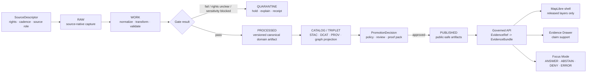

<!-- [KFM_META_BLOCK_V2]
doc_id: kfm://doc/TODO-register-doc-uuid
title: Settlements, Cities, and Infrastructure
type: standard
version: v1
status: draft
owners: TODO(repo CODEOWNERS or domain steward)
created: 2026-04-22
updated: 2026-04-22
policy_label: public
related: [TODO:docs/registers/domain-file-index.md, TODO:docs/domains/settlements/README.md, TODO:docs/domains/infrastructure/README.md, TODO:schemas/contracts/v1/settlements/, TODO:schemas/contracts/v1/infrastructure/]
tags: [kfm, domain, settlements, infrastructure, map-first, evidence, governance]
notes: [doc_id and owners require repo registry verification; target path requested as docs/domains/settlements-infrastructure/README.md; source blueprint also proposes split settlements and infrastructure documentation homes]
[/KFM_META_BLOCK_V2] -->

<a id="top"></a>

# Settlements, Cities, and Infrastructure

Landing page for the KFM domain lane that keeps Kansas places, civic status, infrastructure assets, networks, observations, public-safe layers, and evidence-backed claims governable over time.

<p align="left">
  
  
  
  
  
</p>

> [!IMPORTANT]
> **Status:** experimental  
> **Owners:** TODO — verify against repo CODEOWNERS, stewardship register, or domain ownership docs.  
> **Path:** `docs/domains/settlements-infrastructure/README.md`  
> **Posture:** **CONFIRMED** requested landing page path; **PROPOSED** lane structure; **UNKNOWN** current implementation depth until the mounted repo, tests, workflows, schemas, policy bundles, and runtime evidence are inspected.

**Quick jumps:** [Scope](#scope) · [Repo fit](#repo-fit) · [Inputs](#accepted-inputs) · [Exclusions](#exclusions) · [Directory tree](#directory-tree) · [Lifecycle](#governed-lifecycle) · [Contracts](#contracts-and-object-families) · [Map/UI](#map-ui-and-focus-mode) · [Done](#definition-of-done) · [Verification](#verification-backlog)

---

## Scope

This directory documents the **settlements + infrastructure** lane as a governed KFM domain area.

It is not just a map layer catalog. It is the reviewable control surface for claims such as:

- a place existed under a particular name at a particular time;
- a municipality had a legal status, boundary, county-seat role, or civic function;
- a historic townsite, fort, depot, mission, ghost town, or reservation community is represented with appropriate evidence and uncertainty;
- an infrastructure asset, network, node, segment, service area, operator relationship, dependency, condition observation, or public-safe representation is admissible for a given use;
- a public map, Evidence Drawer entry, Focus Mode response, catalog record, or exported artifact resolves back to evidence, rights, review, release, and correction state.

### Working lane boundary

| Area | Belongs here | Truth label |
|---|---|---|
| Settlements | Legal municipalities, census places, named populated places, historic townsites, ghost towns, forts, depots, missions, reservation communities, names, boundary versions, civic/status events, population observations | **PROPOSED** |
| Infrastructure | Assets, networks, nodes, segments, facilities, service areas, operators, dependencies, restrictions, condition observations, public-safe representations | **PROPOSED** |
| Governance bridge | Source descriptors, EvidenceBundle links, review state, proof packs, release manifests, correction notices, rollback references | **CONFIRMED doctrine / PROPOSED file realization** |
| Public delivery | Released layers, generalized geometries, governed API contracts, MapLibre layer descriptors, Evidence Drawer payloads, finite Focus outcomes | **CONFIRMED doctrine / PROPOSED lane realization** |

> [!NOTE]
> The current source blueprint proposes separate `docs/domains/settlements/` and `docs/domains/infrastructure/` documentation homes. This README is a combined landing page because the requested target path is `docs/domains/settlements-infrastructure/README.md`. If the mounted repo already uses split homes, keep this file as an index/orchestration page and route detailed docs to the verified split directories.

[Back to top](#top)

---

## Repo fit

| Fit question | Answer |
|---|---|
| Target path | `docs/domains/settlements-infrastructure/README.md` |
| Role | README-like domain landing page and review entry point |
| Upstream doctrine | KFM pipeline doctrine, documentation control plane, settlements/infrastructure blueprint, MapLibre UI doctrine, governed AI doctrine |
| Upstream machine surfaces | `schemas/contracts/v1/settlements/` and `schemas/contracts/v1/infrastructure/` are **PROPOSED** until repo conventions are verified |
| Downstream docs | `data-model.md`, `source-registry.md`, `schema-registry.md`, `pipeline.md`, `api.md`, `map-layers.md`, `governance.md`, `verification-backlog.md`, `correction-log.md` are **PROPOSED** companion docs |
| Downstream runtime | Governed API, released layer descriptors, Evidence Drawer payloads, Focus Mode envelopes, catalog/proof/release objects |
| Must not become | A raw data directory, schema authority by itself, operational status dashboard, critical-infrastructure exposure surface, or uncited historical narrative |

### Relation to adjacent lanes

| Adjacent lane | Boundary rule |
|---|---|
| Roads / rail / trade routes | Transport corridors and route history may link to infrastructure assets, but routing graph projections do not replace canonical settlement or infrastructure records. |
| Hydrology / hazards | Flood zones, water systems, and hazard exposure are contextual relations, not settlement truth or infrastructure truth by themselves. |
| Archaeology / cultural heritage | Sensitive or culturally governed places must keep steward review, location generalization, and source rights visible. |
| People / land ownership | Ownership, genealogy, and parcel assertions are separate evidence-bound lanes; they may link to places and assets but do not collapse into them. |
| UI / governed AI | UI and Focus consume released EvidenceBundles through governed APIs; they do not read RAW, WORK, QUARANTINE, or canonical stores directly. |

---

## Accepted inputs

The following content belongs in or near this documentation lane once the repo homes are verified.

| Input | Why it belongs | Expected handling |
|---|---|---|
| Domain definitions | Maintainers need stable language before schemas, API routes, and layer names diverge | Keep terms in a field dictionary or data-model doc |
| SourceDescriptor summaries | Source role, rights, cadence, geography, and publication intent govern every downstream artifact | Register before ingestion |
| Legal/status event descriptions | Incorporation, annexation, dissolution, county-seat changes, and status assertions require evidence and time scope | Model as temporal events, not flat attributes |
| Boundary-version notes | Settlement boundaries change over time and may have multiple sources/precisions | Preserve CRS, valid time, source role, and transform notes |
| Infrastructure asset/network definitions | Assets, networks, operators, dependencies, restrictions, and observations have different identity grains | Keep concepts separate; link through governed relations |
| Public-safe layer descriptors | Map layers must be released artifacts, not direct source or RAW links | Tie to LayerManifest, EvidenceBundle, policy, and review state |
| No-network fixtures | Fixtures let validators prove behavior without live source drift | Store in test/fixture homes after repo inspection |
| Validator and policy expectations | Rights, sensitivity, exact-geometry, source-role, and catalog-closure gates must be inspectable | Keep validation commands and failure modes visible |
| Correction and rollback notes | Post-release fixes must preserve public lineage | Link correction notices, supersession, and rollback refs |

---

## Exclusions

These do **not** belong in this README or companion documentation unless explicitly marked as examples, summaries, or redacted review artifacts.

| Excluded material | Where it should go instead | Reason |
|---|---|---|
| RAW source captures | `data/raw/...` or repo-native RAW home | RAW is not public documentation or public API input |
| WORK / QUARANTINE candidates | `data/work/...` or `data/quarantine/...` | Unvalidated or blocked material must not leak into public docs |
| Credentials, API keys, tokens, private URLs | Secret manager / deployment config | Never document secrets in repo Markdown |
| Exact restricted infrastructure geometry | Restricted data store or generalized public derivative | Critical infrastructure and restricted utility details require policy review |
| Bridge condition / inspection details | Restricted review artifact unless release-approved | Condition/inspection exposure can be sensitive or misleading without source/date controls |
| Live operational status claims | Governed operational lane, if one exists | This lane is not a real-time safety or operational decision system |
| Uncited historical extraction | Evidence intake / review queue | Historic maps, newspapers, and archives require rights and citation validation |
| Free-form AI summaries | Runtime receipts / governed Focus output after citation validation | Generated language is not root truth |
| UI-side policy decisions | Backend policy engine / governed API | UI can display trust state, not invent it |

[Back to top](#top)

---

## Directory tree

**NEEDS VERIFICATION:** The actual repo tree was not available in the inspected workspace. The tree below is the intended documentation shape for this requested combined path. Do not create duplicate authority if the real repo already has separate `docs/domains/settlements/` and `docs/domains/infrastructure/` homes.

```text
docs/domains/settlements-infrastructure/
├── README.md                    # this landing page
├── data-model.md                # PROPOSED: bounded contexts and field dictionary
├── source-registry.md           # PROPOSED: source roles, rights posture, cadence
├── schema-registry.md           # PROPOSED: schema/object index and compatibility notes
├── pipeline.md                  # PROPOSED: RAW -> PUBLISHED flow and receipts
├── api.md                       # PROPOSED: governed API contracts and finite outcomes
├── map-layers.md                # PROPOSED: released layer descriptors and Evidence Drawer mapping
├── governance.md                # PROPOSED: rights, sensitivity, policy, review, release gates
├── verification-backlog.md      # PROPOSED: open checks before activation
├── correction-log.md            # PROPOSED: post-release correction and supersession notes
├── continuity.md                # PROPOSED: migration from prior scaffold/lineage docs
└── file-map.md                  # PROPOSED: links into docs/registers/domain-file-index.md
```

Companion homes, also **NEEDS VERIFICATION**:

| Companion area | Proposed home | Purpose |
|---|---|---|
| Settlement schemas | `schemas/contracts/v1/settlements/` | Machine contracts for settlements, names, boundary versions, and legal/status events |
| Infrastructure schemas | `schemas/contracts/v1/infrastructure/` | Machine contracts for assets, networks, nodes, segments, facilities, observations, dependencies |
| Source descriptors | `data/registry/settlements/`, `data/registry/infrastructure/` | Source-role, rights, cadence, and admissibility registry entries |
| Validators | `tools/validators/settlements/`, `tools/validators/infrastructure/` | Schema, source, policy, geometry, and publication checks |
| Pipelines | `src/pipelines/settlements/`, `src/pipelines/infrastructure/` | Fixture-first lifecycle processing, receipts, and promotion candidates |
| Public UI | `apps/web/src/map/...` | MapLibre layer aliases, released styles, Evidence Drawer and Focus components |
| Global registers | `docs/registers/` | Domain file index, schema index, source descriptor index, layer index, OpenAPI index |

---

## Governed lifecycle

Every public-facing settlement or infrastructure claim follows the KFM lifecycle. Promotion is a governed state transition, not a file move.



### Lifecycle rules

| Rule | Consequence |
|---|---|
| RAW, WORK, and QUARANTINE are not public client surfaces | MapLibre, Focus, and normal UI routes must not call them |
| Derived tiles, PMTiles, search views, graph projections, summaries, and scenes are rebuildable | They do not replace canonical or evidence-bearing records |
| Every consequential public claim resolves `EvidenceRef -> EvidenceBundle` | Missing support means **ABSTAIN**, not plausible prose |
| Rights, sensitivity, review, catalog closure, proof, and release state gate publication | Unclear rights or sensitive exact geometry fail closed |
| Correction lineage remains visible after publication | Supersession, rollback, withdrawal, and narrowed republication must leave records |

[Back to top](#top)

---

## Contracts and object families

**PROPOSED until schema home is verified.** If `contracts/` is canonical in the real repo, use the repo convention and record the decision in an ADR. If `schemas/contracts/v1/` is canonical, do not mirror divergent schemas elsewhere.

### Settlement objects

| Object family | Identity grain | Evidence posture | Public eligibility |
|---|---|---|---|
| `Settlement` | Human place concept, not necessarily a legal entity | Existence, names, and status assertions require evidence refs | Public if rights and sensitivity clear |
| `SettlementName` | Name string + language/source/time | Source record ref and valid/observed time | Public if source rights allow |
| `SettlementBoundaryVersion` | One geometry for a settlement at a valid time | Boundary source, CRS, transform, precision, evidence refs | Public if unrestricted; generalized when required |
| `SettlementStatusEvent` | Event changing status/category | Cited legal or documentary evidence | Public if cited and policy-safe |
| `IncorporationEvent` / `AnnexationEvent` / `DissolutionEvent` / `CountySeatEvent` | One legal action/date | Legal or documentary source; not inferred from map label alone | Public after rights/review |
| `PopulationObservation` | One source/year/geography value | Source scope must be visible | Public if scope and source are clear |
| `CivicFunction` | Function role over time | Function type, time validity, evidence refs | Public if cited |

### Infrastructure objects

| Object family | Identity grain | Evidence posture | Public eligibility |
|---|---|---|---|
| `InfrastructureAsset` | Asset concept such as bridge, depot, utility facility, school, public building, water tower, substation, or civic facility | Source refs, operator/owner when allowed, sensitivity class | Public-safe representation only |
| `InfrastructureNetwork` | Road, rail, water, utility, communication, or service network grouping | Source, operator/domain, time validity, sensitivity | Public if non-sensitive or generalized |
| `InfrastructureNode` / `InfrastructureSegment` | Network component or connector | Geometry/source precision and source role required | Generalized where policy requires |
| `InfrastructureObservation` | Condition, status, inspection, capacity, service, restriction, or dependency observation | Observation source/date, validity, review status | Restricted by default when sensitive/current |
| `ServiceArea` | Area served by infrastructure or civic function | Source, method, time scope | Public only after generalization and review |
| `PublicSafeRepresentation` | Deliberately released derivative | Transform receipt, release manifest, layer descriptor | Public if promotion-approved |

### Shared governance objects

| Shared object | Role |
|---|---|
| `SourceDescriptor` | Source identity, access mode, source role, rights, cadence, and publication intent |
| `EvidenceBundle` | Reviewable support for visible claims and UI state |
| `DecisionEnvelope` | Policy/review result such as allow, deny, restrict, defer, or abstain |
| `RunReceipt` | Process memory for intake, validation, transform, publication, and rollback |
| `ReleaseManifest` | Released artifact inventory with integrity and scope |
| `CatalogMatrix` | STAC/DCAT/PROV closure across published datasets and distributions |
| `CorrectionNotice` | Supersession, rollback, withdrawal, or narrowed republication lineage |
| `LayerManifest` | Released layer contract consumed by the map shell |

---

## Source registry posture

Source activation is a gate, not a fetch script. A source cannot support public claims until source role, rights, terms, cadence, access method, and sensitivity obligations are registered and verified.

| Source family | Possible role | Gate posture |
|---|---|---|
| Kansas Geoportal / local government GIS | Official or authoritative/corroborative depending on dataset | **NEEDS VERIFICATION** for terms, layer metadata, freshness, and redistribution |
| KDOT / KanPlan / structures / rail resources | Transport and infrastructure source family | **NEEDS VERIFICATION**; bridge/condition/inspection and current restrictions default restricted |
| Census / TIGER / ACS | Administrative/census geography and demographic observations | Use scope/year/source explicitly; not local legal truth by itself |
| USGS GNIS / geographic names | Names and feature references | Name evidence only unless paired with stronger source role |
| FEMA NFHL | Hazard context | Context only; not settlement or infrastructure truth |
| OpenStreetMap | Community/corroborative | ODbL and attribution review mandatory; not legal/operational authority |
| Historic maps, newspapers, local archives | Documentary evidence | Rights and citation validation required; georeferencing precision must be visible |

> [!WARNING]
> Candidate sources may be useful, but source existence is not permission to publish. Unknown rights, ambiguous source role, sensitive geometry, or unverified cadence must block public promotion.

[Back to top](#top)

---

## Map, UI, and Focus Mode

KFM’s UI is part of the evidence chain. MapLibre renders released layers inside the governed shell; it does not become the truth system.

### Map layer rules

| Layer type | Allowed source | Required visible trust cues |
|---|---|---|
| Settlement points | Published public-safe artifact | Source role, time basis, review state, evidence link |
| Settlement boundary versions | Released boundary derivative | Valid time, CRS/transform note, precision/generalization |
| Historic townsites / ghost towns | Released generalized representation | Evidence type, uncertainty, rights, correction link |
| Infrastructure assets | Released public-safe representation | Sensitivity class, generalization, source role |
| Infrastructure networks | Released generalized or policy-cleared layer | Network type, operator visibility, time basis |
| Service areas / dependencies | Released derived layer | Method, source, limitations, review state |

### Evidence Drawer minimum fields

| Field | Why it matters |
|---|---|
| Claim or layer title | Makes the visible statement explicit |
| What this object is | Prevents map-symbol overclaiming |
| What this object is not | Prevents false authority, especially for historic or derived layers |
| Source role badge | Separates official, documentary, modeled, community, and corroborative evidence |
| Spatial basis | Shows geometry source, precision, CRS/transform, and generalization |
| Time basis | Shows valid time, observed time, published time, or effective date |
| EvidenceBundle links | Lets users inspect support |
| Rights and attribution | Blocks unsupported redistribution |
| Sensitivity / generalization | Explains withheld or fuzzed geometry |
| Review state | Shows draft, reviewed, released, corrected, withdrawn, or superseded state |
| Correction lineage | Keeps public trust after changes |

### Focus Mode boundary

Focus Mode may summarize released evidence, but it must stay bounded by scope, policy, freshness, review, and citations.

| Outcome | Meaning |
|---|---|
| `ANSWER` | Evidence supports a bounded response with citations |
| `ABSTAIN` | Evidence is missing, conflicted, too weak, or out of scope |
| `DENY` | Policy, rights, sensitivity, or access state blocks the response |
| `ERROR` | Runtime or validation failure; do not infer an answer |

Focus must not read RAW, WORK, QUARANTINE, unpublished candidate data, private utility details, or direct model output.

---

## Quickstart for maintainers

Use this README as the safe entry point before adding connectors, public layers, or generated explanations.

1. **Verify the repo path.** Confirm whether the actual repository uses this combined directory or split `settlements/` and `infrastructure/` directories.
2. **Register this doc.** Add the final `doc_id`, owner, successor/supersedes metadata, and register row.
3. **Decide schema home.** Use an ADR if `contracts/` and `schemas/` both appear authoritative.
4. **Start with fixtures.** Add no-network valid and invalid fixtures before any live source connector.
5. **Add source descriptors.** Register source roles, rights, cadence, access method, and publication intent.
6. **Run validators.** Validate schema shape, source role, rights, sensitivity, geometry precision, catalog closure, and EvidenceBundle resolution.
7. **Only then publish public-safe layers.** Released layers must have manifests, proof packs, correction path, and UI trust payloads.

### Proposed non-destructive checks

These commands are **NEEDS VERIFICATION** until repo tooling is inspected.

```bash
# Documentation successor / orphan checks
python tools/ci/check_docs_successors.py docs/domains/settlements-infrastructure/README.md
python tools/ci/check_domain_file_index.py docs/registers/domain-file-index.md

# Schema and fixture tests
pytest tests/settlements tests/infrastructure

# Source descriptor validation
python tools/validators/settlements/validate_source_record.py data/registry/settlements/sources.yaml
python tools/validators/infrastructure/validate_source_record.py data/registry/infrastructure/sources.yaml

# Public-surface safety checks
python tools/validators/public_surface/no_raw_work_quarantine_routes.py
python tools/validators/public_surface/evidence_bundle_closure.py
```

---

## Definition of done

A first credible PR for this lane is **not** a live connector or a polished map. It is a proof-bearing control-plane increment.

- [ ] README path and split-vs-combined doc home verified against the mounted repo.
- [ ] `KFM_META_BLOCK_V2` completed with registered `doc_id`, owner, and valid related links.
- [ ] Domain file registered in `docs/registers/domain-file-index.md` or repo-native equivalent.
- [ ] Schema-home ADR accepted if both `contracts/` and `schemas/` exist.
- [ ] Source descriptor skeletons added with rights/sensitivity defaults set to fail closed.
- [ ] Valid and invalid fixtures created for at least one settlement and one infrastructure object.
- [ ] Validators reject missing evidence refs, unknown source role, unclear rights, unreviewed exact restricted geometry, and missing release state.
- [ ] EvidenceBundle closure fixture demonstrates one public-safe settlement claim and one public-safe infrastructure claim.
- [ ] Map layer descriptors point only to released artifacts.
- [ ] Evidence Drawer payload fixture includes source role, time basis, spatial basis, review state, sensitivity, and correction link.
- [ ] Focus Mode fixture returns finite `ANSWER`, `ABSTAIN`, `DENY`, and `ERROR` examples.
- [ ] Rollback path documented for unpromoted runs and published artifacts.
- [ ] No public route, style, component, or story node reads RAW, WORK, QUARANTINE, or unpublished candidates.

[Back to top](#top)

---

## Verification backlog

| Item | Status | Why it blocks confidence |
|---|---|---|
| Mounted repo tree | **UNKNOWN** | Required to confirm path, neighboring docs, README conventions, package manager, and file homes |
| CODEOWNERS / owners | **UNKNOWN** | Required before assigning durable stewardship |
| Split vs combined domain docs | **NEEDS VERIFICATION** | Source blueprint proposes split homes; this task requests a combined README |
| Schema authority | **CONFLICT / NEEDS VERIFICATION** | Prior lineage points to both `contracts/` and `schemas/contracts/v1/` patterns |
| KDOT / Kansas Geoportal terms | **NEEDS VERIFICATION** | Rights, cadence, metadata disclaimers, and redistribution obligations can change |
| Critical infrastructure geometry policy | **NEEDS VERIFICATION** | Exact public geometry may be sensitive or restricted |
| Bridge condition / inspection exposure | **NEEDS VERIFICATION** | Public condition claims require source/date/review and may be restricted |
| Historic archive rights | **NEEDS VERIFICATION** | Maps, newspapers, and local archives vary by collection |
| MapLibre implementation path | **UNKNOWN** | UI path, layer registry, component names, and tests are unverified |
| Governed API routes | **UNKNOWN** | Route names and envelope implementation cannot be claimed without source code |
| CI tooling | **UNKNOWN** | OPA/Conftest/Cosign/jsonschema/pytest availability must be verified before hard requirements |
| Runtime proof objects | **UNKNOWN** | Receipts, proof packs, catalogs, signatures, and release manifests were not inspectable |

---

## FAQ

### Is this lane one bounded context or two?

**PROPOSED:** Treat it as two related bounded contexts — settlements and infrastructure — sharing governance objects. Settlements handle place identity, names, civic/legal history, boundaries, and observations. Infrastructure handles assets, networks, nodes, segments, service areas, operators, dependencies, restrictions, and observations.

### Can public maps show exact infrastructure locations?

Not by default. Public maps may show released, public-safe representations. Exact critical infrastructure geometry, private utility details, current restrictions, and sensitive inspection/condition details require policy review, source rights, and release approval.

### Can a Census place or GNIS feature prove a legal municipality?

No. It can support a name, geography, or administrative/census observation depending on source role, but legal status claims need legal or otherwise admissible documentary evidence.

### Can Focus Mode answer settlement or infrastructure questions?

Only through governed API responses backed by released EvidenceBundles. Missing evidence means `ABSTAIN`. Policy blocks mean `DENY`. Runtime failure means `ERROR`.

### Are PMTiles, graph triples, search indexes, and summaries authoritative?

No. They are rebuildable derivatives. Public claims must trace back to EvidenceBundles and release-bearing records.

---

## Appendix: compact glossary

<details>
<summary>Open glossary</summary>

| Term | Meaning in this lane |
|---|---|
| `EvidenceRef` | Reference from a claim, UI state, or runtime response to evidence support |
| `EvidenceBundle` | Inspectable bundle that resolves evidence refs into source, role, scope, time, review, rights, and correction context |
| `SourceDescriptor` | Source registration object that declares source identity, role, rights, cadence, access mode, and publication posture |
| `PublicSafeRepresentation` | Released derivative intentionally generalized, redacted, or narrowed for public use |
| `SettlementBoundaryVersion` | Boundary geometry for a settlement during a defined valid-time interval |
| `InfrastructureObservation` | Observation about condition, status, restriction, service, capacity, or dependency at a time and source scope |
| `LayerManifest` | Released layer contract for map delivery; should never point to RAW or candidate data |
| `DecisionEnvelope` | Finite policy/review decision wrapper used by API, UI, and governed AI surfaces |
| `CorrectionNotice` | Public lineage object for rollback, supersession, withdrawal, or narrowed republication |
| `CatalogMatrix` | Catalog closure linking published artifacts to STAC/DCAT/PROV-style metadata and lineage |
| `Focus Mode` | Evidence-bounded synthesis surface; not a free-form chatbot or root truth source |

</details>

[Back to top](#top)
