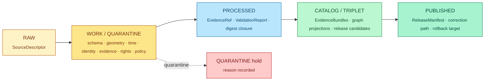
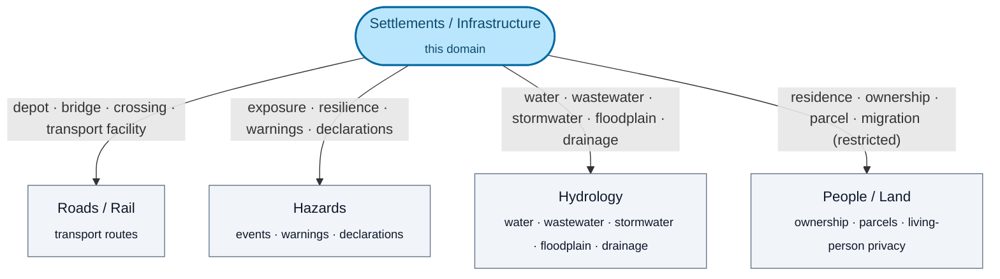

<!-- [KFM_META_BLOCK_V2]
doc_id: kfm://doc/domains/settlements-infrastructure/readme
title: Settlements and Infrastructure — Domain README
type: domain_readme
version: v1
status: draft
owners: TODO — Domain steward (Settlements/Infrastructure); Docs steward
created: 2026-05-19
updated: 2026-05-19
policy_label: public
related:
  - ../README.md
  - ../../doctrine/directory-rules.md
  - ../../adr/README.md
  - kfm://atlas/domains-v1_1#chapter-14
  - contracts/domains/settlements-infrastructure/   # PROPOSED
  - schemas/contracts/v1/domains/settlements-infrastructure/   # PROPOSED
  - policy/domains/settlements-infrastructure/   # PROPOSED
tags: [kfm, domain, settlements, infrastructure, doctrine]
notes:
  - Folder README; structure follows Directory Rules §15.
  - No mounted repo in authoring session — implementation maturity NEEDS VERIFICATION throughout.
[/KFM_META_BLOCK_V2] -->

# settlements-infrastructure

> Domain README for **Settlements and Infrastructure** — settlements, municipalities, census places, historic townsites, ghost towns, forts, missions, reservation communities, infrastructure assets, networks, facilities, service areas, operators, condition observations, and dependencies.


**Status:** draft &nbsp;·&nbsp; **Authority class:** canonical (doctrine) / PROPOSED (implementation) &nbsp;·&nbsp; **Owners:** _TODO — Domain steward; Docs steward_ &nbsp;·&nbsp; **Last reviewed:** 2026-05-19

---

## Contents

- [Purpose](#purpose)
- [Authority level](#authority-level)
- [Status](#status)
- [What belongs here](#what-belongs-here)
- [What does NOT belong here](#what-does-not-belong-here)
- [Inputs](#inputs)
- [Outputs](#outputs)
- [Validation](#validation)
- [Review burden](#review-burden)
- [Related folders](#related-folders)
- [ADRs](#adrs)
- [Last reviewed](#last-reviewed)
- [Appendix A — Pipeline shape](#appendix-a--pipeline-shape-raw--published)
- [Appendix B — Cross-lane relations](#appendix-b--cross-lane-relations)
- [Appendix C — Map and viewing products](#appendix-c--map-and-viewing-products)
- [Appendix D — Governed AI behavior](#appendix-d--governed-ai-behavior)
- [Appendix E — Verification backlog](#appendix-e--verification-backlog)

---

## Purpose

This folder is the **human-facing doctrine home** for the Settlements/Infrastructure domain. **CONFIRMED doctrine:** It governs settlements, municipalities, census places, historic townsites, ghost towns, forts, missions, reservation communities, infrastructure assets, networks, facilities, service areas, operators, condition observations, dependencies, and public-safe representations of the same. [Atlas v1.1 §14.A]

**CONFIRMED doctrine:** This is `docs/` — it **explains**. Object meaning lives in `contracts/`; machine shape lives in `schemas/`; admissibility decisions live in `policy/`; lifecycle data lives in `data/`. This README does not replicate any of them; it points to them. [Directory Rules §6.1, §6.3, §6.4]

[↑ back to top](#contents)

---

## Authority level

| Axis | Class |
|---|---|
| Doctrine (this folder explains it) | **canonical** [Directory Rules §6.1] |
| Implementation in mounted repo | **PROPOSED / NEEDS VERIFICATION** (no repo inspected in authoring session) |
| Parallel-authority risk | **none** — this folder does not host schemas, contracts, policy, or release decisions |

> [!IMPORTANT]
> Per Directory Rules §3 and §12, **the domain is a *segment*, never a root.** `docs/domains/settlements-infrastructure/` is a domain segment under `docs/`; sibling segments exist under `contracts/`, `schemas/`, `policy/`, `tests/`, `fixtures/`, `packages/`, `pipelines/`, `pipeline_specs/`, `data/`, and `release/`. Files explaining objects, meanings, decisions, or data **do not belong here** — they belong under the corresponding responsibility root.

[↑ back to top](#contents)

---

## Status

| Item | Value | Truth label |
|---|---|---|
| Domain identity defined | yes (Atlas §14.A) | **CONFIRMED** |
| Object families enumerated | yes (16 owned objects) | **CONFIRMED** doctrine / **PROPOSED** field realization |
| Source families enumerated | yes (8 families) | **CONFIRMED** doctrine; rights and freshness **NEEDS VERIFICATION** per family |
| Cross-lane relations declared | yes (Roads/Rail, Hazards, Hydrology, People/Land) | **CONFIRMED** doctrine / **PROPOSED** relation realization |
| Pipeline shape | RAW → WORK / QUARANTINE → PROCESSED → CATALOG / TRIPLET → PUBLISHED | **CONFIRMED** doctrine / **PROPOSED** per-stage implementation |
| Sibling folders present in repo | `contracts/`, `schemas/`, `policy/`, `tests/`, `fixtures/`, `pipelines/`, `data/…` for this domain | **NEEDS VERIFICATION** — no mounted repo in this session |
| Governed-API surface | `Settlements/Infrastructure` feature/detail resolver; route TBD | **PROPOSED**; exact route **UNKNOWN** |
| Sensitivity default | restricted / review for critical infrastructure, utilities, condition, dependencies, operator-sensitive details, exact facility geometry | **CONFIRMED** doctrine / **PROPOSED** implementation |
| Release maturity | no released layers known in this session | **UNKNOWN** |

[↑ back to top](#contents)

---

## What belongs here

Files in `docs/domains/settlements-infrastructure/` **explain** the domain to humans: scope statements, ubiquitous-language glossaries, object-family overviews, source-family overviews, cross-lane relation notes, sensitivity posture, viewing-product catalogs, governed-AI behavior notes, verification backlogs, and domain ADRs that are scoped narrowly to this domain.

### Object families owned by this domain

**CONFIRMED doctrine / PROPOSED field realization** [Atlas v1.1 §14.B–E]:

| # | Object | Identity rule (PROPOSED) | Temporal handling (CONFIRMED) |
|---|---|---|---|
| 1 | `Settlement` | source id + object role + temporal scope + normalized digest | source / observed / valid / retrieval / release / correction times stay distinct where material |
| 2 | `Municipality` | same shape | same |
| 3 | `CensusPlace` | same shape | same |
| 4 | `Townsite` | same shape | same |
| 5 | `GhostTown` | same shape | same |
| 6 | `Fort` | same shape | same |
| 7 | `Mission` | same shape | same |
| 8 | `ReservationCommunity` | same shape | same |
| 9 | `Infrastructure Asset` | same shape | same |
| 10 | `Network Node` | same shape | same |
| 11 | `Network Segment` | same shape | same |
| 12 | `Facility` | same shape | same |
| 13 | `Service Area` | same shape | same |
| 14 | `Operator` | same shape | same |
| 15 | `Condition Observation` | same shape | same |
| 16 | `Dependency` | same shape | same |

### Accepted file types in this folder

- `README.md` (this file)
- Domain overview / orientation notes (`.md`)
- Per-object family explainers (`.md`) — explain meaning at the prose level; do not duplicate `contracts/` semantic definitions
- Cross-lane relation notes (`.md`)
- Domain-scoped ADRs **only when** they would clutter `docs/adr/` and are clearly local to this domain (otherwise: `docs/adr/`)
- Verification-backlog excerpts and open-question registers scoped to this domain

[↑ back to top](#contents)

---

## What does NOT belong here

> [!WARNING]
> Files describing **object meaning**, **machine shape**, **admissibility decisions**, **lifecycle data**, or **release decisions** do not live in this folder. Putting them here creates parallel authority and is a Directory Rules §13.4 anti-pattern.

| If it is… | …it belongs under (not here) |
|---|---|
| Object-family contract prose (`SourceDescriptor`, `EvidenceRef`, `EvidenceBundle`, `ReleaseManifest`, domain object meaning) | `contracts/domains/settlements-infrastructure/` **(PROPOSED)** |
| JSON Schema / JSON-LD shape | `schemas/contracts/v1/domains/settlements-infrastructure/` **(PROPOSED, per ADR-0001)** |
| Admissibility / sensitivity / release policy | `policy/domains/settlements-infrastructure/` **(PROPOSED)** |
| Source-descriptor registry entries | `data/registry/sources/` or `data/registry/settlements-infrastructure/` **(PROPOSED)** |
| Tests, validators, fixtures | `tests/domains/settlements-infrastructure/`, `fixtures/domains/settlements-infrastructure/` **(PROPOSED)** |
| Pipeline logic | `pipelines/domains/settlements-infrastructure/` **(PROPOSED)** |
| Pipeline specifications | `pipeline_specs/settlements-infrastructure/` **(PROPOSED)** |
| Lifecycle data (RAW / WORK / QUARANTINE / PROCESSED / CATALOG / TRIPLET / PUBLISHED) | `data/<phase>/settlements-infrastructure/` **(PROPOSED)** |
| Catalog records | `data/catalog/domain/settlements-infrastructure/` **(PROPOSED)** |
| Published layers (public-safe) | `data/published/layers/settlements-infrastructure/` **(PROPOSED)** |
| Release decisions, manifests, rollback cards | `release/candidates/settlements-infrastructure/`, `release/` **(PROPOSED)** |
| Roads, rail, depots considered as transport routes | `docs/domains/roads-rail-trade/` (Roads/Rail owns transport routes) — **NOT here** [Atlas §14.B] |
| Hydrologic evidence (streams, gages, aquifers) | `docs/domains/hydrology/` (Hydrology owns water evidence) — **NOT here** [Atlas §14.B] |
| Hazard events, warnings, declarations | `docs/domains/hazards/` (Hazards owns events and warnings) — **NOT here** [Atlas §14.B] |
| Ownership, parcels, living-person privacy | `docs/domains/people-dna-land/` (People/Land owns these) — **NOT here** [Atlas §14.B] |

[↑ back to top](#contents)

---

## Inputs

Source families that feed Settlements/Infrastructure. **CONFIRMED doctrine / NEEDS VERIFICATION** rights and current cadence per source. [Atlas v1.1 §14.D]

| # | Source family | Role (variable) | Rights / sensitivity | Freshness |
|---|---|---|---|---|
| 1 | Census TIGER / census place geography | authority / observation / context / model — as source role requires | rights and current terms **NEEDS VERIFICATION**; sensitive joins **fail closed** | source-vintage or cadence specific |
| 2 | GNIS and gazetteers | same | same | same |
| 3 | State / local GIS — Kansas Geoportal-style sources | same | same | same |
| 4 | Municipal and local legal records | same | same | same |
| 5 | Historical gazetteers and maps | same | same | same |
| 6 | Infrastructure operators and providers | same | same | same |
| 7 | KDOT / bridge / facility sources | same | same | same |
| 8 | FEMA / hazards / resilience sources | same | same | same |

> [!NOTE]
> **CONFIRMED doctrine:** Every input must arrive with a `SourceDescriptor` — source role, authority scope, rights state, sensitivity state, citation policy, retrieval method, source head, admissibility limits, public-release posture, and review state. Source admission is **kept separate from source use**: an admitted source is not automatically a usable evidence carrier for a given claim type. [`ai-build-operating-contract.md` §20]

[↑ back to top](#contents)

---

## Outputs

Settlements/Infrastructure emits — through the governed lifecycle, never directly — validated normalized objects, EvidenceBundles, graph/triplet projections, public-safe release candidates, release manifests, correction notices, and rollback targets. **CONFIRMED doctrine / PROPOSED implementation** [Atlas v1.1 §14.H, §14.M].

### Lifecycle pipeline (high-level)



> [!NOTE]
> **CONFIRMED doctrine:** Promotion is a **governed state transition**, not a file move. [Directory Rules §6.1; Atlas §14.H]

### Governed-API surfaces (PROPOSED)

| Endpoint or artifact | DTO / schema | Outcomes | Status |
|---|---|---|---|
| Settlements/Infrastructure feature/detail resolver | `SettlementsInfrastructureDecisionEnvelope` | ANSWER / ABSTAIN / DENY / ERROR | **PROPOSED**; exact route **UNKNOWN** |
| Settlements/Infrastructure layer manifest resolver | `LayerManifest` / domain layer descriptor | ANSWER / DENY / ERROR | **PROPOSED**; public-safe release only |
| Settlements/Infrastructure Evidence Drawer payload | `EvidenceDrawerPayload` + `EvidenceBundle` projection | ANSWER / ABSTAIN / DENY / ERROR | **PROPOSED**; evidence and policy filtered |
| Settlements/Infrastructure Focus Mode answer | Runtime Response Envelope + `AIReceipt` | ANSWER / ABSTAIN / DENY / ERROR | **PROPOSED**; AI is never root truth |

### Sensitivity posture

> [!CAUTION]
> **CONFIRMED doctrine:** Critical infrastructure, utilities, condition observations, dependencies, operator-sensitive details, and exact facility geometry **default to restricted or review**. Unclear rights, unresolved source role, missing evidence, unresolved sensitivity, or absent release state **blocks public promotion**. [Atlas §14.I]

[↑ back to top](#contents)

---

## Validation

Validation lives in `tests/`, `fixtures/`, `policy/`, and `schemas/`, not here. This section enumerates the validation surfaces that, per doctrine, this domain MUST be backed by.

**CONFIRMED doctrine / PROPOSED implementation** [Atlas v1.1 §14.K]:

- Legal-municipality evidence tests — does a municipality claim carry a legal-source role?
- Census-vs-municipality distinction — does the system refuse to silently collapse `CensusPlace` and `Municipality`?
- Infrastructure topology tests — do `Network Node` / `Network Segment` / `Facility` topology constraints hold?
- Condition `observed_at` tests — does `Condition Observation` preserve observed/valid/retrieval distinction?
- Restricted-geometry no-leak tests — does sensitivity-redacted output suppress exact facility geometry?
- Catalog / proof / release closure tests — does promotion close the digest, evidence, manifest, and rollback chain?

> [!IMPORTANT]
> **CONFIRMED doctrine:** Negative-state paths (DENY, ABSTAIN, ERROR, QUARANTINE, restricted-no-leak) MUST be exercised. Positive-only coverage is an anti-pattern. [`ai-build-operating-contract.md`; Directory Rules §13.5 row "Validator orchestration drift"]

[↑ back to top](#contents)

---

## Review burden

| Change class | Who reviews | Why |
|---|---|---|
| Domain README updates (this file) | Domain steward (Settlements/Infrastructure) + Docs steward | Folder-level governance contract per Directory Rules §15 |
| Object-family addition or rename | Domain steward + Contracts steward + ADR | Touches `contracts/`, `schemas/`, lineage |
| Source-family addition | Domain steward + Sources steward + Policy steward | Rights, sensitivity, source role admissibility |
| Sensitivity-posture change (e.g., promoting `Operator` to public-safe) | Domain steward + Policy steward + Release steward | Public-release implications; separation of duties |
| Cross-lane relation change | Domain steward + Counter-domain steward (Roads/Rail, Hazards, Hydrology, People/Land) | Ownership boundary, not unilateral |
| Pipeline-stage gate change | Domain steward + Pipelines steward + ADR | Promotion is a governed state transition |
| Release of a Settlements/Infrastructure layer | Domain steward + Policy steward + Release steward + (where required) Cultural / Indigenous review | Critical-infrastructure default-restricted posture |

_TODO — wire to `CODEOWNERS` when repo is mounted._

[↑ back to top](#contents)

---

## Related folders

Sibling domain segments and cross-cutting roots. **All paths PROPOSED / NEEDS VERIFICATION** until inspected in a mounted repo.

```text
docs/
├── doctrine/                                 # CONFIRMED authority for placement rules
│   └── directory-rules.md                    #   ↳ governs this file
├── adr/                                      # ADRs that may bind this domain
└── domains/
    ├── README.md                             # domain index (sibling)
    ├── settlements-infrastructure/           # THIS FOLDER
    ├── roads-rail-trade/                     # owns transport routes
    ├── hazards/                              # owns hazard events and warnings
    ├── hydrology/                            # owns water evidence
    └── people-dna-land/                      # owns ownership and living-person privacy

contracts/domains/settlements-infrastructure/                   # PROPOSED — object meaning
schemas/contracts/v1/domains/settlements-infrastructure/        # PROPOSED — machine shape (ADR-0001)
policy/domains/settlements-infrastructure/                      # PROPOSED — admissibility
tests/domains/settlements-infrastructure/                       # PROPOSED — proof
fixtures/domains/settlements-infrastructure/                    # PROPOSED — golden samples
packages/domains/settlements-infrastructure/                    # PROPOSED — shared code
pipelines/domains/settlements-infrastructure/                   # PROPOSED — pipeline logic
pipeline_specs/settlements-infrastructure/                      # PROPOSED — declarative specs
data/raw/settlements-infrastructure/                            # PROPOSED — lifecycle
data/work/settlements-infrastructure/                           # PROPOSED
data/quarantine/settlements-infrastructure/                     # PROPOSED
data/processed/settlements-infrastructure/                      # PROPOSED
data/catalog/domain/settlements-infrastructure/                 # PROPOSED
data/triplets/settlements-infrastructure/                       # PROPOSED
data/published/layers/settlements-infrastructure/               # PROPOSED — public-safe only
data/receipts/                                                  # PROPOSED — receipts are emitted alongside, not under, domain
data/proofs/                                                    # PROPOSED — same rule
data/registry/sources/settlements-infrastructure/               # PROPOSED — source descriptors
release/candidates/settlements-infrastructure/                  # PROPOSED — release decisions
```

> [!NOTE]
> **Truth posture:** the tree above reproduces the **canonical pattern** declared by Directory Rules §4 Step 3. Whether each path currently **exists** in the mounted repository is a separate question, marked **PROPOSED / NEEDS VERIFICATION** until a mounted repo is inspected.

[↑ back to top](#contents)

---

## ADRs

| ID | Title | Relevance to this domain | Status |
|---|---|---|---|
| ADR-0001 | Schema home: `schemas/contracts/v1/…` | Binds where this domain's JSON schemas live | **CONFIRMED** referenced by Directory Rules §6.4 |
| ADR-S-04 (suggested) | Source-role vocabulary v1 | Binds how this domain's source-family rows assert roles | **PROPOSED** in Atlas §24.12 backlog |
| ADR-S-05 (suggested) | Sensitivity tier scheme (T0–T4) | Binds critical-infrastructure default-restricted posture | **PROPOSED** in Atlas §24.12 backlog |
| ADR-S-07 (suggested) | 3D admission policy | Touches exact facility geometry exposure | **PROPOSED** in Atlas §24.12 backlog |
| Domain-local ADRs | _(none authored yet)_ | When authored: live in `docs/adr/` unless purely local | **UNKNOWN** |

[↑ back to top](#contents)

---

## Last reviewed

**2026-05-19** — initial draft. Doctrine grounded in `KFM Domains v1.1 + Pass 23/32 Consolidated Atlas`, Chapter 14 (Settlements and Infrastructure), and Directory Rules §6.1, §4 Step 3, §15. No mounted repository, CI, workflow, dashboard, or runtime log was inspected; all implementation-bearing claims are explicitly labeled **PROPOSED**, **UNKNOWN**, or **NEEDS VERIFICATION**.

> Re-review every 6 months per Directory Rules §15; older than 6 months → flag for review.

[↑ back to top](#contents)

---

## Appendix A — Pipeline shape (RAW → PUBLISHED)

**CONFIRMED doctrine / PROPOSED lane application** [Atlas v1.1 §14.H]:

| Stage | Handling | Gate | Status |
|---|---|---|---|
| **RAW** | Capture immutable source payload or reference with source role, rights, sensitivity, citation, time, and hash. | `SourceDescriptor` exists. | **PROPOSED** |
| **WORK / QUARANTINE** | Normalize schema, geometry, time, identity, evidence, rights, and policy; hold failures. | Validation and policy gate pass, or quarantine reason recorded. | **PROPOSED** |
| **PROCESSED** | Emit validated normalized objects, receipts, and public-safe candidates. | `EvidenceRef`, `ValidationReport`, and digest closure exist. | **PROPOSED** |
| **CATALOG / TRIPLET** | Emit catalog records, `EvidenceBundle`s, graph/triplet projections, and release candidates. | Catalog / proof closure passes. | **PROPOSED** |
| **PUBLISHED** | Serve released public-safe artifacts through governed APIs and manifests. | `ReleaseManifest`, correction path, rollback target, and review/policy state exist. | **PROPOSED** |

[↑ back to top](#contents)

---

## Appendix B — Cross-lane relations



**CONFIRMED doctrine / PROPOSED implementation** [Atlas v1.1 §14.F]:

| Related lane | Relation type | Constraint |
|---|---|---|
| Roads / Rail | depot, bridge, crossing, transport facility | Relation **MUST preserve** ownership, source role, sensitivity, and `EvidenceBundle` support. |
| Hazards | exposure, resilience, warnings, declarations | same |
| Hydrology | water, wastewater, stormwater, floodplain, drainage | same |
| People / Land | residence, ownership, parcel, migration context with restrictions | same |

> [!WARNING]
> Cross-lane relations **do not transfer ownership**. A bridge that is also a transport facility remains owned by Roads/Rail as a transport route and by Settlements/Infrastructure as an `Infrastructure Asset`; the relation is the link, not a merge.

[↑ back to top](#contents)

---

## Appendix C — Map and viewing products

**PROPOSED** domain viewing products [Atlas v1.1 §14.G]:

- Current settlement view
- Historic townsite view
- Legal-status-event view
- Census-place comparison
- Public-safe asset view
- Service-area aggregate view
- Dependency-summary view
- Restricted internal review view

**CONFIRMED doctrine** cross-cutting viewing products that this domain participates in [`Master MapLibre Components` report; `Governed AI` doctrine]:

- Evidence Drawer
- Time-aware state
- Trust badges
- Sensitivity-redacted view
- Correction / stale-state view
- Governed Focus Mode

> [!NOTE]
> Public clients and normal UI surfaces read these views through the **governed API** (`apps/governed-api/`), never directly from canonical or internal stores. [Directory Rules §7.1 trust membrane]

[↑ back to top](#contents)

---

## Appendix D — Governed AI behavior

**CONFIRMED doctrine / PROPOSED implementation** [Atlas v1.1 §14.L; Governed AI doctrine]:

- AI **may**: summarize released `Settlements/Infrastructure` `EvidenceBundle`s, compare evidence, explain limitations, draft steward-review notes.
- AI **must ABSTAIN** when evidence is insufficient.
- AI **must DENY** where policy, rights, sensitivity, or release state blocks the request.
- AI is **never** the root truth source. `EvidenceBundle` outranks generated language. Every Focus Mode answer carries an `AIReceipt`.

[↑ back to top](#contents)

---

## Appendix E — Verification backlog

**NEEDS VERIFICATION** — items whose resolution requires mounted repo files, schemas, registry entries, tests, logs, emitted artifacts, review records, or release manifests [Atlas v1.1 §14.N]:

<details>
<summary><strong>Open verification items (click to expand)</strong></summary>

| # | Item | Evidence that would settle it | Status |
|---|---|---|---|
| 1 | Verify source rights and municipal legal-source roles | mounted-repo `data/registry/sources/`, ingest receipts, source-authority register | **NEEDS VERIFICATION** |
| 2 | Verify critical-infrastructure policy | mounted-repo `policy/domains/settlements-infrastructure/`, `policy/sensitivity/`, policy-bundle | **NEEDS VERIFICATION** |
| 3 | Verify public-safe layer registry | mounted-repo `data/published/layers/settlements-infrastructure/`, `release/candidates/…`, release manifests | **NEEDS VERIFICATION** |
| 4 | Verify API and Focus Mode auth/policy behavior | mounted-repo `apps/governed-api/`, route declarations, policy decisions, AIReceipt samples | **NEEDS VERIFICATION** |
| 5 | Confirm domain folder naming (`settlements-infrastructure` vs alternative) | mounted-repo `docs/domains/` listing; resolve against parallel question in Encyclopedia OPEN-ENC-04 if applicable | **NEEDS VERIFICATION** |
| 6 | Confirm sibling-folder existence for every PROPOSED path in *Related folders* | mounted-repo directory listing | **NEEDS VERIFICATION** |
| 7 | Identify any released Settlements/Infrastructure layers | `release/` decisions, `data/published/layers/settlements-infrastructure/` contents | **UNKNOWN** in this session |

</details>

> [!NOTE]
> Resolved items migrate to `docs/registers/VERIFICATION_BACKLOG.md` or to a relevant ADR per Directory Rules §15 / §16 / §17.

[↑ back to top](#contents)

---

### Related docs

- [`docs/domains/README.md`](../README.md) — domain index (sibling)
- [`docs/doctrine/directory-rules.md`](../../doctrine/directory-rules.md) — placement and lifecycle doctrine
- [`docs/adr/README.md`](../../adr/README.md) — ADR index
- [`docs/atlases/`](../../atlases/) — domain atlases / dossiers _(PROPOSED home per ADR-S-02)_
- _Atlas v1.1, Chapter 14 — Settlements and Infrastructure_ (`KFM_Domains_v1_1_plus_Pass23_Pass32_Consolidated_Atlas`)
- _KFM Encyclopedia_ — master domain / object / source / capability spine
- _Master MapLibre Components-Functions-Features_ — Evidence Drawer, Focus Mode, trust badges, sensitivity-redacted view doctrine
- _Domain-Driven Design Reference_ (Evans, 2015) — ubiquitous language, bounded context

---

**Last updated:** 2026-05-19 &nbsp;·&nbsp; **Doctrine baseline:** Atlas v1.1 §14 &nbsp;·&nbsp; **Directory Rules:** v1.1 §6.1, §4 Step 3, §15

[↑ back to top](#contents)
