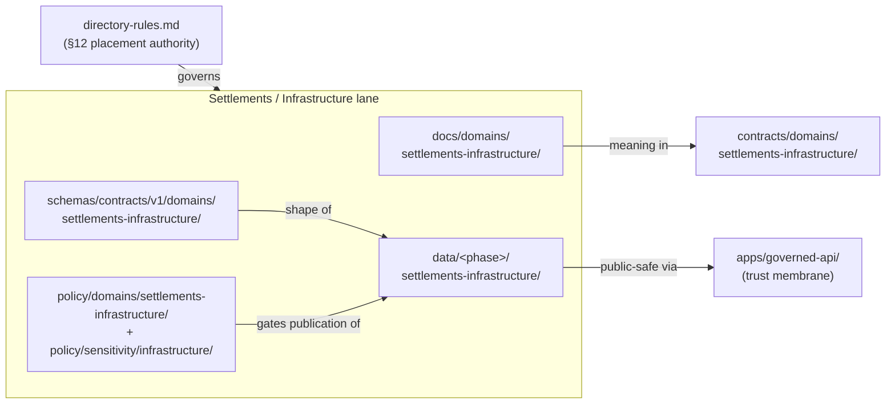

<!-- [KFM_META_BLOCK_V2]
doc_id: kfm://doc/settlements-infrastructure-readme
title: Settlements & Infrastructure — Domain Lane
type: standard
version: v1
status: draft
owners: PLACEHOLDER-settlements-infrastructure-domain-steward, PLACEHOLDER-docs-steward
created: 2026-06-07
updated: 2026-06-07
policy_label: public
related: [ai-build-operating-contract.md, directory-rules.md, docs/domains/settlements-infrastructure/PATHS.md, schemas/contracts/v1/domains/settlements-infrastructure/, policy/sensitivity/infrastructure/, data/published/layers/settlements-infrastructure/]
tags: [kfm, settlements-infrastructure, domain, readme, lane]
notes: [Doctrine-adjacent; CONTRACT_VERSION = "3.0.0" pinned. Lane landing page for Settlements/Infrastructure. Object families, source families, pipeline, sensitivity, and cross-lane relations are CONFIRMED from Atlas ch.14; field realization and all repo paths are PROPOSED until verified against a mounted repo. Critical-asset detail defaults to T4.]
[/KFM_META_BLOCK_V2] -->

<a id="top"></a>

# 🏘️ Settlements & Infrastructure — Domain Lane

> Governs Kansas settlements, municipalities, census places, historic townsites, ghost towns, forts, missions, reservation communities, and infrastructure assets, networks, facilities, service areas, operators, conditions, and dependencies — with public-safe representations.


<!-- TODO: replace with real CI / coverage endpoints once available -->


**Status:** `experimental` · **Owners:** Settlements/Infrastructure domain steward + docs steward _(placeholders — verify)_ · **Updated:** 2026-06-07
**Pinned:** `CONTRACT_VERSION = "3.0.0"` (`ai-build-operating-contract.md`)

> [!IMPORTANT]
> This README is the lane's **landing page**, not its authority. Placement is governed by [`directory-rules.md`](../../../directory-rules.md) §12; object meaning by `contracts/`; object shape by `schemas/`; allow/deny by `policy/`. This page orients; the canonical surfaces govern.

---

## Quick navigation

- [1. Scope](#1-scope)
- [2. Repo fit](#2-repo-fit)
- [3. What belongs in this lane](#3-what-belongs-in-this-lane-inputs)
- [4. What does not belong here](#4-what-does-not-belong-here-exclusions)
- [5. Lane directory tree](#5-lane-directory-tree)
- [6. Object families](#6-object-families)
- [7. Source families](#7-source-families)
- [8. Pipeline (RAW → PUBLISHED)](#8-pipeline-raw--published)
- [9. Sensitivity & publication posture](#9-sensitivity--publication-posture)
- [10. Cross-lane relations](#10-cross-lane-relations)
- [11. Lane documents](#11-lane-documents)
- [Open questions register](#open-questions-register)
- [Open verification backlog](#open-verification-backlog)
- [Changelog](#changelog-v0--v1)
- [Definition of done](#definition-of-done)
- [Related docs](#related-docs)

---

## 1. Scope

This lane governs **where and what** of Kansas human settlement and built infrastructure: settlements and their legal-status history, historic townsites and ghost towns, forts and missions, reservation communities, and the infrastructure assets, networks, facilities, service areas, operators, condition observations, and dependencies that serve them. `[DOM-SETTLE §A]`

Like every KFM domain, a term here names an **evidence-bearing object or released derivative** — meaning constrained by source role, evidence, time, and release state — not raw ground truth. `[DOM-SETTLE] [ENCY]`

[↑ Back to top](#top)

---

## 2. Repo fit

`settlements-infrastructure` is a **lane segment inside responsibility roots**, never a root folder. `[DIRRULES §12]`



- **Upstream:** `directory-rules.md` (placement), Atlas ch.14 / §24.13 (dossier + root crosswalk), `ai-build-operating-contract.md` (operating law).
- **Downstream:** `apps/governed-api/` (settlement decision surfaces), `apps/explorer-web/` (MapLibre layers), `data/published/layers/settlements-infrastructure/`.

> For the full path crosswalk see [`PATHS.md`](./PATHS.md). *(All concrete paths PROPOSED until repo-verified.)*

[↑ Back to top](#top)

---

## 3. What belongs in this lane (inputs)

- Settlement and infrastructure **object families** (see [§6](#6-object-families)) as evidence-bearing records.
- Admitted **source families** for settlements/infrastructure (see [§7](#7-source-families)).
- Lane **contracts, schemas, policy, tests, fixtures, pipelines**, and lane **docs** (this README, `PATHS.md`, and any lane registers/glossary).
- **Public-safe derivatives** and release candidates for the lane's layers.

## 4. What does not belong here (exclusions)

| Does not belong here | Belongs in | Why |
|---|---|---|
| Transport routes (the road/rail *route* itself) | Roads / Rail lane | `[DOM-SETTLE §B]` |
| Water / wastewater / stormwater / floodplain / drainage evidence | Hydrology lane | `[DOM-SETTLE §B]` |
| Hazard events, warnings, declarations | Hazards lane | KFM is never an alert authority |
| Ownership, parcel title, living-person privacy | People / Land lane | `[DOM-SETTLE §B]` |
| A `settlements-infrastructure/` **root** folder | the lane segments above | Domain ≠ root `[DIRRULES §3, §12]` |
| A new placement authority (e.g. `CANONICAL_PATHS/`) | nowhere — `directory-rules.md` governs | Parallel authority `[DIRRULES §13]` |

[↑ Back to top](#top)

---

## 5. Lane directory tree

The uniform lane pattern, instantiated for this domain. **All paths PROPOSED until repo-verified.** `[DIRRULES §12]`

```text
docs/domains/settlements-infrastructure/
├── README.md            # ← this file (lane landing page)
├── PATHS.md             # lane path crosswalk
└── ...                  # glossary / registers / runbooks (PROPOSED neighbors)

contracts/domains/settlements-infrastructure/          # object meaning
schemas/contracts/v1/domains/settlements-infrastructure/   # object shape
policy/domains/settlements-infrastructure/             # allow / deny / restrict
policy/sensitivity/infrastructure/                     # critical-asset deny lane
tests/domains/settlements-infrastructure/              # enforceability proofs
fixtures/domains/settlements-infrastructure/           # valid / invalid samples
data/raw|work|quarantine|processed/settlements-infrastructure/
data/catalog/domain/settlements-infrastructure/
data/published/layers/settlements-infrastructure/
release/candidates/settlements-infrastructure/
```

[↑ Back to top](#top)

---

## 6. Object families

CONFIRMED owned families (Atlas ch.14 §B); field realization PROPOSED. `[DOM-SETTLE §B]`

| Group | Object families |
|---|---|
| Settlements | Settlement · Municipality · CensusPlace · Townsite · GhostTown |
| Historic / cultural sites | Fort · Mission · ReservationCommunity |
| Infrastructure | Infrastructure Asset · Network Node · Network Segment · Facility |
| Service & operations | Service Area · Operator · Condition Observation · Dependency |

> [!NOTE]
> Term definitions belong in the lane's ubiquitous-language glossary (a `UBIQUITOUS_LANGUAGE.md` neighbor, PROPOSED). This README lists the families; the glossary defines them.

[↑ Back to top](#top)

---

## 7. Source families

CONFIRMED families (Atlas ch.14 §D); role, rights, and freshness are resolved **per source at admission**, never assumed. `[DOM-SETTLE §D]`

| Source family | Posture |
|---|---|
| Census TIGER / census-place geography | rights & current terms NEEDS VERIFICATION; sensitive joins fail closed |
| GNIS and gazetteers | same posture |
| State/local GIS / Kansas Geoportal-style sources | same posture |
| Municipal and local legal records | same posture |
| Historical gazetteers and maps | same posture |
| Infrastructure operators and providers | same posture |
| KDOT / bridge / facility sources | same posture |
| FEMA / hazards / resilience sources | same posture (cite Hazards; do not author hazard truth) |

*(All PROPOSED admission; rights NEEDS VERIFICATION — `[DOM-SETTLE §D]`)*

[↑ Back to top](#top)

---

## 8. Pipeline (RAW → PUBLISHED)

Promotion is a **governed state transition, not a file move.** `[DIRRULES] [DOM-SETTLE §H]`

| Stage | Gate | Status |
|---|---|---|
| RAW | `SourceDescriptor` exists (role, rights, sensitivity, citation, time, hash) | PROPOSED |
| WORK / QUARANTINE | validation + policy pass, or quarantine reason recorded | PROPOSED |
| PROCESSED | `EvidenceRef` + `ValidationReport` + digest closure | PROPOSED |
| CATALOG / TRIPLET | catalog/proof closure + `EvidenceBundle` | PROPOSED |
| PUBLISHED | `ReleaseManifest` + rollback target + correction path + review/policy state | PROPOSED |

[↑ Back to top](#top)

---

## 9. Sensitivity & publication posture

> [!CAUTION]
> **Critical-asset deny lane.** Precise critical-infrastructure detail (asset condition, vulnerability, exact dependencies) defaults to **T4 (denied)**; generalized footprint may reach **T1** only after steward review. Governed under `policy/sensitivity/infrastructure/`. Path placement never relaxes sensitivity. `[DOM-SETTLE §I] [ENCY §24.5.2]`

| Object class | Default tier | Allowed transform | Required gate |
|---|---|---|---|
| Settlement / Municipality / CensusPlace / Townsite / GhostTown | T0 | none | standard gates |
| Infrastructure Asset (critical detail) | **T4** | generalized footprint → T1 | steward review + `RedactionReceipt` |
| Infrastructure — condition / vulnerability | **T4** | T3 to named authorities only; never T0/T1 | steward review + named-party agreement |

Unclear rights, unresolved source role, missing evidence, unresolved sensitivity, or absent release state **blocks public promotion**. `[ENCY] [DIRRULES]`

[↑ Back to top](#top)

---

## 10. Cross-lane relations

Other lanes are **cited via governed joins**; ownership and sensitivity are preserved across the join. `[DOM-SETTLE §F]`

| Related lane | Relation |
|---|---|
| Roads / Rail | depot · bridge · crossing · transport-facility relation |
| Hazards | exposure · resilience · warnings · declarations (cited, never authored here) |
| Hydrology | water · wastewater · stormwater · floodplain · drainage |
| People / Land | residence · ownership · parcel · migration context (with restrictions) |

[↑ Back to top](#top)

---

## 11. Lane documents

| Doc | Role | Status |
|---|---|---|
| [`README.md`](./README.md) | This lane landing page | draft |
| [`PATHS.md`](./PATHS.md) | Lane path crosswalk (restates Directory Rules §12 / Atlas §24.13) | draft |
| `UBIQUITOUS_LANGUAGE.md` | Bounded-context glossary | PROPOSED — TODO |
| `SOURCES.md` / `SOURCE_REGISTRY.md` | Source ledger / admission doctrine | PROPOSED — TODO |
| `VERIFICATION_BACKLOG.md` | Domain-scoped verification register | PROPOSED — TODO |

[↑ Back to top](#top)

---

## Open questions register

| ID | Question | Owner role | Resolution path |
|---|---|---|---|
| OQ-SI-README-01 | Lane status: `experimental` vs `active` — what is the real maturity? | Domain steward | Repo inspection of lane contents |
| OQ-SI-README-02 | Singular `settlement/` (Atlas §24.13) vs full `settlements-infrastructure/` (§12) segment name. | Docs steward | Shared with `PATHS.md` OQ-SI-PATH-01; ADR/drift |
| OQ-SI-README-03 | Which lane neighbor docs (glossary, sources, backlog) are authored vs TODO? | Docs steward | Lane doc-set inventory |

## Open verification backlog

These remain `NEEDS VERIFICATION` before promotion from `draft` to `published`:

1. Presence of each lane segment in a mounted repo.
2. Rights/terms for all eight source families.
3. Presence of `policy/sensitivity/infrastructure/` (critical-asset deny lane).
4. Actual lane maturity (drives the status badge).

## Changelog v0 → v1

| Change | Type (per contract §37) | Reason |
|---|---|---|
| Initial creation of lane README at correct path | new | Requested `README/README.md` reframed to `README.md` (Option A) — README belongs in the lane folder, not a nested `README/` subfolder `[DIRRULES §3]` |
| Object/source/pipeline/sensitivity/cross-lane sections seeded from Atlas ch.14 | gap closure | Consolidate dossier into a lane landing page |
| Critical-asset deny-lane caution inlined | clarification | Sensitivity must be visible on the landing page |

> **Backward compatibility.** New file at the canonical `README.md` path (not the requested `README/README.md`). No prior anchors.

## Definition of done

This lane README is done enough to enter the repository when:

- it is placed at `docs/domains/settlements-infrastructure/README.md` per Directory Rules §12;
- a domain steward **and** docs steward review it and confirm the status;
- it links to the lane's other docs as they are authored;
- it does not conflict with accepted ADRs (ADR-0001, ADR-S-04, ADR-S-05);
- the §24.13 naming variance (OQ-SI-README-02) is ratified or logged in `docs/registers/DRIFT_REGISTER.md`;
- the `GENERATED_RECEIPT.json` planned in Notes is wired into CI;
- future changes follow the operating contract's §37 lifecycle.

---

## Related docs

- [`docs/domains/settlements-infrastructure/PATHS.md`](./PATHS.md) — lane path crosswalk
- [`directory-rules.md`](../../../directory-rules.md) — placement authority; §12 Domain Placement Law
- [`ai-build-operating-contract.md`](../../../ai-build-operating-contract.md) — operating law; `CONTRACT_VERSION = "3.0.0"`
- Atlas ch.14 (Settlements & Infrastructure) and §24.13 (root crosswalk) — dossier
- `schemas/contracts/v1/domains/settlements-infrastructure/` — object shape *(PROPOSED)*
- `policy/sensitivity/infrastructure/` — critical-asset deny lane *(PROPOSED)*

---

*Last updated: 2026-06-07 · Doc version: v1 (draft) · `CONTRACT_VERSION = "3.0.0"`*

[↑ Back to top](#top)

