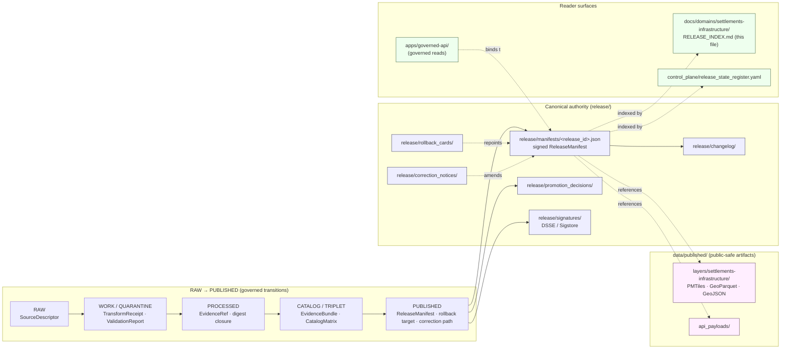
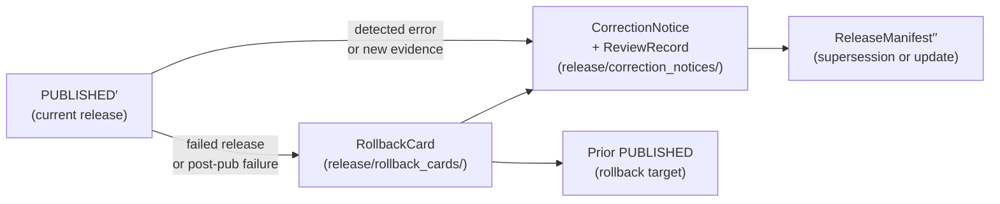

<!-- [KFM_META_BLOCK_V2]
doc_id: kfm://doc/docs-domains-settlements-infrastructure-release-index
title: Settlements / Infrastructure — Release Index
type: standard
version: v1
status: draft
owners: TODO — settlements-infrastructure domain steward; docs steward
created: 2026-05-19
updated: 2026-05-19
policy_label: public
related:
  - docs/domains/settlements-infrastructure/README.md
  - docs/domains/README.md
  - docs/architecture/release-discipline.md
  - release/README.md
  - release/manifests/
  - release/changelog/
  - data/published/layers/settlements-infrastructure/
  - contracts/release/release_manifest.md
  - schemas/contracts/v1/release/release_manifest.schema.json
  - control_plane/release_state_register.yaml
  - docs/registers/VERIFICATION_BACKLOG.md
tags: [kfm, settlements, infrastructure, release, index, manifest, governance]
notes:
  - Reader-facing per-domain index over canonical ReleaseManifests. Not itself an authority.
  - Authority for release decisions lives under `release/`, not under `docs/`.
[/KFM_META_BLOCK_V2] -->

# Settlements / Infrastructure — Release Index

Reader-facing index of published Settlements / Infrastructure releases — a navigable surface over the canonical `release/manifests/` store, not a replacement for it.


**Status:** draft · **Owners:** _TODO — settlements-infrastructure domain steward; release authority; docs steward_ · **Updated:** _TODO_

> [!IMPORTANT]
> This file is a **documentation index**, not an authority. The canonical `ReleaseManifest` for any listed release lives under [`release/manifests/`](../../../release/manifests/) and its authority cannot be transferred into `docs/`. If this index and a `ReleaseManifest` ever disagree, the manifest wins, and that disagreement is itself a drift event worth recording (Directory Rules §13.5 — "Documentation as truth"). [CONFIRMED]

---

## Contents

- [1. Purpose and posture](#1-purpose-and-posture)
- [2. Repo fit and authority boundary](#2-repo-fit-and-authority-boundary)
- [3. How a Settlements / Infrastructure release is constructed](#3-how-a-settlements--infrastructure-release-is-constructed)
- [4. Release-index entry shape](#4-release-index-entry-shape)
- [5. Index of releases (CURRENT and HISTORICAL)](#5-index-of-releases-current-and-historical)
- [6. Sensitivity, rights, and publication posture](#6-sensitivity-rights-and-publication-posture)
- [7. Stale-state, supersession, correction, and rollback](#7-stale-state-supersession-correction-and-rollback)
- [8. Consumer binding rules](#8-consumer-binding-rules)
- [9. Related docs and registers](#9-related-docs-and-registers)
- [10. Open questions and verification backlog](#10-open-questions-and-verification-backlog)
- [Appendix A — Illustrative release-index entry (NOT a published release)](#appendix-a--illustrative-release-index-entry-not-a-published-release)
- [Appendix B — Truth-label legend](#appendix-b--truth-label-legend)

---

## 1. Purpose and posture

This index answers four reader-facing questions for the Settlements / Infrastructure domain:

1. **What has been released?** — current and prior `ReleaseManifest` entries pertaining to this domain, by `release_id`.
2. **What does each release contain?** — the dataset stable IDs, EvidenceBundle digests, PMTiles archives, layer manifests, and review state captured in each `ReleaseManifest`.
3. **Where do consumers bind?** — to the canonical `release/manifests/<release_id>.json`, never to a floating "latest" pointer or to this Markdown table. [CONFIRMED]
4. **What is stale, superseded, corrected, or rolled back?** — supersession lineage and rollback chain at a glance, with links into the canonical history.

> [!NOTE]
> Settlements / Infrastructure is a **restricted-by-default** lane for critical-infrastructure and operator-sensitive material. This index lists only **public-safe** release artifacts. Restricted artifacts referenced by a release may exist but are not surfaced here. [CONFIRMED doctrine / PROPOSED enforcement]

The posture is **cite-or-abstain**: if the canonical manifest cannot be resolved, this index reports `NEEDS VERIFICATION` rather than guessing a release's contents. [CONFIRMED doctrine]

[↑ Back to top](#settlements--infrastructure--release-index)

---

## 2. Repo fit and authority boundary

| Concern | Owns | This index's relationship |
|---|---|---|
| Release **decisions** (manifests, promotion decisions, rollback cards, correction/withdrawal notices, signatures) | `release/` (canonical, per Directory Rules §9.2) [CONFIRMED] | Points at; never duplicates as authority. |
| Released **artifacts** for this domain (public-safe PMTiles, GeoParquet, GeoJSON, API payloads, layer manifests) | `data/published/layers/settlements-infrastructure/` and adjacent `data/published/...` subfolders [CONFIRMED doctrine / PROPOSED path] | Points at; consumers fetch via the governed API, not by direct path. |
| Release **meaning** (object semantics of a `ReleaseManifest`) | `contracts/release/release_manifest.md` [PROPOSED placement per ADR-0001 lineage] | Cites; does not redefine. |
| Release **shape** (machine-checkable schema) | `schemas/contracts/v1/release/release_manifest.schema.json` [PROPOSED — ADR-0001 default home] | Cites; does not embed. |
| Release **state register** (machine-readable index) | `control_plane/release_state_register.yaml` [CONFIRMED placement; PROPOSED contents] | Stays consistent with; this doc is the human-facing surface. |
| Domain README and orientation | `docs/domains/settlements-infrastructure/README.md` [CONFIRMED placement per Directory Rules §6.1] | Sibling; this file links back. |

> [!CAUTION]
> **Anti-pattern (Directory Rules §13.5 — "Documentation as truth"):** treating this Markdown index as the authoritative record of what was released. The Markdown is for humans; the JSON `ReleaseManifest` (and its signature) is the record. Reconcile drift by repromoting the manifest, not by editing this file alone. [CONFIRMED]

### 2.1 Where this file lives

```
docs/domains/settlements-infrastructure/
├── README.md
├── RELEASE_INDEX.md       ← this file
└── ... (other per-domain docs)
```

The path follows the Domain Placement Law (Directory Rules §12): domain docs live under `docs/domains/<domain>/`, never as a root-level domain folder. [CONFIRMED]

[↑ Back to top](#settlements--infrastructure--release-index)

---

## 3. How a Settlements / Infrastructure release is constructed



> [!NOTE]
> **Diagram status:** the lifecycle invariant (`RAW → WORK / QUARANTINE → PROCESSED → CATALOG / TRIPLET → PUBLISHED`) is CONFIRMED doctrine from Directory Rules §9.1 and the Consolidated Atlas §H. The `release/` subtree and the boundary between `release/` (decisions) and `data/published/` (artifacts) is CONFIRMED from Directory Rules §9.2. Exact path layout of `data/published/layers/settlements-infrastructure/` is PROPOSED per Directory Rules §12 lane pattern; presence in a mounted repository is NEEDS VERIFICATION.

A release is **content-addressed**: the `ReleaseManifest` names every included dataset by stable ID, every `EvidenceBundle` by `spec_hash`, every PMTiles archive by `spec_hash`, and every layer manifest by `spec_hash` — so any consumer that records a manifest's `spec_hash` is recording exactly which evidence it observed. [CONFIRMED — Atlas §8.11.89 / KFM-P7-PROG-0003]

[↑ Back to top](#settlements--infrastructure--release-index)

---

## 4. Release-index entry shape

Each row in §5 corresponds to one `ReleaseManifest` and surfaces a **subset** of its fields for navigation. The canonical, signed, hashable JSON object remains under `release/manifests/`.

> [!NOTE]
> The required fields below are derived from CONFIRMED Atlas doctrine ("ReleaseManifest expectations are extended with release index entries carrying `dataset_id`, `spec_hash`, `run_receipt`, SPDX, timestamp, and evidence bundle digest" — Pass 15 addendum, CONFIRMED in Consolidated Atlas §8.11.89 lineage). Additional surfaced fields are PROPOSED for this index and are subject to ADR.

### 4.1 Required surfaced fields (per release entry)

| Field | Source | Status | Purpose |
|---|---|---|---|
| `release_id` | `ReleaseManifest.release_id` | CONFIRMED | Stable, content-addressed release identifier. |
| `release_spec_hash` | `jcs:sha256:<hex>` over the canonicalized manifest | CONFIRMED | Pin a consumer to exact manifest bytes. |
| `published_at` | `ReleaseManifest.published_at` (ISO 8601) | CONFIRMED | When the PUBLISHED transition was authorized. |
| `release_authority` | `ReleaseManifest.release_authority` | CONFIRMED doctrine / PROPOSED field | Actor who issued the manifest (distinct from author when materiality applies — §M, ENCY §24.7). |
| `review_state` | `ReviewRecord` reference, or `not-required` | CONFIRMED doctrine / PROPOSED field | Whether a `ReviewRecord` was required and present. |
| `correction_path` | URL / ref to correction-notice channel | CONFIRMED | How to report errors against this release. |
| `rollback_target` | Prior `release_id` (or `none` for genesis) | CONFIRMED | Where a rollback would repoint to. |
| `sensitivity_label` | `public` &#124; `review` &#124; `restricted` | CONFIRMED doctrine / PROPOSED field | Default `public` for this index; non-public releases are typically not surfaced here. |
| `included_datasets[]` | array of `{dataset_id, spec_hash, evidence_bundle_digest, run_receipt, rights_spdx}` | CONFIRMED — Pass 15 addendum | The five-tuple per dataset that the index doctrine requires. |
| `included_layers[]` | array of `{layer_manifest_spec_hash, renderer}` | CONFIRMED — KFM-P7-PROG-0006 | Bridge between catalog and UI; `renderer` ∈ `MapLibre` / `Cesium`. |
| `included_tile_archives[]` | array of `{pmtiles_spec_hash, delta_base_hash?}` | CONFIRMED — KFM-P7-PROG-0003; PMTiles delta governance per KFM-P28-IDEA-0015 | Each PMTiles archive content-addressed; deltas carry `delta_base_hash`. |
| `attestations[]` | DSSE / Sigstore / cosign references | CONFIRMED — C1-03 | Supply-chain evidence; verify via `release/signatures/`. |
| `supersedes` | prior `release_id` or `none` | CONFIRMED — Atlas §24.8.2 | Supersession lineage entry. |
| `superseded_by` | newer `release_id` or `none` | CONFIRMED — Atlas §24.8.2 | Populated when a later release replaces this one. |

### 4.2 Settlements / Infrastructure–specific surfaced fields (PROPOSED)

| Field | Status | Rationale |
|---|---|---|
| `domain` | PROPOSED constant `settlements-infrastructure` | Disambiguates cross-domain manifests; matches the lane folder name. |
| `object_families[]` | PROPOSED | Subset of `{Settlement, Municipality, CensusPlace, Townsite, GhostTown, Fort, Mission, ReservationCommunity, Infrastructure Asset, Network Node, Network Segment, Facility, Service Area, Operator, Condition Observation, Dependency}`. [CONFIRMED inventory — Atlas §14.B] |
| `geography_version` | PROPOSED | Pins each release to the `GeographyVersion` it was bound to (Atlas §24.8.1 — geography-version drift is a stale-state marker). |
| `restricted_companion_count` | PROPOSED | Number of restricted-tier artifacts in the parent `ReleaseManifest` that are **not** surfaced here (visibility cue without leaking content). |

[↑ Back to top](#settlements--infrastructure--release-index)

---

## 5. Index of releases (CURRENT and HISTORICAL)

> [!WARNING]
> **No mounted-repo evidence is available in this authoring session.** The repository, its `release/manifests/` directory, any signed manifests, and the per-release filesystem state cannot be inspected here. Therefore: no specific release is enumerated below. Populating §5.1 and §5.2 requires (a) a mounted repository and (b) verification against `release/manifests/<release_id>.json` for each row. [UNKNOWN repository state · NEEDS VERIFICATION before any row is added]

### 5.1 Current release

| release_id | release_spec_hash | published_at | review_state | rollback_target | sensitivity | datasets | layers | PMTiles |
|---|---|---|---|---|---|---|---|---|
| _NEEDS VERIFICATION_ | _NEEDS VERIFICATION_ | _NEEDS VERIFICATION_ | _NEEDS VERIFICATION_ | _NEEDS VERIFICATION_ | _NEEDS VERIFICATION_ | _NEEDS VERIFICATION_ | _NEEDS VERIFICATION_ | _NEEDS VERIFICATION_ |

### 5.2 Historical releases (newest first)

| release_id | published_at | superseded_by | rollback_chain | correction_notices | status |
|---|---|---|---|---|---|
| _NEEDS VERIFICATION_ | _NEEDS VERIFICATION_ | _NEEDS VERIFICATION_ | _NEEDS VERIFICATION_ | _NEEDS VERIFICATION_ | _NEEDS VERIFICATION_ |

### 5.3 Withdrawn releases

| release_id | withdrawal_notice | withdrawn_at | reason_summary |
|---|---|---|---|
| _NEEDS VERIFICATION_ | _NEEDS VERIFICATION_ | _NEEDS VERIFICATION_ | _NEEDS VERIFICATION_ |

> [!TIP]
> When this index is first populated against a real release, each row's `release_id` MUST link to `../../../release/manifests/<release_id>.json`, each `release_spec_hash` MUST be re-derivable via JCS+SHA-256 over the canonicalized manifest (per KFM-IDX-EVI / C1-02 — `jcs:sha256:<hex>`), and the `correction_notices` cell MUST link to `../../../release/correction_notices/`. [CONFIRMED doctrine / PROPOSED link pattern]

[↑ Back to top](#settlements--infrastructure--release-index)

---

## 6. Sensitivity, rights, and publication posture

> [!CAUTION]
> **Critical infrastructure, utilities, condition observations, dependencies, operator-sensitive details, and exact facility geometry default to restricted or review.** Releases that include these artifacts are typically not surfaced in this public-facing index; their `ReleaseManifest` still exists in `release/manifests/` but reaches consumers only through governed surfaces. [CONFIRMED — Atlas §14.I; ENCY §20.5]

The deny-by-default register applies fully to this domain. A release is **denied at the gate** if any of the following are unresolved at promotion time:

| Failure family | Example reason codes (PROPOSED catalog) | Outcome |
|---|---|---|
| Missing required artifact | `MISSING_RECEIPT`, `MISSING_EVIDENCE`, `MISSING_REVIEW` | HOLD at CATALOG; no PUBLISHED transition. [CONFIRMED] |
| Rights / sensitivity unresolved | `RIGHTS_UNKNOWN`, `SENSITIVITY_UNRESOLVED` | Steward review; tier reassignment; gate stays closed. [CONFIRMED] |
| Source-role collapse | `ROLE_COLLAPSE`, `ROLE_DOWNCAST_FORBIDDEN` | Restore source role; refuse upcast. [CONFIRMED] |
| Review state inadequate | `REVIEW_NEEDED`, `REVIEW_INSUFFICIENT`, `REVIEW_REJECTED` | Run required review; supply `ReviewRecord`. [CONFIRMED] |
| Release infrastructure error | `RELEASE_MANIFEST_INVALID`, `ROLLBACK_TARGET_MISSING` | Manifest fix; supply rollback target. [CONFIRMED] |

> [!NOTE]
> Rights screening for this domain typically requires SPDX values from a curated allowlist (e.g., `CC0-1.0`, `CC-BY-4.0`; whether `ODC-By`, `PDDL`, and `US-PD` are on the list is OPEN in C5-02). Each row in §5 should report the `rights_spdx` array for its included datasets when populated. [CONFIRMED — KFM-P10 C5-02 / NEEDS VERIFICATION — current allowlist contents]

[↑ Back to top](#settlements--infrastructure--release-index)

---

## 7. Stale-state, supersession, correction, and rollback

> [!NOTE]
> KFM separates **stale** from **wrong**: a stale claim is one whose evidence, source freshness, dependent data, or context has aged past its declared tolerance; a wrong claim is one whose substance is incorrect. Both have visible markers and traceable lifecycles. [CONFIRMED — Atlas §24.8]

### 7.1 Stale-state markers visible on this index

When a release in §5 becomes stale (without being wrong), this index marks it inline rather than removing the row.

| Marker | Triggered by | Surfaced as | Action |
|---|---|---|---|
| Source freshness expired | Cadence in `SourceDescriptor` passed | `🟡 stale-source` next to `release_id` | Re-admit or supersede; otherwise dependents marked stale. [CONFIRMED] |
| Schema version drift | Object schema upgraded past published schema version | `🟡 schema-drift` | Migrate, re-validate, re-release; or mark stale. [CONFIRMED] |
| Geography version drift | `GeographyVersion` replaced; release still bound to prior version | `🟡 geo-version` | Rebind; re-release; or mark stale. [CONFIRMED] |
| Time-scope outside support | Claim's temporal scope outside current support window | `🟡 time-oos` | Mark stale; do not refresh silently. [CONFIRMED] |
| Review aged out | `ReviewRecord` older than the lane's review-cycle tolerance | `🟡 review-aged` | Trigger steward review; possibly downgrade tier. [CONFIRMED] |
| Rights status changed | Rights change in `SourceDescriptor` or rights-holder communication | `🟡 rights-changed` | Re-evaluate tier; possibly downgrade or emit `CorrectionNotice`. [CONFIRMED] |
| Policy version changed | Policy referenced by `PolicyDecision` superseded | `🟡 policy-version` | Re-run gate; possibly supersede release. [CONFIRMED] |

### 7.2 Supersession lineage

A new `ReleaseManifest` does **not** delete its predecessor. The prior release is retained, its rollback target remains valid, and the chain (`supersedes` / `superseded_by`) is preserved in this index. [CONFIRMED — Atlas §24.8.2]

### 7.3 Correction and rollback path



- Corrections are visible: the affected release is **not** silently edited; a `CorrectionNotice` is published, derivative invalidation is recorded, and the manifest history is preserved. [CONFIRMED]
- Rollbacks **repoint**: they restore a prior release as the current served state and emit a `RollbackCard` plus a `CorrectionNotice`; downstream derivatives are invalidated explicitly. [CONFIRMED]
- This index reflects rollback by updating §5.1 to the rollback target and marking the rolled-back manifest's row with `↩ rolled back at <timestamp>` in §5.2. [PROPOSED surfacing pattern]

[↑ Back to top](#settlements--infrastructure--release-index)

---

## 8. Consumer binding rules

> [!IMPORTANT]
> Consumers (the web client, the catalog harvester, downstream pipelines) MUST bind to `ReleaseManifest` by `release_spec_hash`, **not** to floating "latest" pointers, and **not** to this Markdown file. [CONFIRMED — KFM-P7-PROG-0003]

| Consumer | Correct binding | Anti-pattern |
|---|---|---|
| `apps/explorer-web/` (MapLibre shell) | Fetch the released layer manifest via the governed API; the layer manifest is itself signed and addressable. [CONFIRMED — KFM-P7-PROG-0006] | Hard-coding tile URLs into the shell; reading `data/processed/` directly. [Directory Rules §13.5] |
| Catalog harvester | Bind to `release_spec_hash`; verify cosign / DSSE / Sigstore attestations from `release/signatures/`. [CONFIRMED — C5-02] | Following an undated "latest" pointer. |
| Downstream pipelines | Record the `release_spec_hash` and `included_datasets[].evidence_bundle_digest` they observed. [CONFIRMED] | Re-deriving identifiers locally without recording them. |
| Human readers / steward review | Use this index for navigation; click through to the canonical `ReleaseManifest` for authoritative claims. [PROPOSED reader contract] | Citing this Markdown table as the record of release. |

[↑ Back to top](#settlements--infrastructure--release-index)

---

## 9. Related docs and registers

| Surface | Path | Status |
|---|---|---|
| Domain README | [`docs/domains/settlements-infrastructure/README.md`](./README.md) | PROPOSED placement per Directory Rules §6.1; presence NEEDS VERIFICATION. |
| Domains landing | [`docs/domains/README.md`](../README.md) | PROPOSED placement; presence NEEDS VERIFICATION. |
| Release architecture | [`docs/architecture/release-discipline.md`](../../architecture/release-discipline.md) | PROPOSED; existence NEEDS VERIFICATION. |
| Canonical release decisions | [`release/`](../../../release/) | CONFIRMED canonical authority per Directory Rules §9.2. |
| Canonical release manifests | [`release/manifests/`](../../../release/manifests/) | CONFIRMED canonical home. |
| Release changelog | [`release/changelog/`](../../../release/changelog/) | CONFIRMED canonical home. |
| Release state register (machine-readable) | [`control_plane/release_state_register.yaml`](../../../control_plane/release_state_register.yaml) | CONFIRMED placement; PROPOSED contents. |
| Verification backlog | [`docs/registers/VERIFICATION_BACKLOG.md`](../../registers/VERIFICATION_BACKLOG.md) | PROPOSED placement; presence NEEDS VERIFICATION. |
| Published artifacts (this domain) | [`data/published/layers/settlements-infrastructure/`](../../../data/published/layers/settlements-infrastructure/) | PROPOSED path per Domain Placement Law (§12). |
| ReleaseManifest contract (meaning) | `contracts/release/release_manifest.md` | PROPOSED placement per Directory Rules §6.3. |
| ReleaseManifest schema (shape) | `schemas/contracts/v1/release/release_manifest.schema.json` | PROPOSED placement per ADR-0001. |
| Consolidated Atlas — Settlements / Infrastructure chapter | `docs/atlases/...` Atlas §14 | CONFIRMED authored; mounted-repo location NEEDS VERIFICATION. |

[↑ Back to top](#settlements--infrastructure--release-index)

---

## 10. Open questions and verification backlog

These items are tracked here for triage; resolutions migrate to `docs/registers/VERIFICATION_BACKLOG.md` or `docs/adr/` as appropriate.

### 10.1 Placement and structure

- **OPEN-RI-SETTLE-01 — Index update mechanism.** Whether this index is hand-authored by stewards on each release, generated from `release/manifests/` and `release/changelog/`, or both (generated body + hand-authored notes). The Atlas's ReleaseManifest cadence ("daily, weekly, on-demand?") is itself NEEDS VERIFICATION. **Resolution via ADR.**
- **OPEN-RI-SETTLE-02 — Domain-folder naming alignment.** This file uses `docs/domains/settlements-infrastructure/`, mirroring the Atlas domain name "Settlements / Infrastructure" with hyphenation. Whether all per-domain doc paths align on hyphenated lowercase (`settlements-infrastructure`) versus another convention is parallel to the open question raised for other domains (e.g., `geology-and-natural-resources` vs `geology`). **Resolution via ADR.** [NEEDS VERIFICATION]
- **OPEN-RI-SETTLE-03 — Filename casing.** This file uses `RELEASE_INDEX.md` (UPPERCASE_WITH_UNDERSCORES), mirroring `SOURCE_REFRESH_RUNBOOK.md`, `ISO-19115.md`, etc. The encyclopedia raised a parallel naming-pattern question (lowercase-with-underscores vs UPPERCASE_WITH_UNDERSCORES). **Resolution via per-root README or docs-steward decision.** [NEEDS VERIFICATION]
- **OPEN-RI-SETTLE-04 — Surfacing restricted-companion presence.** Whether `restricted_companion_count` (§4.2) is the right form of visibility cue, or whether a different field (e.g., `restricted_companion_present: true|false`) is preferable for least-information disclosure. **Resolution via ADR + sensitivity reviewer.**

### 10.2 Schema and contract

- **OPEN-RI-SETTLE-05 — `delta_manifest` ↔ `ReleaseManifest` relationship.** The Atlas notes the relationship between a `ReleaseManifest` and a per-tile-set `delta_manifest` is not fully resolved; both exist and overlap. PMTiles delta governance (KFM-P28-IDEA-0015) requires `delta_base_hash` and signed patch provenance. The right surfacing in §4.1 `included_tile_archives[]` may need to include delta lineage. **Resolution via ADR.** [CONFIRMED open question — Pass 23 KFM-P7-PROG-0003 expansion notes]
- **OPEN-RI-SETTLE-06 — SPDX allowlist contents.** The canonical SPDX allowlist (and whether `ODC-By`, `PDDL`, `US-PD` are members) is OPEN in C5-02. **Resolution via Research Track item (KFM-P10 §10.1).** [CONFIRMED open]

### 10.3 Repository state (UNKNOWN until mounted)

| Item | Evidence that would settle it | Status |
|---|---|---|
| Verify `release/` subtree exists and matches Directory Rules §9.2 | Mounted repo; tree listing | UNKNOWN |
| Verify `data/published/layers/settlements-infrastructure/` exists | Mounted repo; tree listing | UNKNOWN |
| Verify `release_manifest.schema.json` lives under `schemas/contracts/v1/release/` per ADR-0001 | Mounted repo; schema file | UNKNOWN |
| Verify `control_plane/release_state_register.yaml` is the canonical machine-readable mirror | Mounted repo; register file | UNKNOWN |
| Verify per-domain `docs/domains/settlements-infrastructure/README.md` exists | Mounted repo; file presence | UNKNOWN |
| Verify CI workflow enforces JCS+SHA-256 spec-hash gate on release | Mounted repo; workflow file | NEEDS VERIFICATION |
| Verify cosign / DSSE / Sigstore attestation chain at release time | Mounted repo; `release/signatures/` | NEEDS VERIFICATION |
| Verify critical-infrastructure deny-by-default policy is enforced (not just doctrinal) | Mounted repo; `policy/domains/settlements-infrastructure/`; tests | NEEDS VERIFICATION |
| Verify rollback drill runs against a real prior release | Mounted repo; drill log; `release/rollback_cards/` | NEEDS VERIFICATION |

[↑ Back to top](#settlements--infrastructure--release-index)

---

## Appendix A — Illustrative release-index entry (NOT a published release)

<details>
<summary><b>Show illustrative entry (illustrative; not bound to any real release)</b></summary>

> [!WARNING]
> The block below is **illustrative**. The `release_id`, `spec_hash`, dataset IDs, digests, timestamps, owners, and signatures are placeholders chosen to show field shape. Nothing here corresponds to a real published release. Use `release/manifests/` for actual entries.

```json
{
  "release_id": "kfm-release-XXXX-XX-XX-settle-NN",
  "release_spec_hash": "jcs:sha256:<PLACEHOLDER-HEX>",
  "domain": "settlements-infrastructure",
  "published_at": "YYYY-MM-DDThh:mm:ssZ",
  "release_authority": "TODO-release-authority-id",
  "review_state": {
    "required": true,
    "review_record": "release/reviews/REC-XXXX.json",
    "status": "approved"
  },
  "correction_path": "release/correction_notices/",
  "rollback_target": "kfm-release-XXXX-XX-XX-settle-NN-MINUS-1",
  "sensitivity_label": "public",
  "object_families": [
    "Settlement",
    "Municipality",
    "CensusPlace",
    "Townsite",
    "GhostTown",
    "Fort",
    "Mission",
    "ReservationCommunity",
    "Network Node",
    "Facility"
  ],
  "geography_version": "kfm-geo-vNN",
  "included_datasets": [
    {
      "dataset_id": "kfm:settle:municipality:ks:vN",
      "spec_hash": "jcs:sha256:<PLACEHOLDER-HEX>",
      "evidence_bundle_digest": "sha256:<PLACEHOLDER-HEX>",
      "run_receipt": "data/receipts/release/REC-XXXX.jsonl",
      "rights_spdx": "CC-BY-4.0"
    },
    {
      "dataset_id": "kfm:settle:censusplace:ks:vN",
      "spec_hash": "jcs:sha256:<PLACEHOLDER-HEX>",
      "evidence_bundle_digest": "sha256:<PLACEHOLDER-HEX>",
      "run_receipt": "data/receipts/release/REC-XXXX.jsonl",
      "rights_spdx": "CC0-1.0"
    }
  ],
  "included_layers": [
    {
      "layer_manifest_spec_hash": "jcs:sha256:<PLACEHOLDER-HEX>",
      "renderer": "MapLibre"
    }
  ],
  "included_tile_archives": [
    {
      "pmtiles_spec_hash": "jcs:sha256:<PLACEHOLDER-HEX>",
      "delta_base_hash": null
    }
  ],
  "attestations": [
    {
      "type": "cosign",
      "bundle_digest": "sha256:<PLACEHOLDER-HEX>"
    }
  ],
  "supersedes": "kfm-release-XXXX-XX-XX-settle-NN-MINUS-1",
  "superseded_by": null,
  "restricted_companion_count": 0
}
```

Fields and conventions follow CONFIRMED Atlas doctrine (Pass 15 addendum to KFM-P7-PROG-0003; KFM-P7-PROG-0006; KFM-P28-IDEA-0015; C1-02 deterministic `spec_hash`); the JSON above is a documentation example, not a schema instance.

</details>

[↑ Back to top](#settlements--infrastructure--release-index)

---

## Appendix B — Truth-label legend

| Label | Meaning |
|---|---|
| **CONFIRMED** | Verified in this session from attached docs, workspace evidence, tests, logs, or generated artifacts. |
| **INFERRED** | Reasonably derivable from visible evidence but not directly stated. |
| **PROPOSED** | Design, path, placement, or recommendation not yet verified in implementation. |
| **UNKNOWN** | Not resolvable without more evidence. |
| **NEEDS VERIFICATION** | Checkable, but not yet checked strongly enough to act as fact. |
| **EXTERNAL** | Sourced from authoritative external research (none cited in this revision). |

---

### Related docs

- [`./README.md`](./README.md) — Settlements / Infrastructure domain README _(NEEDS VERIFICATION)_
- [`../README.md`](../README.md) — Domains landing _(NEEDS VERIFICATION)_
- [`../../../release/README.md`](../../../release/README.md) — Release-root README _(NEEDS VERIFICATION)_
- [`../../../release/manifests/`](../../../release/manifests/) — Canonical ReleaseManifests
- [`../../../release/changelog/`](../../../release/changelog/) — Release-level changelog
- [`../../../control_plane/release_state_register.yaml`](../../../control_plane/release_state_register.yaml) — Machine-readable release register
- [`../../adr/`](../../adr/) — ADR index _(open ADR placeholders in §10)_
- [`../../registers/VERIFICATION_BACKLOG.md`](../../registers/VERIFICATION_BACKLOG.md) — Verification backlog

**Last updated:** _TODO_ · **Owners:** _TODO — settlements-infrastructure domain steward; release authority; docs steward_

[↑ Back to top](#settlements--infrastructure--release-index)
