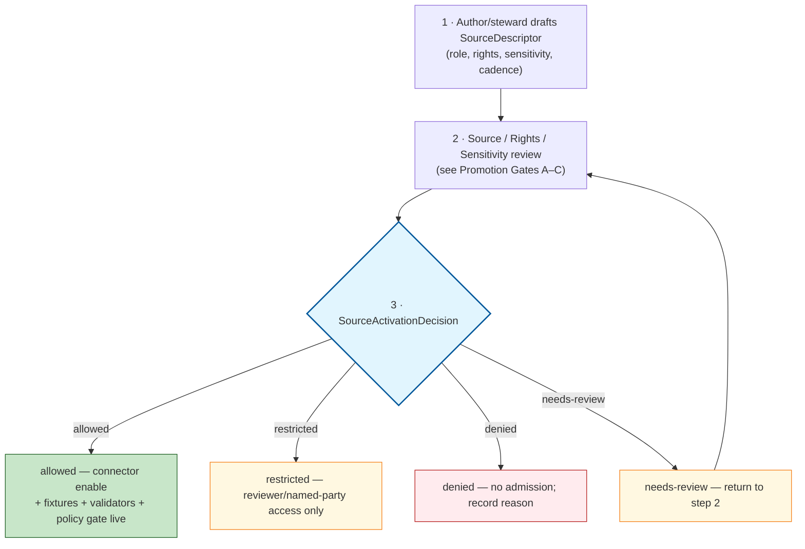

<!-- [KFM_META_BLOCK_V2]
doc_id: kfm://doc/settlements-infrastructure/source-registry
title: Settlements & Infrastructure — Source Registry
type: standard
version: v1
status: draft
owners: TODO — Settlements/Infrastructure domain steward; Source steward
created: 2026-05-19
updated: 2026-05-19
policy_label: public
related:
  - docs/domains/settlements-infrastructure/README.md
  - docs/domains/roads-rail-trade/SOURCE_REGISTRY.md
  - docs/sources/README.md
  - docs/standards/PROV.md
  - docs/standards/ISO-19115.md
  - data/registry/sources/settlements-infrastructure/
  - schemas/contracts/v1/source/source-descriptor.json
  - schemas/contracts/v1/settlement/
  - policy/sensitivity/infrastructure/
  - control_plane/source_authority_register.yaml
  - docs/doctrine/directory-rules.md
  - docs/atlases/KFM_Domains_Culmination_Atlas_v1_1.pdf
tags: [kfm, domain, settlements, infrastructure, source-registry, governance, sensitivity]
notes:
  - All repo paths are PROPOSED until verified against the mounted repository.
  - Critical infrastructure detail defaults to T2/T4 per Atlas §24.5.2.
  - This is a docs-side orientation; the machine-readable registry lives under data/registry/ (PROPOSED).
[/KFM_META_BLOCK_V2] -->

# Settlements & Infrastructure — Source Registry

> Human-facing orientation to the **source admission, role, rights, sensitivity, cadence, and release posture** governing every source that supplies the Settlements/Infrastructure lane — settlements, municipalities, historic townsites, forts, missions, reservation communities, networks, facilities, service areas, operators, and condition observations.


| Status | Owners | Last reviewed |
|---|---|---|
| Draft (PROPOSED) | TODO — Settlements/Infrastructure domain steward · Source steward | 2026-05-19 |

> [!IMPORTANT]
> **Path status labels are mandatory.** Every repo path in this document is one of **CONFIRMED**, **PROPOSED**, or **NEEDS VERIFICATION**. No live repo is mounted in this session, so **all implementation-layer paths in this file are PROPOSED unless explicitly marked otherwise**. See [§13. Open questions](#13-open-questions-and-verification-backlog).

<a id="top"></a>

## Quick jump

- [1. Purpose](#1-purpose)
- [2. Repo fit](#2-repo-fit)
- [3. Inputs · what this registry admits](#3-inputs--what-this-registry-admits)
- [4. Exclusions · what this registry does not own](#4-exclusions--what-this-registry-does-not-own)
- [5. Source admission lifecycle](#5-source-admission-lifecycle)
- [6. Source families](#6-source-families)
- [7. Source-role taxonomy](#7-source-role-taxonomy)
- [8. SourceDescriptor surface (illustrative)](#8-sourcedescriptor-surface-illustrative)
- [9. Sensitivity defaults for this domain](#9-sensitivity-defaults-for-this-domain)
- [10. SourceActivationDecision flow](#10-sourceactivationdecision-flow)
- [11. Cross-lane sourcing rules](#11-cross-lane-sourcing-rules)
- [12. Anti-patterns (deny lanes)](#12-anti-patterns-deny-lanes)
- [13. Validators, tests, and fixtures](#13-validators-tests-and-fixtures)
- [13. Open questions and verification backlog](#13-open-questions-and-verification-backlog)
- [14. Related docs](#14-related-docs)
- [Appendix A · Worked admission example (illustrative)](#appendix-a--worked-admission-example-illustrative)

---

## 1. Purpose

CONFIRMED doctrine: KFM's **source registry is an admission and authority-control surface, not a bibliography.** It records source identity, role, rights posture, access method, cadence, steward, sensitivity, freshness expectations, attribution requirements, and public-release class so source material can be **admitted, quarantined, restricted, or denied** before it shapes public claims.

This document is the **human-facing orientation** to that registry for the **Settlements/Infrastructure** lane. It explains:

- which **source families** the domain accepts and what role they may play,
- the **SourceDescriptor** fields each source must carry before activation,
- the **default sensitivity tier** applied to each kind of evidence,
- the **activation flow** that gates a source from candidate to allowed/restricted/denied,
- the **cross-lane sourcing rules** that prevent silent role collapse on joins, and
- the **deny lanes** that fail closed under this domain's governance.

> [!NOTE]
> CONFIRMED doctrine: this registry **does not decide whether a file should exist** — `contracts/`, `schemas/`, `policy/`, ADRs, and reviews decide that. The registry decides **what may be admitted, with what role, under what rights, at what tier, on what cadence, and through which connector** [DIRRULES §1].

[Back to top](#top)

---

## 2. Repo fit

PROPOSED placement (all paths PROPOSED unless marked otherwise):

```text
docs/domains/settlements-infrastructure/
├── README.md                       # domain landing (PROPOSED)
├── SOURCE_REGISTRY.md              # THIS FILE — human-facing source orientation
├── SENSITIVITY.md                  # PROPOSED — per-object tier explanations
└── RUNBOOKS/ or links to docs/runbooks/<…>/   # PROPOSED — pending §18 OPEN-DR-02 ADR
```

CONFIRMED doctrine boundary: `docs/` **explains** to humans; `control_plane/` **indexes**; `contracts/` **defines meaning**; `schemas/` **defines machine shape**; `policy/` **decides admission**; `data/registry/` **stores the operational registry records** [DIRRULES §3, §6.1].

**Upstream — what this doc cites**

| Upstream artifact | Role | Status |
|---|---|---|
| `docs/doctrine/directory-rules.md` | Placement and authority law. | CONFIRMED rule / PROPOSED presence in repo |
| `docs/atlases/KFM_Domains_Culmination_Atlas_v1_1.pdf` (Ch. 14 + §24.1, §24.5) | Domain dossier; source-role taxonomy; sensitivity tier matrix. | CONFIRMED authored / PROPOSED placement |
| `docs/sources/README.md` | Cross-domain source-descriptor standards and source-family doctrine. | PROPOSED |
| `docs/standards/PROV.md` · `docs/standards/ISO-19115.md` | External standards profiles (provenance; geographic metadata). | CONFIRMED authored (prior session) / NEEDS VERIFICATION in repo |
| `KFM-encyclopedia` §5.1, §7.12 | Schema/policy homes for this domain. | CONFIRMED authored |

**Downstream — what cites or is governed by this doc**

| Downstream artifact | Role | Status |
|---|---|---|
| `data/registry/sources/settlements-infrastructure/` | Machine-readable `SourceDescriptor` records (one file per admitted source). | PROPOSED |
| `schemas/contracts/v1/source/source-descriptor.json` | Shape of every SourceDescriptor record. | PROPOSED (ADR-0001 schema-home rule applies) |
| `schemas/contracts/v1/settlement/` | Domain object shapes. | PROPOSED |
| `policy/sensitivity/infrastructure/` | Per-tier admission and release policy. | PROPOSED |
| `connectors/<source>/` | Source-specific fetchers; **inactive until activation decision exists**. | PROPOSED |
| `pipelines/domains/settlements-infrastructure/` | Domain pipeline binding admitted sources to RAW capture. | PROPOSED |
| `tests/domains/settlements-infrastructure/` · `fixtures/domains/settlements-infrastructure/` | Admission, deny-lane, and no-leak tests. | PROPOSED |

[Back to top](#top)

---

## 3. Inputs · what this registry admits

CONFIRMED doctrine: this domain owns **Settlement, Municipality, CensusPlace, Townsite, GhostTown, Fort, Mission, ReservationCommunity, Infrastructure Asset, Network Node, Network Segment, Facility, Service Area, Operator, Condition Observation, Dependency** [Atlas §14.B].

The registry admits sources that supply evidence about those objects — *and only those objects* — at one of the source roles defined in [§7](#7-source-role-taxonomy).

> [!TIP]
> If a candidate source's primary content is **roads, rail, water flow, hazard events, parcels, living-person identity, archaeological coordinates, or biological occurrence**, it belongs in another lane's registry (Roads/Rail, Hydrology, Hazards, People/Land, Archaeology, Fauna/Flora). Cross-lane *joins* are governed in [§11](#11-cross-lane-sourcing-rules), not by re-admitting the source here.

[Back to top](#top)

---

## 4. Exclusions · what this registry does not own

CONFIRMED / PROPOSED domain boundaries [Atlas §14.B]:

| Out-of-scope content | Belongs to | Why |
|---|---|---|
| Transport routes; road/rail centerlines | Roads/Rail | Roads/Rail owns transport-network truth; this domain only joins at depot/bridge/crossing relations. |
| Hydrology evidence (gauges, flow, watersheds) | Hydrology | Water observations are governed by Hydrology; this domain only relates at water/wastewater/stormwater/floodplain edges. |
| Hazard events, warnings, declarations | Hazards | Hazards owns event identity and **KFM is never an alert authority**. |
| Living-person identifiers, ownership, parcel-to-person joins | People/DNA/Land | People/Land owns living-person privacy and ownership. |
| Archaeological site coordinates | Archaeology | Archaeology coordinates are **T4 deny-default**; this domain cannot bypass that gate. |
| Biological occurrences / habitat | Fauna · Flora · Habitat | Geoprivacy and rare-species controls apply. |

[Back to top](#top)

---

## 5. Source admission lifecycle

CONFIRMED doctrine / PROPOSED lane application: every admitted source follows the lifecycle invariant **RAW → WORK/QUARANTINE → PROCESSED → CATALOG/TRIPLET → PUBLISHED**, with promotion as a **governed state transition** (never a file move) [DIRRULES, Atlas §14.H].

```mermaid
flowchart LR
  C(["Candidate source<br/>(unadmitted)"])
  SD["SourceDescriptor draft<br/>(role, rights, sensitivity, cadence)"]
  SR["Source / Rights / Sensitivity review"]
  SAD{"SourceActivationDecision"}

  CONN["connectors/&lt;source&gt;/<br/>(inactive)"]
  RAW["data/raw/settlements-infrastructure/"]
  QUAR["data/quarantine/settlements-infrastructure/"]
  WORK["data/work/settlements-infrastructure/"]
  PROC["data/processed/settlements-infrastructure/"]
  CAT["data/catalog/domain/settlements-infrastructure/<br/>data/triplets/settlements-infrastructure/"]
  REL["release/candidates/settlements-infrastructure/"]
  PUB["data/published/layers/settlements-infrastructure/"]
  DENY[["DENIED · no admission"]]
  RESTR[["RESTRICTED · reviewer-only / named-party"]]

  C --> SD --> SR --> SAD
  SAD -- allowed --> CONN --> RAW
  SAD -- restricted --> RESTR
  SAD -- denied --> DENY
  SAD -- needs-review --> SR

  RAW --> WORK
  RAW -.fails gate.-> QUAR
  WORK --> PROC --> CAT --> REL --> PUB

  classDef gate fill:#e1f5fe,stroke:#01579b,stroke-width:2px;
  classDef store fill:#f1f8e9,stroke:#33691e;
  classDef deny fill:#ffebee,stroke:#b71c1c,color:#b71c1c,stroke-width:2px;
  classDef pub fill:#c8e6c9,stroke:#1b5e20,stroke-width:3px;
  class SAD,SR gate
  class RAW,WORK,PROC,CAT,REL,QUAR store
  class DENY,RESTR deny
  class PUB pub
```



> [!CAUTION]
> CONFIRMED doctrine: a **connector stays inactive** until `SourceActivationDecision`, fixtures, validators, and policy gates **all exist**. "Watcher available" is not "source admitted" [BLD-COMP §§8.1–8.2; IMPL-PIPE §13].

[Back to top](#top)

---

## 6. Source families

CONFIRMED / PROPOSED: the source families below are the ones the v1.1 Atlas dossier identifies for this domain [Atlas §14.D]. Each family carries its own typical role profile, rights surface, and freshness pattern; **a family name is not authority** — every individual source still produces its own `SourceDescriptor` and `SourceActivationDecision`.

| # | Source family | Typical role(s) (see §7) | Default rights / sensitivity posture | Freshness pattern | Status |
|---|---|---|---|---|---|
| 1 | **Census TIGER / census-place geography** | `observed` (administrative geometry) · `aggregate` (counts and characteristics) | Public/open license expected; current terms **NEEDS VERIFICATION**; sensitive joins fail closed. | Source-vintage specific (decennial + ACS cadence). | [Atlas §14.D] |
| 2 | **GNIS and gazetteers** | `observed` · `administrative` | Public/open license expected; current terms **NEEDS VERIFICATION**. | Periodic update cadence. | [Atlas §14.D] |
| 3 | **State / local GIS (Kansas Geoportal-style sources)** | `observed` · `administrative` · `aggregate` | Per-publisher terms; license verification per source **NEEDS VERIFICATION**. | Variable by publisher. | [Atlas §14.D] |
| 4 | **Municipal and local legal records** | `administrative` (legal events: incorporation, dissolution, annexation) | Per-jurisdiction terms; **MUST distinguish observation from administrative compilation** (see §12). | Event-driven; rare. | [Atlas §14.D] |
| 5 | **Historical gazetteers and maps** | `observed` (historic) · `candidate` | Public-domain status per item **NEEDS VERIFICATION**; uncertainty surface required. | Static; vintage-pinned. | [Atlas §14.D] |
| 6 | **Infrastructure operators and providers** | `observed` (asset/condition) · `administrative` | Operator-sensitive; **default RESTRICTED or deny** for condition, dependency, and precise geometry detail. | Variable; often non-public. | [Atlas §14.D] |
| 7 | **KDOT · bridge · facility sources** | `observed` · `administrative` · `aggregate` | Per-source terms; rights and re-use **NEEDS VERIFICATION**; cross-references Roads/Rail lane. | Periodic (NBI-style cadences). | [Atlas §14.D] |
| 8 | **FEMA · hazards · resilience sources** | `regulatory` (regulatory layers) · `observed` (declarations) | Public/open expected; **regulatory ≠ observed event** (see §12). | Event-driven and revision-driven. | [Atlas §14.D] |

> [!NOTE]
> Each family above maps to **one or more individual sources** in `data/registry/sources/settlements-infrastructure/` (PROPOSED). The registry record — not the family name — is the authority for activation.

[Back to top](#top)

---

## 7. Source-role taxonomy

CONFIRMED doctrine: **source role cannot be inferred from convenience**. The safe state is *quarantine, denial, restriction, or abstention* until rights, source role, access conditions, cadence, and release class are recorded [BLD-GREEN §§8, 18–19; BLD-COMP §§1.2, 8, 31; IMPL-PIPE §13].

PROPOSED canonical vocabulary (vocabulary-stability question is open as **ADR-S-04**, [§13](#13-open-questions-and-verification-backlog)) [Atlas §24.1.3]:

| Role | What it means in this domain | Typical examples in this lane | Anti-pattern guard |
|---|---|---|---|
| **`observed`** | Direct field, sensor, survey, or instrument record of a settlement, asset, network, condition, or service area. | NBI bridge inspection; field condition photo with sensor record; ground survey of a fort footprint. | Aggregate roll-ups MUST NOT be re-labeled observed. |
| **`regulatory`** | A regulatory or legal layer (zoning, designation, advisory) — *not* an observation of the world. | FEMA flood-zone overlay used as infrastructure-exposure context; designated historic district. | Regulatory layer MUST NOT be cited as observed event evidence (§12). |
| **`modeled`** | Output of a model run; carries inputs, parameters, version. | Service-area model; dependency network derivation. | Modeled output MUST carry `role_model_run_ref` → `ModelRunReceipt`. |
| **`aggregate`** | A spatial or temporal roll-up at a defined geometry scope (county, place, decade). | Census housing units per place; decennial population per municipality. | `role_aggregation_unit` MUST be set; per-place truth claims forbidden (§12). |
| **`administrative`** | Compiled or curated administrative record (legal events, status timelines). | Municipal incorporation / dissolution timelines; townsite legal-status events. | MUST NOT be published as an *observation* timeline (§12). |
| **`candidate`** | Unverified, pending, or under-review record. | Ghost-town location hypothesis from historic map; remote-sensing settlement candidate. | **No PUBLISHED edge** until merged (`role_candidate_disposition = merged`). |
| **`synthetic`** | Reconstruction, generated artifact, AI-derived content. | 3D reconstruction of a fort; synthetic historic facility footprint. | MUST carry `role_synthetic_basis` and a **Reality Boundary Note**; never cited as observed reality. |

> [!IMPORTANT]
> CONFIRMED doctrine: source role is set at admission, **never edited in place**; corrections must produce a **new descriptor** plus a `CorrectionNotice` [Atlas §24.1.3].

[Back to top](#top)

---

## 8. SourceDescriptor surface (illustrative)

PROPOSED schema-home note: `SourceDescriptor` lives at `schemas/contracts/v1/source/source-descriptor.json` per Directory Rules §7.4 and ADR-0001 unless an accepted ADR relocates it. **NEEDS VERIFICATION** — actual file presence and field names are not asserted from this session [DIRRULES, Atlas §24.1.3].

<details>
<summary><strong>Illustrative descriptor fields (PROPOSED; not authoritative)</strong></summary>

> [!WARNING]
> The fields below are PROPOSED shape only. The authoritative resolution is **the schema itself plus an ADR if the shape changes**. Do not treat this table as a contract.

| Field | Type / vocabulary | Required? | Notes |
|---|---|---|---|
| `source_id` | string (stable, kfm-namespaced) | MUST | Deterministic; admission-time. |
| `source_role` | enum: `observed` · `regulatory` · `modeled` · `aggregate` · `administrative` · `candidate` · `synthetic` | MUST | See [§7](#7-source-role-taxonomy). |
| `role_authority` | string (issuing body / model identity / steward) | MUST when role ∈ `{regulatory, modeled, aggregate}` | Disambiguates downstream cite text. |
| `role_aggregation_unit` | geometry-scope token (county, place, tract, year, decade, …) | MUST when `source_role = aggregate` | Prevents geometry-scope drift on join. |
| `role_model_run_ref` | `EvidenceRef` → `ModelRunReceipt` | MUST when `source_role = modeled` | Pins inputs, parameters, version. |
| `role_synthetic_basis` | `{ method, inputs, reality_boundary_note_ref }` | MUST when `source_role = synthetic` | Records what is and is not real. |
| `role_candidate_disposition` | enum: `pending` · `merged` · `rejected` · `quarantined` | MUST when `source_role = candidate` | PUBLISHED edge forbidden until `merged`. |
| `rights` | structured: `{ spdx_or_label, attribution, redistribution, contact }` | MUST | Public claims fail closed under unclear terms. |
| `sensitivity_tier` | enum: `T0` · `T1` · `T2` · `T3` · `T4` | MUST | See [§9](#9-sensitivity-defaults-for-this-domain). |
| `cadence` | structured: `{ kind: event|periodic|static, expected_interval }` | SHOULD | Drives stale-state badging. |
| `access` | enum: `public` · `authenticated` · `agreement` · `internal-only` | MUST | Tied to release class. |
| `steward` | string / contact | MUST | Owner-of-record. |
| `attribution_required` | boolean + template string | MUST | Mirrors into cite text. |
| `freshness_expectation` | duration / cron-ish | SHOULD | Drives stale alerts. |
| `verification_status` | enum: `verified` · `pending` · `needs-recheck` · `superseded` | MUST | Reviewable state. |
| `spec_hash` | sha256 over canonical JCS form | MUST at release | Reproducibility anchor. |

</details>

[Back to top](#top)

---

## 9. Sensitivity defaults for this domain

CONFIRMED doctrine: KFM publishes only the **safest representation that still answers the steward's and the public's reasonable needs**. Tier transitions are themselves governed — they require receipts and review records, not just an editorial decision [Atlas §24.5].

| Object class in this domain | Default tier | Allowed transforms (PROPOSED) | Required gates (PROPOSED) |
|---|---|---|---|
| Settlement · Municipality · CensusPlace · GhostTown · Townsite (historic shell) | **T0** | None required for current-day public legal identity / generalized geometry. | Standard Promotion Gates A–G. |
| Fort · Mission · ReservationCommunity (cultural-context objects) | **T0–T1** | Sovereignty/cultural review where applicable; generalized geometry. | `ReviewRecord` where cultural context applies. |
| Service Area · Operator (public-facing identity) | **T0–T1** | Aggregation; operator-private detail withheld. | `AggregationReceipt`. |
| Network Node · Network Segment · Facility (non-critical, generalized) | **T1** | Generalization; precise geometry suppressed. | `RedactionReceipt` or `TransformReceipt`. |
| **Infrastructure Asset — critical asset detail** | **T4 (default)** | Generalized facility footprint + suppressed dependency → T1 only with steward review. | `RedactionReceipt` + steward `ReviewRecord` [Atlas §24.5.2]. |
| **Infrastructure Asset — condition / vulnerability** | **T4 (default)** | **T3 to named authorities only; never T0 / T1.** | Steward review + named-party agreement [Atlas §24.5.2]. |
| Dependency (network interdependence detail) | **T4** | Aggregate summary + suppressed link detail → T1 with steward review. | `RedactionReceipt` + `ReviewRecord`. |

> [!CAUTION]
> CONFIRMED doctrine: **unclear rights, unresolved source role, missing evidence, unresolved sensitivity, or absent release state blocks public promotion** [ENCY, DIRRULES; Atlas §14.I]. There is no "publish first, redact later" path.

**Tier-transition reminder** (Atlas §24.5.3):

| From → To | Required artifact | Required reviewer |
|---|---|---|
| T4 → T3 | `PolicyDecision` + `ReviewRecord` + agreement | Steward + rights-holder where applicable |
| T4 → T2 | `PolicyDecision` + `ReviewRecord` | Steward |
| T4 → T1 | `RedactionReceipt` + `ReviewRecord` | Steward |
| T1 → T0 | `ReleaseManifest` + `ReviewRecord` | Steward + release authority |

[Back to top](#top)

---

## 10. SourceActivationDecision flow

CONFIRMED doctrine: **`SourceActivationDecision` is the gate** that decides whether a source may be used, restricted, quarantined, denied, or held for review. Connectors and watchers stay inactive until the decision, fixtures, validators, and policy gates **all** exist [BLD-COMP §§8.1–8.2; IMPL-PIPE §13].



**Decision record minimums** (PROPOSED shape):

| Field | Notes |
|---|---|
| `source_id` | Pin to the descriptor. |
| `outcome` | `allowed` · `restricted` · `denied` · `needs-review`. |
| `reason_code` | Structured reason (rights-unclear, sensitivity-unresolved, role-unknown, …). |
| `reviewer` | Source steward (and rights-holder where applicable). |
| `effective_window` | Activation effective range; revocation supported. |
| `evidence_refs` | Inputs to the decision. |
| `policy_refs` | Rules consulted. |

> [!IMPORTANT]
> CONFIRMED doctrine / PROPOSED implementation: at release maturity, **policy-significant duties are separated** — the source steward cannot also approve release for the same source on sensitive lanes [Doctrine synthesis §31].

[Back to top](#top)

---

## 11. Cross-lane sourcing rules

CONFIRMED / PROPOSED: this domain forms governed relations with adjacent lanes. **Every relation MUST preserve ownership, source role, sensitivity, and EvidenceBundle support** [Atlas §14.F].

| This domain | Related lane | Relation type | Constraint |
|---|---|---|---|
| Settlements/Infrastructure | Roads/Rail | depot · bridge · crossing · transport-facility relation | Transport-truth stays in Roads/Rail; join MUST cite both descriptors. |
| Settlements/Infrastructure | Hazards | exposure · resilience · warnings · declarations | KFM is never an alert authority; warning content stays in Hazards. |
| Settlements/Infrastructure | Hydrology | water · wastewater · stormwater · floodplain · drainage | Water-evidence stays in Hydrology; NFHL is regulatory, not observed event. |
| Settlements/Infrastructure | People/Land | residence · ownership · parcel · migration context | Living-person identity and person-parcel joins are **T4** in People/Land. |
| Settlements/Infrastructure | Archaeology | historic settlement / fort / townsite cultural context | Archaeology coords stay **T4**; this lane gets only generalized derivatives. |

[Back to top](#top)

---

## 12. Anti-patterns (deny lanes)

CONFIRMED doctrine: the following denials are absolute under this domain's governance [Atlas §24.1.2 generalized, §14.I, doctrine synthesis §30].

| Anti-pattern | What it looks like | Required response |
|---|---|---|
| **Regulatory layer cited as observed event evidence** | FEMA flood-zone overlay used to claim "this asset *was* flooded". | DENY publication of regulatory layer as event evidence. Separate regulatory and observed-event lanes; banner in UI. |
| **Administrative compilation cited as observation timeline** | Municipal incorporation register cited as if it were a contemporaneous event log. | DENY publication of compilation as observed event timeline. Preserve `source_role = administrative`; use named `AdminEvent` types. |
| **Aggregate cited as per-place truth** | County housing-unit aggregate joined to a single address. | DENY join from aggregate cell to single record; ABSTAIN at AI surface. Use `AggregationReceipt` and geometry-scope guard. |
| **Candidate exposed on public surface** | Ghost-town hypothesis or remote-sensing candidate appearing in a published layer. | DENY at trust membrane; route to QUARANTINE. No PUBLISHED edge from WORK/QUARANTINE. |
| **Synthetic content presented as observed reality** | Reconstruction of a historic fort surfaced as a photograph or "the facility". | DENY publication; HOLD for steward review; ABSTAIN at AI. Reality Boundary Note + Representation Receipt + UI badge required. |
| **AI text treated as evidence** | Focus Mode answer used as the citation. | DENY publication; ABSTAIN at Focus Mode; AIReceipt mandatory; cite-or-abstain rule. |
| **Connector publishing** | A source-specific fetcher writing into `data/published/...`. | Connectors output to `data/raw/` or `data/quarantine/` only [DIRRULES]. |
| **Schema home drift** | New schemas landing under `contracts/<domain>/` instead of `schemas/contracts/v1/...`. | Block under ADR-0001; migration required before merge. |

[Back to top](#top)

---

## 13. Validators, tests, and fixtures

PROPOSED domain-specific validators and fixtures (drawn from Atlas §14.K; all PROPOSED until verified in a mounted repo):

- **Legal-municipality evidence tests** — every `Municipality` carries `role_authority` and a citable legal source.
- **Census-vs-municipality distinction tests** — `CensusPlace` and `Municipality` cannot collapse; cross-references must preserve both source roles.
- **Infrastructure topology tests** — `NetworkNode` / `NetworkSegment` / `Facility` references resolve; orphan denial.
- **Condition `observed_at` tests** — every `ConditionObservation` carries a distinct observed time and source.
- **Restricted-geometry no-leak tests** — T4 / T3 geometries do not appear in any PUBLISHED layer, label, popup, search result, AI answer, or tile at any zoom.
- **Catalog / proof / release closure tests** — every release candidate carries `EvidenceBundle`, `ValidationReport`, `PolicyDecision`, `ReleaseManifest`, and a `RollbackCard`.
- **Source-activation enforcement** — connectors refuse to run when no `SourceActivationDecision` exists or it has been revoked.

> [!TIP]
> PROPOSED: fixtures SHOULD include **invalid examples on purpose** — at minimum one per anti-pattern row in [§12](#12-anti-patterns-deny-lanes). Positive-only test coverage is treated as a gap [Doctrine synthesis §30].

[Back to top](#top)

---

## 13. Open questions and verification backlog

PROPOSED: triage here; resolutions migrate to `docs/registers/VERIFICATION_BACKLOG.md` and/or `docs/adr/`.

| ID | Question / item | Evidence that would settle it | Status |
|---|---|---|---|
| OPEN-SI-SR-01 | Verify rights and municipal legal-source roles for each admitted source. | Mounted repo files, `SourceDescriptor` records, rights review records. | **NEEDS VERIFICATION** [Atlas §14.N] |
| OPEN-SI-SR-02 | Verify critical-infrastructure sensitivity policy is wired (deny lanes for asset detail and condition/vulnerability). | `policy/sensitivity/infrastructure/`, deny-lane tests, no-leak tests. | **NEEDS VERIFICATION** [Atlas §14.N] |
| OPEN-SI-SR-03 | Verify the public-safe layer registry actually exists and is the *only* public surface. | `data/published/layers/settlements-infrastructure/`, layer manifest resolver tests. | **NEEDS VERIFICATION** [Atlas §14.N] |
| OPEN-SI-SR-04 | Verify governed-API and Focus-Mode auth / policy behavior for this domain. | Route table, `PolicyDecision` tests, `AIReceipt` tests. | **NEEDS VERIFICATION** [Atlas §14.N] |
| OPEN-SI-SR-05 | Confirm canonical machine-registry path (`data/registry/sources/settlements-infrastructure/` vs `data/registry/<domain>/`). | Per-root README under `data/registry/`, ADR if split. | **PROPOSED** [DIRRULES §4 Step 3] |
| OPEN-SI-SR-06 | Settle the source-role enum vocabulary (vocabulary stability is **ADR-S-04**). | ADR-S-04 acceptance. | **OPEN** [Atlas §24.12] |
| OPEN-SI-SR-07 | Settle whether per-domain receipts go under `schemas/contracts/v1/receipts/` or `schemas/contracts/v1/<domain>/receipts/` (**ADR-S-03**). | ADR-S-03 acceptance. | **OPEN** [Atlas §24.12] |
| OPEN-SI-SR-08 | Confirm placement of this doc (`docs/domains/settlements-infrastructure/SOURCE_REGISTRY.md`) in mounted repo and whether a `docs/domains/<domain>/` README convention exists. | `git ls-tree`-equivalent inspection; per-root README under `docs/domains/`. | **NEEDS VERIFICATION** |

> [!NOTE]
> This document inherits the broader **Master Open-ADR Backlog (ADR-S-01 … ADR-S-15)** from Atlas v1.1 §24.12. ADR-S-04 (source-role vocabulary) and ADR-S-05 (sensitivity tier scheme T0–T4) directly govern the central tables of this file; their resolution will require a routine PR here to update labels.

[Back to top](#top)

---

## 14. Related docs

PROPOSED placements; some links may not resolve until repo verification.

| Path | Purpose | Status |
|---|---|---|
| [`../README.md`](../README.md) | Settlements/Infrastructure domain landing. | PROPOSED |
| [`./SENSITIVITY.md`](./SENSITIVITY.md) | Per-object tier explanations and transform recipes. | PROPOSED |
| [`../../doctrine/directory-rules.md`](../../doctrine/directory-rules.md) | Placement and authority law. | CONFIRMED rule / PROPOSED presence |
| [`../../sources/README.md`](../../sources/README.md) | Cross-domain source-descriptor standards. | PROPOSED |
| [`../../standards/PROV.md`](../../standards/PROV.md) | W3C PROV-O / PAV provenance profile. | CONFIRMED authored / NEEDS VERIFICATION in repo |
| [`../../standards/ISO-19115.md`](../../standards/ISO-19115.md) | ISO 19115 geographic-metadata profile. | CONFIRMED authored / NEEDS VERIFICATION in repo |
| [`../../atlases/KFM_Domains_Culmination_Atlas_v1_1.pdf`](../../atlases/KFM_Domains_Culmination_Atlas_v1_1.pdf) | Atlas Ch. 14 + §24.1, §24.5 — primary doctrinal source for this doc. | CONFIRMED authored / PROPOSED placement |
| [`../../registers/VERIFICATION_BACKLOG.md`](../../registers/VERIFICATION_BACKLOG.md) | Where OPEN-SI-SR items migrate when triaged. | PROPOSED |
| [`../../adr/`](../../adr/) | ADR-0001 (schema home), ADR-S-03 / ADR-S-04 / ADR-S-05 (open). | PROPOSED |
| `data/registry/sources/settlements-infrastructure/` | Machine-readable `SourceDescriptor` records. | PROPOSED |
| `schemas/contracts/v1/source/source-descriptor.json` | `SourceDescriptor` shape. | PROPOSED (ADR-0001) |
| `policy/sensitivity/infrastructure/` | Tier policy. | PROPOSED |

[Back to top](#top)

---

## Appendix A · Worked admission example (illustrative)

> [!NOTE]
> This appendix is **illustrative**, not a real admission. Field values are placeholders; the actual canonical descriptor lives under `data/registry/sources/settlements-infrastructure/` (PROPOSED).

<details>
<summary><strong>Illustrative — admitting an NBI-style bridge inventory source</strong></summary>

```yaml
# PROPOSED shape; not authoritative. Fields per Atlas §24.1.3 and §24.5.
source_id: "kfm:source:settlements-infrastructure:nbi:TODO"
source_role: "observed"           # NBI inspection records are observation evidence
role_authority: "TODO — issuing inspecting authority"
rights:
  spdx_or_label: "TODO — verify license"
  attribution: "TODO — verify required attribution"
  redistribution: "TODO — verify"
  contact: "TODO"
sensitivity_tier: "T2"             # critical-infra defaults; condition detail may escalate to T4
cadence:
  kind: "periodic"
  expected_interval: "P2Y"         # PROPOSED; NEEDS VERIFICATION
access: "public"                   # NEEDS VERIFICATION per-field; sensitive subfields may require redaction
steward: "TODO — Settlements/Infrastructure source steward"
attribution_required: true
freshness_expectation: "P2Y"
verification_status: "pending"
spec_hash: "TODO — set at release via JCS+SHA-256"
notes:
  - "Condition / vulnerability subfields default T4 per Atlas §24.5.2."
  - "Join with Roads/Rail (bridge-as-transport-facility) is governed; both descriptors must be cited."
```

```yaml
# PROPOSED SourceActivationDecision (illustrative)
decision_id: "kfm:decision:source-activation:TODO"
source_id:   "kfm:source:settlements-infrastructure:nbi:TODO"
outcome:     "restricted"          # PROPOSED until rights review completes
reason_code: "rights-needs-verification"
reviewer:    "TODO — source steward"
effective_window:
  start: "2026-05-19"
  end:   null
evidence_refs: ["TODO"]
policy_refs:   ["policy/sensitivity/infrastructure/"]
```

</details>

[Back to top](#top)

---

**Related docs:** [Directory Rules](../../doctrine/directory-rules.md) · [PROV profile](../../standards/PROV.md) · [ISO-19115 profile](../../standards/ISO-19115.md) · [Atlas v1.1 Ch. 14](../../atlases/KFM_Domains_Culmination_Atlas_v1_1.pdf) · [Verification backlog](../../registers/VERIFICATION_BACKLOG.md)

**Last updated:** 2026-05-19 · **Version:** v1 (draft) · **Owners:** TODO — Settlements/Infrastructure domain steward · Source steward

[⬆ Back to top](#top)
