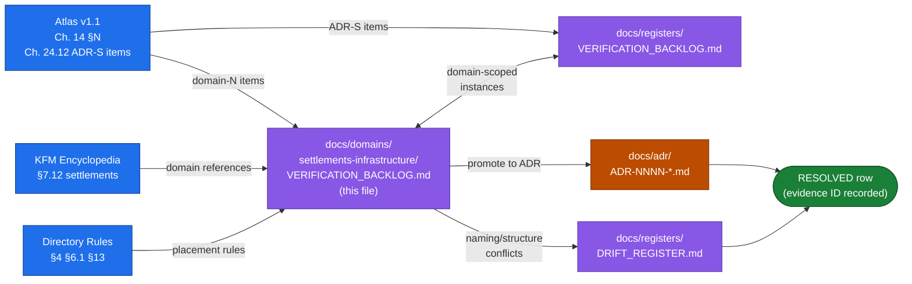

<!-- [KFM_META_BLOCK_V2]
doc_id: kfm://doc/domains/settlements-infrastructure/verification-backlog
title: Settlements / Infrastructure — Verification Backlog
type: standard
subtype: domain-register
version: v0.1
status: draft
owners:
  - Settlements/Infrastructure domain steward   # PLACEHOLDER — assign before review
  - Source steward                              # PLACEHOLDER — assign before review
  - Release steward                             # PLACEHOLDER — assign before review
  - Policy steward                              # PLACEHOLDER — assign before review
created: 2026-05-19
updated: 2026-05-19
policy_label: public
related:
  - docs/domains/settlements-infrastructure/README.md            # PROPOSED; NEEDS VERIFICATION
  - docs/runbooks/settlements-infrastructure/SOURCE_REFRESH_RUNBOOK.md  # PROPOSED; NEEDS VERIFICATION
  - docs/registers/VERIFICATION_BACKLOG.md                       # repo-wide register
  - docs/registers/DRIFT_REGISTER.md                             # PROPOSED; per Directory Rules §2.5
  - docs/doctrine/directory-rules.md                             # PROPOSED placement; NEEDS VERIFICATION
  - docs/adr/README.md                                           # PROPOSED placement; NEEDS VERIFICATION
  - docs/atlases/KFM_Domains_Culmination_Atlas_v1_1.pdf          # source — Chapter 14 §N
extends:
  - KFM Domains Culmination Atlas v1.1 — Ch. 14 Settlements / Infrastructure §N (Verification backlog and open questions)
  - KFM Domains Culmination Atlas v1.1 — Ch. 24.12 Master Open-ADR Backlog (ADR-S items)
tags: [kfm, register, verification-backlog, settlements, infrastructure, governance]
notes:
  - "This is a DOMAIN-SCOPED backlog. The repo-wide register is docs/registers/VERIFICATION_BACKLOG.md; items here either belong solely to this domain or are domain-scoped instances of repo-wide questions."
  - "No mounted repository was inspected when authoring this register. All repo-state, file-presence, route, schema, validator, fixture, workflow, dashboard, and ADR-existence claims are PROPOSED, UNKNOWN, or NEEDS VERIFICATION until checked."
  - "Doctrine claims are CONFIRMED at doctrine rank (Atlas v1.1; DOM-SETTLE; DIRRULES; ENCY; GAI). Implementation maturity is bounded per the current-session evidence limit."
  - "The domain segment spelling 'settlements-infrastructure' parallels the prior runbook. The Atlas uses 'Settlements/Infrastructure' as a slash-form display name. The reconciliation (slash vs kebab vs other) is itself a verification item — see VB-SI-21."
[/KFM_META_BLOCK_V2] -->

# Settlements / Infrastructure — Verification Backlog

Domain-scoped register of items that are **NEEDS VERIFICATION**, **PROPOSED**, **UNKNOWN**, or **open ADR-class** for the Settlements / Infrastructure lane — the items doctrine names, but a mounted repo, accepted ADRs, validators, fixtures, policy text, release manifests, or runtime evidence have not yet settled.

| Field | Value |
|---|---|
| **Document type** | Domain register (verification backlog) |
| **Authority class** | Navigational; **not** a substitute for `EvidenceBundle`, source dossiers, schemas, contracts, or ADRs |
| **Status** | `draft` — PROPOSED placement; NEEDS VERIFICATION against mounted repo |
| **Domain** | `settlements-infrastructure` (PROPOSED segment spelling — see **VB-SI-21**) |
| **Owners** | Settlements/Infrastructure steward · Source steward · Release steward · Policy steward (all PLACEHOLDER) |
| **Last updated** | 2026-05-19 |
| **Supersedes** | — (initial version) |
| **Repo-wide register** | [`docs/registers/VERIFICATION_BACKLOG.md`](../../registers/VERIFICATION_BACKLOG.md) — TODO link |

> [!IMPORTANT]
> **This register is navigational, not authoritative.** Per Atlas v1.1 non-collapse rule, registers do not substitute for evidence, policy, review state, source authority, or release state. EvidenceBundle and the governing dossiers remain authoritative. Items here surface verification work — they do not pre-decide it.

> [!WARNING]
> **Settlements / Infrastructure carries a critical-infrastructure deny lane.** Several backlog items below directly touch publication risk (precise facility geometry, condition observations, operator-sensitive details, dependency graphs). Verification work on those items must follow the deny-by-default posture; do **not** publish to resolve a backlog row. The repo-wide doctrine ladder applies: `RAW → WORK / QUARANTINE → PROCESSED → CATALOG / TRIPLET → PUBLISHED` with promotion as a governed state transition.

---

## Contents

1. [Scope and role](#1-scope-and-role)
2. [How this register relates to the repo-wide register](#2-how-this-register-relates-to-the-repo-wide-register)
3. [Resolution workflow](#3-resolution-workflow)
4. [Domain verification backlog (table)](#4-domain-verification-backlog-table)
5. [Domain-specific open questions](#5-domain-specific-open-questions)
6. [Validators, tests, and fixtures — verification status](#6-validators-tests-and-fixtures--verification-status)
7. [API and contract surfaces — verification status](#7-api-and-contract-surfaces--verification-status)
8. [ADR-class intersections (from Master Open-ADR Backlog)](#8-adr-class-intersections-from-master-open-adr-backlog)
9. [Drift candidates for this domain](#9-drift-candidates-for-this-domain)
10. [Cross-lane verification dependencies](#10-cross-lane-verification-dependencies)
11. [Changelog](#11-changelog)
12. [Related docs](#12-related-docs)

---

## 1. Scope and role

**Domain.** Settlements / Infrastructure governs `Settlement`, `Municipality`, `CensusPlace`, `Townsite`, `GhostTown`, `Fort`, `Mission`, `ReservationCommunity`, `Infrastructure Asset`, `Network Node`, `Network Segment`, `Facility`, `Service Area`, `Operator`, `Condition Observation`, and `Dependency` — and the public-safe representations of all of them. **CONFIRMED doctrine / PROPOSED field realization.** *(Atlas v1.1 Ch. 14 §B; [DOM-SETTLE])*

**Explicit non-ownership.** Roads/Rail owns transport routes; Hydrology owns water evidence; Hazards owns hazard events and warnings; People/Land owns ownership and living-person privacy. **CONFIRMED.** *(Atlas v1.1 Ch. 14 §B; [DOM-SETTLE])*

**Purpose of this register.** Track every domain-scoped item that doctrine names but the mounted repo, accepted ADRs, validators, fixtures, policy text, release manifests, runtime, or review records have not yet settled. Each row carries a stable ID (`VB-SI-NN`), a status, the evidence that would settle it, an owner role, and a resolution path. Rows are added as gaps surface and closed as evidence (or an ADR) resolves them.

> [!NOTE]
> **A closed row is not a deletion.** When a backlog item is settled, mark it **RESOLVED** in §11 (Changelog) with the resolving evidence (ADR-NNNN, schema URI, validator path, ReleaseManifest ID, ReviewRecord ID, drift register entry, or git commit). Do not delete the row; verification history is itself audit material.

[Back to top](#top)

---

## 2. How this register relates to the repo-wide register

There are two verification registers in the system:

| Register | Path (PROPOSED) | Scope | Authority |
|---|---|---|---|
| **Repo-wide** | `docs/registers/VERIFICATION_BACKLOG.md` | All domains, all responsibility roots, all cross-cutting questions | Repo-wide; named by Directory Rules §4 Step 5, §6.1 |
| **Domain-scoped (this file)** | `docs/domains/settlements-infrastructure/VERIFICATION_BACKLOG.md` | Items unique to the Settlements / Infrastructure lane, or domain-scoped instances of repo-wide questions | Navigational; cross-references repo-wide and Atlas |

**Rule of thumb.** If an item touches **only** Settlements / Infrastructure objects, sources, policy, validators, or release surfaces — it lives here. If the same question applies to ≥2 domains (e.g. the canonical schema home — `ADR-S-01`), it lives in the repo-wide register and is **referenced** here. Domain-scoped instances of repo-wide items (e.g. *"sensitivity tier scheme applied to Infrastructure Asset critical detail"*) live here with an explicit pointer back to the repo-wide row.

> [!NOTE]
> **The diagram is illustrative.** The arrows describe the intended doctrine-to-register-to-resolution flow per Atlas v1.1 + Directory Rules. The presence of the named files on disk is **NEEDS VERIFICATION** until a mounted repo confirms them.

[Back to top](#top)

---

## 3. Resolution workflow

| Step | Action | Owner | Output |
|---|---|---|---|
| 1 | Pick a backlog row; read the linked doctrine source (Atlas §, dossier, Directory Rules §). | Domain steward | Scope confirmed. |
| 2 | Identify the **evidence that would settle it** (already named per row). | Domain steward | Evidence target list. |
| 3 | Inspect the mounted repo for that evidence (file presence, schema URI, validator path, policy text, ReleaseManifest, ReviewRecord, dashboard, log). | Domain steward + relevant role | CONFIRMED / still NEEDS VERIFICATION. |
| 4 | If settled by evidence → mark **RESOLVED** in §11; cite the evidence ID. | Domain steward | Closed row. |
| 5 | If the question is **ADR-class** (Directory Rules §2.4 triggers) → open an ADR; row stays open with **ADR-PROPOSED** status until ADR is accepted. | Architecture steward | ADR-NNNN. |
| 6 | If evidence contradicts doctrine → open a row in `docs/registers/DRIFT_REGISTER.md` per Directory Rules §2.5; do **not** silently conform the register to the repo. | Docs steward | Drift entry; resolution path. |
| 7 | If the item is **policy-significant** or release-bearing (critical-infrastructure, sensitive geometry, restricted facility detail) → require ReviewRecord + PolicyDecision before any promotion. | Release steward + Policy steward | ReviewRecord; PolicyDecision. |

> [!CAUTION]
> **Do not publish to close a row.** Publication requires `ReleaseManifest` + `EvidenceBundle` + validation/policy support + review state + correction path + rollback target *(Atlas v1.1 Ch. 14 §M; [ENCY Appendix E])*. A backlog item being "closed" because the artifact went live without those gates is exactly the failure mode the doctrine forbids.

[Back to top](#top)

---

## 4. Domain verification backlog (table)

The first four rows (**VB-SI-01** … **VB-SI-04**) consolidate the Atlas v1.0 Chapter 14 §N items. Subsequent rows expand to cover the doctrine surfaces named in §C–§M of that chapter that doctrine asserts but evidence has not yet confirmed.

**Status legend.** `NEEDS VERIFICATION` — checkable; not yet checked. `PROPOSED` — design / placement not yet adopted. `UNKNOWN` — not resolvable without more evidence. `ADR-PROPOSED` — question is ADR-class; open until an accepted ADR exists. `RESOLVED` — closed; see §11 for evidence.

| # | Item to verify | Evidence that would settle it | Owner role | Status | Doctrine cite |
|---|---|---|---|---|---|
| **VB-SI-01** | Verify source rights and municipal legal-source roles for the source families listed in Ch. 14 §D (Census TIGER, GNIS, state/local GIS, municipal & local legal records, historical gazetteers, infrastructure operators, KDOT/bridge sources, FEMA). | Mounted repo files; `SourceDescriptor` entries for each named source family; current rights/terms text; source-role decisions per `kfm:source_role` vocabulary; review records for ambiguous cases. | Source steward · Domain steward | **NEEDS VERIFICATION** | Atlas v1.1 Ch. 14 §D / §N |
| **VB-SI-02** | Verify the critical-infrastructure policy: which fields and geometries fail closed at promotion; which transforms produce a public-safe derivative; what review/approval is required for a T4→T1 transition on an `Infrastructure Asset (critical)`. | `policy/sensitivity/infrastructure/*` policy text; OPA tests exercising DENY paths; `RedactionReceipt` schema; `ReviewRecord` template; ReleaseManifest examples showing denied vs generalized release. | Policy steward · Release steward · Domain steward | **NEEDS VERIFICATION** | Atlas v1.1 Ch. 14 §I / §N; Atlas Ch. 24.5 (T4 default for critical detail); ENCY §7.12 |
| **VB-SI-03** | Verify the public-safe layer registry: which Settlements / Infrastructure layers are admitted to the public MapLibre style, with what generalization, at what zoom levels, with what attribution. | `data/registry/sources/settlements-infrastructure/*` or equivalent layer registry; `LayerManifest` entries; MapLibre style hash; PMTiles digest pinning; `GeneralizationTransform` receipts. | Map / layer steward · Source steward | **NEEDS VERIFICATION** | Atlas v1.1 Ch. 14 §G / §J / §N; [MAP-MASTER] |
| **VB-SI-04** | Verify API and Focus Mode auth/policy behavior for the four named domain surfaces: feature/detail resolver, layer manifest resolver, Evidence Drawer payload, Focus Mode answer. | Route definitions in `apps/governed-api/` (or wherever the governed API lives); route-level policy hooks; `SettlementsInfrastructureDecisionEnvelope` schema; AIReceipt schema for Focus Mode; tests for ANSWER / ABSTAIN / DENY / ERROR. | API/runtime steward · Policy steward · AI surface steward | **NEEDS VERIFICATION** | Atlas v1.1 Ch. 14 §J / §N; [GAI] |
| **VB-SI-05** | Confirm the **canonical schema home** for Settlements / Infrastructure object families is `schemas/contracts/v1/settlement/` (and any adjacent `infrastructure/`, `network/`, `facility/` subtrees), per ADR-0001 or an amending ADR. | `schemas/contracts/v1/settlement/` directory listing; accepted ADR-0001 text; cross-reference from `contracts/domains/settlements-infrastructure/`. | Architecture steward · Domain steward | **NEEDS VERIFICATION** (depends on `ADR-S-01`) | Atlas Ch. 14 §J; Atlas Ch. 24.12 ADR-S-01; ENCY §7.12 |
| **VB-SI-06** | Confirm the receipt-class home for domain-specific receipts (e.g. `RedactionReceipt` for facility-geometry generalization, `AggregationReceipt` for service-area summaries) — top-level `schemas/contracts/v1/receipts/` vs per-domain `schemas/contracts/v1/settlement/receipts/`. | Accepted ADR-S-03 (or amending ADR); schema files present at the resolved path; validator coverage. | Architecture steward · Domain steward | **ADR-PROPOSED** (depends on `ADR-S-03`) | Atlas Ch. 24.12 ADR-S-03 |
| **VB-SI-07** | Verify the domain entry in the deterministic identity rule for each owned object family: `source id + object role + temporal scope + normalized digest` (Atlas v1.1 Ch. 14 §E "Main object families"). | Identity-function implementation per family; tests proving determinism across re-run; `spec_hash` round-trip on serialized identity. | Domain steward · Architecture steward | **NEEDS VERIFICATION** | Atlas v1.1 Ch. 14 §E |
| **VB-SI-08** | Verify that the five pipeline gates for this lane — RAW, WORK/QUARANTINE, PROCESSED, CATALOG/TRIPLET, PUBLISHED — each have an observable gate artifact (SourceDescriptor; ValidationReport + quarantine reason; EvidenceRef + ValidationReport + digest closure; catalog/proof closure; ReleaseManifest + correction path + rollback target). | One end-to-end run trace for a chosen source (e.g. GNIS Kansas slice) emitting all five gate artifacts; matching entries in `data/proofs/`, `data/receipts/`, `release/`. | Domain steward · Release steward | **NEEDS VERIFICATION** | Atlas v1.1 Ch. 14 §H |
| **VB-SI-09** | Confirm cross-lane relation enforcement (Roads/Rail, Hazards, Hydrology, People/Land) preserves **ownership, source role, sensitivity, and EvidenceBundle support** on every join, per Ch. 14 §F. | Cross-lane join tests; OPA policies for `most-restrictive-applicable`; fixtures demonstrating denied joins (e.g. `Infrastructure Asset × living-person parcel`). | Domain steward · Policy steward | **NEEDS VERIFICATION** (intersects `ADR-S-11` / `ADR-S-14`) | Atlas v1.1 Ch. 14 §F; Atlas Ch. 24.12 ADR-S-11/14 |
| **VB-SI-10** | Verify the **deny lane** for Indigenous / `ReservationCommunity` records: living-community privacy posture; sovereignty review path; what generalization (if any) is admitted; what is unconditionally denied. | `policy/sensitivity/people/` or `policy/sensitivity/settlement/reservation-community/` policy text; `ReviewRecord` requirements; consent / sovereignty workflow; OPA tests. | Policy steward · Domain steward · People/Land steward | **NEEDS VERIFICATION** (intersects People/Land) | Atlas v1.1 Ch. 14 §B / §I; ENCY §7.14 (people / consent) |
| **VB-SI-11** | Verify the **historic vs current** distinction for `Townsite` / `GhostTown` / `Fort` / `Mission`: which records are released at T0, which require steward review, what archaeological-context coupling triggers Archaeology's T4 sensitivity. | Object-family policy mappings; fixtures showing a historic townsite that should release at T0 and an adjacent archaeological context that must deny; cross-lane Archaeology review. | Domain steward · Archaeology steward · Policy steward | **NEEDS VERIFICATION** (intersects Archaeology) | Atlas v1.1 Ch. 14 §B / §G / §I; Atlas Ch. 15 (Archaeology) |
| **VB-SI-12** | Confirm `CensusPlace` ≠ `Municipality` — the census-vs-legal distinction is preserved at admission, normalization, catalog, and publication. No silent collapse of census-place geography into municipal legal status. | Schema constraint or validator test exercising the negative-state path; fixtures with the same name but different status; release manifests showing both released as distinct objects. | Domain steward · Architecture steward | **PROPOSED** (named in Atlas §K) | Atlas v1.1 Ch. 14 §K |
| **VB-SI-13** | Verify `Condition Observation` `observed_at` temporality: source/observed/valid/retrieval/release/correction times stay distinct where material; no implicit time-collapsing on aggregation. | Temporal-fields validator test; fixtures with material time skew; release manifests showing the time-axis preserved. | Domain steward · Architecture steward | **PROPOSED** (named in Atlas §K) | Atlas v1.1 Ch. 14 §E / §K |
| **VB-SI-14** | Verify **restricted-geometry no-leak** for critical infrastructure: exact facility geometry never appears in any public surface (tile, vector index, Evidence Drawer payload, Focus Mode answer, story export). | Side-channel audit test exercising every public surface; fixture with a known restricted asset; expected output = generalized footprint only, with `RedactionReceipt`. | Policy steward · Map / layer steward · AI surface steward | **PROPOSED** (named in Atlas §K) | Atlas v1.1 Ch. 14 §I / §K; Atlas Ch. 24.5 |
| **VB-SI-15** | Verify **catalog / proof / release closure** tests for this lane: every released artifact has a matching catalog record + EvidenceBundle + ReleaseManifest entry; orphans fail. | Closure validator; fixture of an artifact with a missing catalog row; expected output = DENY. | Architecture steward · Release steward · Domain steward | **PROPOSED** (named in Atlas §K) | Atlas v1.1 Ch. 14 §K |
| **VB-SI-16** | Verify the Focus Mode template set for this domain abstains correctly when EvidenceRef cannot resolve to EvidenceBundle, denies when policy/rights/sensitivity blocks the request, and emits an `AIReceipt` on every answer. | Focus Mode template registry; per-template ABSTAIN/DENY tests; `AIReceipt` presence rate metric for the domain. | AI surface steward · Domain steward | **NEEDS VERIFICATION** | Atlas v1.1 Ch. 14 §L; [GAI] |
| **VB-SI-17** | Verify the rollback drill for a Settlements / Infrastructure release: prior `ReleaseManifest` retained; cache invalidation steps documented; replay plan; correction notice channel. | Drill artifact (`RollbackCard`); replay run with matching `spec_hash`; correction notice on a public surface. | Release steward · Domain steward | **NEEDS VERIFICATION** | Atlas v1.1 Ch. 14 §M; ENCY Appendix E |
| **VB-SI-18** | Verify **separation of duties** at release maturity: the steward who authors the EvidenceBundle is not the steward who signs the ReleaseManifest for the critical-infrastructure tier. | `ReviewRecord` schema with author/reviewer split; CI gate denying same-actor sign-off for T2+ release. | Release steward · Policy steward | **NEEDS VERIFICATION** (intersects `ADR-S-12`) | Atlas Ch. 24.7; Atlas Ch. 24.12 ADR-S-12 |
| **VB-SI-19** | Verify **stale-state propagation** for `Condition Observation` → `Infrastructure Asset` → derived `Service Area`: when an upstream condition record ages past its review cadence, downstream surfaces carry a stale badge or refuse to answer. | Stale-state validator; fixture with an aged condition record; UI badge or Focus Mode ABSTAIN observed. | Domain steward · Map / layer steward · AI surface steward | **NEEDS VERIFICATION** (intersects `ADR-S-10`) | Atlas Ch. 24.12 ADR-S-10 |
| **VB-SI-20** | Verify per-root README presence for the domain folder itself: `docs/domains/settlements-infrastructure/README.md` exists, declares authority class, lists owned object families, lists owned source families, and lists this file in its register section. | Mounted repo file presence; Markdown-MetaBlock validator pass. | Docs steward · Domain steward | **NEEDS VERIFICATION** | Directory Rules §9; Atlas Ch. 24.11.5 |
| **VB-SI-21** | Reconcile the **domain segment spelling**. Sources observed: `settlements-infrastructure/` (this file's path; prior runbook), `settlements/` (some encyclopedia references), `Settlements/Infrastructure` (Atlas display name), `settlement/` (singular in proposed `schemas/contracts/v1/settlement/` per encyclopedia §7.12). Parallels `OPEN-ENC-04`. | Per-root README decision OR ADR (Directory Rules §6.1 / §2.4). Update Drift Register on whichever path is non-canonical. | Docs steward · Domain steward | **PROPOSED** | Directory Rules §4 Step 3, §6.1; ENCY §7.12; OPEN-ENC-04 |
| **VB-SI-22** | Confirm whether `Service Area` aggregates require an `AggregationReceipt` (and not a `RedactionReceipt`) and on which release tier the aggregate is safe. | Receipt-type decision; OPA test; ReleaseManifest example showing the aggregate plus its receipt. | Policy steward · Architecture steward · Domain steward | **PROPOSED** | Atlas v1.1 Ch. 14 §G / §I; ENCY §7.12 |
| **VB-SI-23** | Verify the **operator-sensitive details** boundary: which operator metadata is admissible (e.g. legal name, public service area) vs denied (e.g. internal contact, named individuals, vulnerability detail). | `policy/sensitivity/infrastructure/operator/*` text; OPA tests; ReleaseManifest examples. | Policy steward · Domain steward | **NEEDS VERIFICATION** | Atlas v1.1 Ch. 14 §I |
| **VB-SI-24** | Verify **dependency graph** publication posture: under what tier is a `Dependency` (e.g. *power → water treatment plant*) admissible at all; whether even the existence of the edge is restricted. | Dependency-publication policy; fixture exercising deny path; ReviewRecord trail for any admitted dependency. | Policy steward · Domain steward · Release steward | **NEEDS VERIFICATION** | Atlas v1.1 Ch. 14 §I |
| **VB-SI-25** | Verify the FEMA / hazards interface: where Settlements / Infrastructure surfaces hazard exposure, the cite resolves to the Hazards domain's EvidenceBundle, not a re-stated claim of authority by this domain. | Cross-lane evidence-cite tests; Focus Mode answer trace showing a Hazards EvidenceRef when the question is exposure-related. | Domain steward · Hazards steward · AI surface steward | **NEEDS VERIFICATION** (intersects Hazards) | Atlas v1.1 Ch. 14 §F (cross-lane: Hazards) |

[Back to top](#top)

---

## 5. Domain-specific open questions

Questions that are not yet rows in §4 because they require **decision** before they can be **verified**. Each carries an `OQ-SI-NN` ID. Promote to §4 when the decision shape is concrete enough to be checked.

| # | Question | Why it matters | Resolution path |
|---|---|---|---|
| **OQ-SI-01** | Should `Settlement` and `Municipality` share a single contract with a `legal_status` discriminator, or live as distinct contracts? | Census-vs-legal distinction is doctrine-critical (Atlas Ch. 14 §K). The contract shape affects every validator below it. | Domain ADR; verify against any pre-existing contracts in `contracts/domains/settlements-infrastructure/`. |
| **OQ-SI-02** | Is `GhostTown` a distinct object family or a `Settlement` with a `legal_status: extinct` + `temporal_scope: historical`? | Affects how the historic-townsite view (Atlas §G) is built and how Archaeology coupling is preserved. | Domain ADR. Resolve before `VB-SI-11` is settled. |
| **OQ-SI-03** | Where does `Operator` metadata live — under this domain, under People/Land (for individual operators), or split? | Operator can be an organization (this domain) or a named person (People/Land, with living-person privacy). | Cross-lane ADR with People/Land. |
| **OQ-SI-04** | What is the canonical generalization rule for **critical-infrastructure footprint** when admitted to T1? (e.g. coarse cell at fixed resolution; jittered centroid; hull at named buffer). | Affects the `RedactionReceipt` schema and reviewer load. | Policy steward decision; document the rule; codify in tests. |
| **OQ-SI-05** | Is `Fort` / `Mission` a Settlements / Infrastructure concern (built form, historic township role) or an Archaeology / Cultural Heritage concern (cultural site)? | The current Atlas assigns ownership to this domain; Archaeology cross-references. The seam needs an explicit rule for which steward signs off. | Cross-lane ADR with Archaeology. |
| **OQ-SI-06** | How does `ReservationCommunity` interact with tribal sovereignty consent: is consent recorded per record, per polygon, per source agreement, or all three? | Determines `MetaBlock v2` CARE-field requirements for this lane. | Policy steward + People/Land steward decision; ADR if scope changes. |
| **OQ-SI-07** | Does the `LayerManifest` for this domain require a `kfm:critical_asset_filter` flag (or equivalent) that public clients **must** honor? | Belt-and-braces against accidental restricted-geometry leak; complements **VB-SI-14**. | Map / layer steward decision; codify in the LayerManifest schema. |
| **OQ-SI-08** | What is the cadence for Census TIGER refresh, and how is the source-vintage preserved on every released object? | TIGER ages predictably; staleness is a publication risk. Affects source registry and source-watch cadence. | Source steward decision; document under `data/registry/sources/settlements-infrastructure/census-tiger/`. |

[Back to top](#top)

---

## 6. Validators, tests, and fixtures — verification status

The six PROPOSED validator/test groups named in Atlas v1.1 Ch. 14 §K, with their verification status. Each row in §4 may depend on one or more of these; closing a §4 row generally requires the corresponding validator to exist and pass on a real fixture.

| Validator / test | Purpose | Backlog row(s) | Status |
|---|---|---|---|
| Legal municipality evidence tests | Verify legal-status claims are supported by a `municipal_legal_record` source role + `EvidenceBundle`. | VB-SI-01, VB-SI-07 | **PROPOSED** |
| Census-vs-municipality distinction | Verify the two object families do not silently collapse on shared names. | VB-SI-12 | **PROPOSED** |
| Infrastructure topology tests | Verify `Network Node` ↔ `Network Segment` ↔ `Facility` connectivity and dangling-edge detection. | VB-SI-07, VB-SI-08 | **PROPOSED** |
| Condition `observed_at` tests | Verify the six time facets stay distinct. | VB-SI-13 | **PROPOSED** |
| Restricted-geometry no-leak tests | Side-channel audit across every public surface. | VB-SI-14 | **PROPOSED** |
| Catalog / proof / release closure tests | Orphans deny; full closure required. | VB-SI-15 | **PROPOSED** |

> [!NOTE]
> **Validators must exercise the negative state.** Per the operating contract, a validator that only checks the happy path is an anti-pattern. Every test above MUST exercise at least one **DENY** / **ABSTAIN** / **ERROR** fixture. *(Atlas Ch. 24.9; Directory Rules §13.)*

[Back to top](#top)

---

## 7. API and contract surfaces — verification status

| Surface (PROPOSED name) | DTO / schema (PROPOSED) | Outcomes | Backlog row | Status |
|---|---|---|---|---|
| Settlements / Infrastructure feature / detail resolver — route TBD | `SettlementsInfrastructureDecisionEnvelope` | ANSWER / ABSTAIN / DENY / ERROR | VB-SI-04 | PROPOSED; exact route UNKNOWN |
| Settlements / Infrastructure layer manifest resolver | `LayerManifest` / domain layer descriptor | ANSWER / DENY / ERROR | VB-SI-03, VB-SI-04 | PROPOSED; public-safe only |
| Settlements / Infrastructure Evidence Drawer payload | `EvidenceDrawerPayload` + `EvidenceBundle` projection | ANSWER / ABSTAIN / DENY / ERROR | VB-SI-04, VB-SI-14 | PROPOSED; evidence- and policy-filtered |
| Settlements / Infrastructure Focus Mode answer | Runtime Response Envelope + `AIReceipt` | ANSWER / ABSTAIN / DENY / ERROR | VB-SI-04, VB-SI-16 | PROPOSED; AI never root truth |
| Schema responsibility root | `schemas/contracts/v1/settlement/` (PROPOSED) | finite validator outcomes | VB-SI-05 | NEEDS VERIFICATION (depends on `ADR-S-01`) |

*(Source: Atlas v1.1 Ch. 14 §J; [DIRRULES] §4 Step 3; ENCY §7.12.)*

[Back to top](#top)

---

## 8. ADR-class intersections (from Master Open-ADR Backlog)

These rows from the repo-wide Master Open-ADR Backlog (Atlas v1.1 Ch. 24.12 — `ADR-S-NN`) intersect this domain. They are tracked in the **repo-wide** `docs/registers/VERIFICATION_BACKLOG.md`; the table below records **how each one lands** for Settlements / Infrastructure.

| ADR-S | Question | Domain-scoped implication | Status |
|---|---|---|---|
| **ADR-S-01** | Confirm/amend `schemas/contracts/v1/...` as canonical schema home. | Determines whether `schemas/contracts/v1/settlement/` (and adjacent `infrastructure/`, `network/`) is canonical. | ADR-PROPOSED → blocks VB-SI-05 |
| **ADR-S-02** | Doctrine artifact placement under `docs/` (`dossiers/` vs `atlases/` vs `domains/`). | Determines whether per-domain doctrine artifacts live under `docs/domains/<domain>/` (this file's home) or elsewhere. | ADR-PROPOSED → adjacent to VB-SI-20, VB-SI-21 |
| **ADR-S-03** | Receipt-class home: top-level `schemas/contracts/v1/receipts/` vs per-domain `schemas/contracts/v1/<domain>/receipts/`. | Determines where `RedactionReceipt` / `AggregationReceipt` for this lane live. | ADR-PROPOSED → blocks VB-SI-06 |
| **ADR-S-04** | Source-role enum vocabulary. | The "as source role requires" pattern in Atlas Ch. 14 §D (`authority / observation / context / model`) depends on this vocabulary being canonical. | ADR-PROPOSED → blocks VB-SI-01 |
| **ADR-S-05** | Sensitivity tier scheme (T0–T4). | Pins `Infrastructure Asset (critical)` to **T4 default** for critical detail, **T1** for generalized footprint *(Atlas Ch. 24.5 row "Settlements / Infrastructure — critical assets")*. | ADR-PROPOSED → blocks VB-SI-02, VB-SI-14, VB-SI-23 |
| **ADR-S-08** | Frontier Matrix cell semantics. | Settlements / Infrastructure feeds the matrix; cell semantics determine how settlement-condition releases roll up. | ADR-PROPOSED → adjacent |
| **ADR-S-09** | Reviewer separation-of-duties threshold. | Determines when same-actor sign-off is denied for this lane (likely T2+ critical-infra). | ADR-PROPOSED → blocks VB-SI-18 |
| **ADR-S-10** | Stale-state propagation. | Drives `Condition Observation` → `Infrastructure Asset` → derived layers staleness. | ADR-PROPOSED → blocks VB-SI-19 |
| **ADR-S-11** | Cross-lane join policy (`most-restrictive-applicable` default). | Governs joins with Hazards, Hydrology, Roads/Rail, People/Land. | ADR-PROPOSED → blocks VB-SI-09 |
| **ADR-S-12** | Two-person-rule scope for T3/T4 promotion. | Applies directly to critical-infrastructure release. | ADR-PROPOSED → blocks VB-SI-18 |
| **ADR-S-14** | Cross-lane join policy (deny / steward review / open). | Same join surface as ADR-S-11; needs unification or explicit split. | ADR-PROPOSED → blocks VB-SI-09 |

> [!NOTE]
> **ADR-S items live in the repo-wide register**; this table records their domain landing only. The authoritative status is whatever appears in `docs/registers/VERIFICATION_BACKLOG.md` and `docs/adr/`.

[Back to top](#top)

---

## 9. Drift candidates for this domain

When mounted-repo evidence contradicts the doctrine claims above, **do not silently conform** the register — open a row in `docs/registers/DRIFT_REGISTER.md` per Directory Rules §2.5. Candidates likely to surface for this domain:

| Candidate drift | Affected paths (PROPOSED) | Trigger |
|---|---|---|
| Domain segment spelling (`settlements-infrastructure/` vs `settlements/` vs `settlement/`) | `docs/domains/<seg>/`, `contracts/domains/<seg>/`, `schemas/contracts/v1/<seg>/`, `policy/domains/<seg>/`, `tests/domains/<seg>/`, `data/<phase>/<seg>/`, `release/candidates/<seg>/` | Different repo subtrees use different spellings — see **VB-SI-21** |
| Per-domain VERIFICATION_BACKLOG location | `docs/domains/settlements-infrastructure/VERIFICATION_BACKLOG.md` (this file) vs single repo-wide register | Resolved if **ADR-S-02** lands on per-domain placement |
| Critical-infrastructure policy home | `policy/sensitivity/infrastructure/` (encyclopedia §7.12) vs `policy/domains/settlements-infrastructure/sensitivity/` (Directory Rules §4 Step 3 implied) | Either is admissible under §3 responsibility roots; an ADR pins one |
| Receipt schema home for `RedactionReceipt` (this lane) | `schemas/contracts/v1/receipts/` vs `schemas/contracts/v1/settlement/receipts/` | Resolved by **ADR-S-03** |
| Single-file domain folder | If `docs/domains/settlements-infrastructure/` only contains this file + a README | Directory Rules §3 anti-pattern; expand the folder or relocate the file |

[Back to top](#top)

---

## 10. Cross-lane verification dependencies

| Cross-lane | Settlements / Infrastructure depends on | Their lane depends on us | Backlog row |
|---|---|---|---|
| **Roads / Rail** | `RoadSegment` / `RailSegment` evidence for *depot, bridge, crossing, transport facility* relations. | None outbound from us. | VB-SI-09 |
| **Hazards** | `HazardEvent` / `DisasterDeclaration` evidence for *exposure, resilience, warnings, declarations* relations. | We cite Hazards; we do not assert hazard authority. | VB-SI-09, VB-SI-25 |
| **Hydrology** | `HUC` / `NFHL zone` / `GaugeSite` for *water, wastewater, stormwater, floodplain, drainage* relations. | None outbound from us. | VB-SI-09 |
| **People / Land** | Living-person privacy rule; consent posture; parcel-ownership semantics. | We must not leak living-person joins via `Operator` or `Service Area`. | VB-SI-09, VB-SI-10, OQ-SI-03 |
| **Archaeology** | Cultural-context sensitivity for historic townsites; sovereignty review for sites adjacent to settlement evidence. | None outbound from us. | VB-SI-11, OQ-SI-05 |

*(Source: Atlas v1.1 Ch. 14 §F; Ch. 24.4 Cross-Lane Relation Atlas.)*

[Back to top](#top)

---

## 11. Changelog

| Date | Change | Author role | Resolving evidence |
|---|---|---|---|
| 2026-05-19 | Initial register populated from Atlas v1.1 Ch. 14 §N (rows VB-SI-01 … VB-SI-04) and expanded to cover §C–§M of the same chapter (rows VB-SI-05 … VB-SI-25). Open questions OQ-SI-01 … OQ-SI-08 surfaced. ADR-S intersections recorded. | Docs steward (PLACEHOLDER) | This commit |

> [!NOTE]
> **Closure entries** belong here. When a row in §4 is settled, append a Changelog row naming the row ID, the evidence that settled it, and the date. Do not delete the §4 row; mark it **RESOLVED** in place and link to the Changelog entry.

[Back to top](#top)

---

## 12. Related docs

<strong>Domain docs (Settlements / Infrastructure)</strong>

- `docs/domains/settlements-infrastructure/README.md` — domain landing page (PROPOSED; NEEDS VERIFICATION; **see VB-SI-20**)
- `docs/runbooks/settlements-infrastructure/SOURCE_REFRESH_RUNBOOK.md` — operational refresh procedure (PROPOSED; NEEDS VERIFICATION)
- `contracts/domains/settlements-infrastructure/` — object meaning per Directory Rules §4 Step 3 (PROPOSED)
- `schemas/contracts/v1/settlement/` — machine-checkable shape (PROPOSED; **depends on ADR-S-01**)
- `policy/sensitivity/infrastructure/` — critical-infrastructure policy (PROPOSED per ENCY §7.12)
- `tests/domains/settlements-infrastructure/` — enforceability proof (PROPOSED)
- `fixtures/domains/settlements-infrastructure/` — golden / valid / invalid (PROPOSED)

<strong>Doctrine and repo-wide registers</strong>

- `docs/doctrine/directory-rules.md` — placement and lifecycle doctrine *(canonical)*
- `docs/registers/VERIFICATION_BACKLOG.md` — repo-wide register (PROPOSED placement per Directory Rules §6.1)
- `docs/registers/DRIFT_REGISTER.md` — drift entries per Directory Rules §2.5 (PROPOSED placement)
- `docs/adr/` — ADRs, including `ADR-S-NN` items intersecting this register
- `docs/atlases/KFM_Domains_Culmination_Atlas_v1_1.pdf` — Atlas v1.1, Ch. 14 §N (source for VB-SI-01 … VB-SI-04) and Ch. 24.12 (Master Open-ADR Backlog) (PROPOSED placement; **VB-11-02** at the Atlas level)

<strong>External standards (informational; not authoritative for KFM doctrine)</strong>

- W3C PROV-O — lineage of `EvidenceBundle` derivation steps
- ISO 19115 — geographic metadata for source families in §D of the Atlas chapter
- STAC — catalog projection for layer manifests
- OGC API — Tiles / PMTiles v3 — public-safe map serving
- DCAT — distribution-level metadata

> [!NOTE]
> External standards inform technical accuracy; they do not override KFM doctrine. Where an external spec and KFM doctrine diverge, the divergence is itself a verification item (file under `docs/registers/DRIFT_REGISTER.md`, not silently aligned to either side).

---

**Last updated:** 2026-05-19 · **Authority class:** navigational · **Doctrine cite:** Atlas v1.1 Ch. 14 §N; Ch. 24.12; Directory Rules §4 / §6.1 / §13; [DOM-SETTLE]; [ENCY] §7.12; [GAI]

[↑ Back to top](#top)
