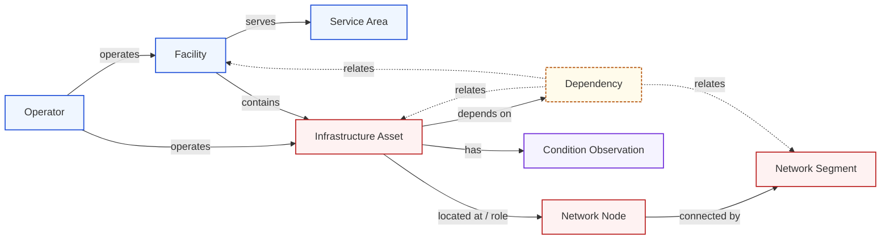

<!-- [KFM_META_BLOCK_V2]
doc_id: kfm://doc/settlements-infrastructure/sublanes/infrastructure
title: Infrastructure Sublane — Settlements / Infrastructure
type: domain-sublane
version: v1
status: draft
owners: TBD (Settlements/Infrastructure steward + Infrastructure reviewer)
created: 2026-05-19
updated: 2026-05-19
policy_label: mixed (T0 manifest / T1 generalized / T2 reviewer / T4 critical-asset deny)
related:
  - docs/domains/settlements-infrastructure/README.md
  - docs/domains/settlements-infrastructure/sublanes/settlements.md
  - docs/domains/roads-rail-trade/sublanes/roads.md
  - docs/doctrine/directory-rules.md
  - docs/doctrine/lifecycle-law.md
  - docs/doctrine/trust-membrane.md
  - docs/architecture/contract-schema-policy-split.md
  - docs/standards/PROV.md
tags: [kfm, domain, sublane, infrastructure, critical-infrastructure, deny-by-default]
notes:
  - Sublane subdivision is PROPOSED; ratification via parent README or ADR pending.
  - Critical-asset detail and condition/vulnerability fields default to T4.
[/KFM_META_BLOCK_V2] -->

# Infrastructure Sublane — Settlements / Infrastructure

> **PROPOSED dossier covering the Infrastructure half of the Settlements / Infrastructure domain — assets, networks, facilities, service areas, operators, condition observations, and dependencies. This sublane carries the strictest deny-by-default sensitivity posture in the parent domain.**


-red)


**Status:** Draft · **Owners:** TBD (Settlements/Infrastructure steward + Infrastructure reviewer) · **Updated:** 2026-05-19

---

## Contents

1. [Sublane in context](#1-sublane-in-context)
2. [Scope and boundary](#2-scope-and-boundary)
3. [Ubiquitous language](#3-ubiquitous-language)
4. [Key source families](#4-key-source-families)
5. [Object families](#5-object-families)
6. [Pipeline shape](#6-pipeline-shape)
7. [Sensitivity, rights, and publication posture](#7-sensitivity-rights-and-publication-posture)
8. [API, contract, and schema surfaces](#8-api-contract-and-schema-surfaces)
9. [Validators, tests, fixtures](#9-validators-tests-fixtures)
10. [Governed AI behavior](#10-governed-ai-behavior)
11. [Cross-sublane and cross-lane relations](#11-cross-sublane-and-cross-lane-relations)
12. [Map and viewing products](#12-map-and-viewing-products)
13. [Open questions and verification backlog](#13-open-questions-and-verification-backlog)
14. [Related docs](#14-related-docs)

---

## 1. Sublane in context

This file documents the **Infrastructure sublane** — the slice of the **Settlements / Infrastructure** domain that owns evidence and released derivatives for **physical infrastructure assets, the networks they form, the facilities that anchor them, the service areas they cover, the operators that run them, and the condition observations and dependency relations recorded against them.** The sister sublane — `settlements.md` (PROPOSED filename) — owns settlements, municipalities, census places, historic townsites, ghost towns, forts, missions, and reservation communities. Both sublanes share the same parent dossier, the same source-role doctrine, and the same lifecycle invariant. **[CONFIRMED parent-domain scope from [DOM-SETTLE] [ENCY]; PROPOSED sublane subdivision.]**

> [!IMPORTANT]
> **The `sublanes/` subdirectory is PROPOSED structure, not Directory Rules canon.**
> Directory Rules §3–§4 prescribe `docs/domains/<domain>/` as the dossier home and confirm `settlements-infrastructure` as the canonical domain segment slug, but do **not** define a `sublanes/` subdirectory pattern. This file proceeds on the assumption that subdividing a compound bounded context into named sublanes is a reasonable organizational choice, mirroring the same pattern used in `docs/domains/roads-rail-trade/sublanes/roads.md` and `docs/domains/geology/sublanes/natural_resources.md` (both CONFIRMED authored, PROPOSED placement). The subdivision should be ratified by either the parent dossier README or a small ADR before `sublanes/` is treated as canonical. Until then, treat the path `docs/domains/settlements-infrastructure/sublanes/infrastructure.md` as **PROPOSED / NEEDS VERIFICATION**. [DIRRULES]

### 1.1 Why an Infrastructure sublane

The parent domain — Settlements / Infrastructure — bundles two distinct authority regimes inside one bounded context. **Settlements** are inhabited places; their sources are dominated by census, gazetteer, municipal-legal, and historical-record families; their default sensitivity is generally low. **Infrastructure** is the physical and operational fabric — bridges, dams, levees, water and wastewater systems, utilities, communications, facilities, condition and inspection records — and its default sensitivity is the strictest in the entire domain: critical-asset detail and condition/vulnerability default to **tier T4 (denied)** per the Master Sensitivity / Rights Tier Reference. [DOM-SETTLE §I] [ENCY §24.5]

Keeping these two regimes in one undifferentiated dossier blurs the most important sensitivity boundary the domain enforces: the same release machinery that publishes a town's census polygon must **fail closed** when asked for a critical asset's exact geometry or a bridge's condition rating. The sublane split is the docs-side reflection of that policy-side separation.

---

## 2. Scope and boundary

### 2.1 What this sublane owns

CONFIRMED scope (from parent atlas) / PROPOSED sublane attribution: [DOM-SETTLE §B] [ENCY]

- **Infrastructure Asset** — a physical asset (e.g., bridge, dam, levee, pump station, treatment plant, tower, substation) with identity, location, and operator, governed by source role and sensitivity.
- **Network Node** — a node within an infrastructure network (e.g., junction, valve, switch).
- **Network Segment** — a segment connecting two Network Nodes (e.g., pipe, line, conductor).
- **Facility** — an operational complex co-locating multiple assets (e.g., wastewater treatment facility, dam complex).
- **Service Area** — the polygon or aggregate footprint a facility, system, or operator serves, time-scoped.
- **Operator** — the public, private, or tribal entity that owns or operates assets, networks, or facilities.
- **Condition Observation** — an observed condition, inspection, or status reading attached to an asset.
- **Dependency** — a directed reliance relation (e.g., a wastewater system depending on a power feed).

### 2.2 What this sublane does NOT own

CONFIRMED non-ownership (from parent atlas) / PROPOSED cross-sublane handoffs: [DOM-SETTLE §B] [ENCY]

| Concern | Owning lane / sublane | Cross-edge type |
|---|---|---|
| Inhabited places, municipal legal status, historic townsites, forts, missions, reservation communities | **Settlements** sublane (sibling) | residence, exposure, parcel context |
| Road and rail transport routes | **Roads / Rail** lane (`roads-rail-trade`) | depot, bridge, crossing, transport facility relation |
| Water evidence — flow, gauges, regulatory flood layers, water quality observations | **Hydrology** lane | water, wastewater, stormwater, floodplain, drainage |
| Hazard events, warnings, declarations | **Hazards** lane | exposure, resilience, warnings, declarations |
| Parcel ownership, living-person privacy | **People / DNA / Land** lane | parcel and operator-as-person constraints |
| Archaeological context for historic infrastructure | **Archaeology** lane | cultural context with sensitivity firewall |

> [!NOTE]
> **Bridges, dams, levees, and water utilities sit at the most fragile cross-lane boundary in KFM.** A bridge is simultaneously a transport facility (Roads/Rail), an infrastructure asset (this sublane), an exposure surface (Hazards), and possibly a flood-relevant structure (Hydrology). The rule is **single-ownership-with-relations**: this sublane owns the **asset identity, operator, condition, and dependencies**; cross-lane relations carry the rest without duplicating canonical truth. [DOM-SETTLE §F] [ENCY]

---

## 3. Ubiquitous language

CONFIRMED terms / PROPOSED field realization. Each term carries the same meaning constraint as in the parent atlas: meaning is constrained by source role, evidence, time, and release state. [DOM-SETTLE §C] [ENCY]

| Term | Meaning within this sublane | Citation |
|---|---|---|
| **Infrastructure Asset** | A physical asset record with identity, location, operator, and source role; never a route. | [DOM-SETTLE] [ENCY] |
| **Network Node** | A point in an asset network with identity and connectivity, distinct from a transport node. | [DOM-SETTLE] [ENCY] |
| **Network Segment** | A connecting segment between two Network Nodes; never a road or rail segment (those belong to Roads/Rail). | [DOM-SETTLE] [ENCY] |
| **Facility** | An operational complex grouping co-located assets under one operator and service mission. | [DOM-SETTLE] [ENCY] |
| **Service Area** | The polygon or aggregate footprint served by a Facility, system, or Operator, time-scoped. | [DOM-SETTLE] [ENCY] |
| **Operator** | The party that owns or operates an asset / facility / network; carries rights and sensitivity attributes. | [DOM-SETTLE] [ENCY] |
| **Condition Observation** | A time-scoped observation about an asset (inspection result, status, vulnerability rating). | [DOM-SETTLE] [ENCY] |
| **Dependency** | A directed asset-to-asset, asset-to-facility, or asset-to-network reliance relation. | [DOM-SETTLE] [ENCY] |
| **Source role** | One of authority / observation / context / model; never inferred from convenience. | [UNIFIED §3.7] [ENCY] |
| **EvidenceBundle** | The cross-cutting evidence object that supports every claim this sublane releases. | [ENCY] |
| **ReleaseManifest** | The release-state record that must exist for any PUBLISHED artifact. | [DIRRULES] [ENCY] |

> [!WARNING]
> **Source-role anti-collapse.** An operator's self-published asset inventory is **observation**, not legal authority. KDOT bridge condition ratings are **authority** for the bridge condition vocabulary, **observation** for any specific bridge at any specific time. Compliance data (e.g., EPA ECHO) is **authority** for compliance status, **observation** for facility activity, **never** authority for facility identity. The rule applies at every record. [UNIFIED §3.7] [ENCY]

---

## 4. Key source families

PROPOSED source-family inventory for this sublane. Rights, current terms, and operational freshness are NEEDS VERIFICATION until the source registry is mounted and reviewed. [DOM-SETTLE §D] [ENCY]

| Source family | Role(s) | Default tier | Sensitivity / rights | Notes |
|---|---|---|---|---|
| **USACE National Inventory of Dams (NID)** | authority (dam catalog) / observation (status) | T1 generalized; **T4** for dam-failure inundation fields | Generally CC0 metadata; sensitive fields explicitly restricted | High-hazard precise geometry and dam-failure inundation are classified restricted-precise. [Atlas KFM-P2-IDEA-0026] |
| **USACE National Levee Database (NLD)** | authority (levee system catalog) / observation (system status) | T1 generalized; T2–T4 for sensitive fields | REST/JSON or ESRI/OGC services; vertical Z and linear M measures per NLD data dictionary | Public-safe summaries; precise condition restricted. [Atlas KFM-P2-PROG-0008] |
| **KDOT / Kansas bridge inventory and facility sources** | authority (bridge inventory) / observation (condition) | T1 generalized footprint; **T4** condition detail | License / current terms NEEDS VERIFICATION | Bridge identity also surfaces in Roads/Rail as transport facility; ownership of the **asset identity** stays here. [DOM-SETTLE §D] |
| **EPA ECHO compliance** | authority (compliance status) / observation (inspection/enforcement) | T0 aggregate; T2–T3 for derived facility-level products | Public via REST; misattribution carries legal / reputational risk; supersedes tracking essential | Compliance is occasionally revised retroactively; do not present derived per-facility scores without policy review. [Atlas EPA ECHO card] |
| **EPA TRI (Toxics Release Inventory) via Envirofacts** | observation (release events) | T0 aggregate; T2 for derived per-facility products | Public API; auth/form NEEDS VERIFICATION | Derived per-facility scoring is a sensitivity-policy question even though base data is public. |
| **Kansas WIMAS / WWC5 (water systems)** | authority / observation | T1 aggregate; **T4** for vulnerable details | Source terms NEEDS VERIFICATION | Kansas-specific water-systems inventory. [Atlas KFM-P2-PROG-0009] |
| **Infrastructure operators and providers (utilities, municipalities, tribal authorities, private operators)** | authority for own assets / observation for activity | T2 default; **T4** for vulnerability / dependency | Per-operator agreement required; sensitive joins fail closed | Operator-as-source role must be explicit. |
| **State / local GIS — Kansas Geoportal-style sources** | observation / context (aggregator) | T0 aggregate; T2 detail | Per-layer license; aggregator role is not authority role | Do not infer source role from convenience. [UNIFIED §3.7] |
| **FEMA / hazards / resilience sources** | context (regulatory) / observation | T0 regulatory layers; **T4** dam-failure / levee-failure exposure detail | FEMA NFHL public; NLD/NID sensitivity per above | Regulatory products are **context**, not observed inundation. [DOM-SETTLE §D] [Atlas KFM-P2-IDEA-0026] |

> [!CAUTION]
> Source rights for **every** family in this sublane remain `NEEDS VERIFICATION` until the source registry, license map, and operator-agreement set are mounted and reviewed. Connectors and watchers stay inactive until SourceActivationDecisions are recorded. [UNIFIED §3.6]

---

## 5. Object families

CONFIRMED object-family list from parent atlas / PROPOSED detailed shapes. Each object follows the parent-domain temporal-handling rule: source, observed, valid, retrieval, release, and correction times stay distinct where material; identity is deterministic on source id + object role + temporal scope + normalized digest. [DOM-SETTLE §E] [ENCY]

| Object | Purpose | Identity rule (PROPOSED) | Notes |
|---|---|---|---|
| **Infrastructure Asset** | Physical asset evidence or released derivative. | source id + asset role + temporal scope + digest | T4 default for critical detail; T1 generalized footprint with redaction receipt. |
| **Network Node** | Node within an asset network. | source id + node role + temporal scope + digest | Topology-bearing; connectivity governed by `Network Segment` records. |
| **Network Segment** | Connecting segment between two Network Nodes. | source id + segment role + temporal scope + digest | Not a transport segment. |
| **Facility** | Operational complex grouping co-located assets. | source id + facility role + temporal scope + digest | Many-to-one with Asset; many-to-many with Operator under time scope. |
| **Service Area** | Polygon / aggregate footprint served by a Facility, system, or Operator. | source id + service-area role + temporal scope + digest | Time-scoped; aggregations preferred over precise geometry where sensitivity permits. |
| **Operator** | Party owning or operating asset / network / facility. | source id + operator role + temporal scope + digest | Sensitivity rises when operator identity intersects living-person privacy (cross-edge to People/Land). |
| **Condition Observation** | Time-scoped condition / inspection / status attached to an asset. | source id + observation role + asset ref + observed_at + digest | T4 default for vulnerability / condition fields. |
| **Dependency** | Directed reliance relation. | source id + relation role + (from, to) refs + temporal scope + digest | T4 default; aggregate / coarse-graph summaries can promote to T1 via review. |

### 5.1 Object-network diagram



*Illustrative — PROPOSED relation vocabulary; canonical relation names live in `contracts/domains/settlements-infrastructure/` (PROPOSED path).* [DIRRULES §3]

[↑ Back to top](#infrastructure-sublane--settlements--infrastructure)

---

## 6. Pipeline shape

CONFIRMED doctrine / PROPOSED lane application: the sublane follows the KFM lifecycle invariant **RAW → WORK / QUARANTINE → PROCESSED → CATALOG / TRIPLET → PUBLISHED**, with promotion as a governed state transition, **not a file move**. [DIRRULES §0] [DOM-SETTLE §H] [ENCY]

| Stage | Handling | Gate | Status |
|---|---|---|---|
| **RAW** | Capture immutable source payload or reference with source role, rights, sensitivity, citation, time, and hash. | `SourceDescriptor` exists. | PROPOSED |
| **WORK / QUARANTINE** | Normalize schema, geometry, time, identity, evidence, rights, and policy; hold failures. | Validation and policy gate pass, or quarantine reason recorded. | PROPOSED |
| **PROCESSED** | Emit validated normalized objects, receipts, and public-safe candidates. | `EvidenceRef`, `ValidationReport`, and digest closure exist. | PROPOSED |
| **CATALOG / TRIPLET** | Emit catalog records, EvidenceBundles, graph/triplet projections, and release candidates. | Catalog / proof closure passes. | PROPOSED |
| **PUBLISHED** | Serve released public-safe artifacts through governed APIs and manifests. | `ReleaseManifest`, correction path, rollback target, and review/policy state exist. | PROPOSED |

> [!IMPORTANT]
> **First slice rule (PROPOSED).** The first slice in this sublane is **schema-and-fixture-first** — source descriptors, deterministic identity, validators, deny policies, no-network fixtures, and proof-pack / promotion fixtures land **before** live source activation. Critical-infrastructure source families (NLD, NID, KDOT condition) MUST move past PROPOSED only after deny-tests for vulnerability-field leak prove their gates. [UNIFIED §6.9]

---

## 7. Sensitivity, rights, and publication posture

This is the defining section of the sublane. The infrastructure side of the parent domain carries KFM's strictest sensitivity matrix outside Archaeology and People/DNA. [DOM-SETTLE §I] [ENCY §24.5]

### 7.1 Default tier matrix (PROPOSED)

| Object / field class | Default tier | Allowed transforms (PROPOSED) | Required gates | Citation |
|---|---|---|---|---|
| Infrastructure Asset — generalized footprint, public identifier | **T0–T1** | Standard release; generalization receipt where geometry coarsened. | `ReleaseManifest` + `ReviewRecord`. | [DOM-SETTLE] [ENCY §24.5] |
| Infrastructure Asset — **critical asset detail** | **T4** | Generalized facility footprint + suppressed dependency → T1. | Steward review + `RedactionReceipt`. | [ENCY §24.5.2] |
| Infrastructure Asset — **condition / vulnerability** | **T4** | T3 to named authorities only; **never** T0 / T1. | Steward review + named-party agreement. | [ENCY §24.5.2] |
| Condition Observation — public-safe summary | **T1** | Aggregation / temporal-bucket / status-only summarization. | `AggregationReceipt` + `ReviewRecord`. | [DOM-SETTLE] |
| Dependency — coarse summary | **T1** | Aggregate or coarse-graph; suppress sensitive endpoints. | `RedactionReceipt` + `ReviewRecord`. | [DOM-SETTLE] |
| Dependency — full edge with sensitive endpoint | **T4** | None to T0; T3 only under named agreement. | Steward review + `PolicyDecision`. | [DOM-SETTLE] |
| Operator — public name | **T0** | Standard release. | `ReleaseManifest`. | [DOM-SETTLE] |
| Operator — operator-as-person / living-person fields | **T4** | Aggregate to operator-class or de-identify per People/Land rules. | Cross-edge to People/Land gates. | [DOM-PEOPLE] [DOM-SETTLE] |
| Service Area — aggregate footprint | **T0–T1** | Standard release; generalization where exposure-sensitive. | `ReleaseManifest`. | [DOM-SETTLE] |
| Facility — exact geometry for vulnerable facility classes | **T4** | Generalized footprint → T1; staged access → T2. | Steward review + `RedactionReceipt`. | [DOM-SETTLE] |

### 7.2 Deny-by-default invariants

> [!CAUTION]
> The following are **fail-closed** invariants. They are not configurable from the public path. Any apparent override surfaces as a drift entry and a deny on the runtime path. [ENCY] [DIRRULES]
>
> 1. **Unclear rights** block public promotion. No exception.
> 2. **Unresolved source role** blocks public promotion.
> 3. **Missing EvidenceBundle support** blocks public promotion.
> 4. **Unresolved sensitivity classification** blocks public promotion.
> 5. **Absent ReleaseManifest** blocks public surfacing.
> 6. **No transform** permits release of full condition / vulnerability detail to T0 / T1.
> 7. **KFM is not an emergency-alert authority.** The Hazards lane upholds this boundary forever; this sublane mirrors it for any condition observation that could be read as a live-warning surface. [DOM-HAZ] [ENCY §24.5.2]

### 7.3 Tier transitions

Tier motion follows the cross-cutting Tier Transitions table. The rows applicable to this sublane: [ENCY §24.5.3]

| From → To | Required artifact | Reviewer | Reversibility |
|---|---|---|---|
| T4 → T3 | `PolicyDecision` + `ReviewRecord` + named agreement | Steward + rights-holder | Reversible via agreement revocation → T4 with `CorrectionNotice`. |
| T4 → T2 | `PolicyDecision` + `ReviewRecord` | Steward | Reversible via review revocation. |
| T4 → T1 | `RedactionReceipt` + `ReviewRecord` | Steward | Reversible; correction may demote a published T1 back to T4. |
| T1 → T0 | `ReleaseManifest` + `ReviewRecord` | Steward + release authority | Reversible via `RollbackCard`. |

[↑ Back to top](#infrastructure-sublane--settlements--infrastructure)

---

## 8. API, contract, and schema surfaces

PROPOSED interfaces. Exact route names, DTO shapes, schema home, and runtime behavior are **NEEDS VERIFICATION** until repo mount. [DOM-SETTLE §J] [DIRRULES]

| Endpoint or artifact | DTO / schema (PROPOSED) | Outcomes | Status |
|---|---|---|---|
| Infrastructure feature / detail resolver — route TBD | `SettlementsInfrastructureDecisionEnvelope` (sublane-scoped) | `ANSWER` / `ABSTAIN` / `DENY` / `ERROR` | PROPOSED governed API surface; exact route UNKNOWN. |
| Infrastructure layer manifest resolver | `LayerManifest` / domain layer descriptor | `ANSWER` / `DENY` / `ERROR` | PROPOSED; public-safe release only. |
| Evidence Drawer payload | `EvidenceDrawerPayload` + `EvidenceBundle` projection | `ANSWER` / `ABSTAIN` / `DENY` / `ERROR` | PROPOSED; evidence and policy filtered. |
| Focus Mode answer (Governed AI) | `RuntimeResponseEnvelope` + `AIReceipt` | `ANSWER` / `ABSTAIN` / `DENY` / `ERROR` | PROPOSED; AI never root truth. |
| Critical-asset deny lane | `DecisionEnvelope` with `DENY` + reason code | `DENY` | PROPOSED; **fail-closed** invariant. |
| Schema responsibility root | `schemas/contracts/v1/domains/settlements-infrastructure/...` (PROPOSED per Directory Rules §3 Step 3) | finite validator outcomes | PROPOSED; ADR-0001 / ADR-S-01 governs schema home. [DIRRULES §2.4(3)] |

> [!NOTE]
> Public clients reach this sublane **only** through `apps/governed-api/` (the trust membrane). They never read `data/raw`, `data/work`, `data/quarantine`, or `data/catalog` directly. The watcher-as-non-publisher invariant holds: watchers emit receipts and candidate decisions; **only** the release authority publishes. [DIRRULES §7.1] [UNIFIED]

---

## 9. Validators, tests, fixtures

PROPOSED validator / test inventory. Sublane-scoped slices of the parent atlas's K-section list. [DOM-SETTLE §K] [ENCY]

- **Infrastructure topology tests** — validate Node / Segment connectivity, no orphan segments, deterministic topology digest.
- **Condition `observed_at` tests** — every Condition Observation carries a distinct observed time; retrieval and release times are not conflated.
- **Restricted geometry no-leak tests** — exact geometry for T4-default classes must not appear in any T0 / T1 release; tile-build outputs are scanned.
- **Dependency-edge sensitivity tests** — full Dependency edges with sensitive endpoints fail closed on any public path.
- **Critical-asset deny-lane tests** — Focus Mode and detail resolver must return `DENY` for T4-default classes absent a named-party agreement.
- **Catalog / proof / release closure tests** — every CATALOG record carries an EvidenceBundle digest closure; every ReleaseManifest names a rollback target.
- **Source-role anti-collapse tests** — operator-self-published inventory cannot be coerced into an "authority" role through PR or fixture.
- **Bridge dual-ownership tests** — bridge records preserve dual identity (Settlements/Infrastructure for asset, Roads/Rail for transport facility) without divergence or duplication.

Fixture home: `fixtures/domains/settlements-infrastructure/infrastructure/` (PROPOSED per Directory Rules §3 Step 3). [DIRRULES]

---

## 10. Governed AI behavior

CONFIRMED doctrine / PROPOSED implementation: AI may summarize **released** infrastructure EvidenceBundles, compare evidence across releases, explain limitations, and draft steward-review notes. AI **MUST ABSTAIN** when evidence is insufficient. AI **MUST DENY** where policy, rights, sensitivity, or release state blocks the request. AI never reads RAW or WORK content. Every Focus Mode answer carries an `AIReceipt`. [GAI] [DOM-SETTLE §L] [ENCY]

> [!WARNING]
> **AI is interpretive, not root truth.** The EvidenceBundle outranks any generated language. For this sublane specifically, AI MUST DENY any request to:
>
> - reveal precise geometry of a T4 critical asset,
> - combine generalized footprints into a synthesized higher-precision answer,
> - describe a condition rating in narrative form for an asset whose Condition Observation is T4, or
> - infer a Dependency edge that is not present in a released EvidenceBundle.
>
> ABSTAIN, do not approximate. [GAI] [ENCY §24.5]

---

## 11. Cross-sublane and cross-lane relations

### 11.1 Cross-sublane edges (within Settlements / Infrastructure)

| Edge | Other sublane | Relation | Constraint |
|---|---|---|---|
| Facility located within Municipality / CensusPlace | **Settlements** | location / containment | Preserve source-role distinctness; do not infer infrastructure status from a settlement record. |
| Historic Fort or Mission with surviving infrastructure | **Settlements** (primary) | historic-infrastructure overlay | Fort / Mission identity remains in Settlements; surviving infrastructure components surface as Infrastructure Asset records cross-referencing the place record. |
| Operator-as-person edge | **Settlements** + cross-edge to People/Land | living-person privacy firewall | Operator records that name a living person follow People/Land rules; aggregate operator-class is preferred for release. |

### 11.2 Cross-lane edges (Settlements / Infrastructure → other lanes)

CONFIRMED edge set from parent atlas. Each cross-edge MUST preserve ownership, source role, sensitivity, and EvidenceBundle support. [DOM-SETTLE §F] [ENCY]

| Related lane | Relation type | Sublane-specific notes |
|---|---|---|
| **Roads / Rail** | depot, bridge, crossing, transport facility | Asset identity stays here; transport-graph identity stays in Roads/Rail. Bridges, depots, and crossings are joint-ownership cases handled by relation records, not duplication. |
| **Hazards** | exposure, resilience, warnings, declarations | Hazard events never originate here. Condition Observation never assumes alert-authority status. [DOM-HAZ] |
| **Hydrology** | water, wastewater, stormwater, floodplain, drainage | Water utilities own their assets here; the water itself stays in Hydrology. Regulatory flood layers are context, not observation. [DOM-HYD] |
| **People / DNA / Land** | residence, ownership, parcel, migration context | Living-person and parcel-private-join firewalls govern. [DOM-PEOPLE] |
| **Archaeology** | historic infrastructure, surviving works on archaeological landscapes | Site-coordinate sensitivity from the Archaeology side wins; sensitivity is never resolved through this sublane. [DOM-ARCH] |
| **Spatial Foundation** | public-safe geometry and sensitivity transforms | Generalization Transform receipts cross-cite. [ENCY] |

[↑ Back to top](#infrastructure-sublane--settlements--infrastructure)

---

## 12. Map and viewing products

PROPOSED viewing products specific to this sublane. The cross-cutting set (Evidence Drawer, time-aware state, trust badges, sensitivity-redacted view, correction / stale-state view, governed Focus Mode) applies universally. [DOM-SETTLE §G] [MAP-MASTER] [GAI]

- **Public-safe asset view** — released Infrastructure Asset records at generalized geometry; T0 / T1 only.
- **Service-area aggregate view** — Facility / system / Operator service-area polygons; T0 / T1 aggregate.
- **Dependency-summary view** — coarse-graph Dependency summaries; T1 only, sensitive endpoints redacted.
- **Restricted internal review view** — full-detail Condition Observation and Dependency; T2 (reviewer) or T3 (named-party agreement) only; never on the public path.
- **Asset-by-operator view** — public Operator + Asset roll-up; living-person operators aggregated to operator-class.
- **Hazard-exposure overlay** (Hazards-side composition) — exposure layer using generalized infrastructure footprints; never reveals condition.

> [!NOTE]
> Every viewing product surfaces through the Evidence Drawer with citation, trust badge, and stale-state cues. A surface that cannot show evidence is not a public surface. [MAP-MASTER]

---

## 13. Open questions and verification backlog

| ID | Question | Status |
|---|---|---|
| OPEN-SI-INF-01 | Does the repo currently use the `sublanes/` subdirectory pattern, or do Settlements and Infrastructure live in flat dossier files? Resolution should be ratified by the parent `docs/domains/settlements-infrastructure/README.md` or a small ADR. | NEEDS VERIFICATION; parallel to OPEN-DR-02 [DIRRULES §18] |
| OPEN-SI-INF-02 | What is the canonical schema home for this sublane — `schemas/contracts/v1/domains/settlements-infrastructure/` (Directory Rules §3 Step 3) or a `settlement/` short-name shorthand (encyclopedia §5.1)? Resolution: confirm ADR-S-01 / ADR-0001. | NEEDS VERIFICATION |
| OPEN-SI-INF-03 | Source rights and current terms for KDOT, USACE NLD, USACE NID, EPA ECHO, EPA TRI, WIMAS / WWC5, and per-operator agreements. | NEEDS VERIFICATION |
| OPEN-SI-INF-04 | Public-safe layer registry: which generalized infrastructure layers may be released, at what zoom, with what redaction receipts? | NEEDS VERIFICATION; PROPOSED policy gate |
| OPEN-SI-INF-05 | Critical-infrastructure deny-test coverage: are deny-test fixtures present for every T4 default class in this sublane? | NEEDS VERIFICATION |
| OPEN-SI-INF-06 | Bridge dual-ownership resolution: is the relation type `transport-facility-asset` (Roads/Rail side) crosswalk-stable against `infrastructure-asset` (this side)? | NEEDS VERIFICATION |
| OPEN-SI-INF-07 | Operator-as-person living-person firewall: do operator records that name a living person route through the People/Land consent gate cleanly? | NEEDS VERIFICATION |
| OPEN-SI-INF-08 | Focus Mode auth / policy behavior for restricted condition queries: does the DENY reason code distinguish "missing evidence" from "rights / sensitivity block"? | NEEDS VERIFICATION |

These items echo the parent atlas N-section verification backlog scoped to the infrastructure half. [DOM-SETTLE §N] [ENCY]

---

## 14. Related docs

> [!NOTE]
> All paths below are **PROPOSED** until repo mount and a per-root README ratifies them. Some targets are **TODO** authoring — they are listed here so the docs graph stays visible. [DIRRULES §15]

- **Parent dossier** — `docs/domains/settlements-infrastructure/README.md` (TODO; ratifies the sublane split)
- **Sister sublane** — `docs/domains/settlements-infrastructure/sublanes/settlements.md` (TODO)
- **Roads sublane** — `docs/domains/roads-rail-trade/sublanes/roads.md` (CONFIRMED authored, prior session)
- **Geology / NR sublane** — `docs/domains/geology/sublanes/natural_resources.md` (CONFIRMED authored, prior session)
- **Doctrine** — `docs/doctrine/directory-rules.md`, `docs/doctrine/lifecycle-law.md`, `docs/doctrine/trust-membrane.md`, `docs/doctrine/authority-ladder.md`, `docs/doctrine/truth-posture.md`
- **Architecture** — `docs/architecture/contract-schema-policy-split.md`, `docs/architecture/governed-api.md`, `docs/architecture/map-shell.md`
- **Standards** — `docs/standards/PROV.md` (NEEDS VERIFICATION naming variance vs. corpus `PROVENANCE.md`; see Directory Rules §18 OPEN-DR-01)
- **ADRs** — `docs/adr/ADR-0001-schema-home.md`; an ADR formalizing the `sublanes/` convention is PROPOSED (parallel to OPEN-DR-02)
- **Registers** — `docs/registers/DRIFT_REGISTER.md`, `docs/registers/VERIFICATION_BACKLOG.md`, `docs/registers/OBJECT_FAMILY_MAP.md`

<details>
<summary><strong>Appendix A — PROPOSED file homes for this sublane</strong> (click to expand)</summary>

Derived from Directory Rules §3 Step 3. Each path is PROPOSED until repo mount. None of these directories should be created without confirming the parent root exists and carries a per-root README declaring authority class. [DIRRULES §3, §9, §15]

```text
docs/domains/settlements-infrastructure/
├── README.md                                                    (TODO; parent dossier)
└── sublanes/
    ├── infrastructure.md                                         (this file; PROPOSED)
    └── settlements.md                                            (TODO; sibling)

contracts/domains/settlements-infrastructure/
├── README.md                                                    (TODO)
└── infrastructure/
    ├── infrastructure_asset.md                                   (PROPOSED)
    ├── network_node.md                                           (PROPOSED)
    ├── network_segment.md                                        (PROPOSED)
    ├── facility.md                                               (PROPOSED)
    ├── service_area.md                                           (PROPOSED)
    ├── operator.md                                               (PROPOSED)
    ├── condition_observation.md                                  (PROPOSED)
    └── dependency.md                                             (PROPOSED)

schemas/contracts/v1/domains/settlements-infrastructure/
└── infrastructure/                                               (PROPOSED; ADR-0001 governs)

policy/domains/settlements-infrastructure/
└── infrastructure/                                               (PROPOSED)
    ├── critical_asset_deny.rego                                  (PROPOSED)
    ├── condition_field_redaction.rego                            (PROPOSED)
    └── dependency_edge_sensitivity.rego                          (PROPOSED)

tests/domains/settlements-infrastructure/
└── infrastructure/                                               (PROPOSED)

fixtures/domains/settlements-infrastructure/
└── infrastructure/                                               (PROPOSED)

pipelines/domains/settlements-infrastructure/
└── infrastructure/                                               (PROPOSED)

pipeline_specs/settlements-infrastructure/
└── infrastructure/                                               (PROPOSED)
```

</details>

<details>
<summary><strong>Appendix B — Source-family citation crosswalk</strong> (click to expand)</summary>

| Atlas card / source label | Used in this doc | Section |
|---|---|---|
| [DOM-SETTLE] | Parent domain doctrine — scope, language, source families, objects, pipeline, sensitivity, AI, publication, backlog | §1–§13 |
| [ENCY] | Cross-cutting doctrine; sensitivity tiers (Ch. 24.5); object families; cross-lane edges | §1, §7, §10, §11 |
| [DIRRULES] | Directory placement law; lifecycle invariant; per-root README contract | §1, §6, §8, §14 |
| [UNIFIED] | Source-role anti-collapse; first-slice pipeline pattern; Settlements/Infrastructure §6.9 | §3, §6, §8 |
| [MAP-MASTER] | Evidence Drawer; viewing-product discipline | §12 |
| [GAI] | Governed AI doctrine; ABSTAIN / DENY behavior; AIReceipt | §10 |
| [DOM-HAZ] | Hazards lane firewall; KFM-is-not-alert-authority boundary | §7, §11 |
| [DOM-HYD] | Hydrology lane edge; water-utilities boundary | §11 |
| [DOM-PEOPLE] | People / DNA / Land lane edge; operator-as-person firewall | §11 |
| [DOM-ARCH] | Archaeology lane edge; historic-infrastructure sensitivity firewall | §11 |
| Atlas KFM-P2-IDEA-0026 | FEMA NFHL / USACE NLD / USACE NID as flood and infrastructure authorities | §4 |
| Atlas KFM-P2-PROG-0008 | FEMA NFHL and USACE NLD / NID ingest pipeline | §4 |
| Atlas KFM-P2-PROG-0009 | Kansas WIMAS / WWC5 ingest | §4 |
| ENCY §24.5 | Master Sensitivity / Rights Tier Reference (T0–T4 scheme; tier transitions) | §7 |

</details>

---

**Related docs:** [Parent dossier](../README.md) · [Settlements sublane](./settlements.md) · [Directory Rules](../../../doctrine/directory-rules.md) · [Lifecycle Law](../../../doctrine/lifecycle-law.md) · [Trust Membrane](../../../doctrine/trust-membrane.md)

**Last updated:** 2026-05-19

[↑ Back to top](#infrastructure-sublane--settlements--infrastructure)
