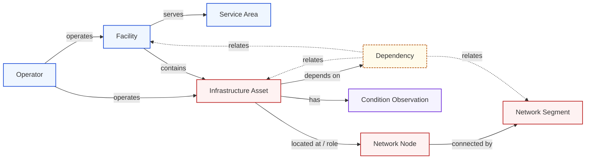

<!-- [KFM_META_BLOCK_V2]
doc_id: kfm://doc/settlements-infrastructure-infrastructure-dossier
title: Infrastructure — Settlements / Infrastructure (object-family dossier)
type: standard
version: v2
status: draft
owners: PLACEHOLDER-settlements-infrastructure-domain-steward, PLACEHOLDER-infrastructure-reviewer
created: 2026-05-19
updated: 2026-06-07
policy_label: mixed (T0 manifest / T1 generalized / T2 reviewer / T4 critical-asset deny)
related: [ai-build-operating-contract.md, directory-rules.md, docs/domains/settlements-infrastructure/README.md, docs/domains/settlements-infrastructure/OBJECT_FAMILIES.md, docs/domains/settlements-infrastructure/PATHS.md, contracts/domains/settlements-infrastructure/, schemas/contracts/v1/domains/settlements-infrastructure/, policy/sensitivity/infrastructure/]
notes: [Doctrine-adjacent; CONTRACT_VERSION = "3.0.0" pinned. v2 re-homes the prior "Infrastructure sublane" content as an infrastructure-side OBJECT-FAMILY dossier — "sublane" is not a KFM structural unit; domains subdivide by object family (Directory Rules §12; Atlas §24.14). Companion to OBJECT_FAMILIES.md (infrastructure-side half). Critical-asset detail and condition/vulnerability default to T4. Sibling "sublane" files cited in v1 were NOT verified and are downgraded.]
[/KFM_META_BLOCK_V2] -->

<a id="top"></a>

# 🏗️ Infrastructure — Settlements / Infrastructure

> The infrastructure-side object-family dossier for the Settlements / Infrastructure domain — assets, networks, facilities, service areas, operators, condition observations, and dependencies. This half carries the strictest deny-by-default sensitivity posture in the domain.


<!-- TODO: replace with real CI / doc-lint endpoint once available -->


**Status:** `draft` · **Owners:** Settlements/Infrastructure domain steward + infrastructure reviewer _(placeholders — verify)_ · **Updated:** 2026-06-07
**Pinned:** `CONTRACT_VERSION = "3.0.0"` (`ai-build-operating-contract.md`)

> [!IMPORTANT]
> **This is an object-family dossier, not a "sublane."** KFM has no `sublanes/` structural unit; domains subdivide by **object family**, and cross-cutting files route to the lowest common responsibility root *(Directory Rules §12; Atlas §24.14)*. This file documents the **infrastructure-side families** of the one Settlements/Infrastructure bounded context — it does **not** create a second context, a new directory unit, or a new placement authority. It is the detailed companion to [`OBJECT_FAMILIES.md`](./OBJECT_FAMILIES.md) §3 (infrastructure-side). The settlements-side families are documented under the same grouping.

---

## Contents

1. [Dossier in context](#1-dossier-in-context)
2. [Scope and boundary](#2-scope-and-boundary)
3. [Ubiquitous language](#3-ubiquitous-language)
4. [Key source families](#4-key-source-families)
5. [Object families](#5-object-families)
6. [Pipeline shape](#6-pipeline-shape)
7. [Sensitivity, rights, and publication posture](#7-sensitivity-rights-and-publication-posture)
8. [API, contract, and schema surfaces](#8-api-contract-and-schema-surfaces)
9. [Validators, tests, fixtures](#9-validators-tests-fixtures)
10. [Governed AI behavior](#10-governed-ai-behavior)
11. [Cross-group and cross-lane relations](#11-cross-group-and-cross-lane-relations)
12. [Map and viewing products](#12-map-and-viewing-products)
13. [Open questions and verification backlog](#13-open-questions-and-verification-backlog)
14. [Changelog](#14-changelog-v1--v2)
15. [Definition of done](#15-definition-of-done)
16. [Related docs](#16-related-docs)

---

## 1. Dossier in context

This file documents the **infrastructure-side object families** of the **Settlements / Infrastructure** domain — the slice that owns evidence and released derivatives for physical infrastructure assets, the networks they form, the facilities that anchor them, the service areas they cover, the operators that run them, and the condition observations and dependency relations recorded against them. The settlements-side families (Settlement, Municipality, CensusPlace, Townsite, GhostTown, Fort, Mission, ReservationCommunity) are the other half of the same bounded context, grouped in [`OBJECT_FAMILIES.md`](./OBJECT_FAMILIES.md) §2. Both halves share one parent dossier, one source-role doctrine, one ubiquitous language, and one lifecycle invariant. *(CONFIRMED parent-domain scope — `[DOM-SETTLE] [ENCY]`; infrastructure-side grouping per `OBJECT_FAMILIES.md`.)*

### 1.1 Why an infrastructure-side dossier

The domain bundles two distinct authority regimes inside one bounded context. **Settlements** are inhabited places; their sources are dominated by census, gazetteer, municipal-legal, and historical-record families; default sensitivity is generally low. **Infrastructure** is the physical and operational fabric — bridges, dams, levees, water and wastewater systems, utilities, facilities, condition and inspection records — and its default sensitivity is the strictest in the domain: critical-asset detail and condition/vulnerability default to **tier T4 (denied)**. *(`[DOM-SETTLE §I] [ENCY §24.5]`)*

Keeping these regimes legible matters because the same release machinery that publishes a town's census polygon must **fail closed** when asked for a critical asset's exact geometry or a bridge's condition rating. This dossier is the docs-side reflection of that policy-side separation — expressed through **object-family grouping**, the unit doctrine actually defines.

[↑ Back to top](#top)

---

## 2. Scope and boundary

### 2.1 What these families own

CONFIRMED scope (parent atlas §B); PROPOSED field realization. `[DOM-SETTLE §B] [ENCY]`

- **Infrastructure Asset** — a physical asset (bridge, dam, levee, pump station, treatment plant, tower, substation) with identity, location, and operator, governed by source role and sensitivity.
- **Network Node** — a node within an infrastructure network (junction, valve, switch).
- **Network Segment** — a segment connecting two Network Nodes (pipe, line, conductor).
- **Facility** — an operational complex co-locating multiple assets (wastewater treatment facility, dam complex).
- **Service Area** — the polygon or aggregate footprint a facility, system, or operator serves, time-scoped.
- **Operator** — the public, private, or tribal entity that owns or operates assets, networks, or facilities.
- **Condition Observation** — an observed condition, inspection, or status reading attached to an asset.
- **Dependency** — a directed reliance relation (e.g., a wastewater system depending on a power feed).

### 2.2 What these families do NOT own

CONFIRMED non-ownership (parent atlas §B). `[DOM-SETTLE §B] [ENCY]`

| Concern | Owning lane / group | Cross-edge type |
|---|---|---|
| Inhabited places, municipal legal status, historic townsites, forts, missions, reservation communities | **Settlements-side families** (same lane) | residence, exposure, parcel context |
| Road and rail transport routes | **Roads / Rail** lane | depot, bridge, crossing, transport-facility relation |
| Water evidence — flow, gauges, regulatory flood layers, water quality | **Hydrology** lane | water, wastewater, stormwater, floodplain, drainage |
| Hazard events, warnings, declarations | **Hazards** lane | exposure, resilience, warnings, declarations |
| Parcel ownership, living-person privacy | **People / DNA / Land** lane | parcel and operator-as-person constraints |
| Archaeological context for historic infrastructure | **Archaeology** lane | cultural context with sensitivity firewall |

> [!NOTE]
> **Bridges, dams, levees, and water utilities sit at the most fragile cross-lane boundary in KFM.** A bridge is simultaneously a transport facility (Roads/Rail), an infrastructure asset (here), an exposure surface (Hazards), and possibly a flood-relevant structure (Hydrology). The rule is **single-ownership-with-relations**: this group owns the **asset identity, operator, condition, and dependencies**; cross-lane relations carry the rest without duplicating canonical truth. `[DOM-SETTLE §F] [ENCY]`

[↑ Back to top](#top)

---

## 3. Ubiquitous language

CONFIRMED terms / PROPOSED field realization; meaning constrained by source role, evidence, time, and release state. Definitions are mirrored from the lane glossary (`UBIQUITOUS_LANGUAGE.md`, PROPOSED) — this dossier does not invent meaning. `[DOM-SETTLE §C] [ENCY]`

| Term | Meaning within this group | Citation |
|---|---|---|
| **Infrastructure Asset** | A physical asset record with identity, location, operator, source role; never a route. | `[DOM-SETTLE] [ENCY]` |
| **Network Node** | A point in an asset network with identity and connectivity; distinct from a transport node. | `[DOM-SETTLE] [ENCY]` |
| **Network Segment** | A connecting segment between two Network Nodes; never a road/rail segment. | `[DOM-SETTLE] [ENCY]` |
| **Facility** | An operational complex grouping co-located assets under one operator and service mission. | `[DOM-SETTLE] [ENCY]` |
| **Service Area** | The polygon or aggregate footprint served by a Facility, system, or Operator, time-scoped. | `[DOM-SETTLE] [ENCY]` |
| **Operator** | The party owning/operating an asset/facility/network; carries rights and sensitivity attributes. | `[DOM-SETTLE] [ENCY]` |
| **Condition Observation** | A time-scoped observation about an asset (inspection result, status, vulnerability rating). | `[DOM-SETTLE] [ENCY]` |
| **Dependency** | A directed asset-to-asset, asset-to-facility, or asset-to-network reliance relation. | `[DOM-SETTLE] [ENCY]` |
| **Source role** | One of the canonical KFM source roles; never inferred from convenience (see warning). | `[ENCY §24.1]` |
| **EvidenceBundle** | The cross-cutting evidence object supporting every released claim. | `[ENCY]` |
| **ReleaseManifest** | The release-state record that must exist for any PUBLISHED artifact. | `[DIRRULES] [ENCY]` |

> [!WARNING]
> **Source-role anti-collapse.** The canonical KFM source-role vocabulary is the **seven roles** `observed \| regulatory \| modeled \| aggregate \| administrative \| candidate \| synthetic` *(Atlas §24.1; ADR-S-04)*. The dossier's informal §D labels (*authority / observation / context / model*) map onto these and are **CONFLICTED** with the canonical set — surfaced, not silently picked (see [OPEN-SI-INF-09](#13-open-questions-and-verification-backlog)). Regardless of label set: an operator's self-published inventory is an `observed`/`administrative` record, **not** a `regulatory` determination; KDOT bridge condition ratings are `regulatory` for the condition vocabulary, `observed` for any specific bridge at a specific time; EPA ECHO compliance is `regulatory` for compliance status, `observed` for activity, **never** authority for facility identity. `[ENCY §24.1]`

[↑ Back to top](#top)

---

## 4. Key source families

PROPOSED source-family inventory. Rights, current terms, and freshness are **NEEDS VERIFICATION** until the source registry is mounted and reviewed. `[DOM-SETTLE §D] [ENCY]`

| Source family | Role(s) | Default tier | Sensitivity / rights | Notes |
|---|---|---|---|---|
| **USACE National Inventory of Dams (NID)** | `regulatory` (dam catalog) / `observed` (status) | T1 generalized; **T4** dam-failure inundation fields | Metadata generally open; sensitive fields restricted — NEEDS VERIFICATION | High-hazard precise geometry and dam-failure inundation classified restricted-precise. `[Atlas KFM-P2-IDEA-0026]` |
| **USACE National Levee Database (NLD)** | `regulatory` (levee catalog) / `observed` (status) | T1 generalized; T2–T4 sensitive fields | REST/JSON or ESRI/OGC services — terms NEEDS VERIFICATION | Public-safe summaries; precise condition restricted. `[Atlas KFM-P2-PROG-0008]` |
| **KDOT / Kansas bridge inventory & facility sources** | `regulatory` (inventory) / `observed` (condition) | T1 generalized footprint; **T4** condition detail | License / current terms NEEDS VERIFICATION | Bridge identity also surfaces in Roads/Rail as transport facility; **asset identity stays here**. `[DOM-SETTLE §D]` |
| **EPA ECHO compliance** | `regulatory` (compliance) / `observed` (inspection/enforcement) | T0 aggregate; T2–T3 derived facility-level | Public REST; retroactive revision; misattribution risk — NEEDS VERIFICATION | Do not present derived per-facility scores without policy review. `[Atlas EPA ECHO card]` |
| **EPA TRI via Envirofacts** | `observed` (release events) / `aggregate` | T0 aggregate; T2 derived per-facility | Public API; auth/form NEEDS VERIFICATION | Derived per-facility scoring is a sensitivity-policy question even on public base data. |
| **Kansas WIMAS / WWC5 (water systems)** | `regulatory` / `observed` | T1 aggregate; **T4** vulnerable details | Source terms NEEDS VERIFICATION | Kansas-specific water-systems inventory. `[Atlas KFM-P2-PROG-0009]` |
| **Infrastructure operators & providers** (utilities, municipalities, tribal authorities, private operators) | `administrative`/`observed` for own assets | T2 default; **T4** vulnerability / dependency | Per-operator agreement required; sensitive joins fail closed | Operator-as-source role must be explicit. |
| **State / local GIS — Kansas Geoportal-style** | `aggregate` / context | T0 aggregate; T2 detail | Per-layer license; aggregator role is not a regulatory role | Do not infer role from convenience. `[ENCY §24.1]` |
| **FEMA / hazards / resilience sources** | `regulatory` (context) / `observed` | T0 regulatory layers; **T4** dam/levee-failure exposure | FEMA NFHL public; NLD/NID sensitivity per above | Regulatory products are **context**, not observed inundation. `[DOM-SETTLE §D] [Atlas KFM-P2-IDEA-0026]` |

> [!CAUTION]
> Source rights for **every** family here remain `NEEDS VERIFICATION` until the source registry, license map, and operator-agreement set are mounted and reviewed. Connectors and watchers stay inactive until `SourceActivationDecision`s are recorded. `[ENCY]`

[↑ Back to top](#top)

---

## 5. Object families

CONFIRMED object-family list (parent atlas §E); PROPOSED shapes. Temporal-handling rule: source, observed, valid, retrieval, release, and correction times stay distinct where material; identity is deterministic on source id + object role + temporal scope + normalized digest. `[DOM-SETTLE §E] [ENCY]`

| Object | Purpose | Identity rule (PROPOSED) | Notes |
|---|---|---|---|
| **Infrastructure Asset** | Physical asset evidence or released derivative. | source id + asset role + temporal scope + digest | T4 default for critical detail; T1 generalized footprint with redaction receipt. |
| **Network Node** | Node within an asset network. | source id + node role + temporal scope + digest | Topology-bearing; connectivity via `Network Segment`. |
| **Network Segment** | Connecting segment between two Network Nodes. | source id + segment role + temporal scope + digest | Not a transport segment. |
| **Facility** | Operational complex grouping co-located assets. | source id + facility role + temporal scope + digest | Many-to-one with Asset; many-to-many with Operator under time scope. |
| **Service Area** | Polygon/aggregate footprint served by a Facility, system, or Operator. | source id + service-area role + temporal scope + digest | Time-scoped; aggregations preferred where sensitivity permits. |
| **Operator** | Party owning/operating asset/network/facility. | source id + operator role + temporal scope + digest | Sensitivity rises when operator identity intersects living-person privacy (cross-edge to People/Land). |
| **Condition Observation** | Time-scoped condition/inspection/status attached to an asset. | source id + observation role + asset ref + observed_at + digest | **T4 default** for vulnerability/condition fields. |
| **Dependency** | Directed reliance relation. | source id + relation role + (from, to) refs + temporal scope + digest | **T4 default**; aggregate/coarse-graph summaries can promote to T1 via review. |

### 5.1 Object-network diagram



*Illustrative — PROPOSED relation vocabulary; canonical relation names live in `contracts/domains/settlements-infrastructure/` (PROPOSED path).* `[DIRRULES §12]`

[↑ Back to top](#top)

---

## 6. Pipeline shape

CONFIRMED doctrine / PROPOSED lane application: the standard lifecycle invariant **RAW → WORK / QUARANTINE → PROCESSED → CATALOG / TRIPLET → PUBLISHED**, with promotion as a governed state transition, **not a file move**. `[DIRRULES] [DOM-SETTLE §H] [ENCY]`

| Stage | Handling | Gate | Status |
|---|---|---|---|
| **RAW** | Capture immutable source payload/reference with source role, rights, sensitivity, citation, time, hash. | `SourceDescriptor` exists. | PROPOSED |
| **WORK / QUARANTINE** | Normalize schema, geometry, time, identity, evidence, rights, policy; hold failures. | Validation + policy pass, or quarantine reason recorded. | PROPOSED |
| **PROCESSED** | Emit validated normalized objects, receipts, public-safe candidates. | `EvidenceRef`, `ValidationReport`, digest closure. | PROPOSED |
| **CATALOG / TRIPLET** | Emit catalog records, EvidenceBundles, graph/triplet projections, release candidates. | Catalog/proof closure passes. | PROPOSED |
| **PUBLISHED** | Serve released public-safe artifacts through governed APIs and manifests. | `ReleaseManifest`, correction path, rollback target, review/policy state. | PROPOSED |

> [!IMPORTANT]
> **First slice rule (PROPOSED).** The first slice here is **schema-and-fixture-first** — source descriptors, deterministic identity, validators, deny policies, no-network fixtures, and proof-pack/promotion fixtures land **before** live source activation. Critical-infrastructure families (NLD, NID, KDOT condition) move past PROPOSED only after deny-tests for vulnerability-field leak prove their gates. `[ENCY KFM-P1-PROG-0024]`

[↑ Back to top](#top)

---

## 7. Sensitivity, rights, and publication posture

The defining section. The infrastructure side carries KFM's strictest sensitivity matrix outside Archaeology and People/DNA. `[DOM-SETTLE §I] [ENCY §24.5]`

### 7.1 Default tier matrix (PROPOSED)

| Object / field class | Default tier | Allowed transforms (PROPOSED) | Required gates |
|---|---|---|---|
| Infrastructure Asset — generalized footprint, public identifier | **T0–T1** | Standard release; generalization receipt where coarsened. | `ReleaseManifest` + `ReviewRecord`. |
| Infrastructure Asset — **critical asset detail** | **T4** | Generalized footprint + suppressed dependency → T1. | Steward review + `RedactionReceipt`. |
| Infrastructure Asset — **condition / vulnerability** | **T4** | T3 to named authorities only; **never** T0/T1. | Steward review + named-party agreement. |
| Condition Observation — public-safe summary | **T1** | Aggregation / temporal-bucket / status-only. | `AggregationReceipt` + `ReviewRecord`. |
| Dependency — coarse summary | **T1** | Aggregate/coarse-graph; suppress sensitive endpoints. | `RedactionReceipt` + `ReviewRecord`. |
| Dependency — full edge with sensitive endpoint | **T4** | None to T0; T3 only under named agreement. | Steward review + `PolicyDecision`. |
| Operator — public name | **T0** | Standard release. | `ReleaseManifest`. |
| Operator — operator-as-person / living-person fields | **T4** | Aggregate to operator-class or de-identify per People/Land. | Cross-edge to People/Land gates. |
| Service Area — aggregate footprint | **T0–T1** | Standard release; generalization where exposure-sensitive. | `ReleaseManifest`. |
| Facility — exact geometry, vulnerable facility classes | **T4** | Generalized footprint → T1; staged access → T2. | Steward review + `RedactionReceipt`. |

*(Tiers PROPOSED per `[ENCY §24.5.2]`; `[DOM-SETTLE §I]`.)*

### 7.2 Deny-by-default invariants

> [!CAUTION]
> **Fail-closed** invariants — not configurable from the public path. Any apparent override surfaces as a drift entry and a deny on the runtime path. `[ENCY] [DIRRULES]`
>
> 1. **Unclear rights** block public promotion. No exception.
> 2. **Unresolved source role** blocks public promotion.
> 3. **Missing EvidenceBundle support** blocks public promotion.
> 4. **Unresolved sensitivity classification** blocks public promotion.
> 5. **Absent ReleaseManifest** blocks public surfacing.
> 6. **No transform** permits release of full condition/vulnerability detail to T0/T1.
> 7. **KFM is not an emergency-alert authority** — the Hazards lane upholds this boundary forever; this dossier mirrors it for any Condition Observation that could read as a live-warning surface. `[DOM-HAZ] [ENCY §24.5.2]`

### 7.3 Tier transitions

Applicable rows from the cross-cutting Tier Transitions table. `[ENCY §24.5.3]`

| From → To | Required artifact | Reviewer | Reversibility |
|---|---|---|---|
| T4 → T3 | `PolicyDecision` + `ReviewRecord` + named agreement | Steward + rights-holder | Reversible via agreement revocation → T4 with `CorrectionNotice`. |
| T4 → T2 | `PolicyDecision` + `ReviewRecord` | Steward | Reversible via review revocation. |
| T4 → T1 | `RedactionReceipt` + `ReviewRecord` | Steward | Reversible; correction may demote a published T1 back to T4. |
| T1 → T0 | `ReleaseManifest` + `ReviewRecord` | Steward + release authority | Reversible via `RollbackCard`. |

[↑ Back to top](#top)

---

## 8. API, contract, and schema surfaces

PROPOSED interfaces. Exact route names, DTO shapes, schema home, and runtime behavior are **NEEDS VERIFICATION** until repo mount. `[DOM-SETTLE §J] [DIRRULES]`

| Endpoint or artifact | DTO / schema (PROPOSED) | Outcomes | Status |
|---|---|---|---|
| Infrastructure feature/detail resolver — route TBD | `SettlementsInfrastructureDecisionEnvelope` | `ANSWER` / `ABSTAIN` / `DENY` / `ERROR` | PROPOSED; exact route UNKNOWN. |
| Infrastructure layer manifest resolver | `LayerManifest` / domain layer descriptor | `ANSWER` / `DENY` / `ERROR` | PROPOSED; public-safe release only. |
| Evidence Drawer payload | `EvidenceDrawerPayload` + `EvidenceBundle` projection | `ANSWER` / `ABSTAIN` / `DENY` / `ERROR` | PROPOSED; evidence + policy filtered. |
| Focus Mode answer (Governed AI) | `RuntimeResponseEnvelope` + `AIReceipt` | `ANSWER` / `ABSTAIN` / `DENY` / `ERROR` | PROPOSED; AI never root truth. |
| Critical-asset deny lane | `DecisionEnvelope` with `DENY` + reason code | `DENY` | PROPOSED; **fail-closed** invariant. |
| Schema responsibility root | `schemas/contracts/v1/domains/settlements-infrastructure/...` | finite validator outcomes | PROPOSED; ADR-0001 / ADR-S-01 governs schema home. `[DIRRULES §2.4(3)]` |

> [!NOTE]
> Public clients reach these families **only** through `apps/governed-api/` (the trust membrane). They never read `data/raw`, `data/work`, `data/quarantine`, or `data/catalog` directly. Watcher-as-non-publisher holds: watchers emit receipts and candidate decisions; **only** the release authority publishes. `[DIRRULES] [ENCY]`

[↑ Back to top](#top)

---

## 9. Validators, tests, fixtures

PROPOSED validator/test inventory — the infrastructure-side slice of the parent atlas §K list. `[DOM-SETTLE §K] [ENCY]`

- **Infrastructure topology tests** — Node/Segment connectivity, no orphan segments, deterministic topology digest.
- **Condition `observed_at` tests** — every Condition Observation carries a distinct observed time; retrieval/release times not conflated.
- **Restricted geometry no-leak tests** — exact geometry for T4-default classes must not appear in any T0/T1 release; tile-build outputs scanned.
- **Dependency-edge sensitivity tests** — full Dependency edges with sensitive endpoints fail closed on any public path.
- **Critical-asset deny-lane tests** — Focus Mode and detail resolver return `DENY` for T4-default classes absent a named-party agreement.
- **Catalog/proof/release closure tests** — every CATALOG record carries an EvidenceBundle digest closure; every ReleaseManifest names a rollback target.
- **Source-role anti-collapse tests** — operator-self-published inventory cannot be coerced into a `regulatory` role through PR or fixture.
- **Bridge dual-ownership tests** — bridge records preserve dual identity (this domain for asset, Roads/Rail for transport facility) without divergence or duplication.

Fixture home: `fixtures/domains/settlements-infrastructure/` (PROPOSED per Directory Rules §12). `[DIRRULES]`

[↑ Back to top](#top)

---

## 10. Governed AI behavior

CONFIRMED doctrine / PROPOSED implementation: AI may summarize **released** infrastructure EvidenceBundles, compare evidence across releases, explain limitations, and draft steward-review notes. AI **MUST ABSTAIN** when evidence is insufficient. AI **MUST DENY** where policy, rights, sensitivity, or release state blocks the request. AI never reads RAW or WORK content. Every Focus Mode answer carries an `AIReceipt`. `[GAI] [DOM-SETTLE §L] [ENCY]`

> [!WARNING]
> **AI is interpretive, not root truth.** The EvidenceBundle outranks any generated language. For these families specifically, AI MUST DENY any request to:
>
> - reveal precise geometry of a T4 critical asset,
> - combine generalized footprints into a synthesized higher-precision answer,
> - describe a condition rating in narrative form for an asset whose Condition Observation is T4, or
> - infer a Dependency edge not present in a released EvidenceBundle.
>
> ABSTAIN, do not approximate. `[GAI] [ENCY §24.5]`

[↑ Back to top](#top)

---

## 11. Cross-group and cross-lane relations

### 11.1 Cross-group edges (within Settlements / Infrastructure)

| Edge | Other group | Relation | Constraint |
|---|---|---|---|
| Facility located within Municipality / CensusPlace | **Settlements-side** | location / containment | Preserve source-role distinctness; do not infer infrastructure status from a settlement record. |
| Historic Fort/Mission with surviving infrastructure | **Settlements-side** (primary) | historic-infrastructure overlay | Fort/Mission identity stays settlements-side; surviving components surface as Infrastructure Asset records cross-referencing the place record. |
| Operator-as-person edge | **Settlements-side** + cross-edge to People/Land | living-person privacy firewall | Operator records naming a living person follow People/Land rules; aggregate operator-class preferred for release. |

### 11.2 Cross-lane edges

CONFIRMED edge set (parent atlas §F). Each cross-edge MUST preserve ownership, source role, sensitivity, and EvidenceBundle support. `[DOM-SETTLE §F] [ENCY]`

| Related lane | Relation type | Group-specific notes |
|---|---|---|
| **Roads / Rail** | depot, bridge, crossing, transport facility | Asset identity stays here; transport-graph identity stays in Roads/Rail. Bridges/depots/crossings are joint-ownership cases handled by relation records, not duplication. |
| **Hazards** | exposure, resilience, warnings, declarations | Hazard events never originate here; Condition Observation never assumes alert-authority status. `[DOM-HAZ]` |
| **Hydrology** | water, wastewater, stormwater, floodplain, drainage | Water utilities own their assets here; the water itself stays in Hydrology. Regulatory flood layers are context, not observation. `[DOM-HYD]` |
| **People / DNA / Land** | residence, ownership, parcel, migration context | Living-person and parcel-private-join firewalls govern. `[DOM-PEOPLE]` |
| **Archaeology** | historic infrastructure, surviving works on archaeological landscapes | Site-coordinate sensitivity from the Archaeology side wins; sensitivity is never resolved through this group. `[DOM-ARCH]` |
| **Spatial Foundation** | public-safe geometry and sensitivity transforms | Generalization Transform receipts cross-cite. `[ENCY]` |

[↑ Back to top](#top)

---

## 12. Map and viewing products

PROPOSED viewing products for these families. The cross-cutting set (Evidence Drawer, time-aware state, trust badges, sensitivity-redacted view, correction/stale-state view, governed Focus Mode) applies universally. `[DOM-SETTLE §G] [MAP-MASTER] [GAI]`

- **Public-safe asset view** — released Infrastructure Asset records at generalized geometry; T0/T1 only.
- **Service-area aggregate view** — Facility/system/Operator service-area polygons; T0/T1 aggregate.
- **Dependency-summary view** — coarse-graph Dependency summaries; T1 only, sensitive endpoints redacted.
- **Restricted internal review view** — full-detail Condition Observation and Dependency; T2 (reviewer) or T3 (named-party agreement) only; never on the public path.
- **Asset-by-operator view** — public Operator + Asset roll-up; living-person operators aggregated to operator-class.
- **Hazard-exposure overlay** (Hazards-side composition) — exposure layer using generalized infrastructure footprints; never reveals condition.

> [!NOTE]
> Every viewing product surfaces through the Evidence Drawer with citation, trust badge, and stale-state cues. A surface that cannot show evidence is not a public surface. `[MAP-MASTER]`

[↑ Back to top](#top)

---

## 13. Open questions and verification backlog

| ID | Question | Status |
|---|---|---|
| OPEN-SI-INF-02 | Canonical schema home — `schemas/contracts/v1/domains/settlements-infrastructure/` (§12) vs `settlement/` short-name (Atlas §24.13/Encyclopedia §5.1). Confirm ADR-S-01 / ADR-0001. | NEEDS VERIFICATION |
| OPEN-SI-INF-03 | Source rights/terms for KDOT, USACE NLD, USACE NID, EPA ECHO, EPA TRI, WIMAS/WWC5, and per-operator agreements. | NEEDS VERIFICATION |
| OPEN-SI-INF-04 | Public-safe layer registry — which generalized infrastructure layers may release, at what zoom, with what redaction receipts? | NEEDS VERIFICATION; PROPOSED policy gate |
| OPEN-SI-INF-05 | Critical-infrastructure deny-test coverage — fixtures present for every T4-default class? | NEEDS VERIFICATION |
| OPEN-SI-INF-06 | Bridge dual-ownership — is the Roads/Rail relation type crosswalk-stable against `infrastructure-asset` here? | NEEDS VERIFICATION |
| OPEN-SI-INF-07 | Operator-as-person living-person firewall — do operator records naming a living person route through the People/Land consent gate cleanly? | NEEDS VERIFICATION |
| OPEN-SI-INF-08 | Focus Mode DENY reason code — does it distinguish "missing evidence" from "rights/sensitivity block"? | NEEDS VERIFICATION |
| OPEN-SI-INF-09 | Source-role vocabulary — §D informal `authority/observation/context/model` vs canonical §24.1 seven roles. **CONFLICTED**; ratify via ADR-S-04. | CONFLICTED / NEEDS VERIFICATION |

> [!NOTE]
> The v1 item "does the repo use a `sublanes/` subdirectory" is **retired**: this content is re-homed as an object-family dossier, so the `sublanes/` question no longer applies to this file. Any future `sublanes/` proposal is an ADR-class structural decision (it would add an organizing unit Directory Rules does not define). `[DIRRULES §2.4]`

These items echo the parent atlas §N backlog scoped to the infrastructure families. `[DOM-SETTLE §N] [ENCY]`

[↑ Back to top](#top)

---

## 14. Changelog v1 → v2

| Change | Type (per contract §37) | Reason |
|---|---|---|
| Re-homed from `sublanes/infrastructure.md` to `INFRASTRUCTURE.md` (object-family dossier) | reconciliation | "Sublane" is not a KFM structural unit; domains subdivide by object family `[DIRRULES §12] [ENCY §24.14]` — consistent with the approved `OBJECT_FAMILIES.md` |
| Removed the `sublanes/` premise + the §1 "PROPOSED subdirectory" framing | reconciliation | Dossier no longer rests on an undefined unit |
| **Downgraded** "CONFIRMED authored" claims for `roads-rail-trade/sublanes/roads.md` and `geology/sublanes/natural_resources.md` to NEEDS VERIFICATION (removed as precedent) | reconciliation | Cross-session "authored" is not verifiable this session and conflicts with actual outputs; cannot be marked CONFIRMED |
| Source-role vocabulary reconciled to canonical seven roles; §D labels mapped; CONFLICTED flagged (OPEN-SI-INF-09) | reconciliation | Align with §24.1 / ADR-S-04 |
| Retired OPEN-SI-INF-01 (`sublanes/` existence) | housekeeping | No longer applicable to this file |
| Added Changelog + Definition of done; quoted Mermaid edge labels | housekeeping | Doctrine-doc completeness + render safety |
| `related`/footer paths reconciled (`directory-rules.md` at repo root; siblings under the lane) | housekeeping | Project files place doctrine at repo root |

> **Backward compatibility.** File moved from `sublanes/infrastructure.md` → `INFRASTRUCTURE.md`. The back-to-top anchor changed to `#top`. All section content is preserved; section 11 retitled "Cross-group" (was "Cross-sublane"). Inbound links to the old path or `#infrastructure-sublane--...` anchor need updating.

## 15. Definition of done

This dossier is done enough to enter the repository when:

- it is placed at `docs/domains/settlements-infrastructure/INFRASTRUCTURE.md` per Directory Rules §12;
- a domain steward **and** infrastructure reviewer review it;
- it mirrors (does not contradict) `contracts/domains/settlements-infrastructure/` and the lane glossary;
- it is linked from the lane `README.md` §6 and `OBJECT_FAMILIES.md` §3;
- the source-role conflict (OPEN-SI-INF-09 / ADR-S-04) is ratified or logged in `docs/registers/DRIFT_REGISTER.md`;
- no `sublanes/`-style unit is reintroduced absent an accepted ADR;
- the `GENERATED_RECEIPT.json` planned in Notes is wired into CI;
- future changes follow the operating contract's §37 lifecycle.

[↑ Back to top](#top)

---

## 16. Related docs

> [!NOTE]
> Paths below are **PROPOSED** until repo mount and a per-root README ratifies them; some targets are **TODO** authoring, listed to keep the docs graph visible. `[DIRRULES §15]`

- **Parent dossier** — [`docs/domains/settlements-infrastructure/README.md`](./README.md)
- **Object-family grouping** — [`docs/domains/settlements-infrastructure/OBJECT_FAMILIES.md`](./OBJECT_FAMILIES.md) (this is the infrastructure-side detail companion)
- **Lane path crosswalk** — [`docs/domains/settlements-infrastructure/PATHS.md`](./PATHS.md)
- **Lane glossary** — `docs/domains/settlements-infrastructure/UBIQUITOUS_LANGUAGE.md` *(TODO)*
- **Doctrine** — [`directory-rules.md`](../../../directory-rules.md) (§12 Domain Placement Law; §2.4 ADR triggers); [`ai-build-operating-contract.md`](../../../ai-build-operating-contract.md) (`CONTRACT_VERSION = "3.0.0"`)
- **Dossier source** — Atlas ch.14 (Settlements & Infrastructure); §24.5 (sensitivity tiers); §24.1 (source-role); §24.14 (object-family × domain matrix)
- **Standards** — `docs/standards/PROV.md` *(naming variance vs `PROVENANCE.md` — NEEDS VERIFICATION)*
- **Registers** — `docs/registers/DRIFT_REGISTER.md`, `docs/registers/VERIFICATION_BACKLOG.md`

<details>
<summary><strong>Appendix A — PROPOSED file homes for these families</strong> (click to expand)</summary>

Derived from Directory Rules §12. Each path is PROPOSED until repo mount; no directory should be created without confirming the parent root exists and carries a per-root README declaring authority class. `[DIRRULES §9, §12, §15]`

```text
docs/domains/settlements-infrastructure/
├── README.md                 # parent dossier
├── OBJECT_FAMILIES.md         # settlements-side / infrastructure-side grouping
├── INFRASTRUCTURE.md          # this file (infrastructure-side detail)
└── PATHS.md                   # lane path crosswalk

contracts/domains/settlements-infrastructure/
├── infrastructure_asset.md  network_node.md  network_segment.md  facility.md
├── service_area.md  operator.md  condition_observation.md  dependency.md      (all PROPOSED)

schemas/contracts/v1/domains/settlements-infrastructure/                        (PROPOSED; ADR-0001 governs)
policy/domains/settlements-infrastructure/
├── critical_asset_deny.rego  condition_field_redaction.rego  dependency_edge_sensitivity.rego   (PROPOSED)
policy/sensitivity/infrastructure/                                              (critical-asset deny lane)
tests/domains/settlements-infrastructure/                                       (PROPOSED)
fixtures/domains/settlements-infrastructure/                                    (PROPOSED)
pipelines/domains/settlements-infrastructure/                                   (PROPOSED)
```

</details>

<details>
<summary><strong>Appendix B — Source-family citation crosswalk</strong> (click to expand)</summary>

| Atlas card / source label | Used in | Section |
|---|---|---|
| `[DOM-SETTLE]` | Parent domain doctrine — scope, language, sources, objects, pipeline, sensitivity, AI, publication, backlog | §1–§13 |
| `[ENCY]` | Cross-cutting doctrine; sensitivity tiers (§24.5); object families; source-role (§24.1); cross-lane edges | §1, §3, §7, §10, §11 |
| `[DIRRULES]` | Placement law; lifecycle invariant; per-root README; ADR triggers | §1, §6, §8, §13 |
| `[MAP-MASTER]` | Evidence Drawer; viewing-product discipline | §12 |
| `[GAI]` | Governed AI doctrine; ABSTAIN/DENY; AIReceipt | §10 |
| `[DOM-HAZ]` / `[DOM-HYD]` / `[DOM-PEOPLE]` / `[DOM-ARCH]` | Cross-lane firewalls | §7, §11 |
| Atlas KFM-P2-IDEA-0026 | FEMA NFHL / USACE NLD / NID as flood & infrastructure authorities | §4 |
| Atlas KFM-P2-PROG-0008 / -0009 | NFHL/NLD/NID ingest; Kansas WIMAS/WWC5 ingest | §4 |
| ENCY §24.5 | Master Sensitivity / Rights Tier Reference (T0–T4; transitions) | §7 |
| ENCY §24.1 | Source-role anti-collapse (seven canonical roles) | §3 |

</details>

---

**Related:** [Parent dossier](./README.md) · [Object families](./OBJECT_FAMILIES.md) · [Paths](./PATHS.md) · [Directory Rules](../../../directory-rules.md)

*Last updated: 2026-06-07 · Doc version: v2 (draft) · `CONTRACT_VERSION = "3.0.0"`*

[↑ Back to top](#top)
