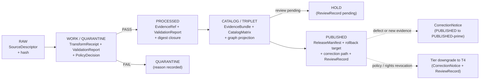

<!-- [KFM_META_BLOCK_V2]
doc_id: kfm://doc/TBD-settlements-infrastructure-sublane-settlements
title: Settlements / Infrastructure — Settlements Sublane Dossier
type: standard
version: v0.2
status: draft
owners: Settlements/Infrastructure domain stewards (TBD placeholder)
created: 2026-05-19
updated: 2026-06-07
policy_label: public (sublane scaffold) — content tiers vary; Settlement / Municipality / GhostTown default T0; sovereignty-sensitive surfaces (ReservationCommunity, archaeology-adjacent townsites) escalate per per-source review
related:
  - ai-build-operating-contract.md                              # canonical operating contract, CONTRACT_VERSION = "3.0.0"
  - docs/domains/settlements-infrastructure/README.md           # PROPOSED parent dossier
  - docs/domains/settlements-infrastructure/sublanes/infrastructure.md   # PROPOSED sibling sublane
  - docs/domains/roads-rail-trade/README.md                     # canonical owner of transport routes
  - docs/domains/roads-rail-trade/sublanes/rail.md              # rail-side depot identity discussion
  - docs/domains/hydrology/README.md                            # water / wastewater / floodplain context
  - docs/domains/hazards/README.md                              # exposure, resilience, disaster declarations
  - docs/domains/people-dna-land/README.md                      # residence, ownership, parcel, living-person privacy
  - docs/domains/archaeology/README.md                          # historic site / townsite cultural sensitivity
  - docs/domains/frontier-matrix/README.md                      # Settlement Status as matrix input
  - docs/doctrine/directory-rules.md                            # placement authority
tags: [kfm, domain, settlements-infrastructure, sublane, settlements]
notes:
  - "CONTRACT_VERSION = \"3.0.0\" — this sublane refines doctrine and inherits the operating contract pin."
  - "The 'sublanes/' organizational layer is a PROPOSED extension of docs/domains/<domain>/; not yet enumerated in Directory Rules §6.1 / §12. See OPEN-DR-SUBLANE-01."
  - "Schema-home is CONFLICTED: [ENCY] §7.12 names schemas/contracts/v1/settlement/ (singular) while Directory Rules §6.4 patterns schemas/contracts/v1/domains/<domain>/. See OPEN-DR-SUBLANE-03 — ADR-class per Directory Rules §2.4(3)."
  - "All path, route, schema, and tooling claims remain PROPOSED until a mounted repository is inspected."
  - "ReservationCommunity sensitivity defers to Indigenous-sovereignty review under [DOM-ARCH] / [DOM-PEOPLE] doctrine; this sublane does not author that policy."
[/KFM_META_BLOCK_V2] -->

# Settlements / Infrastructure — **Settlements Sublane Dossier**

> *Governance scaffold for Kansas community-and-place identity evidence — settlements, municipalities, census places, historic townsites, ghost towns, forts, missions, and reservation communities — within the Settlements/Infrastructure domain lane.*

       

<sub><strong>Status:</strong> draft · <strong>Owners:</strong> Settlements/Infrastructure stewards (TBD placeholder) · <strong>Last updated:</strong> 2026-06-07 · <strong>Supersedes:</strong> v0.1 (first edition) · <strong>Contract:</strong> <code>CONTRACT_VERSION = “3.0.0”</code></sub>

> [!IMPORTANT]
> **Scaffolding posture.** This file is a **doctrine surface**, not an implementation claim. It refines the `[DOM-SETTLE]` chapter (Atlas v1.0 Ch. 14, pp. 90–96) and the v1.1 Master Atlases (Ch. 24) for the *place / community identity* half of the combined Settlements/Infrastructure lane. The sibling **infrastructure sublane** (assets, networks, facilities, service areas, operators, condition observations, dependencies) is **PROPOSED** and **NEEDS VERIFICATION** of authoring. Where the parent `[DOM-SETTLE]` chapter and this sublane disagree, **`[DOM-SETTLE]` governs** and the conflict is filed against `docs/registers/DRIFT_REGISTER.md` per Directory Rules §2.5.

> [!NOTE]
> **Truth-label convention.** Every claim that walks into implementation territory (routes, schemas, packages, tests, CI, deployment, runtime behavior) is **PROPOSED** or **NEEDS VERIFICATION** until checked against a mounted repository. Doctrine inherited from `[DOM-SETTLE]`, `[ENCY]`, `[DIRRULES]`, `[UNIFIED]`, `[MAP-MASTER]`, and `[GAI]` is **CONFIRMED** when faithful to source. Where two governing docs disagree, the claim is **CONFLICTED** and both sources are cited.

-----

## Table of contents

- [A. Scope and one-line purpose](#a-scope-and-one-line-purpose)
- [B. Object families owned by this sublane](#b-object-families-owned-by-this-sublane)
- [C. Repo fit — parent dossier and responsibility roots](#c-repo-fit--parent-dossier-and-responsibility-roots)
- [D. Ubiquitous language (sublane-scoped)](#d-ubiquitous-language-sublane-scoped)
- [E. Key source families for the settlements sublane](#e-key-source-families-for-the-settlements-sublane)
- [F. Identity, deterministic basis, and temporal handling](#f-identity-deterministic-basis-and-temporal-handling)
- [G. Cross-lane and cross-sublane relations](#g-cross-lane-and-cross-sublane-relations)
- [H. Map and viewing products](#h-map-and-viewing-products)
- [I. Pipeline shape (RAW → PUBLISHED)](#i-pipeline-shape-raw--published)
- [J. Sensitivity, rights, and publication posture](#j-sensitivity-rights-and-publication-posture)
- [K. API, contract, and schema surfaces](#k-api-contract-and-schema-surfaces)
- [L. Validators, tests, fixtures](#l-validators-tests-fixtures)
- [M. Governed AI behavior for this sublane](#m-governed-ai-behavior-for-this-sublane)
- [N. Publication, correction, and rollback](#n-publication-correction-and-rollback)
- [O. Open questions and verification backlog](#o-open-questions-and-verification-backlog)
- [P. Related docs](#p-related-docs)

-----

## A. Scope and one-line purpose

**CONFIRMED doctrine / PROPOSED sublane application.** The settlements sublane governs *place-and-community identity evidence* within the Settlements/Infrastructure domain (`[DOM-SETTLE]`): named settlements as legal, administrative, census, historic, military, religious, and reservation-community entities; their boundaries, status transitions, and public-safe representations; and their relations into the wider KFM graph. The sublane does **not** own infrastructure assets, networks, facilities, service areas, operators, condition observations, or dependencies — those remain with the sibling **infrastructure sublane** under the same domain root.

`[DOM-SETTLE]` `[ENCY]` `[DIRRULES]`

> [!NOTE]
> **Whole-domain one-liner (CONFIRMED, Atlas v1.0 Ch. 14 §A).** The parent domain’s charge is to *“govern settlements, municipalities, census places, historic townsites, ghost towns, forts, missions, reservation communities, infrastructure assets, networks, facilities, service areas, operators, condition observations, dependencies, and public-safe representations.”* This sublane carries the **first eight** of those object families (the place/community half); the rest are infrastructure-sublane.

This sublane operates inside KFM’s overall posture: **governed, evidence-first, map-first, time-aware**. Promotion to PUBLISHED is a **governed state transition, not a file move** (`[DIRRULES]` lifecycle invariant). Public clients reach this content only through the **governed API** (trust-membrane rule, `[ENCY]` §24.9.2).

[↑ back to top](#settlements--infrastructure--settlements-sublane-dossier)

-----

## B. Object families owned by this sublane

### B.1 Owned (CONFIRMED doctrine / PROPOSED field realization)

The parent chapter (`[DOM-SETTLE]` §B, Atlas Ch. 14, p. 90) names sixteen object families. The *settlements sublane* claims the place-/community-identity subset:

|Object family           |Sublane role                                                                                                                                                         |Source                                             |
|------------------------|---------------------------------------------------------------------------------------------------------------------------------------------------------------------|---------------------------------------------------|
|**Settlement**          |Generic place-of-occupation identity (umbrella for legal/historic/census variants when none of the more specific classes is admissible).                             |`[DOM-SETTLE]` `[ENCY]`                            |
|**Municipality**        |Legal incorporated entity (city, town, township, village) with charter, boundary, governance, status events.                                                         |`[DOM-SETTLE]` `[ENCY]`                            |
|**CensusPlace**         |Census-defined place (CDP, incorporated place as enumerated by the census authority) — a *statistical* identity distinct from legal municipality.                    |`[DOM-SETTLE]` `[ENCY]`                            |
|**Townsite**            |Platted town site (legal plat record, historic founding act) — an *origin* claim, not necessarily a continuing settlement.                                           |`[DOM-SETTLE]` `[ENCY]`                            |
|**GhostTown**           |A settlement whose population has dropped to zero or near-zero and whose evidentiary trail has shifted from active records to historical / archaeological sources.   |`[DOM-SETTLE]` `[ENCY]`                            |
|**Fort**                |Military post — built, garrisoned, decommissioned; historic-era authority for many settlement origins.                                                               |`[DOM-SETTLE]` `[ENCY]`                            |
|**Mission**             |Religious mission station — founding, operation, abandonment; cultural-heritage adjacency.                                                                           |`[DOM-SETTLE]` `[ENCY]`                            |
|**ReservationCommunity**|Community on an Indigenous reservation or trust land. Sovereignty review and `[DOM-ARCH]` / `[DOM-PEOPLE]` cultural-sensitivity policy govern downstream publication.|`[DOM-SETTLE]` `[ENCY]` `[DOM-ARCH]` `[DOM-PEOPLE]`|


> [!NOTE]
> **One umbrella, several specialisations.** A given Kansas place may carry multiple co-existing identities at the same `valid_time` — e.g., a Settlement + Municipality + CensusPlace + (historically) Fort. KFM does **not** collapse them into one object; identity stays plural and source-roled, with cross-references through the catalog. Identity rule below (§F). This mirrors the `[DDD]` *Entity* pattern: an object is distinguished by its identity thread, not by its attributes, and mistaken identity corrupts data.

### B.2 Explicit non-ownership

The settlements sublane explicitly does **not** own the following. Authoring or publishing those claims here is a doctrine violation:

|Concern                                                                                                                 |Owning lane / sublane                                           |Why this matters                                                                                                                                                                                                |
|------------------------------------------------------------------------------------------------------------------------|----------------------------------------------------------------|----------------------------------------------------------------------------------------------------------------------------------------------------------------------------------------------------------------|
|Infrastructure Asset, Network Node, Network Segment, Facility, Service Area, Operator, Condition Observation, Dependency|**Infrastructure sublane** (sibling, same parent `[DOM-SETTLE]`)|A depot, water tower, substation, hospital, or school building is an *asset* in its own object family. The settlements sublane only consumes the *place* relation, not the asset detail.                        |
|Road / rail / trail / trade-route alignments and corridor identity                                                      |**Roads / Rail / Trade Routes** (`[DOM-ROADS]`)                 |Transport route truth is owned upstream; this sublane consumes routes as *context* (e.g., “settled along the Smoky Hill Trail”).                                                                                |
|Hydrologic feature evidence                                                                                             |**Hydrology** (`[DOM-HYD]`)                                     |Rivers, gauges, NFHL zones live in hydrology; the settlements sublane only carries spatial-adjacency joins.                                                                                                     |
|Hazard events, warnings, disaster declarations                                                                          |**Hazards** (`[DOM-HAZ]`)                                       |KFM is **never** an emergency-alert authority (`[DOM-HAZ]` retained boundary; Atlas v1.1 §24.5.2 — *KFM as alert authority = T4 forever*). The settlements sublane cites hazard exposure but does not author it.|
|Person assertions, living-person fields, DNA, residence / migration events, parcel ownership                            |**People / DNA / Land** (`[DOM-PEOPLE]`)                        |Living-person and DNA fields default **T4** (deny). This sublane never publishes joins that pierce that policy.                                                                                                 |
|Archaeological sites, sacred sites, cultural-heritage chronology                                                        |**Archaeology / Cultural Heritage** (`[DOM-ARCH]`)              |Site coordinates default **T4**; historic-townsite adjacency uses generalized geometry only after steward review.                                                                                               |
|Frontier Definition, GeographyVersion, County-Year Panel, Settlement Status (matrix-level)                              |**Frontier Matrix**                                             |`[DOM-SETTLE]` owns *legal and infrastructure status of a settlement*; the matrix owns *Settlement Status as a panel cell* in a county-year analytic. The two are related but not identical.                    |
|LandParcel, Land Office Record, Public Land Record                                                                      |**People / Land** and **Frontier Matrix**                       |The parcel and land-office surfaces are owned upstream. The settlements sublane consumes them as *context*, never as authority.                                                                                 |
|`ReviewRecord`, `PolicyDecision`, and all receipt families                                                              |**Cross-cutting** (`[ENCY]` §24.2)                              |Receipts are §24.2 cross-cutting governance objects, not domain-owned. This sublane *references and emits* them; it does not own their schema home.                                                             |

`[DOM-SETTLE]` `[DOM-ROADS]` `[DOM-HYD]` `[DOM-HAZ]` `[DOM-PEOPLE]` `[DOM-ARCH]` `[ENCY]` `[UNIFIED]`

[↑ back to top](#settlements--infrastructure--settlements-sublane-dossier)

-----

## C. Repo fit — parent dossier and responsibility roots

### C.1 PROPOSED tree (this sublane in its dossier context)

> [!CAUTION]
> The tree below is **PROPOSED** and **NEEDS VERIFICATION** against a mounted repository. The `settlements-infrastructure/` subfolder under `docs/domains/` follows the **CONFIRMED** Directory Rules §6 / §12 pattern (`docs/domains/<domain>/`). The `sublanes/` layer beneath it is **not yet enumerated** there. Treat the structure as a working scaffold pending **OPEN-DR-SUBLANE-01** (§ O).

```text
docs/
└── domains/
    └── settlements-infrastructure/                    # CONFIRMED pattern (directory-rules.md §6 / §12)
        ├── README.md                                  # PROPOSED parent dossier README (NEEDS VERIFICATION)
        ├── ARCHITECTURE.md                            # PROPOSED — parallel to peer dossiers
        ├── PRESERVATION_MATRIX.md                     # PROPOSED — parallel to peer dossiers
        ├── VERIFICATION_BACKLOG.md                    # PROPOSED
        └── sublanes/                                  # PROPOSED organizational layer — see OPEN-DR-SUBLANE-01
            ├── README.md                              # PROPOSED — sublane index
            ├── settlements.md                         # THIS FILE
            └── infrastructure.md                      # PROPOSED sibling sublane
```

### C.2 Canonical responsibility roots this dossier defers to

The settlements sublane is a **doctrine surface**, not an authority root. Every implementation artifact derived from this sublane lands in a **canonical responsibility root** elsewhere in the repo (`[DIRRULES]` §3 / §12 / Domain Placement Law — *responsibility root wins over topic name*). The sublane explicitly **does not** create parallel homes for schemas, contracts, policy, sources, registries, releases, proofs, or receipts (`[DIRRULES]` §2.4(5), §6.4).

|Surface                                                   |Canonical responsibility root (PROPOSED)                                                                                                                                                                          |Authority                        |
|----------------------------------------------------------|------------------------------------------------------------------------------------------------------------------------------------------------------------------------------------------------------------------|---------------------------------|
|Object meaning (Markdown contracts)                       |`contracts/domains/settlements-infrastructure/`                                                                                                                                                                   |`[DIRRULES]` §6.3                |
|Machine schemas (JSON Schema, JSON-LD context)            |**CONFLICTED** — `schemas/contracts/v1/domains/settlements-infrastructure/` (Directory Rules §6.4 domain-segment pattern) **vs.** `schemas/contracts/v1/settlement/` (`[ENCY]` §7.12). See **OPEN-DR-SUBLANE-03**.|ADR-0001 schema-home + §2.4(3)   |
|Receipt schemas (`RedactionReceipt`, `ReviewRecord`, etc.)|`schemas/contracts/v1/receipts/` (PROPOSED, ADR-relocatable per `[ENCY]` §24.2 / ADR-S-03)                                                                                                                        |`[ENCY]` §24.2                   |
|Policy bundles (allow / deny / restrict / abstain)        |`policy/domains/settlements-infrastructure/` and `policy/sensitivity/infrastructure/` (the infrastructure-side sensitivity register applies even to settlements joins that *cross* it)                            |`[DIRRULES]` §6.5; `[ENCY]` §7.12|
|Tests                                                     |`tests/domains/settlements-infrastructure/`                                                                                                                                                                       |`[DIRRULES]` §6.6                |
|Fixtures                                                  |`fixtures/domains/settlements-infrastructure/` (both `valid/` and `invalid/` required)                                                                                                                            |`[DIRRULES]` §6.6                |
|Pipelines / specs                                         |`pipelines/domains/settlements-infrastructure/`, `pipeline_specs/settlements-infrastructure/`                                                                                                                     |`[DIRRULES]` §4 Step 1           |
|Data lifecycle                                            |`data/{raw,work,quarantine,processed,catalog,published,registry,receipts,proofs,rollback}/settlements-infrastructure/`                                                                                            |`[DIRRULES]` §4 Step 2–3         |
|Release decisions                                         |`release/candidates/settlements-infrastructure/`                                                                                                                                                                  |`[DIRRULES]` §4 Step 1           |
|Public surface                                            |`apps/governed-api/` (trust-membrane rule)                                                                                                                                                                        |`[DIRRULES]` §3; `[ENCY]` §24.9.2|


> [!IMPORTANT]
> **Sublane scope discipline.** Because the canonical responsibility roots are keyed to the **parent domain** (`settlements-infrastructure`) and not to the sublane, this file is **organizational, not authoritative** with respect to where artifacts live. The split between the settlements sublane and the infrastructure sublane is a **doctrine-level boundary**, not a directory-level one. ADR-S-SUBLANE-02 (PROPOSED, see §O) tracks whether `<domain>/sublanes/` should ever propagate into non-`docs/` roots — current default: **no**.

> [!WARNING]
> **Two parallel schema homes is a named anti-pattern.** Atlas v1.1 §24.9.1 calls out “two parallel schema homes” as a placement/authority anti-pattern; the counter-rule is a single schema home under `schemas/contracts/v1/…` governed by ADR-0001. The §7.12-vs-§6.4 divergence above is exactly this risk in miniature, which is why OPEN-DR-SUBLANE-03 is **ADR-class**, not an editorial choice.

[↑ back to top](#settlements--infrastructure--settlements-sublane-dossier)

-----

## D. Ubiquitous language (sublane-scoped)

> All terms inherit Settlements/Infrastructure lane semantics from `[DOM-SETTLE]` and `[ENCY]` and are constrained by **source role, evidence, time, and release state** (Atlas Ch. 14 §C). Casing follows project convention exactly.

|Term                                             |Sublane-scoped working definition                                                                                                                                                                                     |Source                                             |
|-------------------------------------------------|----------------------------------------------------------------------------------------------------------------------------------------------------------------------------------------------------------------------|---------------------------------------------------|
|**Settlement**                                   |Generic, source-roled identity for a place of human occupation in Kansas at a given `valid_time`. Used when a more specific class (Municipality, CensusPlace, Townsite, etc.) is not directly admissible.             |`[DOM-SETTLE]` `[ENCY]`                            |
|**Municipality**                                 |Legally incorporated entity (city of the first/second/third class, township, village) recognized by Kansas statute or county record. Carries charter and status events; legal-source role required.                   |`[DOM-SETTLE]` `[ENCY]`                            |
|**CensusPlace**                                  |A place enumerated by the census authority (incorporated place or census-designated place) at a specific census vintage. *Statistical*, not legal.                                                                    |`[DOM-SETTLE]` `[ENCY]`                            |
|**Townsite**                                     |A platted or proclaimed town site — the *founding* claim. May or may not still correspond to a continuing settlement; downstream evidence determines that.                                                            |`[DOM-SETTLE]` `[ENCY]`                            |
|**GhostTown**                                    |A place once meeting Settlement criteria whose evidentiary trail has shifted from active legal/census records to historical and (sometimes) archaeological sources. Marked as such only with cite-or-abstain support. |`[DOM-SETTLE]` `[ENCY]`                            |
|**Fort**                                         |Military post — a place identified by garrisoning record (federal, territorial, state, or tribal). Founding, garrison period, and decommissioning carried as status events.                                           |`[DOM-SETTLE]` `[ENCY]`                            |
|**Mission**                                      |Religious mission station identified by founding-organization record; carries operation and abandonment events; cultural-heritage adjacency to `[DOM-ARCH]`.                                                          |`[DOM-SETTLE]` `[ENCY]`                            |
|**ReservationCommunity**                         |A community located on Indigenous reservation or trust land. Sovereignty review and `[DOM-ARCH]` / `[DOM-PEOPLE]` cultural-sensitivity policy govern downstream publication of detail.                                |`[DOM-SETTLE]` `[ENCY]` `[DOM-ARCH]` `[DOM-PEOPLE]`|
|**StatusEvent** *(consumed)*                     |A dated change in legal, census, or operational status (incorporation, disincorporation, name change, annexation, abandonment, decommissioning). Sourced from legal records, census vintages, or historical authority.|`[DOM-SETTLE]` `[UNIFIED]`                         |
|**PlaceNameAssertion** *(consumed)*              |An assertion that a given identifier (e.g., a GNIS feature, a historical gazetteer entry) refers to a Settlement object at a given time. Multiple competing assertions are allowed and cite-or-abstain-resolved.      |`[DOM-SETTLE]` `[ENCY]`                            |
|**SettlementStatus** *(referenced; matrix-owned)*|A *Frontier Matrix*–owned object that records settlement-related state at a county-year panel level. The settlements sublane feeds it but does not author it.                                                         |`[ENCY]` `[UNIFIED]`                               |

[↑ back to top](#settlements--infrastructure--settlements-sublane-dossier)

-----

## E. Key source families for the settlements sublane

Adapted from `[DOM-SETTLE]` §D (Atlas v1.0 p. 91). Sources whose primary value is *infrastructure-asset detail* (KDOT bridge condition, FEMA resilience inventory, operator-side utility data) move to the **infrastructure sublane** and are referenced from there.

|Source family                                                          |Role (admission-time)                                                                                                                    |Rights / sensitivity                                                                                                |Freshness                                          |Status                                             |
|-----------------------------------------------------------------------|-----------------------------------------------------------------------------------------------------------------------------------------|--------------------------------------------------------------------------------------------------------------------|---------------------------------------------------|---------------------------------------------------|
|**Census TIGER / census place geography**                              |Authority for `CensusPlace`; observation for boundary; context for Settlement / Municipality                                             |Rights and current terms **NEEDS VERIFICATION** per release vintage; sensitive joins fail closed                    |Source-vintage specific (decennial + ACS revisions)|`[DOM-SETTLE]` `[ENCY]`                            |
|**GNIS and gazetteers**                                                |Authority for canonical place-name records (federal); context for cross-source identity reconciliation                                   |Public; current terms **NEEDS VERIFICATION**; sensitive joins (e.g., archaeology-adjacent feature names) fail closed|Cadence per upstream service                       |`[DOM-SETTLE]` `[ENCY]`                            |
|**State / local GIS — Kansas Geoportal-style sources**                 |Authority for state/local administrative boundaries; observation for current settlements                                                 |Rights and current terms **NEEDS VERIFICATION**; sensitive joins fail closed                                        |Source-vintage / cadence specific                  |`[DOM-SETTLE]` `[ENCY]`                            |
|**Municipal and local legal records**                                  |Authority for **Municipality** charter, incorporation, annexation, dissolution events                                                    |Public-record terms — **NEEDS VERIFICATION** per jurisdiction; sensitive joins (living-person officials) fail closed|Event-driven                                       |`[DOM-SETTLE]` `[ENCY]`                            |
|**Historical gazetteers and maps**                                     |Authority for **Townsite**, **GhostTown**, **Fort**, **Mission** historical existence claims; context for legal-municipality predecessors|Source-by-source; rights **NEEDS VERIFICATION**; cultural-heritage joins escalate to `[DOM-ARCH]` review            |Snapshot (one vintage per source)                  |`[DOM-SETTLE]` `[ENCY]`                            |
|**Tribal-nation public registries and treaty-record context**          |Authority for **ReservationCommunity** identification at a specified level of detail; sovereignty-governed                               |Tribal-data sovereignty governs — **NEEDS VERIFICATION** per nation and per record; fail closed by default          |Event-driven                                       |`[DOM-SETTLE]` `[DOM-PEOPLE]` `[DOM-ARCH]` `[ENCY]`|
|**Academic and historical-society publications (settlement histories)**|Context / model (interpretive); secondary attribution only                                                                               |Copyright varies; **NEEDS VERIFICATION** per work                                                                   |Snapshot                                           |`[DOM-SETTLE]` `[ENCY]`                            |


> [!WARNING]
> **Source-role anti-collapse (Atlas v1.1 §24.1).** A census enumeration is **not** a legal-incorporation record; a historical gazetteer entry is **not** a federal-authority place name; a settlement-history monograph is **not** a primary legal source. Source role is **fixed at admission** from the seven-role taxonomy (`observed | regulatory | modeled | aggregate | administrative | candidate | synthetic`) and is **never silently upgraded** by promotion (`[ENCY]` `[UNIFIED]`).

[↑ back to top](#settlements--infrastructure--settlements-sublane-dossier)

-----

## F. Identity, deterministic basis, and temporal handling

CONFIRMED from `[DOM-SETTLE]` §E (Atlas v1.0 pp. 92–93) and the `[DDD]` Entity pattern (identity over attributes):

- **Deterministic identity basis (PROPOSED across object families):** `source id + object role + temporal scope + normalized digest`.
- **Temporal handling (CONFIRMED):** source, observed, valid, retrieval, release, and correction times **stay distinct where material**.

In this sublane that means:

|Object              |Identity rule (PROPOSED)                                                                                                  |Notes on temporal handling                                                                                                                   |
|--------------------|--------------------------------------------------------------------------------------------------------------------------|---------------------------------------------------------------------------------------------------------------------------------------------|
|Settlement          |Source id + role `place` + temporal scope (`valid_from` / `valid_to` where known) + normalized digest of canonical fields.|A single physical location may carry multiple Settlement records across time (origin claim → renamed → reorganized as Municipality).         |
|Municipality        |Source id + role `legal-place` + charter/jurisdiction key + temporal scope + digest.                                      |StatusEvents (incorporation, dissolution, annexation, name change) emitted as separate records, each with own `observed_at` and `valid_time`.|
|CensusPlace         |Source id + role `census-place` + census vintage + GEOID + digest.                                                        |Each census vintage is its **own** record. Vintages are **not** silently merged.                                                             |
|Townsite            |Source id + role `townsite-founding` + plat/proclamation reference + digest.                                              |A Townsite is an *event* in time; continuing settlement, if any, is a separate Settlement / Municipality object.                             |
|GhostTown           |Source id + role `historic-place` + predecessor settlement reference + digest.                                            |Status as GhostTown is **derived** from evidence trail, never asserted without cite-or-abstain support.                                      |
|Fort                |Source id + role `military-post` + garrisoning-authority reference + temporal scope + digest.                             |Garrison and decommissioning carried as StatusEvents.                                                                                        |
|Mission             |Source id + role `mission-station` + founding-organization reference + temporal scope + digest.                           |Cultural-heritage adjacency may escalate to `[DOM-ARCH]` review for detail.                                                                  |
|ReservationCommunity|Source id + role `reservation-community` + nation/authority reference + temporal scope + digest.                          |Detail level is governed by sovereignty review; default public exposure is **generalized**.                                                  |


> [!NOTE]
> **Temporal honesty.** A 19th-century Townsite proclamation, a 1900 census place enumeration, a 1950 municipal annexation, and a 2025 GIS boundary refresh are **four** facts at **four** times. The sublane preserves all four; downstream views compose them but never collapse them silently.

[↑ back to top](#settlements--infrastructure--settlements-sublane-dossier)

-----

## G. Cross-lane and cross-sublane relations

### G.1 Cross-lane edges this sublane participates in

CONFIRMED / PROPOSED (`[DOM-SETTLE]` §F; Atlas v1.1 §24.4 Cross-Lane Relation Atlas): every relation must preserve **ownership**, **source role**, **sensitivity**, and **EvidenceBundle support**.

|This sublane|Related lane                |Relation                                                                                                                                                 |Constraint                                                                                                                                                                                 |
|------------|----------------------------|---------------------------------------------------------------------------------------------------------------------------------------------------------|-------------------------------------------------------------------------------------------------------------------------------------------------------------------------------------------|
|Settlements |`roads-rail-trade`          |A Settlement along, founded on, or adjacent to a CorridorRoute / RouteMembership; depot location *as a place* (the asset side is infrastructure-sublane).|Transport route identity stays with `[DOM-ROADS]` (T0); this sublane consumes the route as context, not authority.                                                                         |
|Settlements |`hydrology`                 |Settlement-on-river, NFHL exposure adjacency, public-water-supply *placement* (asset detail is infrastructure-sublane).                                  |Water evidence stays with `[DOM-HYD]`; we cite, we do not author.                                                                                                                          |
|Settlements |`hazards`                   |Disaster declaration *touching* a Settlement; resilience context.                                                                                        |Hazard truth stays with `[DOM-HAZ]`; **KFM is never an alert authority** (T4 forever, Atlas §24.5.2).                                                                                      |
|Settlements |`people-dna-land`           |Residence event referencing a Settlement; ownership / parcel context. **Living-person and DNA fields are denied at the membrane (T4).**                  |`[DOM-PEOPLE]` governs; aggregate joins only; private person-parcel join is T4 (generalized parcel + de-identified person → T2 only).                                                      |
|Settlements |`archaeology`               |Historic Townsite, GhostTown, Fort, or Mission whose footprint overlaps a known archaeological context.                                                  |`[DOM-ARCH]` cultural-sensitivity policy governs; ArchaeologicalSite defaults **T4** (T1 generalized only after steward review); settlement public layer uses generalized geometry only.   |
|Settlements |`frontier-matrix`           |Feeds **Settlement Status** as a county-year panel cell, emitted with a `MatrixCellReceipt`.                                                             |Matrix Release rules (ADR-S-08) govern the matrix output; this sublane provides the underlying evidence, never the panel.                                                                  |
|Settlements |`infrastructure` *(sibling)*|A Settlement-as-place hosts Facility / Infrastructure Asset / Network Node objects.                                                                      |Place identity here; asset identity in the sibling sublane. Critical-asset detail defaults **T4** (Atlas §24.5.2). Cross-references through the catalog, not by collapsing object families.|
|Settlements |`spatial-foundation`        |All settlement boundaries carry a CoordinateReferenceProfile + GeographyVersion.                                                                         |Reference geometry, not authority over place truth.                                                                                                                                        |

### G.2 Cross-sublane edges (PROPOSED, internal to `settlements-infrastructure`)

|This sublane|Sibling sublane|Relation                                                                                                      |Constraint                                                                                                                                                                                                   |
|------------|---------------|--------------------------------------------------------------------------------------------------------------|-------------------------------------------------------------------------------------------------------------------------------------------------------------------------------------------------------------|
|Settlements |Infrastructure |A Municipality operates a Facility; a Fort houses Infrastructure Assets; a CensusPlace contains Network Nodes.|The structural identity of a *place* lives here; the asset identity lives in the sibling sublane. Cross-references resolve via the catalog. Operator legal-entity facts are people/land-owned.               |
|Settlements |Infrastructure |A ServiceArea (operator-side) covers one or more Settlements.                                                 |Aggregation direction is *settlements ← serviceArea*; the join is allowed only when the serviceArea is on a public-safe tier (T0 / T1 generalized) — critical-asset and condition/vulnerability detail is T4.|

[↑ back to top](#settlements--infrastructure--settlements-sublane-dossier)

-----

## H. Map and viewing products

PROPOSED viewing products narrowed from `[DOM-SETTLE]` §G to the settlements sublane:

- **Current settlement view** — Municipality + CensusPlace, time-aware, governed Focus Mode.
- **Historic townsite view** — Townsite + GhostTown + Fort + Mission, with `valid_time` filter.
- **Legal-status-event view** — StatusEvent timeline per Municipality (incorporations, annexations, dissolutions, name changes).
- **Census-place comparison view** — multiple census vintages, *not collapsed*, with attribution per vintage.
- **Reservation-community context view** — generalized geometry; detail escalates to sovereignty review.

CONFIRMED cross-cutting viewing products (apply to every released settlement layer, `[MAP-MASTER]` `[GAI]`): **Evidence Drawer**, **time-aware state**, **trust badges**, sensitivity-redacted view, correction / stale-state view, and **governed Focus Mode**. MapLibre is the **sole** browser renderer (`packages/maplibre-runtime/`; Cesium retired per Directory Rules v1.3); the renderer is a downstream carrier, never truth, source registry, policy engine, citation authority, or release authority (`[MAP-MASTER]` `[UIAI]` `[GAI]`).

> [!TIP]
> **Public-safe asset view** and **service-area aggregate view** from `[DOM-SETTLE]` §G belong to the **infrastructure sublane**, not this one. This sublane carries the *place* under which those views are *anchored* in the UI.

[↑ back to top](#settlements--infrastructure--settlements-sublane-dossier)

-----

## I. Pipeline shape (RAW → PUBLISHED)

CONFIRMED doctrine / PROPOSED sublane application (`[DIRRULES]` lifecycle invariant; `[DOM-SETTLE]` §H; Atlas v1.1 §24.6 Pipeline Gate Reference):



> [!NOTE]
> The diagram reflects the **doctrinal** lifecycle and the finite gate outcomes from Atlas v1.1 §24.3 / §24.6: validators return `PASS` / `FAIL`; catalog and release gates can `HOLD` pending review; downgrade to T4 always rides a `CorrectionNotice`. Per-stage **gate artifacts** are CONFIRMED in Atlas v1.1 §24.6.1; concrete *file paths and schema IDs* for this sublane remain PROPOSED until the canonical responsibility roots are inspected.

|Stage                |Handling                                                                                                                                                                       |Gate                                                                                                                                                  |Status  |
|---------------------|-------------------------------------------------------------------------------------------------------------------------------------------------------------------------------|------------------------------------------------------------------------------------------------------------------------------------------------------|--------|
|**RAW**              |Capture immutable source payload (or stable reference) with source role, rights, sensitivity, citation, time, and content hash.                                                |`SourceDescriptor` exists.                                                                                                                            |PROPOSED|
|**WORK / QUARANTINE**|Normalize schema, geometry, time, identity, evidence, rights, and policy. Hold failures.                                                                                       |`TransformReceipt` + `ValidationReport` + `PolicyDecision` pass, **or** quarantine reason is recorded. Never silently promotes.                       |PROPOSED|
|**PROCESSED**        |Emit validated normalized Settlement / Municipality / CensusPlace / Townsite / GhostTown / Fort / Mission / ReservationCommunity objects, receipts, and public-safe candidates.|`EvidenceRef`, `ValidationReport`, and digest closure exist.                                                                                          |PROPOSED|
|**CATALOG / TRIPLET**|Emit catalog records, `EvidenceBundle`s, graph/triplet projections, and release candidates.                                                                                    |`CatalogMatrix` + catalog / proof closure passes; `HOLD` if review pending.                                                                           |PROPOSED|
|**PUBLISHED**        |Serve released public-safe artifacts through the **governed API** and `ReleaseManifest`.                                                                                       |`ReleaseManifest`, rollback target, correction path, and `ReviewRecord` (where required) exist; release authority distinct from author at materiality.|PROPOSED|

`[DIRRULES]` `[DOM-SETTLE]` `[ENCY]`

[↑ back to top](#settlements--infrastructure--settlements-sublane-dossier)

-----

## J. Sensitivity, rights, and publication posture

CONFIRMED doctrine (`[ENCY]` §7.12; Atlas v1.1 §24.5.2): for the **place/community half** of the lane, Settlement / Municipality / GhostTown default **T0** (Open). The escalation rules below are **PROPOSED** sublane application of the master tier matrix.

|Object class (this sublane)                                                      |Default tier                                                                                          |Allowed transforms (PROPOSED)                                                                                        |Required gates                                                                             |
|---------------------------------------------------------------------------------|------------------------------------------------------------------------------------------------------|---------------------------------------------------------------------------------------------------------------------|-------------------------------------------------------------------------------------------|
|Settlement, Municipality, CensusPlace                                            |**T0**                                                                                                |None required for public-safe attribution; minor field redaction where municipal records expose living-person detail.|Standard `ReleaseManifest` + `ReviewRecord`.                                               |
|Townsite, GhostTown                                                              |**T0**                                                                                                |Generalized footprint when overlapping a known archaeological context (escalate to `[DOM-ARCH]`).                    |`RedactionReceipt` only if archaeology-overlap transform applied.                          |
|Fort, Mission                                                                    |**T0** (modern interpretive) / **T1** (sensitive-period or cultural-context detail)                   |Generalization; cultural-context callouts; steward review.                                                           |`RedactionReceipt` + `ReviewRecord` where applicable.                                      |
|ReservationCommunity                                                             |**T1 by default in this sublane** (generalization to community-level, never household / parcel detail)|Sovereignty review + generalization → public layer; **never** join private person-parcel fields.                     |`RedactionReceipt` + `ReviewRecord` + sovereignty review per `[DOM-ARCH]` / `[DOM-PEOPLE]`.|
|StatusEvent involving living-person officials (e.g., named mayor in current term)|**T1**                                                                                                |Redact name; carry role + event.                                                                                     |`RedactionReceipt` + `ReviewRecord` (per `[DOM-PEOPLE]`).                                  |


> [!NOTE]
> **Where the infrastructure half lives.** Atlas v1.1 §24.5.2 sets **Infrastructure Asset (critical) = T4 default** (T1 only for generalized footprint) and **Infrastructure — condition / vulnerability = T4** (T3 to named authorities only, never T0/T1). Those rows are **infrastructure-sublane**; this sublane never publishes asset or condition detail, but it inherits the deny lane whenever a settlements join would *cross* it (`policy/sensitivity/infrastructure/`).

> [!WARNING]
> **Tier upgrade is two-key, tier downgrade is one-key.** Promoting toward more-public (e.g., T1 → T0) requires a **transform/release receipt** *and* a **ReviewRecord** (Atlas §24.5.3). Demoting toward less-public (any tier → T4) needs only a **CorrectionNotice** with `ReviewRecord` and is always permitted, preceding derivative invalidation. The asymmetry is deliberate.

> [!CAUTION]
> **Hard boundaries that hold for this sublane regardless of any settlements-side framing:**
> 
> - The sublane **never** publishes living-person fields or DNA-derived joins (`[DOM-PEOPLE]` denies — T4).
> - The sublane **never** publishes archaeological site coordinates as authority (`[DOM-ARCH]` denies — T4).
> - The sublane **never** authors hazard alerts or emergency advisories — KFM is not an alert authority (`[DOM-HAZ]` — T4 forever).
> - The sublane **never** promotes a settlement claim past WORK without `EvidenceBundle` support (cite-or-abstain).

[↑ back to top](#settlements--infrastructure--settlements-sublane-dossier)

-----

## K. API, contract, and schema surfaces

PROPOSED governed-API surfaces (`[DOM-SETTLE]` §J; `[ENCY]` §7.12; ADR-0001 schema home). Exact route names are **UNKNOWN** in a docs-only session. Every governed result is one of the finite outcomes from Atlas v1.1 §24.3.

|Endpoint or artifact                                                             |DTO / schema                                                                                                                                           |Outcomes                                                                              |Status                                                            |
|---------------------------------------------------------------------------------|-------------------------------------------------------------------------------------------------------------------------------------------------------|--------------------------------------------------------------------------------------|------------------------------------------------------------------|
|Settlement / Municipality / CensusPlace feature & detail resolver (sublane scope)|`SettlementsInfrastructureDecisionEnvelope` (sublane discriminator: `settlements`)                                                                     |`ANSWER` / `ABSTAIN` / `DENY` / `ERROR`                                               |PROPOSED governed-API surface; exact route UNKNOWN.               |
|Historic townsite / GhostTown / Fort / Mission detail resolver                   |Same envelope, sublane discriminator + `historic=true`                                                                                                 |`ANSWER` / `ABSTAIN` / `DENY` / `ERROR`                                               |PROPOSED; public-safe release only.                               |
|ReservationCommunity context resolver                                            |Same envelope, sublane discriminator + sovereignty-review filter                                                                                       |`ANSWER` / `ABSTAIN` / `DENY` / `ERROR` (defaults to `ABSTAIN` outside reviewer scope)|PROPOSED; default-deny on detail; T1 generalized layer for public.|
|Settlements layer-manifest resolver                                              |`LayerManifest` / sublane layer descriptor                                                                                                             |`ANSWER` / `DENY` / `ERROR`                                                           |PROPOSED; public-safe release only.                               |
|Settlements Evidence Drawer payload                                              |`EvidenceDrawerPayload` + `EvidenceBundle` projection                                                                                                  |`ANSWER` / `ABSTAIN` / `DENY` / `ERROR`                                               |PROPOSED; evidence and policy filtered at the membrane.           |
|Settlements Focus Mode answer                                                    |Runtime Response Envelope + `AIReceipt`                                                                                                                |`ANSWER` / `ABSTAIN` / `DENY` / `ERROR`                                               |PROPOSED; AI is **never** root truth (`[GAI]`).                   |
|Schema responsibility root                                                       |**CONFLICTED** — `schemas/contracts/v1/domains/settlements-infrastructure/` (`[DIRRULES]` §6.4) vs. `schemas/contracts/v1/settlement/` (`[ENCY]` §7.12)|finite validator outcomes (`PASS` / `FAIL`)                                           |PROPOSED; ADR-class. See **OPEN-DR-SUBLANE-03**.                  |


> [!NOTE]
> **Finite outcomes everywhere.** Governed-API results are `ANSWER` / `ABSTAIN` / `DENY` / `ERROR`; promotion/release gates may additionally `HOLD`; validators return `PASS` / `FAIL` (Atlas v1.1 §24.3). Soft / fuzzy outcomes are not permitted; the trust membrane depends on this discipline (`[ENCY]` §24.9.2). The governed API **never** returns an unreleased candidate as `ANSWER` or exposes internal-store identifiers.

[↑ back to top](#settlements--infrastructure--settlements-sublane-dossier)

-----

## L. Validators, tests, fixtures

PROPOSED (`[DOM-SETTLE]` §K; `[DIRRULES]` §6.6). Sublane-scoped:

- **Legal-municipality evidence test** — every Municipality record carries a legal-source citation and an admissible role; assertion without legal source ⇒ `ABSTAIN`.
- **Census-vs-municipality distinction test** — a `CensusPlace` record never silently coerces into a `Municipality`; cross-references are explicit, vintaged, and reversible.
- **Settlement / Townsite / GhostTown coherence test** — a Townsite founding without continuing settlement evidence is **not** silently promoted to Settlement; a GhostTown classification requires cite-or-abstain support.
- **ReservationCommunity sovereignty-review fixture** — every published ReservationCommunity record has a sovereignty `ReviewRecord` in its `EvidenceBundle`; absent that, `DENY` at the membrane.
- **Archaeology-overlap no-leak test** — a settlements public layer must not expose archaeological site coordinates; the cross-lane edge uses generalized geometry only (style-only hiding **fails** the test, per Atlas §26 sensitive-geometry rule).
- **Living-person redaction test** — fields that would name a living-person official (current mayor, current councilmember) are redacted in the public tier via a reviewable `RedactionReceipt`.
- **Source-role anti-collapse test** — `observed | regulatory | modeled | aggregate | administrative | candidate | synthetic` roles preserved; collapse triggers `FAIL`.
- **Catalog / proof / release closure test** — every PUBLISHED settlements record resolves through `EvidenceBundle` to a `ReleaseManifest` with a working rollback target.
- **Time-distinct fields test** — `source_time`, `observed_at`, `valid_from` / `valid_to`, `retrieval_time`, `release_time`, `correction_time` are preserved as distinct fields where material.
- **Negative-state coverage** — validators exercise `DENY` / `ABSTAIN` / `ERROR` / `HOLD` paths, not only `ANSWER`.
- **No-public-raw-path test** — no browser client can reach RAW / WORK / QUARANTINE / canonical stores or unpublished candidates (Atlas §26 acceptance test).

Fixtures live under `fixtures/domains/settlements-infrastructure/` (PROPOSED) with both `valid/` and `invalid/` populated. Golden / valid / invalid sample data follow the same lifecycle invariant as production data (`[DIRRULES]` §6.6).

[↑ back to top](#settlements--infrastructure--settlements-sublane-dossier)

-----

## M. Governed AI behavior for this sublane

CONFIRMED doctrine / PROPOSED implementation (`[GAI]`; `[DOM-SETTLE]` §L; `[ENCY]` §24.9.2):

- AI **MAY** summarize **released** Settlements `EvidenceBundle`s, compare competing source claims (e.g., divergent founding dates between a gazetteer and a county history), explain limitations, and draft steward-review notes.
- AI **MUST `ABSTAIN`** when evidence is insufficient — e.g., a “founding date” without admissible source, a “ghost town” classification without supporting trail, a “current population” claim from a stale census vintage. (Stale or conflicted citations force `ABSTAIN`; conflicts are surfaced, never silently picked.)
- AI **MUST `DENY`** where policy, rights, sensitivity, or release state blocks the request — e.g., a ReservationCommunity detail outside sovereignty-review scope, a living-person municipal-official identification, a query that would join a private person-parcel record, an archaeology-coordinate request via a settlement-context framing.
- AI **MUST NOT** answer settlements questions from RAW / WORK / QUARANTINE stores. Trust-membrane rule from `[ENCY]` §24.9.2 applies in full; AI never reads RAW/WORK content (T4, `[GAI]`).
- Every Focus Mode answer carries an `AIReceipt` recording provider, model pin, parameter pin (incl. `num_ctx`), evidence refs, pre/post `PolicyDecision`, citation validation, and outcome class. `[GAI]`

> [!IMPORTANT]
> **EvidenceBundle outranks generated language.** Where the model would synthesize a fluent narrative that drifts from the bundle, the bundle wins and the narrative is narrowed or abstained. Generated text is a downstream carrier, never root truth.

[↑ back to top](#settlements--infrastructure--settlements-sublane-dossier)

-----

## N. Publication, correction, and rollback

CONFIRMED doctrine / PROPOSED implementation (`[ENCY]` Appendix E + §24.2 / §24.6 / §24.7; `[DOM-SETTLE]` §M; `[DIRRULES]`):

- **Publication requires:** `ReleaseManifest`, `EvidenceBundle`, validation / policy support, `ReviewRecord` where required, correction path, stale-state rule, and rollback target.
- **Release authority** is distinct from the original author when materiality applies (Atlas v1.1 §24.7 — Reviewer Role and Separation-of-Duties Matrix; ADR-S-09 threshold).
- **Correction** is `CorrectionNotice` + `ReviewRecord`; downstream derivatives are identified and either re-derived or invalidated.
- **Rollback** is always available via `RollbackCard`; the manifest pins to spec-hashed contents (`spec_hash` = RFC 8785 JCS + SHA-256, recorded as `jcs:sha256:<hex>`).
- **Stale-state rule** (Atlas v1.1 §24.8): a settlements record whose underlying source has been superseded carries a stale badge until refreshed or demoted; `SOURCE_STALE` surfaces in the layer badge, drawer, and Focus response.

[↑ back to top](#settlements--infrastructure--settlements-sublane-dossier)

-----

## O. Open questions and verification backlog

|ID                    |Question                                                                                                                                                                                                                                                                   |Evidence that would settle it                                                                                         |Status                                               |
|----------------------|---------------------------------------------------------------------------------------------------------------------------------------------------------------------------------------------------------------------------------------------------------------------------|----------------------------------------------------------------------------------------------------------------------|-----------------------------------------------------|
|**OPEN-DR-SUBLANE-01**|Should `docs/domains/<combined-domain>/sublanes/` be enumerated in Directory Rules §6 / §12 as a recognized organizational layer? Should it propagate to non-`docs/` roots?                                                                                                |ADR + mounted-repo inspection; precedent from `roads-rail-trade/sublanes/` and (PROPOSED) `habitat/sublanes/` work.   |NEEDS VERIFICATION                                   |
|**OPEN-DR-SUBLANE-02**|What is the boundary contract between this settlements sublane and the sibling infrastructure sublane when a single source (e.g., a county GIS layer) carries *both* place identity and asset detail in one feature class?                                                 |Mounted-repo schema fixtures; pipeline split rule; ADR-S-SUBLANE-02 candidate.                                        |NEEDS VERIFICATION                                   |
|**OPEN-DR-SUBLANE-03**|**CONFLICTED schema home.** `[ENCY]` §7.12 names `schemas/contracts/v1/settlement/` (singular object name); Directory Rules §6.4 patterns `schemas/contracts/v1/domains/<domain>/` (domain segment, e.g., `hydrology/ soil/`). Which is canonical for this combined domain?|Mounted-repo schema layout; **ADR-class** per Directory Rules §2.4(3) and ADR-0001 (= ADR-S-01 in the §24.12 backlog).|CONFLICTED                                           |
|**OPEN-SETTLE-01**    |Verify source rights and **municipal legal-source roles** (statutory authority per jurisdiction).                                                                                                                                                                          |Mounted-repo source registry + policy bundles + tests.                                                                |NEEDS VERIFICATION *(carried from `[DOM-SETTLE]` §N)*|
|**OPEN-SETTLE-02**    |Verify **sovereignty-review** workflow for ReservationCommunity records and the named-party-agreement (T3) path for any detail beyond T1.                                                                                                                                  |Mounted-repo policy bundles + ReviewRecord workflow; `[DOM-PEOPLE]` / `[DOM-ARCH]` coordination.                      |NEEDS VERIFICATION                                   |
|**OPEN-SETTLE-03**    |Verify **public-safe layer registry** for settlements (current, historic, generalized variants).                                                                                                                                                                           |Mounted-repo `data/published/layers/settlements-infrastructure/` registry + `LayerManifest` schema.                   |NEEDS VERIFICATION *(carried from `[DOM-SETTLE]` §N)*|
|**OPEN-SETTLE-04**    |Verify **API and Focus Mode** auth/policy behavior for settlement / municipality / reservation-community resolvers.                                                                                                                                                        |Mounted-repo `apps/governed-api/` routes + policy tests + AIReceipt fixtures.                                         |NEEDS VERIFICATION *(carried from `[DOM-SETTLE]` §N)*|
|**OPEN-SETTLE-05**    |Verify the *Settlement Status* hand-off between this sublane and the Frontier Matrix (who emits, who consumes, what the `MatrixCellReceipt` looks like).                                                                                                                   |Mounted-repo matrix contracts + cross-references; ADR-S-08; `[ENCY]` `[UNIFIED]` reconciliation.                      |NEEDS VERIFICATION                                   |
|**OPEN-SETTLE-06**    |Verify the **historical-gazetteer** source-role taxonomy — when is a gazetteer entry *authority* for a Townsite vs. only *context*?                                                                                                                                        |Mounted-repo source descriptors + ADR (ADR-S-04 source-role vocabulary).                                              |NEEDS VERIFICATION                                   |

<details>
<summary><strong>Carried verification items from <code>[DOM-SETTLE]</code> §N — full text</strong></summary>

|Item to verify                                        |Evidence that would settle it                                                                                      |Status                                                                |
|------------------------------------------------------|-------------------------------------------------------------------------------------------------------------------|----------------------------------------------------------------------|
|Verify source rights and municipal legal-source roles.|mounted repo files, schemas, registry entries, tests, logs, emitted artifacts, review records, or release manifests|NEEDS VERIFICATION                                                    |
|Verify critical infrastructure policy.                |mounted repo files, schemas, registry entries, tests, logs, emitted artifacts, review records, or release manifests|NEEDS VERIFICATION *(applies primarily to the infrastructure sublane)*|
|Verify public-safe layer registry.                    |mounted repo files, schemas, registry entries, tests, logs, emitted artifacts, review records, or release manifests|NEEDS VERIFICATION                                                    |
|Verify API and Focus Mode auth/policy behavior.       |mounted repo files, schemas, registry entries, tests, logs, emitted artifacts, review records, or release manifests|NEEDS VERIFICATION                                                    |

Source: `[DOM-SETTLE]` §N (Atlas v1.0 p. 96).

</details>

[↑ back to top](#settlements--infrastructure--settlements-sublane-dossier)

-----

## P. Related docs

- Operating contract: `ai-build-operating-contract.md` — canonical operating law, `CONTRACT_VERSION = "3.0.0"`.
- Parent dossier: [`docs/domains/settlements-infrastructure/README.md`](../README.md) — `TODO` link target, **NEEDS VERIFICATION**.
- Sibling sublane: [`docs/domains/settlements-infrastructure/sublanes/infrastructure.md`](./infrastructure.md) — **PROPOSED**, not yet authored.
- Atlas chapter: `[DOM-SETTLE]` — Settlements / Infrastructure, Atlas v1.0 Ch. 14 (pp. 90–96); Atlas v1.1 Master Atlases (Ch. 24).
- Encyclopedia: `[ENCY]` §7.12 (Settlements / Infrastructure row); `[ENCY]` §24.9.2 (trust-membrane rule); `[ENCY]` §24.2 (Receipt Catalog), §24.3 (Decision Outcome Envelope), §24.5 (Sensitivity Tiers).
- Implementation architecture: `[UNIFIED]` (Settlements / Infrastructure lane).
- Roads/Rail/Trade Routes domain: [`docs/domains/roads-rail-trade/README.md`](../../roads-rail-trade/README.md) — depot / transport facility identity boundary.
- Hydrology: [`docs/domains/hydrology/README.md`](../../hydrology/README.md) — water / wastewater / floodplain context.
- Hazards: [`docs/domains/hazards/README.md`](../../hazards/README.md) — exposure / resilience / declarations.
- People / DNA / Land: [`docs/domains/people-dna-land/README.md`](../../people-dna-land/README.md) — residence, parcel, living-person policy.
- Archaeology: [`docs/domains/archaeology/README.md`](../../archaeology/README.md) — historic-townsite cultural sensitivity.
- Frontier Matrix: [`docs/domains/frontier-matrix/README.md`](../../frontier-matrix/README.md) — Settlement Status hand-off — `TODO`, **NEEDS VERIFICATION**.
- Doctrine: [`docs/doctrine/directory-rules.md`](../../../doctrine/directory-rules.md) — Domain Placement Law (§12), schema-home rule (§6.4).
- Architecture: [`docs/architecture/governed-api.md`](../../../architecture/governed-api.md) — trust-membrane definition.
- ADR: [`docs/adr/ADR-0001-schema-home.md`](../../../adr/ADR-0001-schema-home.md) — schema-home rule.
- Registers: `docs/registers/VERIFICATION_BACKLOG.md`, `docs/registers/DRIFT_REGISTER.md` — destinations for §O items. (`TODO` link targets — verify on mount.)

-----

<sub>**Last updated:** 2026-06-07 · **Doc version:** v0.2 (draft) · **Status:** standard doc; sublane structure PROPOSED · **Contract:** <code>CONTRACT_VERSION = “3.0.0”</code> · **Owners:** Settlements/Infrastructure stewards — `TBD` · [↑ back to top](#settlements--infrastructure--settlements-sublane-dossier)</sub>