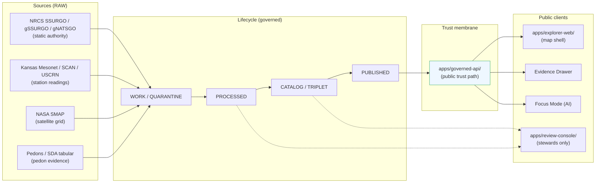

<!-- [KFM_META_BLOCK_V2]
doc_id: kfm://doc/<uuid>
title: Soil Domain — API Contracts
type: standard
version: v1
status: draft
owners: <TBD: docs steward + soil domain steward>
created: 2026-05-19
updated: 2026-05-19
policy_label: public
related:
  - docs/domains/soil/README.md
  - docs/domains/soil/SOURCES.md
  - docs/architecture/governed-api.md
  - docs/doctrine/trust-membrane.md
  - schemas/contracts/v1/runtime/decision_envelope.schema.json
  - schemas/contracts/v1/soil/
  - contracts/soil/
  - policy/domains/soil/
tags: [kfm, soil, api, contracts, decision-envelope, evidence-drawer, focus-mode]
notes:
  - "PROPOSED across implementation; doctrine is CONFIRMED per Atlas v1.0 §5 (Soil) and §24.3 (Decision Outcome Envelope)."
  - "Route names UNKNOWN; the only CONFIRMED public trust path is apps/governed-api/."
  - "Soil sub-path under schemas/contracts/v1/ has a known naming variance — see §13 OPEN-SOIL-API-01."
[/KFM_META_BLOCK_V2] -->

# Soil Domain — API Contracts

PROPOSED contract surface, decision-envelope shape, and finite-outcome behavior for every public Soil API in KFM — the boundary every Explorer view, Evidence Drawer, and Focus Mode answer MUST flow through.

[](#)
[](#)
[](#)
[](#)
[](#)
[](#)
[](#)

> **Status:** `draft` · **Owners:** `TBD` (docs steward + soil domain steward) · **Last updated:** 2026-05-19 · **Doctrine source:** Domains Atlas v1.0 §5 (Soil), §20.3 (Master API Surface Table), §24.3 (Decision Outcome Envelope) · **Directory Rules basis:** `docs/domains/soil/` per Directory Rules §3 Step 3.

---

<a id="top"></a>

## Contents

- [1. Scope and audience](#1-scope-and-audience)
- [2. Repo fit](#2-repo-fit)
- [3. The Soil trust membrane (diagram)](#3-the-soil-trust-membrane-diagram)
- [4. API surface table](#4-api-surface-table)
- [5. The decision envelope contract](#5-the-decision-envelope-contract)
- [6. Finite outcomes — when, what, and what is forbidden](#6-finite-outcomes--when-what-and-what-is-forbidden)
- [7. Surface-by-surface contract](#7-surface-by-surface-contract)
  - [7.1 Soil feature / detail resolver](#71-soil-feature--detail-resolver)
  - [7.2 Soil layer manifest resolver](#72-soil-layer-manifest-resolver)
  - [7.3 Soil Evidence Drawer payload](#73-soil-evidence-drawer-payload)
  - [7.4 Soil Focus Mode answer (AI runtime)](#74-soil-focus-mode-answer-ai-runtime)
  - [7.5 Soil evidence resolver](#75-soil-evidence-resolver)
- [8. Support-type separation — mandatory](#8-support-type-separation--mandatory)
- [9. Sensitivity, rights, and redaction](#9-sensitivity-rights-and-redaction)
- [10. Validators and tests](#10-validators-and-tests)
- [11. Governed AI behavior](#11-governed-ai-behavior)
- [12. Schema and contract responsibility roots](#12-schema-and-contract-responsibility-roots)
- [13. Open questions and verification backlog](#13-open-questions-and-verification-backlog)
- [14. Related docs](#14-related-docs)
- [Appendix A — Illustrative JSON skeletons](#appendix-a--illustrative-json-skeletons)
- [Appendix B — Cross-domain consumer matrix](#appendix-b--cross-domain-consumer-matrix)

---

## 1. Scope and audience

This document is the **public-contract specification** for the Soil lane's governed API surfaces. It is not the implementation, and it is not a tutorial. It tells reviewers, API authors, UI authors, and AI surface stewards:

- What surfaces the Soil lane is permitted to expose publicly.
- What DTO each surface returns.
- What finite outcomes each surface MAY return — and which it MUST NOT.
- Where the schemas live, where the policy lives, where the proofs live.
- Which checks must pass before a Soil claim becomes public.

**CONFIRMED doctrine (Atlas v1.0 §5 J / §20.3):** every Soil surface returns a finite outcome from the set `{ANSWER, ABSTAIN, DENY, ERROR}` (plus the cross-cutting validator-class outcomes `PASS / FAIL` and the release-class outcomes `HOLD`, `ALLOW`, `RESTRICT`). Soil is **not** a sensitive-default lane like Archaeology or People — most authoritative SSURGO/gNATSGO layers default to **T0** under the per-domain sensitivity matrix — but **support-type separation is still mandatory** and farm-specific / owner-specific / operational sensor data is **never** public-by-default.

> [!IMPORTANT]
> **Soil's two non-obvious rules.** (1) A static survey, a gridded derivative, a station reading, a satellite grid, a pedon profile, and an interpretation are **not interchangeable surfaces** — collapsing them is the headline failure mode for this lane. (2) Public clients consume Soil only through `apps/governed-api/`; reading from `data/raw|work|quarantine|catalog` directly is a trust-membrane violation regardless of which UI does it.

[Back to top](#top)

---

## 2. Repo fit

| Aspect | Value | Status |
|---|---|---|
| This file's path | `docs/domains/soil/API_CONTRACTS.md` | **PROPOSED** path (Directory Rules §3 Step 3: domain as segment inside `docs/`). |
| Parent README | `docs/domains/soil/README.md` | PROPOSED; existence NEEDS VERIFICATION. |
| Upstream doctrine | Domains Atlas v1.0 §5 (Soil), §24.3 (Decision Envelope), §24.13 (Atlas ↔ Dossier ↔ Responsibility Root). | CONFIRMED. |
| Upstream architecture | `docs/architecture/governed-api.md`, `docs/doctrine/trust-membrane.md` | PROPOSED; existence NEEDS VERIFICATION. |
| Downstream implementations | `apps/governed-api/` (trust membrane), `apps/explorer-web/` (map UI), `apps/review-console/` (steward UI). | PROPOSED route names; package presence NEEDS VERIFICATION. |
| Schema home | `schemas/contracts/v1/soil/` (atlas wording) or `schemas/contracts/v1/domains/soil/` (Directory Rules §3 wording). | **NEEDS VERIFICATION** — naming variance, see §13 OPEN-SOIL-API-01. |
| Contract home | `contracts/soil/` (atlas wording) or `contracts/domains/soil/` (Directory Rules §3 wording). | NEEDS VERIFICATION — same variance. |
| Policy home | `policy/domains/soil/` | PROPOSED per Directory Rules §6.5. |
| Test home | `tests/domains/soil/`; fixtures at `tests/fixtures/domains/soil/` or `fixtures/domains/soil/`. | PROPOSED per Directory Rules §6.6. |

> [!NOTE]
> The atlas crosswalk (§24.13) writes `schemas/contracts/v1/soil/`; Directory Rules §3 Step 3 prescribes `schemas/contracts/v1/domains/<domain>/`. Both are **PROPOSED** and both are defensible. An ADR is needed before either is treated as canonical — tracked here as **OPEN-SOIL-API-01** and adjacent to atlas backlog item **ADR-S-01** (schema-home rule).

[Back to top](#top)

---

## 3. The Soil trust membrane (diagram)

CONFIRMED doctrine: public clients MUST consume Soil through `apps/governed-api/`. The renderer is downstream of governance; `apps/explorer-web/` MUST NOT read `data/raw|work|quarantine|catalog` directly.



> [!WARNING]
> Any arrow from `RAW / WORK / QUARANTINE / CATALOG` directly to a public client is a **trust-membrane violation**. The `apps/review-console/` dotted edges to CATALOG and WORK are role-gated, audited, and **never** the normal public path (Directory Rules §7.1).

[Back to top](#top)

---

## 4. API surface table

The five surfaces below are the **complete public Soil API contract**. Adding a sixth requires an ADR (Directory Rules §2.4). All routes are **UNKNOWN** until the governed-api package is inspected in a mounted repo.

| # | Surface | DTO / schema | Permitted outcomes | Public? | Status |
|---|---|---|---|---|---|
| **S1** | Soil feature / detail resolver | `DomainFeatureEnvelope` + `SoilDecisionEnvelope` (specialization of `DecisionEnvelope`) | `ANSWER` / `ABSTAIN` / `DENY` / `ERROR` | yes (governed) | PROPOSED · route **UNKNOWN** |
| **S2** | Soil layer manifest resolver | `LayerManifest` (domain layer descriptor projection) | `ANSWER` / `DENY` / `ERROR` | yes (governed) | PROPOSED · route **UNKNOWN** |
| **S3** | Soil Evidence Drawer payload | `EvidenceDrawerPayload` + `EvidenceBundle` projection | `ANSWER` / `ABSTAIN` / `DENY` / `ERROR` | yes (governed) | PROPOSED · route **UNKNOWN** |
| **S4** | Soil Focus Mode answer (AI runtime) | `RuntimeResponseEnvelope` + `AIReceipt` | `ANSWER` / `ABSTAIN` / `DENY` / `ERROR` | yes (governed) | PROPOSED · route **UNKNOWN** |
| **S5** | Soil evidence resolver | `EvidenceBundle` (resolved from `EvidenceRef`) | `ANSWER` / `ABSTAIN` / `DENY` / `ERROR` | yes (governed) | PROPOSED · route **UNKNOWN** |

**Doctrine basis (CONFIRMED):** Atlas v1.0 §5 J (Soil API, contract, and schema surfaces) lists S1–S4 verbatim. S5 (evidence resolver) is added here per Atlas §20.3 (Master API Surface Table) which records `Evidence resolver` as an all-domain surface returning `ANSWER / ABSTAIN / DENY / ERROR`.

[Back to top](#top)

---

## 5. The decision envelope contract

Every governed Soil surface produces (or wraps) a **DecisionEnvelope**. The envelope is the shape every UI, audit trail, correction chain, DSSE receipt, and rollback rehearsal joins on.

### 5.1 Canonical envelope shape (PROPOSED, illustrative)

```json
{
  "decision_id":   "f0bca7e1-1f3b-4f63-bd5a-9f8f4f6c11ee",
  "outcome":       "ANSWER",
  "policy_family": "promotion",
  "reasons":       [],
  "obligations":   [],
  "evaluated_at":  "2026-05-19T14:22:08Z"
}
```

| Field | Type | Meaning | Status |
|---|---|---|---|
| `decision_id` | UUID | Join key. Released artifacts cite it; correction lineage chains them; DSSE receipts wrap them. | PROPOSED |
| `outcome` | enum | One of `ANSWER` / `ABSTAIN` / `DENY` / `ERROR`. (Some downstream consumers extend with `HOLD`, `NARROWED`, `BOUNDED`; see §6.) | **CONFIRMED doctrine**; enum surface **PROPOSED** |
| `policy_family` | string | One of `promotion` / `access` / `render` / `capability` / `consent` / `sensitivity`. | PROPOSED |
| `reasons[]` | string[] | Deny / abstain reason codes (e.g. `missing_spec_hash`, `support_type_collapse`, `unresolved_rights`). | PROPOSED |
| `obligations[]` | object[] | Advisory follow-ups, e.g. `{type: "redact", op: "generalize_geometry", level: "coarse"}`, `{type: "hold", op: "steward_review"}`. | PROPOSED — structured form preferred; string form is legacy. |
| `evaluated_at` | ISO-8601 | When the policy module ran. | PROPOSED |

**PROPOSED schema home:** `schemas/contracts/v1/runtime/decision_envelope.schema.json` (Atlas card KFM-P5-PROG-0001 / KFM-P28-PROG-0006). This file is **not** Soil-specific — the envelope is cross-cutting. The Soil specialization (`SoilDecisionEnvelope`) is a **brand**, not a divergent shape; it inherits the envelope and constrains `policy_family` and `reasons[]` to the Soil-lane vocabulary.

> [!NOTE]
> **Why the envelope is tiny on purpose.** The corpus is explicit (Pass-5 / KFM-P5-PROG-0001 expansion): keep the envelope minimal so downstream consumers don't need module-specific parsers. Sensitivity drawers, Evidence Drawers, and review consoles carry richer per-surface payloads alongside the envelope — not inside it.

[Back to top](#top)

---

## 6. Finite outcomes — when, what, and what is forbidden

CONFIRMED doctrine (Atlas v1.0 §24.3, `kfm_unified_doctrine_synthesis.md` §11). Each row applies to **every** Soil surface that may emit that outcome.

| Outcome | When | Required artifacts | Public-surface effect |
|---|---|---|---|
| **`ANSWER`** | Evidence sufficient, policy permits, release state allows, review (if required) recorded. | `EvidenceBundle` resolved; `PolicyDecision = ALLOW`; `ReleaseManifest` applies. | Substantive answer with Evidence Drawer and citation. |
| **`ABSTAIN`** | Evidence insufficient, surface cannot cite, evidence stale and no released alternative. | `AIReceipt` with reason code; **no claim emitted**. | Non-substantive note with a reason. Never invents. |
| **`DENY`** | Policy, rights, sensitivity, or release state forbids the answer. | `PolicyDecision = DENY` + reason code; `AIReceipt` records denial. | Denial reason; offers an alternative non-restricted surface where possible. |
| **`ERROR`** | Governed API cannot evaluate — missing schema, malformed query, contract violation, infrastructure failure. | Error envelope with diagnostic code; **no claim leakage**. | Finite, actionable error; never silently falls through to another lane. |
| **`HOLD`** *(release/correction class)* | Promotion / release / correction paused pending steward, rights-holder, or policy review. | `ReviewRecord` pending; `PolicyDecision = HOLD`. | Surface remains in prior state; no silent rollback or replacement. |
| **`PASS` / `FAIL`** *(validator class)* | Internal validator outcome; not surfaced directly to the public. | `ValidationReport`. | Internal only. |

### 6.1 Outcome × surface — forbidden behaviors

The matrix below names what **MUST NOT** happen on each surface (Atlas §24.3.2 + ENCY + DIRRULES).

| Surface | Permitted outcomes | Forbidden behavior (must not happen) |
|---|---|---|
| **S1** feature / detail | `ANSWER` / `ABSTAIN` / `DENY` / `ERROR` | Returning an unreleased candidate as `ANSWER`; exposing internal store identifiers; collapsing support-types. |
| **S2** layer manifest | `ANSWER` / `DENY` / `ERROR` | Returning a layer that lacks a `ReleaseManifest`; serving `WORK` or `CATALOG` layers to public clients. |
| **S3** Evidence Drawer | `ANSWER` / `ABSTAIN` / `DENY` / `ERROR` | Returning a payload that includes restricted geometry, owner-identifying fields, or uncited claim text. |
| **S4** Focus Mode | `ANSWER` / `ABSTAIN` / `DENY` / `ERROR` | Generating uncited language as `ANSWER`; substituting model output for `EvidenceBundle`; treating SMAP as SSURGO; treating gNATSGO as a station reading. |
| **S5** evidence resolver | `ANSWER` / `ABSTAIN` / `DENY` / `ERROR` | Returning a bundle whose `spec_hash` does not match the requested `EvidenceRef`; returning quarantined evidence as `ANSWER`. |

[Back to top](#top)

---

## 7. Surface-by-surface contract

Each subsection below specifies: route status, DTO, outcomes, required gates, and the most-likely-violated invariant for that surface. Field-level JSON skeletons appear in [Appendix A](#appendix-a--illustrative-json-skeletons).

### 7.1 Soil feature / detail resolver

| Field | Value |
|---|---|
| **Surface ID** | S1 |
| **Route** | **UNKNOWN** — exact route not yet specified by `apps/governed-api/`. PROPOSED placeholder shape: `GET /v1/soil/features/{feature_id}`. |
| **DTO** | `DomainFeatureEnvelope` containing a `SoilDecisionEnvelope` and (on `ANSWER`) a public-safe feature projection. |
| **Outcomes** | `ANSWER` / `ABSTAIN` / `DENY` / `ERROR` (CONFIRMED). |
| **Required gates (CONFIRMED doctrine)** | `SourceDescriptor` exists; support-type recorded; `EvidenceBundle` resolves; release state allows; `policy/domains/soil/` permits. |
| **Most-likely-violated invariant** | **Support-type collapse** — returning a SMAP cell as if it were SSURGO, or returning a Mesonet point reading as if it were a gridded derivative. See §8. |

### 7.2 Soil layer manifest resolver

| Field | Value |
|---|---|
| **Surface ID** | S2 |
| **Route** | **UNKNOWN**. PROPOSED placeholder shape: `GET /v1/soil/layers/{layer_id}/manifest`. |
| **DTO** | `LayerManifest` (domain layer descriptor projection). |
| **Outcomes** | `ANSWER` / `DENY` / `ERROR` (CONFIRMED — **no `ABSTAIN`**; a layer either has a `ReleaseManifest` or it cannot publish at all). |
| **Required gates** | `ReleaseManifest` exists; layer is `PUBLISHED` (Directory Rules lifecycle); rollback target is valid; correction path is recorded. |
| **Most-likely-violated invariant** | Serving a `CATALOG`-stage layer to a public client because the explorer is "almost ready to ship." Layers without `ReleaseManifest` MUST `DENY`. |

### 7.3 Soil Evidence Drawer payload

| Field | Value |
|---|---|
| **Surface ID** | S3 |
| **Route** | **UNKNOWN**. PROPOSED placeholder shape: `GET /v1/soil/evidence-drawer/{claim_ref}`. |
| **DTO** | `EvidenceDrawerPayload` = governed UI projection of `EvidenceBundle` + citations + policy/review/release state + stale-state + correction links. |
| **Outcomes** | `ANSWER` / `ABSTAIN` / `DENY` / `ERROR`. |
| **Required gates** | `EvidenceBundle` resolvable; citation set non-empty; `PolicyDecision` allows; sensitivity transform receipt present if any redaction applied. |
| **Most-likely-violated invariant** | Leaking restricted geometry (owner-identifying parcels, operational sensor location) or uncited prose into the drawer body. The drawer is a **projection**, not a re-derivation. |

> [!NOTE]
> **Drawer is a projection, not the canonical evidence.** Per the MapLibre Components corpus (ML-056-014 / 015), the drawer schema exists so the UI can evolve without renegotiating the canonical `EvidenceBundle`. Tests MUST assert the projection does not drop citation, policy, review, or release state.

### 7.4 Soil Focus Mode answer (AI runtime)

| Field | Value |
|---|---|
| **Surface ID** | S4 |
| **Route** | **UNKNOWN**. PROPOSED placeholder shape: `POST /v1/soil/focus`. |
| **DTO** | `RuntimeResponseEnvelope` + `AIReceipt` (+ optional `CitationValidationReport`). |
| **Outcomes** | `ANSWER` / `ABSTAIN` / `DENY` / `ERROR`. AI surface NEVER root truth. |
| **Required gates** | `MapContextEnvelope` is bound to released layers only; `EvidenceBundle` resolves and citation closure passes; `AIReceipt` is emitted for every answer regardless of outcome. |
| **Most-likely-violated invariant** | **Uncited generation surfacing as `ANSWER`.** The cite-or-abstain rule says: if citation validation fails, the surface `ABSTAIN`s. AI text does **not** substitute for `EvidenceBundle`. |

### 7.5 Soil evidence resolver

| Field | Value |
|---|---|
| **Surface ID** | S5 |
| **Route** | **UNKNOWN**. PROPOSED placeholder shape: `GET /v1/evidence/{evidence_ref_id}` (cross-domain; not Soil-specific). |
| **DTO** | `EvidenceBundle` resolved from `EvidenceRef`; carries identity, `spec_hash`, inputs, parameters, artifacts, checks, integrity, and signatures (per atlas card KFM-P26-PROG-0004). |
| **Outcomes** | `ANSWER` / `ABSTAIN` / `DENY` / `ERROR`. |
| **Required gates** | `EvidenceRef` resolves; expected bundle digest matches; resolution policy metadata permits. |
| **Most-likely-violated invariant** | Returning a bundle whose `spec_hash` does not match the requested `EvidenceRef`. The triad (atlas card KFM-P26-IDEA-0002) is: deterministic `spec_hash` lookup, runtime run-receipt lookup, quarantine attestation for cross-trust-boundary inputs. |

[Back to top](#top)

---

## 8. Support-type separation — mandatory

CONFIRMED doctrine (Atlas v1.0 §5.I): **support-type separation is mandatory in the Soil lane.** A static survey, a gridded derivative, a station reading, a satellite grid, a pedon profile, and an interpretation **cannot masquerade as one surface**.

| Support type (ubiquitous-language term) | Example source families | Public default tier | Forbidden equivalence |
|---|---|---|---|
| `authoritative_static_soil` | NRCS SSURGO, USDA NRCS SDA, NRCS gSSURGO, NRCS gNATSGO (static authority projections) | T0 | MUST NOT be served as if it were a station reading or a satellite grid. |
| `gridded_derivative_soil` | gNATSGO / SoilGrids gridded products (where applicable) | T0 (resolution-tagged) | MUST NOT be served as if it were an authoritative static survey at finer scale. |
| `station_soil_moisture` | Kansas Mesonet, NRCS SCAN, NOAA USCRN | T0 (public observations); operational sensor exposure NEEDS VERIFICATION | MUST NOT be served as a gridded surface. |
| `satellite_grid_soil_moisture` | NASA SMAP (~1 km / coarser) | T0 with resolution tag | MUST NOT be served as a station reading or an SSURGO surface. |
| `pedon_evidence` | SDA pedon / horizon detail | T0 (public profile context) | MUST NOT be served as a continuous surface. |
| `interpretation` | Hydrologic Soil Group, ErosionRisk, SuitabilityRating | T0/T1 depending on derivative | MUST NOT be served as if it were an observation. |

> [!CAUTION]
> **The headline failure mode.** Conflating a 1-km SMAP cell with a 10-m SSURGO polygon — or quietly resampling between them in the API — produces a public-safe-looking surface that is **doctrinally a lie**. The corresponding validator family is `support-type separation denial` (Atlas v1.0 §5.K), and it is a required negative-state test before any Soil release.

[Back to top](#top)

---

## 9. Sensitivity, rights, and redaction

| Object class | Default tier | Allowed transforms (PROPOSED) | Required gates |
|---|---|---|---|
| SSURGO / gNATSGO / gSSURGO public layers | T0 | None required. | Standard promotion gates A–G; `ReleaseManifest`. |
| Hydrologic Soil Group, ErosionRisk, SuitabilityRating | T0 / T1 | Resolution tag; fitness-for-use label. | `AggregationReceipt` where derived. |
| Soil moisture station readings (Kansas Mesonet, SCAN, USCRN) | T0 (public observations) | Stale-state badge; cadence disclosure. | Stale-state policy. |
| SMAP satellite grid | T0 | Resolution tag; revision date. | Standard gates. |
| Pedon / SoilProfileView | T0 (public horizon detail) | Owner-identifying joins denied. | Sensitivity-side join denial. |
| **Farm-specific / owner-specific / operational sensor metadata** | **T1 / T2 / T4 depending on join risk** | Aggregation; private-join denial. Owner × parcel → DENY. | `policy/domains/soil/` + `policy/sensitivity/` (rights/operator-sensitive joins). |
| Unpublished / proprietary / under-review survey | **T2 / T4** | Steward review; release only after `PolicyDecision = ALLOW`. | `ReviewRecord` + `ReleaseManifest`. |

**CONFIRMED doctrine (ENCY / DIRRULES):** unclear rights, unresolved source role, missing evidence, unresolved sensitivity, or absent release state **blocks public promotion**. The trust-membrane stance for Soil is **public-safe by default** at appropriate scale — Soil is not Archaeology — but the "appropriate scale" qualifier is doing real work: false-precision and silent resampling are doctrinal red lines.

[Back to top](#top)

---

## 10. Validators and tests

PROPOSED required negative-state and admission tests for Soil API releases. Validators MUST exercise the DENY / ABSTAIN / ERROR paths, not just the happy path.

| ID | Validator family | What it proves | Status |
|---|---|---|---|
| V-SOIL-01 | MUKEY / COKEY / CHKEY lineage | Identity rule (`source id + object role + temporal scope + normalized digest`) round-trips across the SSURGO key hierarchy. | PROPOSED (Atlas §5.K). |
| V-SOIL-02 | Horizon depth sanity | Horizon `top_depth_cm < bottom_depth_cm`; horizons within a component do not overlap or gap silently. | PROPOSED. |
| V-SOIL-03 | Soil-moisture unit / depth / QC | Mesonet / SCAN / USCRN values carry unit (`vwc` vs `gravimetric`), depth, QC flag, observation cadence. | PROPOSED. |
| V-SOIL-04 | **Support-type separation denial** | Collapsing SSURGO ↔ gNATSGO ↔ SMAP ↔ Mesonet → `DENY` with reason `support_type_collapse`. | PROPOSED — **required**. |
| V-SOIL-05 | Dual-hash stability | `spec_hash` and content digest are stable across re-validation runs for unchanged inputs. | PROPOSED. |
| V-SOIL-06 | Catalog closure + Evidence Drawer | A claim's `EvidenceRef` resolves to a complete `EvidenceBundle`; the drawer projection does not drop citation / policy / review / release state. | PROPOSED. |
| V-SOIL-07 | Layer manifest closure | `LayerManifest` returns `DENY` for unreleased layers; never `ABSTAIN`. | INFERRED from §6 outcome table. |
| V-SOIL-08 | Focus Mode citation closure | An AI answer that fails `CitationValidationReport` → `ABSTAIN`, with `AIReceipt`. | INFERRED from §7.4. |
| V-SOIL-09 | Owner-identifying join denial | Owner × parcel × farm-specific joins → `DENY` with reason `unresolved_rights` or `private_join_denial`. | PROPOSED (per §9 / Atlas §5.D). |

> [!TIP]
> **Coverage that counts.** Positive-only coverage is an anti-pattern. Every validator above MUST ship with a negative fixture: a stale-source fixture that produces `ABSTAIN`, a support-type-collapse fixture that produces `DENY`, a malformed-query fixture that produces `ERROR`. Validators that only return `PASS` are not exercising the contract.

[Back to top](#top)

---

## 11. Governed AI behavior

CONFIRMED doctrine / PROPOSED implementation (Atlas v1.0 §5.L):

- AI **may** summarize released Soil `EvidenceBundle`s.
- AI **may** compare evidence across SSURGO / gNATSGO / Mesonet / SMAP, **provided support-type is preserved**.
- AI **may** explain limitations (resolution mismatch, vintage, scale).
- AI **may** draft steward-review notes.
- AI **MUST** `ABSTAIN` when evidence is insufficient.
- AI **MUST** `DENY` when policy, rights, sensitivity, or release state blocks the request.
- AI is **never** root truth. `EvidenceBundle` outranks generated language.

Order of operations for every Focus Mode call (PROPOSED):

1. Define scope and bind `MapContextEnvelope` to **released** layers only.
2. Retrieve `EvidenceRef`s.
3. Resolve `EvidenceRef` → `EvidenceBundle`.
4. Apply policy and sensitivity checks (`policy/domains/soil/`, `policy/sensitivity/`).
5. Generate language **only** for claims with citation closure; emit `CitationValidationReport`.
6. Emit `RuntimeResponseEnvelope` + `AIReceipt`.

[Back to top](#top)

---

## 12. Schema and contract responsibility roots

| Concern | PROPOSED path (atlas wording) | Alternate (Directory Rules §3 Step 3 wording) | Status |
|---|---|---|---|
| Soil schemas | `schemas/contracts/v1/soil/` | `schemas/contracts/v1/domains/soil/` | NEEDS VERIFICATION — naming variance, see §13 OPEN-SOIL-API-01. |
| Soil contract prose | `contracts/soil/` | `contracts/domains/soil/` | NEEDS VERIFICATION — same variance. |
| Soil policy | `policy/domains/soil/` | (same) | PROPOSED per Directory Rules §6.5. |
| Decision envelope schema (cross-domain) | `schemas/contracts/v1/runtime/decision_envelope.schema.json` | (same) | PROPOSED (atlas card KFM-P5-PROG-0001 / KFM-P28-PROG-0006). |
| Evidence bundle schema (cross-domain) | `schemas/contracts/v1/evidence/evidence_bundle.schema.json` | (same) | PROPOSED (atlas card KFM-P26-PROG-0004). |
| Evidence ref schema (cross-domain) | `schemas/contracts/v1/evidence/evidence_ref.schema.json` | (same) | PROPOSED (atlas card KFM-P26-PROG-0005). |
| Layer manifest schema (cross-domain) | `schemas/contracts/v1/release/` *(home NEEDS VERIFICATION)* | (same) | NEEDS VERIFICATION. |
| Tests | `tests/domains/soil/` | (same) | PROPOSED per Directory Rules §6.6. |
| Fixtures | `fixtures/domains/soil/` or `tests/fixtures/domains/soil/` | (same) | PROPOSED per Directory Rules §6.6. |

> [!IMPORTANT]
> **Schema-home rule (ADR-0001, Directory Rules §6.4).** The default machine-schema home is `schemas/contracts/v1/...`. Authoring a Soil schema under `contracts/soil/<x>.schema.json` is **lineage / CONFLICTED** and MUST be migrated under ADR-0001 before any new schema lands. KFM MUST NOT maintain divergent definitions in both `schemas/` and `contracts/`.

[Back to top](#top)

---

## 13. Open questions and verification backlog

| ID | Question | Why it matters | Resolution path |
|---|---|---|---|
| **OPEN-SOIL-API-01** | `schemas/contracts/v1/soil/` (Atlas §24.13) vs. `schemas/contracts/v1/domains/soil/` (Directory Rules §3 Step 3). | A new domain segment without an ADR risks competing schema homes — the headline anti-pattern (Atlas §24.9.1). | ADR; parallel to atlas backlog **ADR-S-01**. Until resolved, both forms are PROPOSED; do not commit a schema until ADR lands. |
| **OPEN-SOIL-API-02** | Exact route names for S1–S5. | All five surfaces have `route TBD` per Atlas §5.J. | Mount `apps/governed-api/` and inspect; document route names here. UNKNOWN until then. |
| **OPEN-SOIL-API-03** | `SoilDecisionEnvelope` — is it a brand on the canonical `DecisionEnvelope`, or a divergent schema? | Atlas §5.J names a `SoilDecisionEnvelope`; atlas card KFM-P5-PROG-0001 keeps the envelope intentionally minimal and cross-cutting. | PROPOSED resolution: brand-only (Soil constrains `policy_family` and `reasons[]`, not the envelope shape). ADR if this is contested. |
| **OPEN-SOIL-API-04** | `obligations[]` shape — structured (`{type, op, level?}`) vs. legacy string form. | The corpus uses both; converging on the structured form is necessary (atlas card KFM-P5-PROG-0001 tensions). | ADR-class only if it changes the envelope schema; otherwise normalize in `schemas/contracts/v1/runtime/`. |
| **OPEN-SOIL-API-05** | Receipt schema layout: top-level `schemas/contracts/v1/receipts/` vs. per-domain `schemas/contracts/v1/<domain>/receipts/`. | A new parallel home is ADR-class per Directory Rules §2.4(5). | Atlas backlog **ADR-S-03**. |
| **OPEN-SOIL-API-06** | Public exposure of operational sensor metadata (Kansas Mesonet station-level operational details). | Soil station readings default T0, but operational-sensor metadata (firmware, calibration history, owner-identifying installation context) may not. | Steward review + `policy/sensitivity/` + per-source agreement; NEEDS VERIFICATION per source. |
| **OPEN-SOIL-API-07** | Soil ↔ Agriculture private-join behavior at the API boundary. | Agriculture defaults to private-join denial (Atlas §9). A Soil API answer that *embeds* an Agriculture join could leak. | Cross-lane policy test; cross-reference `policy/domains/agriculture/`. |
| **OPEN-SOIL-API-08** | CI badge target for this document. | Top-of-file badges include a `ci: TODO` placeholder. | Wire to actual CI run for `tests/domains/soil/` once mounted-repo evidence exists. |

[Back to top](#top)

---

## 14. Related docs

- [`docs/domains/soil/README.md`](./README.md) — Soil lane orientation (PROPOSED; existence NEEDS VERIFICATION).
- [`docs/domains/soil/SOURCES.md`](./SOURCES.md) — Soil source families and per-source descriptors (PROPOSED).
- [`docs/architecture/governed-api.md`](../../architecture/governed-api.md) — Trust-membrane architecture (PROPOSED).
- [`docs/doctrine/trust-membrane.md`](../../doctrine/trust-membrane.md) — Why public clients consume only governed API (PROPOSED).
- [`docs/doctrine/lifecycle-law.md`](../../doctrine/lifecycle-law.md) — `RAW → WORK/QUARANTINE → PROCESSED → CATALOG/TRIPLET → PUBLISHED` (PROPOSED).
- [`docs/adr/ADR-0001-schema-home.md`](../../adr/ADR-0001-schema-home.md) — Schema home rule (PROPOSED; CONFIRMED authored in prior session; mounted presence NEEDS VERIFICATION).
- [`docs/standards/PROV.md`](../../standards/PROV.md) — W3C PROV-O / PAV profile (CONFIRMED authored in prior session).
- [`directory-rules.md`](../../../directory-rules.md) — Placement authority for all paths in this doc.
- Atlas v1.0 §5 (Soil), §20.3 (Master API Surface Table), §24.3 (Decision Outcome Envelope), §24.13 (Atlas ↔ Dossier ↔ Responsibility Root Crosswalk).

[Back to top](#top)

---

## Appendix A — Illustrative JSON skeletons

> These are **illustrative**, not normative. Field selection and casing reflect atlas-card descriptions; final shape lives in `schemas/contracts/v1/`.

<details>
<summary><strong>A.1 — <code>SoilDecisionEnvelope</code> (PROPOSED brand on canonical envelope)</strong></summary>

```json
{
  "decision_id":   "f0bca7e1-1f3b-4f63-bd5a-9f8f4f6c11ee",
  "outcome":       "DENY",
  "policy_family": "sensitivity",
  "reasons":       ["support_type_collapse", "smap_grid_returned_as_ssurgo_polygon"],
  "obligations":   [
    { "type": "hold", "op": "steward_review" }
  ],
  "evaluated_at":  "2026-05-19T14:22:08Z"
}
```

</details>

<details>
<summary><strong>A.2 — Soil feature / detail <code>ANSWER</code> (PROPOSED, illustrative)</strong></summary>

```json
{
  "envelope": {
    "decision_id":   "8e21...",
    "outcome":       "ANSWER",
    "policy_family": "access",
    "reasons":       [],
    "obligations":   [],
    "evaluated_at":  "2026-05-19T14:22:08Z"
  },
  "feature": {
    "object_family": "SoilMapUnit",
    "support_type":  "authoritative_static_soil",
    "identity": {
      "source_id":          "nrcs.ssurgo",
      "object_role":        "authority",
      "temporal_scope":     "2025-09-01/2025-09-01",
      "normalized_digest":  "sha256:..."
    },
    "release_manifest_id": "rm-soil-2026q2-...",
    "evidence_ref":        "kfm:evidence/ssurgo-mu/..."
  }
}
```

</details>

<details>
<summary><strong>A.3 — Layer manifest <code>DENY</code> (PROPOSED, illustrative)</strong></summary>

```json
{
  "envelope": {
    "decision_id":   "b0c3...",
    "outcome":       "DENY",
    "policy_family": "promotion",
    "reasons":       ["missing_release_manifest"],
    "obligations":   [],
    "evaluated_at":  "2026-05-19T14:22:08Z"
  }
}
```

</details>

<details>
<summary><strong>A.4 — Focus Mode <code>ABSTAIN</code> (PROPOSED, illustrative)</strong></summary>

```json
{
  "envelope": {
    "decision_id":   "1d4e...",
    "outcome":       "ABSTAIN",
    "policy_family": "access",
    "reasons":       ["citation_validation_failed", "evidence_stale_no_alternative"],
    "obligations":   [],
    "evaluated_at":  "2026-05-19T14:22:08Z"
  },
  "ai_receipt": {
    "model_adapter":   "<adapter id>",
    "evidence_refs":   ["kfm:evidence/mesonet-soilmoist/..."],
    "policy_decision": "ABSTAIN",
    "citation_report": "fail"
  }
}
```

</details>

[Back to top](#top)

---

## Appendix B — Cross-domain consumer matrix

CONFIRMED doctrine (Atlas v1.0 §5.F, §24.14): Soil **publishes** to the consumers below; consumers cite Soil's public-safe surface; no consumer modifies Soil's canonical state.

| Consumer domain | What Soil exposes | Relation type | Constraint |
|---|---|---|---|
| Agriculture | Soil mapunit context, MUKEY joins, suitability support. | suitability / drought stress / irrigation context | Ownership and source role preserved; sensitivity-side joins (owner × parcel) DENY. |
| Hydrology | Hydrologic Soil Group, infiltration, runoff context, station soil-moisture readings. | infiltration / runoff / soil moisture | Support-type separation enforced; resolution-tagged. |
| Habitat / Fauna / Flora | Substrate and moisture context. | substrate / moisture | No rare-location exposure (Fauna/Flora rare-species lanes deny by default). |
| Geology / Natural Resources | Parent material relation. | parent material context | Does NOT replace lithology truth (Geology owns lithology). |
| Frontier Matrix | Soil cell-level public-safe inputs to matrix views. | matrix-cell input | Matrix-cell release rules apply; correction cascades per `ReleaseManifest`. |

[Back to top](#top)

---

<hr/>

### Related docs

- [Soil README](./README.md) · [Architecture: governed-api](../../architecture/governed-api.md) · [Doctrine: trust membrane](../../doctrine/trust-membrane.md) · [ADR-0001 schema home](../../adr/ADR-0001-schema-home.md) · [Directory Rules](../../../directory-rules.md)

**Last updated:** 2026-05-19 · **Doctrine:** Domains Atlas v1.0 §5, §20.3, §24.3, §24.13 · **Implementation:** PROPOSED · [⬆ Back to top](#top)
