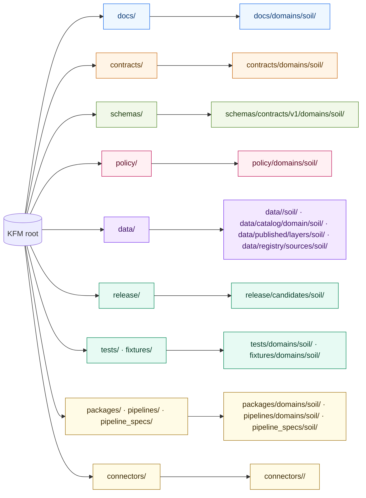
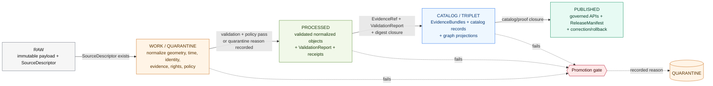
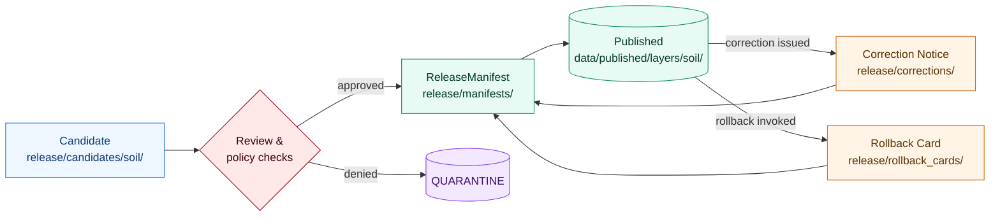

<!-- [KFM_META_BLOCK_V2]
doc_id: kfm://doc/domains/soil/architecture
title: Soil — Domain Architecture
type: standard
version: v0.1
status: draft
owners: <TBD — Soil lane stewards>
created: 2026-05-19
updated: 2026-05-19
policy_label: public
related:
  - docs/domains/soil/README.md
  - docs/doctrine/directory-rules.md
  - docs/doctrine/lifecycle-law.md
  - docs/architecture/contract-schema-policy-split.md
  - contracts/domains/soil/
  - schemas/contracts/v1/domains/soil/
  - policy/domains/soil/
tags: [kfm, domain, soil, architecture, lane]
notes:
  - Greenfield placeholder; doctrine-grounded, implementation-unverified.
  - Path PROPOSED per Directory Rules §3 (domain-as-lane, not as root).
[/KFM_META_BLOCK_V2] -->

# Soil — Domain Architecture

> Lane architecture for the Soil domain inside Kansas Frontier Matrix: object families, source roles, support-type separation, pipeline, contracts, sensitivity posture, and governed surfaces — all anchored to KFM responsibility roots, not to a topic folder.

[](#10-status--maturity)
[](../../doctrine/directory-rules.md)
[](#7-pipeline-shape-raw--published)
[](#9-sensitivity-rights--publication-posture)
[](#)
[](#)

**Status:** draft · **Owners:** `<TBD — Soil lane stewards>` · **Last updated:** 2026-05-19

> [!IMPORTANT]
> This document is a **greenfield architecture draft**. Doctrine and structure are grounded in attached KFM corpus material ([DOM-SOIL], [ENCY], [DIRRULES], [BLD-MANUAL]). Repository implementation — exact paths, routes, schemas, validators, CI, release wiring — is **UNKNOWN / NEEDS VERIFICATION** until checked against the mounted repo. See [§14](#14-verification-backlog--open-questions).

---

## 📑 Contents

1. [Purpose & scope](#1-purpose--scope)
2. [Doctrinal placement (Directory Rules)](#2-doctrinal-placement-directory-rules)
3. [Ubiquitous language](#3-ubiquitous-language)
4. [Object families](#4-object-families)
5. [Source families](#5-source-families)
6. [Support-type separation — the soil-specific invariant](#6-support-type-separation--the-soil-specific-invariant)
7. [Pipeline shape (RAW → PUBLISHED)](#7-pipeline-shape-raw--published)
8. [Cross-lane relations](#8-cross-lane-relations)
9. [Sensitivity, rights & publication posture](#9-sensitivity-rights--publication-posture)
10. [API, contract & schema surfaces](#10-api-contract--schema-surfaces)
11. [Validators, tests & fixtures](#11-validators-tests--fixtures)
12. [Governed AI behavior in this lane](#12-governed-ai-behavior-in-this-lane)
13. [Publication, correction & rollback](#13-publication-correction--rollback)
14. [Verification backlog & open questions](#14-verification-backlog--open-questions)
15. [Related docs](#15-related-docs)

---

## 1. Purpose & scope

**CONFIRMED doctrine / PROPOSED implementation.** The Soil lane governs static soil-survey evidence, gridded soil derivatives, components, horizons, pedons, soil-moisture observations, soil interpretations, suitability, erosion context, and public-safe soil map and API products. [DOM-SOIL] [ENCY]

### 1.1 What this lane owns

| In scope | Notes |
|---|---|
| `SoilMapUnit`, `SoilComponent`, `Horizon`, `Component Horizon Join` | Static survey lineage. [DOM-SOIL] |
| `SoilProperty`, `Hydrologic Soil Group` | Derived attributes carried with source role. [DOM-SOIL] |
| `Soil Moisture Observation` | Station and satellite, support-type-tagged. [DOM-SOIL] |
| `Pedon` / `SoilProfileView` | Profile-level evidence. [DOM-SOIL] |
| `ErosionRisk`, `SuitabilityRating` | Interpretive products with explicit caveats. [DOM-SOIL] |
| `SoilTimeCaveat` | Per-product temporal limitation. [DOM-SOIL] |

### 1.2 What this lane explicitly does **not** own

> [!NOTE]
> Cross-lane authority is governed; cross-lane *relations* are still allowed under [§8](#8-cross-lane-relations).

| Out of scope here | Owning lane |
|---|---|
| Crop and yield claims | Agriculture [DOM-AG] |
| Streamflow, groundwater, flood context | Hydrology / Hazards [DOM-HYD] |
| Lithology, boreholes, stratigraphy | Geology [DOM-GEO] |
| Habitat patches, ecological systems | Habitat [DOM-HAB] |

[↑ back to top](#-contents)

---

## 2. Doctrinal placement (Directory Rules)

> [!WARNING]
> **Soil is a lane, not a root folder.** Directory Rules §3 prohibits a domain name (hydrology, soil, fauna, …) from appearing as a top-level repo folder; soil files live as **segments** inside responsibility roots. [DIRRULES] [BLD-MANUAL]

### 2.1 Where soil files live (PROPOSED map)



<sub><em>Diagram shows the PROPOSED placement pattern derived from Directory Rules §4 Step 3. Actual presence in the mounted repo is NEEDS VERIFICATION.</em></sub>

### 2.2 Path lattice for the Soil lane (PROPOSED)

```text
docs/domains/soil/                       # human-facing: this file, README, runbooks
contracts/domains/soil/                  # object meaning (Markdown contracts)
schemas/contracts/v1/domains/soil/       # JSON Schema shape (ADR-0001 home)
policy/domains/soil/                     # allow/deny/restrict/abstain rules
tests/domains/soil/                      # proof rules are enforceable
fixtures/domains/soil/                   # valid/invalid samples
packages/domains/soil/                   # shared soil libraries (if any)
pipelines/domains/soil/                  # executable pipeline logic
pipeline_specs/soil/                     # declarative pipeline config
connectors/<ssurgo|sda|mesonet|smap|...> # source-specific fetchers
data/raw/soil/        data/quarantine/soil/
data/work/soil/       data/processed/soil/
data/catalog/domain/soil/
data/triplets/soil/
data/published/layers/soil/
data/registry/sources/soil/
data/receipts/soil/   data/proofs/soil/
release/candidates/soil/                 # release decisions + manifests
```

> [!NOTE]
> Every path above is **PROPOSED**. None is asserted as present in the mounted repo. Per Directory Rules §2.5, if the repo diverges, open a drift entry in `docs/registers/DRIFT_REGISTER.md` rather than silently conforming.

[↑ back to top](#-contents)

---

## 3. Ubiquitous language

CONFIRMED terms / PROPOSED field realizations. The lane uses these terms with meaning constrained by source role, evidence, time, and release state. [DOM-SOIL] [ENCY]

| Term | Role in this lane | Status |
|---|---|---|
| `SoilMapUnit` | Polygon-bearing unit of soil survey. | CONFIRMED term · PROPOSED field shape |
| `SoilComponent` | Named soil within a map unit, weighted by percent. | CONFIRMED term · PROPOSED field shape |
| `Horizon` | Vertical layer with depths and properties. | CONFIRMED term · PROPOSED field shape |
| `Component Horizon Join` | Lineage join across MUKEY/COKEY/CHKEY. | CONFIRMED term · PROPOSED field shape |
| `SoilProperty` | Measured/derived attribute of a horizon or component. | CONFIRMED term · PROPOSED field shape |
| `Hydrologic Soil Group` | A/B/C/D classification for runoff potential. | CONFIRMED term · PROPOSED field shape |
| `Soil Moisture Observation` | Time-series observation; depth- and unit-tagged. | CONFIRMED term · PROPOSED field shape |
| `Pedon` / `SoilProfileView` | Profile-level evidence object. | CONFIRMED term · PROPOSED field shape |
| `ErosionRisk` | Interpretive product; **not** an authoritative hazard. | CONFIRMED term · PROPOSED field shape |
| `SuitabilityRating` | Interpretive product; carries fitness-for-use caveats. | CONFIRMED term · PROPOSED field shape |
| `SoilTimeCaveat` | Per-product temporal limitation marker. | CONFIRMED term · PROPOSED field shape |
| `authoritative_static_soil` | Support-type tag for SSURGO-class survey. | CONFIRMED term · PROPOSED field shape |
| `gridded_derivative_soil` | Support-type tag for gSSURGO/gNATSGO-class grids. | CONFIRMED term · PROPOSED field shape |
| `station_soil_moisture` | Support-type tag for in-situ sensor series. | CONFIRMED term · PROPOSED field shape |

[↑ back to top](#-contents)

---

## 4. Object families

PROPOSED identity rule (all families): **`source id + object role + temporal scope + normalized digest`**. [DOM-SOIL]
CONFIRMED temporal rule: source time, observed time, valid time, retrieval time, release time, and correction time stay distinct where material. [ENCY]

<details>
<summary><strong>Per-object summary table</strong> (expand)</summary>

| Object | Purpose in lane | Identity basis | Temporal handling |
|---|---|---|---|
| `SoilMapUnit` | Survey polygon carrier of MUKEY. | PROPOSED deterministic basis. | All six time facets retained. |
| `SoilComponent` | Component within a map unit. | PROPOSED deterministic basis. | All six time facets retained. |
| `Horizon` | Vertical layer of a component. | PROPOSED deterministic basis. | All six time facets retained. |
| `SoilProperty` | Property reading or estimate. | PROPOSED deterministic basis. | All six time facets retained. |
| `Hydrologic Soil Group` | Classification rollup. | PROPOSED deterministic basis. | All six time facets retained. |
| `Soil Moisture Observation` | Sensor or satellite-derived series. | PROPOSED deterministic basis. | All six time facets retained. |
| `Pedon` / `SoilProfileView` | Profile-level evidence. | PROPOSED deterministic basis. | All six time facets retained. |
| `ErosionRisk` | Interpretive rating. | PROPOSED deterministic basis. | All six time facets retained. |
| `SuitabilityRating` | Interpretive rating. | PROPOSED deterministic basis. | All six time facets retained. |
| `Component Horizon Join` | Lineage join object. | PROPOSED deterministic basis. | All six time facets retained. |

</details>

[↑ back to top](#-contents)

---

## 5. Source families

CONFIRMED roster from corpus; per-source **rights and current terms are NEEDS VERIFICATION**; sensitive joins fail closed by doctrine. Freshness is source-vintage or cadence-specific. [DOM-SOIL] [DOM-AG]

| Source family | Role (per use) | Cadence / vintage | Rights / sensitivity | Status |
|---|---|---|---|---|
| NRCS SSURGO | authority / observation / context / model | source-vintage | NEEDS VERIFICATION | [DOM-SOIL] |
| USDA NRCS Soil Data Access (SDA) | authority / observation / context / model | query-time | NEEDS VERIFICATION | [DOM-SOIL] |
| NRCS gSSURGO | authority / gridded derivative | source-vintage | NEEDS VERIFICATION | [DOM-SOIL] |
| NRCS gNATSGO | authority / gridded derivative | source-vintage | NEEDS VERIFICATION | [DOM-SOIL] |
| Kansas Mesonet (soil moisture) | observation (station) | sub-hourly typical | NEEDS VERIFICATION | [DOM-SOIL] |
| NRCS SCAN | observation (station) | hourly typical | NEEDS VERIFICATION | [DOM-SOIL] |
| NOAA USCRN | observation (station) | hourly typical | NEEDS VERIFICATION | [DOM-SOIL] |
| NASA SMAP | observation (satellite grid) | daily typical | NEEDS VERIFICATION | [DOM-SOIL] |
| ISRIC SoilGrids | context (global grid) | versioned | NEEDS VERIFICATION | [DOM-SOIL] · [Pass-10 C10-01] |

> [!IMPORTANT]
> **Source role is not a property of the source; it is a property of the use.** A community-science occurrence is not a legal-status authority; gridded derivatives are not survey truth. [BLD-MANUAL §3.6] Soil sources are admitted via `SourceDescriptor` and gated by `SourceActivationDecision` before connectors and watchers activate. [BLD-MANUAL §3.7]

[↑ back to top](#-contents)

---

## 6. Support-type separation — the soil-specific invariant

> [!CAUTION]
> **Support-type separation is mandatory.** Static survey, gridded derivative, station reading, satellite grid, pedon evidence, and interpretation **cannot masquerade as one surface**. [DOM-SOIL] [ENCY]

A soil reading of "0.27" with no support-type tag is **denied**. The lane carries `authoritative_static_soil`, `gridded_derivative_soil`, and `station_soil_moisture` (and equivalents for satellite, pedon, and interpretation) as first-class tags inside every observation and every derived layer.

```mermaid
flowchart TB
  classDef survey fill:#eaf6ff,stroke:#1f6feb,color:#0b3a75
  classDef grid fill:#fff4e6,stroke:#cb6e17,color:#5a3300
  classDef station fill:#f1f8e9,stroke:#558b2f,color:#1b3a0c
  classDef satellite fill:#fff0f3,stroke:#c2185b,color:#5b0823
  classDef pedon fill:#f3e8ff,stroke:#7c3aed,color:#3d1066
  classDef interp fill:#fffbe6,stroke:#a3781b,color:#3b2a05
  classDef gate fill:#ffe8e8,stroke:#b00020,color:#3b0606

  subgraph ST[Six support types]
    A[authoritative_static_soil\n(SSURGO / SDA)]:::survey
    B[gridded_derivative_soil\n(gSSURGO / gNATSGO / SoilGrids)]:::grid
    C[station_soil_moisture\n(Mesonet / SCAN / USCRN)]:::station
    D[satellite_soil_moisture\n(SMAP)]:::satellite
    E[pedon_evidence\n(profile descriptions)]:::pedon
    F[interpretation\n(ErosionRisk / SuitabilityRating)]:::interp
  end

  ST --> G{Support-type tag present?}:::gate
  G -- no --> X[DENY · ABSTAIN · QUARANTINE]:::gate
  G -- yes --> H[Carry tag through CATALOG → PUBLISHED;\nEvidence Drawer shows support type + caveat]
```

<sub><em>Tagging is invariant across the lifecycle. Aggregation across support types requires an explicit, reviewed derivation step.</em></sub>

[↑ back to top](#-contents)

---

## 7. Pipeline shape (RAW → PUBLISHED)

CONFIRMED doctrine / PROPOSED lane application. Soil follows the canonical lifecycle, with **promotion as a governed state transition** (not a file move). [DIRRULES] [DOM-SOIL]



### 7.1 Per-stage gates (PROPOSED status — implementation NEEDS VERIFICATION)

| Stage | Handling | Gate |
|---|---|---|
| **RAW** | Capture immutable source payload or reference with source role, rights, sensitivity, citation, time, and hash. | `SourceDescriptor` exists. |
| **WORK / QUARANTINE** | Normalize schema, geometry, time, identity, evidence, rights, and policy; hold failures. | Validation and policy gate pass, **or** quarantine reason recorded. |
| **PROCESSED** | Emit validated normalized objects, receipts, and public-safe candidates. | `EvidenceRef`, `ValidationReport`, and digest closure exist. |
| **CATALOG / TRIPLET** | Emit catalog records, `EvidenceBundle`s, graph/triplet projections, release candidates. | Catalog/proof closure passes. |
| **PUBLISHED** | Serve released public-safe artifacts through governed APIs and manifests. | `ReleaseManifest`, correction path, rollback target, and review/policy state exist. |

[↑ back to top](#-contents)

---

## 8. Cross-lane relations

CONFIRMED / PROPOSED. Every cross-lane relation must preserve ownership, source role, sensitivity, and `EvidenceBundle` support. Relations **do not transfer authority**. [DOM-SOIL] [ENCY]

| This lane | Related lane | Relation | Constraint |
|---|---|---|---|
| Soil | Agriculture | soil–crop suitability, irrigation, drought stress | Soil keeps survey/observation authority; crop/yield claims live in Agriculture. |
| Soil | Hydrology | infiltration, runoff, hydrologic group, soil moisture | Soil keeps soil-side authority; streamflow/flood live in Hydrology/Hazards. |
| Soil | Habitat / Fauna / Flora | substrate and moisture context | No rare-location exposure leaks via soil substrate joins. |
| Soil | Geology | parent material relation | Soil does **not** replace lithology truth. |

[↑ back to top](#-contents)

---

## 9. Sensitivity, rights & publication posture

CONFIRMED doctrine: Unclear rights, unresolved source role, missing evidence, unresolved sensitivity, or absent release state **blocks public promotion**. [ENCY] [DIRRULES]

> [!WARNING]
> Soil products are usually public-safe **at appropriate scale**, but **farm-specific, owner-specific, unpublished, proprietary, or operational sensor data require rights and sensitivity review before release**. [BLD-MANUAL §6.2]

### 9.1 Posture summary

| Concern | Default posture |
|---|---|
| Field- or owner-specific identification | **Deny / generalize**; promote only with review. |
| Proprietary or pre-publication survey data | **Quarantine** until rights resolved. |
| Operational sensor metadata (private networks) | **Restricted** unless network operator has authorized release. |
| Public-scale soil maps, hydrologic group, suitability summaries | Public-safe **with support-type and time caveats**. |

[↑ back to top](#-contents)

---

## 10. API, contract & schema surfaces

PROPOSED governed surfaces. Routes, DTOs, and schema homes are not yet verified against the mounted repo.

| Endpoint or artifact | DTO / schema (PROPOSED) | Finite outcomes | Status |
|---|---|---|---|
| Soil feature/detail resolver — route TBD | `SoilDecisionEnvelope` | `ANSWER` / `ABSTAIN` / `DENY` / `ERROR` | PROPOSED · route UNKNOWN |
| Soil layer manifest resolver | `LayerManifest` / domain layer descriptor | `ANSWER` / `DENY` / `ERROR` | PROPOSED · public-safe release only |
| Soil Evidence Drawer payload | `EvidenceDrawerPayload` + `EvidenceBundle` projection | `ANSWER` / `ABSTAIN` / `DENY` / `ERROR` | PROPOSED · evidence- and policy-filtered |
| Soil Focus Mode answer | Runtime Response Envelope + `AIReceipt` | `ANSWER` / `ABSTAIN` / `DENY` / `ERROR` | PROPOSED · AI never root truth |
| Schema home (machine shape) | `schemas/contracts/v1/domains/soil/...` | finite validator outcomes | PROPOSED · ADR-0001 default home [DIRRULES] |
| Contract home (meaning) | `contracts/domains/soil/...` | n/a (semantic Markdown) | PROPOSED |
| Policy home | `policy/domains/soil/...` | `ALLOW` / `DENY` / `RESTRICT` / `ABSTAIN` / `REVIEW` | PROPOSED |

> [!NOTE]
> Per Directory Rules: `contracts/` defines **meaning**, `schemas/` defines **shape**, `policy/` defines **admissibility**, `tests/` + `fixtures/` provide **proof**. None replaces another.

[↑ back to top](#-contents)

---

## 11. Validators, tests & fixtures

PROPOSED set (status NEEDS VERIFICATION in repo). Negative-state coverage (DENY/ABSTAIN/ERROR) is required, not optional.

| Validator / test | Intent | Status |
|---|---|---|
| MUKEY / COKEY / CHKEY lineage | Joins are intact across survey hierarchy. | PROPOSED [DOM-SOIL] |
| Horizon depth sanity | Depths monotonic; ranges within survey norms. | PROPOSED [DOM-SOIL] |
| Soil-moisture unit/depth/QC | Units, sensor depths, and QC flags coherent. | PROPOSED [DOM-SOIL] |
| Support-type separation denial | Mixed-support payloads without explicit derivation **DENY**. | PROPOSED [DOM-SOIL] |
| Dual-hash stability | Canonical digest stable across re-derivation. | PROPOSED [DOM-SOIL] |
| Catalog closure | Every released soil object resolves to an `EvidenceBundle`. | PROPOSED [DOM-SOIL] |
| Evidence Drawer payload | Drawer payload renders source, support type, time caveat, policy state. | PROPOSED [DOM-SOIL] |

<details>
<summary><strong>Negative-state expectations</strong> (expand)</summary>

The lane's validators **must** exercise:

- A SoilMoisture sample with no `support_type` → **DENY**.
- A CATALOG attempt with unresolved `SourceActivationDecision` → **DENY**.
- A Focus Mode question lacking sufficient evidence → **ABSTAIN** with `AIReceipt`.
- A correction request against a tombstoned release → **DENY** with rollback pointer.
- A cross-support aggregation without a derivation step → **DENY**.

Positive-only coverage is treated as an anti-pattern. [DIRRULES] [BLD-MANUAL]

</details>

[↑ back to top](#-contents)

---

## 12. Governed AI behavior in this lane

CONFIRMED doctrine / PROPOSED implementation. [GAI] [DOM-SOIL]

| AI may | AI must `ABSTAIN` when | AI must `DENY` when |
|---|---|---|
| Summarize released Soil `EvidenceBundle`s. | Evidence is insufficient for the asked claim. | Policy, rights, sensitivity, or release state blocks the request. |
| Compare evidence across supports. | Support types differ and no derivation exists. | Source role authority is unresolved. |
| Explain time/scale/support limitations. | Time facets conflict materially. | Living-person, owner-specific, or rare-location exposure is at risk. |
| Draft steward-review notes. | Validation report is missing. | Release state is absent or tombstoned. |

> [!IMPORTANT]
> AI is **interpretive, not root truth**. `EvidenceBundle` outranks generated language. Fluent generation never substitutes for evidence, policy, review state, source authority, or release state.

[↑ back to top](#-contents)

---

## 13. Publication, correction & rollback

CONFIRMED doctrine / PROPOSED implementation. Soil publication requires `ReleaseManifest`, `EvidenceBundle`, validation/policy support, review state where required, correction path, stale-state rule, and rollback target. [ENCY Appendix E] [DOM-SOIL]



[↑ back to top](#-contents)

---

## 14. Verification backlog & open questions

> [!NOTE]
> All items below are **NEEDS VERIFICATION** unless explicitly otherwise. They will be resolved by inspecting the mounted repo or by ADRs.

| ID | Question | What would settle it |
|---|---|---|
| OPEN-SOIL-01 | Are soil schemas authored under `schemas/contracts/v1/domains/soil/` per ADR-0001? | Repo file listing; ADR-0001 status. |
| OPEN-SOIL-02 | Verify SSURGO/SDA query fixtures and `query_hash` rule. | Fixtures, validator, emitted receipts. |
| OPEN-SOIL-03 | Verify Kansas Mesonet normalizer and current source rights. | Connector, normalizer, source register. |
| OPEN-SOIL-04 | Verify gSSURGO/gNATSGO support metadata propagation. | Pipeline outputs, layer manifests. |
| OPEN-SOIL-05 | Verify Soil `EvidenceBundle`, `CatalogMatrix`, and layer registry. | Catalog records, registry entries. |
| OPEN-SOIL-06 | Canonical resolution for derived KFM soil products — 30 m gNATSGO-aligned, finer, or use-case dependent? | ADR plus pilot per [Pass-10 C10-01]. |
| OPEN-SOIL-07 | Subfolder convention for `docs/runbooks/soil/` vs flat. | See parent OPEN-DR-02 [DIRRULES §18.b]. |
| OPEN-SOIL-08 | API route names for `SoilDecisionEnvelope` and Evidence Drawer. | Routes in `apps/governed-api/`. |
| OPEN-SOIL-09 | Concrete CI surface (validators, tests, workflows) for the lane. | Workflow files, CI dashboards. |
| OPEN-SOIL-10 | Source activation decisions for each soil source family. | `SourceActivationDecision` register. |

[↑ back to top](#-contents)

---

## 15. Related docs

- [`docs/domains/soil/README.md`](./README.md) — Lane landing page (TODO if absent)
- [`docs/doctrine/directory-rules.md`](../../doctrine/directory-rules.md) — Placement authority
- [`docs/doctrine/lifecycle-law.md`](../../doctrine/lifecycle-law.md) — RAW → PUBLISHED invariant
- [`docs/doctrine/trust-membrane.md`](../../doctrine/trust-membrane.md) — Governed-API rule
- [`docs/architecture/contract-schema-policy-split.md`](../../architecture/contract-schema-policy-split.md) — Contract / Schema / Policy split
- [`docs/adr/ADR-0001-schema-home.md`](../../adr/ADR-0001-schema-home.md) — Schema home decision
- [`docs/domains/agriculture/`](../agriculture/) — Adjacent lane (crop/yield)
- [`docs/domains/hydrology/`](../hydrology/) — Adjacent lane (water)
- [`docs/domains/geology/`](../geology/) — Adjacent lane (lithology)
- `<TODO>` `docs/standards/PROV.md` or `PROVENANCE.md` — see OPEN-DR-01

> [!TIP]
> If any related-doc link 404s in the rendered repo, that is a **drift signal**, not a doc bug. File an entry in `docs/registers/DRIFT_REGISTER.md`.

---

## Citations & corpus tags

`[DOM-SOIL]` Soil domain dossier · `[DOM-AG]` Agriculture domain dossier · `[DOM-HYD]` Hydrology domain dossier · `[DOM-GEO]` Geology domain dossier · `[DOM-HAB]` Habitat domain dossier · `[ENCY]` KFM Encyclopedia · `[DIRRULES]` Directory Rules · `[BLD-MANUAL]` KFM Unified Implementation Architecture Build Manual · `[GAI]` Whole-UI Governed AI Expansion · `[MAP-MASTER]` Master MapLibre Components report · `[Pass-10]` KFM Components Pass 10 Idea Index.

---

<div align="center">

**Status:** draft · **Owners:** `<TBD — Soil lane stewards>` · **Last updated:** 2026-05-19

[↑ back to top](#soil--domain-architecture)

</div>
