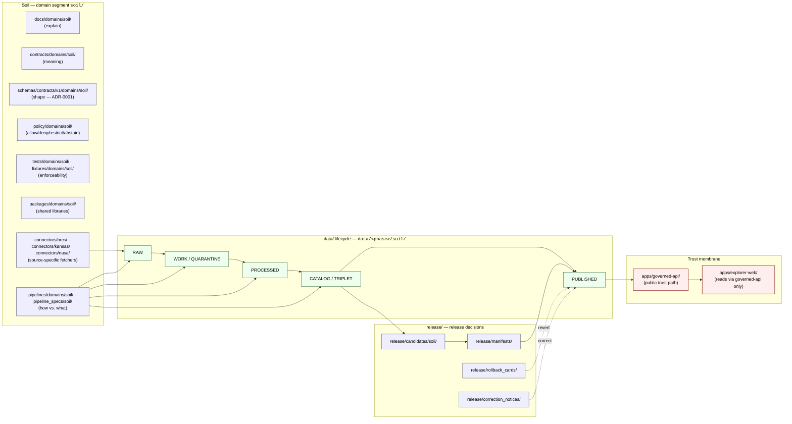

<!-- [KFM_META_BLOCK_V2]
doc_id: kfm://doc/domains/soil/canonical-paths
title: Canonical Paths — Soil Domain
type: standard
version: v1
status: draft
owners: <soil domain steward; docs steward; sources steward — TODO confirm in CODEOWNERS>
created: 2026-05-19
updated: 2026-05-19
policy_label: public
related:
  - docs/doctrine/directory-rules.md
  - docs/domains/soil/README.md
  - docs/adr/ADR-0001-schema-home.md
  - docs/registers/DRIFT_REGISTER.md
  - docs/registers/VERIFICATION_BACKLOG.md
  - docs/atlases/kfm-domains-v1.1-pass23-32-consolidated-atlas.md
tags: [kfm, domain, soil, canonical-paths, governance, directory-rules, placement]
notes:
  - "Doctrine grounded in directory-rules.md §§4, 5, 6, 7, 9, 12, 13; Domains Atlas v1.0 Ch. 5 [DOM-SOIL]; Atlas §24.13 crosswalk."
  - "Soil segment is `soil` consistently across Directory Rules §12 and Atlas §24.13 — no naming variance flagged."
  - "Specific repo presence of every path below is PROPOSED until verified against a mounted repository."
[/KFM_META_BLOCK_V2] -->

# Canonical Paths — Soil Domain

> Authoritative restatement of Directory Rules §12 (**Domain Placement Law**) for the **Soil** lane: every responsibility root in which a soil file may legitimately live, what belongs there, what does not, and how cross-cutting soil files are placed without inventing a `soil/` root.

[](#status)
[](../../doctrine/directory-rules.md)
[](../../adr/ADR-0001-schema-home.md)
[](../../doctrine/lifecycle-law.md)
[](#9-sensitivity-rights-and-publication-posture)
[](#13-open-questions-and-verification-backlog)

**Status:** draft · **Owners:** soil domain steward, docs steward, sources steward (TODO confirm) · **Last updated:** 2026-05-19

---

## Contents

1. [Scope and authority](#1-scope-and-authority)
2. [Domain Placement Law for Soil — at a glance](#2-domain-placement-law-for-soil--at-a-glance)
3. [Lane diagram](#3-lane-diagram)
4. [Responsibility-root walkthrough](#4-responsibility-root-walkthrough)
5. [Lifecycle phases for Soil data](#5-lifecycle-phases-for-soil-data)
6. [Owned object families](#6-owned-object-families)
7. [Source families](#7-source-families)
8. [Cross-lane segment guidance](#8-cross-lane-segment-guidance)
9. [Sensitivity, rights, and publication posture](#9-sensitivity-rights-and-publication-posture)
10. [Validators, tests, fixtures](#10-validators-tests-fixtures)
11. [Anti-patterns specific to Soil](#11-anti-patterns-specific-to-soil)
12. [Path-validation checklist for Soil PRs](#12-path-validation-checklist-for-soil-prs)
13. [Open questions and verification backlog](#13-open-questions-and-verification-backlog)
14. [Related docs](#14-related-docs)

---

## 1. Scope and authority

> [!NOTE]
> **What this document is.** A domain-scoped restatement of Directory Rules §12 for **Soil**. It is a navigational aid: a reviewer asking *"where does this soil file go?"* should be able to answer the question from this page without re-reading the full Directory Rules. It does **not** amend Directory Rules, change schema-home conventions, or grant placement authority; the canonical authority is `docs/doctrine/directory-rules.md`.
>
> **What this document is not.** It is not a schema (`schemas/contracts/v1/soil/`), not a policy bundle (`policy/domains/soil/`), not a release gate, and not an ADR. It points to those surfaces; it does not stand in for them.

| Field | Value | Status |
|---|---|---|
| Canonical doctrine | `docs/doctrine/directory-rules.md` §§4, 5, 6, 7, 9, 12, 13 | **CONFIRMED** in attached corpus |
| Domain segment for `docs/` | `soil` | **CONFIRMED** ([DIRRULES] §12 enumeration) |
| Domain segment for `schemas/contracts/v1/` | `soil` | **CONFIRMED** ([DOM-SOIL]; Atlas §24.13 crosswalk row 5 shows `schemas/contracts/v1/soil/`, `contracts/soil/`) |
| Schema-home convention | `schemas/contracts/v1/<...>` default per ADR-0001 | **CONFIRMED** doctrine / **NEEDS VERIFICATION** that an ADR file with that exact slug exists in the mounted repo |
| Lifecycle invariant | RAW → WORK / QUARANTINE → PROCESSED → CATALOG / TRIPLET → PUBLISHED | **CONFIRMED** doctrine |
| Promotion semantics | Promotion is a **governed state transition**, not a file move | **CONFIRMED** doctrine |
| Presence of any specific path below in the live repo | One of: `CONFIRMED` (verified in mounted repo), `PROPOSED` (consistent with doctrine, unverified), or `NEEDS VERIFICATION` | **PROPOSED** by default — repo not mounted in authoring session |

[Back to top](#contents)

---

## 2. Domain Placement Law for Soil — at a glance

**Soil is a lane, not a root.** A top-level `soil/` folder violates Directory Rules §12. Soil files appear as a domain **segment** inside responsibility roots:

```text
docs/domains/soil/
contracts/domains/soil/                  # or contracts/soil/ per Atlas §24.13 crosswalk — see §11 OPEN-SOIL-01
schemas/contracts/v1/domains/soil/       # or schemas/contracts/v1/soil/ per Atlas §24.13 crosswalk — see §11 OPEN-SOIL-01
policy/domains/soil/
tests/domains/soil/
fixtures/domains/soil/
packages/domains/soil/
pipelines/domains/soil/
pipeline_specs/soil/
data/raw/soil/
data/work/soil/
data/quarantine/soil/
data/processed/soil/
data/catalog/domain/soil/
data/triplets/domain/soil/               # PROPOSED — verify segment shape against data/triplets/ subtree
data/published/layers/soil/
data/registry/sources/soil/
data/registry/domains/soil/
data/rollback/soil/
release/candidates/soil/
```

> [!IMPORTANT]
> **A domain segment is never a root.** `soil/` at repo root, or as a sibling under `apps/`, `tools/`, or `runtime/`, is a placement defect to flag in `docs/registers/DRIFT_REGISTER.md`. Cross-domain files (e.g., a HUC × soil × hydrology validator) go to the **lowest common responsibility root without a domain segment**, per Directory Rules §12 — for soil-adjacent examples: shared validator → `tools/validators/<topic>/`, cross-domain schema → `schemas/contracts/v1/<topic>/`, cross-domain doctrine → `docs/architecture/<topic>.md`.

[Back to top](#contents)

---

## 3. Lane diagram



*Doctrine basis:* Directory Rules §§4, 5, 6, 7, 9, 12; lifecycle invariant per `docs/doctrine/lifecycle-law.md`; trust-membrane per `docs/doctrine/trust-membrane.md`. Diagram is **illustrative**; arrow set is conventional, not exhaustive.

[Back to top](#contents)

---

## 4. Responsibility-root walkthrough

Each responsibility root below is **CONFIRMED** as a canonical or compatibility root by Directory Rules §5. The **`soil/` segment under each** is **PROPOSED** until verified against a mounted repository.

### 4.1 `docs/domains/soil/` — human-facing explanation

| Field | Value |
|---|---|
| Responsibility | Explain Soil's scope, ownership boundaries, doctrine, and reader-facing reference material. |
| Authority class | Canonical ([DIRRULES] §5, §6.1). |
| What belongs | This file (`CANONICAL_PATHS.md`); a `README.md`; domain dossiers; reference matrices; reader-facing source notes; explanatory diagrams. |
| What does **not** belong | Object meaning (→ `contracts/`); machine shape (→ `schemas/`); admissibility rules (→ `policy/`); runnable code (→ `tools/`, `pipelines/`, `packages/`); fixtures (→ `fixtures/`); release manifests (→ `release/`). |
| Drift risk | Treating a doc as canonical truth (Directory Rules §13.5 "Documentation as truth" anti-pattern). |

### 4.2 `contracts/domains/soil/` — object meaning

| Field | Value |
|---|---|
| Responsibility | Object-family meaning: `SoilMapUnit`, `SoilComponent`, `Horizon`, `SoilProperty`, `HydrologicSoilGroup`, `SoilMoistureObservation`, `Pedon`/`SoilProfileView`, `ErosionRisk`, `SuitabilityRating`, `ComponentHorizonJoin`, `SoilTimeCaveat` ([DOM-SOIL] Ch. 5.E). |
| Authority class | Canonical ([DIRRULES] §5). Pairs with `schemas/` — `contracts/` is **meaning**, `schemas/` is **shape**. |
| What belongs | Markdown definitions, semantic constraints, source-role notes, temporal-handling notes, cross-lane relation constraints. |
| What does **not** belong | JSON Schema files (→ `schemas/contracts/v1/domains/soil/`); policy rules; tests. |
| Naming variance | Atlas §24.13 crosswalk lists `contracts/soil/` (flat); Directory Rules §12 lists `contracts/domains/soil/` (segmented). Resolve per `docs/adr/ADR-0001-schema-home.md` and per-root README in `contracts/`. See [§11 OPEN-SOIL-01](#11-anti-patterns-specific-to-soil). |

### 4.3 `schemas/contracts/v1/domains/soil/` — machine shape

| Field | Value |
|---|---|
| Responsibility | Machine-checkable shape of every soil object family, plus `SoilDecisionEnvelope`, `EvidenceDrawerPayload` projections, and any soil-specific receipt schemas. |
| Authority class | Canonical ([DIRRULES] §5, §7.4; ADR-0001 default home `schemas/contracts/v1/<...>`). |
| What belongs | JSON Schema files versioned under `v1/`; SchemaRegistry entries; supersession headers; validator-discovery hooks. |
| What does **not** belong | Markdown semantics (→ `contracts/`); fixtures (→ `fixtures/domains/soil/`); generators (→ `tools/generators/`). |
| Naming variance | Atlas §24.13 crosswalk uses `schemas/contracts/v1/soil/` (flat under v1); Directory Rules §12 uses `schemas/contracts/v1/domains/soil/` (segmented). One canonical placement is ADR-resolvable; until then, flag as **NEEDS VERIFICATION**. See [§11 OPEN-SOIL-01](#11-anti-patterns-specific-to-soil). |
| Forbidden | Parallel schema homes (`jsonschema/soil/`, `contracts/<domain>/<x>.schema.json`) evolving independently of the canonical home ([DIRRULES] §13.1). |

### 4.4 `policy/domains/soil/` — admissibility and release

| Field | Value |
|---|---|
| Responsibility | Allow / deny / restrict / abstain decisions for soil sources, soil joins, soil layer release, soil AI surfaces. |
| Authority class | Canonical ([DIRRULES] §5; `policy/` singular per §6.5 and §13.5). |
| What belongs | OPA/Rego or equivalent bundles; rights and sensitivity rules; support-type separation policies; release-class gates; sensitive-join deny rules. |
| What does **not** belong | Policy mirrors (→ `policies/` compatibility root only, mirror or legacy); policy explanations (→ `docs/`); fixtures (→ `fixtures/`). |
| Notable soil rules | Support-type separation denial; sensitive landowner-join denial; gridded-vs-station-vs-static support label enforcement at publication. |

### 4.5 `tests/domains/soil/` and `fixtures/domains/soil/`

| Field | Value |
|---|---|
| Responsibility | Proof of enforceability for soil contracts, schemas, and policy. |
| Authority class | Canonical ([DIRRULES] §5). |
| What belongs | Contract tests; schema-validation tests; policy decision tests including DENY/ABSTAIN/ERROR negative-state coverage; promotion-gate tests; rollback drills; soil-specific golden and adversarial fixtures (MUKEY/COKEY/CHKEY samples, horizon-depth edge cases, soil-moisture unit/depth/QC fixtures, support-type-mixing adversarial fixtures, dual-hash stability vectors). |
| What does **not** belong | Production data (→ `data/`); release artifacts (→ `release/`); fixtures shared across many domains (→ `fixtures/<topic>/` without a domain segment). |

### 4.6 `packages/domains/soil/` — shared libraries

| Field | Value |
|---|---|
| Responsibility | Reusable soil libraries: hydrologic-group derivation, MUKEY/COKEY/CHKEY resolvers, component-weighted property aggregators, horizon-depth utilities, soil-moisture canonical-variable mappers. |
| Authority class | Canonical ([DIRRULES] §7.2). A package **must** be reusable; one-off workflow steps belong in `tools/` or `pipelines/`. |
| What belongs | Library code with versioned APIs, unit tests inside the package, package README. |
| What does **not** belong | One-shot scripts; pipeline glue; data; release decisions. |

### 4.7 `pipelines/domains/soil/` and `pipeline_specs/soil/`

| Field | Value |
|---|---|
| Responsibility | Executable pipeline logic (`pipelines/`) and declarative pipeline configuration (`pipeline_specs/`) for soil ingest, normalization, validation, catalog, triplet emission, and publication. |
| Authority class | Canonical ([DIRRULES] §7.4). The split is rigid: `pipeline_specs/` declares **what** should run; `pipelines/` decides **how**. |
| What belongs (specs) | Declarative DAGs for SSURGO/gSSURGO/gNATSGO/SDA refresh, Mesonet/SCAN/USCRN station ingest, SMAP/SoilGrids gridded ingest, soil-condition unified view assembly. |
| What belongs (executors) | Pipeline tasks, validators wired in, receipt emitters. |
| Forbidden | Connectors writing to `data/processed/`, `data/catalog/`, or `data/published/` directly ([DIRRULES] §13.5 "Connector publishes"); watchers writing to catalog or published ("Watcher publishes"); skipping lifecycle phases ("Lifecycle skip"). |

### 4.8 `connectors/<source-org>/` — source-specific fetch and admission

| Field | Value |
|---|---|
| Responsibility | Source-specific fetchers and admitters for soil sources, organized by **source organization**, not by domain. |
| Authority class | Canonical ([DIRRULES] §7.3). |
| Where soil source connectors live (PROPOSED) | `connectors/nrcs/` (SSURGO, gSSURGO, gNATSGO, SDA, SCAN), `connectors/kansas/` (Kansas Mesonet), `connectors/noaa/` (USCRN), `connectors/nasa/` (SMAP), `connectors/isric/` (SoilGrids). |
| Connector output rule | Output **must** go to `data/raw/soil/<source_id>/<run_id>/` or `data/quarantine/soil/<reason>/<run_id>/`, with `SourceDescriptor`, checksums, and `IngestReceipt`. **Connectors must not publish.** |
| Drift risk | Topic-organized connector folders (`connectors/soil/`) instead of source-organized — flag as drift. |

### 4.9 `data/<phase>/soil/` — lifecycle data

See [§5](#5-lifecycle-phases-for-soil-data) for the phase-by-phase breakdown.

### 4.10 `release/candidates/soil/` — release decisions

| Field | Value |
|---|---|
| Responsibility | Soil release-candidate dossiers; manifests, rollback cards, correction notices, withdrawal records, signatures, and changelog live in their respective non-domain-segmented siblings under `release/` ([DIRRULES] §9.2). |
| Authority class | Canonical. |
| Distinguish carefully | `data/published/layers/soil/` holds released **artifacts**; `release/` holds release **decisions**. Mixing the two is a Directory Rules §13.2 anti-pattern. |

### 4.11 `apps/` — deployable surfaces (no `soil/` segment)

| Field | Value |
|---|---|
| Responsibility | Public-trust path. `apps/governed-api/` returns `RuntimeResponseEnvelope` with finite outcomes (ANSWER, ABSTAIN, DENY, ERROR). |
| `soil/` segment | **None.** Soil-specific behavior lives behind the governed API as routes/handlers, not as a domain-named app. |
| Forbidden | Public clients reading `data/raw/soil/`, `data/work/soil/`, or `data/quarantine/soil/` directly; `apps/explorer-web/` reading `data/processed/soil/` instead of going through `apps/governed-api/` ([DIRRULES] §13.5 "Public route reads canonical store"). |

[Back to top](#contents)

---

## 5. Lifecycle phases for Soil data

**CONFIRMED doctrine, PROPOSED lane application** ([DOM-SOIL] Ch. 5.H; [DIRRULES] §9.1). Promotion is a **governed state transition**, never a file move.

| Phase | `data/<phase>/soil/` shape (PROPOSED) | Allowed for Soil | Gate to advance | MUST NOT |
|---|---|---|---|---|
| `raw/` | `data/raw/soil/<source_id>/<run_id>/` | Immutable SSURGO export, SDA query payload, gSSURGO raster, Mesonet station pull, SMAP granule, SoilGrids COG — with retrieval metadata and checksums | `SourceDescriptor` exists | Public clients, AI context, UI layers, normalized records |
| `work/` | `data/work/soil/<run_id>/` | Normalized intermediates, candidate MUKEY/COKEY/CHKEY joins, candidate horizon depths, candidate moisture conversions | Validation + policy gate pass, or a quarantine reason is recorded | Public API/UI, release aliases |
| `quarantine/` | `data/quarantine/soil/<reason>/<run_id>/` | Failed validation (unit drift, depth anomalies), unresolved rights/sensitivity (e.g., landowner-identifying joins), schema drift, support-type mixing | Remediation or denial | Promotion candidates without remediation |
| `processed/` | `data/processed/soil/<dataset_id>/<version>/` | Validated canonical records: soil map units, components, horizons, soil-condition view rows, station series | `EvidenceRef`, `ValidationReport`, digest closure exist | Assumption of public/release status |
| `catalog/` | `data/catalog/domain/soil/` and STAC/DCAT/PROV records under `data/catalog/{stac,dcat,prov}/` | Soil catalog entries; `EvidenceBundle`s; layer manifest entries | Catalog/proof closure passes | Uncited claims, unclosed identifiers |
| `triplets/` | `data/triplets/graph_deltas/` and `data/triplets/exports/` (no domain segment in the spine) | Relationship projections (e.g., `SoilMapUnit`-`HUC` joins) and graph-compatible triples | Catalog/proof closure passes | Canonical replacement semantics |
| `published/` | `data/published/layers/soil/`, `data/published/api_payloads/...`, `data/published/pmtiles/soil/...` | Released public-safe artifacts: soil mapunit tiles, hydrologic-soil-group view, station-series payloads, suitability/interpretation layers, support-type-badged composites | `ReleaseManifest`, correction path, rollback target, review/policy state exist | Raw, work, quarantine, exact restricted geometry |
| `receipts/` | `data/receipts/{ingest,validation,pipeline,ai,release}/` (no domain segment in the spine) | Process memory: run, validation, AI, ingest, release receipts that reference soil | Process-only; receipts are not proof of release | Proof of release by themselves |
| `proofs/` | `data/proofs/{evidence_bundle,proof_pack,validation_report,citation_validation}/` (no domain segment in the spine) | `EvidenceBundle`s, ProofPacks, integrity bundles for soil claims | Used by promotion and release gates | Process-only receipts without release context |
| `rollback/` | `data/rollback/soil/<release_id>/` | Rollback cards, alias revert receipts for soil releases | — | Deleting prior meanings |
| `registry/` | `data/registry/sources/soil/`, `data/registry/domains/soil/`, `data/registry/sensitivity/`, `data/registry/rights/`, `data/registry/crosswalks/` | Append-only source/layer/dataset/rights/sensitivity records, including MUKEY/COKEY/CHKEY crosswalks | — | Canonical domain truth (it is the registry of decisions, not the meaning surface) |

> [!CAUTION]
> **Lifecycle skip is a Directory Rules §13.5 anti-pattern.** A pipeline that writes directly to `data/published/layers/soil/` from `data/raw/soil/` violates the lifecycle invariant **regardless of which directory the bytes ended up in.** Every phase runs; promotion is a governed state transition.

[Back to top](#contents)

---

## 6. Owned object families

**CONFIRMED object-family spine** for Soil per [DOM-SOIL] Ch. 5.B and [ENCY]. Implementation-level field realization is **PROPOSED** until schema files are inspected.

| Object family | Purpose (per [DOM-SOIL]) | Identity rule | Schema location (PROPOSED) |
|---|---|---|---|
| `SoilMapUnit` | Map-unit polygon and its keyed properties | `source_id + object_role + temporal_scope + normalized_digest` | `schemas/contracts/v1/domains/soil/soil_map_unit.schema.json` |
| `SoilComponent` | Component within a map unit (taxonomic family, percent composition) | as above | `…/soil_component.schema.json` |
| `Horizon` | Soil horizon with depth, texture, and properties | as above | `…/horizon.schema.json` |
| `SoilProperty` | Per-property record (texture, organic matter, depth-to-water-table, etc.) | as above | `…/soil_property.schema.json` |
| `HydrologicSoilGroup` | A/B/C/D hydrologic-group classification with derivation lineage | as above | `…/hydrologic_soil_group.schema.json` |
| `SoilMoistureObservation` | Station or grid soil-moisture reading with depth/unit/QC | as above | `…/soil_moisture_observation.schema.json` |
| `Pedon` / `SoilProfileView` | Pedon evidence and the soil-profile view derived from horizons | as above | `…/pedon.schema.json` |
| `ErosionRisk` | Erosion-risk evidence or released derivative | as above | `…/erosion_risk.schema.json` |
| `SuitabilityRating` | Suitability/interpretation rating (CONFIRMED term per [DOM-SOIL] Ch. 5.C) | as above | `…/suitability_rating.schema.json` |
| `ComponentHorizonJoin` | Join evidence between components and horizons | as above | `…/component_horizon_join.schema.json` |
| `SoilTimeCaveat` | Temporal-validity caveat carried alongside soil claims | as above | `…/soil_time_caveat.schema.json` |

**Non-ownership boundaries** (CONFIRMED per [DOM-SOIL] Ch. 5.B):

- **Crop and yield claims** → Agriculture (`schemas/contracts/v1/domains/agriculture/`).
- **Streamflow, groundwater, and flood context** → Hydrology / Hazards.
- **Lithology, boreholes, and stratigraphy** → Geology.

A schema or contract that asserts crop, streamflow, or lithology meaning under `…/soil/` is a placement defect — refile under the responsible lane.

[Back to top](#contents)

---

## 7. Source families

**CONFIRMED source families** for Soil per [DOM-SOIL] Ch. 5.D. Rights, freshness, and current terms are **NEEDS VERIFICATION** per source until the live `SourceDescriptor` is inspected. Sensitive joins **fail closed** by doctrine.

| Source family | Source descriptor home (PROPOSED) | Connector home (PROPOSED) | Role | Sensitivity posture |
|---|---|---|---|---|
| **NRCS SSURGO** | `data/registry/sources/soil/nrcs-ssurgo.yaml` | `connectors/nrcs/ssurgo/` | authority / observation per source role | rights NEEDS VERIFICATION; sensitive joins fail closed |
| **USDA NRCS Soil Data Access (SDA)** | `data/registry/sources/soil/nrcs-sda.yaml` | `connectors/nrcs/sda/` | authority / query | rights NEEDS VERIFICATION; `query_hash` reproducibility required |
| **NRCS gSSURGO** | `data/registry/sources/soil/nrcs-gssurgo.yaml` | `connectors/nrcs/gssurgo/` | gridded derivative | support-type label mandatory at publication |
| **NRCS gNATSGO** | `data/registry/sources/soil/nrcs-gnatsgo.yaml` | `connectors/nrcs/gnatsgo/` | gridded derivative (CONUS) | support-type label mandatory |
| **Kansas Mesonet (soil moisture)** | `data/registry/sources/soil/ks-mesonet.yaml` | `connectors/kansas/mesonet/` | station observation (5/10/20/50 cm depths) | unit/depth/QC tests gate promotion |
| **NRCS SCAN** | `data/registry/sources/soil/nrcs-scan.yaml` | `connectors/nrcs/scan/` | station observation | as above |
| **NOAA USCRN** | `data/registry/sources/soil/noaa-uscrn.yaml` | `connectors/noaa/uscrn/` | station observation | as above |
| **NASA SMAP** | `data/registry/sources/soil/nasa-smap.yaml` | `connectors/nasa/smap/` | satellite grid | support-type label mandatory; Earthdata creds in `infra/`/`configs/` |
| **ISRIC SoilGrids** | `data/registry/sources/soil/isric-soilgrids.yaml` | `connectors/isric/soilgrids/` | gridded derivative (global, CC-BY-4.0 per corpus) | attribution required; support-type label mandatory |

> [!NOTE]
> **Resolution-mismatch discipline.** The corpus (Pass-10 C10-01) warns that 10 m SSURGO, 30 m gNATSGO, 250 m SoilGrids, and 1 km SMAP cannot be silently resampled into a single unified surface. Public soil-condition views **must** tag each derived value with source resolution and resampling method. Implementation of the tagging convention is **PROPOSED** pending repo verification.

[Back to top](#contents)

---

## 8. Cross-lane segment guidance

**CONFIRMED cross-lane relations** per [DOM-SOIL] Ch. 5.F. The placement question is: when a file legitimately spans Soil and a related lane, which domain segment does it carry?

| Soil ↔ Related lane | Typical artifact | Placement rule (per [DIRRULES] §12) |
|---|---|---|
| Soil ↔ **Agriculture** | Soil-crop suitability table, MUKEY-keyed crop suitability map | Owner is **Agriculture** (`SoilCropSuitability` per [DOM-AG]); place under `schemas/contracts/v1/domains/agriculture/`. Soil contributes evidence, not ownership. |
| Soil ↔ **Hydrology** | Hydrologic-soil-group derivation, runoff-curve-number table | Owner is **Soil** when the artifact is hydrologic-group classification; Owner is **Hydrology** for runoff/streamflow. Place by what the artifact **asserts**. |
| Soil ↔ **Habitat / Fauna / Flora** | Substrate context layer | Owner is the habitat/flora/fauna lane; soil contributes context. **Rare-location exposure** for fauna/flora must not be enabled by a soil join. |
| Soil ↔ **Geology** | Parent-material relation, surficial-soil-to-bedrock crosswalk | Owner is **Geology** for lithology and stratigraphy; Soil owns the parent-material relation. Do **not** let soil replace lithology truth. |
| Soil × Hydrology × Agriculture × Habitat (cross-cutting) | Shared geometry validator, multi-domain `SourceDescriptor` schema, atlas/dossier | Place at the **lowest common responsibility root without a domain segment**: shared validator → `tools/validators/<topic>/`; cross-domain schema → `schemas/contracts/v1/<topic>/`; cross-domain doctrine → `docs/architecture/<topic>.md`. |

> [!WARNING]
> **Cross-lane relations do not bypass ownership.** A soil layer that exposes rare-species locations through a substrate join violates Habitat/Fauna/Flora sovereignty rules even though the bytes are soil bytes. Sensitive joins **fail closed** by doctrine.

[Back to top](#contents)

---

## 9. Sensitivity, rights, and publication posture

**CONFIRMED / PROPOSED rule** per [DOM-SOIL] Ch. 5.I:

> **Support-type separation is mandatory.** Static survey, gridded derivative, station reading, satellite grid, pedon evidence, and interpretation **cannot masquerade as one surface.**

| Support type | Public-safe surface convention (PROPOSED) | Where it lives | What it must carry |
|---|---|---|---|
| Static survey (SSURGO authoritative) | `static_soil_survey` layer family | `data/published/layers/soil/static_survey/` | Source vintage, MUKEY/COKEY/CHKEY identifiers, citation |
| Gridded derivative (gSSURGO, gNATSGO, SoilGrids) | `gridded_derivative_soil` layer family | `data/published/layers/soil/gridded_derivative/` | Source resolution tag, resampling method, derivation lineage |
| Station reading (Mesonet, SCAN, USCRN) | `station_soil_moisture` series payload | `data/published/api_payloads/soil/station_series/` | Depth, unit, QC flags, station identity |
| Satellite grid (SMAP) | `satellite_grid_soil` layer family | `data/published/layers/soil/satellite_grid/` | Granule lineage, retrieval algorithm, footprint |
| Pedon evidence | `pedon_evidence` payload | `data/published/api_payloads/soil/pedons/` | Lab-sample lineage, sampling date, sample identity |
| Interpretation / suitability | `suitability_rating` layer family | `data/published/layers/soil/suitability/` | Derivation rule, evidence basis, scope-of-validity |

> [!IMPORTANT]
> A composite "soil-condition view" that fuses these support types **must** label each contributing value with its support-type badge and its source-resolution tag. Silent fusion is a policy-denial trigger per [DOM-SOIL] Ch. 5.K ("support-type separation denial" validator).

**Rights and sensitivity posture (CONFIRMED doctrine):**

- Unclear rights, unresolved source role, missing evidence, unresolved sensitivity, or absent release state **blocks public promotion** ([ENCY]; [DIRRULES]).
- Living-person, parcel-identifying, or otherwise sensitive joins to soil records **fail closed** by default.
- Attribution must be carried for each source (e.g., CC-BY-4.0 for SoilGrids per corpus).

[Back to top](#contents)

---

## 10. Validators, tests, fixtures

**PROPOSED soil-specific validator set** per [DOM-SOIL] Ch. 5.K. Each validator must exercise **negative-state paths (DENY / ABSTAIN / ERROR)**; positive-only coverage is an anti-pattern.

| Validator | Purpose | Negative-state expectation | Likely home (PROPOSED) |
|---|---|---|---|
| MUKEY / COKEY / CHKEY lineage | Identity stability across SSURGO/gSSURGO/gNATSGO/SDA | ABSTAIN on ambiguous lineage; DENY on broken closure | `tools/validators/domains/soil/lineage/` |
| Horizon-depth sanity | Depth monotonicity, overlap, sentinel-value handling | DENY on overlap; ABSTAIN on missing depth | `tools/validators/domains/soil/horizon_depth/` |
| Soil-moisture unit / depth / QC | Canonical-variable enum compliance, depth tagging, QC-flag handling | DENY on unit drift; ABSTAIN on missing depth or QC | `tools/validators/domains/soil/moisture/` |
| Support-type separation denial | Detect publication-time fusion of static/gridded/station/satellite/pedon | DENY on support-type mixing in one layer | `tools/validators/domains/soil/support_type/` |
| Dual-hash stability | `spec_hash` (JCS+SHA-256) reproducibility for soil schemas | ERROR on non-reproducible hash | `tools/validators/domains/soil/dual_hash/` |
| Catalog closure & Evidence Drawer | Catalog/proof closure passes for every published soil layer | DENY on missing `EvidenceBundle` or `LayerManifest` | `tools/validators/domains/soil/catalog_closure/` |

Fixtures supporting each validator belong under `fixtures/domains/soil/<validator-topic>/{valid,invalid}/`, with **both** valid and invalid samples named.

[Back to top](#contents)

---

## 11. Anti-patterns specific to Soil

The Directory Rules §13 anti-pattern register applies in full. The rows below are the ones reviewers most often miss for soil-shaped placements.

| Anti-pattern | Symptom | Fix | Rule cite |
|---|---|---|---|
| **`soil/` at repo root** | `soil/` folder competing with responsibility roots, fragmenting lifecycle | Apply Domain Placement Law; migrate piece by piece into the lane pattern | [DIRRULES] §12, §13.4 |
| **Support-type fusion in one published layer** | A "soil-condition" PMTiles layer mixing SSURGO, gNATSGO, Mesonet, and SMAP without per-pixel support-type badges | Split into support-type-labeled layer families; or carry per-feature support-type metadata; gate at the support-type-separation validator | [DOM-SOIL] Ch. 5.I |
| **Resolution silent-resampling** | gNATSGO and SoilGrids reprojected into a 10 m SSURGO surface without tagging | Tag every derived value with source resolution and resampling method; expose tags in the catalog | Pass-10 C10-01 |
| **Connector publishes** | An NRCS connector writing to `data/processed/soil/` or `data/published/layers/soil/` | Connector emits to `data/raw/soil/` or `data/quarantine/soil/`; pipelines promote | [DIRRULES] §13.5 |
| **Watcher publishes** | An SSURGO/gSSURGO ETag poller writing to `data/catalog/domain/soil/` directly | Watcher-as-non-publisher invariant: workers emit receipts and candidate decisions only | [DIRRULES] §13.5 |
| **Schema mirror divergence** | `schemas/contracts/v1/domains/soil/` and a `contracts/soil/<x>.schema.json` evolving separately | One canonical, the other a mirror or frozen legacy; ADR if unclear | [DIRRULES] §13.1, ADR-0001 |
| **Lifecycle skip** | A pipeline writing directly to `data/published/layers/soil/` from `data/raw/soil/` | All phases run; promotion is a governed state transition | [DIRRULES] §13.5 |
| **Public route reads canonical store** | `apps/explorer-web/` reading `data/processed/soil/` instead of `apps/governed-api/` | Route reads MUST go through `apps/governed-api/` | [DIRRULES] §13.5, §7.1 |
| **Topic-organized connectors** | `connectors/soil/` instead of `connectors/nrcs/`, `connectors/kansas/`, etc. | Connectors organize by source organization; soil sources spread across NRCS/Kansas/NOAA/NASA/ISRIC | [DIRRULES] §7.3 |

### Open questions specific to Soil

- **OPEN-SOIL-01 — `soil/` flat vs. `domains/soil/` segmented under `schemas/`/`contracts/`.** Directory Rules §12 uses the segmented form `schemas/contracts/v1/domains/<domain>/` and `contracts/domains/<domain>/`. Atlas §24.13 crosswalk row 5 uses the flat form `schemas/contracts/v1/soil/` and `contracts/soil/`. Both shapes are doctrine-grounded in different KFM documents. Resolution: per-root README in `schemas/contracts/v1/` and `contracts/` (no ADR strictly required), or a one-line ADR to freeze the rule. Until resolved, this document presents both forms and labels every concrete path **NEEDS VERIFICATION**. Tracker: `docs/registers/VERIFICATION_BACKLOG.md` (PROPOSED entry).
- **OPEN-SOIL-02 — `data/triplets/` shape for Soil.** Directory Rules §9.1 shows `data/triplets/{graph_deltas, exports}/` without a domain segment, while the lane-pattern table in §12 implies `data/catalog/domain/<domain>/` for catalog. The question: does soil-keyed triplet output go under `data/triplets/graph_deltas/soil/`, or stay under the non-domain-segmented spine? Resolution: per-root README in `data/triplets/` or one-line ADR. **NEEDS VERIFICATION**.
- **OPEN-SOIL-03 — `runbooks/soil/` subfolder convention.** Parallel to [DIRRULES] §18 OPEN-DR-02 for `docs/runbooks/<domain>/` generally. **NEEDS VERIFICATION**.

[Back to top](#contents)

---

## 12. Path-validation checklist for Soil PRs

Adapt the Directory Rules §16 reviewer checklist for soil-shaped PRs. A reviewer who cannot tick every applicable box **should** request changes or open a drift entry in `docs/registers/DRIFT_REGISTER.md`.

- [ ] **Responsibility identified.** The file's primary responsibility maps to exactly one §4 Step 1 category.
- [ ] **Right root.** The chosen root matches that responsibility (e.g., soil meaning → `contracts/`, soil shape → `schemas/`, soil admissibility → `policy/`).
- [ ] **Lifecycle phase correct** (data only). Soil bytes go to the right `data/<phase>/soil/` and do not skip phases.
- [ ] **Domain segment correct.** `soil/` appears as a segment, not as a root or under the wrong root's domain folder.
- [ ] **Schema home.** Schema-bearing changes go to `schemas/contracts/v1/<...>/soil/` per ADR-0001 (or the flat `schemas/contracts/v1/soil/` per OPEN-SOIL-01 once resolved). Not to `jsonschema/` or alongside data files.
- [ ] **Source role identity preserved.** Static survey, gridded derivative, station reading, satellite grid, pedon evidence, and interpretation do not collapse into a single surface.
- [ ] **Support-type tag present.** Any published artifact carries its support-type badge.
- [ ] **Source-resolution tag present** for gridded-derivative or composite layers (per-value where applicable).
- [ ] **Connector output discipline.** New or modified connectors emit only to `data/raw/soil/...` or `data/quarantine/soil/...`.
- [ ] **Public path discipline.** Soil routes go through `apps/governed-api/`, not directly to canonical stores.
- [ ] **README present** for any new soil subfolder, meeting the [DIRRULES] §15 contract.
- [ ] **Rule cited in PR description.** The PR names the Directory Rules section that justifies the placement.

[Back to top](#contents)

---

## 13. Open questions and verification backlog

| ID | Question | Resolution path | Status |
|---|---|---|---|
| OPEN-SOIL-01 | `soil/` flat (Atlas §24.13) vs. `domains/soil/` segmented ([DIRRULES] §12) under `schemas/` / `contracts/` | Per-root README in `schemas/contracts/v1/` and `contracts/`, or one-line ADR | NEEDS VERIFICATION |
| OPEN-SOIL-02 | `data/triplets/` shape for soil-keyed graph exports | Per-root README in `data/triplets/` or ADR | NEEDS VERIFICATION |
| OPEN-SOIL-03 | `docs/runbooks/soil/` subfolder vs. flat-prefix convention | Parallels OPEN-DR-02 in `directory-rules.md` §18 | NEEDS VERIFICATION |
| OPEN-SOIL-04 | Canonical resolution for derived KFM soil products (30 m gNATSGO-aligned vs. finer) | Pass-10 C10-01 Open Question; pilot per the multi-resolution view proposal | OPEN |
| OPEN-SOIL-05 | Public-safe posture for landowner-identifying joins (parcel × pedon × MUKEY) | Policy bundle under `policy/domains/soil/` + sensitivity rubric | NEEDS VERIFICATION |
| OPEN-SOIL-06 | Whether `SourceActivationDecision` records exist for each source family in §7 | Mounted-repo inspection of `data/registry/sources/soil/` | NEEDS VERIFICATION |
| OPEN-SOIL-07 | Whether the support-type-separation denial validator (Ch. 5.K) is implemented | Mounted-repo inspection of `tools/validators/domains/soil/` | NEEDS VERIFICATION |
| OPEN-SOIL-08 | Whether soil-specific schema files exist under either segmented or flat form | Mounted-repo inspection | NEEDS VERIFICATION |

> [!NOTE]
> Entries above are PROPOSED for tracking in `docs/registers/VERIFICATION_BACKLOG.md`. Each becomes a routine PR once verified.

<details>
<summary><b>Appendix — Soil object-family glossary (for navigation)</b></summary>

| Term | Meaning surface | Primary citation |
|---|---|---|
| `SoilMapUnit` | The polygon a soil survey calls a map unit; identified by MUKEY | [DOM-SOIL] Ch. 5.E |
| `SoilComponent` | A named component within a map unit, identified by COKEY | [DOM-SOIL] |
| `Horizon` | A horizon within a pedon or component, identified by CHKEY | [DOM-SOIL] |
| `SoilProperty` | A property record (texture, organic matter, depth-to-water-table, etc.) | [DOM-SOIL] |
| `HydrologicSoilGroup` | A/B/C/D class derived from properties and components | [DOM-SOIL] |
| `SoilMoistureObservation` | Station or grid moisture reading with depth, unit, and QC | [DOM-SOIL] |
| `Pedon` / `SoilProfileView` | Pedon evidence and the derived profile view | [DOM-SOIL] |
| `ErosionRisk` | Erosion-risk evidence or derived rating | [DOM-SOIL] |
| `SuitabilityRating` | Interpretation/suitability with derivation lineage | [DOM-SOIL] |
| `ComponentHorizonJoin` | Join evidence between component and horizon | [DOM-SOIL] |
| `SoilTimeCaveat` | Temporal-validity caveat carried alongside soil claims | [DOM-SOIL] |
| `authoritative_static_soil` | Doctrine label for SSURGO-class authoritative static products | [DOM-SOIL] Ch. 5.C |
| `gridded_derivative_soil` | Doctrine label for gSSURGO/gNATSGO/SoilGrids-class derivatives | [DOM-SOIL] |
| `station_soil_moisture` | Doctrine label for station-network moisture series | [DOM-SOIL] |

</details>

[Back to top](#contents)

---

## 14. Related docs

- `docs/doctrine/directory-rules.md` — canonical placement authority ([DIRRULES])
- `docs/doctrine/lifecycle-law.md` — lifecycle invariant — **NEEDS VERIFICATION** in mounted repo
- `docs/doctrine/trust-membrane.md` — public-trust path doctrine — **NEEDS VERIFICATION** in mounted repo
- `docs/doctrine/truth-posture.md` — cite-or-abstain doctrine — **NEEDS VERIFICATION** in mounted repo
- `docs/doctrine/authority-ladder.md` — authority ladder — **NEEDS VERIFICATION** in mounted repo
- `docs/domains/soil/README.md` — soil lane README — **PROPOSED**
- `docs/adr/ADR-0001-schema-home.md` — schema-home rule — **NEEDS VERIFICATION** that the exact filename exists
- `docs/atlases/kfm-domains-v1.1-pass23-32-consolidated-atlas.md` — Domains Atlas Ch. 5 (Soil) — **NEEDS VERIFICATION**
- `docs/registers/DRIFT_REGISTER.md` — placement-drift register
- `docs/registers/VERIFICATION_BACKLOG.md` — verification backlog (this doc's open questions belong here)
- `docs/runbooks/soil/SOURCE_REFRESH_RUNBOOK.md` — operational refresh runbook — **PROPOSED** (parallel to fauna runbook authored in prior session)

---

<sub>Last updated: 2026-05-19 · Doctrine basis: `directory-rules.md` v1.1; [DOM-SOIL]; [ENCY]; [DIRRULES] · All concrete paths are **PROPOSED** until verified against a mounted repository. · [Back to top](#contents)</sub>
