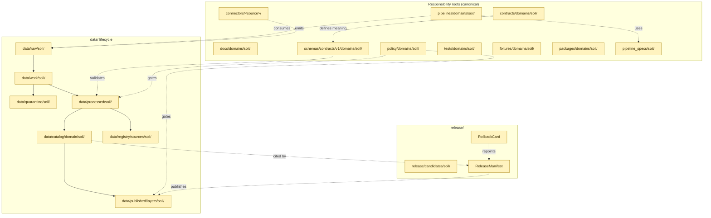
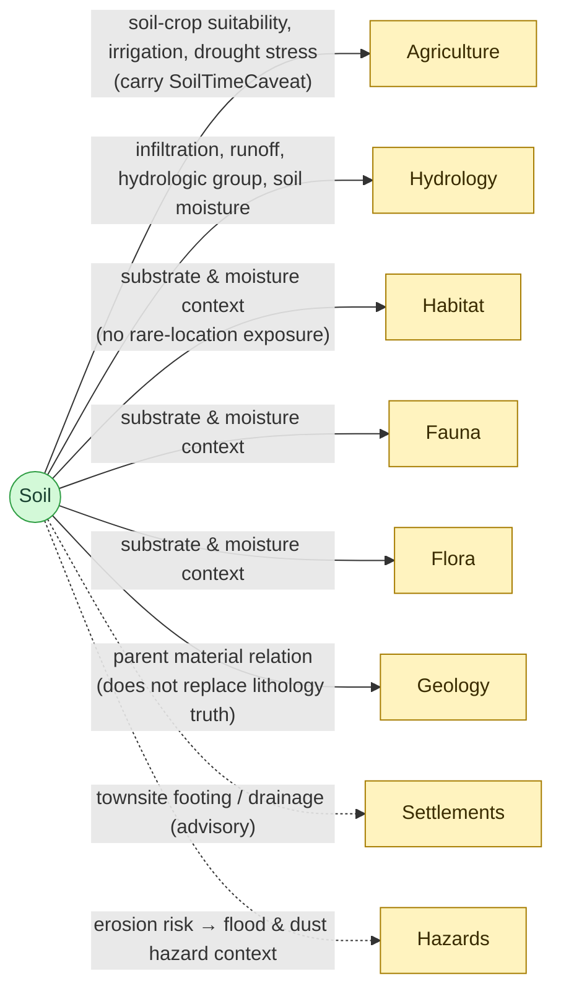

<!-- [KFM_META_BLOCK_V2]
doc_id: kfm://doc/soil-continuity-inventory
title: Soil Domain — Continuity Inventory
type: standard
version: v1
status: draft
owners: <TODO: soil domain steward; data-lifecycle steward>
created: 2026-05-19
updated: 2026-05-19
policy_label: public
related:
  - docs/domains/soil/README.md
  - docs/registers/DRIFT_REGISTER.md
  - docs/registers/VERIFICATION_BACKLOG.md
  - docs/atlases/KFM_Domains_Culmination_Atlas_v1_1.pdf
  - directory-rules.md
tags: [kfm, domain, soil, continuity, inventory, register]
notes:
  - PROPOSED location under docs/domains/soil/; verify against mounted repo and ADRs.
  - Inventory is doctrine-grounded; implementation maturity is bounded to PROPOSED / NEEDS VERIFICATION unless mounted-repo evidence is supplied.
[/KFM_META_BLOCK_V2] -->

# Soil Domain — Continuity Inventory

> A lane-by-lane register of every artifact the Soil domain owns or is expected to own across KFM responsibility roots — with its **continuity state**, **evidence basis**, and **verification posture**. This is a navigational and audit surface, not an implementation claim.

<!-- Badges: placeholders until CI/owners verified -->

| Field | Value |
|---|---|
| **Status** | `draft` |
| **Owners** | `<TODO: soil domain steward>`, `<TODO: data-lifecycle steward>` |
| **Last updated** | 2026-05-19 |
| **Authority class** | Navigational register (not canonical authority) |
| **Canonical authority** | EvidenceBundle, source dossiers, Directory Rules, ADRs |
| **Citation tag** | `[DOM-SOIL]`, `[ENCY]`, `[DIRRULES]` |

---

## Mini-TOC

1. [Scope](#1-scope)
2. [At a glance](#2-at-a-glance)
3. [Repo fit — lane map](#3-repo-fit--lane-map)
4. [Continuity legend](#4-continuity-legend)
5. [Inventory by responsibility root](#5-inventory-by-responsibility-root)
6. [Owned object families — continuity](#6-owned-object-families--continuity)
7. [Source family continuity](#7-source-family-continuity)
8. [Cross-lane relations — continuity](#8-cross-lane-relations--continuity)
9. [Pipeline shape — RAW → PUBLISHED](#9-pipeline-shape--raw--published)
10. [Validators, tests, fixtures](#10-validators-tests-fixtures)
11. [Sensitivity, rights, publication](#11-sensitivity-rights-publication)
12. [Governed AI behavior](#12-governed-ai-behavior)
13. [Open questions & verification backlog](#13-open-questions--verification-backlog)
14. [Related docs](#14-related-docs)
15. [Appendix — change discipline & lineage](#15-appendix--change-discipline--lineage)

---

## 1. Scope

**This document inventories** every Soil-domain artifact KFM doctrine expects to live across the responsibility roots (`docs/`, `contracts/`, `schemas/`, `policy/`, `tests/`, `fixtures/`, `packages/`, `pipelines/`, `pipeline_specs/`, `data/`, `release/`, `connectors/`), records each item's **continuity state** (whether it is `UNCHANGED`, `EXPANDED`, `NEW`, `PROPOSED`, or `NEEDS VERIFICATION`), and notes its evidence basis. The inventory is doctrine-grounded; the existence of any specific file, route, schema, validator, or release artifact in a live KFM repository is **`NEEDS VERIFICATION`** until a mounted repo is inspected.

`CONFIRMED doctrine` — Soil owns the static survey, gridded derivative, station soil-moisture, satellite-grid, pedon, interpretation, suitability, and erosion-context surfaces, plus the public-safe Soil map/API products. `[DOM-SOIL] [ENCY]`

`CONFIRMED doctrine` — Soil **does not** own crop/yield (Agriculture), streamflow/groundwater/floods (Hydrology/Hazards), or lithology/boreholes/stratigraphy (Geology). `[DOM-SOIL] [ENCY]`

> [!IMPORTANT]
> **This is not an authority surface.** EvidenceBundle, source dossiers, `schemas/contracts/v1/soil/...` (PROPOSED), accepted ADRs, and the Soil dossier `[DOM-SOIL]` remain canonical. This inventory is a navigational register and must not be cited as proof that a path, schema, validator, or release artifact exists in the live repository.

---

## 2. At a glance

| Lane attribute | Value | Status |
|---|---|---|
| Owned object families | 11 (SoilMapUnit, SoilComponent, Horizon, SoilProperty, Hydrologic Soil Group, Soil Moisture Observation, ErosionRisk, SuitabilityRating, Pedon / SoilProfileView, Component Horizon Join, SoilTimeCaveat) | `CONFIRMED` doctrine `[DOM-SOIL] [ENCY]` |
| Source families on the ledger | 8 (NRCS SSURGO, USDA NRCS SDA, NRCS gSSURGO, NRCS gNATSGO, Kansas Mesonet soil moisture, NRCS SCAN, NOAA USCRN, NASA SMAP) | `CONFIRMED` doctrine `[DOM-SOIL] [ENCY]` |
| Cross-lane relations | Agriculture, Hydrology, Habitat/Fauna/Flora, Geology | `CONFIRMED` doctrine `[DOM-SOIL] [ENCY]` |
| Sensitivity default | Public-safe at appropriate scale; farm-/owner-specific or operational sensor data requires review | `CONFIRMED` doctrine `[DOM-SOIL]` `[KFM-UIAB §6.2]` |
| Schema home (PROPOSED) | `schemas/contracts/v1/soil/...` | `PROPOSED` per Directory Rules §4 Step 3 + Atlas Ch. 24.13 |
| Promotion model | RAW → WORK / QUARANTINE → PROCESSED → CATALOG / TRIPLET → PUBLISHED (governed state transition) | `CONFIRMED` doctrine `[DIRRULES] [DOM-SOIL] [ENCY]` |
| Implementation maturity | `NEEDS VERIFICATION` (no mounted repo this session) | `UNKNOWN` per `<repository_preflight>` |

---

## 3. Repo fit — lane map

`CONFIRMED rule` — Soil is a **domain segment** inside each responsibility root, never a root folder. `[DIRRULES §12]`

> [!NOTE]
> Every path shown above is **`PROPOSED`** under Directory Rules §4 Step 3 and Atlas Ch. 24.13. Confirmation requires a mounted-repo inspection plus the relevant per-root README contract (Directory Rules §15).

[↑ Back to top](#mini-toc)

---

## 4. Continuity legend

| Symbol / label | Meaning | Source |
|---|---|---|
| `CONFIRMED` | Verified in this session from attached KFM doctrine, dossiers, or supplied artifacts. | `<truth_labels>` |
| `INFERRED` | Reasonably derivable from visible evidence but not directly stated. | `<truth_labels>` |
| `PROPOSED` | Design / path / placement / behavior not yet verified in implementation. | `<truth_labels>` |
| `NEEDS VERIFICATION` | Checkable, but not checked strongly enough this session. | `<truth_labels>` |
| `UNKNOWN` | Not resolvable without more evidence. | `<truth_labels>` |
| `UNCHANGED` | Carry-forward state — retained verbatim from a prior pass / baseline. | Pass 32 atlas carry-forward register |
| `EXPANDED` | Carry-forward state — prior body retained with new addendum. | Pass 32 atlas carry-forward register |
| `NEW` | Carry-forward state — minted in the current pass; no prior body replaced. | Pass 32 atlas carry-forward register |
| `SUPERSEDED` | Carry-forward state — replaced by a newer card; retained in supersession appendix. | Pass 32 atlas carry-forward register |
| `QUARANTINED` | Held out of active promotion pending review. | Pass 32 atlas carry-forward register |

---

## 5. Inventory by responsibility root

Each row reflects KFM doctrine for the Soil lane. Path columns are **`PROPOSED`** until mounted-repo inspection confirms presence.

### 5.1 `docs/domains/soil/`

| Item | PROPOSED path | Continuity | Evidence basis |
|---|---|---|---|
| Soil README | `docs/domains/soil/README.md` | `PROPOSED` / `NEW` | Directory Rules §15 README contract |
| **This inventory** | `docs/domains/soil/CONTINUITY_INVENTORY.md` | `PROPOSED` / `NEW` | This document |
| Soil glossary excerpt | `docs/domains/soil/GLOSSARY.md` | `PROPOSED` | Atlas v1.0 §5.C ubiquitous language `[DOM-SOIL]` |
| Soil cross-lane relations note | `docs/domains/soil/CROSS_LANES.md` | `PROPOSED` | Atlas v1.0 §5.F + Ch. 24.4.3 `[DOM-SOIL]` |
| Soil verification backlog excerpt | `docs/domains/soil/VERIFICATION.md` | `PROPOSED` | Atlas v1.0 §5.N `[DOM-SOIL]` |

### 5.2 `contracts/domains/soil/` — object meaning

`CONFIRMED rule` — `contracts/` owns object **meaning**; semantic Markdown only after ADR-0001. `[DIRRULES §3, §13.1]`

| Item | PROPOSED path | Continuity | Notes |
|---|---|---|---|
| SoilMapUnit contract | `contracts/domains/soil/soil_map_unit.md` | `PROPOSED` | Owned object `[DOM-SOIL] [ENCY]` |
| SoilComponent contract | `contracts/domains/soil/soil_component.md` | `PROPOSED` | Owned object |
| Horizon contract | `contracts/domains/soil/horizon.md` | `PROPOSED` | Owned object |
| SoilProperty contract | `contracts/domains/soil/soil_property.md` | `PROPOSED` | Owned object |
| Hydrologic Soil Group contract | `contracts/domains/soil/hydrologic_soil_group.md` | `PROPOSED` | Owned object |
| Soil Moisture Observation contract | `contracts/domains/soil/soil_moisture_observation.md` | `PROPOSED` | Owned object |
| Pedon / SoilProfileView contract | `contracts/domains/soil/pedon_soil_profile_view.md` | `PROPOSED` | Owned object |
| ErosionRisk contract | `contracts/domains/soil/erosion_risk.md` | `PROPOSED` | Owned object |
| SuitabilityRating contract | `contracts/domains/soil/suitability_rating.md` | `PROPOSED` | Owned object |
| Component Horizon Join contract | `contracts/domains/soil/component_horizon_join.md` | `PROPOSED` | Owned object |
| SoilTimeCaveat contract | `contracts/domains/soil/soil_time_caveat.md` | `PROPOSED` | Owned object; supports cross-lane join discipline `[DOM-SOIL]` |

### 5.3 `schemas/contracts/v1/domains/soil/` — machine shape

`CONFIRMED rule` — Canonical schema home defaults to `schemas/contracts/v1/...` per Directory Rules §4 Step 4 + ADR-0001; any divergence requires an ADR. `[DIRRULES]`

| Item | PROPOSED path | Continuity | Source card |
|---|---|---|---|
| Soil moisture reading schema | `schemas/contracts/v1/domains/soil/soil_moisture_reading.schema.json` | `PROPOSED` / `NEW` | KFM-P23-PROG-0031 |
| Soil moisture unit & time rules | `schemas/contracts/v1/domains/soil/soil_moisture_units_time.schema.json` | `PROPOSED` / `NEW` | KFM-P23-PROG-0032 |
| Soil moisture de-duplication key | `schemas/contracts/v1/domains/soil/soil_moisture_dedupe_key.schema.json` | `PROPOSED` / `NEW` | KFM-P23-PROG-0035 |
| SSURGO static source descriptor | `schemas/contracts/v1/domains/soil/ssurgo_source_descriptor.schema.json` | `PROPOSED` / `NEW` | KFM-P23-PROG-0043 |
| SoilMapUnit / SoilComponent / Horizon / SoilProperty / SuitabilityRating / ErosionRisk / Pedon / Component Horizon Join object schemas | `schemas/contracts/v1/domains/soil/<object>.schema.json` (one per owned object) | `PROPOSED` | Atlas v1.0 §5.E `[DOM-SOIL]` |
| Soil EvidenceBundle projection | `schemas/contracts/v1/domains/soil/soil_evidencebundle.schema.json` | `PROPOSED` | Atlas v1.0 §5.J + EvidenceBundle doctrine `[ENCY]` |
| Soil DecisionEnvelope | `schemas/contracts/v1/domains/soil/soil_decision_envelope.schema.json` | `PROPOSED` | Atlas v1.0 §5.J `[DOM-SOIL] [GAI]` |

### 5.4 `policy/domains/soil/` — admissibility & release

| Item | PROPOSED path | Continuity | Notes |
|---|---|---|---|
| Soil release policy bundle | `policy/domains/soil/release.rego` | `PROPOSED` | Cite-or-abstain; deny-by-default per `[DIRRULES] [ENCY]` |
| Support-type separation policy | `policy/domains/soil/support_type_separation.rego` | `PROPOSED` | Static survey / gridded derivative / station / satellite / pedon / interpretation must not collapse `[DOM-SOIL]` |
| Soil moisture validator gate | `policy/domains/soil/soil_moisture_validator.rego` | `PROPOSED` / `NEW` | KFM-P25-PROG-0030 fail-closed conditions |
| Sensitivity overlay (farm-/owner-specific) | `policy/sensitivity/soil/` (if created — requires ADR per §3) | `PROPOSED` / `NEEDS VERIFICATION` | Atlas v1.1 Ch. 24.13 notes no required sensitivity sublane for Soil; sensitive joins still fail closed |

### 5.5 `tests/domains/soil/` & `fixtures/domains/soil/`

| Item | PROPOSED path | Continuity | Source |
|---|---|---|---|
| MUKEY / COKEY / CHKEY lineage tests | `tests/domains/soil/test_mukey_cokey_chkey_lineage.py` | `PROPOSED` | Atlas v1.0 §5.K |
| Horizon depth sanity tests | `tests/domains/soil/test_horizon_depth_sanity.py` | `PROPOSED` | Atlas v1.0 §5.K |
| Soil moisture unit / depth / QC tests | `tests/domains/soil/test_soil_moisture_qc.py` | `PROPOSED` | Atlas v1.0 §5.K |
| Support-type separation denial tests | `tests/domains/soil/test_support_type_separation.py` | `PROPOSED` | Atlas v1.0 §5.K |
| Dual-hash stability tests | `tests/domains/soil/test_dual_hash_stability.py` | `PROPOSED` | Atlas v1.0 §5.K |
| Catalog closure + Evidence Drawer tests | `tests/domains/soil/test_catalog_closure_evidence_drawer.py` | `PROPOSED` | Atlas v1.0 §5.K |
| Golden SSURGO mapunit fixture | `fixtures/domains/soil/ssurgo_mapunit/golden/` | `PROPOSED` | Atlas v1.0 §5.D, §5.E |
| Invalid soil-moisture row fixtures | `fixtures/domains/soil/soil_moisture/invalid/` | `PROPOSED` | KFM-P25-PROG-0030 fail-closed cases |

### 5.6 `packages/domains/soil/`, `pipelines/domains/soil/`, `pipeline_specs/soil/`, `connectors/...`

| Item | PROPOSED path | Continuity | Source card / dossier |
|---|---|---|---|
| SSURGO ingest pipeline | `pipelines/domains/soil/ssurgo_ingest/` | `PROPOSED` | KFM-P10-PROG-0019, KFM-P2-PROG-0003 |
| SCAN / AWDB ingest pipeline | `pipelines/domains/soil/scan_awdb_ingest/` | `PROPOSED` | KFM-P10-PROG-0019 |
| USCRN soil-station ingest pipeline | `pipelines/domains/soil/uscrn_ingest/` | `PROPOSED` | KFM-P10-PROG-0019 |
| SMAP gridded ingest pipeline | `pipelines/domains/soil/smap_ingest/` | `PROPOSED` | Atlas v1.0 §5.D `[DOM-SOIL]` |
| Kansas Mesonet long-form normalizer | `pipelines/domains/soil/mesonet_normalizer/` | `PROPOSED` / `EXPANDED` | KFM-P19-PROG-0015 |
| Soil moisture validator orchestration | `pipelines/domains/soil/moisture_validator/` | `PROPOSED` / `UNCHANGED` | KFM-P23-PROG-0045 |
| Connectors — `connectors/nrcs-ssurgo/`, `connectors/nrcs-scan/`, `connectors/noaa-uscrn/`, `connectors/nasa-smap/`, `connectors/ks-mesonet/` | `connectors/<source>/` | `PROPOSED` | Directory Rules §3 (connectors emit only to `data/raw/` or `data/quarantine/`) |
| Pipeline specs (declarative) | `pipeline_specs/soil/*.yaml` | `PROPOSED` | Directory Rules §4 Step 1 |
| Soil domain package | `packages/domains/soil/` | `PROPOSED` | Directory Rules §12 |

### 5.7 `data/.../soil/` — lifecycle

| Phase | PROPOSED path | Continuity | Gate |
|---|---|---|---|
| RAW | `data/raw/soil/` | `PROPOSED` | SourceDescriptor exists `[DOM-SOIL]` |
| WORK | `data/work/soil/` | `PROPOSED` | Validation + policy pass, or QUARANTINE reason recorded |
| QUARANTINE | `data/quarantine/soil/` | `PROPOSED` | Held-failure store |
| PROCESSED | `data/processed/soil/` | `PROPOSED` | EvidenceRef + ValidationReport + digest closure |
| CATALOG / TRIPLET | `data/catalog/domain/soil/` | `PROPOSED` | Catalog/proof closure passes |
| PUBLISHED | `data/published/layers/soil/` | `PROPOSED` | ReleaseManifest + correction + rollback target + review/policy state |
| Registry (sources) | `data/registry/sources/soil/` | `PROPOSED` | Source descriptor index |

### 5.8 `release/candidates/soil/`

| Item | PROPOSED path | Continuity | Notes |
|---|---|---|---|
| Soil release candidates | `release/candidates/soil/` | `PROPOSED` | Release decisions, manifests, rollback cards |
| Per-release ReleaseManifest | `release/candidates/soil/<release-id>/release_manifest.json` | `PROPOSED` | `[ENCY Appendix E]` |
| Per-release RollbackCard | `release/candidates/soil/<release-id>/rollback_card.json` | `PROPOSED` | `[ENCY Appendix E]` |

[↑ Back to top](#mini-toc)

---

## 6. Owned object families — continuity

`CONFIRMED scope` — Soil owns the following object families. `[DOM-SOIL] [ENCY]`

| Object | Identity rule (PROPOSED) | Temporal handling | Continuity |
|---|---|---|---|
| SoilMapUnit | source id + object role + temporal scope + normalized digest | source / observed / valid / retrieval / release / correction times distinct | `CONFIRMED` term · `PROPOSED` field realization |
| SoilComponent | same deterministic basis | same | `CONFIRMED` term · `PROPOSED` field realization |
| Horizon | same deterministic basis | same | `CONFIRMED` term · `PROPOSED` field realization |
| SoilProperty | same deterministic basis | same | `CONFIRMED` term · `PROPOSED` field realization |
| Hydrologic Soil Group | same deterministic basis | same | `CONFIRMED` term · `PROPOSED` field realization |
| Soil Moisture Observation | same deterministic basis | same | `CONFIRMED` term · `PROPOSED` field realization |
| Pedon / SoilProfileView | same deterministic basis | same | `CONFIRMED` term · `PROPOSED` field realization |
| ErosionRisk | same deterministic basis | same | `CONFIRMED` term · `PROPOSED` field realization |
| SuitabilityRating | same deterministic basis | same | `CONFIRMED` term · `PROPOSED` field realization |
| Component Horizon Join | same deterministic basis | same | `CONFIRMED` term · `PROPOSED` field realization |
| SoilTimeCaveat | same deterministic basis | carries support-type and snapshot-date caveat | `CONFIRMED` term · `PROPOSED` field realization |

> [!TIP]
> **`SoilTimeCaveat` is the load-bearing time object** for cross-lane joins. Atlas Ch. 24.4.3 records that Soil suitability and hydrologic group bound crop suitability *only when the soil time caveat is carried forward*. Pipelines that drop it break the cross-lane contract.

`PROPOSED` ubiquitous-language helpers (used inside the lane, not separate object families): `authoritative_static_soil`, `gridded_derivative_soil`, `station_soil_moisture`. `[DOM-SOIL] [ENCY]`

---

## 7. Source family continuity

`CONFIRMED ledger` — eight source families on the Soil dossier ledger. Rights and current terms are `NEEDS VERIFICATION` for every entry; sensitive joins fail closed by default. `[DOM-SOIL] [ENCY]`

| # | Source family | Role pattern | Freshness | Rights / sensitivity | Carry-forward state |
|---|---|---|---|---|---|
| 1 | NRCS SSURGO | authority / observation / context as role requires | source-vintage; annual NRCS Oct 1 refresh cadence (PROPOSED, KFM-P2-PROG-0003) | `NEEDS VERIFICATION` | `UNCHANGED` doctrine |
| 2 | USDA NRCS Soil Data Access (SDA) | authority / observation | source-vintage | `NEEDS VERIFICATION` | `UNCHANGED` doctrine |
| 3 | NRCS gSSURGO | authority / observation / context | source-vintage | `NEEDS VERIFICATION` | `UNCHANGED` doctrine |
| 4 | NRCS gNATSGO | authority / observation / context | source-vintage | `NEEDS VERIFICATION` | `UNCHANGED` doctrine |
| 5 | Kansas Mesonet soil moisture | observation (station) | high cadence (per station, sub-hourly typical — `NEEDS VERIFICATION`) | `NEEDS VERIFICATION` | `EXPANDED` per KFM-P19-PROG-0015 |
| 6 | NRCS SCAN | observation (station) | sub-daily | `NEEDS VERIFICATION` | `EXPANDED` per KFM-P10-PROG-0019 |
| 7 | NOAA USCRN | observation (station) | sub-daily | `NEEDS VERIFICATION` | `EXPANDED` per KFM-P10-PROG-0019 |
| 8 | NASA SMAP | observation (satellite grid) | daily L4 surface-moisture (PROPOSED, KFM-P27-IDEA-0006) | `NEEDS VERIFICATION` (Earthdata credentials per KFM Components Pass 10 C10-01) | `UNCHANGED` doctrine |

> [!WARNING]
> **Support-type separation is mandatory.** Static survey, gridded derivative, station reading, satellite grid, pedon evidence, and interpretation must never masquerade as one surface. A pipeline that publishes them under a single layer descriptor is a release-blocking violation. `[DOM-SOIL] [ENCY]`

`PROPOSED watcher pattern` (KFM-P2-PROG-0003): SSURGO/gSSURGO weekly metadata checks plus annual full refresh aligned to the NRCS Oct 1 cycle; SoilGrids monthly metadata checks with irregular model releases. **Not yet implemented in mounted repo (UNKNOWN).**

[↑ Back to top](#mini-toc)

---

## 8. Cross-lane relations — continuity

`CONFIRMED relations` from Soil dossier §F and Atlas Ch. 24.4.3 — each must preserve ownership, source role, sensitivity, and EvidenceBundle support. `[DOM-SOIL] [ENCY]`

| Related lane | Relation | Constraint | Continuity |
|---|---|---|---|
| Agriculture | soil-crop suitability, irrigation, drought stress | preserve `SoilTimeCaveat`; preserve EvidenceBundle support | `CONFIRMED` doctrine; cross-lane join ADR open (ADR-S-14) |
| Hydrology | infiltration, runoff, hydrologic group, soil moisture | preserve HUC / Watershed / Reach owner authority (Hydrology) | `CONFIRMED` doctrine |
| Habitat / Fauna / Flora | substrate and moisture context | no rare-location exposure; deny sensitive joins | `CONFIRMED` doctrine |
| Geology | parent-material relation | does not replace lithology truth (Geology owns lithology) | `CONFIRMED` doctrine |
| Settlements | townsite footing / drainage context | **advisory only**, never regulatory | `CONFIRMED` doctrine |
| Hazards | erosion risk informs flood & dust hazard analyses | KFM is never an alert authority | `CONFIRMED` doctrine |

---

## 9. Pipeline shape — RAW → PUBLISHED

`CONFIRMED doctrine / PROPOSED lane application` — Soil follows the canonical lifecycle; promotion is a governed state transition, not a file move. `[DIRRULES] [DOM-SOIL] [ENCY]`

| Stage | Handling | Gate | Status |
|---|---|---|---|
| **RAW** | Capture immutable source payload or reference with source role, rights, sensitivity, citation, time, and hash. | SourceDescriptor exists. | `PROPOSED` |
| **WORK / QUARANTINE** | Normalize schema, geometry, time, identity, evidence, rights, and policy; hold failures. | Validation + policy gate pass, or quarantine reason is recorded. | `PROPOSED` |
| **PROCESSED** | Emit validated normalized objects, receipts, public-safe candidates. | EvidenceRef, ValidationReport, digest closure exist. | `PROPOSED` |
| **CATALOG / TRIPLET** | Emit catalog records, EvidenceBundles, graph/triplet projections, release candidates. | Catalog/proof closure passes. | `PROPOSED` |
| **PUBLISHED** | Serve released public-safe artifacts through governed APIs and manifests. | ReleaseManifest, correction path, rollback target, review/policy state exist. | `PROPOSED` |

> [!CAUTION]
> **No lifecycle skip.** A pipeline that writes directly to `data/published/layers/soil/` from `data/raw/soil/` violates Directory Rules §13.5 ("Lifecycle skip") and §13.4 ("Domain folders becoming root folders"). Promotion is a governed transition; every phase runs.

---

## 10. Validators, tests, fixtures

`PROPOSED tests` from Atlas v1.0 §5.K plus carried-forward Pass 23/32 cards:

| Test class | Purpose | Source card | Continuity |
|---|---|---|---|
| MUKEY / COKEY / CHKEY lineage | Enforce SSURGO key chain across map unit → component → horizon | Atlas v1.0 §5.K | `PROPOSED` |
| Horizon depth sanity | Reject inverted or out-of-range depth ranges | Atlas v1.0 §5.K | `PROPOSED` |
| Soil moisture unit / depth / QC | Volumetric m³/m³; depths in cm; ISO-UTC timestamps; preserve source timezone | KFM-P23-PROG-0032 | `PROPOSED` / `NEW` |
| Soil moisture de-duplication | Dedupe on station_id × variable × depth_cm × timestamp_iso; retain source + QC context | KFM-P23-PROG-0035 | `PROPOSED` / `NEW` |
| Soil moisture validator fail-closed | DENY on missing required columns, nulls, invalid datetime, value ∉ [0, 0.6] m³/m³, invalid unit, unapproved source, invalid qa_flag, missing spec_hash, out-of-bounds coords | KFM-P25-PROG-0030 | `PROPOSED` / `UNCHANGED` |
| Support-type separation denial | Reject merging static survey / gridded derivative / station / satellite / pedon / interpretation surfaces | Atlas v1.0 §5.K | `PROPOSED` |
| Dual-hash stability | Verify `spec_hash` (JCS+SHA-256) stability across replays | Atlas v1.0 §5.K + KFM-P5-PROG-0010 (replay verification) | `PROPOSED` |
| Catalog closure + Evidence Drawer | Verify catalog records resolve EvidenceRef → EvidenceBundle | Atlas v1.0 §5.K | `PROPOSED` |
| SMAP × Mesonet cross-check | Anomaly, consistency, unit, fail-closed QA before promotion | KFM-P27-IDEA-0006 | `PROPOSED` / `UNCHANGED` |
| Validator finite outcomes | PASS / FAIL / ABSTAIN / ERROR with reason codes (validator entrypoint) | KFM-P23-PROG-0045 | `PROPOSED` / `UNCHANGED` |

`PROPOSED fixtures` (paths PROPOSED):

- `fixtures/domains/soil/ssurgo_mapunit/golden/` — known-good SSURGO map unit + component + horizon chain
- `fixtures/domains/soil/soil_moisture/valid/` — Mesonet / SCAN / USCRN normalized rows
- `fixtures/domains/soil/soil_moisture/invalid/` — fail-closed cases per KFM-P25-PROG-0030
- `fixtures/domains/soil/smap/golden/` — SMAP L4 sample tile
- `fixtures/domains/soil/spec_hash/` — JCS-canonicalized samples for replay verification

[↑ Back to top](#mini-toc)

---

## 11. Sensitivity, rights, publication

| Posture item | Doctrine | Status |
|---|---|---|
| Default exposure | Public-safe at appropriate scale | `CONFIRMED` doctrine `[DOM-SOIL]` |
| Sensitive lane triggers | Farm-/owner-specific, unpublished, proprietary, or operational sensor data | `CONFIRMED` doctrine — requires rights + sensitivity review before release |
| Support-type separation | Static survey · gridded derivative · station · satellite · pedon · interpretation must not collapse | `CONFIRMED` rule `[DOM-SOIL]` |
| Promotion-blocking conditions | Unclear rights · unresolved source role · missing evidence · unresolved sensitivity · absent release state | `CONFIRMED` doctrine `[ENCY] [DIRRULES]` |
| Trust-membrane discipline | Public routes go through `apps/governed-api/`, not direct reads of `data/processed/soil/` | `CONFIRMED` rule `[DIRRULES §13.5]` |

### Governed API surfaces (PROPOSED)

| Endpoint / artifact | DTO / schema | Finite outcomes | Status |
|---|---|---|---|
| Soil feature/detail resolver (route TBD) | `SoilDecisionEnvelope` | ANSWER · ABSTAIN · DENY · ERROR | `PROPOSED`; exact route `UNKNOWN` |
| Soil layer manifest resolver | `LayerManifest` / domain layer descriptor | ANSWER · DENY · ERROR | `PROPOSED`; public-safe release only |
| Soil Evidence Drawer payload | `EvidenceDrawerPayload` + EvidenceBundle projection | ANSWER · ABSTAIN · DENY · ERROR | `PROPOSED`; evidence + policy filtered |
| Soil Focus Mode answer | `RuntimeResponseEnvelope` + `AIReceipt` | ANSWER · ABSTAIN · DENY · ERROR | `PROPOSED`; AI never root truth `[GAI]` |

---

## 12. Governed AI behavior

`CONFIRMED doctrine / PROPOSED implementation` — AI may summarize released Soil EvidenceBundles, compare evidence, explain limitations, and draft steward-review notes. AI must:

- **ABSTAIN** when evidence is insufficient.
- **DENY** where policy, rights, sensitivity, or release state blocks the request.
- Never present synthetic content as observed.
- Carry `AIReceipt` on every Focus Mode answer (100% rate target, Ch. 24.11.4).

`[GAI] [DOM-SOIL] [ENCY]`

---

## 13. Open questions & verification backlog

| ID | Item | Evidence that would settle it | Status |
|---|---|---|---|
| `VB-SOIL-01` | Soil schema home is `schemas/contracts/v1/domains/soil/...` and ADR-0001 governs it | Mounted repo + accepted ADR-0001 | `NEEDS VERIFICATION` |
| `VB-SOIL-02` | Per-root README present for `docs/domains/soil/` per Directory Rules §15 | Mounted repo tree | `NEEDS VERIFICATION` |
| `VB-SOIL-03` | SSURGO / SDA / gSSURGO / gNATSGO connectors exist under `connectors/<source>/` and emit only to `data/raw/soil/` or `data/quarantine/soil/` | Mounted repo + connector code | `NEEDS VERIFICATION` |
| `VB-SOIL-04` | Kansas Mesonet long-form normalizer matches KFM-P19-PROG-0015 field set (station_id, obs_time, depth_cm, sensor_type, value, source_uri, checksum, run_receipt) | Pipeline code + validator + sample rows | `NEEDS VERIFICATION` |
| `VB-SOIL-05` | Soil moisture validator returns finite outcomes (PASS / FAIL / ABSTAIN / ERROR) per KFM-P23-PROG-0045 | Validator code + receipts | `NEEDS VERIFICATION` |
| `VB-SOIL-06` | Soil moisture validator fail-closed conditions per KFM-P25-PROG-0030 are enforced | Tests + fixtures + receipts | `NEEDS VERIFICATION` |
| `VB-SOIL-07` | SMAP × Mesonet cross-check gate is wired into promotion (KFM-P27-IDEA-0006) | Pipeline + policy + tests | `NEEDS VERIFICATION` |
| `VB-SOIL-08` | Soil governed API and MapLibre layer adapter exist and return `SoilDecisionEnvelope` | API routes + tests + Evidence Drawer fixtures | `NEEDS VERIFICATION` |
| `VB-SOIL-09` | `SoilTimeCaveat` is carried across the Soil → Agriculture join (Atlas Ch. 24.4.3) | Schema + join validator + tests | `NEEDS VERIFICATION` |
| `VB-SOIL-10` | Support-type separation policy denies merged surfaces | Policy + tests + DRIFT_REGISTER entries | `NEEDS VERIFICATION` |
| `VB-SOIL-11` | Watcher cadence (KFM-P2-PROG-0003): SSURGO weekly metadata + annual Oct-1 refresh; SoilGrids monthly metadata | Watcher config + run receipts | `NEEDS VERIFICATION` |
| `VB-SOIL-12` | Per-source rights & sensitivity terms verified for all eight source families | Rights review records + policy bundle | `NEEDS VERIFICATION` |
| `VB-SOIL-13` | Per-domain Definition of Done exists for Soil (Pass 10 C14-05) | `docs/domains/soil/DEFINITION_OF_DONE.md` or equivalent | `NEEDS VERIFICATION` / `PROPOSED` |
| `VB-SOIL-14` | Drift register entry exists if soil schema/policy/contract authority is split | `docs/registers/DRIFT_REGISTER.md` | `NEEDS VERIFICATION` |
| `VB-SOIL-15` | Cross-domain `SoilTimeCaveat` validator (ADR-S-14 cross-lane join policy) | ADR + validator + tests | `NEEDS VERIFICATION` / `PROPOSED` |

**Open ADR backlog touchpoints (`PROPOSED`):**

- **ADR-S-01** — Schema home confirmation for `schemas/contracts/v1/domains/soil/...`
- **ADR-S-04** — Source-role vocabulary (`authority` / `observation` / `context` / `model`)
- **ADR-S-05** — Sensitivity tier scheme (T0–T4) adoption — affects Mesonet operational sensor data and farm-specific joins
- **ADR-S-14** — Cross-lane join policy (Soil → Agriculture specifically, given the `SoilTimeCaveat` constraint)
- **ADR-S-15** — Atlas / supplement lifecycle (governs the cadence at which this inventory itself is reviewed)

[↑ Back to top](#mini-toc)

---

## 14. Related docs

- `<TODO>` `docs/domains/soil/README.md` — Soil lane README per Directory Rules §15
- `<TODO>` `docs/domains/soil/CROSS_LANES.md` — Soil↔Agriculture / ↔Hydrology / ↔Habitat-Fauna-Flora / ↔Geology relations
- `<TODO>` `docs/domains/soil/VERIFICATION.md` — domain-scoped verification backlog (mirrors §13 above)
- `<TODO>` `docs/domains/agriculture/CONTINUITY_INVENTORY.md` — adjacent lane that cites Soil via `SoilTimeCaveat`
- `<TODO>` `docs/domains/hydrology/CONTINUITY_INVENTORY.md` — adjacent lane (HUC / hydrologic group)
- `<TODO>` `docs/registers/DRIFT_REGISTER.md` — Directory Rules §2.5 drift register
- `<TODO>` `docs/registers/VERIFICATION_BACKLOG.md` — repo-wide verification backlog
- `<TODO>` `docs/atlases/KFM_Domains_Culmination_Atlas_v1_1.pdf` — Atlas v1.1 (Soil = Ch. 5; cross-lane edges = Ch. 24.4.3)
- `<TODO>` `directory-rules.md` — Directory Rules (placement authority for every path above)

---

## 15. Appendix — change discipline & lineage

<strong>Change discipline for this document</strong>

This is a navigational register, not a doctrine surface. It updates when:

| Trigger | Update required |
|---|---|
| Soil dossier `[DOM-SOIL]` is revised | Re-extract §5.B, §5.C, §5.D, §5.E, §5.F, §5.K language; bump `updated:` in the meta block |
| Atlas Ch. 24.4.3 (cross-lane edges) is revised | Re-render the Mermaid diagram in §8 and re-extract §8 table |
| ADR-S-01, ADR-S-04, ADR-S-05, ADR-S-14, or ADR-S-15 is accepted | Replace the relevant `PROPOSED` cells; add an entry below |
| Repo is mounted and verified | Flip `NEEDS VERIFICATION` rows to `CONFIRMED` (or open DRIFT_REGISTER entries) |
| New soil source family is added to the dossier ledger | Add a row in §7 with carry-forward state |

Per Directory Rules §17, this register itself is governance: routine changes go through PR with reviewer sign-off; placement changes (e.g., moving this file out of `docs/domains/soil/`) require an ADR.

<strong>Source ledger — what this inventory was synthesized from</strong>

| Short-name | Source | Role here |
|---|---|---|
| `[DOM-SOIL]` | Soil dossier (Atlas v1.0 §5) | Owned objects, source families, cross-lane relations, validators |
| `[ENCY]` | KFM Encyclopedia | Object family spine, EvidenceBundle / EvidenceRef / Runtime Response Envelope doctrine |
| `[DIRRULES]` | Directory Rules | Placement authority, lifecycle invariants, anti-patterns |
| `[GAI]` | Governed AI dossier | AI ABSTAIN/DENY behavior, AIReceipt |
| `[MAP-MASTER]` | Master MapLibre Components | Soil COG/raster handling (ML-061-095, ML-062-028 through ML-062-033) |
| Atlas v1.1 Ch. 24.4.3 | Cross-lane edges owned by Soil | §8 diagram + table |
| Atlas v1.1 Ch. 24.13 | Atlas ↔ Dossier ↔ Responsibility Root crosswalk | §3, §5 PROPOSED paths |
| Pass 23 / Pass 32 atlas cards | KFM-P10-PROG-0019, KFM-P19-PROG-0015, KFM-P23-PROG-0031, KFM-P23-PROG-0032, KFM-P23-PROG-0035, KFM-P23-PROG-0043, KFM-P23-PROG-0045, KFM-P25-PROG-0030, KFM-P27-IDEA-0006, KFM-P2-PROG-0003 | §5, §10 inventory rows |
| KFM Components Pass 10 §C10-01 | Soil source stack rationale | §7 context (Mesonet/SMAP cadences are PROPOSED, not implementation) |

<strong>Glossary excerpt (Soil-specific terms)</strong>

- **`SoilMapUnit` / `SoilComponent` / `Horizon`** — SSURGO chain; MUKEY → COKEY → CHKEY identity contract
- **`SoilTimeCaveat`** — temporal caveat object that must be carried when Soil products are joined to time-sensitive consumers (Agriculture especially)
- **`authoritative_static_soil`** — static SSURGO/SDA-style survey surface (one of six support types)
- **`gridded_derivative_soil`** — gSSURGO / gNATSGO / SoilGrids gridded derivative surface
- **`station_soil_moisture`** — Mesonet / SCAN / USCRN per-station observation surface
- **Support-type separation** — mandatory rule: the six support types (static survey, gridded derivative, station, satellite, pedon, interpretation) must not collapse into one published layer
- **Cite-or-abstain** — default truth posture; promotion blocks if evidence is missing
- **Promotion** — governed state transition between lifecycle phases; not a file move

Full ubiquitous-language table lives in the Soil dossier `[DOM-SOIL]` and Atlas v1.0 §5.C.

---

### Related docs

- `<TODO>` `docs/domains/soil/README.md`
- `<TODO>` `docs/registers/DRIFT_REGISTER.md`
- `<TODO>` `docs/registers/VERIFICATION_BACKLOG.md`
- `<TODO>` `directory-rules.md`

**Last updated:** 2026-05-19 · **Maintainer:** `<TODO: soil domain steward>` · [↑ Back to top](#soil-domain--continuity-inventory)
