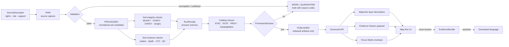

<!-- [KFM_META_BLOCK_V2]
doc_id: kfm://doc/TODO-VERIFY-uuid
title: Soil Domain
type: standard
version: v1
status: draft
owners: TODO-VERIFY
created: TODO-VERIFY
updated: 2026-04-22
policy_label: TODO-VERIFY
related: [TODO-VERIFY]
tags: [kfm, soil, soils, domain, ssurgo, sda, soil-moisture, evidence, map-first, time-aware]
notes: [README-like standard doc for docs/domains/soil/README.md. Exact mounted path, owner assignment, doc_id, created date, policy label, linked file existence, and branch-local implementation depth remain NEEDS VERIFICATION before commit.]
[/KFM_META_BLOCK_V2] -->

<a id="top"></a>

# Soil Domain

Governed orientation for soil survey, soil-moisture, gridded derivative, profile evidence, and interpretation surfaces in KFM.

> [!IMPORTANT]
> **Status:** `experimental`  
> **Owners:** `TODO-VERIFY`  
> **Path:** `docs/domains/soil/README.md`  
> **Authority:** supporting domain README; not a schema, policy file, source descriptor, pipeline, receipt, proof, catalog, release manifest, or runtime route.  
> **Quick jumps:** [Scope](#scope) · [Repo fit](#repo-fit) · [Inputs](#inputs) · [Exclusions](#exclusions) · [Directory tree](#directory-tree) · [Quickstart](#quickstart) · [Usage](#usage) · [Diagram](#diagram) · [Tables](#tables) · [Task list](#task-list--definition-of-done) · [FAQ](#faq) · [Appendix](#appendix)


> [!NOTE]
> **Current evidence posture:** this README is grounded in attached KFM doctrine and soil-lane planning material. Current branch implementation, exact linked file inventory, CI workflows, route names, emitted artifacts, and runtime behavior are **NEEDS VERIFICATION** until inspected in the mounted repository.

---

## Scope

This directory explains the **soil domain burden** inside Kansas Frontier Matrix: what soil evidence means, how soil source families differ, and which downstream KFM surfaces must stay separated.

The soil domain covers:

- static detailed soil survey evidence such as map units, components, horizons, and MUKEY-centered properties
- official tabular/query access patterns such as Soil Data Access-style query outputs
- gridded derivative companions such as gSSURGO/gNATSGO-style artifacts
- station soil-moisture and soil-climate observations
- satellite/grid soil-moisture context
- pedon/profile/horizon evidence where source support is explicit
- soil interpretations such as hydrologic group, hydric status, drainage, prime farmland, land capability, engineering interpretations, and agronomic suitability
- governed change evidence such as diff reports, promotion candidates, correction receipts, and rollback references

### Domain rule

The soil lane is a **governed family**, not a single truth table.

Soil survey polygons, SDA tabular rows, gridded products, station readings, reference-network observations, satellite grids, and KFM-authored summaries carry different support, spatial resolution, time basis, units, quality flags, and publication burden. They may be related, but they must not be flattened into one anonymous “soil layer.”

### Naming note

The requested path is `docs/domains/soil/README.md`. Some prior KFM lineage uses `soils/` in path examples. This README uses the singular target path from the current task and marks any plural-path aliasing as **NEEDS VERIFICATION**.

[Back to top](#top)

---

## Repo fit

`docs/domains/soil/README.md` is the human-facing domain map for soil knowledge. It should help maintainers understand what belongs in the soil lane and where stronger machine authority lives.

Because the mounted repo was not available during drafting, candidate related paths are shown in code form rather than active Markdown links. Convert them to relative links only after branch-local file existence is confirmed.

| Direction | Candidate surface | Status | Expected role |
|---|---|---:|---|
| Upstream | `docs/domains/README.md` | NEEDS VERIFICATION | Domain index and placement rule |
| Upstream | `docs/architecture/README.md` | NEEDS VERIFICATION | Cross-domain architecture and trust membrane |
| Upstream | `docs/standards/README.md` | NEEDS VERIFICATION | Markdown, metadata, and review standards |
| Adjacent | `docs/domains/agriculture/README.md` | NEEDS VERIFICATION | Crop, production, NASS/CDL, and agriculture-specific interpretation |
| Adjacent | `docs/domains/hydrology/README.md` | NEEDS VERIFICATION | Watershed, water, flood, and hydrologic proof-lane context |
| Downstream | `data/registry/soil/` | PROPOSED / NEEDS VERIFICATION | SourceDescriptor instances and source-role review |
| Downstream | `schemas/contracts/v1/soil/` | PROPOSED / NEEDS VERIFICATION | Soil contract schemas if this is the repo’s confirmed schema home |
| Downstream | `pipelines/soils/` | PROPOSED / NEEDS VERIFICATION | Static SSURGO/SDA normalization and watcher logic |
| Downstream | `pipelines/soil_moisture/` | PROPOSED / NEEDS VERIFICATION | Station and soil-moisture normalization |
| Downstream | `tools/validators/soil_integrity/` | PROPOSED / NEEDS VERIFICATION | Static soil candidate integrity checks |
| Downstream | `tools/validators/soil_moisture/` | PROPOSED / NEEDS VERIFICATION | Station reading and time-series checks |
| Downstream | `policy/soil/` | PROPOSED / NEEDS VERIFICATION | Soil-specific allow/deny/review rules |
| Downstream | `apps/governed_api/` | PROPOSED / NEEDS VERIFICATION | Governed soil API surfaces, EvidenceBundle resolution, and finite outcomes |
| Downstream | `apps/maplibre/` or `apps/web/` | PROPOSED / NEEDS VERIFICATION | Released soil layer descriptors and Evidence Drawer wiring |

> [!WARNING]
> This README may reference proposed homes, but it must not imply those paths exist, are enforced, or are wired into CI until the branch proves it.

[Back to top](#top)

---

## Inputs

The following belongs in this domain README or its child documentation.

| Input family | Belongs here when it… | Truth posture |
|---|---|---:|
| Domain definitions | explains soil-specific meanings, support types, and boundaries | CONFIRMED / PROPOSED |
| Source-family summaries | describes source roles without becoming the actual source descriptor | PROPOSED |
| Burden notes | records what each source family must preserve before public use | PROPOSED |
| Cross-lane rules | clarifies how soil relates to hydrology, agriculture, habitat, geology, hazards, or land ownership | PROPOSED |
| UI trust expectations | states what clicked soil features must expose in the Evidence Drawer | PROPOSED |
| First-slice planning | summarizes fixture-first validation, not live-source implementation | PROPOSED |
| Open verification backlog | lists unresolved rights, owner, route, schema-home, and source-cadence questions | NEEDS VERIFICATION |

### Accepted source families

The soil lane may discuss these source families, provided each live use is separately admitted through a source descriptor, rights posture, validator, and promotion gate:

- `ssurgo` — detailed soil survey backbone
- `soil_data_access` — official tabular/query access surface
- `gssurgo` — gridded derivative companion
- `gnatsgo` — broader gridded derivative companion
- `kansas_mesonet` — Kansas station context for soil moisture/weather, when terms and schema are verified
- `scan` — NRCS reference/agricultural soil climate network
- `uscrn` — NOAA reference station climate and soil products
- `smap` — NASA satellite/grid soil-moisture context

> [!IMPORTANT]
> Source names in this README do not activate connectors. They are domain references until source descriptors, rights checks, fixtures, and validators exist.

[Back to top](#top)

---

## Exclusions

This directory must not become a shadow authority for stronger KFM surfaces.

| Does **not** belong here | Put it instead | Why |
|---|---|---|
| Raw source captures, downloaded archives, CSVs, GeoPackages, GeoParquet, PMTiles, or rasters | `data/raw/`, `data/work/`, `data/processed/`, `data/published/` or confirmed equivalents | Domain docs do not store data |
| Machine-readable source descriptors | `data/registry/soil/` or confirmed source-registry home | Source admission needs executable validation and ownership |
| JSON Schema or contract definitions | `schemas/contracts/v1/soil/` or confirmed schema home | Machine contracts must not drift into prose |
| Rego/policy-as-code | `policy/soil/` or confirmed policy home | Policy must be testable and fail closed |
| Validator scripts | `tools/validators/soil_integrity/`, `tools/validators/soil_moisture/`, or confirmed validator homes | Validators need fixtures and deterministic outputs |
| Pipeline code or watcher logic | `pipelines/soils/`, `pipelines/soil_moisture/`, or confirmed pipeline homes | Execution logic must emit receipts and validation reports |
| Receipts | `data/receipts/soil/` or confirmed receipt home | Receipts are process memory, not domain doctrine |
| Proof packs and signed attestations | `data/proofs/`, `release/`, or confirmed proof/release homes | Proofs are release-grade trust objects |
| STAC/DCAT/PROV catalog records | `data/catalog/` or confirmed catalog home | Catalog closure is machine-checkable release support |
| UI components, route handlers, or model prompts | `apps/`, `packages/`, `prompts/`, or confirmed runtime homes | Domain prose should not masquerade as implementation |
| Field-level agronomic advice, crop insurance logic, or financial recommendations | agriculture, policy, or domain-specific governed lanes | Soil evidence can inform, but this README is not an advisory product |

[Back to top](#top)

---

## Directory tree

Current branch contents are **NEEDS VERIFICATION**. The tree below is a conservative proposed documentation shape for this directory only.

```text
docs/domains/soil/
├── README.md                 # this domain orientation
├── SOURCE_BURDEN.md          # PROPOSED: source role and support burden notes
├── SUPPORT_TYPES.md          # PROPOSED: support_type taxonomy and examples
├── LAYER_GUIDE.md            # PROPOSED: MapLibre layer and Evidence Drawer expectations
├── OPEN_VERIFICATION.md      # PROPOSED: unresolved source, rights, owner, and path checks
└── CHANGELOG.md              # PROPOSED: doc-level evolution notes
```

> [!TIP]
> Keep this directory small. Put executable contracts, fixtures, policies, validators, pipeline code, and emitted artifacts in their stronger homes.

[Back to top](#top)

---

## Quickstart

Use this when mounting the real repository before committing or revising this README.

### 1. Confirm repo state

```bash
git status --short
git branch --show-current
git rev-parse --show-toplevel
```

Expected result: a real KFM checkout with a known branch and reviewable dirty state.

### 2. Verify the requested path

```bash
test -d docs/domains/soil || mkdir -p docs/domains/soil
test -f docs/domains/soil/README.md && sed -n '1,80p' docs/domains/soil/README.md || true
```

> [!CAUTION]
> Creating the directory is safe; replacing existing content is not. If a branch already has a soil README, preserve strong existing substance and merge this file into it rather than overwriting it.

### 3. Search before adding new terms

```bash
git grep -n "mukey\|cokey\|chkey\|content_spec_hash\|spec_hash\|run_receipt\|SSURGO\|gSSURGO\|gNATSGO\|Soil Data Access\|Kansas Mesonet\|soil_moisture" -- \
  docs schemas contracts data policy tools tests pipelines apps packages .github 2>/dev/null || true
```

### 4. Verify adjacent homes before linking

```bash
for p in \
  docs/domains/README.md \
  data/registry/soil \
  schemas/contracts/v1/soil \
  pipelines/soils \
  pipelines/soil_moisture \
  tools/validators/soil_integrity \
  tools/validators/soil_moisture \
  policy/soil
do
  if [ -e "$p" ]; then
    echo "FOUND  $p"
  else
    echo "MISSING $p"
  fi
done
```

### 5. Keep default checks offline

```bash
# PROPOSED examples only; replace with repo-native commands after inspection.
python -m pytest tests/soil tests/validators/soil_integrity tests/validators/soil_moisture
```

Default CI should not depend on live NRCS, Kansas Mesonet, NOAA, or NASA access. Live probes belong in manual or scheduled dry-run jobs with source terms, rate limits, and HTTP validators visible.

[Back to top](#top)

---

## Usage

Use this README when a maintainer needs to decide where a soil concept belongs, how strong a soil claim is, or what evidence a public map interaction must reveal.

### A safe soil-claim workflow

1. Identify the `support_type`.
2. Identify the source role.
3. Confirm stable identifiers such as `mukey`, `cokey`, `chkey`, `station_id`, `depth_cm`, `timestamp_utc`, `query_hash`, `geometry_hash`, or product/grid identifiers.
4. Resolve `EvidenceRef` to `EvidenceBundle`.
5. Preserve `content_spec_hash` for normalized content and `run_hash` for execution identity.
6. Apply rights, sensitivity, freshness, and review checks.
7. Publish only through governed API/released artifacts.
8. Keep the Evidence Drawer one interaction away from the map feature, layer summary, Focus answer, export preview, or story claim.

### Common safe outcomes

| Situation | Safe outcome |
|---|---|
| No evidence bundle resolves | `ABSTAIN` |
| Policy forbids release | `DENY` |
| Source role is unknown | quarantine or `DENY` |
| Query hash is missing for SDA-derived tables | quarantine or `DENY` |
| Station reading lacks station metadata or timezone support | quarantine or `DENY` |
| SMAP/grid data is presented as station truth | `DENY` |
| Gridded derivative is treated as a replacement for SSURGO/SDA provenance | `DENY` |
| Candidate passes source, key, range, support, and catalog checks | eligible for downstream review, not automatically published |

[Back to top](#top)

---

## Diagram



[Back to top](#top)

---

## Tables

### Support-type matrix

| `support_type` | Typical source role | Canonical-ish objects | Must not be mistaken for |
|---|---|---|---|
| `authoritative_static_soil` | detailed soil survey | `SoilMapUnit`, `SoilComponent`, `SoilHorizon`, `MukeyProperties` | station moisture, gridded convenience layer, KFM summary |
| `authoritative_static_soil_query` | official tabular/query access | SDA query result with `query_hash` and source version | anonymous CSV or untracked SQL |
| `gridded_derivative_soil` | official derivative / analysis companion | gSSURGO/gNATSGO manifests, raster mappings, COG/PMTiles descriptors | replacement for SSURGO/SDA provenance |
| `station_soil_moisture` | in-situ station observation | `SoilMoistureStation`, `SoilMoistureReading`, `SoilMoistureSeries` | static survey fact or satellite grid |
| `reference_station_soil_climate` | reference/agricultural station network | SCAN/USCRN station and reading subsets | Kansas Mesonet station truth without source separation |
| `satellite_soil_moisture_grid` | satellite/grid estimate | SMAP product/grid records and layer descriptors | field-level station reading |
| `profile_soil_evidence` | pedon/profile/horizon evidence | profile, pedon, horizon analytic records | invented chemistry, generic interpretation, or map-unit-only truth |
| `soil_interpretation` | source interpretation or KFM-derived summary | hydrologic group, hydric, drainage, LCC, farmland, engineering/agronomic interpretations | raw survey record unless explicitly source-supported |
| `governed_change_evidence` | watcher/diff support | `SoilDiffReport`, `PromotionCandidate`, `CorrectionReceipt` | publication itself |

### Source-family burden matrix

| Source family | Candidate descriptor | Stable keys / identity | First verification burden |
|---|---|---|---|
| NRCS SSURGO | `ssurgo.yaml` | `mukey`, `areasymbol`, `musym`, `cokey`, `chkey` | current package/download path, citation text, geometry CRS, table profile |
| USDA NRCS Soil Data Access | `soil_data_access.yaml` | `query_hash`, `mukey`, `cokey`, `chkey`, service version | SQL constraints, rate limits, endpoint profile, column names |
| NRCS gSSURGO | `gssurgo.yaml` | MUKEY raster mapping, state package metadata | delivery route, raster resolution, package checksum, derivative limitations |
| NRCS gNATSGO | `gnatsgo.yaml` | MUKEY raster mapping, composite metadata | release version, refresh cadence, derivative limitations |
| Kansas Mesonet | `kansas_mesonet.yaml` | provider station ID, variable, `depth_cm`, endpoint URL | data usage policy, station schema, variable names, access window, rate limits |
| NRCS SCAN | `scan.yaml` | station ID, element, depth, timestamp | access mechanism, timezone behavior, QC/status fields |
| NOAA USCRN | `uscrn.yaml` | station ID, product, timestamp, layer depth | product version, access format, QC fields |
| NASA SMAP / LANCE | `smap.yaml` | grid cell, product ID/version, granule ID, time window | auth, latency, resolution, mask/QA fields, public-use obligations |

### Layer and Evidence Drawer expectations

| Layer family | Candidate layer ID | Support type | Evidence Drawer must show |
|---|---|---|---|
| Soil map units | `soil-mapunits` | `authoritative_static_soil` | `mukey`, source ID, `content_spec_hash`, catalog refs, policy labels, validation time |
| Soil property summaries | `soil-property-summary` | `authoritative_static_soil` or `soil_interpretation` | values, units, aggregation method, weighting basis, source refs, limitations |
| Soil moisture stations | `soil-moisture-stations` | `station_soil_moisture` | station ID, depth list, variables, freshness, QC summary, source role |
| Soil moisture readings/series | `soil-moisture-series` | `station_soil_moisture` | time basis, `value_m3m3`, `depth_cm`, QC flags, receipt/evidence refs |
| Gridded derivative soils | `soil-gridded-derivative` | `gridded_derivative_soil` | grid resolution, source derivation, MUKEY mapping, limitations |
| Satellite moisture context | `smap-soil-moisture-context` | `satellite_soil_moisture_grid` | grid cell/time window, QA flags, product version, “not station truth” limitation |

[Back to top](#top)

---

## Task list / definition of done

A branch-ready version of this README is done when:

- [ ] `docs/domains/soil/README.md` exists on the active branch and this file preserves any strong prior content.
- [ ] KFM Meta Block V2 values are replaced where branch evidence supports them.
- [ ] Owners are confirmed through repo evidence, CODEOWNERS, or documented stewardship assignment.
- [ ] Link targets in the repo-fit table are verified and converted to relative Markdown links only where valid.
- [ ] SourceDescriptor homes are confirmed for SSURGO, SDA, gSSURGO, gNATSGO, Kansas Mesonet, SCAN, USCRN, and SMAP, or unresolved sources remain listed as `NEEDS VERIFICATION`.
- [ ] At least one valid SSURGO/SDA static fixture and one invalid fixture exist or are explicitly deferred.
- [ ] At least one valid soil-moisture fixture and one invalid fixture exist or are explicitly deferred.
- [ ] `soil_integrity` and `soil_moisture` validators emit finite `pass`, `quarantine`, `deny`, or `error` reports, or this README labels them as proposed.
- [ ] Receipts, proofs, catalogs, release manifests, and publication decisions remain separate in prose and implementation.
- [ ] MapLibre/Evidence Drawer expectations point to governed API payloads, not RAW, WORK, QUARANTINE, or canonical/internal stores.
- [ ] CI defaults are offline and deterministic; live source probes are separated and gated.
- [ ] The README states what it does not prove yet.

[Back to top](#top)

---

## FAQ

### Is this README the canonical soil schema?

No. It is a domain orientation document. Canonical machine-readable fields belong in the confirmed schema/contract home.

### Can gSSURGO or gNATSGO replace SSURGO/SDA provenance?

No. They are valuable gridded companions, but they should remain visibly derivative unless a stronger release object and policy decision explicitly narrow the claim.

### Can Kansas Mesonet, SCAN, USCRN, or SMAP prove static soil survey facts?

No. Those sources can provide soil-moisture or soil-climate context with their own support and time basis. They do not become detailed static soil survey truth.

### Does a passing validator publish soil data?

No. A passing validator result can make a candidate eligible for downstream review. Publication still requires catalog closure, policy review, proof/release objects, and promotion.

### What is the difference between `content_spec_hash` and `run_hash`?

`content_spec_hash` identifies normalized content, schema version, and transform logic. `run_hash` identifies an execution event such as a specific run ID, retrieval time, actor, environment, and tool version. Retrieval timestamp changes should not create a new content identity by itself.

### Should this domain include agriculture?

Only at the boundary. Soil can support agriculture, but crop progress, NASS QuickStats, CDL, farm production, and crop-condition products should remain in agriculture or adjacent source lanes unless a confirmed repo convention says otherwise.

### What should Focus Mode do with soil questions?

Focus Mode should synthesize only over admissible released evidence and return finite outcomes. Missing evidence should `ABSTAIN`; policy blocks should `DENY`; invalid input or runtime failure should `ERROR`.

[Back to top](#top)

---

## Appendix

<details>
<summary>Glossary</summary>

| Term | Meaning |
|---|---|
| `mukey` | Mapunit key used in SSURGO-style soil records. |
| `cokey` | Component key used to preserve component-level meaning. |
| `chkey` | Horizon/layer key used where horizon detail is source-supported. |
| `query_hash` | Canonical identity of SDA SQL/query configuration. |
| `geometry_hash` | Canonical identity of normalized geometry. |
| `content_spec_hash` | Stable content identity over normalized source content, schema version, and transform rules. |
| `run_hash` | Execution identity over run ID, retrieval timestamp, actor, environment, and tool versions. |
| `RunReceipt` | Process-memory object for audit and replay; not release proof by itself. |
| `EvidenceBundle` | Resolved support package that outranks generated language. |
| `CatalogMatrix` | Machine-checkable closure across STAC, DCAT, PROV, manifests, checksums, and EvidenceBundle refs. |
| `DecisionEnvelope` | Finite runtime outcome envelope such as `ANSWER`, `ABSTAIN`, `DENY`, or `ERROR`. |
| `PromotionDecision` | Release-state decision; distinct from validator result and runtime answer outcome. |

</details>

<details>
<summary>Minimum credible first slice</summary>

A credible first slice should stay narrow and fixture-first:

1. SSURGO/SDA static fixture with sample `mukey`, `cokey`, `chkey`, query identity, and optional clipped geometry.
2. Kansas Mesonet-style soil-moisture fixture with station metadata and a small two-depth reading sample.
3. `soil_integrity` validator emitting finite machine-readable output.
4. `soil_moisture` validator emitting finite machine-readable output.
5. One run receipt per fixture run.
6. One catalog-closure stub showing STAC/DCAT/PROV/CatalogMatrix alignment.
7. One PMTiles or layer-manifest stub clearly marked as delivery artifact, not canonical truth.
8. One Evidence Drawer payload fixture for a clicked soil feature.
9. Offline tests for hashing, key integrity, range sanity, support-type separation, evidence closure, and no timestamp-only promotion.

</details>

<details>
<summary>Open verification backlog</summary>

- [ ] Confirm whether the repo uses `soil/` or `soils/` for domain and pipeline paths.
- [ ] Confirm schema home: `schemas/contracts/v1/soil/`, `contracts/soil/`, or another established location.
- [ ] Confirm source descriptor home and descriptor format.
- [ ] Confirm policy engine and policy test convention.
- [ ] Confirm validator language and result-envelope schema.
- [ ] Confirm MapLibre layer registry path and Evidence Drawer payload contract.
- [ ] Confirm governed API framework and route naming.
- [ ] Confirm whether `content_spec_hash` has replaced or aliases prior `spec_hash` language.
- [ ] Confirm official source terms, cadence, citation text, rate limits, and auth requirements before live use.
- [ ] Confirm publication policy for soil products that intersect private land, critical infrastructure, cultural resources, or restricted stewardship overlays.
- [ ] Confirm CI can run offline by default and does not call live source systems during normal PR validation.

</details>

[Back to top](#top)
