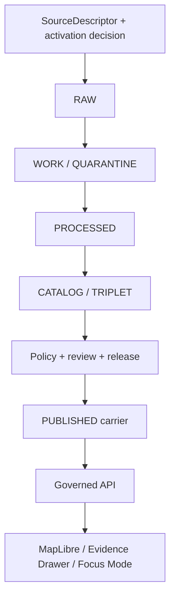

<!-- [KFM_META_BLOCK_V2]
doc_id: kfm://doc/domains/soil/readme
title: Soil Domain
type: domain-readme
version: v1.1
status: draft; repository-grounded; implementation-partial
owners:
  - OWNER_TBD - Soil domain steward
  - OWNER_TBD - Documentation steward
  - OWNER_TBD - Source steward
  - OWNER_TBD - Policy and release steward
created: 2026-05-19
updated: 2026-08-02
policy_label: public
owning_root: docs/
responsibility: Human-readable scope, boundaries, maturity, and navigation for the Soil domain lane
related:
  - docs/doctrine/directory-rules.md
  - docs/adr/ADR-0029-adopt-directory-governance-standard-v2.md
  - docs/domains/soil/ARCHITECTURE.md
  - docs/domains/soil/CANONICAL_PATHS.md
  - docs/domains/soil/DATA_LIFECYCLE.md
  - docs/domains/soil/IDENTITY_MODEL.md
  - docs/domains/soil/SOURCES.md
  - docs/domains/soil/VERIFICATION.md
  - contracts/domains/soil/README.md
  - schemas/contracts/v1/domains/soil/README.md
  - fixtures/domains/soil/README.md
  - tests/domains/soil/test_soil_smoke.py
  - tools/validators/domains/soil/validate_public_safe_fixture.py
tags: [kfm, domain, soil, support-type, source-role, evidence, lifecycle, maplibre, cite-or-abstain]
notes:
  - "Replaces the two-line greenfield placeholder with a repository-grounded domain index."
  - "Repository snapshot: main@fc451ecd469654f34f67135ef39184a9b15be60e plus the bounded fixture-validator batch described below."
  - "Planning lineage: KFM Soil Architecture Extended Pro PDF-Only Planning Report, 25 pages, SHA-256 7c2d498212b9ad56f3ba37bf91f841e9f328794e8aa4940f8f665a4116c5aaea."
  - "The planning report explicitly had no mounted repository. Its proposed paths and implementation claims are not imported as current facts."
[/KFM_META_BLOCK_V2] -->

<a id="top"></a>

# Soil domain

Human-readable entry point for the Kansas Frontier Matrix Soil lane: domain
scope, object families, support-type boundaries, current repository maturity,
source posture, lifecycle routing, public-surface constraints, and the
dependency order for future implementation.

> [!IMPORTANT]
> **Current result:** Soil has extensive documentation, contract, schema,
> registry, policy, pipeline, package, UI, and test scaffolding, but most
> executable surfaces remain placeholders. One bounded, deterministic,
> no-network smoke suite is active. No live source activation, complete
> ingestion path, catalog closure, proof-bearing release, or published Soil
> product is established by this README.

| Field | Value |
|---|---|
| Path | `docs/domains/soil/README.md` |
| Owning root | `docs/` - human-readable domain guidance |
| Domain segment | `soil` |
| Status | `draft / repository-grounded / implementation-partial` |
| Evidence snapshot | `main@fc451ecd469654f34f67135ef39184a9b15be60e` plus this bounded fixture-validator batch |
| Truth posture | `CONFIRMED` paths and inspected bytes; `PROPOSED` unresolved semantics; `NEEDS VERIFICATION` operational maturity |
| Lifecycle | `RAW -> WORK / QUARANTINE -> PROCESSED -> CATALOG / TRIPLET -> PUBLISHED` |
| Public posture | Governed interfaces and released artifacts only |
| AI posture | Interpretive and cite-or-abstain; never Soil truth authority |

## Start here

- [Architecture](ARCHITECTURE.md) - domain model and intended lane structure.
- [Canonical paths](CANONICAL_PATHS.md) - responsibility-root routing and
  recorded path conflicts.
- [Identity model](IDENTITY_MODEL.md) - object identity, native identifiers,
  versioning, and correction.
- [Data lifecycle](DATA_LIFECYCLE.md) - phase boundaries and trust objects.
- [Sources](SOURCES.md) and [source registry](SOURCE_REGISTRY.md) - source
  families and admission posture.
- [API contracts](API_CONTRACTS.md) and
  [map/UI contracts](MAP_UI_CONTRACTS.md) - governed delivery expectations.
- [Verification](VERIFICATION.md) and
  [verification backlog](VERIFICATION_BACKLOG.md) - evidence still needed.
- [Definition of done](DEFINITION_OF_DONE.md) - completion criteria.
- [Expansion plan](EXPANSION_PLAN.md) and
  [expansion backlog](EXPANSION_BACKLOG.md) - future work, not current
  implementation proof.

## Purpose and authority boundary

The Soil lane explains and coordinates Soil-specific meaning across KFM
responsibility roots. This README owns human navigation and status. It does not
own machine shape, policy, source admission, executable transformation,
lifecycle data, evidence objects, release decisions, or public runtime
behavior.

| Responsibility | Owning surface | Soil relationship |
|---|---|---|
| Human domain scope and guidance | `docs/domains/soil/` | This lane |
| Semantic object meaning | [`contracts/domains/soil/`](../../../contracts/domains/soil/README.md) | Soil contracts |
| Machine-checkable shape | [`schemas/contracts/v1/domains/soil/`](../../../schemas/contracts/v1/domains/soil/README.md) | Soil schemas |
| Allow, deny, restrict, abstain | [`policy/domains/soil/`](../../../policy/domains/soil/README.md) | Soil policy |
| Source identity and admission records | [`data/registry/sources/soil/`](../../../data/registry/sources/soil/README.md) | Source descriptors and placeholders |
| Reusable implementation | [`packages/domains/soil/`](../../../packages/domains/soil/README.md) | Deterministic helpers |
| Lifecycle transformations | [`pipelines/domains/soil/`](../../../pipelines/domains/soil/README.md) | Executable pipeline lane |
| Declarative runs | [`pipeline_specs/soil/`](../../../pipeline_specs/soil/README.md) | Pipeline definitions |
| Conformance evidence | [`tests/domains/soil/`](../../../tests/domains/soil/README.md) | Deterministic tests |
| Repository validators | [`tools/validators/domains/soil/`](../../../tools/validators/domains/soil/README.md) | Validation tooling |
| Release, correction, rollback | `release/` | Decision authority |
| Public UI composition | [`apps/explorer-web/.../soil/`](../../../apps/explorer-web/src/features/domains/soil/README.md) | Downstream rendering only |

> [!WARNING]
> Soil is a domain segment, not a repository root. A new top-level `soil/`
> directory, a parallel schema home, or a second source registry would violate
> the adopted [Directory Rules v2](../../doctrine/directory-rules.md) and
> [ADR-0029](../../adr/ADR-0029-adopt-directory-governance-standard-v2.md).

## Domain scope

### Soil-owned object families

| Object family | Soil meaning | Required boundary |
|---|---|---|
| `SoilMapUnit` | Survey map-unit identity and geometry support | Not a parcel, farm boundary, or live field condition |
| `SoilComponent` | Named component within a map unit | Preserve percentage, source vintage, and MUKEY/COKEY lineage |
| `Horizon` | Depth-bounded vertical layer | Preserve CHKEY, depth basis, units, and method |
| `ComponentHorizonJoin` | MUKEY/COKEY/CHKEY continuity | Not a provenance-free convenience join |
| `SoilProperty` | Measured, reported, or derived attribute | Preserve role, method, units, depth, and support type |
| `HydrologicSoilGroup` | Runoff-potential interpretation | Context for Hydrology; not streamflow or flood truth |
| `SoilMoistureObservation` | Time-bounded moisture observation | Preserve station/grid distinction, depth, time, unit, and QC |
| `Pedon` / `SoilProfileView` | Profile-level evidence and projection | Not map-unit truth without a declared derivation |
| `ErosionRisk` | Interpretive derivative | Not Hazards authority or operational advice |
| `SuitabilityRating` | Method-bound suitability derivative | Not crop, legal, economic, or engineering advice |
| `SoilTimeCaveat` | Vintage, freshness, or temporal limitation | Must remain attached to time-bounded claims |

### Cross-domain boundaries

Soil may support other lanes without absorbing their authority.

| Adjacent lane | Permitted Soil contribution | Soil must not claim |
|---|---|---|
| Agriculture | Soil properties and released suitability inputs | Crop/yield truth, farm-management advice, or operator decisions |
| Hydrology | Hydrologic soil group and infiltration context | Streamflow, groundwater, flood extent, or water-rights truth |
| Geology | Soil-parent-material context and crosswalks | Lithology, stratigraphy, borehole, or mineral-resource authority |
| Habitat / Flora / Fauna | Released soil context and evidence links | Species occurrence, habitat condition, or ecological authority |
| Hazards | Soil support for reviewed derivatives | Hazard forecast, emergency guidance, or warning authority |
| People / Land | Public-safe generalized soil context | Ownership, title, living-person, or field-level private truth |

## Support-type separation

Support type is the Soil-specific anti-collapse control. Static survey,
derivative grids, station observations, satellite grids, profile evidence, and
interpretations cannot be presented as interchangeable evidence.

### Confirmed implementation vocabulary

The active synthetic smoke test currently accepts exactly:

- `static_survey`
- `station_observation`
- `satellite_grid`
- `modeled_derivative`

See
[`test_soil_smoke.py`](../../../tests/domains/soil/test_soil_smoke.py).

### Proposed documentation vocabulary

Existing Soil documents and package guidance also use richer terms such as:

- `authoritative_static_soil`
- `gridded_derivative_soil`
- `station_soil_moisture`
- `reference_station_soil_climate`
- `satellite_soil_moisture_grid`
- `profile_soil_evidence`
- `soil_interpretation`
- `governed_change_evidence`

> [!CAUTION]
> **CONFIRMED vocabulary conflict:** the active smoke-test enum and the richer
> documentation vocabulary do not yet form one accepted contract. Do not add
> ad hoc aliases or treat either list as a complete public enum. Resolve the
> semantic contract, canonical schema, compatibility mapping, fixtures, and
> finite invalid-value behavior together before expanding runtime use.

## Source families

The repository carries documentation or placeholder records for these source
families:

| Family | Intended support | Current posture |
|---|---|---|
| NRCS SSURGO / SDA | Static survey, map units, components, horizons | Human docs and placeholder descriptors; activation not proven |
| gSSURGO / gNATSGO | Gridded or rasterized derivatives | Placeholder registry/spec surfaces |
| Kansas Mesonet | Station soil-moisture observations | Placeholder descriptor and normalizer lane |
| NRCS SCAN | Reference station soil climate | Catalog/registry and ingest-lane documentation |
| NOAA USCRN | Reference station soil temperature/moisture context | Placeholder descriptor and ingest-lane documentation |
| NASA SMAP | Satellite soil-moisture grid | Placeholder descriptor and ingest-lane documentation |
| ISRIC SoilGrids | Modeled global gridded soil properties | Product admission documentation; source access and activation held |

Human source profiles include:

- [Soil Data Access](../../sources/catalog/nrcs/soil-data-access.md)
- [Web Soil Survey](../../sources/catalog/nrcs/web-soil-survey.md)
- [SCAN soil climate](../../sources/catalog/nrcs/scan-soil-climate.md)
- [ISRIC SoilGrids](../../sources/catalog/isric/isric-soilgrids.md)

> [!IMPORTANT]
> A catalog page, URL, placeholder YAML file, or public endpoint does not
> activate a source. Each product still needs source identity, role, rights,
> sensitivity, cadence, access method, deterministic fixtures, validator
> behavior, an explicit activation decision, correction handling, and rollback
> support.

## Current repository maturity

This matrix distinguishes path presence from substantive implementation.

| Surface | Confirmed state at the evidence snapshot | Classification |
|---|---|---|
| Domain documentation | This directory contains architecture, lifecycle, identity, source, API, UI, release, verification, and backlog documents | Present; several documents retain pre-inspection `PROPOSED` language |
| Semantic contracts | Contract index and multiple object-family Markdown files exist | Present; review and schema alignment still required |
| Schemas | Twenty-two Soil JSON files exist; seven are empty, permissive `PROPOSED` object scaffolds and fifteen have other shapes | Presence is not proof of field-level or cross-file closure; review each schema and its tests |
| Source registry | Soil source YAML files exist in two historical lane shapes | Placeholder and path-drift evidence; no activation proven |
| Package implementation | `identity.py`, `layers.py`, and `observations.py` exist | Greenfield placeholders |
| Pipeline implementation | Ingest, normalize, validate, catalog, triplets, publish, and rollback modules exist | Greenfield placeholders |
| Pipeline specs | Five YAML specs exist with empty `stages` arrays | Declarative scaffolding only |
| Policy | Soil Rego files exist | Default/empty proposed scaffolds; no substantive policy behavior proven |
| Validators | `validate_public_safe_fixture.py` is executable; other Soil validator files and lane READMEs remain | One bounded standard-library fixture profile; several adjacent executable files are one-line placeholders |
| Domain tests | The no-network tests in `test_soil_smoke.py` are executable | One bounded active slice with explicit positive, negative, parser, CLI, and input-bound coverage |
| Other named test modules | Six additional domain test files exist | Documentation-only placeholder modules; zero executable assertions |
| Explorer Web | README plus `EvidenceDrawer.tsx`, `FocusFlow.tsx`, and `layers.ts` exist | Components are explicit greenfield placeholders |
| Published Soil output | No release-grade Soil product was verified in this review | `UNKNOWN / NOT PROVEN` |

## Active bounded test slice

The current active suite reads a frozen synthetic fixture corpus and exercises
the reusable `validate_public_safe_fixture.py` validator. It checks:

- exact positive/negative fixture inventory and expected-finding sidecars;
- a closed set of four support types;
- required source-descriptor and evidence references;
- generalized county spatial support and denial of common precise-location
  aliases;
- closed top-level and nested objects;
- finite, ordered depth intervals;
- finite volumetric-water-content values, units, and range;
- fixture-only rights, sensitivity, review, release, promotion, and rollback
  states;
- bounded file size, JSON integer length, document depth, and document nodes;
- rejection of malformed JSON, duplicate keys, and non-standard numbers;
- deterministic code-and-path findings, JSON-line output, and CLI exit codes;
  and
- no network access through patched socket and `urllib` entry points.

It does not establish source truth, schema closure, policy execution, pipeline
behavior, catalog closure, proof construction, release approval, or
publication.

```bash
PYTHONDONTWRITEBYTECODE=1 KFM_NO_NETWORK=1 \
  python tests/domains/soil/test_soil_smoke.py --verbose
```

## Lifecycle and public boundary


```mermaid
flowchart TD
  A["SourceDescriptor + activation decision"] --> B["RAW"]
  B --> C["WORK / QUARANTINE"]
  C --> D["PROCESSED"]
  D --> E["CATALOG / TRIPLET"]
  E --> F["Policy + review + release"]
  F --> G["PUBLISHED carrier"]
  G --> H["Governed API"]
  H --> I["MapLibre / Evidence Drawer / Focus Mode"]
```

Required invariants:

- Connectors may emit RAW or QUARANTINE candidates and receipts; they do not
  publish.
- Watchers report source change; they do not promote.
- Validators report finite outcomes; they do not create source authority,
  evidence, policy decisions, or releases.
- Catalog and graph projections do not replace canonical evidence or review.
- Public clients do not read RAW, WORK, QUARANTINE, unresolved candidates, or
  internal canonical stores.
- MapLibre is the sole browser-side renderer under the current accepted
  architecture. Styling cannot make restricted bytes public-safe.
- Evidence Drawer and AI responses resolve EvidenceRefs through governed
  EvidenceBundles and abstain when support is insufficient.

## Dependency-ordered next work

The attached 25-page Soil planning report proposed a broad first slice while
explicitly lacking a mounted repository. Current repository evidence supports a
smaller sequence:

1. **Resolve support-type vocabulary.** Reconcile the active four-value smoke
   enum with the richer documentation vocabulary and record compatibility
   behavior.
2. **Close one semantic object family.** Select one existing contract and its
   canonical schema, then add strict valid/invalid synthetic fixtures.
3. **Graduate one validator.** Replace one named placeholder with a
   deterministic offline validator and finite outcomes; do not wire CI until
   the check name and failure semantics are stable.
4. **Reconcile source-registry path drift.** Inventory the two Soil source
   registry lane shapes; choose a canonical target through the accepted
   authority process before adding new writable records.
5. **Admit one source only after review.** Complete identity, role, rights,
   sensitivity, access, cadence, fixture, validator, activation, correction,
   and rollback requirements without enabling live access by default.
6. **Implement one lifecycle path.** Add deterministic ingest/normalize
   behavior only after the paired contract, schema, source decision, policy,
   fixtures, and validator are substantive.
7. **Close catalog and release separately.** Receipts, EvidenceBundles,
   validation reports, catalog entries, review, release decisions, and
   rollback targets remain distinct objects.
8. **Enable UI last.** Replace Explorer Web placeholders only after a governed
   API envelope and released public-safe carrier exist.

## Directory map

Current direct children only:

```text
docs/domains/soil/
├── API_CONTRACTS.md
├── ARCHITECTURE.md
├── CANONICAL_PATHS.md
├── CHANGELOG.md
├── CONTINUITY_INVENTORY.md
├── CROSS_LANES.md
├── DATA_LIFECYCLE.md
├── DEFINITION_OF_DONE.md
├── EXPANSION_BACKLOG.md
├── EXPANSION_PLAN.md
├── FILE_SYSTEM_PLAN.md
├── GLOSSARY.md
├── IDENTITY_MODEL.md
├── MAP_UI_CONTRACTS.md
├── MISSING_OR_PLANNED_FILES.md
├── PRESERVATION_MATRIX.md
├── README.md
├── RELEASE_INDEX.md
├── SOURCES.md
├── SOURCE_REGISTRY.md
├── VERIFICATION.md
└── VERIFICATION_BACKLOG.md
```

## Review checklist

- [ ] Claims are labeled from current repository evidence rather than planning
  memory.
- [ ] Soil remains a segment inside responsibility roots.
- [ ] Object family, source role, support type, units, depth, scale, time, and
  quality remain distinct.
- [ ] The support-type vocabulary conflict is not silently widened.
- [ ] Source descriptors and source activation are not inferred from
  placeholder records.
- [ ] Contracts, schemas, policy, validators, tests, receipts, proofs, release,
  and publication remain separate authorities.
- [ ] No real private field, person, owner, credential, restricted source
  payload, or precise sensitive location is added to fixtures.
- [ ] Default validation is deterministic and no-network.
- [ ] Public map, drawer, export, and AI paths depend on governed released
  carriers.
- [ ] Correction, withdrawal, derivative invalidation, and rollback remain
  possible.

## Validation and rollback

Validate this bounded Soil lane with:

```bash
PYTHONDONTWRITEBYTECODE=1 KFM_NO_NETWORK=1 \
  python tests/domains/soil/test_soil_smoke.py --verbose
python tools/validators/docs/link-check/check_links.py docs/domains/soil/README.md
git diff --check
```

Rollback before merge is closing the draft PR. After merge, revert the bounded
validator, fixtures, tests, workflow notes, Soil lane documentation, and
generated receipt through review. Reverting this batch does not change source,
policy, pipeline, release, deployment, or publication state.

## Evidence basis

| Evidence | Status | Used for | Does not prove |
|---|---|---|---|
| Current repository at `fc451ec...` plus this bounded batch | `CONFIRMED` | Exact paths, placeholder bytes, active fixture validator and smoke suite, current responsibility roots | Runtime or external source behavior |
| [Directory Rules v2](../../doctrine/directory-rules.md) and [ADR-0029](../../adr/ADR-0029-adopt-directory-governance-standard-v2.md) | `CONFIRMED accepted authority` | Placement and responsibility boundaries | Soil object semantics by themselves |
| *KFM Soil Architecture Extended Pro PDF-Only Planning Report* | `CONFIRMED supplied lineage` | Source-family breadth, anti-collapse pressure, intended gates, and implementation questions | Current implementation; the report states no repo was mounted |
| [Architecture](ARCHITECTURE.md), [identity](IDENTITY_MODEL.md), [lifecycle](DATA_LIFECYCLE.md), and [source](SOURCES.md) docs | `CONFIRMED present / mixed maturity` | Existing Soil language and intended boundaries | Complete schema, policy, validator, or release closure |
| [`test_soil_smoke.py`](../../../tests/domains/soil/test_soil_smoke.py) | `CONFIRMED executable evidence` | The bounded synthetic validation behavior described above | Live ingestion, publication, or Soil truth |

[Back to top](#top)
