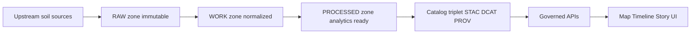

<!-- [KFM_META_BLOCK_V2]
doc_id: kfm://doc/6a5db34a-6a24-46c0-8b17-2c30f187e97f
title: Soils data sources
type: standard
version: v1
status: draft
owners: [data-pipelines, geospatial]
created: 2026-03-04
updated: 2026-03-04
policy_label: public
related: [docs/domains/soils/, data/registry/, tools/validators/]
tags: [kfm, soils, data-sources]
notes: ["Evidence discipline in this doc: CONFIRMED / PROPOSED / UNKNOWN. Default-deny: promotion gates fail-closed."]
[/KFM_META_BLOCK_V2] -->

# Soils data sources
Authoritative + complementary sources for Kansas soils baselines and soil-condition telemetry, with governance-ready acquisition notes.

> **IMPACT**
>
> **Status:** draft (active work surface)  
> **Owners:** `data-pipelines`, `geospatial`  
> **Policy label:** `public`  
> **Badges:**    *(TODO: wire to repo CI)*  
> **Quick nav:** [Scope](#scope) · [Where it fits](#where-it-fits) · [Source registry](#source-registry) · [Acquisition notes](#acquisition-notes) · [Governance defaults](#governance-defaults) · [Packaging guidance](#packaging-guidance) · [Promotion gates](#promotion-gates) · [Appendix](#appendix)

---

## Scope

This document covers:

- **Static soil baselines**: soil map units + attributes (mapunit/component/horizon concepts), and gridded soil products suitable for statewide mapping/analysis.
- **Dynamic soil condition**: in-situ soil moisture + temperature telemetry, plus satellite/model soil moisture products.
- **Kansas-first**: sources are listed with Kansas relevance, but many are national.

### Acceptable inputs

- Public-domain or openly licensed datasets and services.
- Datasets with clear **access method**, **versioning cadence**, and **citation expectations**.
- Geospatial formats that can be normalized to:
  - vector → **GeoParquet**
  - rasters → **COG**
  - catalog surfaces → **STAC + DCAT + PROV** (or a clearly defined KFM profile)

### Exclusions

- **Private soil lab tests / farm precision-ag datasets** (often contractual, personally identifying by inference, or commercially sensitive).  
  - **UNKNOWN** until a governance review confirms license, consent, and de-identification plan.
- Any source that requires scraping in violation of provider terms.
- Any dataset where licensing is ambiguous (fail-closed).

---

## Where it fits

This is a *domain inventory* that feeds:

1. **Registry/connector specs** (how to fetch + verify upstream)
2. **Pipelines** (RAW → WORK → PROCESSED)
3. **Catalog triplet** (STAC/DCAT/PROV)
4. **Governed APIs** (evidence retrieval)
5. **Map/Timeline/Story UI** (only after policy gates pass)



---

## Evidence discipline

Every meaningful entry below is labeled:

- **CONFIRMED**: explicitly supported by current KFM project docs referenced at the bottom of this file.
- **PROPOSED**: recommended integration pattern, but not yet validated end-to-end in KFM.
- **UNKNOWN**: not enough evidence to operationalize; minimal verification steps are provided.

---

## Source registry

> Tip: Treat this table as the “front door” for creating dataset cards and registry connectors.

Blank line before table (Markdown rendering stability).

| Source ID | Source | What it provides | Kansas coverage | Access pattern | Update / cadence | License / terms | KFM role | Evidence |
|---|---|---|---|---|---|---|---|---|
| `soils.nrcs.ssurgo` | USDA NRCS **SSURGO** | Detailed soil survey polygons + rich tabular attributes | Most KS survey areas | Bulk downloads (county/AOI), portals; joins via `mukey` | Annual refresh (anchor cycle) | Public domain (treat as CC0/US-PD) | Foundation baseline | **CONFIRMED** |
| `soils.nrcs.gssurgo` | USDA NRCS **gSSURGO** | Rasterized SSURGO for statewide/regional work | KS statewide packages | Bulk downloads (tiles/state); raster + tables | Annual refresh aligned to SSURGO cycle | Public domain (treat as CC0/US-PD) | Foundation baseline | **CONFIRMED** |
| `soils.nrcs.gnatsgo` | USDA NRCS **gNATSGO** | Seamless gridded national/state product derived from SSURGO + STATSGO2 gaps | KS state grid likely available; CONUS also | Bulk FGDB/raster distributions; join key `mukey` | Annual refresh aligned to soils cycle | Public domain (treat as CC0/US-PD) | Foundation baseline | **CONFIRMED** |
| `soils.nrcs.sda` | USDA NRCS **Soil Data Access (SDA)** | SQL/REST (and SOAP) gateway to SSURGO/STATSGO tables + some geometry | KS via `areasymbol` (`KS*`) + AOI functions | POST `/Tabular/post.rest` with SQL; chunk queries | Live service; sync to annual refresh | Public access; still record terms | Acquisition API | **CONFIRMED** |
| `soils.nrcs.wss` | **Web Soil Survey (WSS)** | Discovery + downloads for SSURGO by AOI/county | KS supported | Web UI (plus download links) | Updated with annual refresh | Public access | Discovery surface | **CONFIRMED** |
| `soils.nrcs.ssurgo_portal` | **SSURGO Portal** tool | Assisted downloads/import to SQLite/GeoPackage + raster generation | KS supported | Desktop tooling workflow | Updates with tool releases; data tied to SSURGO | Public access; tool is open | Ops assist | **CONFIRMED** |
| `soils.ksu.mesonet` | **Kansas Mesonet** soil probes | High-cadence soil moisture + temperature at standard depths | KS statewide stations | REST CSV endpoints; batch around request limits | Near-real-time (5-min → hourly → daily) | Free public use w/ attribution; obey usage policy | Telemetry / validation | **CONFIRMED** |
| `soils.nrcs.scan` | NRCS **SCAN** | National soil moisture + temperature + met variables | Some KS stations | Interactive tools + bulk retrieval | Hourly-ish station telemetry | Public access | Telemetry / validation | **CONFIRMED** |
| `soils.nasa.smap` | NASA **SMAP L3/L4** | Satellite soil moisture grids (daily composites; model-assimilated products) | Global (KS subset) | NSIDC products; ingest as gridded time series | Daily/3-hourly product cadence | Public (standard NASA/NSIDC) | Telemetry complement | **CONFIRMED** |
| `soils.kgs.surficial` | Kansas Geological Survey (KGS) | Surficial geology / parent material context | KS statewide | GIS hub/downloads | As published | Open (verify per layer) | Context layer | **CONFIRMED** |
| `soils.ks.geoportal.ssurgo` | Kansas Geoportal SSURGO packages | Ready-to-use SSURGO layers for KS | KS | Download packages | Mirrors NRCS refresh | Open (verify per package) | Convenience mirror | **CONFIRMED** |
| `soils.nrcs.kssl` | NCSS Soil Characterization (KSSL) | Pedon-level lab measurements | KS subset | Download/query workflows (e.g., R soilDB) | Periodic | Public access (verify) | Calibration / research | **CONFIRMED** |
| `soils.isric.wosis` | ISRIC **WoSIS** | Global standardized soil profile procedures/datasets | Global | ISRIC access | Periodic | Open (verify) | Optional global context | **PROPOSED** |

<a href="#soils-data-sources">Back to top</a>

---

## Acquisition notes

### 1) Prefer stable join keys

- **CONFIRMED**: Treat `mukey` (SSURGO mapunit key) as the canonical join key across SSURGO tables and gridded products.  
- **CONFIRMED**: Use `areasymbol` (`KS*`) for Kansas chunking when querying SDA.

### 2) SDA query constraints and chunking strategy

- **CONFIRMED**: Design around SDA limits (row/response-size constraints); chunk by `areasymbol` or `mukey` batches.
- **PROPOSED**: Standardize “chunk unit” in pipeline config:
  - `areasymbol` chunks for county-scale pulls (easiest to reason about)
  - `mukey` chunks for deterministic sharding once you have a KS inventory

Example SDA POST (minimal, CI-friendly):

```bash
curl -sS https://sdmdataaccess.sc.egov.usda.gov/Tabular/post.rest \
  -H "Content-Type: application/json" \
  -d '{"format":"JSON+COLUMNNAME+METADATA","query":"SELECT m.mukey, m.musym, m.muname, m.spatialversion, m.recdate FROM mapunit m WHERE m.recdate > ''2026-01-01''"}'
```

Example chunk-by-areasymbol SQL:

```sql
SELECT
  mu.mukey, mu.musym, mu.muname,
  c.cokey, c.compname, c.comppct_r,
  ch.chkey, ch.hzname, ch.hzdept_r, ch.hzdepb_r,
  ch.awc_r, ch.ksat_r, ch.sandtotal_r, ch.silttotal_r, ch.claytotal_r,
  c.kwfact, c.kffact, c.usle_k
FROM legend AS l
JOIN mapunit AS mu ON mu.lkey = l.lkey
JOIN component AS c ON c.mukey = mu.mukey AND c.comppct_r IS NOT NULL
LEFT JOIN chorizon AS ch ON ch.cokey = c.cokey
WHERE l.areasymbol IN ('KS001');  -- repeat per chunk
```

### 3) Annual refresh as the major scheduling anchor

- **CONFIRMED**: Use the USDA NRCS annual soils refresh cadence (targeted around Oct 1) as the *major* ingest window for SSURGO-derived products.

### 4) Telemetry acquisition notes (Mesonet / SCAN)

- **CONFIRMED**: Kansas Mesonet provides REST/CSV with a per-request record limit; plan batching by time windows.
- **PROPOSED**: Normalize all soil moisture observations to **volumetric water content** (`m3/m3`) in WORK zone, preserving original units + variables as raw columns.

<a href="#soils-data-sources">Back to top</a>

---

## Governance defaults

### Sensitivity defaults (domain-level)

- **CONFIRMED**: NRCS soil survey products are generally public-domain/public access and typically safe to classify `public` (still require license field in dataset card).
- **PROPOSED**: Telemetry datasets default to `public`, but:
  - keep station metadata and any “operator notes” separate
  - apply a *terms-compliance* check (no scraping; API only)
- **UNKNOWN**: Any farm-level or privately collected soil sampling data is **restricted** until governance review confirms:
  1) license/consent, 2) re-identification risk assessment, 3) allowed use cases, 4) redaction/generalization plan.

### Rights and citation handling

- **CONFIRMED**: Record SPDX-style license identifiers in every dataset’s metadata (fail promotion if missing).
- **PROPOSED**: For NRCS soils, use `CC0-1.0` or `LicenseRef-US-PD` (choose one and standardize in policy).

---

## Packaging guidance

### Recommended artifact formats

- **CONFIRMED**:
  - Vector/tabular SSURGO-derived layers → **GeoParquet**
  - Gridded soil rasters (gNATSGO/gSSURGO derivatives) → **COG**
- **PROPOSED**:
  - Web/UI-ready overlays → **PMTiles** vector tiles derived from GeoParquet (strictly derived products)

### Minimal, deterministic outputs (Kansas baseline)

- **PROPOSED** canonical deliverables per soils baseline run:
  - `mapunit_components.parquet` (GeoParquet): `mukey`, `cokey`, `areasymbol`, `muname`, `compname`, `comppct_r`, `geometry`
  - `mukey.tif` (COG): Kansas `mukey` grid (from gNATSGO/gSSURGO)
  - `run_receipt.json` + signature/attestation
  - STAC Item(s) + Collection + DCAT dataset + PROV bundle

---

## Promotion gates

### Must-pass checks (fail-closed)

- **CONFIRMED** (gate intent; adapt exact implementation to repo policy):
  - license present + allowed
  - sensitivity classification present
  - checksums present for sources + outputs
  - run receipt present and verifiable
  - schema validations pass (types, CRS, not-null keys)
  - if attestation is required by environment, signature exists

### Soils-specific QA gates

- **CONFIRMED** (recommended):
  1) Geometry validity for polygons (drop/repair before write)
  2) Domain/range checks (e.g., `comppct_r` in 0–100)
  3) Unit normalization checks for soil moisture telemetry

---

## Task list

- [ ] Add/verify registry connector specs for `soils.nrcs.sda`, `soils.nrcs.gnatsgo`, `soils.ksu.mesonet`
- [ ] Create dataset cards (DCAT + license + sensitivity) for each **CONFIRMED** source
- [ ] Implement watcher schedule keyed to annual soils refresh (Oct 1) and telemetry cadence
- [ ] Enforce policy gates in CI (license + sensitivity + checksums + attestation when required)
- [ ] Emit STAC/DCAT/PROV for at least one Kansas baseline soils release
- [ ] Add end-to-end reproducibility checks (spec_hash, deterministic paths)

<a href="#soils-data-sources">Back to top</a>

---

## Appendix

<details>
<summary>Minimal verification steps for PROPOSED / UNKNOWN items</summary>

### PROPOSED: Microsoft Planetary Computer mirrors for gNATSGO

Smallest steps to upgrade to **CONFIRMED**:
1. Identify the exact MPC dataset identifier(s) and license metadata.
2. Run a HEAD/GET probe and record ETag/Last-Modified.
3. Validate that downloaded FGDB/raster matches expected table counts / schemas.

### UNKNOWN: Private soil sampling datasets

Smallest steps to upgrade to **CONFIRMED**:
1. Obtain written license/consent terms and a redistributability statement.
2. Sensitivity review: demonstrate that published geometry and attributes cannot re-identify landowners/operators.
3. Draft and approve an OPA policy rule set (access by role; aggregation thresholds).

</details>

---

## Links (reference)

- NRCS SSURGO: https://www.nrcs.usda.gov/resources/data-and-reports/soil-survey-geographic-database-ssurgo
- NRCS gNATSGO: https://www.nrcs.usda.gov/resources/data-and-reports/gridded-national-soil-survey-geographic-database-gnatsgo
- NRCS gSSURGO: https://www.nrcs.usda.gov/resources/data-and-reports/gridded-soil-survey-geographic-gssurgo-database
- Soil Data Access (Tabular REST): https://sdmdataaccess.sc.egov.usda.gov/Tabular/post.rest
- Web Soil Survey: https://websoilsurvey.nrcs.usda.gov/
- Kansas Mesonet REST: https://mesonet.k-state.edu/rest/
- NRCS SCAN: https://www.nrcs.usda.gov/resources/data-and-reports/soil-climate-analysis-network
- SMAP (NSIDC landing; pick exact product versions in dataset cards): https://nsidc.org/data/smap
