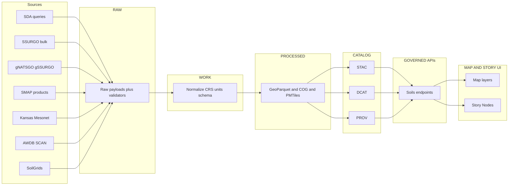

<!-- [KFM_META_BLOCK_V2]
doc_id: kfm://doc/6a2a8d3d-1b76-4aef-acde-4f9d792dc3da
title: Soils Pipelines
type: standard
version: v1
status: draft
owners: ["TODO: KFM Soils Domain Stewards"]
created: 2026-03-04
updated: 2026-03-04
policy_label: public
related:
  - "docs/domains/soils/README.md"
  - "docs/data/soils/sda/README.md"
  - "docs/pipelines/soil/"
  - "docs/standards/KFM_STAC_PROFILE.md"
  - "docs/standards/KFM_DCAT_PROFILE.md"
  - "docs/standards/KFM_PROV_PROFILE.md"
  - "docs/standards/governance/ROOT-GOVERNANCE.md"
tags: ["kfm", "soils", "pipelines"]
notes:
  - "Domain-level pipeline registry for soils. Includes evidence status labels and promotion gates."
[/KFM_META_BLOCK_V2] -->

# Soils Pipelines

Domain index of **Soils** pipelines (ingest → normalize → validate → publish) for Kansas Frontier Matrix (KFM).

> **Impact**
>
> - **Status:** draft (governed content; safe to link, not yet “stable”)
> - **Owners:** TODO (Soils Domain Stewards + Reliability)
> - **Last updated:** 2026-03-04
> - **Primary artifacts:** GeoParquet + COG + (optional) PMTiles; STAC/DCAT/PROV catalogs; signed receipts
> - **Evidence discipline:** each pipeline row includes `Spec` and `Impl` status (CONFIRMED / PROPOSED / UNKNOWN)

**Quick nav**
- [Scope](#scope)
- [Where it fits](#where-it-fits)
- [Acceptable inputs](#acceptable-inputs)
- [Exclusions](#exclusions)
- [Directory tree](#directory-tree)
- [Quickstart](#quickstart)
- [How soils pipelines work](#how-soils-pipelines-work)
- [Architecture diagram](#architecture-diagram)
- [Pipeline registry](#pipeline-registry)
- [Promotion gates](#promotion-gates)
- [QA and policy gates](#qa-and-policy-gates)
- [Observability](#observability)
- [FAQ](#faq)
- [Appendix](#appendix)

---

## Scope

This document covers **Soils domain pipelines**, including:

- **Static authoritative baselines** (SSURGO vectors + gSSURGO/gNATSGO rasters).
- **Query-driven baselines** (SDA/soilDB extracts).
- **Time-series soil moisture** (Mesonet, SCAN/AWDB, SMAP).
- **Global gridded reference layers** (SoilGrids) for context and uncertainty-aware modeling.

---

## Where it fits

KFM’s canonical ordering applies here:

**ETL → STAC/DCAT/PROV catalogs → Neo4j graph → Governed APIs → React/Map UI → Story Nodes → Focus Mode**

**CONFIRMED (policy):** UI/clients must not read from storage directly; all access crosses governed APIs + policy boundary.

**Soils-specific implication:** soils pipelines must always emit catalogs and provenance artifacts alongside data artifacts—no “raw data only” publishing.

---

## Acceptable inputs

### Authoritative sources (typical)
- USDA NRCS **SSURGO** (bulk downloads) and **Soil Data Access** (SDA) queries.
- USDA NRCS **gSSURGO / gNATSGO** gridded distributions.
- Kansas Mesonet soil probe feeds (CSV REST).
- NRCS **SCAN** time-series (often via **AWDB** REST).
- NASA **SMAP** soil moisture products.
- ISRIC **SoilGrids** gridded soil properties.

### Allowed ingest forms
- HTTP/HTTPS downloads (with validators: `ETag`, `Last-Modified`).
- REST/SOAP query endpoints (chunked queries; retry/backoff; result-size aware).
- File geodatabases / GeoTIFFs / HDF5 granules (landed in `data/raw` before transforms).

---

## Exclusions

Do **not** put these in soils pipelines (or promote them) without separate governance approval:

- Proprietary geotech/engineering borings, paid consulting maps, restricted scans.
- Any dataset that includes **PII** or landowner-identifying fields in a public lane.
- “Screen-scraped” feeds that violate provider usage policy (see Mesonet notes below).
- High-sensitivity cultural overlays (keep in their own governance lane and only publish generalized, policy-approved derivatives).

---

## Directory tree

> This is the **target** shape; some paths may be PROPOSED depending on repo state.

~~~text
docs/                                                  # Documentation hub (human-readable): domain guides + pipeline specs + governance links
└─ domains/
   └─ soils/
      ├─ README.md                                     # (Optional) Soils domain overview (scope, stewards, policy_label defaults, links to modules/pipelines)
      ├─ PIPELINES.md                                  # Soils pipeline map (what exists, schedules, inputs/outputs, gates/receipts, links to specs below)
      ├─ DATASETS.md                                   # (Optional) Soils dataset registry (dataset_id, sources, licenses, sensitivity, cadence, owners)
      └─ SCHEMAS.md                                    # (Optional) Soils schema index (artifact schemas/profiles used by soils pipelines + validators)

docs/
└─ data/
   └─ soils/
      └─ sda/
         └─ README.md                                  # Soils Data Access (SDA) module doc (endpoints/queries, licensing, ingest notes, evidence/prov anchors)

docs/
└─ pipelines/
   └─ soil/                                            # Pipeline specs for soils (NOTE: consider aligning “soil/” vs “soils/” naming repo-wide)
      ├─ sda-weekly/
      │  └─ README.md                                  # Weekly SDA + soilDB spec (schedule, parameters, outputs, QA, promotion gates, receipts)
      ├─ differential-updates/
      │  └─ README.md                                  # Differential updates spec (SDA + gNATSGO) (change detection, idempotence, rollback, receipts)
      └─ ssurgo-ks-poc/
         └─ README.md                                  # KS SSURGO + gNATSGO POC spec (if adopted) (experiment boundaries, publish rules, success criteria)

src/
└─ pipelines/
   └─ soils/                                           # Pipeline implementation (watchers/transforms/validators/publishers) producing receipts + governed outputs
      └─ ...                                           # Code modules (runner wiring, deterministic transforms, schema/policy checks, catalog emitters)

data/                                                  # Data truth-path zones (artifacts only; docs/specs live under docs/)
├─ raw/soils/...                                       # RAW: immutable acquisitions/snapshots + checksums (inputs to transforms)
├─ work/soils/...                                      # WORK: staging/intermediate outputs (not publishable; iterative QA)
├─ processed/soils/...                                 # PROCESSED: validated, normalized outputs eligible for cataloging/publishing
├─ catalog/soils/...                                   # CATALOG: DCAT/STAC/PROV triplets + crosslinks for discovery/traceability
└─ prov/soils/...                                      # (PROPOSED) Explicit provenance artifacts (if not embedded in catalog/audit); keep schema-validated + linked

policy/
└─ rego/                                               # Policy-as-code (promotion + dataset access rules): labels/obligations/sensitivity gates for soils artifacts

tests/
├─ data/soils/...                                      # Data/pipeline tests for soils (schema/profile validation, QA thresholds, determinism checks)
└─ policy/...                                          # Policy tests/fixtures (allow/deny/obligations) covering soils datasets and promotion scenarios
~~~

---

## Quickstart

> If you do not have implementations wired yet, treat these as **pseudocode** patterns.

1) **Read the authoritative specs first**
- Weekly SDA + soilDB: `../../pipelines/soil/sda-weekly/README.md`
- Differential updates: `../../pipelines/soil/differential-updates/README.md`

2) **Run a local “clean-room” POC (pseudocode)**
```bash
# PSEUDOCODE — adapt to your repo’s actual CLI / Make targets

# reset outputs for a Kansas soils POC
rm -f data/processed/soils/ks/* prov/receipts/soils/ks/*

# run watcher + transform + publish
python -m src.pipelines.soils.ks_poc.run --aoi kansas --out data/processed/soils/ks
python -m src.pipelines._shared.catalog_update \
  --stac data/catalog/stac/soils \
  --dcat data/catalog/dcat/soils \
  --prov data/prov/soils
```

3) **Validate locally**
```bash
# PSEUDOCODE — examples of the kinds of checks to run
staclint data/catalog/stac/soils/**/*.json
python -m tools.validate_geoparquet data/processed/soils/**/*.parquet
python -m tools.validate_cog data/processed/soils/**/*.tif
conftest test data/prov/soils/**/*.json -p policy/
```

---

## How soils pipelines work

### Core idea
Soils pipelines fall into two broad families:

1) **Baseline (mostly static)**
- SSURGO vectors/tables
- gSSURGO/gNATSGO rasters

2) **Observing layer (time-series)**
- Mesonet and SCAN/AWDB probes
- SMAP satellite soil moisture

### Required outputs per run
Each pipeline run should produce (or update):

- **Data artifacts** (GeoParquet / COG / optional PMTiles)
- **Run receipt** (`prov:run_receipt`) that records:
  - inputs + digests
  - transform versions
  - policy decisions
  - outputs + digests
- **Catalog artifacts**
  - STAC Item(s) / Collection(s)
  - DCAT dataset JSON
  - PROV bundle JSON-LD (or equivalent)

---

## Architecture diagram



---

## Pipeline registry

**Legend**
- `Spec` = do we have a written, versioned specification for this pipeline?
- `Impl` = is there an implemented, runnable pipeline in `src/` and CI?
- `UNKNOWN` requires verification steps (see “Promotion gates” and “Verification steps” notes in each row).

> Keep this table current; it is the review entry-point for soils changes.

| Pipeline ID | Purpose | Cadence / trigger | Inputs | Outputs | Spec | Impl | Primary spec / notes |
|---|---|---:|---|---|---:|---:|---|
| `soil.sda_weekly` | Deterministic weekly sync of SDA + soilDB extracts into soils STAC collections (diff-based batching; WAL-safe upserts). | Weekly | SDA + soilDB | GeoParquet tables + STAC/DCAT/PROV + receipts | **CONFIRMED** | **UNKNOWN** | `../../pipelines/soil/sda-weekly/README.md` |
| `soil.differential_updates` | Differential soil updates pattern (SDA + gNATSGO), designed for smaller refreshes than full repacks. | Change-detect + scheduled | SDA + gNATSGO | Diff reports + updated artifacts + catalogs | **CONFIRMED** | **UNKNOWN** | `../../pipelines/soil/differential-updates/README.md` |
| `soils.ks_ssurgo_gnatsgo_poc` | Kansas POC: components in GeoParquet + mukey raster as COG + paste-ready STAC/DCAT/PROV. | Manual / CI | SDA results + KS gNATSGO raster | Parquet + COG + STAC/DCAT/PROV + receipts | **CONFIRMED** | **UNKNOWN** | PROPOSED path: `../../pipelines/soil/ssurgo-ks-poc/README.md` |
| `soils.asr_watch` | Watch for NRCS Annual Soils Refresh releases and trigger soil baseline rebuilds. | Annual (Oct 1 anchor) | NRCS release pages / bundles | Watch receipts + triggered downstream runs | **PROPOSED** | **UNKNOWN** | Add spec under `docs/pipelines/soil/asr-watch/README.md` |
| `soils.mesonet_watch` | Ingest Mesonet soil moisture and temperature probes as time-series. | 5–60 min (policy-dependent) | Mesonet REST CSV | Partitioned GeoParquet time-series + STAC Items + receipts | **PROPOSED** | **UNKNOWN** | Requires explicit provider permission for automated harvesting before continuous runs. |
| `soils.awdb_scan_watch` | Ingest NRCS SCAN station time-series via AWDB REST. | Hourly / daily | AWDB REST | Partitioned GeoParquet + STAC + receipts | **PROPOSED** | **UNKNOWN** | Add spec; verify terms + rate limits; include station metadata. |
| `soils.smap_ingest` | Ingest SMAP L3 daily composites and L4 root-zone products for temporal soil-moisture layer. | Daily / metadata-driven | SMAP granules | COG or chunked Zarr + STAC + receipts | **PROPOSED** | **UNKNOWN** | Add spec; requires Earthdata credentialed access. |
| `soils.soilgrids_ingest` | Ingest SoilGrids v2 properties (variable/depth) with uncertainty layers. | Metadata-driven | SoilGrids API / downloads | COGs + STAC + attribution-required DCAT | **PROPOSED** | **UNKNOWN** | Add spec; must enforce CC-BY attribution text. |
| `soils.h3_generalization` | Privacy-preserving generalized soils summaries (e.g., H3-indexed derived layers). | Derived-on-demand or scheduled | Processed soils layers | H3 aggregates + STAC + receipts | **PROPOSED** | **UNKNOWN** | Must remain deterministic and policy-audited. |

**Back to top:** [↑](#soils-pipelines)

---

## Promotion gates

A soils artifact can be promoted **RAW → WORK → PROCESSED → PUBLISHED** only if **all gates pass**.

### Minimum promotion contract
- Receipt present and verifiable.
- Canonical digest stable (reproducible hashing).
- Schema validates (domains, CRS tags, not-nulls, units).
- Policy checks pass (license, sensitivity/redaction, signatures if required).
- Catalog validation passes (STAC/DCAT/PROV lint + link integrity).

### Verification steps for `UNKNOWN` implementation status
If any pipeline shows `Impl = UNKNOWN`, the smallest steps to make it **CONFIRMED**:

1. Confirm repo path exists under `src/pipelines/soils/...` (or documented equivalent).
2. Confirm a runnable entry point exists (CLI, Make target, or CI workflow).
3. Confirm a test fixture exists under `tests/data/soils/...`.
4. Confirm a CI job runs policy + schema + STAC validation gates.
5. Confirm outputs land in `data/{raw,work,processed,catalog,prov}/soils/...` with receipts.

---

## QA and policy gates

### Geospatial QA (minimum)
- Geometry validity for vectors before GeoParquet write.
- Domain/range validation (e.g., percent fields are 0–100).
- CRS normalization + explicit CRS metadata.
- COG validity (internal tiling + overviews + blocksize).
- STAC validation (schema + resolvable links).

### Policy gates (fail-closed)
At minimum, enforce via OPA/Conftest:

- Processed artifacts must have a license.
- Public artifacts must not contain PII.
- Every source must include a checksum/digest.
- Promotion requires required attestations when policy says so.

Example (pseudocode policy snippet):
```rego
package kfm.dataset

deny[msg] {
  input.stage == "processed"
  not input.license
  msg := "license is required for processed datasets"
}

deny[msg] {
  input.sensitivity.classification == "public"
  input.pii == true
  msg := "public datasets cannot contain PII"
}
```

---

## Observability

Soils pipelines should emit **low-cardinality, append-only telemetry** that can roll up into SLOs.

Recommended metrics (example set):
- `soil.sda_weekly.soildb_fetch_latency`
- `soil.sda_weekly.hash_mismatches`
- `soil.sda_weekly.validation_errors`
- `soil.sda_weekly.stac_publish_duration`
- `soil.sda_weekly.energy_kwh` (if enabled)
- `soil.sda_weekly.cost_estimate` (if enabled)

Telemetry must:
- be documented under a `telemetry_schema`,
- respect cardinality constraints (avoid labels keyed on `mukey`, `station_id`, etc),
- tie to receipts/PROV where applicable.

---

## FAQ

### Why do we need both SSURGO and gNATSGO?
SSURGO provides detailed vector/tables (high-resolution); gNATSGO provides gridded coverage useful for raster analytics and scalable baselines.

### Why do we require STAC/DCAT/PROV for every publish?
Because KFM’s user-facing map and story layers must be evidence-traceable and reproducible; catalogs are the discovery and governance surface.

### Can we run Mesonet watchers continuously?
Only after confirming provider usage policy requirements and obtaining any required written consent for automated ingestion (fail closed until verified).

---

## Appendix

<details>
<summary><strong>Data sources matrix</strong></summary>

| Source | Type | Typical access | Cadence | License / usage | Notes |
|---|---|---|---:|---|---|
| SSURGO | Vector + relational tables | Bulk downloads; SDA queries | Infrequent + ASR cycle | Public domain (federal soils data) | Baseline spatial + tabular join keys (`areasymbol`, `mukey`). |
| gSSURGO | Gridded product | File geodatabase / raster grids | ASR cycle | Verify | Use for statewide raster baselines; publish as COG. |
| gNATSGO | National gridded product | File geodatabase / rasters | ASR cycle | Verify | Use as CONUS baseline; slice AOI; publish as COG. |
| SDA | Query service | REST/SOAP + SQL-like queries | Continuous | Public domain (typical) | Chunk by `areasymbol` / `mukey` to avoid payload limits. |
| Kansas Mesonet | Station time-series | REST CSV | 5–60 min | Must follow usage policy; permission may be required for automated harvesting | Treat as observing layer; partitioned GeoParquet. |
| SCAN via AWDB | Station time-series | AWDB REST JSON | Hourly / daily | Verify | Federal observing layer; include sensor depths + QC flags if present. |
| SMAP | Satellite gridded fields | HDF5 granules via NSIDC/Earthdata | Daily | Verify | Convert to analysis-ready COG or chunked Zarr; keep uncertainty and product metadata. |
| SoilGrids | Global gridded soil properties | REST API / downloads | Metadata-driven | CC-BY 4.0 (attribution required) | Must preserve attribution and uncertainty bands. |

</details>

<details>
<summary><strong>Canonical soil keys</strong></summary>

Minimum canonical join keys used across soils artifacts:

- `areasymbol`
- `mukey`
- `cokey`
- `chkey`

Recommended KFM-facing fields (when emitting normalized tables):
- `kfm_mukey`
- `kfm_areasymbol`
- `kfm_source` (`NRCS_SSURGO` or `NRCS_SDA`)
- `kfm_ingest_version`
- `kfm_geom_hash`

</details>

---

**Back to top:** [↑](#soils-pipelines)
