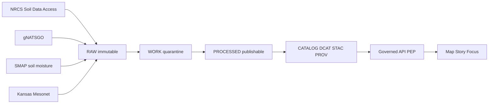

<!-- [KFM_META_BLOCK_V2]
doc_id: kfm://doc/3f5c3d2e-7a1e-4f1f-a2d8-9f4e8a4cdd4a
title: Soils Domain
type: standard
version: v1
status: draft
owners: data-pipelines, geospatial
created: 2026-03-04
updated: 2026-03-04
policy_label: public
related:
  - docs/domains/README.md
  - docs/governance/README.md
tags: [kfm, domains, soils]
notes:
  - This README is evidence-labeled. “Implemented” status is intentionally UNKNOWN unless verified in-repo.
[/KFM_META_BLOCK_V2] -->

# Soils Domain
Authoritative soils (survey + gridded + time-series moisture) ingested into KFM as **policy-gated, provenance-backed** artifacts for Map/Story/Focus.

---

## Impact
**Status:** draft  
**Owners:** `@data-pipelines`, `@geospatial`  
**Policy:** default-deny, fail-closed (promotion gated)

  
  


**Quick nav:**  
- [Scope](#scope)  
- [Where it fits](#where-it-fits-in-kfm)  
- [Sources](#sources)  
- [Canonical outputs](#canonical-outputs)  
- [Quickstart](#quickstart)  
- [Directory layout](#directory-layout)  
- [Policy and gates](#policy-and-gates)  
- [Registries and matrices](#registries-and-matrices)  
- [Definition of done](#definition-of-done)  
- [Reality check](#reality-check-what-is-and-is-not-verified)  
- [Appendix](#appendix)

---

## Scope
### In scope
- **Soil survey backbones** (SSURGO tabular + geometries via NRCS Soil Data Access) **[CONFIRMED as a documented target]**:contentReference[oaicite:2]{index=2}  
- **Statewide gridded soils** (gNATSGO rasters / tiles) **[CONFIRMED as a documented target]**:contentReference[oaicite:3]{index=3}:contentReference[oaicite:4]{index=4}  
- **Time-series soil moisture** (e.g., SMAP L3/L4, Kansas Mesonet REST CSV) **[CONFIRMED as a documented target]**:contentReference[oaicite:5]{index=5}:contentReference[oaicite:6]{index=6}  
- **Derived products** for analysis + web delivery (GeoParquet, COG, optional PMTiles) **[CONFIRMED as a documented pattern]**:contentReference[oaicite:7]{index=7}:contentReference[oaicite:8]{index=8}

### Out of scope
- Any workflow that bypasses KFM’s **trust membrane** (no direct UI access to storage/DB) **[CONFIRMED]**:contentReference[oaicite:9]{index=9}:contentReference[oaicite:10]{index=10}  
- Publishing any dataset version without a **catalog triplet** (DCAT + STAC + PROV) **[CONFIRMED]**:contentReference[oaicite:11]{index=11}:contentReference[oaicite:12]{index=12}  
- Adding sources without a **source registry entry** capturing license/terms + sensitivity **[CONFIRMED]**:contentReference[oaicite:13]{index=13}  
- Any ingestion that violates upstream usage terms (e.g., continuous automated pulls requiring written permission) **[UNKNOWN until terms snapshot is stored + reviewed]**:contentReference[oaicite:14]{index=14}

[Back to top](#soils-domain)

---

## Where it fits in KFM
KFM’s enforced data lifecycle (“truth path”) is:

**Upstream → RAW → WORK/QUARANTINE → PROCESSED → CATALOG (DCAT+STAC+PROV) → PUBLISHED (governed)** **[CONFIRMED]**:contentReference[oaicite:15]{index=15}

Soils domain artifacts must follow this lifecycle. Promotion at each transition is gated by the Promotion Contract, and catalogs must cross-link identifiers so EvidenceRefs resolve. **[CONFIRMED]**:contentReference[oaicite:16]{index=16}

Additionally:
- Clients never access storage directly; access is policy-evaluated at the PEP (Policy Enforcement Point). **[CONFIRMED]**:contentReference[oaicite:17]{index=17}  
- “Citations” are EvidenceRefs that resolve into inspectable EvidenceBundles; if citations cannot be verified/allowed, the system abstains or narrows scope. **[CONFIRMED]**:contentReference[oaicite:18]{index=18}

[Back to top](#soils-domain)

---

## Sources
This domain is organized around *authoritative* backbones plus optional observational layers.

### Backbone sources
1) **NRCS Soil Data Access (SDA) / SSURGO tables + geometry**  
- Mapunit + component schema; SSURGO geometries (mupolygon etc.) **[CONFIRMED as documented target]**:contentReference[oaicite:19]{index=19}  
- Key joins: `mapunit.mukey → component.mukey`, plus `component.cokey` and optional horizons **[CONFIRMED as documented target]**:contentReference[oaicite:20]{index=20}

2) **gNATSGO statewide gridded soils (MUKEY raster / tiles)**  
- Used as a statewide grid; join tabular outputs via `mukey` **[CONFIRMED as documented target]**:contentReference[oaicite:21]{index=21}:contentReference[oaicite:22]{index=22}

### Observational layers
3) **Kansas Mesonet soil telemetry (REST CSV)**  
- REST endpoints and helper endpoints for variables/station lists are described in the watcher notes. **[CONFIRMED as documented target]**:contentReference[oaicite:23]{index=23}  
- **Governance note:** Automated ingestion at scale may require written consent per usage policy. **[UNKNOWN until the policy snapshot is stored in the source registry]**:contentReference[oaicite:24]{index=24}

4) **SMAP soil moisture products (L3/L4)**  
- Included as a documented temporal layer to complement static survey/grids. **[CONFIRMED as documented target]**:contentReference[oaicite:25]{index=25}

[Back to top](#soils-domain)

---

## Canonical outputs
The Kansas soils watcher pattern defines “canonical outputs” as:

1) **Mapunit × Component (GeoParquet)**  
- Deterministic path includes `spec_hash` **[CONFIRMED as documented target]**:contentReference[oaicite:26]{index=26}  
- Example path pattern:  
  `data/processed/soils/ssurgo/kansas/spec=<spec_hash>/mapunit_components.parquet` **[CONFIRMED]**:contentReference[oaicite:27]{index=27}

2) **gNATSGO rasters (COG)**  
- Deterministic path includes `spec_hash` **[CONFIRMED as documented target]**:contentReference[oaicite:28]{index=28}  
- Example path pattern:  
  `data/processed/soils/gnatsgo/kansas/spec=<spec_hash>/gnatsgo-R-<tile>.tif` **[CONFIRMED]**:contentReference[oaicite:29]{index=29}

3) **Catalog triplet + receipts + attestations**
- STAC Collection + Items and PROV bundle are emitted and then policy-gated prior to publish. **[CONFIRMED]**:contentReference[oaicite:30]{index=30}:contentReference[oaicite:31]{index=31}  
- Example STAC item fields include `spec_hash` and `run_receipt`. **[CONFIRMED as documented template]**:contentReference[oaicite:32]{index=32}

4) **Optional web derivatives**
- GeoParquet remains source-of-truth; vector tiles (e.g., PMTiles) are derived from canonical parquet. **[CONFIRMED as documented pattern]**:contentReference[oaicite:33]{index=33}

[Back to top](#soils-domain)

---

## Quickstart
> IMPORTANT: The commands below are **pseudocode** unless the referenced paths exist in-repo.  
> See [Reality check](#reality-check-what-is-and-is-not-verified) for the minimal verification steps.

### 1) Run the soils watcher (Kansas)
```bash
# pseudocode
python -m src.pipelines.soils.watcher.run \
  --spec src/pipelines/soils/watcher/spec.yaml \
  --aoi kansas \
  --out data/
```

Expected behavior (documented):
- Acquire + normalize
- Run QA (hard fail on breach)
- Change detection to classify `{material, minor}`
- Package artifacts + generate STAC + PROV
- Cosign attestations
- OPA/Conftest policy gate
- Publish only if signature + policy pass **[CONFIRMED as documented pipeline]**:contentReference[oaicite:34]{index=34}

### 2) Validate run manifest shape
```bash
# pseudocode: run manifest fields are documented; validate with schema in contracts/
jq -e '.spec_hash and .sources and .qa and .change_detection and .artifacts' \
  data/work/soils/kansas/latest/run_manifest.json
```

The run manifest shape and example fields (including QA and change detection) are explicitly documented. **[CONFIRMED]**:contentReference[oaicite:35]{index=35}

### 3) Policy gate before publish
```bash
# pseudocode: policy location may differ (policy/ vs policies/)
conftest test data/work/soils/kansas/latest/run_manifest.json -p policy/
```

Fail-closed publish rule: **no publish without valid signatures + policy pass** is explicitly documented. **[CONFIRMED]**:contentReference[oaicite:36]{index=36}:contentReference[oaicite:37]{index=37}

[Back to top](#soils-domain)

---

## Directory layout
This README targets `docs/domains/soils/`. The *suggested* canonical repo layout for soils is documented as a reference shape. **[CONFIRMED as documented suggestion; implementation status UNKNOWN]**:contentReference[oaicite:38]{index=38}

```text
docs/
  domains/
    soils/
      README.md                         <-- you are here
      datasets/                         <-- dataset cards (DCAT-focused) [PROPOSED]
      pipelines/                        <-- watcher/pipeline notes [PROPOSED]
data/
  raw/soils/{ssurgo,gnatsgo}/...        [PROPOSED]
  processed/soils/
    ssurgo/kansas/spec=<spec_hash>/...  [PROPOSED]
    gnatsgo/kansas/spec=<spec_hash>/... [PROPOSED]
  catalog/
    stac/soils/kansas/<spec_hash>/...   [PROPOSED]
src/
  pipelines/soils/watcher/              [PROPOSED]
policy/
  soils.rego                            [PROPOSED]
.github/
  workflows/soils-watcher.yml           [PROPOSED]
```

- Items marked **[PROPOSED]** are consistent with the documented layout pattern but not verified in this repo snapshot. :contentReference[oaicite:39]{index=39}

[Back to top](#soils-domain)

---

## Soils truth path diagram


Truth path + catalog triplet + trust membrane requirements are documented as KFM invariants. **[CONFIRMED]**:contentReference[oaicite:40]{index=40}:contentReference[oaicite:41]{index=41}

[Back to top](#soils-domain)

---

## Policy and gates
### Non-negotiable gates
- **No catalog → no UI → no Focus claims** (DCAT + STAC + PROV must cross-link) **[CONFIRMED]**:contentReference[oaicite:42]{index=42}  
- **Trust membrane**: frontend must not fetch directly from storage/DB **[CONFIRMED]**:contentReference[oaicite:43]{index=43}  
- **EvidenceRef semantics**: citations resolve to EvidenceBundles; fail closed if not resolvable/allowed **[CONFIRMED]**:contentReference[oaicite:44]{index=44}  
- **Source registry required** (license/terms snapshot, sensitivity classification, cadence, access method) **[CONFIRMED]**:contentReference[oaicite:45]{index=45}

### Promotion manifest
Promotion manifests record dataset release info including spec_hash, artifacts with digests, catalogs with digests, QA status, and policy decision metadata. **[CONFIRMED]**:contentReference[oaicite:46]{index=46}

[Back to top](#soils-domain)

---

## Registries and matrices
### Source registry matrix
| Source | Access | Keys | Cadence | License/terms | Sensitivity default |
|---|---|---|---|---|---|
| NRCS SDA (SSURGO tabular + geometry) | SQL/REST | `mukey`, `cokey` | PROPOSED annual refresh | **UNKNOWN** (store terms snapshot in registry) | public (default) |
| gNATSGO gridded soils | bulk distribution | `mukey` raster | PROPOSED annual | **UNKNOWN** (store terms snapshot in registry) | public (default) |
| Kansas Mesonet | REST CSV | station id + time | near-real-time | **UNKNOWN**; may restrict continuous harvesting | public but terms-gated |
| SMAP L3/L4 | bulk distribution | grid + time | frequent cadence | **UNKNOWN** (store terms snapshot in registry) | public (default) |

Why “UNKNOWN” for license/terms here: KFM requires a registry entry with a **license/terms snapshot** before promotion; this README will not guess those terms. **[CONFIRMED requirement]**:contentReference[oaicite:47]{index=47}

### Canonical artifact matrix
| Artifact | Zone | Format | Must have | Notes |
|---|---|---|---|---|
| `mapunit_components.parquet` | PROCESSED | GeoParquet | checksum/digest, spec_hash path | Documented canonical output **[CONFIRMED]**:contentReference[oaicite:48]{index=48} |
| `gnatsgo-R-<tile>.tif` | PROCESSED | COG | overviews, tiling | Documented canonical output **[CONFIRMED]**:contentReference[oaicite:49]{index=49} |
| `collection.json` + `items/*.json` | CATALOG | STAC | cross-links to DCAT/PROV | Required by KFM invariants **[CONFIRMED]**:contentReference[oaicite:50]{index=50} |
| `prov.json` | CATALOG | W3C PROV | lineage graph | Documented as required surface **[CONFIRMED]**:contentReference[oaicite:51]{index=51} |
| `run_manifest.json` / `run_receipt.json` | WORK/CATALOG | JSON | QA + change detection | Documented fields **[CONFIRMED]**:contentReference[oaicite:52]{index=52} |
| signatures/attestations | CATALOG | cosign in-toto | bound to digests | No publish without signatures + policy pass **[CONFIRMED]**:contentReference[oaicite:53]{index=53}:contentReference[oaicite:54]{index=54} |

[Back to top](#soils-domain)

---

## Definition of done
A soils dataset version is eligible for **PUBLISHED** only when all items below are true:

- [ ] **Source registry entry exists** with license/terms snapshot + sensitivity classification **[CONFIRMED]**:contentReference[oaicite:55]{index=55}  
- [ ] RAW artifacts + checksums captured (append-only) **[CONFIRMED as truth-path behavior]**:contentReference[oaicite:56]{index=56}  
- [ ] PROCESSED artifacts written to deterministic `spec=<spec_hash>` paths **[CONFIRMED]**:contentReference[oaicite:57]{index=57}  
- [ ] QA report fields recorded (geometry validity, join integrity, drift thresholds, CRS) **[CONFIRMED]**:contentReference[oaicite:58]{index=58}  
- [ ] Change detection recorded and `release_kind` set **[CONFIRMED]**:contentReference[oaicite:59]{index=59}  
- [ ] Catalog triplet emitted and cross-linked (DCAT + STAC + PROV) **[CONFIRMED]**:contentReference[oaicite:60]{index=60}  
- [ ] Cosign attestations produced and policy gate passes (fail closed) **[CONFIRMED]**:contentReference[oaicite:61]{index=61}:contentReference[oaicite:62]{index=62}  
- [ ] Threat-model checklist satisfied: frontend never fetches directly from storage/DB **[CONFIRMED]**:contentReference[oaicite:63]{index=63}

[Back to top](#soils-domain)

---

## Reality check: what is and is not verified
### Confirmed
- KFM truth-path lifecycle, trust membrane, and catalog triplet requirements are documented. **[CONFIRMED]**:contentReference[oaicite:64]{index=64}:contentReference[oaicite:65]{index=65}  
- A Kansas soils watcher pattern (SDA + gNATSGO → GeoParquet + COG + STAC/PROV + signatures + policy gate) is documented. **[CONFIRMED]**:contentReference[oaicite:66]{index=66}:contentReference[oaicite:67]{index=67}

### Unknown
- Whether `src/pipelines/soils/watcher/` exists and is runnable in the current repo. **[UNKNOWN]**
- Whether soils catalogs already exist under `data/catalog/…`. **[UNKNOWN]**
- Final, governed license classifications for each upstream source (must be proven by terms snapshots). **[UNKNOWN]**:contentReference[oaicite:68]{index=68}

### Smallest verification steps
1) `ls docs/domains/soils/` (confirm this README lands)  
2) `ls src/pipelines/soils/` (confirm pipeline modules exist)  
3) Search for existing policy packs: `ls policy/ | grep -i soils`  
4) Confirm catalogs: `find data -path '*catalog*soils*' -maxdepth 6 -type f | head`  
5) Validate one candidate run manifest with Conftest (if policies exist).

[Back to top](#soils-domain)

---

## Appendix
<details>
<summary>Attribute targets and suggested SDA pulls</summary>

A documented step-by-step suggests extracting SSURGO component/horizon attributes like:
- `awc_r` (water capacity), `ksat_r` (saturated conductivity)  
- `kwfact / kffact / usle_k` (erodibility)  
- texture fractions `sandtotal_r / silttotal_r / claytotal_r`  
- depths `hzdept_r / hzdepb_r`  
- weights `comppct_r`  
**[CONFIRMED as documented target list]**:contentReference[oaicite:69]{index=69}

It also documents the packaging goal as statewide GeoPackage / COGs / SQLite SSURGO for tabular joins (as one possible deliverable set). **[CONFIRMED as documented option; not required by KFM]**:contentReference[oaicite:70]{index=70}

</details>

<details>
<summary>STAC item template snippet for soils</summary>

A paste-ready STAC item template for soils includes `spec_hash` and `run_receipt` fields and references a GeoParquet “components” asset and a MUKEY raster asset. **[CONFIRMED as documented template]**:contentReference[oaicite:71]{index=71}

</details>
